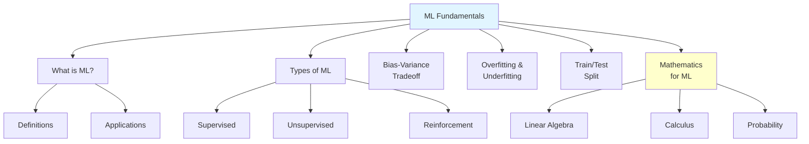
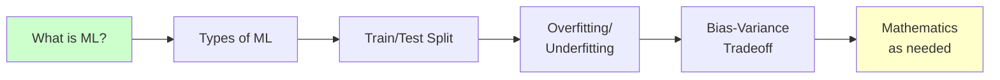

# ML Fundamentals

**Master the foundation of machine learning.** Essential concepts, mathematical intuition, and core principles that every ML practitioner must know.

**Difficulty:** 🟢 Beginner | **Time:** 2-3 weeks | **Prerequisites:** Basic Python, Math

---

## 🎯 Learning Objectives

After completing this section, you will:

- [ ] Understand what machine learning is and its types
- [ ] Explain bias-variance tradeoff and its implications
- [ ] Identify overfitting and underfitting in models
- [ ] Apply proper train/test/validation splitting
- [ ] Master mathematical foundations (linear algebra, calculus, probability)
- [ ] Evaluate model performance using appropriate metrics

---

## 📚 Topics Overview


```mermaid
graph TB
    Start[ML Fundamentals] --> WhatML[What is ML?]
    Start --> Types[Types of ML]
    Start --> BiasVar[Bias-Variance<br/>Tradeoff]
    Start --> OverUnder[Overfitting &<br/>Underfitting]
    Start --> Split[Train/Test<br/>Split]
    Start --> Math[Mathematics<br/>for ML]

    WhatML --> Def[Definitions]
    WhatML --> Apps[Applications]

    Types --> Super[Supervised]
    Types --> Unsuper[Unsupervised]
    Types --> Reinf[Reinforcement]

    Math --> LinAlg[Linear Algebra]
    Math --> Calc[Calculus]
    Math --> Prob[Probability]

    style Start fill:#e1f5ff
    style Math fill:#ffffcc
```

---

## 🧠 Core Concepts

### 1. What is Machine Learning? 🟢
**Learn the fundamentals of ML and how it differs from traditional programming**

Understand machine learning definitions, paradigms, and real-world applications.

**Key Concepts:**
- Traditional programming vs ML
- Learning from data
- Generalization
- Types of learning tasks
- ML workflow and pipeline

**File:** [what-is-ml.md](what-is-ml.md)

**Time to Complete:** 2-3 hours

---

### 2. Types of Machine Learning 🟢
**Explore the three main paradigms: Supervised, Unsupervised, and Reinforcement Learning**

Understand when to use each type of ML and their characteristics.

**Key Concepts:**
- **Supervised Learning:** Learn from labeled data
  - Classification (discrete outputs)
  - Regression (continuous outputs)
- **Unsupervised Learning:** Find patterns in unlabeled data
  - Clustering
  - Dimensionality reduction
  - Anomaly detection
- **Reinforcement Learning:** Learn through trial and error
  - Agent, environment, rewards
- **Semi-Supervised Learning:** Mix of labeled and unlabeled
- **Self-Supervised Learning:** Learn from data itself

**Visual Guide:**
```
Supervised Learning: (X, y) → Model → Predictions
Unsupervised Learning: (X) → Model → Patterns/Structure
Reinforcement Learning: Agent ↔ Environment (Actions/Rewards)
```

**File:** [types-of-ml.md](types-of-ml.md)

**Time to Complete:** 3-4 hours

---

### 3. Bias-Variance Tradeoff 🟡
**Master one of the most important concepts in ML**

Understand the fundamental tradeoff between bias and variance and its impact on model performance.

**Key Concepts:**
- **Bias:** Error from wrong assumptions (underfitting)
- **Variance:** Error from sensitivity to training data (overfitting)
- **Irreducible Error:** Noise in the data
- Total Error = Bias² + Variance + Irreducible Error
- Finding the sweet spot
- Model complexity and error

**Visual Representation:**
```
High Bias, Low Variance → Underfitting (too simple)
Low Bias, High Variance → Overfitting (too complex)
Low Bias, Low Variance → Just right! (goal)
```

**Practical Implications:**
- Simple models → High bias, low variance
- Complex models → Low bias, high variance
- Regularization → Reduce variance
- More features → Reduce bias

**File:** [bias-variance-tradeoff.md](bias-variance-tradeoff.md)

**Time to Complete:** 3-4 hours

**Interview Importance:** ⭐⭐⭐⭐⭐ (Always asked!)

---

### 4. Overfitting & Underfitting 🟢
**Learn to identify and prevent the two most common ML problems**

Recognize signs of overfitting/underfitting and apply techniques to fix them.

**Key Concepts:**
- **Underfitting (High Bias):**
  - Model too simple
  - Poor performance on training and test data
  - High training error
- **Overfitting (High Variance):**
  - Model too complex
  - Great on training, poor on test data
  - Memorizing training data

**Detection Methods:**
- Learning curves
- Cross-validation
- Train vs validation error gap

**Solutions:**

| Problem | Solutions |
|---------|-----------|
| **Underfitting** | • More features<br/>• More complex model<br/>• Train longer<br/>• Reduce regularization |
| **Overfitting** | • More training data<br/>• Regularization (L1, L2)<br/>• Dropout<br/>• Early stopping<br/>• Reduce features<br/>• Simpler model |

**File:** [overfitting-underfitting.md](overfitting-underfitting.md)

**Time to Complete:** 2-3 hours

---

### 5. Train/Test Split 🟢
**Learn proper data splitting for reliable model evaluation**

Master the essential practice of splitting data to evaluate model performance.

**Key Concepts:**
- **Why split?** Evaluate generalization
- **Three-way split:**
  - **Training set (60-80%):** Learn patterns
  - **Validation set (10-20%):** Tune hyperparameters
  - **Test set (10-20%):** Final evaluation
- **Random splitting:** Shuffle data first
- **Stratified splitting:** Maintain class distribution
- **Time series splitting:** No random shuffle!

**Common Ratios:**
```
Small dataset (< 10K):     60/20/20 or 70/15/15
Medium dataset (10K-1M):   70/15/15 or 80/10/10
Large dataset (> 1M):      98/1/1 (fixed validation size)
```

**Critical Rules:**
- ⚠️ **Never train on test data!**
- ⚠️ **Never tune on test data!**
- ⚠️ **Test only once at the end!**
- ✅ Always split before preprocessing

**Advanced Topics:**
- Cross-validation
- K-fold CV
- Leave-one-out CV
- Time series CV

**File:** [train-test-split.md](train-test-split.md)

**Time to Complete:** 2-3 hours

---

### 6. Mathematics for ML 🟡
**Build the mathematical foundation for understanding ML algorithms**

Master the essential mathematics: linear algebra, calculus, and probability.

#### 6.1 Linear Algebra
**Vectors, matrices, and operations**

**Key Concepts:**
- Vectors and vector operations
- Matrices and matrix multiplication
- Transpose, inverse
- Eigenvalues and eigenvectors
- Dot product and norms

**Why Important:**
- Data is represented as matrices
- ML algorithms use matrix operations
- Understanding PCA, SVD
- Neural network computations

**Essential Operations:**
```
X: (n × m) data matrix (n samples, m features)
w: (m × 1) weight vector
y: (n × 1) predictions
y = Xw (matrix-vector multiplication)
```

#### 6.2 Calculus
**Derivatives and gradients for optimization**

**Key Concepts:**
- Derivatives and partial derivatives
- Gradient (vector of partial derivatives)
- Chain rule (backpropagation!)
- Optimization and gradient descent

**Why Important:**
- Minimizing loss functions
- Backpropagation in neural networks
- Understanding convergence

**Key Formulas:**
```
Gradient: ∇f = [∂f/∂x₁, ∂f/∂x₂, ..., ∂f/∂xₙ]
Gradient Descent: θ = θ - α∇J(θ)
```

#### 6.3 Probability & Statistics
**Distributions, expectation, and inference**

**Key Concepts:**
- Probability distributions (Normal, Bernoulli, etc.)
- Expected value and variance
- Bayes' theorem
- Maximum Likelihood Estimation (MLE)
- Hypothesis testing

**Why Important:**
- Understanding uncertainty
- Probabilistic models (Naive Bayes)
- Confidence intervals
- Statistical significance

**Essential Formulas:**
```
Bayes' Theorem: P(A|B) = P(B|A)P(A) / P(B)
Expected Value: E[X] = Σ x·P(x)
Variance: Var(X) = E[(X - μ)²]
```

**File:** [mathematics.md](mathematics.md)

**Time to Complete:** 1-2 weeks (can study in parallel with other topics)

---

## 🎯 Learning Path

### For Complete Beginners

```mermaid
graph LR
    A[What is ML?] --> B[Types of ML]
    B --> C[Train/Test Split]
    C --> D[Overfitting/<br/>Underfitting]
    D --> E[Bias-Variance<br/>Tradeoff]
    E --> F[Mathematics<br/>as needed]

    style A fill:#ccffcc
    style F fill:#ffffcc
```

**Recommended Order:**
1. [What is ML?](what-is-ml.md) - Start here!
2. [Types of ML](types-of-ml.md) - Understand the landscape
3. [Train/Test Split](train-test-split.md) - Essential practice
4. [Overfitting & Underfitting](overfitting-underfitting.md) - Common problems
5. [Bias-Variance Tradeoff](bias-variance-tradeoff.md) - Theoretical understanding
6. [Mathematics](mathematics.md) - Deepen understanding (ongoing)

### For Those with Programming Background
Start with [Types of ML](types-of-ml.md), then focus on [Bias-Variance Tradeoff](bias-variance-tradeoff.md) and [Mathematics](mathematics.md).

---

## 📊 Quick Reference

### Key Concepts Cheatsheet

| Concept | Definition | Importance |
|---------|------------|------------|
| **Supervised Learning** | Learning from labeled data | Most common ML type |
| **Bias** | Error from wrong assumptions | Causes underfitting |
| **Variance** | Error from data sensitivity | Causes overfitting |
| **Overfitting** | Model memorizes training data | Poor generalization |
| **Train/Test Split** | Separate data for evaluation | Measure generalization |
| **Cross-Validation** | Multiple train/test splits | Robust evaluation |

---

## 🛠️ Hands-On Practice

### Mini Projects

1. **Exploratory Data Analysis**
   - Load a dataset (Iris, Boston Housing)
   - Visualize distributions
   - Split into train/test
   - Calculate basic statistics

2. **Overfitting Demonstration**
   - Fit polynomials of different degrees
   - Plot learning curves
   - Identify overfitting
   - Apply regularization

3. **Mathematics Implementation**
   - Implement matrix operations
   - Code gradient descent from scratch
   - Visualize probability distributions

### Coding Exercises

```python
# Exercise 1: Train/Test Split
from sklearn.model_selection import train_test_split
X_train, X_test, y_train, y_test = train_test_split(
    X, y, test_size=0.2, random_state=42, stratify=y
)

# Exercise 2: Check for Overfitting
from sklearn.linear_model import LinearRegression
from sklearn.metrics import mean_squared_error

model = LinearRegression()
model.fit(X_train, y_train)

train_error = mean_squared_error(y_train, model.predict(X_train))
test_error = mean_squared_error(y_test, model.predict(X_test))

if test_error >> train_error:
    print("Overfitting detected!")

# Exercise 3: Learning Curves
from sklearn.model_selection import learning_curve
import matplotlib.pyplot as plt

train_sizes, train_scores, val_scores = learning_curve(
    model, X, y, cv=5
)
# Plot and analyze
```

---

## ⚠️ Common Misconceptions

!!! warning "Pitfalls to Avoid"
    1. **"More data always helps"**
       - Only if you have high variance problem
       - More data doesn't fix high bias

    2. **"Test set is for tuning hyperparameters"**
       - NO! Use validation set for tuning
       - Test set is for final evaluation only

    3. **"Complex models are always better"**
       - Simple models can outperform on small datasets
       - Complexity should match data size

    4. **"Math is optional for ML"**
       - Math helps debugging and understanding
       - Critical for advanced topics

---

## 📚 Additional Resources

### Books
- *An Introduction to Statistical Learning* - Chapter 2
- *The Elements of Statistical Learning* - Chapter 2, 7
- *Mathematics for Machine Learning* - Free online

### Online Courses
- Andrew Ng's ML Course - Week 1-3
- Fast.ai - Lesson 1
- StatQuest (YouTube) - Bias-Variance, Overfitting

### Interactive Tools
- [TensorFlow Playground](http://playground.tensorflow.org/) - Visualize overfitting
- [Seeing Theory](https://seeing-theory.brown.edu/) - Probability visualizations

---

## 🎓 Self-Assessment

Test your understanding:

### Basic Level 🟢
- [ ] Can you explain ML to a non-technical person?
- [ ] Can you identify supervised vs unsupervised problems?
- [ ] Can you properly split data into train/test?

### Intermediate Level 🟡
- [ ] Can you explain bias-variance tradeoff with examples?
- [ ] Can you identify overfitting from learning curves?
- [ ] Can you apply regularization to reduce overfitting?

### Advanced Level 🔴
- [ ] Can you derive the bias-variance decomposition?
- [ ] Can you implement cross-validation from scratch?
- [ ] Can you explain mathematical foundations of gradient descent?

---

## 🚀 Next Steps

**After mastering fundamentals:**

1. **Start with Supervised Learning:**
   - [Linear Regression](../supervised-learning/regression/linear-regression.md) - Simple and intuitive
   - [Logistic Regression](../supervised-learning/classification/logistic-regression.md) - Classification basics

2. **Learn Model Evaluation:**
   - [Classification Metrics](../evaluation/classification-metrics.md)
   - [Regression Metrics](../evaluation/regression-metrics.md)
   - [Cross-Validation](../evaluation/cross-validation.md)

3. **Build Your First Project:**
   - Choose a simple dataset (Iris, Titanic)
   - Apply train/test split
   - Train a model
   - Evaluate and iterate

---

**Ready to build your ML foundation?** Start with [What is ML?](what-is-ml.md) 🚀

**Remember:** These fundamentals are the bedrock of all ML. Take your time to truly understand them!
