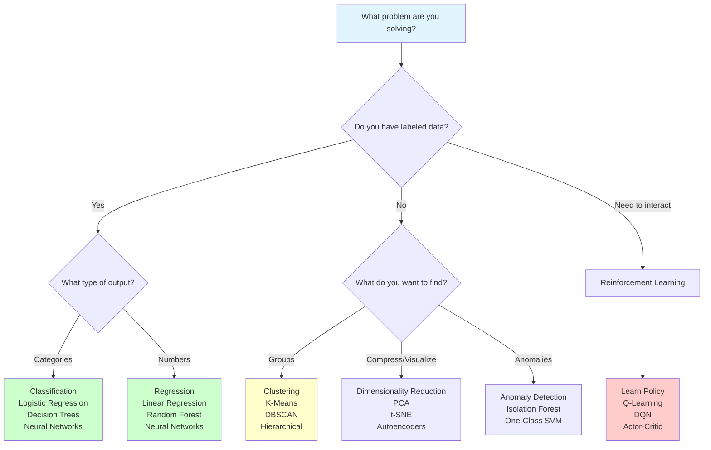

# Types of Machine Learning

**Understanding the three main paradigms: Supervised, Unsupervised, and Reinforcement Learning.** Each type solves different problems and uses different learning strategies.

**Difficulty:** 🟢 Beginner | **Time:** 3-4 hours | **Prerequisites:** [What is ML?](what-is-ml.md)

---

## Quick Reference

| Type | Data | Goal | Examples | Complexity |
|------|------|------|----------|------------|
| **Supervised** | Labeled (X, y) | Predict output from input | Classification, Regression | 🟢 Easiest |
| **Unsupervised** | Unlabeled (X only) | Find structure/patterns | Clustering, Dimensionality Reduction | 🟡 Medium |
| **Reinforcement** | Rewards/penalties | Learn optimal actions | Game playing, Robotics | 🔴 Hardest |
| **Semi-Supervised** | Mostly unlabeled + few labeled | Leverage unlabeled data | Text classification | 🟡 Medium |
| **Self-Supervised** | Self-generated labels | Learn representations | BERT, GPT pretraining | 🔴 Advanced |

---

## Complete Guide

=== "📖 Overview"
    ## The Three Main Paradigms

    Machine learning problems can be categorized by how they learn:

    ```mermaid
    graph TB
        ML[Machine Learning] --> Sup[Supervised Learning<br/>Learn from labeled examples]
        ML --> Unsup[Unsupervised Learning<br/>Find patterns in unlabeled data]
        ML --> RL[Reinforcement Learning<br/>Learn from trial and error]

        Sup --> Class[Classification<br/>Discrete outputs]
        Sup --> Reg[Regression<br/>Continuous outputs]

        Unsup --> Clust[Clustering<br/>Group similar data]
        Unsup --> DimRed[Dim. Reduction<br/>Compress data]
        Unsup --> Anom[Anomaly Detection<br/>Find outliers]

        RL --> Policy[Policy Learning<br/>What to do]
        RL --> Value[Value Learning<br/>How good is state]

        style ML fill:#e1f5ff
        style Sup fill:#ccffcc
        style Unsup fill:#ffffcc
        style RL fill:#ffcccc
    ```

    ---

    ## 1. Supervised Learning

    **Learn from labeled examples to make predictions.**

    **Analogy:** Learning with a teacher who provides correct answers.

    **Data Format:**
    ```
    Training: (X, y) pairs
    X = features (input)
    y = labels (correct output)
    ```

    **Goal:** Learn function f: X → y that generalizes to new data.

    **When to Use:**
    - Have labeled training data
    - Clear input-output relationship
    - Want to predict specific outputs

    **Subtypes:**
    - **Classification:** Discrete outputs (categories)
    - **Regression:** Continuous outputs (numbers)

    ---

    ## 2. Unsupervised Learning

    **Find hidden patterns and structure in unlabeled data.**

    **Analogy:** Exploring a new city without a map - discovering structure yourself.

    **Data Format:**
    ```
    Only X (features)
    No labels provided
    ```

    **Goal:** Discover underlying structure, patterns, or representations.

    **When to Use:**
    - No labeled data available
    - Want to understand data structure
    - Exploratory data analysis
    - Data preprocessing

    **Subtypes:**
    - **Clustering:** Group similar items
    - **Dimensionality Reduction:** Compress data
    - **Anomaly Detection:** Find outliers

    ---

    ## 3. Reinforcement Learning

    **Learn optimal behavior through trial and error with rewards.**

    **Analogy:** Training a dog - reward good behavior, penalize bad behavior.

    **Data Format:**
    ```
    Agent interacts with environment
    Receives rewards/penalties for actions
    No explicit correct answers upfront
    ```

    **Goal:** Learn policy (what to do) that maximizes cumulative reward.

    **When to Use:**
    - Sequential decision making
    - Delayed rewards
    - Learning through interaction
    - Game playing, robotics

    **Components:**
    - **Agent:** Learner/decision maker
    - **Environment:** What agent interacts with
    - **Actions:** Choices agent can make
    - **Rewards:** Feedback signal

=== "🧮 Theory & Math"
    ## Supervised Learning - Mathematical Framework

    ### Classification

    **Goal:** Learn function $f: X \rightarrow Y$ where $Y$ is discrete.

    **Example:** Email spam detection
    - $X$ = email features (words, sender, etc.)
    - $Y$ = {spam, not spam}

    **Model:**
    $$h_\theta(x) = \text{class prediction}$$

    **Loss Function (0-1 loss):**
    $$L(h(x), y) = \begin{cases} 0 & \text{if } h(x) = y \\ 1 & \text{if } h(x) \neq y \end{cases}$$

    **Common Algorithms:**
    - Logistic Regression: $P(y=1|x) = \sigma(\theta^T x)$
    - Decision Trees: Partition space with if-then rules
    - Support Vector Machines: Find optimal separating hyperplane
    - Neural Networks: Layers of non-linear transformations

    ---

    ### Regression

    **Goal:** Learn function $f: X \rightarrow \mathbb{R}$ where output is continuous.

    **Example:** House price prediction
    - $X$ = [size, bedrooms, location, age]
    - $Y$ = price (continuous number)

    **Model:**
    $$h_\theta(x) = \theta_0 + \theta_1 x_1 + ... + \theta_n x_n$$

    **Loss Function (MSE):**
    $$J(\theta) = \frac{1}{m}\sum_{i=1}^{m}(h_\theta(x^{(i)}) - y^{(i)})^2$$

    **Objective:** Minimize $J(\theta)$ to find best $\theta$.

    ---

    ## Unsupervised Learning - Mathematical Framework

    ### Clustering

    **Goal:** Partition data into K groups of similar items.

    **K-Means Objective:**
    $$\min \sum_{i=1}^{K}\sum_{x \in C_i}||x - \mu_i||^2$$

    Where:
    - $C_i$ = cluster i
    - $\mu_i$ = centroid of cluster i

    **Algorithm:**
    1. Initialize K centroids randomly
    2. Assign each point to nearest centroid
    3. Update centroids as mean of assigned points
    4. Repeat until convergence

    ---

    ### Dimensionality Reduction

    **Goal:** Reduce features from n to k (k << n) while preserving information.

    **PCA (Principal Component Analysis):**

    Find directions of maximum variance:
    $$\max_w \frac{w^T X^T X w}{w^T w}$$

    **Result:** Project data onto principal components.

    **Benefits:**
    - Visualization (reduce to 2D/3D)
    - Noise reduction
    - Speed up training
    - Remove redundant features

    ---

    ## Reinforcement Learning - Mathematical Framework

    ### Markov Decision Process (MDP)

    **Components:**
    - **States:** $s \in S$
    - **Actions:** $a \in A$
    - **Transition:** $P(s'|s,a)$ - probability of next state
    - **Reward:** $R(s,a)$ - immediate reward
    - **Policy:** $\pi(a|s)$ - what action to take in state s

    **Goal:** Find policy $\pi^*$ that maximizes expected cumulative reward.

    **Value Function:**
    $$V^\pi(s) = \mathbb{E}[\sum_{t=0}^{\infty}\gamma^t R(s_t, a_t) | \pi]$$

    Where $\gamma$ is discount factor (0 < γ < 1).

    **Bellman Equation:**
    $$V(s) = \max_a [R(s,a) + \gamma \sum_{s'}P(s'|s,a)V(s')]$$

    **Q-Learning Update:**
    $$Q(s,a) := Q(s,a) + \alpha[R + \gamma \max_{a'}Q(s',a') - Q(s,a)]$$

=== "💻 Implementation"
    ## Supervised Learning - Classification

    ```python
    import numpy as np
    import matplotlib.pyplot as plt
    from sklearn.datasets import make_classification
    from sklearn.model_selection import train_test_split
    from sklearn.linear_model import LogisticRegression
    from sklearn.metrics import accuracy_score, classification_report

    # Generate classification dataset
    X, y = make_classification(
        n_samples=1000,
        n_features=20,
        n_informative=15,
        n_redundant=5,
        n_classes=2,
        random_state=42
    )

    # Split data
    X_train, X_test, y_train, y_test = train_test_split(
        X, y, test_size=0.2, random_state=42
    )

    # Train classifier
    clf = LogisticRegression(random_state=42)
    clf.fit(X_train, y_train)

    # Predict
    y_pred = clf.predict(X_test)

    # Evaluate
    accuracy = accuracy_score(y_test, y_pred)
    print(f"Classification Accuracy: {accuracy:.3f}")
    print("\nClassification Report:")
    print(classification_report(y_test, y_pred))
    ```

    ---

    ## Supervised Learning - Regression

    ```python
    from sklearn.datasets import make_regression
    from sklearn.linear_model import LinearRegression
    from sklearn.metrics import mean_squared_error, r2_score

    # Generate regression dataset
    X, y = make_regression(
        n_samples=1000,
        n_features=10,
        noise=20,
        random_state=42
    )

    # Split data
    X_train, X_test, y_train, y_test = train_test_split(
        X, y, test_size=0.2, random_state=42
    )

    # Train regressor
    reg = LinearRegression()
    reg.fit(X_train, y_train)

    # Predict
    y_pred = reg.predict(X_test)

    # Evaluate
    mse = mean_squared_error(y_test, y_pred)
    r2 = r2_score(y_test, y_pred)

    print(f"Mean Squared Error: {mse:.2f}")
    print(f"R² Score: {r2:.3f}")

    # Visualize predictions vs actual
    plt.figure(figsize=(10, 6))
    plt.scatter(y_test, y_pred, alpha=0.6)
    plt.plot([y_test.min(), y_test.max()],
             [y_test.min(), y_test.max()],
             'r--', lw=2)
    plt.xlabel('Actual Values')
    plt.ylabel('Predicted Values')
    plt.title('Regression: Actual vs Predicted')
    plt.show()
    ```

    ---

    ## Unsupervised Learning - Clustering

    ```python
    from sklearn.datasets import make_blobs
    from sklearn.cluster import KMeans

    # Generate clustered data
    X, y_true = make_blobs(
        n_samples=300,
        centers=4,
        cluster_std=0.60,
        random_state=42
    )

    # Apply K-Means clustering
    kmeans = KMeans(n_clusters=4, random_state=42)
    y_pred = kmeans.fit_predict(X)

    # Visualize
    plt.figure(figsize=(12, 5))

    # Original data
    plt.subplot(1, 2, 1)
    plt.scatter(X[:, 0], X[:, 1], c=y_true, cmap='viridis', alpha=0.6)
    plt.title('True Clusters')

    # Clustered data
    plt.subplot(1, 2, 2)
    plt.scatter(X[:, 0], X[:, 1], c=y_pred, cmap='viridis', alpha=0.6)
    plt.scatter(kmeans.cluster_centers_[:, 0],
                kmeans.cluster_centers_[:, 1],
                marker='X', s=300, c='red', edgecolors='black')
    plt.title('K-Means Clustering')

    plt.tight_layout()
    plt.show()

    print(f"Inertia (within-cluster sum of squares): {kmeans.inertia_:.2f}")
    ```

    ---

    ## Unsupervised Learning - Dimensionality Reduction

    ```python
    from sklearn.datasets import load_digits
    from sklearn.decomposition import PCA

    # Load high-dimensional data
    digits = load_digits()
    X = digits.data  # 64 features (8x8 images)
    y = digits.target

    print(f"Original shape: {X.shape}")

    # Apply PCA
    pca = PCA(n_components=2)  # Reduce to 2D for visualization
    X_reduced = pca.fit_transform(X)

    print(f"Reduced shape: {X_reduced.shape}")
    print(f"Variance explained: {pca.explained_variance_ratio_.sum():.3f}")

    # Visualize
    plt.figure(figsize=(10, 8))
    scatter = plt.scatter(X_reduced[:, 0], X_reduced[:, 1],
                         c=y, cmap='tab10', alpha=0.6)
    plt.colorbar(scatter, label='Digit Class')
    plt.xlabel('First Principal Component')
    plt.ylabel('Second Principal Component')
    plt.title('PCA: 64D → 2D Visualization')
    plt.show()
    ```

    ---

    ## Reinforcement Learning - Simple Example

    ```python
    import numpy as np

    class SimpleGridWorld:
        """
        Simple grid world for RL
        Agent learns to reach goal
        """
        def __init__(self, size=5):
            self.size = size
            self.goal = (size-1, size-1)
            self.reset()

        def reset(self):
            self.pos = (0, 0)
            return self.pos

        def step(self, action):
            """
            Actions: 0=up, 1=down, 2=left, 3=right
            """
            x, y = self.pos

            # Move based on action
            if action == 0: y = max(0, y-1)  # up
            elif action == 1: y = min(self.size-1, y+1)  # down
            elif action == 2: x = max(0, x-1)  # left
            elif action == 3: x = min(self.size-1, x+1)  # right

            self.pos = (x, y)

            # Reward
            if self.pos == self.goal:
                reward = 10
                done = True
            else:
                reward = -1
                done = False

            return self.pos, reward, done

    # Q-Learning Agent
    class QLearningAgent:
        def __init__(self, state_size, action_size):
            self.Q = np.zeros((state_size, state_size, action_size))
            self.lr = 0.1
            self.gamma = 0.95
            self.epsilon = 0.1

        def get_action(self, state):
            # Epsilon-greedy
            if np.random.rand() < self.epsilon:
                return np.random.randint(4)  # Random action
            return np.argmax(self.Q[state[0], state[1]])

        def update(self, state, action, reward, next_state):
            # Q-Learning update
            best_next = np.max(self.Q[next_state[0], next_state[1]])
            current_q = self.Q[state[0], state[1], action]

            # Update rule
            self.Q[state[0], state[1], action] = current_q + \
                self.lr * (reward + self.gamma * best_next - current_q)

    # Train agent
    env = SimpleGridWorld(size=5)
    agent = QLearningAgent(state_size=5, action_size=4)

    for episode in range(500):
        state = env.reset()
        total_reward = 0

        for step in range(50):
            action = agent.get_action(state)
            next_state, reward, done = env.step(action)

            agent.update(state, action, reward, next_state)

            state = next_state
            total_reward += reward

            if done:
                break

        if episode % 100 == 0:
            print(f"Episode {episode}: Total Reward = {total_reward}")

    print("\nTraining complete!")
    ```

=== "📊 Visualization"
    ## Comparison of ML Types

    ```mermaid
    graph TB
        subgraph Supervised["Supervised Learning"]
            S1[Labeled Data<br/>X, y]
            S2[Learn Mapping<br/>f: X → y]
            S3[Predict on New X]
            S1 --> S2 --> S3
        end

        subgraph Unsupervised["Unsupervised Learning"]
            U1[Unlabeled Data<br/>X only]
            U2[Find Structure<br/>Patterns]
            U3[Insights or<br/>Transformations]
            U1 --> U2 --> U3
        end

        subgraph Reinforcement["Reinforcement Learning"]
            R1[Agent Interacts<br/>with Environment]
            R2[Receives Rewards<br/>for Actions]
            R3[Learn Policy<br/>Maximize Reward]
            R1 --> R2 --> R3
        end

        style Supervised fill:#ccffcc
        style Unsupervised fill:#ffffcc
        style Reinforcement fill:#ffcccc
    ```

    ---

    ## When to Use Each Type

    ```
    Problem: Email Organization

    Supervised (Classification):
    ├─ Have: Labeled emails (spam/not spam)
    └─ Learn: Classify new emails

    Unsupervised (Clustering):
    ├─ Have: Unlabeled emails
    └─ Discover: Natural groupings (work, personal, promotions)

    Reinforcement:
    ├─ Have: User interactions (delete, archive, reply)
    └─ Learn: What actions user prefers over time
    ```

=== "🎯 Practice"
    ## Beginner Problems

    **Problem 1: Identify ML Type**

    Classify each problem:

    1. Predicting house prices from features
    2. Grouping customers by behavior
    3. Teaching robot to walk
    4. Spam email detection
    5. Finding patterns in genetic data
    6. Playing chess
    7. Predicting stock prices
    8. Compressing images

    **Answers:**
    1. Supervised (Regression)
    2. Unsupervised (Clustering)
    3. Reinforcement Learning
    4. Supervised (Classification)
    5. Unsupervised (Pattern Mining)
    6. Reinforcement Learning
    7. Supervised (Regression/Time Series)
    8. Unsupervised (Dimensionality Reduction)

    ---

    **Problem 2: Implement Classification**

    Train three classifiers on Iris dataset:
    - Logistic Regression
    - Decision Tree
    - Random Forest

    Compare their accuracies.

    ---

    ## Intermediate Problems

    **Problem 3: Clustering Analysis**

    Apply K-Means clustering to a dataset:
    - Try different values of K (2, 3, 4, 5)
    - Use elbow method to find optimal K
    - Visualize clusters using PCA
    - Analyze cluster characteristics

    ---

    **Problem 4: Dimensionality Reduction**

    Use PCA on MNIST dataset:
    - Reduce from 784 to different dimensions (2, 10, 50, 100)
    - Plot explained variance
    - Train classifier on reduced data
    - Compare accuracy vs dimensionality

    ---

    ## Advanced Problems

    **Problem 5: Semi-Supervised Learning**

    Simulate semi-supervised scenario:
    - Use 10% labeled data, 90% unlabeled
    - Train supervised model on labeled data
    - Use clustering on unlabeled data
    - Pseudo-label high-confidence predictions
    - Retrain with expanded labeled set

    ---

    **Problem 6: Simple RL Agent**

    Implement Q-Learning for CartPole:
    - Discretize state space
    - Implement epsilon-greedy exploration
    - Train for 1000 episodes
    - Plot learning curve
    - Test trained policy

---

## Detailed Comparison Table

| Aspect | Supervised | Unsupervised | Reinforcement |
|--------|-----------|--------------|---------------|
| **Data** | Labeled (X, y) | Unlabeled (X) | Interaction + Rewards |
| **Goal** | Predict y for new X | Find structure in X | Maximize cumulative reward |
| **Feedback** | Explicit correct answers | No feedback | Delayed rewards |
| **Evaluation** | Compare to true labels | Internal metrics (inertia) | Total reward |
| **Example Task** | Image classification | Customer segmentation | Game playing |
| **Training** | Batch learning from dataset | Batch or online | Online through interaction |
| **Difficulty** | 🟢 Easiest | 🟡 Medium | 🔴 Hardest |
| **Data Requirement** | Large labeled dataset | Large unlabeled dataset | Environment to interact |

---

## Algorithm Comparison by Type

### Supervised Learning Algorithms

| Algorithm | Type | Interpretability | Speed | Best For |
|-----------|------|------------------|-------|----------|
| Linear Regression | Regression | ⭐⭐⭐⭐⭐ | ⚡⚡⚡ | Linear relationships |
| Logistic Regression | Classification | ⭐⭐⭐⭐ | ⚡⚡⚡ | Binary classification |
| Decision Tree | Both | ⭐⭐⭐⭐ | ⚡⚡ | Non-linear, interpretable |
| Random Forest | Both | ⭐⭐ | ⚡⚡ | Robust, accurate |
| SVM | Both | ⭐⭐ | ⚡ | High-dimensional |
| Neural Networks | Both | ⭐ | ⚡ | Complex patterns |

### Unsupervised Learning Algorithms

| Algorithm | Type | Scalability | Best For |
|-----------|------|-------------|----------|
| K-Means | Clustering | ⚡⚡⚡ | Spherical clusters |
| DBSCAN | Clustering | ⚡⚡ | Arbitrary shapes, outliers |
| Hierarchical | Clustering | ⚡ | Small datasets, dendrograms |
| PCA | Dim. Reduction | ⚡⚡⚡ | Linear relationships |
| t-SNE | Dim. Reduction | ⚡ | Visualization |
| Autoencoders | Dim. Reduction | ⚡⚡ | Non-linear, complex |

### Reinforcement Learning Algorithms

| Algorithm | Type | Complexity | Best For |
|-----------|------|------------|----------|
| Q-Learning | Value-based | 🟡 Medium | Discrete actions |
| Deep Q-Network (DQN) | Value-based | 🔴 High | Complex states |
| Policy Gradient | Policy-based | 🔴 High | Continuous actions |
| Actor-Critic | Hybrid | 🔴 High | General purpose |

---

## Decision Flowchart



---

## Interview Preparation

### Common Questions

**Q1: What's the difference between supervised and unsupervised learning?**

**Strong Answer:** "Supervised learning uses labeled data to learn a mapping from inputs to outputs - you have the 'answers' during training. Like teaching with flashcards. Unsupervised learning works with unlabeled data to find hidden patterns or structure - no explicit answers. Like exploring a dataset to understand its natural groupings. Supervised is for prediction, unsupervised is for exploration and understanding."

**Q2: When would you use classification vs regression?**

**Strong Answer:** "Both are supervised learning, but classification predicts discrete categories (spam/not spam, disease type) while regression predicts continuous numbers (house price, temperature). The key difference is the target variable: discrete categories = classification, continuous numbers = regression. You can tell by asking 'Does it make sense to calculate the average of my outputs?' If yes, likely regression."

**Q3: Explain clustering and give real-world examples.**

**Strong Answer:** "Clustering is unsupervised learning that groups similar data points together without predefined categories. Real examples: customer segmentation (grouping customers by behavior for targeted marketing), document organization (automatically grouping news articles by topic), genomics (finding groups of similar genes), anomaly detection (normal transactions form clusters, fraud is isolated). It's exploratory - you discover natural groupings in data."

**Q4: What is reinforcement learning and when would you use it?**

**Strong Answer:** "Reinforcement learning is learning through trial and error by interacting with an environment and receiving rewards or penalties. Unlike supervised learning where you're told the right answer, RL learns from consequences of actions. Use it for: sequential decision-making (game playing, robotics), when right action depends on long-term outcomes (chess - sacrificing a piece might win the game), and when you can simulate interactions (self-driving car training)."

**Q5: What is semi-supervised learning?**

**Strong Answer:** "Semi-supervised learning uses a small amount of labeled data combined with a large amount of unlabeled data. It's practical because labeling is expensive but unlabeled data is abundant. For example, labeling 10,000 medical images costs time and expert doctors, but you might have millions of unlabeled images. Train on labeled data, use model to pseudo-label confident predictions on unlabeled data, retrain with expanded dataset. Common in NLP, computer vision."

**Q6: How do you decide which ML type to use?**

**Strong Answer:** "Start with: Do I have labels? (Yes = supervised, No = unsupervised). For supervised: discrete output = classification, continuous = regression. For unsupervised: want groups = clustering, reduce dimensions = PCA/t-SNE, find outliers = anomaly detection. For sequential decisions with delayed rewards = reinforcement learning. Also consider: data availability, computational resources, interpretability needs, and real-time requirements."

---

## Related Topics

- [What is Machine Learning?](what-is-ml.md) - Foundation concepts
- [Supervised Learning Algorithms](../supervised-learning/) - Deep dive into classification and regression
- [Unsupervised Learning Algorithms](../unsupervised-learning/) - Clustering, PCA, and more
- [Train/Test Split](train-test-split.md) - Essential for supervised learning
- [Overfitting & Underfitting](overfitting-underfitting.md) - Common issues in all types

---

## References

1. **Andrew Ng's ML Course:** [Coursera](https://www.coursera.org/learn/machine-learning) - Excellent coverage of all types
2. **Book:** *Hands-On Machine Learning* by Aurélien Géron - Chapters 1-2, 8-9
3. **Book:** *Reinforcement Learning: An Introduction* by Sutton & Barto
4. **Scikit-learn:** [User Guide](https://scikit-learn.org/stable/user_guide.html) - Comprehensive examples
5. **OpenAI Gym:** [Documentation](https://gym.openai.com/) - RL environments
6. **Paper:** "The Unreasonable Effectiveness of Data" - Importance of data in supervised learning

---

**Next Steps:**

- Master [Supervised Learning](../supervised-learning/) - Start with classification
- Explore [Unsupervised Learning](../unsupervised-learning/) - Clustering and PCA
- Learn [Train/Test Split](train-test-split.md) - Critical for evaluation
- Practice with [Kaggle Competitions](https://www.kaggle.com/) - Real datasets

**Ready to specialize?** Choose supervised, unsupervised, or RL based on your interests and problems!
