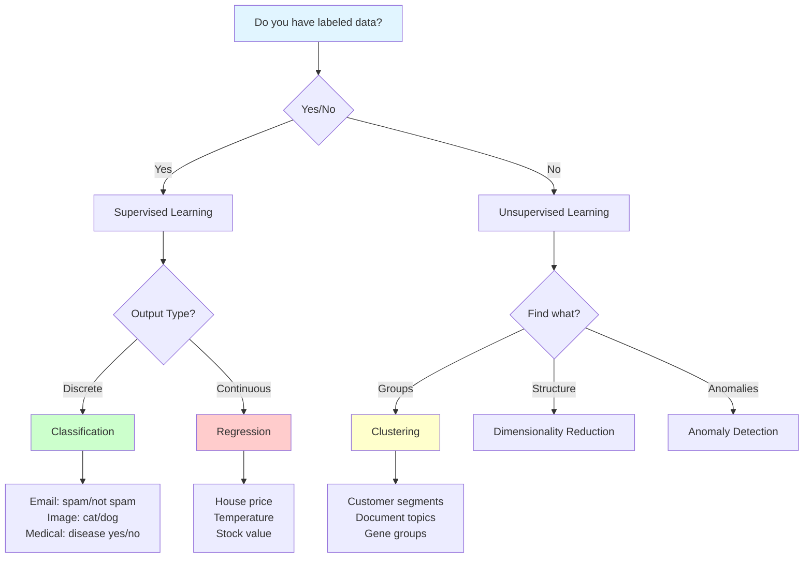

# What is Machine Learning?

**Teaching computers to learn from experience without being explicitly programmed.** Machine learning is revolutionizing how we solve problems by enabling systems to improve automatically through data.

**Difficulty:** 🟢 Beginner | **Time:** 2-3 hours | **Prerequisites:** Basic Programming, Curiosity

---

## Quick Reference

| Property | Value |
|----------|-------|
| **Definition** | Algorithms that improve through experience |
| **Core Idea** | Learn patterns from data instead of explicit rules |
| **Key Components** | Data, Algorithm, Model, Prediction |
| **Main Types** | Supervised, Unsupervised, Reinforcement |
| **Primary Goal** | Generalization to unseen data |
| **Applications** | Image recognition, NLP, recommendations, forecasting |
| **When to Use** | Complex patterns, large data, rules hard to define |
| **When to Avoid** | Simple rules suffice, no data available, need 100% accuracy |

---

## Complete Guide

=== "📖 Overview"
    ## What is Machine Learning?

    Machine Learning is a subset of artificial intelligence that enables computers to learn from data and improve their performance on tasks without being explicitly programmed for every scenario.

    **Traditional Programming vs Machine Learning:**

    ```
    Traditional Programming:
    Rules + Data → Computer → Output

    Machine Learning:
    Data + Output → Computer → Rules (Model)
    ```

    **Core Principle:** Instead of writing rules manually, we provide examples and let the algorithm discover patterns.

    ---

    ## The ML Paradigm Shift

    **Traditional Approach (Spam Filter):**
    ```python
    def is_spam(email):
        if "free money" in email:
            return True
        if "click here" in email:
            return True
        if "congratulations" in email:
            return True
        # ... hundreds of manual rules
        return False
    ```

    **ML Approach (Spam Filter):**
    ```python
    # Train on thousands of labeled emails
    model = train_spam_classifier(emails, labels)

    # Model learns patterns automatically
    is_spam = model.predict(new_email)
    ```

    The ML model discovers complex patterns that would be impossible to code manually!

    ---

    ## When to Use Machine Learning

    **Use ML When:**

    - Pattern is too complex to code manually (facial recognition)
    - Rules change frequently (stock prediction)
    - Adapting to new data continuously (recommendations)
    - Lots of data available to learn from
    - Human experts can do the task but can't articulate rules
    - Solution requires personalization

    **Avoid ML When:**

    - Simple rules are sufficient (basic calculations)
    - No data available or data is poor quality
    - Need 100% deterministic results (safety-critical systems)
    - Problem well-solved by traditional algorithms
    - Interpretability is legally required and model is black-box
    - Cost of wrong predictions is too high

    ---

    ## Real-World Applications

    **Computer Vision:**
    - Self-driving cars detecting pedestrians
    - Medical imaging diagnosis
    - Face recognition on smartphones
    - Quality control in manufacturing

    **Natural Language Processing:**
    - Virtual assistants (Siri, Alexa)
    - Language translation
    - Sentiment analysis
    - Text summarization

    **Recommendation Systems:**
    - Netflix movie suggestions
    - Amazon product recommendations
    - Spotify music discovery
    - YouTube video recommendations

    **Healthcare:**
    - Disease prediction from symptoms
    - Drug discovery
    - Patient risk assessment
    - Medical image analysis

    **Finance:**
    - Fraud detection
    - Credit scoring
    - Algorithmic trading
    - Risk assessment

    **Business:**
    - Customer churn prediction
    - Sales forecasting
    - Price optimization
    - Marketing campaign targeting

=== "🧮 Theory & Math"
    ## Intuition First

    **Learning from Experience (Like a Child):**

    Imagine teaching a child to identify cats:
    - **Traditional Programming:** "A cat has pointy ears, whiskers, four legs, fur..."
    - **Machine Learning:** Show the child 1000 cat photos. The child learns patterns automatically.

    This is exactly how ML works!

    ---

    ## The ML Process

    ```mermaid
    graph TB
        A[Collect Data] --> B[Prepare & Clean Data]
        B --> C[Choose Algorithm]
        C --> D[Train Model]
        D --> E[Evaluate Performance]
        E --> F{Good Enough?}
        F -->|No| G[Adjust & Retrain]
        F -->|Yes| H[Deploy Model]
        G --> D
        H --> I[Monitor & Update]
        I --> A

        style A fill:#e1f5ff
        style H fill:#ccffcc
        style F fill:#ffffcc
    ```

    ---

    ## Mathematical Foundation

    ### The Learning Problem

    We have:
    - **Input space:** $X$ (features/data)
    - **Output space:** $Y$ (labels/targets)
    - **Unknown function:** $f: X \rightarrow Y$
    - **Training data:** $\{(x^{(1)}, y^{(1)}), (x^{(2)}, y^{(2)}), ..., (x^{(m)}, y^{(m)})\}$

    **Goal:** Find hypothesis $h: X \rightarrow Y$ that approximates $f$

    Where:
    - $h$ is our learned model
    - We want $h(x) \approx f(x)$ for all $x$ (including unseen data!)

    ---

    ## Key ML Components

    ### 1. Data
    The fuel of machine learning.

    $$\text{Data} = \{(x^{(i)}, y^{(i)})\}_{i=1}^{m}$$

    Where:
    - $x^{(i)}$ = input features (e.g., [house_size, bedrooms, location])
    - $y^{(i)}$ = output label (e.g., price)
    - $m$ = number of examples

    ### 2. Model
    Mathematical representation of patterns.

    $$h_\theta(x) = \theta_0 + \theta_1 x_1 + \theta_2 x_2 + ... + \theta_n x_n$$

    Where $\theta$ are parameters learned from data.

    ### 3. Loss Function
    Measures prediction error.

    $$J(\theta) = \frac{1}{m}\sum_{i=1}^{m} \text{Loss}(h_\theta(x^{(i)}), y^{(i)})$$

    **Goal:** Minimize $J(\theta)$ to find best parameters.

    ### 4. Optimization
    Algorithm to find best parameters.

    $$\theta := \theta - \alpha \nabla J(\theta)$$

    Where $\alpha$ is learning rate.

    ---

    ## Types of Learning Tasks

    ### 1. Classification
    Predict discrete categories.

    **Examples:**
    - Email: spam or not spam
    - Image: cat, dog, or bird
    - Medical: disease present or absent

    **Output:** Discrete labels

    ### 2. Regression
    Predict continuous values.

    **Examples:**
    - House prices
    - Temperature tomorrow
    - Stock prices

    **Output:** Continuous numbers

    ### 3. Clustering
    Group similar data points.

    **Examples:**
    - Customer segmentation
    - Document organization
    - Gene sequence analysis

    **Output:** Group assignments

    ### 4. Dimensionality Reduction
    Compress high-dimensional data.

    **Examples:**
    - Image compression
    - Feature extraction
    - Visualization

    **Output:** Lower-dimensional representation

=== "💻 Implementation"
    ## Complete ML Pipeline Example

    ```python
    import numpy as np
    import pandas as pd
    from sklearn.model_selection import train_test_split
    from sklearn.preprocessing import StandardScaler
    from sklearn.linear_model import LogisticRegression
    from sklearn.metrics import accuracy_score, classification_report

    # ========================================
    # Step 1: Load and Explore Data
    # ========================================
    from sklearn.datasets import load_iris

    # Load dataset
    data = load_iris()
    X = data.data  # Features
    y = data.target  # Labels

    print(f"Dataset shape: {X.shape}")
    print(f"Number of classes: {len(np.unique(y))}")
    print(f"Feature names: {data.feature_names}")

    # ========================================
    # Step 2: Split Data
    # ========================================
    # Never test on training data!
    X_train, X_test, y_train, y_test = train_test_split(
        X, y, test_size=0.2, random_state=42, stratify=y
    )

    print(f"\nTraining samples: {len(X_train)}")
    print(f"Test samples: {len(X_test)}")

    # ========================================
    # Step 3: Preprocess Data
    # ========================================
    # Scale features to similar ranges
    scaler = StandardScaler()
    X_train_scaled = scaler.fit_transform(X_train)
    X_test_scaled = scaler.transform(X_test)  # Use same scaling!

    # ========================================
    # Step 4: Choose and Train Model
    # ========================================
    # Create model
    model = LogisticRegression(max_iter=1000, random_state=42)

    # Train (learn patterns from data)
    model.fit(X_train_scaled, y_train)
    print("\nModel trained successfully!")

    # ========================================
    # Step 5: Make Predictions
    # ========================================
    y_pred_train = model.predict(X_train_scaled)
    y_pred_test = model.predict(X_test_scaled)

    # ========================================
    # Step 6: Evaluate Performance
    # ========================================
    train_accuracy = accuracy_score(y_train, y_pred_train)
    test_accuracy = accuracy_score(y_test, y_pred_test)

    print(f"\nTraining Accuracy: {train_accuracy:.3f}")
    print(f"Test Accuracy: {test_accuracy:.3f}")

    # Detailed metrics
    print("\nClassification Report:")
    print(classification_report(y_test, y_pred_test,
                                target_names=data.target_names))

    # ========================================
    # Step 7: Make Predictions on New Data
    # ========================================
    new_flower = np.array([[5.1, 3.5, 1.4, 0.2]])  # New sample
    new_flower_scaled = scaler.transform(new_flower)
    prediction = model.predict(new_flower_scaled)
    probability = model.predict_proba(new_flower_scaled)

    print(f"\nNew flower prediction: {data.target_names[prediction[0]]}")
    print(f"Confidence: {probability.max():.3f}")
    ```

    ---

    ## Simple ML from Scratch

    ```python
    class SimpleLinearModel:
        """
        Simple linear model: y = mx + b
        Learn from data using gradient descent
        """

        def __init__(self, learning_rate=0.01):
            self.lr = learning_rate
            self.m = 0  # slope
            self.b = 0  # intercept

        def fit(self, X, y, epochs=100):
            """Learn from data"""
            n = len(X)

            for epoch in range(epochs):
                # Make predictions
                y_pred = self.m * X + self.b

                # Calculate error
                error = y - y_pred
                mse = np.mean(error ** 2)

                # Update parameters (gradient descent)
                self.m += self.lr * (2/n) * np.sum(X * error)
                self.b += self.lr * (2/n) * np.sum(error)

                if epoch % 20 == 0:
                    print(f"Epoch {epoch}: MSE = {mse:.4f}")

        def predict(self, X):
            """Make predictions on new data"""
            return self.m * X + self.b

    # Usage Example
    np.random.seed(42)
    X = np.random.rand(100) * 10
    y = 2 * X + 1 + np.random.randn(100) * 2  # y = 2x + 1 + noise

    model = SimpleLinearModel(learning_rate=0.01)
    model.fit(X, y, epochs=100)

    print(f"\nLearned parameters:")
    print(f"Slope (m): {model.m:.2f} (true: 2.0)")
    print(f"Intercept (b): {model.b:.2f} (true: 1.0)")

    # Test prediction
    test_x = 5.0
    prediction = model.predict(test_x)
    print(f"\nPrediction for x={test_x}: {prediction:.2f}")
    ```

=== "📊 Visualization"
    ## The ML Workflow Visualization

    ```mermaid
    graph LR
        A[Raw Data] --> B[Data Cleaning]
        B --> C[Feature Engineering]
        C --> D[Train/Test Split]
        D --> E[Model Training]
        E --> F[Evaluation]
        F --> G{Good?}
        G -->|No| H[Improve Model]
        H --> E
        G -->|Yes| I[Deploy]
        I --> J[Monitor]
        J --> K[Retrain]
        K --> E

        style A fill:#ffe6e6
        style I fill:#ccffcc
        style F fill:#ffffcc
    ```

    ---

    ## Learning from Data

    ```
    Data Points:           Model Learns:            Predicts:

    (1, 2)  ●              Best-fit line           New point (5, ?)
    (2, 4)    ●            through data               ●
    (3, 6)      ●                                    ↑
    (4, 8)        ●        Pattern: y = 2x         Prediction: ~10
    ```

    ---

    ## Traditional vs ML Comparison

    ```python
    import matplotlib.pyplot as plt

    # Traditional: Manual rules
    fig, axes = plt.subplots(1, 2, figsize=(14, 5))

    # Left: Traditional Programming
    axes[0].text(0.5, 0.7, "Rules:\nIF-THEN-ELSE",
                ha='center', fontsize=16, bbox=dict(boxstyle='round',
                facecolor='lightcoral'))
    axes[0].arrow(0.5, 0.6, 0, -0.2, head_width=0.05, color='red')
    axes[0].text(0.5, 0.3, "Output", ha='center', fontsize=14)
    axes[0].set_title("Traditional Programming", fontsize=16, fontweight='bold')
    axes[0].axis('off')

    # Right: Machine Learning
    axes[1].text(0.5, 0.7, "Data:\nExamples",
                ha='center', fontsize=16, bbox=dict(boxstyle='round',
                facecolor='lightgreen'))
    axes[1].arrow(0.5, 0.6, 0, -0.2, head_width=0.05, color='green')
    axes[1].text(0.5, 0.3, "Learned Rules", ha='center', fontsize=14)
    axes[1].set_title("Machine Learning", fontsize=16, fontweight='bold')
    axes[1].axis('off')

    plt.tight_layout()
    plt.show()
    ```

    ---

    ## The Generalization Concept

    ```
    Training Data          Model              New Data

    ● ● ●                 /
    ● ● ●  ──────────▶   /  (Pattern)  ──────────▶  ● ?
    ● ● ●               /                            ↓
                                                 Prediction!

    Goal: Model generalizes to unseen data
    ```

=== "🎯 Practice"
    ## Beginner Problems

    **Problem 1: Identify ML vs Non-ML Problems**

    Which of these are good ML problems?
    1. Calculate tax from salary (formula-based)
    2. Predict customer churn
    3. Sort a list of numbers
    4. Recommend movies based on viewing history
    5. Calculate compound interest

    **Answer:** 2 and 4 are ML problems (complex patterns, lots of data)

    ---

    **Problem 2: Your First ML Model**

    Load the Iris dataset and train a simple classifier:
    ```python
    from sklearn.datasets import load_iris
    from sklearn.tree import DecisionTreeClassifier
    from sklearn.model_selection import train_test_split

    # Your code here:
    # 1. Load data
    # 2. Split into train/test
    # 3. Train a DecisionTreeClassifier
    # 4. Calculate accuracy
    ```

    **Hint:** Use 80/20 split, random_state=42

    ---

    ## Intermediate Problems

    **Problem 3: Build Complete Pipeline**

    Create an end-to-end ML pipeline for house price prediction:
    - Load data (use sklearn's California housing or Boston housing)
    - Handle missing values
    - Scale features
    - Train multiple models (Linear Regression, Decision Tree)
    - Compare performance
    - Make predictions on new houses

    ---

    **Problem 4: Diagnose Model Issues**

    Given this scenario:
    - Training accuracy: 98%
    - Test accuracy: 65%

    What's the problem? How would you fix it?

    **Hint:** Think overfitting vs underfitting

    ---

    ## Advanced Problems

    **Problem 5: Custom Model Implementation**

    Implement a simple k-Nearest Neighbors classifier from scratch:
    - Store training data
    - For new point, find k closest training points
    - Return majority class
    - Test on Iris dataset
    - Compare with sklearn's KNeighborsClassifier

    ---

    **Problem 6: Real-World Project**

    Build a spam email classifier:
    - Collect or download email dataset
    - Convert text to features (TF-IDF)
    - Train multiple classifiers
    - Evaluate using precision/recall
    - Save best model for deployment

---

## ML Problem Types Decision Tree



---

## Key ML Terminology

| Term | Definition | Example |
|------|------------|---------|
| **Features (X)** | Input variables/attributes | House: [size, bedrooms, age] |
| **Target (y)** | Output variable to predict | House: [price] |
| **Training** | Learning from data | Model sees examples and adjusts |
| **Prediction** | Output on new data | Given house features → predict price |
| **Model** | Learned pattern/function | f(size, bedrooms) → price |
| **Generalization** | Perform well on unseen data | Works on new houses, not just training |
| **Overfitting** | Memorizing training data | Perfect on training, poor on test |
| **Underfitting** | Too simple to capture patterns | Poor on both training and test |

---

## ML vs Traditional Programming Comparison

| Aspect | Traditional Programming | Machine Learning |
|--------|------------------------|------------------|
| **Approach** | Write explicit rules | Learn from data |
| **Adaptation** | Manual code changes | Automatic from new data |
| **Complexity** | Hard for complex patterns | Excels at complex patterns |
| **Maintenance** | Update code manually | Retrain with new data |
| **Debugging** | Clear logic flow | Can be black-box |
| **Data Need** | None/minimal | Large amounts required |
| **Example** | Tax calculation | Fraud detection |

---

## Interview Preparation

### Common Questions

**Q1: What is machine learning in simple terms?**

**Strong Answer:** "Machine learning is a way to teach computers to learn from experience instead of following explicit instructions. Like how a child learns to recognize cats by seeing many examples, ML algorithms learn patterns from data. For example, instead of writing thousands of rules for spam detection, we show the algorithm examples of spam and non-spam emails, and it learns to distinguish them automatically."

**Q2: How does ML differ from traditional programming?**

**Strong Answer:** "In traditional programming, we write rules: 'If condition A, then do B.' In machine learning, we provide examples of inputs and desired outputs, and the algorithm discovers the rules. Traditional is rule-driven, ML is data-driven. ML shines when patterns are too complex to code manually, like image recognition or language understanding."

**Q3: When should you NOT use machine learning?**

**Strong Answer:** "Avoid ML when: (1) simple rules suffice - basic calculations don't need ML, (2) no data available or data is poor quality, (3) need 100% deterministic results for safety-critical systems, (4) problem is well-solved by existing algorithms like sorting, and (5) cost of errors is too high without explainability."

**Q4: What are the main types of machine learning?**

**Strong Answer:** "Three main types: (1) Supervised Learning - learn from labeled data to make predictions (most common), (2) Unsupervised Learning - find patterns in unlabeled data like clustering, and (3) Reinforcement Learning - learn through trial and error by receiving rewards. There's also semi-supervised (mix of labeled/unlabeled) and self-supervised (create labels from data itself)."

**Q5: What is the goal of machine learning?**

**Strong Answer:** "The primary goal is generalization - performing well on new, unseen data, not just memorizing training data. We want models that learn underlying patterns, not noise. That's why we split data into training and test sets - to ensure the model generalizes beyond what it was trained on."

**Q6: Explain overfitting and underfitting.**

**Strong Answer:** "Overfitting is when a model memorizes training data, including noise, performing great on training but poorly on new data - it's too complex. Underfitting is when a model is too simple to capture the pattern, performing poorly on both training and test data. The goal is the sweet spot - a model complex enough to capture patterns but simple enough to generalize."

---

## Related Topics

- [Types of Machine Learning](types-of-ml.md) - Deep dive into supervised, unsupervised, reinforcement
- [Train/Test Split](train-test-split.md) - Proper data splitting for evaluation
- [Overfitting & Underfitting](overfitting-underfitting.md) - Common problems and solutions
- [Bias-Variance Tradeoff](bias-variance-tradeoff.md) - Fundamental theoretical concept
- [Linear Regression](../supervised-learning/regression/linear-regression.md) - First algorithm to learn

---

## References

1. **Andrew Ng's ML Course:** [Coursera](https://www.coursera.org/learn/machine-learning) - Best intro
2. **Book:** *Hands-On Machine Learning* by Aurélien Géron - Practical approach
3. **Book:** *Pattern Recognition and Machine Learning* by Christopher Bishop - Theoretical
4. **Google's ML Crash Course:** [Free Course](https://developers.google.com/machine-learning/crash-course)
5. **StatQuest (YouTube):** Excellent intuitive explanations
6. **Papers:** "A Few Useful Things to Know About Machine Learning" by Pedro Domingos

---

**Next Steps:**

- Learn about [Types of ML](types-of-ml.md) to understand the landscape
- Explore [Train/Test Split](train-test-split.md) - essential practice
- Try the practice problems above with real datasets
- Follow a complete [ML Learning Path](../learning-path.md)

**Ready to dive deeper?** Continue with [Types of Machine Learning](types-of-ml.md)
