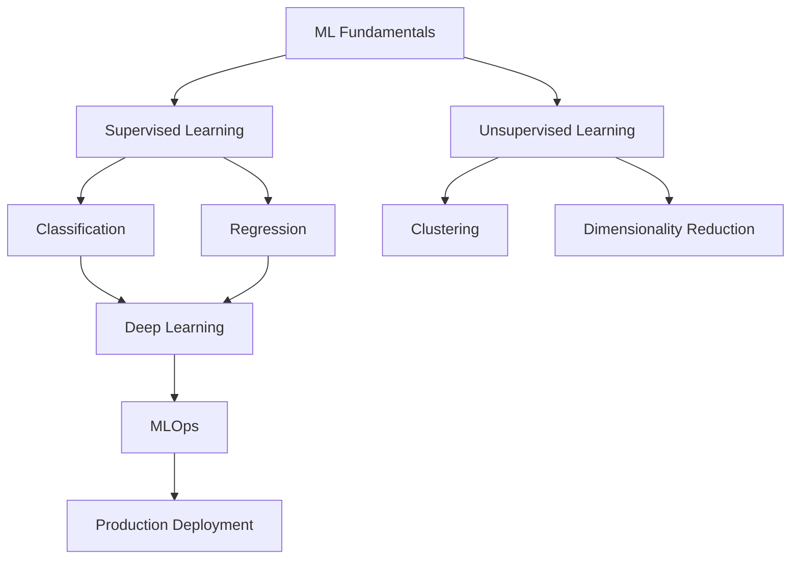

# Machine Learning

Welcome to my Machine Learning learning journey! This section covers everything from fundamental concepts to advanced techniques and production deployment.

## Learning Path



## Topics Covered

<div class="grid cards" markdown>

-   :material-school: **Fundamentals**
    
    ---
    
    Core concepts, statistics, and mathematical foundations
    
    [Learn basics →](fundamentals.md)

-   :material-chart-line: **Algorithms**
    
    ---
    
    Supervised and unsupervised learning algorithms
    
    [Explore algorithms →](algorithms.md)

-   :material-brain: **Deep Learning**
    
    ---
    
    Neural networks, CNNs, RNNs, and Transformers
    
    [Dive deeper →](deep-learning.md)

-   :material-rocket-launch: **MLOps**
    
    ---
    
    Production deployment, monitoring, and lifecycle management
    
    [Go to production →](mlops.md)

</div>

## Recent Learning

!!! success "Completed Topics"
    - [x] Linear and Logistic Regression
    - [x] Decision Trees and Random Forests
    - [x] Support Vector Machines
    - [x] K-Means Clustering
    - [x] Principal Component Analysis

!!! info "Currently Learning"
    - [ ] Advanced Neural Networks
    - [ ] Transformer Architecture
    - [ ] Model Deployment Strategies
    - [ ] MLflow and Experiment Tracking

## Resources

### Books
- **Pattern Recognition and Machine Learning** by Christopher Bishop
- **The Elements of Statistical Learning** by Hastie, Tibshirani, and Friedman
- **Hands-On Machine Learning** by Aurélien Géron

### Online Courses
- Andrew Ng's Machine Learning Course (Coursera)
- Fast.ai Practical Deep Learning
- CS229 Stanford Machine Learning

### Tools & Libraries
- **Python**: scikit-learn, pandas, numpy
- **Deep Learning**: TensorFlow, PyTorch, Keras
- **Visualization**: matplotlib, seaborn, plotly
- **MLOps**: MLflow, Kubeflow, Weights & Biases

## Code Examples

Here's a simple example of linear regression:

```python
import numpy as np
from sklearn.linear_model import LinearRegression
from sklearn.model_selection import train_test_split
import matplotlib.pyplot as plt

# Generate sample data
X = np.random.randn(100, 1)
y = 2 * X.squeeze() + 1 + np.random.randn(100) * 0.1

# Split data
X_train, X_test, y_train, y_test = train_test_split(X, y, test_size=0.2)

# Train model
model = LinearRegression()
model.fit(X_train, y_train)

# Make predictions
y_pred = model.predict(X_test)

print(f"Coefficient: {model.coef_[0]:.2f}")
print(f"Intercept: {model.intercept_:.2f}")
print(f"R² Score: {model.score(X_test, y_test):.3f}")
```

---

*Keep learning and stay curious! 🚀*
