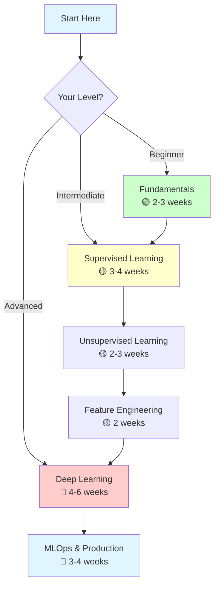

# Machine Learning

**Master machine learning from fundamentals to production.** Comprehensive coverage of algorithms, deep learning, and MLOps with hands-on implementations, mathematical intuition, and real-world applications.

---

=== "🎓 Learning Path"

    ## 📚 Learning Paths


```mermaid
graph TB
    Start[Start Here] --> Q1{Your Level?}

    Q1 -->|Beginner| Fund[Fundamentals<br/>🟢 2-3 weeks]
    Q1 -->|Intermediate| Super[Supervised Learning<br/>🟡 3-4 weeks]
    Q1 -->|Advanced| Deep[Deep Learning<br/>🔴 4-6 weeks]

    Fund --> Super
    Super --> Unsuper[Unsupervised Learning<br/>🟡 2-3 weeks]
    Unsuper --> FeatEng[Feature Engineering<br/>🟡 2 weeks]
    FeatEng --> Deep
    Deep --> MLOps[MLOps & Production<br/>🔴 3-4 weeks]

    style Start fill:#e1f5ff
    style Fund fill:#ccffcc
    style Super fill:#ffffcc
    style Deep fill:#ffcccc
    style MLOps fill:#e1f5ff
```

    **📖 Structured Learning:**
    - [Complete Learning Path](learning-path.md) - 12-week structured program
    - [Interview Preparation](interview-prep.md) - Focus on interview topics

    ---

    ## 🚀 Next Steps

    ### For Beginners
    1. Start with [Fundamentals](fundamentals/index.md)
    2. Learn [Linear Regression](supervised-learning/regression/linear-regression.md)
    3. Practice [Model Evaluation](evaluation/index.md)
    4. Build your first project!

    ### For Intermediate Learners
    1. Master [Ensemble Methods](supervised-learning/ensemble-methods/index.md)
    2. Learn [Feature Engineering](feature-engineering/index.md)
    3. Explore [Deep Learning Basics](deep-learning/neural-networks-basics.md)
    4. Start with [Kaggle competitions](https://www.kaggle.com/competitions)

    ### For Advanced Practitioners
    1. Dive into [Deep Learning](deep-learning/index.md)
    2. Master [MLOps](mlops/index.md) and deployment
    3. Study [Research Papers](https://paperswithcode.com)
    4. Contribute to open-source ML projects

=== "🧠 Core Topics"

    ## 🧠 Core Topics

    ### 1. Fundamentals
    **Start here if you're new to ML**

    Learn the foundation of machine learning, key concepts, and mathematical prerequisites.

    - [What is Machine Learning?](fundamentals/what-is-ml.md)
    - [Types of ML](fundamentals/types-of-ml.md)
    - [Bias-Variance Tradeoff](fundamentals/bias-variance-tradeoff.md)
    - [Overfitting & Underfitting](fundamentals/overfitting-underfitting.md)
    - [Train/Test Split](fundamentals/train-test-split.md)
    - [Mathematics for ML](fundamentals/mathematics.md)

    [→ Explore Fundamentals](fundamentals/index.md){ .md-button }

    ---

    ### 2. Supervised Learning
    **Learn from labeled data: Classification & Regression**

    Master algorithms that learn from examples with known outputs.

    #### 🔢 Regression
    Predict continuous values (prices, temperatures, scores)

    - [Linear Regression](supervised-learning/regression/linear-regression.md) 🟢
    - [Polynomial Regression](supervised-learning/regression/polynomial-regression.md) 🟢
    - [Ridge Regression (L2)](supervised-learning/regression/ridge-regression.md) 🟡
    - [Lasso Regression (L1)](supervised-learning/regression/lasso-regression.md) 🟡

    #### 🎯 Classification
    Predict categories (spam/not spam, disease/healthy)

    - [Logistic Regression](supervised-learning/classification/logistic-regression.md) 🟢
    - [Naive Bayes](supervised-learning/classification/naive-bayes.md) 🟢
    - [Decision Trees](supervised-learning/classification/decision-trees.md) 🟢
    - [Random Forest](supervised-learning/classification/random-forest.md) 🟡
    - [Support Vector Machines](supervised-learning/classification/svm.md) 🟡
    - [K-Nearest Neighbors](supervised-learning/classification/knn.md) 🟢
    - [Gradient Boosting](supervised-learning/classification/gradient-boosting.md) 🟡

    #### 🎭 Ensemble Methods
    Combine multiple models for better performance

    - [Bagging](supervised-learning/ensemble-methods/bagging.md) 🟡
    - [Boosting](supervised-learning/ensemble-methods/boosting.md) 🟡
    - [Stacking](supervised-learning/ensemble-methods/stacking.md) 🔴

    [→ Explore Supervised Learning](supervised-learning/index.md){ .md-button }

    ---

    ### 3. Unsupervised Learning
    **Find patterns in unlabeled data**

    Discover hidden structures without predefined labels.

    #### 📊 Clustering
    Group similar data points together

    - [K-Means](unsupervised-learning/clustering/kmeans.md) 🟡
    - [Hierarchical Clustering](unsupervised-learning/clustering/hierarchical.md) 🟡
    - [DBSCAN](unsupervised-learning/clustering/dbscan.md) 🟡
    - [Gaussian Mixture Models](unsupervised-learning/clustering/gaussian-mixture.md) 🔴

    #### 📉 Dimensionality Reduction
    Reduce features while preserving information

    - [PCA](unsupervised-learning/dimensionality-reduction/pca.md) 🟡
    - [t-SNE](unsupervised-learning/dimensionality-reduction/tsne.md) 🟡
    - [UMAP](unsupervised-learning/dimensionality-reduction/umap.md) 🔴
    - [Autoencoders](unsupervised-learning/dimensionality-reduction/autoencoders.md) 🔴

    #### ⚠️ Anomaly Detection
    Identify unusual patterns or outliers

    - [Isolation Forest](unsupervised-learning/anomaly-detection/isolation-forest.md) 🟡
    - [One-Class SVM](unsupervised-learning/anomaly-detection/one-class-svm.md) 🟡

    [→ Explore Unsupervised Learning](unsupervised-learning/index.md){ .md-button }

    ---

    ### 4. Deep Learning
    **Neural networks and modern architectures**

    Master deep learning from basics to state-of-the-art models.

    - [Neural Networks Basics](deep-learning/neural-networks-basics.md) 🟡
    - [Activation Functions](deep-learning/activation-functions.md) 🟢
    - [Backpropagation](deep-learning/backpropagation.md) 🔴
    - [Convolutional Neural Networks (CNN)](deep-learning/cnn.md) 🔴
    - [Recurrent Neural Networks (RNN)](deep-learning/rnn.md) 🔴
    - [LSTM & GRU](deep-learning/lstm-gru.md) 🔴
    - [Transformers](deep-learning/transformers.md) 🔴
    - [Attention Mechanisms](deep-learning/attention-mechanisms.md) 🔴
    - [Transfer Learning](deep-learning/transfer-learning.md) 🟡
    - [Generative Adversarial Networks (GAN)](deep-learning/gan.md) 🔴

    [→ Explore Deep Learning](deep-learning/index.md){ .md-button }

    ---

    ### 5. Reinforcement Learning
    **Learn through trial and error**

    Train agents to make sequential decisions in environments.

    - [RL Fundamentals](reinforcement-learning/fundamentals.md) 🔴
    - [Q-Learning](reinforcement-learning/q-learning.md) 🔴
    - [Deep Q-Networks (DQN)](reinforcement-learning/deep-q-networks.md) 🔴
    - [Policy Gradient](reinforcement-learning/policy-gradient.md) 🔴
    - [Actor-Critic Methods](reinforcement-learning/actor-critic.md) 🔴

    [→ Explore Reinforcement Learning](reinforcement-learning/index.md){ .md-button }

    ---

    ### 6. Semi-Supervised Learning
    **Learn from limited labeled data**

    Leverage large amounts of unlabeled data with few labels.

    - [Self-Training](semi-supervised/self-training.md) 🟡
    - [Co-Training](semi-supervised/co-training.md) 🔴
    - [Pseudo-Labeling](semi-supervised/pseudo-labeling.md) 🟡

    [→ Explore Semi-Supervised Learning](semi-supervised/index.md){ .md-button }

=== "🛠️ Essential Skills"

    ## 🛠️ Essential Skills

    ### Data Handling & Feature Engineering
    **Transform raw data into ML-ready features**

    - [Data Cleaning](feature-engineering/data-cleaning.md)
    - [Missing Values](feature-engineering/missing-values.md)
    - [Outlier Detection](feature-engineering/outlier-detection.md)
    - [Feature Scaling](feature-engineering/feature-scaling.md)
    - [Encoding Categorical Variables](feature-engineering/encoding-categorical.md)
    - [Feature Creation](feature-engineering/feature-creation.md)
    - [Feature Selection](feature-engineering/feature-selection.md)
    - [Handling Imbalanced Data](feature-engineering/imbalanced-data.md)

    [→ Explore Feature Engineering](feature-engineering/index.md){ .md-button }

    ---

    ### Model Evaluation
    **Measure and validate model performance**

    - [Classification Metrics](evaluation/classification-metrics.md)
    - [Regression Metrics](evaluation/regression-metrics.md)
    - [Cross-Validation](evaluation/cross-validation.md)
    - [Confusion Matrix](evaluation/confusion-matrix.md)
    - [ROC-AUC Curve](evaluation/roc-auc.md)
    - [Model Selection](evaluation/model-selection.md)

    [→ Explore Evaluation](evaluation/index.md){ .md-button }

    ---

    ### Optimization & Tuning
    **Improve model performance**

    - [Gradient Descent](optimization/gradient-descent.md)
    - [Optimizers (SGD, Adam, RMSprop)](optimization/optimizers.md)
    - [Regularization (L1, L2, Elastic Net)](optimization/regularization.md)
    - [Dropout](optimization/dropout.md)
    - [Batch Normalization](optimization/batch-normalization.md)
    - [Hyperparameter Tuning](optimization/hyperparameter-tuning.md)
    - [Learning Rate Scheduling](optimization/learning-rate-scheduling.md)

    [→ Explore Optimization](optimization/index.md){ .md-button }

    ---

    ### MLOps & Production
    **Deploy and maintain ML systems**

    - [Experiment Tracking](mlops/experiment-tracking.md)
    - [Model Deployment](mlops/model-deployment.md)
    - [Model Serving](mlops/model-serving.md)
    - [Monitoring & Drift Detection](mlops/monitoring.md)
    - [CI/CD for ML](mlops/ci-cd.md)
    - [Best Practices](mlops/best-practices.md)

    [→ Explore MLOps](mlops/index.md){ .md-button }

=== "📊 Guides & Resources"

    ## 🎯 Algorithm Selection Guide

    ```mermaid
    flowchart TD
        Start[Choose Algorithm] --> Q1{What type<br/>of problem?}

        Q1 -->|Predict number| Reg[Regression]
        Q1 -->|Predict category| Class[Classification]
        Q1 -->|Find groups| Clust[Clustering]
        Q1 -->|Reduce dimensions| Dim[Dimensionality<br/>Reduction]

        Reg --> Q2{Data size?}
        Q2 -->|Small < 10K| LinReg[Linear Regression<br/>🟢]
        Q2 -->|Medium 10K-1M| Ridge[Ridge/Lasso<br/>🟡]
        Q2 -->|Large > 1M| XGB_R[XGBoost<br/>🟡]

        Class --> Q3{Need interpret?}
        Q3 -->|Yes| LogReg[Logistic Regression<br/>🟢 or Decision Tree<br/>🟢]
        Q3 -->|No| RF[Random Forest<br/>🟡 or XGBoost<br/>🟡]

        Clust --> KM[K-Means<br/>🟡 or DBSCAN<br/>🟡]
        Dim --> PCA_Choice[PCA<br/>🟡 or t-SNE<br/>🟡]

        style Start fill:#e1f5ff
        style LinReg fill:#ccffcc
        style LogReg fill:#ccffcc
        style RF fill:#ffffcc
    ```

    ---

    ## 📊 Key Concepts

    ### When to Use Which Algorithm

    | Problem Type | Algorithm | Best For | Difficulty |
    |--------------|-----------|----------|------------|
    | **Regression** | Linear Regression | Linear relationships, interpretability | 🟢 |
    | | Ridge/Lasso | When regularization needed | 🟡 |
    | | Random Forest | Non-linear, feature importance | 🟡 |
    | | XGBoost | Competitions, production | 🟡 |
    | **Classification** | Logistic Regression | Binary classification, baseline | 🟢 |
    | | Decision Trees | Interpretable rules | 🟢 |
    | | Random Forest | Robust, less overfitting | 🟡 |
    | | SVM | High-dimensional data | 🟡 |
    | | Neural Networks | Complex patterns, large data | 🔴 |
    | **Clustering** | K-Means | Spherical clusters, fast | 🟡 |
    | | DBSCAN | Arbitrary shapes, outliers | 🟡 |
    | | Hierarchical | Dendrogram visualization | 🟡 |
    | **Dim. Reduction** | PCA | Linear relationships | 🟡 |
    | | t-SNE | Visualization (2D/3D) | 🟡 |
    | | Autoencoders | Non-linear, deep learning | 🔴 |

    ---

    ## ⚠️ Common Pitfalls

    !!! danger "Critical Mistakes to Avoid"
        1. **Data Leakage** - Preprocessing before train/test split
        2. **Ignoring Imbalanced Data** - Using accuracy on imbalanced datasets
        3. **No Cross-Validation** - Relying on single train/test split
        4. **Wrong Metrics** - Optimizing for wrong business goal
        5. **Overfitting** - Not monitoring validation performance

    ---

    ## 📚 Additional Resources

    **Books:**

    - *Hands-On Machine Learning* by Aurélien Géron
    - *Deep Learning* by Goodfellow, Bengio, Courville
    - *Pattern Recognition and Machine Learning* by Christopher Bishop

    **Online Courses:**

    - Andrew Ng's Machine Learning Specialization (Coursera)
    - Fast.ai Practical Deep Learning
    - Stanford CS229

    **Practice:**

    - [Kaggle](https://www.kaggle.com/) - Competitions and datasets
    - [Papers with Code](https://paperswithcode.com/) - Latest research
    - [Distill.pub](https://distill.pub/) - Visual ML explanations

---

**Ready to start your ML journey?** Choose a tab above to explore and begin learning! 🎯
