# Machine Learning

Master machine learning from fundamentals to production deployment. Comprehensive coverage of algorithms, deep learning, MLOps, and real-world applications with hands-on examples.

**Status:** 🚀 Active Learning | 📊 65+ Topics | 🎯 Production-Ready

---

## Quick Start

| Your Goal | Start Here | Time Needed |
|-----------|------------|-------------|
| 🎯 **ML Interview prep** | Learning Path → Core Algorithms | 4-6 weeks |
| 📚 **Learn from scratch** | Overview → Mathematics First | 8-12 weeks |
| 🔍 **Deep Learning focus** | Neural Networks → Advanced Topics | 6-8 weeks |
| ⚡ **Quick review** | At a Glance → Code Examples | 2-3 weeks |

---

=== "📋 Overview"

    ## At a Glance

    ```mermaid
    graph TB
        A[Machine Learning] --> B[Supervised Learning]
        A --> C[Unsupervised Learning]
        A --> D[Reinforcement Learning]
        A --> E[Deep Learning]

        B --> B1[Classification]
        B --> B2[Regression]

        C --> C1[Clustering]
        C --> C2[Dimensionality Reduction]
        C --> C3[Association Rules]

        D --> D1[Value-Based]
        D --> D2[Policy-Based]
        D --> D3[Model-Based]

        E --> E1[Neural Networks]
        E1 --> E2[CNN]
        E1 --> E3[RNN/LSTM]
        E1 --> E4[Transformers]
        E1 --> E5[GANs]

        B --> F[Production ML]
        C --> F
        D --> F
        E --> F

        F --> F1[MLOps]
        F --> F2[Model Serving]
        F --> F3[Monitoring]

        style A fill:#e1f5ff
        style B fill:#fff4e1
        style C fill:#ffe1f5
        style D fill:#e1ffe1
        style E fill:#f5e1ff
        style F fill:#ffe1e1
    ```

    ---

    ### 📊 Key Statistics

    | Metric | Value | Context |
    |--------|-------|---------|
    | **Global ML Market** | $209B (2024) | Growing at 38.8% CAGR |
    | **Data Scientists Needed** | 11.5M by 2026 | Massive skill gap |
    | **Average ML Engineer Salary** | $150K-$250K | Top 5% tech roles |
    | **Production ML Models** | <25% reach production | Deployment challenge |
    | **Model Retraining Frequency** | 30-90 days | Concept drift issue |
    | **Popular Framework** | PyTorch (60%+) | Over TensorFlow |

    ---

    ### 🎯 Core ML Disciplines

    | Discipline | What It Does | Real-World Use |
    |------------|--------------|----------------|
    | **Supervised Learning** | Learn from labeled data | Spam detection, price prediction, image classification |
    | **Unsupervised Learning** | Find patterns in unlabeled data | Customer segmentation, anomaly detection |
    | **Semi-Supervised** | Learn from mixed labeled/unlabeled | Medical diagnosis with limited labels |
    | **Reinforcement Learning** | Learn through trial and error | Game AI, robotics, autonomous driving |
    | **Deep Learning** | Neural networks with many layers | Computer vision, NLP, speech recognition |
    | **Transfer Learning** | Apply knowledge across domains | Fine-tune pretrained models |
    | **Ensemble Methods** | Combine multiple models | Kaggle winners, production systems |
    | **AutoML** | Automated model selection/tuning | Rapid prototyping, non-experts |

    ---

    ### 🏗️ ML System Architecture

    ```mermaid
    flowchart LR
        A[Raw Data] --> B[Data Collection]
        B --> C[Data Storage]
        C --> D[Data Processing]
        D --> E[Feature Engineering]
        E --> F[Model Training]
        F --> G[Model Evaluation]
        G --> H{Good Enough?}
        H -->|No| E
        H -->|Yes| I[Model Registry]
        I --> J[Model Deployment]
        J --> K[Prediction Service]
        K --> L[Monitoring]
        L --> M{Drift Detected?}
        M -->|Yes| F
        M -->|No| K

        style F fill:#ffcccc
        style J fill:#ccffcc
        style L fill:#ccccff
    ```

    ---

    ### 🔑 Algorithm Comparison

    | Algorithm | Type | Speed | Accuracy | Interpretability | Use Case |
    |-----------|------|-------|----------|------------------|----------|
    | **Linear Regression** | Regression | ⚡⚡⚡ | ⭐⭐ | ⭐⭐⭐ | Price prediction, trend analysis |
    | **Logistic Regression** | Classification | ⚡⚡⚡ | ⭐⭐⭐ | ⭐⭐⭐ | Binary classification, probability |
    | **Decision Tree** | Both | ⚡⚡ | ⭐⭐ | ⭐⭐⭐ | Rule-based decisions |
    | **Random Forest** | Both | ⚡⚡ | ⭐⭐⭐⭐ | ⭐⭐ | Feature importance, robust |
    | **XGBoost** | Both | ⚡⚡ | ⭐⭐⭐⭐⭐ | ⭐⭐ | Kaggle competitions, tabular data |
    | **SVM** | Both | ⚡ | ⭐⭐⭐⭐ | ⭐⭐ | High-dimensional, small datasets |
    | **K-Means** | Clustering | ⚡⚡⚡ | ⭐⭐⭐ | ⭐⭐⭐ | Customer segmentation |
    | **Neural Networks** | Both | ⚡ | ⭐⭐⭐⭐⭐ | ⭐ | Complex patterns, large data |
    | **CNN** | Classification | ⚡ | ⭐⭐⭐⭐⭐ | ⭐ | Image recognition, video |
    | **Transformer** | Sequence | ⚡ | ⭐⭐⭐⭐⭐ | ⭐ | NLP, language models |

    ---

    ### 💡 ML vs Traditional Programming

    ```mermaid
    flowchart LR
        subgraph Traditional["Traditional Programming"]
            T1[Rules] --> T2[Program]
            T3[Data] --> T2
            T2 --> T4[Output]
        end

        subgraph ML["Machine Learning"]
            M1[Data] --> M2[Algorithm]
            M3[Output] --> M2
            M2 --> M4[Model/Rules]
        end

        style Traditional fill:#ffe6e6
        style ML fill:#e6f3ff
    ```

    **Key Difference:** Traditional programming uses explicit rules, ML learns rules from data.

    ---

    ### 🎓 Prerequisites

    | Topic | Why It Matters | Time to Learn |
    |-------|----------------|---------------|
    | **Python** | Primary ML language | 2-4 weeks |
    | **Linear Algebra** | Neural networks, dimensionality reduction | 3-4 weeks |
    | **Calculus** | Optimization, gradient descent | 2-3 weeks |
    | **Probability** | Statistical learning, Bayesian methods | 3-4 weeks |
    | **Statistics** | Hypothesis testing, distributions | 2-3 weeks |
    | **Pandas/NumPy** | Data manipulation | 1-2 weeks |

=== "🗺️ Learning Path"

    ## Structured 12-Week Program

    ```mermaid
    timeline
        title ML Learning Journey
        Week 1-2 : Foundation
                 : Python + Math
                 : Statistics Basics
        Week 3-4 : Supervised Learning
                 : Linear Models
                 : Trees & Ensembles
        Week 5-6 : Unsupervised Learning
                 : Clustering
                 : Dimensionality Reduction
        Week 7-8 : Deep Learning
                 : Neural Networks
                 : CNN & RNN
        Week 9-10 : Advanced DL
                  : Transformers
                  : Transfer Learning
        Week 11-12 : MLOps
                   : Deployment
                   : Monitoring
    ```

    ---

    ### Phase 1: Foundation (Weeks 1-2)

    **Goal:** Build mathematical and programming foundation

    | Topic | Subtopics | Time | Resources |
    |-------|-----------|------|-----------|
    | **Python Fundamentals** | NumPy, Pandas, Matplotlib | 8h | Python Data Science Handbook |
    | **Linear Algebra** | Vectors, matrices, operations | 6h | 3Blue1Brown videos |
    | **Calculus** | Derivatives, chain rule, optimization | 4h | Khan Academy |
    | **Statistics** | Mean, variance, distributions | 6h | StatQuest YouTube |
    | **Probability** | Bayes theorem, conditional probability | 4h | Brilliant.org |

    **✅ Checkpoint:** Can you manipulate arrays with NumPy and explain gradient descent?

    **Hands-On Project:** Implement gradient descent from scratch for linear regression

    ---

    ### Phase 2: Supervised Learning (Weeks 3-4)

    **Goal:** Master classification and regression algorithms

    | Week | Algorithm | Key Concepts | Project |
    |------|-----------|--------------|---------|
    | **3.1** | Linear Regression | Cost function, gradient descent, closed-form solution | House price prediction |
    | **3.2** | Logistic Regression | Sigmoid, log loss, decision boundary | Email spam detector |
    | **3.3** | Decision Trees | Gini/Entropy, pruning, tree depth | Credit approval system |
    | **4.1** | Random Forest | Bagging, feature importance, OOB error | Customer churn prediction |
    | **4.2** | Support Vector Machines | Kernel trick, margin optimization | Handwritten digit classification |
    | **4.3** | XGBoost/LightGBM | Boosting, regularization, early stopping | Kaggle tabular competition |

    **✅ Checkpoint:** Can you explain bias-variance tradeoff and choose appropriate algorithm?

    **Capstone Project:** Build a complete classification pipeline with model comparison

    ---

    ### Phase 3: Unsupervised Learning (Weeks 5-6)

    **Goal:** Discover patterns without labels

    | Week | Algorithm | Key Concepts | Project |
    |------|-----------|--------------|---------|
    | **5.1** | K-Means Clustering | Elbow method, initialization, convergence | Customer segmentation |
    | **5.2** | Hierarchical Clustering | Dendrograms, linkage methods | Document clustering |
    | **5.3** | DBSCAN | Density-based, outlier detection | Anomaly detection |
    | **6.1** | PCA | Eigenvalues, variance explained, dimensionality | Image compression |
    | **6.2** | t-SNE | Non-linear reduction, visualization | High-dim data visualization |
    | **6.3** | Autoencoders | Reconstruction loss, latent space | Feature extraction |

    **✅ Checkpoint:** Can you choose right clustering algorithm and interpret results?

    **Capstone Project:** Market basket analysis with association rules + clustering

    ---

    ### Phase 4: Deep Learning Basics (Weeks 7-8)

    **Goal:** Understand neural networks and backpropagation

    | Week | Topic | Key Concepts | Project |
    |------|-------|--------------|---------|
    | **7.1** | Neural Network Basics | Perceptron, activation functions, forward pass | XOR problem, digit recognition |
    | **7.2** | Backpropagation | Chain rule, gradient computation, weight updates | Implement NN from scratch |
    | **7.3** | Training Techniques | Batch size, learning rate, momentum, Adam | Hyperparameter tuning |
    | **8.1** | Convolutional Neural Networks | Convolution, pooling, feature maps | MNIST, CIFAR-10 classification |
    | **8.2** | Recurrent Neural Networks | Hidden state, LSTM, GRU, sequence modeling | Text generation, sentiment analysis |
    | **8.3** | Regularization | Dropout, batch norm, L1/L2, early stopping | Prevent overfitting |

    **✅ Checkpoint:** Can you build and train a CNN from scratch in PyTorch/TensorFlow?

    **Capstone Project:** Image classifier with data augmentation and transfer learning

    ---

    ### Phase 5: Advanced Deep Learning (Weeks 9-10)

    **Goal:** Master state-of-the-art architectures

    | Week | Topic | Key Concepts | Project |
    |------|-------|--------------|---------|
    | **9.1** | Transfer Learning | Feature extraction, fine-tuning, domain adaptation | Use ResNet/VGG for custom task |
    | **9.2** | Attention Mechanisms | Self-attention, multi-head attention, positional encoding | Implement attention layer |
    | **9.3** | Transformers | BERT, GPT architecture, masked LM | Text classification with BERT |
    | **10.1** | Computer Vision | Object detection (YOLO, R-CNN), segmentation | Object detector for custom dataset |
    | **10.2** | NLP Advanced | Word embeddings, seq2seq, language models | Machine translation, Q&A system |
    | **10.3** | Generative Models | GANs, VAEs, diffusion models | Generate synthetic images |

    **✅ Checkpoint:** Can you fine-tune a pretrained transformer for your task?

    **Capstone Project:** Multi-task learning system (e.g., image captioning)

    ---

    ### Phase 6: MLOps & Production (Weeks 11-12)

    **Goal:** Deploy, monitor, and maintain ML systems

    | Week | Topic | Key Concepts | Project |
    |------|-------|--------------|---------|
    | **11.1** | Experiment Tracking | MLflow, Weights & Biases, versioning | Track all experiments systematically |
    | **11.2** | Model Deployment | REST API, Flask/FastAPI, Docker | Deploy model as microservice |
    | **11.3** | Model Serving | TF Serving, TorchServe, batch vs real-time | Production inference system |
    | **12.1** | Monitoring | Drift detection, performance metrics, logging | Monitor deployed model |
    | **12.2** | CI/CD for ML | Automated training, testing, deployment | MLOps pipeline with GitHub Actions |
    | **12.3** | Feature Stores | Tecton, Feast, online/offline features | Build feature pipeline |

    **✅ Checkpoint:** Can you deploy a model with monitoring and automated retraining?

    **Final Capstone:** End-to-end ML system from data to production with monitoring

    ---

    ### 🎯 Interview Preparation Track (4 Weeks)

    **For ML Engineer / Data Scientist roles**

    | Week | Focus | Topics | Practice |
    |------|-------|--------|----------|
    | **1** | ML Fundamentals | Bias-variance, overfitting, cross-validation, metrics | 20 Leetcode-style ML questions |
    | **2** | Algorithms Deep Dive | Compare algorithms, when to use each, trade-offs | Implement 5 algorithms from scratch |
    | **3** | Deep Learning | Backprop derivation, architecture choices, optimization | Explain 5 DL architectures |
    | **4** | System Design + Coding | ML system design, production challenges | 5 ML system design problems |

    **✅ Must-Know for Interviews:**
    - Explain gradient descent (vanilla, SGD, Adam)
    - Bias-variance tradeoff with examples
    - Regularization techniques (L1, L2, dropout)
    - When to use each algorithm type
    - How to handle imbalanced data
    - Model evaluation metrics for different tasks
    - Production ML challenges (drift, scaling, latency)

=== "⚡ Quick Start"

    ## 🚀 Get Started in 15 Minutes

    ### Installation

    ```bash
    # Create virtual environment
    python -m venv ml-env
    source ml-env/bin/activate  # On Windows: ml-env\Scripts\activate

    # Install core packages
    pip install numpy pandas matplotlib scikit-learn jupyter

    # For deep learning (choose one)
    pip install torch torchvision torchaudio  # PyTorch
    pip install tensorflow                     # TensorFlow

    # For MLOps
    pip install mlflow wandb
    ```

    ---

    ### 📝 Quick Examples

    #### 1. Linear Regression (5 minutes)

    ```python
    import numpy as np
    from sklearn.linear_model import LinearRegression
    from sklearn.model_selection import train_test_split
    from sklearn.metrics import mean_squared_error, r2_score
    import matplotlib.pyplot as plt

    # Generate synthetic data
    np.random.seed(42)
    X = 2 * np.random.rand(100, 1)
    y = 4 + 3 * X + np.random.randn(100, 1)

    # Split data
    X_train, X_test, y_train, y_test = train_test_split(
        X, y, test_size=0.2, random_state=42
    )

    # Train model
    model = LinearRegression()
    model.fit(X_train, y_train)

    # Predict
    y_pred = model.predict(X_test)

    # Evaluate
    mse = mean_squared_error(y_test, y_pred)
    r2 = r2_score(y_test, y_pred)

    print(f"Coefficient: {model.coef_[0][0]:.2f}")
    print(f"Intercept: {model.intercept_[0]:.2f}")
    print(f"MSE: {mse:.3f}")
    print(f"R²: {r2:.3f}")

    # Visualize
    plt.scatter(X_test, y_test, color='blue', label='Actual')
    plt.plot(X_test, y_pred, color='red', linewidth=2, label='Predicted')
    plt.xlabel('X')
    plt.ylabel('y')
    plt.legend()
    plt.title('Linear Regression')
    plt.show()
    ```

    ---

    #### 2. Classification with Random Forest (5 minutes)

    ```python
    from sklearn.datasets import load_iris
    from sklearn.ensemble import RandomForestClassifier
    from sklearn.model_selection import cross_val_score
    from sklearn.metrics import classification_report, confusion_matrix

    # Load dataset
    iris = load_iris()
    X, y = iris.data, iris.target

    # Split data
    X_train, X_test, y_train, y_test = train_test_split(
        X, y, test_size=0.2, random_state=42
    )

    # Train Random Forest
    rf = RandomForestClassifier(n_estimators=100, random_state=42)
    rf.fit(X_train, y_train)

    # Predict
    y_pred = rf.predict(X_test)

    # Cross-validation
    cv_scores = cross_val_score(rf, X_train, y_train, cv=5)

    # Evaluate
    print("Cross-validation scores:", cv_scores)
    print(f"Mean CV Score: {cv_scores.mean():.3f} (+/- {cv_scores.std():.3f})")
    print("\nClassification Report:")
    print(classification_report(y_test, y_pred, target_names=iris.target_names))

    # Feature importance
    feature_importance = pd.DataFrame({
        'feature': iris.feature_names,
        'importance': rf.feature_importances_
    }).sort_values('importance', ascending=False)
    print("\nFeature Importance:")
    print(feature_importance)
    ```

    ---

    #### 3. Deep Learning with PyTorch (10 minutes)

    ```python
    import torch
    import torch.nn as nn
    import torch.optim as optim
    from torch.utils.data import DataLoader, TensorDataset

    # Define neural network
    class SimpleNN(nn.Module):
        def __init__(self, input_size, hidden_size, num_classes):
            super(SimpleNN, self).__init__()
            self.fc1 = nn.Linear(input_size, hidden_size)
            self.relu = nn.ReLU()
            self.fc2 = nn.Linear(hidden_size, hidden_size)
            self.fc3 = nn.Linear(hidden_size, num_classes)
            self.dropout = nn.Dropout(0.2)

        def forward(self, x):
            x = self.fc1(x)
            x = self.relu(x)
            x = self.dropout(x)
            x = self.fc2(x)
            x = self.relu(x)
            x = self.dropout(x)
            x = self.fc3(x)
            return x

    # Prepare data
    X = torch.randn(1000, 20)  # 1000 samples, 20 features
    y = torch.randint(0, 3, (1000,))  # 3 classes

    dataset = TensorDataset(X, y)
    train_loader = DataLoader(dataset, batch_size=32, shuffle=True)

    # Initialize model
    model = SimpleNN(input_size=20, hidden_size=64, num_classes=3)
    criterion = nn.CrossEntropyLoss()
    optimizer = optim.Adam(model.parameters(), lr=0.001)

    # Training loop
    num_epochs = 10
    for epoch in range(num_epochs):
        model.train()
        total_loss = 0
        for batch_X, batch_y in train_loader:
            # Forward pass
            outputs = model(batch_X)
            loss = criterion(outputs, batch_y)

            # Backward pass
            optimizer.zero_grad()
            loss.backward()
            optimizer.step()

            total_loss += loss.item()

        avg_loss = total_loss / len(train_loader)
        print(f'Epoch [{epoch+1}/{num_epochs}], Loss: {avg_loss:.4f}')

    # Evaluation
    model.eval()
    with torch.no_grad():
        outputs = model(X)
        _, predicted = torch.max(outputs, 1)
        accuracy = (predicted == y).float().mean()
        print(f'\nFinal Accuracy: {accuracy:.4f}')
    ```

    ---

    #### 4. Clustering with K-Means (3 minutes)

    ```python
    from sklearn.cluster import KMeans
    from sklearn.datasets import make_blobs
    from sklearn.metrics import silhouette_score

    # Generate synthetic data
    X, y_true = make_blobs(n_samples=300, centers=4,
                           cluster_std=0.6, random_state=42)

    # Find optimal k using elbow method
    inertias = []
    silhouette_scores = []
    K_range = range(2, 11)

    for k in K_range:
        kmeans = KMeans(n_clusters=k, random_state=42)
        kmeans.fit(X)
        inertias.append(kmeans.inertia_)
        silhouette_scores.append(silhouette_score(X, kmeans.labels_))

    # Train with optimal k
    optimal_k = 4
    kmeans = KMeans(n_clusters=optimal_k, random_state=42)
    y_pred = kmeans.fit_predict(X)

    print(f"Optimal K: {optimal_k}")
    print(f"Silhouette Score: {silhouette_score(X, y_pred):.3f}")

    # Visualize
    plt.figure(figsize=(12, 4))

    plt.subplot(131)
    plt.scatter(X[:, 0], X[:, 1], c=y_pred, cmap='viridis')
    plt.scatter(kmeans.cluster_centers_[:, 0],
                kmeans.cluster_centers_[:, 1],
                c='red', marker='x', s=200, linewidths=3)
    plt.title('K-Means Clustering')

    plt.subplot(132)
    plt.plot(K_range, inertias, 'bo-')
    plt.xlabel('Number of Clusters')
    plt.ylabel('Inertia')
    plt.title('Elbow Method')

    plt.subplot(133)
    plt.plot(K_range, silhouette_scores, 'go-')
    plt.xlabel('Number of Clusters')
    plt.ylabel('Silhouette Score')
    plt.title('Silhouette Analysis')

    plt.tight_layout()
    plt.show()
    ```

    ---

    #### 5. Image Classification with Transfer Learning (10 minutes)

    ```python
    import torch
    import torchvision
    from torchvision import transforms, models
    from torch.utils.data import DataLoader

    # Data preprocessing
    transform = transforms.Compose([
        transforms.Resize(256),
        transforms.CenterCrop(224),
        transforms.ToTensor(),
        transforms.Normalize(mean=[0.485, 0.456, 0.406],
                           std=[0.229, 0.224, 0.225])
    ])

    # Load pretrained ResNet
    model = models.resnet18(pretrained=True)

    # Freeze all layers except final
    for param in model.parameters():
        param.requires_grad = False

    # Replace final layer for custom task (e.g., 10 classes)
    num_features = model.fc.in_features
    model.fc = nn.Linear(num_features, 10)

    # Training setup
    criterion = nn.CrossEntropyLoss()
    optimizer = optim.Adam(model.fc.parameters(), lr=0.001)

    # Example training loop (pseudo-code)
    def train_epoch(model, loader, criterion, optimizer, device):
        model.train()
        total_loss = 0
        correct = 0
        total = 0

        for images, labels in loader:
            images, labels = images.to(device), labels.to(device)

            optimizer.zero_grad()
            outputs = model(images)
            loss = criterion(outputs, labels)
            loss.backward()
            optimizer.step()

            total_loss += loss.item()
            _, predicted = torch.max(outputs.data, 1)
            total += labels.size(0)
            correct += (predicted == labels).sum().item()

        return total_loss / len(loader), 100 * correct / total

    print("Model ready for fine-tuning!")
    print(f"Trainable parameters: {sum(p.numel() for p in model.parameters() if p.requires_grad)}")
    ```

    ---

    ### 🎯 Common Use Cases

    | Task | Algorithm Choice | When to Use |
    |------|------------------|-------------|
    | **Binary Classification** | Logistic Regression, XGBoost | Spam detection, fraud detection |
    | **Multi-class Classification** | Random Forest, Neural Network | Image classification, sentiment analysis |
    | **Regression** | Linear Regression, XGBoost | Price prediction, demand forecasting |
    | **Clustering** | K-Means, DBSCAN | Customer segmentation, anomaly detection |
    | **Image Recognition** | CNN (ResNet, EfficientNet) | Object detection, medical imaging |
    | **Text Classification** | BERT, RoBERTa | Sentiment, topic classification |
    | **Time Series** | LSTM, Prophet | Stock prediction, demand forecasting |
    | **Recommendation** | Collaborative Filtering, Neural CF | Product recommendations |

=== "📚 Resources"

    ## Learning Resources

    ### 📖 Books

    | Book | Level | Focus | Rating |
    |------|-------|-------|--------|
    | **Hands-On Machine Learning** (Aurélien Géron) | Beginner-Intermediate | Practical, scikit-learn, TensorFlow | ⭐⭐⭐⭐⭐ |
    | **Deep Learning** (Goodfellow, Bengio, Courville) | Advanced | Theory, mathematics | ⭐⭐⭐⭐⭐ |
    | **Pattern Recognition and ML** (Christopher Bishop) | Advanced | Statistical learning theory | ⭐⭐⭐⭐ |
    | **The Elements of Statistical Learning** (Hastie et al.) | Advanced | Statistical methods | ⭐⭐⭐⭐⭐ |
    | **Machine Learning Yearning** (Andrew Ng) | All | Strategy, practical advice | ⭐⭐⭐⭐ |
    | **Designing ML Systems** (Chip Huyen) | Intermediate-Advanced | Production ML, MLOps | ⭐⭐⭐⭐⭐ |

    ---

    ### 🎓 Online Courses

    | Course | Provider | Duration | Cost | Focus |
    |--------|----------|----------|------|-------|
    | **Machine Learning Specialization** | Coursera (Andrew Ng) | 3 months | Free/$49 cert | Fundamentals |
    | **Deep Learning Specialization** | Coursera (Andrew Ng) | 5 months | Free/$49 cert | Neural networks |
    | **Fast.ai Practical Deep Learning** | Fast.ai | Self-paced | Free | Top-down approach |
    | **CS229: Machine Learning** | Stanford (YouTube) | 20 lectures | Free | Academic rigor |
    | **Full Stack Deep Learning** | FSDL | Self-paced | Free | Production ML |
    | **MLOps Specialization** | Coursera (DeepLearning.AI) | 4 months | Free/$49 cert | Deployment |

    ---

    ### 🛠️ Tools & Libraries

    #### Core ML Libraries

    | Library | Purpose | When to Use |
    |---------|---------|-------------|
    | **scikit-learn** | Traditional ML | Quick prototyping, baseline models |
    | **XGBoost** | Gradient boosting | Tabular data, competitions |
    | **LightGBM** | Fast gradient boosting | Large datasets, speed matters |
    | **PyTorch** | Deep learning | Research, flexibility, custom models |
    | **TensorFlow/Keras** | Deep learning | Production, deployment, Google ecosystem |
    | **JAX** | High-performance ML | Research, automatic differentiation |

    #### Data Processing

    | Library | Purpose | Key Features |
    |---------|---------|--------------|
    | **Pandas** | Data manipulation | DataFrames, time series, SQL-like ops |
    | **NumPy** | Numerical computing | Arrays, linear algebra, broadcasting |
    | **Polars** | Fast DataFrames | Faster than Pandas, parallel processing |
    | **Dask** | Parallel computing | Scale beyond memory |

    #### Visualization

    | Library | Purpose | Best For |
    |---------|---------|----------|
    | **Matplotlib** | Basic plotting | Publication-quality figures |
    | **Seaborn** | Statistical viz | Beautiful statistical plots |
    | **Plotly** | Interactive plots | Dashboards, web apps |
    | **Altair** | Declarative viz | Grammar of graphics |

    #### MLOps & Deployment

    | Tool | Purpose | Key Features |
    |------|---------|--------------|
    | **MLflow** | Experiment tracking | Logging, model registry, deployment |
    | **Weights & Biases** | Experiment tracking | Beautiful UI, collaboration |
    | **TensorBoard** | Visualization | Training metrics, model graphs |
    | **DVC** | Data version control | Git for data and models |
    | **Docker** | Containerization | Reproducible environments |
    | **Kubernetes** | Orchestration | Scalable deployments |
    | **BentoML** | Model serving | Deploy models as APIs |
    | **Seldon Core** | ML platform | Kubernetes-native serving |

    ---

    ### 🎥 YouTube Channels

    | Channel | Focus | Best For |
    |---------|-------|----------|
    | **StatQuest** | Statistics & ML concepts | Visual explanations |
    | **3Blue1Brown** | Math for ML | Neural networks, linear algebra |
    | **Yannic Kilcher** | Paper reviews | Latest research |
    | **Andrej Karpathy** | Deep learning | From-scratch implementations |
    | **Two Minute Papers** | Research summaries | Stay updated |
    | **sentdex** | Practical tutorials | Python, ML projects |

    ---

    ### 📰 Blogs & Newsletters

    | Resource | Focus | Frequency |
    |----------|-------|-----------|
    | **Distill.pub** | Research explanations | Occasional |
    | **The Batch (DeepLearning.AI)** | News & insights | Weekly |
    | **Papers with Code** | Latest research | Daily |
    | **ML Mastery** | Tutorials | Regular |
    | **Google AI Blog** | Google research | Weekly |
    | **OpenAI Blog** | Cutting-edge AI | Monthly |

    ---

    ### 🎮 Interactive Learning

    | Platform | Focus | Best Feature |
    |----------|-------|--------------|
    | **Kaggle** | Competitions, datasets | Real-world problems |
    | **Google Colab** | Free GPU notebooks | Easy sharing |
    | **Paperspace Gradient** | Cloud notebooks | More powerful than Colab |
    | **Brilliant.org** | Math & CS concepts | Interactive problems |
    | **fast.ai** | Practical deep learning | Top-down teaching |

    ---

    ### 🏆 Practice Platforms

    | Platform | Type | Difficulty | Cost |
    |----------|------|------------|------|
    | **Kaggle** | Competitions | Beginner to Expert | Free |
    | **DrivenData** | Social impact ML | Intermediate | Free |
    | **AIcrowd** | Research challenges | Advanced | Free |
    | **Zindi** | African data science | All levels | Free |
    | **Analytics Vidhya** | Competitions + courses | All levels | Free/Paid |

---

## Common Pitfalls

### 🚨 Data Issues

| Pitfall | Impact | Solution |
|---------|--------|----------|
| **Data Leakage** | Overoptimistic results | Strict train-test separation, time-based splits |
| **Imbalanced Classes** | Poor minority class performance | SMOTE, class weights, stratified sampling |
| **Missing Data** | Biased models | Proper imputation, missing indicator features |
| **Outliers** | Skewed models | Robust scaling, outlier detection, domain knowledge |
| **Feature Scaling** | Poor convergence | StandardScaler, MinMaxScaler before training |

### 🔧 Model Issues

| Pitfall | Impact | Solution |
|---------|--------|----------|
| **Overfitting** | Poor generalization | Regularization, dropout, more data, early stopping |
| **Underfitting** | Poor performance | More complex model, better features, more training |
| **Wrong Metric** | Misleading evaluation | Choose metric matching business goal |
| **Ignoring Baseline** | Unknown improvement | Always compare to simple baseline |
| **Not Using Cross-Validation** | Unreliable estimates | k-fold CV, stratified CV |

### 🏗️ Production Issues

| Pitfall | Impact | Solution |
|---------|--------|----------|
| **Training-Serving Skew** | Performance drop | Identical preprocessing, feature stores |
| **Concept Drift** | Model degradation | Monitor drift, retrain regularly |
| **Latency** | Poor UX | Model optimization, caching, batch inference |
| **No Monitoring** | Silent failures | Log predictions, track metrics, alerts |
| **Hardcoded Logic** | Inflexible system | Config-driven, feature flags |

### 💰 Cost Traps

| Pitfall | Impact | Solution |
|---------|--------|----------|
| **Expensive Models** | High inference cost | Model compression, distillation, quantization |
| **Unnecessary Features** | Wasted compute | Feature selection, importance analysis |
| **No Caching** | Redundant computation | Cache features, predictions |
| **Poor Resource Planning** | Overprovisioning | Autoscaling, spot instances |

---

## Key Metrics Reference

```mermaid
graph TB
    A[ML Metrics] --> B[Classification]
    A --> C[Regression]
    A --> D[Clustering]

    B --> B1[Accuracy]
    B --> B2[Precision/Recall]
    B --> B3[F1 Score]
    B --> B4[ROC-AUC]
    B --> B5[Confusion Matrix]

    C --> C1[MSE/RMSE]
    C --> C2[MAE]
    C --> C3[R² Score]
    C --> C4[MAPE]

    D --> D1[Silhouette Score]
    D --> D2[Davies-Bouldin Index]
    D --> D3[Inertia]

    style B1 fill:#e1f5ff
    style B2 fill:#e1f5ff
    style B3 fill:#e1f5ff
    style B4 fill:#e1f5ff
    style C1 fill:#ffe1f5
    style C2 fill:#ffe1f5
    style C3 fill:#ffe1f5
    style D1 fill:#fff4e1
    style D2 fill:#fff4e1
```



### Classification Metrics

| Metric | Formula | Use Case | Range |
|--------|---------|----------|-------|
| **Accuracy** | (TP+TN)/(TP+TN+FP+FN) | Balanced classes | 0-1 |
| **Precision** | TP/(TP+FP) | Minimize false positives | 0-1 |
| **Recall** | TP/(TP+FN) | Minimize false negatives | 0-1 |
| **F1 Score** | 2×(P×R)/(P+R) | Balance precision/recall | 0-1 |
| **ROC-AUC** | Area under ROC curve | Overall performance | 0-1 |
| **Log Loss** | Cross-entropy | Probability calibration | 0-∞ |

### Regression Metrics

| Metric | Formula | Use Case | Range |
|--------|---------|----------|-------|
| **MSE** | Σ(y-ŷ)²/n | Penalize large errors | 0-∞ |
| **RMSE** | √MSE | Same units as target | 0-∞ |
| **MAE** | Σ\|y-ŷ\|/n | Robust to outliers | 0-∞ |
| **R²** | 1 - RSS/TSS | Variance explained | -∞-1 |
| **MAPE** | Σ\|y-ŷ\|/y × 100% | Percentage error | 0-∞ |

---

## Next Steps

### 🎯 Choose Your Path

1. **Complete Beginner** → Start with "Learning Path" tab → Week 1
2. **Have Python Skills** → "Quick Start" tab → Run examples → Pick algorithm
3. **Interview Prep** → "Learning Path" tab → Interview track
4. **Production Focus** → Jump to MLOps resources

### 🔥 Most Popular Starting Point

Start with the [Linear Regression example](#1-linear-regression-5-minutes) in Quick Start, then progress through the structured learning path.

### 📬 Stay Updated

- Follow ML newsletters (The Batch, Papers with Code)
- Join Kaggle competitions
- Implement papers from scratch
- Build projects and deploy them

---

**Ready to start your ML journey?** Pick a tab above and begin! 🚀
