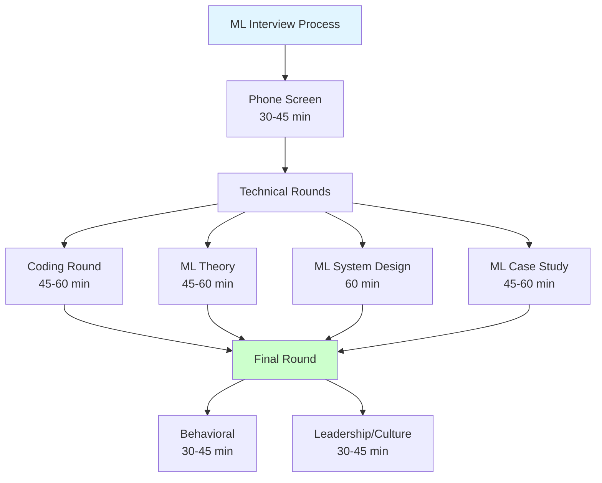
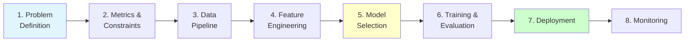

# Machine Learning Interview Preparation

**Complete guide to ace ML interviews at top tech companies.** Covers algorithms, coding, system design, and behavioral questions with real interview examples.

---

## 🎯 Interview Types Overview



**Typical interview process:**
1. **Phone Screen** (1 round) - Coding + ML basics
2. **Technical Rounds** (3-4 rounds) - Deep dive into skills
3. **Final Round** (1-2 rounds) - Behavioral + leadership

---

## 📚 Study Plan (4-6 Weeks)

### Week 1-2: Algorithms & Theory 🟢
**Focus:** Master fundamental ML algorithms

| Day | Topics | Study Hours |
|-----|--------|-------------|
| Mon-Tue | Linear/Logistic Regression, Decision Trees | 4h/day |
| Wed-Thu | SVM, Random Forest, Gradient Boosting | 4h/day |
| Fri | K-Means, PCA, Evaluation Metrics | 4h |
| Weekend | Practice coding algorithms from scratch | 6h |

**Key Topics:**
- [ ] [Linear Regression](supervised-learning/regression/linear-regression.md)
- [ ] [Logistic Regression](supervised-learning/classification/logistic-regression.md)
- [ ] [Decision Trees](supervised-learning/classification/decision-trees.md)
- [ ] [Random Forest](supervised-learning/classification/random-forest.md)
- [ ] [Gradient Boosting](supervised-learning/classification/gradient-boosting.md)
- [ ] [SVM](supervised-learning/classification/svm.md)
- [ ] K-Means
- [ ] PCA

### Week 3: Deep Learning & Neural Networks 🔴
**Focus:** Neural networks and modern architectures

| Day | Topics | Study Hours |
|-----|--------|-------------|
| Mon-Tue | Neural networks, backpropagation, activation functions | 4h/day |
| Wed-Thu | CNN, RNN, LSTM, Transformers | 4h/day |
| Fri | Optimization, regularization, batch norm | 4h |
| Weekend | Implement neural network from scratch | 6h |

**Key Topics:**
- [ ] [Neural Networks Basics](deep-learning/neural-networks-basics.md)
- [ ] [Backpropagation](deep-learning/backpropagation.md)
- [ ] [CNN](deep-learning/cnn.md)
- [ ] [RNN/LSTM](deep-learning/lstm-gru.md)
- [ ] [Transformers](deep-learning/transformers.md)
- [ ] [Optimizers](optimization/optimizers.md)

### Week 4: ML System Design & Case Studies 🟡
**Focus:** Production ML systems

| Day | Topics | Study Hours |
|-----|--------|-------------|
| Mon-Tue | ML system design patterns, scaling | 4h/day |
| Wed-Thu | Feature engineering, data pipelines | 4h/day |
| Fri | Model deployment, monitoring | 4h |
| Weekend | Practice system design questions | 6h |

**Key Topics:**
- [ ] ML system design framework
- [ ] Feature engineering at scale
- [ ] Model serving and deployment
- [ ] A/B testing and monitoring
- [ ] Real-time vs batch predictions

### Week 5-6: Practice & Mock Interviews 🎯
**Focus:** Full interview simulation

| Day | Activity | Study Hours |
|-----|----------|-------------|
| Mon-Wed | Solve ML coding problems | 3h/day |
| Thu | Mock ML theory interview | 2h |
| Fri | Mock ML system design interview | 2h |
| Weekend | Review mistakes, study weak areas | 6h |

**Practice Resources:**
- LeetCode (Top 100 interview questions)
- ML interview questions bank (see below)
- System design case studies
- Mock interviews on Pramp/interviewing.io

---

## 🧠 ML Theory Interview

### Top 50 Must-Know Questions

#### Fundamentals (Must Know)
1. **What is the bias-variance tradeoff?**
   - Explain with examples
   - How to detect high bias vs high variance
   - Techniques to reduce each

2. **Explain overfitting and underfitting**
   - Signs of each
   - Prevention techniques
   - Cross-validation

3. **What is regularization? L1 vs L2?**
   - When to use each
   - Mathematical formulation
   - Effect on weights

4. **Explain train/validation/test split**
   - Why three splits?
   - Typical ratios
   - Cross-validation alternatives

5. **What is gradient descent?**
   - Batch vs SGD vs mini-batch
   - Learning rate selection
   - Convergence criteria

#### Supervised Learning
6. **Linear regression assumptions**
   - Linearity, independence, normality, homoscedasticity
   - How to check assumptions
   - What if violated?

7. **Logistic regression: How does it work?**
   - Sigmoid function
   - Log loss
   - Why called "regression"?

8. **Decision trees: How are splits determined?**
   - Gini impurity vs entropy
   - Pruning techniques
   - Handling continuous features

9. **Random Forest vs Gradient Boosting**
   - Key differences
   - When to use each
   - Hyperparameters

10. **SVM: Explain kernel trick**
    - Linear vs non-linear
    - RBF kernel
    - C and gamma parameters

#### Deep Learning
11. **Explain backpropagation**
    - Chain rule
    - Vanishing/exploding gradients
    - Solutions (batch norm, skip connections)

12. **Activation functions: ReLU vs Sigmoid vs Tanh**
    - Pros and cons of each
    - When to use which
    - Dying ReLU problem

13. **CNN: How does convolution work?**
    - Filters and feature maps
    - Pooling layers
    - Translation invariance

14. **RNN vs LSTM vs GRU**
    - Vanishing gradient problem
    - LSTM gates
    - When to use transformers instead

15. **Transformers: Explain attention mechanism**
    - Self-attention
    - Multi-head attention
    - Positional encoding

#### Unsupervised Learning
16. **K-Means: How does it work?**
    - Algorithm steps
    - Choosing K (elbow method)
    - Limitations

17. **PCA: What does it do?**
    - Dimensionality reduction
    - Eigenvalues/eigenvectors
    - Variance explained

18. **Clustering evaluation metrics**
    - Silhouette score
    - Davies-Bouldin index
    - When labels unknown

#### Model Evaluation
19. **Classification metrics: Precision vs Recall**
    - When to optimize each
    - F1-score
    - Imbalanced datasets

20. **What is ROC-AUC?**
    - ROC curve interpretation
    - AUC = 0.5 vs 1.0
    - When AUC is misleading

21. **Cross-validation techniques**
    - K-fold
    - Stratified K-fold
    - Time series CV

22. **How to handle imbalanced data?**
    - SMOTE, undersampling, oversampling
    - Class weights
    - Evaluation metrics

#### Feature Engineering
23. **How to handle missing values?**
    - Mean/median imputation
    - KNN imputation
    - When to drop

24. **Feature scaling: Normalization vs Standardization**
    - When to use each
    - Algorithms that require scaling
    - Min-max vs z-score

25. **One-hot encoding vs Label encoding**
    - When to use each
    - Dummy variable trap
    - High cardinality features

#### Production & MLOps
26. **How to deploy ML models?**
    - Batch vs real-time
    - API serving
    - Model versioning

27. **What is model drift?**
    - Data drift vs concept drift
    - Detection methods
    - Retraining strategies

28. **A/B testing for ML models**
    - Experimental design
    - Statistical significance
    - Ramp-up strategies

#### Case Study Questions
29. **Design a recommendation system**
    - Collaborative filtering
    - Content-based filtering
    - Hybrid approaches

30. **How would you detect credit card fraud?**
    - Class imbalance
    - Feature engineering
    - Real-time detection

31. **Build a ranking system for search results**
    - Learning to rank
    - Features
    - Evaluation metrics

32. **Predict user churn**
    - Feature engineering
    - Model selection
    - Business impact

---

## 💻 ML Coding Interview

### Common Coding Questions

#### Implement from Scratch (Python)
1. **Linear Regression**
   ```python
   class LinearRegression:
       def fit(self, X, y):
           # Implement using normal equation or gradient descent
           pass

       def predict(self, X):
           pass
   ```

2. **Logistic Regression**
   ```python
   class LogisticRegression:
       def sigmoid(self, z):
           pass

       def fit(self, X, y, learning_rate, epochs):
           # Gradient descent
           pass

       def predict(self, X):
           pass
   ```

3. **K-Means Clustering**
   ```python
   class KMeans:
       def fit(self, X, k):
           # Initialize centroids
           # Assign clusters
           # Update centroids
           pass

       def predict(self, X):
           pass
   ```

4. **Decision Tree (simplified)**
   ```python
   class DecisionTree:
       def gini_impurity(self, y):
           pass

       def split(self, X, y, feature, threshold):
           pass

       def fit(self, X, y):
           pass

       def predict(self, X):
           pass
   ```

5. **Neural Network (2-layer)**
   ```python
   class NeuralNetwork:
       def __init__(self, input_size, hidden_size, output_size):
           pass

       def forward(self, X):
           pass

       def backward(self, X, y):
           pass

       def train(self, X, y, epochs):
           pass
   ```

#### Data Manipulation & Analysis
6. **Calculate evaluation metrics**
   ```python
   def precision_recall_f1(y_true, y_pred):
       # Calculate from confusion matrix
       pass

   def roc_auc(y_true, y_scores):
       pass
   ```

7. **Handle missing values**
   ```python
   def impute_missing(df, strategy='mean'):
       # Implement different strategies
       pass
   ```

8. **Feature scaling**
   ```python
   def standardize(X):
       # Z-score normalization
       pass

   def normalize(X):
       # Min-max scaling
       pass
   ```

9. **Train-test split**
   ```python
   def train_test_split(X, y, test_size=0.2, random_state=None):
       # Implement random split
       pass
   ```

10. **Cross-validation**
    ```python
    def k_fold_cv(model, X, y, k=5):
        # Implement k-fold cross-validation
        pass
    ```

### Complexity Analysis
**Be prepared to discuss:**
- Time complexity: O(n), O(n log n), O(n²)
- Space complexity
- Scalability to large datasets
- Optimization techniques

---

## 🏗️ ML System Design Interview

### Framework for System Design



### Template for ML System Design

#### 1. Problem Definition (5 min)
- **Clarify requirements**
  - What exactly are we predicting?
  - Is it classification, regression, ranking, recommendation?
  - What's the business objective?

- **Ask clarifying questions**
  - Scale (users, data size, QPS)
  - Latency requirements (real-time vs batch)
  - Accuracy vs speed tradeoff

#### 2. Metrics & Constraints (5 min)
- **Define success metrics**
  - Business metrics (revenue, engagement)
  - ML metrics (accuracy, precision, recall, AUC)
  - System metrics (latency, throughput)

- **Identify constraints**
  - Data availability
  - Computational resources
  - Latency requirements
  - Budget

#### 3. Data Pipeline (10 min)
- **Data sources**
  - Where is data coming from?
  - Batch vs streaming
  - Data quality and availability

- **Data storage**
  - Data warehouse (BigQuery, Redshift)
  - Feature store (Feast, Tecton)
  - Model registry (MLflow)

#### 4. Feature Engineering (10 min)
- **Feature types**
  - User features
  - Item features
  - Context features
  - Interaction features

- **Feature processing**
  - Encoding categorical variables
  - Handling missing values
  - Feature scaling
  - Feature selection

#### 5. Model Selection (10 min)
- **Candidate models**
  - Start simple (logistic regression, linear models)
  - Tree-based (Random Forest, XGBoost)
  - Deep learning (if needed)

- **Tradeoffs**
  - Accuracy vs interpretability
  - Training time vs inference time
  - Model complexity vs maintenance

#### 6. Training & Evaluation (5 min)
- **Training strategy**
  - Train/validation/test split
  - Cross-validation
  - Hyperparameter tuning

- **Offline evaluation**
  - Historical data evaluation
  - A/B test simulation

#### 7. Deployment (10 min)
- **Serving architecture**
  - Batch prediction vs real-time
  - Model serving (TensorFlow Serving, TorchServe)
  - API design (REST, gRPC)

- **Infrastructure**
  - Compute resources (CPU vs GPU)
  - Caching strategy
  - Load balancing

#### 8. Monitoring & Maintenance (5 min)
- **Monitoring**
  - Model performance metrics
  - Data drift detection
  - System health (latency, errors)

- **Retraining**
  - Trigger conditions
  - Retraining frequency
  - A/B testing new models

---

### Common ML System Design Questions

#### 1. Design a Recommendation System (Netflix, YouTube)
**Key points:**
- Collaborative filtering vs content-based
- Cold start problem
- Real-time personalization
- Candidate generation → Ranking
- Diversity and exploration
- Evaluation metrics (nDCG, MAP)

**Architecture:**
```
User Request → Candidate Generation (millions → thousands)
            → Ranking Model (thousands → hundreds)
            → Re-ranking & Business Rules
            → Return Top-N
```

#### 2. Design a Search Ranking System (Google, Bing)
**Key points:**
- Query understanding
- Document retrieval (inverted index)
- Learning to rank (LambdaMART, RankNet)
- Freshness vs relevance
- Personalization
- Click-through rate prediction

#### 3. Design a Fraud Detection System (Credit Card, PayPal)
**Key points:**
- Real-time detection (< 100ms)
- Highly imbalanced data
- Feature engineering (transaction patterns)
- False positive vs false negative tradeoff
- Feedback loop
- Model updating strategy

#### 4. Design an Ad Click Prediction System (Facebook, Google Ads)
**Key points:**
- CTR prediction
- Auction mechanism
- Feature engineering (user, ad, context)
- Calibration
- Cold start for new ads
- A/B testing

#### 5. Design a Feed Ranking System (Facebook, Twitter)
**Key points:**
- Engagement prediction
- Recency vs relevance
- Multi-objective optimization
- Real-time updates
- Diversity
- Filter bubble problem

#### 6. Design a Sentiment Analysis System
**Key points:**
- Text preprocessing
- Model selection (LSTM, BERT)
- Transfer learning
- Multi-language support
- Real-time vs batch
- Continuous learning

#### 7. Design an Image Classification System
**Key points:**
- CNN architecture selection
- Transfer learning (ResNet, EfficientNet)
- Data augmentation
- Class imbalance
- Model compression
- Edge deployment

---

## 🎤 Behavioral Interview

### STAR Method
**Situation** → **Task** → **Action** → **Result**

### Common Questions

#### Technical Excellence
1. **Tell me about a challenging ML project you worked on**
   - Problem complexity
   - Technical approach
   - Results and impact

2. **Describe a time when your model didn't perform well**
   - Root cause analysis
   - Debugging process
   - Solution and learnings

3. **How do you stay updated with ML research?**
   - Papers, conferences, blogs
   - Implementation and experimentation
   - Knowledge sharing

#### Collaboration
4. **Describe working with cross-functional teams**
   - Explaining ML to non-technical stakeholders
   - Gathering requirements
   - Balancing technical and business needs

5. **Tell me about a disagreement with a teammate**
   - Technical disagreement
   - Resolution process
   - Outcome

#### Leadership & Initiative
6. **Describe a time you took initiative**
   - Identifying opportunity
   - Implementation
   - Impact

7. **Tell me about mentoring or teaching others**
   - Knowledge transfer
   - Documentation
   - Team growth

#### Problem Solving
8. **Describe a time you had to make a tradeoff**
   - Accuracy vs latency
   - Complexity vs interpretability
   - Short-term vs long-term

---

## 📝 Company-Specific Preparation

### FAANG+ Companies

#### Google
**Focus Areas:**
- ML fundamentals (strong theory)
- Coding (LeetCode medium/hard)
- System design (large scale)
- **Tip:** Know TensorFlow, GCP

#### Meta (Facebook)
**Focus Areas:**
- Product sense
- ML system design (recommendations, ranking)
- Coding
- **Tip:** Know PyTorch, feed ranking

#### Amazon
**Focus Areas:**
- Leadership principles
- ML fundamentals
- Coding
- **Tip:** Know AWS SageMaker

#### Netflix
**Focus Areas:**
- Recommendation systems
- A/B testing
- Experimentation
- **Tip:** Focus on personalization

#### Apple
**Focus Areas:**
- On-device ML
- Privacy-preserving ML
- Model compression
- **Tip:** Know Core ML, edge deployment

#### Microsoft
**Focus Areas:**
- Azure ML
- ML fundamentals
- System design
- **Tip:** Know Azure ML, ONNX

---

## 🎯 Final Checklist (1 Week Before)

### Knowledge Review
- [ ] Review all fundamental algorithms
- [ ] Practice coding 5 algorithms from scratch
- [ ] Review 10 system design case studies
- [ ] Prepare behavioral stories (5-7 stories)

### Mock Interviews
- [ ] 2 coding mock interviews
- [ ] 2 ML theory mock interviews
- [ ] 1 system design mock interview
- [ ] 1 behavioral mock interview

### Logistics
- [ ] Test video/audio setup
- [ ] Prepare questions to ask interviewer
- [ ] Review company's ML blog/papers
- [ ] Get good sleep before interview

---

## 📚 Essential Resources

### Books
- *Cracking the Coding Interview* - Gayle McDowell
- *Designing Data-Intensive Applications* - Martin Kleppmann
- *Designing Machine Learning Systems* - Chip Huyen

### Websites
- [LeetCode](https://leetcode.com/) - Coding practice
- [ML Interview Guide](https://github.com/khangich/machine-learning-interview)
- [System Design Primer](https://github.com/donnemartin/system-design-primer)
- [Pramp](https://www.pramp.com/) - Mock interviews

### YouTube Channels
- **Exponent** - ML system design
- **Emma Ding** - ML interview tips
- **TechLead** - Interview strategies

---

## 🎓 Sample Interview Questions by Company

### Google Sample Questions
1. How would you detect if a model is overfitting?
2. Implement K-Means from scratch
3. Design YouTube's recommendation system
4. Explain gradient descent variants

### Meta Sample Questions
1. Design Facebook's news feed ranking
2. How would you measure success of a recommendation system?
3. Implement logistic regression from scratch
4. Explain precision-recall tradeoff

### Amazon Sample Questions
1. Design Amazon's product recommendation system
2. How would you handle highly imbalanced data?
3. Explain decision trees and random forests
4. How to deploy ML model at scale?

---

## 💡 Interview Day Tips

### Before Interview
1. Review company's ML products
2. Prepare 3-5 questions to ask
3. Have pen and paper ready
4. Test your setup 30 min before

### During Interview
1. **Think out loud** - Share your thought process
2. **Ask clarifying questions** - Don't assume
3. **Start simple** - Can always add complexity
4. **Admit when you don't know** - Be honest
5. **Manage time** - Don't get stuck on one part

### After Interview
1. Send thank-you email within 24h
2. Reflect on what went well/poorly
3. Note questions you couldn't answer
4. Follow up if no response in 1 week

---

## 🚀 Next Steps

**Based on your interview timeline:**

### 1 Week Out
- Focus on [ML Theory Interview](#ml-theory-interview)
- Do 2-3 mock interviews
- Review your past projects

### 2-4 Weeks Out
- Follow [4-week study plan](#study-plan-4-6-weeks)
- Practice coding daily
- Review system design patterns

### 1-2 Months Out
- Complete [Learning Path](learning-path.md) relevant sections
- Build 2-3 portfolio projects
- Practice all interview types

---

**Ready to ace your ML interview?** Start with the [4-week study plan](#study-plan-4-6-weeks) and practice consistently! 🎯

**Remember:** Interviews are a skill - the more you practice, the better you get! Good luck! 🍀
