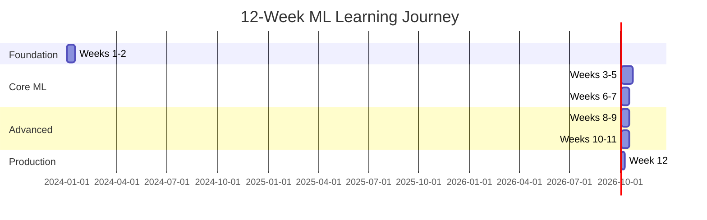

# Machine Learning Learning Path

**A comprehensive 12-week structured program to master machine learning from fundamentals to production.**

This learning path is designed to take you from ML beginner to proficient practitioner, with hands-on projects, mathematical understanding, and production-ready skills.

---

## 🎯 Learning Path Overview



**Time Commitment:** 15-20 hours per week
**Level:** Beginner to Advanced
**Prerequisites:** Basic Python, linear algebra, calculus

---

## Week 1-2: Foundations 🟢

**Goal:** Understand ML fundamentals and mathematical prerequisites

### Week 1: ML Concepts
**Topics:**
- [ ] [The Learning Problem](fundamentals/01-learning-problem.md)
- [ ] [Data - The Source of Intelligence](fundamentals/02-data-source.md)
- [ ] [Making Data Machine-Readable](fundamentals/03-numerical-representation.md)
- [ ] [Models as Functions](fundamentals/04-models-as-functions.md)
- [ ] [Types of ML](fundamentals/07-types-of-ml.md) (Supervised, Unsupervised, Reinforcement)

**Hands-on:**
- Set up Python environment (Jupyter, NumPy, Pandas, Scikit-learn)
- Explore datasets on Kaggle
- Simple data exploration and visualization

**Resources:**
- Andrew Ng's ML Course (Week 1)
- Python ML basics tutorials

### Week 2: Mathematics for ML
**Topics:**
- [ ] [Linear Algebra](fundamentals/08-mathematics.md#linear-algebra) (Vectors, Matrices)
- [ ] [Calculus](fundamentals/08-mathematics.md#calculus) (Derivatives, Gradients)
- [ ] [Probability & Statistics](fundamentals/08-mathematics.md#probability) (Distributions, Bayes)
- [ ] Cost functions and optimization basics

**Hands-on:**
- Implement matrix operations from scratch
- Calculate derivatives manually
- Visualize probability distributions

**Mini Project:** Build a simple rule-based classifier

---

## Week 3-5: Supervised Learning 🟡

**Goal:** Master regression and classification algorithms

### Week 3: Regression
**Topics:**
- [ ] [Linear Regression](supervised-learning/regression/linear-regression.md)
- [ ] [Polynomial Regression](supervised-learning/regression/polynomial-regression.md)
- [ ] [Ridge Regression (L2)](supervised-learning/regression/ridge-regression.md)
- [ ] [Lasso Regression (L1)](supervised-learning/regression/lasso-regression.md)
- [ ] [Regression Metrics](evaluation/regression-metrics.md)

**Hands-on:**
- Implement linear regression from scratch
- Use scikit-learn for various regression models
- Compare regularization techniques
- Feature scaling and preprocessing

**Project:** House price prediction

### Week 4: Classification (Part 1)
**Topics:**
- [ ] [Logistic Regression](supervised-learning/classification/logistic-regression.md)
- [ ] [Decision Trees](supervised-learning/classification/decision-trees.md)
- [ ] [K-Nearest Neighbors](supervised-learning/classification/knn.md)
- [ ] [Naive Bayes](supervised-learning/classification/naive-bayes.md)
- [ ] [Classification Metrics](evaluation/classification-metrics.md)
- [ ] [Confusion Matrix](evaluation/confusion-matrix.md)

**Hands-on:**
- Implement logistic regression
- Build decision trees with different depths
- Tune KNN hyperparameters
- Calculate precision, recall, F1-score

**Project:** Email spam classifier

### Week 5: Classification (Part 2) & Ensemble
**Topics:**
- [ ] [Support Vector Machines](supervised-learning/classification/svm.md)
- [ ] [Random Forest](supervised-learning/classification/random-forest.md)
- [ ] [Gradient Boosting](supervised-learning/classification/gradient-boosting.md)
- [ ] [Bagging](supervised-learning/ensemble-methods/bagging.md)
- [ ] [Boosting](supervised-learning/ensemble-methods/boosting.md)
- [ ] [ROC-AUC Curve](evaluation/roc-auc.md)

**Hands-on:**
- Compare SVM kernels
- Build Random Forest and XGBoost models
- Ensemble different models
- Handle imbalanced datasets

**Project:** Credit card fraud detection

---

## Week 6-7: Unsupervised Learning 🟡

**Goal:** Learn pattern discovery and dimensionality reduction

### Week 6: Clustering
**Topics:**
- [ ] [K-Means](unsupervised-learning/clustering/kmeans.md)
- [ ] [Hierarchical Clustering](unsupervised-learning/clustering/hierarchical.md)
- [ ] [DBSCAN](unsupervised-learning/clustering/dbscan.md)
- [ ] [Gaussian Mixture Models](unsupervised-learning/clustering/gaussian-mixture.md)
- [ ] Clustering evaluation metrics

**Hands-on:**
- Implement K-Means from scratch
- Compare clustering algorithms
- Determine optimal number of clusters
- Visualize clusters

**Project:** Customer segmentation

### Week 7: Dimensionality Reduction
**Topics:**
- [ ] [PCA](unsupervised-learning/dimensionality-reduction/pca.md)
- [ ] [t-SNE](unsupervised-learning/dimensionality-reduction/tsne.md)
- [ ] [UMAP](unsupervised-learning/dimensionality-reduction/umap.md)
- [ ] [Isolation Forest](unsupervised-learning/anomaly-detection/isolation-forest.md)
- [ ] [One-Class SVM](unsupervised-learning/anomaly-detection/one-class-svm.md)

**Hands-on:**
- Reduce high-dimensional data with PCA
- Visualize embeddings with t-SNE
- Detect anomalies in datasets

**Project:** Image compression with PCA, Anomaly detection

---

## Week 8-9: Deep Learning 🔴

**Goal:** Master neural networks and modern architectures

### Week 8: Neural Network Fundamentals
**Topics:**
- [ ] [Neural Networks Basics](deep-learning/neural-networks-basics.md)
- [ ] [Activation Functions](deep-learning/activation-functions.md)
- [ ] [Backpropagation](deep-learning/backpropagation.md)
- [ ] [Gradient Descent](optimization/gradient-descent.md)
- [ ] [Optimizers](optimization/optimizers.md) (SGD, Adam, RMSprop)
- [ ] [Regularization](optimization/regularization.md)
- [ ] [Dropout](optimization/dropout.md)
- [ ] [Batch Normalization](optimization/batch-normalization.md)

**Hands-on:**
- Implement neural network from scratch (NumPy)
- Build networks with TensorFlow/PyTorch
- Experiment with different activations
- Prevent overfitting with regularization

**Project:** MNIST digit classification

### Week 9: Advanced Architectures
**Topics:**
- [ ] [Convolutional Neural Networks (CNN)](deep-learning/cnn.md)
- [ ] [Recurrent Neural Networks (RNN)](deep-learning/rnn.md)
- [ ] [LSTM & GRU](deep-learning/lstm-gru.md)
- [ ] [Transfer Learning](deep-learning/transfer-learning.md)
- [ ] [Attention Mechanisms](deep-learning/attention-mechanisms.md)
- [ ] [Transformers](deep-learning/transformers.md) (Introduction)

**Hands-on:**
- Build CNN for image classification
- Use pre-trained models (ResNet, VGG)
- Build RNN for sequence prediction
- Fine-tune BERT for text classification

**Project:** Image classifier with CNN, Sentiment analysis with LSTM

---

## Week 10-11: Feature Engineering & Model Evaluation 🟡

**Goal:** Master data preprocessing and model validation

### Week 10: Feature Engineering
**Topics:**
- [ ] [Data Cleaning](feature-engineering/data-cleaning.md)
- [ ] [Missing Values](feature-engineering/missing-values.md)
- [ ] [Outlier Detection](feature-engineering/outlier-detection.md)
- [ ] [Feature Scaling](feature-engineering/feature-scaling.md)
- [ ] [Encoding Categorical Variables](feature-engineering/encoding-categorical.md)
- [ ] [Feature Creation](feature-engineering/feature-creation.md)
- [ ] [Feature Selection](feature-engineering/feature-selection.md)
- [ ] [Handling Imbalanced Data](feature-engineering/imbalanced-data.md)

**Hands-on:**
- Clean messy datasets
- Handle missing data with various strategies
- Create polynomial and interaction features
- Use feature importance for selection

**Project:** End-to-end data preprocessing pipeline

### Week 11: Model Evaluation & Selection
**Topics:**
- [ ] [Cross-Validation](evaluation/cross-validation.md)
- [ ] [Model Selection](evaluation/model-selection.md)
- [ ] [Hyperparameter Tuning](optimization/hyperparameter-tuning.md)
- [ ] [Learning Curves](evaluation/learning-curves.md)
- [ ] Statistical significance testing
- [ ] A/B testing for ML models

**Hands-on:**
- Implement k-fold cross-validation
- Grid search and random search
- Compare multiple models systematically
- Analyze learning curves

**Project:** Model comparison and selection framework

---

## Week 12: MLOps & Production 🔴

**Goal:** Deploy and maintain ML systems in production

**Topics:**
- [ ] [Experiment Tracking](mlops/experiment-tracking.md) (MLflow, Weights & Biases)
- [ ] [Model Deployment](mlops/model-deployment.md)
- [ ] [Model Serving](mlops/model-serving.md) (Flask, FastAPI)
- [ ] [Monitoring & Drift Detection](mlops/monitoring.md)
- [ ] [CI/CD for ML](mlops/ci-cd.md)
- [ ] [Best Practices](mlops/best-practices.md)
- [ ] Docker for ML
- [ ] Cloud deployment (AWS SageMaker, GCP AI Platform)

**Hands-on:**
- Create REST API for model serving
- Deploy model to cloud
- Set up monitoring dashboard
- Build CI/CD pipeline

**Final Project:** Full ML pipeline with deployment

---

## 🎯 Weekly Schedule Template

**Recommended daily breakdown (20 hours/week):**

| Day | Focus | Hours |
|-----|-------|-------|
| Monday | Theory & Concepts | 3h |
| Tuesday | Hands-on Coding | 3h |
| Wednesday | Theory & Concepts | 3h |
| Thursday | Hands-on Coding | 3h |
| Friday | Project Work | 4h |
| Weekend | Review & Extra Practice | 4h |

**Daily routine:**
1. **Morning:** Watch lectures/read documentation (1-1.5h)
2. **Afternoon:** Hands-on coding and exercises (1.5-2h)
3. **Evening:** Review, take notes, and Q&A

---

## 📚 Required Projects

Complete these projects throughout your learning journey:

### Beginner Projects (Weeks 1-5)
1. **House Price Prediction** - Regression
2. **Iris Classification** - Multi-class classification
3. **Email Spam Detector** - Binary classification
4. **Credit Card Fraud Detection** - Imbalanced data

### Intermediate Projects (Weeks 6-9)
5. **Customer Segmentation** - Clustering
6. **Recommender System** - Collaborative filtering
7. **MNIST Digit Recognition** - Neural networks
8. **Image Classifier** - CNN with transfer learning
9. **Sentiment Analysis** - NLP with RNN/LSTM

### Advanced Projects (Weeks 10-12)
10. **Kaggle Competition** - Apply all skills
11. **End-to-End ML Pipeline** - From data to deployment
12. **Production ML System** - Deploy with monitoring

---

## 🎓 Assessments & Checkpoints

### Week 4 Checkpoint
- [ ] Understand bias-variance tradeoff
- [ ] Implement linear regression from scratch
- [ ] Build and evaluate classification models
- [ ] Complete 2 beginner projects

### Week 8 Checkpoint
- [ ] Master all supervised learning algorithms
- [ ] Understand clustering and PCA
- [ ] Complete 4 intermediate projects
- [ ] Participate in 1 Kaggle competition

### Week 12 Final Assessment
- [ ] Build neural networks in TensorFlow/PyTorch
- [ ] Create production-ready ML pipeline
- [ ] Deploy model to cloud
- [ ] Complete all 12 projects
- [ ] Pass mock ML interview

---

## 🛠️ Tools & Setup

### Essential Software
```bash
# Create virtual environment
python -m venv ml-env
source ml-env/bin/activate  # On Windows: ml-env\Scripts\activate

# Install core libraries
pip install numpy pandas scikit-learn matplotlib seaborn
pip install jupyter notebook ipython

# Deep learning frameworks
pip install tensorflow torch torchvision

# MLOps tools
pip install mlflow wandb fastapi uvicorn docker

# Visualization
pip install plotly dash
```

### Development Environment
- **IDE:** VS Code, PyCharm, or Jupyter Lab
- **Version Control:** Git & GitHub
- **Notebooks:** Jupyter Notebook/Lab
- **Cloud:** Google Colab (free GPU), Kaggle Kernels

### Hardware Requirements
- **Minimum:** 8GB RAM, CPU-only (weeks 1-7)
- **Recommended:** 16GB RAM, NVIDIA GPU (weeks 8-12)
- **Cloud Alternative:** Google Colab, Kaggle Kernels

---

## 📖 Learning Resources

### Books
- **Essential:** *Hands-On Machine Learning* by Aurélien Géron
- **Theory:** *Pattern Recognition and Machine Learning* by Christopher Bishop
- **Deep Learning:** *Deep Learning* by Goodfellow, Bengio, Courville

### Online Courses
1. **Andrew Ng's ML Specialization** (Coursera) - Weeks 1-7
2. **Fast.ai Practical Deep Learning** - Weeks 8-9
3. **DeepLearning.AI TensorFlow** - Weeks 8-9
4. **Full Stack Deep Learning** - Week 12

### Practice Platforms
- **Kaggle** - Competitions and datasets
- **LeetCode/HackerRank** - ML interview prep
- **Papers with Code** - Latest research
- **Google Dataset Search** - Find datasets

---

## 🎯 Learning Strategies

### Active Learning
1. **Code every algorithm from scratch** (at least once)
2. **Explain concepts** to others or write blog posts
3. **Teach someone** or create tutorials
4. **Participate** in study groups or forums

### Deliberate Practice
1. **Don't just run code** - understand every line
2. **Experiment** with hyperparameters
3. **Break things** on purpose to understand errors
4. **Compare** your implementations with libraries

### Spaced Repetition
1. **Review previous weeks** every Sunday
2. **Maintain a learning journal**
3. **Revisit projects** with new techniques
4. **Create flashcards** for key concepts

---

## 🚨 Common Pitfalls to Avoid

!!! danger "Critical Mistakes"
    1. **Tutorial Hell** - Don't just watch, code along!
    2. **Skipping Math** - Understanding math helps debugging
    3. **No Projects** - Projects solidify learning
    4. **Not Asking Questions** - Use forums, Discord, Reddit
    5. **Comparing Progress** - Everyone learns at their own pace
    6. **Perfectionism** - Done is better than perfect
    7. **No Version Control** - Use Git from day one

---

## 🎓 Post-Learning Path

### Continue Learning
- [ ] Specialize (NLP, Computer Vision, RL)
- [ ] Read research papers weekly
- [ ] Contribute to open-source ML projects
- [ ] Start a blog or YouTube channel
- [ ] Attend ML conferences (NeurIPS, ICML, CVPR)

### Career Preparation
- [ ] Build portfolio with 5+ projects
- [ ] Create GitHub profile
- [ ] Write technical blog posts
- [ ] Network on LinkedIn
- [ ] Prepare for [ML interviews](interview-prep.md)
- [ ] Apply for ML positions or internships

---

## 📊 Progress Tracker

Track your progress through the 12-week journey:

```markdown
## Week 1-2: Foundations
- [x] Week 1 completed
- [ ] Week 2 completed

## Week 3-5: Supervised Learning
- [ ] Week 3 completed
- [ ] Week 4 completed
- [ ] Week 5 completed

## Week 6-7: Unsupervised Learning
- [ ] Week 6 completed
- [ ] Week 7 completed

## Week 8-9: Deep Learning
- [ ] Week 8 completed
- [ ] Week 9 completed

## Week 10-11: Feature Engineering & Evaluation
- [ ] Week 10 completed
- [ ] Week 11 completed

## Week 12: MLOps
- [ ] Week 12 completed

## Projects Completed: 0/12
```

---

## 🤝 Community & Support

**Get help and stay motivated:**
- [r/MachineLearning](https://reddit.com/r/MachineLearning) - Reddit community
- [r/learnmachinelearning](https://reddit.com/r/learnmachinelearning) - Beginner-friendly
- [Kaggle Forums](https://www.kaggle.com/discussion) - Dataset and competition discussions
- [Stack Overflow](https://stackoverflow.com/questions/tagged/machine-learning) - Technical questions
- [Discord ML Communities](https://discord.gg/machinelearning) - Real-time help

**Study Groups:**
- Form or join a study group (4-6 people)
- Weekly sync meetings
- Share learnings and projects
- Pair programming sessions

---

**Ready to start your 12-week ML journey?** Begin with [Week 1: Fundamentals](fundamentals/index.md)! 🚀

**Remember:** Consistency beats intensity. 2 hours daily for 12 weeks > 8 hours once a week!
