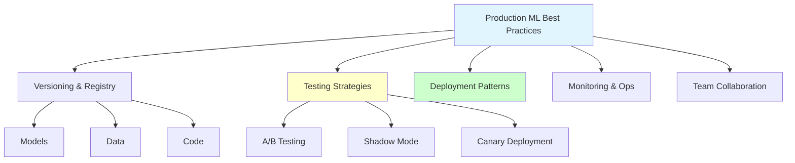
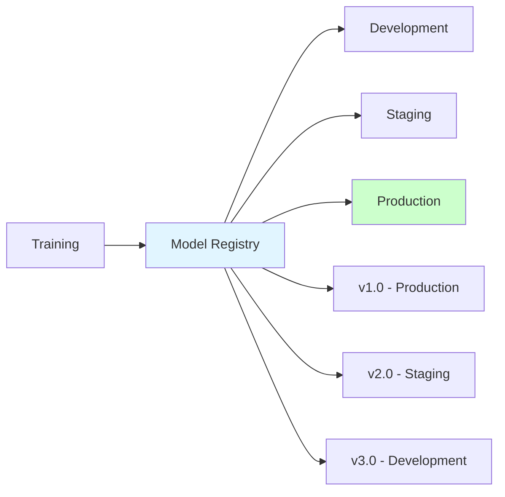
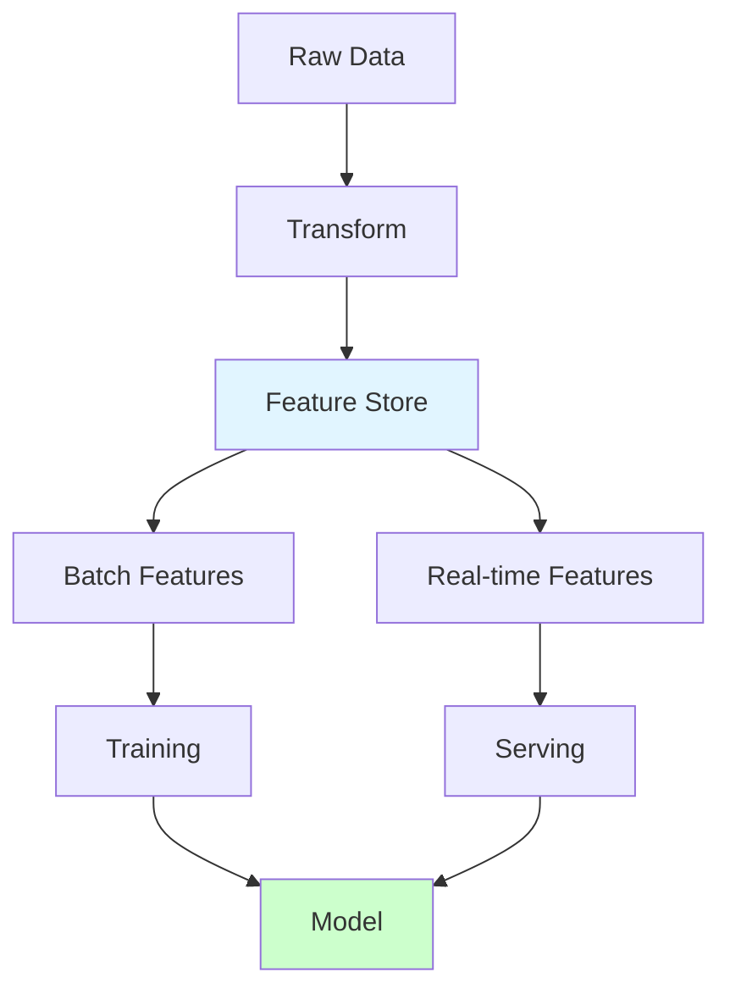
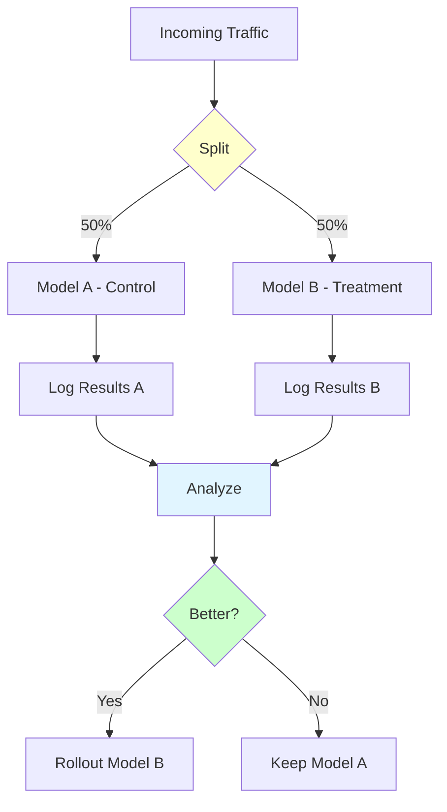
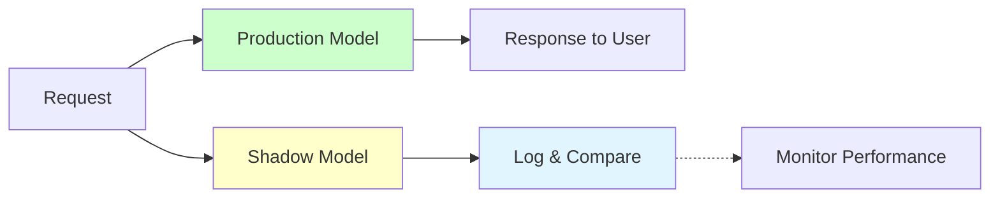
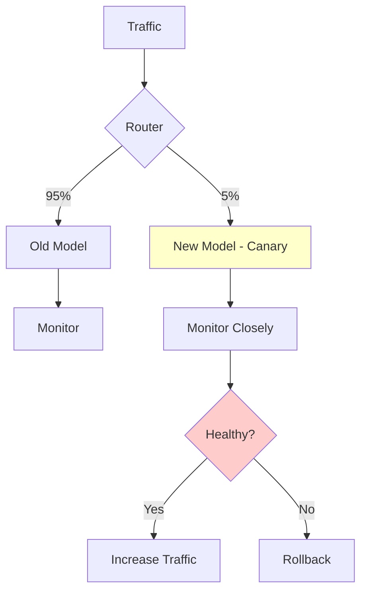

# Production ML Best Practices

**Build reliable, scalable, and maintainable ML systems.** Learn production-proven patterns, strategies, and practices for deploying ML models successfully.

**Prerequisites:** MLOps fundamentals, deployment experience, system design basics

---

## 🎯 Overview

Production ML requires more than just a good model. It demands robust infrastructure, reliable processes, and operational excellence. This guide covers battle-tested best practices from production ML systems.



---

## 🗂️ Model Versioning & Registry

### Model Registry Architecture



### MLflow Model Registry

```python
import mlflow
from mlflow.tracking import MlflowClient

class ModelRegistry:
    """
    Manage model lifecycle with MLflow registry.
    """

    def __init__(self, tracking_uri):
        mlflow.set_tracking_uri(tracking_uri)
        self.client = MlflowClient()

    def register_model(self, run_id, model_name, description=""):
        """
        Register a new model version.

        Args:
            run_id: MLflow run ID
            model_name: Name of model in registry
            description: Model description
        """
        model_uri = f"runs:/{run_id}/model"

        # Register model
        result = mlflow.register_model(
            model_uri=model_uri,
            name=model_name
        )

        # Add description
        if description:
            self.client.update_model_version(
                name=model_name,
                version=result.version,
                description=description
            )

        print(f"Registered {model_name} version {result.version}")
        return result.version

    def promote_model(self, model_name, version, stage):
        """
        Promote model to a stage (Staging/Production).

        Args:
            model_name: Model name
            version: Version number
            stage: 'Staging' or 'Production'
        """
        # Archive current production model
        if stage == "Production":
            self.archive_current_production(model_name)

        # Promote new version
        self.client.transition_model_version_stage(
            name=model_name,
            version=version,
            stage=stage
        )

        print(f"Promoted {model_name} v{version} to {stage}")

    def archive_current_production(self, model_name):
        """Archive current production model."""
        # Get current production versions
        versions = self.client.search_model_versions(
            filter_string=f"name='{model_name}'"
        )

        for version in versions:
            if version.current_stage == "Production":
                self.client.transition_model_version_stage(
                    name=model_name,
                    version=version.version,
                    stage="Archived"
                )
                print(f"Archived previous production version {version.version}")

    def load_model(self, model_name, stage="Production"):
        """
        Load model from registry.

        Args:
            model_name: Model name
            stage: 'Staging', 'Production', or version number
        """
        if isinstance(stage, int):
            model_uri = f"models:/{model_name}/{stage}"
        else:
            model_uri = f"models:/{model_name}/{stage}"

        model = mlflow.pyfunc.load_model(model_uri)
        return model

    def compare_models(self, model_name, version1, version2, test_data):
        """
        Compare two model versions.

        Returns comparison metrics.
        """
        from sklearn.metrics import accuracy_score, f1_score

        # Load both models
        model1 = self.load_model(model_name, version1)
        model2 = self.load_model(model_name, version2)

        X_test, y_test = test_data

        # Predictions
        pred1 = model1.predict(X_test)
        pred2 = model2.predict(X_test)

        # Metrics
        comparison = {
            'version1': {
                'version': version1,
                'accuracy': accuracy_score(y_test, pred1),
                'f1': f1_score(y_test, pred1, average='weighted')
            },
            'version2': {
                'version': version2,
                'accuracy': accuracy_score(y_test, pred2),
                'f1': f1_score(y_test, pred2, average='weighted')
            }
        }

        print("\n" + "="*60)
        print("Model Comparison")
        print("="*60)
        for key, metrics in comparison.items():
            print(f"\n{key.upper()} (v{metrics['version']}):")
            print(f"  Accuracy: {metrics['accuracy']:.4f}")
            print(f"  F1 Score: {metrics['f1']:.4f}")

        return comparison

# Usage
registry = ModelRegistry("http://localhost:5000")

# Register new model
version = registry.register_model(
    run_id="abc123",
    model_name="fraud_detection",
    description="Random Forest with feature engineering v2"
)

# Promote to staging
registry.promote_model("fraud_detection", version, "Staging")

# Test in staging, then promote to production
registry.promote_model("fraud_detection", version, "Production")

# Load for inference
model = registry.load_model("fraud_detection", "Production")
```

---

## 📦 Feature Store

### Why Feature Store?

**Problems it solves:**
- **Feature inconsistency**: Training vs serving
- **Feature reusability**: Share features across models
- **Feature versioning**: Track feature changes
- **Real-time features**: Low-latency feature serving



### Simple Feature Store Implementation

```python
import pandas as pd
import redis
import json
from typing import Dict, List
from datetime import datetime

class FeatureStore:
    """
    Simple feature store with offline and online storage.
    """

    def __init__(self, offline_path="features/", redis_host="localhost"):
        self.offline_path = offline_path
        self.redis_client = redis.Redis(host=redis_host, decode_responses=True)

    # Offline features (for training)
    def save_offline_features(self, df: pd.DataFrame, feature_set_name: str):
        """
        Save features for training.

        Args:
            df: Feature dataframe
            feature_set_name: Name of feature set
        """
        # Add metadata
        metadata = {
            'created_at': datetime.now().isoformat(),
            'n_rows': len(df),
            'n_features': len(df.columns),
            'features': list(df.columns)
        }

        # Save features
        feature_path = f"{self.offline_path}/{feature_set_name}.parquet"
        df.to_parquet(feature_path)

        # Save metadata
        metadata_path = f"{self.offline_path}/{feature_set_name}_metadata.json"
        with open(metadata_path, 'w') as f:
            json.dump(metadata, f, indent=2)

        print(f"Saved {len(df)} rows to {feature_path}")

    def load_offline_features(self, feature_set_name: str) -> pd.DataFrame:
        """Load features for training."""
        feature_path = f"{self.offline_path}/{feature_set_name}.parquet"
        df = pd.read_parquet(feature_path)
        return df

    # Online features (for serving)
    def publish_online_features(self, entity_id: str, features: Dict):
        """
        Publish features to online store (Redis) for low-latency serving.

        Args:
            entity_id: Entity identifier (user_id, transaction_id, etc.)
            features: Feature dictionary
        """
        key = f"features:{entity_id}"
        self.redis_client.setex(
            key,
            3600,  # TTL: 1 hour
            json.dumps(features)
        )

    def get_online_features(self, entity_id: str) -> Dict:
        """Get features from online store."""
        key = f"features:{entity_id}"
        data = self.redis_client.get(key)

        if data:
            return json.loads(data)
        return None

    # Feature definitions
    def register_features(self, feature_definitions: Dict):
        """
        Register feature definitions.

        Args:
            feature_definitions: Dict mapping feature names to compute functions
        """
        self.feature_definitions = feature_definitions

    def compute_features(self, entity_data: pd.DataFrame) -> pd.DataFrame:
        """
        Compute features from raw data.

        Args:
            entity_data: Raw entity data

        Returns:
            Feature dataframe
        """
        features = {}

        for feature_name, compute_fn in self.feature_definitions.items():
            features[feature_name] = entity_data.apply(compute_fn, axis=1)

        return pd.DataFrame(features)

# Usage Example
feature_store = FeatureStore()

# Define features
feature_definitions = {
    'transaction_amount': lambda row: row['amount'],
    'hour_of_day': lambda row: pd.to_datetime(row['timestamp']).hour,
    'day_of_week': lambda row: pd.to_datetime(row['timestamp']).dayofweek,
    'amount_zscore': lambda row: (row['amount'] - 100) / 50,  # Simplified
}

feature_store.register_features(feature_definitions)

# Offline: Compute and save features for training
raw_data = pd.read_csv('data/transactions.csv')
features_df = feature_store.compute_features(raw_data)
feature_store.save_offline_features(features_df, 'transaction_features_v1')

# Load for training
training_features = feature_store.load_offline_features('transaction_features_v1')

# Online: Publish features for real-time serving
transaction_features = {
    'transaction_amount': 125.50,
    'hour_of_day': 14,
    'day_of_week': 3,
    'amount_zscore': 0.51
}

feature_store.publish_online_features('txn_12345', transaction_features)

# Retrieve for prediction
features = feature_store.get_online_features('txn_12345')
prediction = model.predict([list(features.values())])
```

---

## 🧪 A/B Testing

### A/B Testing Framework



```python
import random
import uuid
from typing import Dict
from datetime import datetime
import json

class ABTestManager:
    """
    Manage A/B tests for model comparison.
    """

    def __init__(self, model_a, model_b, split_ratio=0.5):
        """
        Args:
            model_a: Control model (current production)
            model_b: Treatment model (new version)
            split_ratio: Traffic to model B (0.0 to 1.0)
        """
        self.model_a = model_a
        self.model_b = model_b
        self.split_ratio = split_ratio

        # Store results
        self.results_a = []
        self.results_b = []

    def predict(self, features, user_id=None):
        """
        Route prediction to A or B based on split ratio.

        Args:
            features: Input features
            user_id: User identifier (for consistent routing)

        Returns:
            prediction: Model prediction
            variant: 'A' or 'B'
            experiment_id: Unique experiment ID
        """
        # Assign to variant
        if user_id:
            # Consistent hashing for same user
            variant = self._assign_variant_consistent(user_id)
        else:
            # Random assignment
            variant = self._assign_variant_random()

        # Generate experiment ID
        experiment_id = str(uuid.uuid4())

        # Make prediction
        if variant == 'A':
            prediction = self.model_a.predict([features])[0]
        else:
            prediction = self.model_b.predict([features])[0]

        # Log experiment
        self._log_experiment(
            experiment_id=experiment_id,
            variant=variant,
            features=features,
            prediction=prediction
        )

        return prediction, variant, experiment_id

    def log_outcome(self, experiment_id, actual_label, variant):
        """
        Log actual outcome for experiment.

        Args:
            experiment_id: Experiment ID
            actual_label: True label
            variant: 'A' or 'B'
        """
        result = {
            'experiment_id': experiment_id,
            'actual_label': actual_label,
            'timestamp': datetime.now().isoformat()
        }

        if variant == 'A':
            self.results_a.append(result)
        else:
            self.results_b.append(result)

    def _assign_variant_random(self):
        """Random variant assignment."""
        return 'B' if random.random() < self.split_ratio else 'A'

    def _assign_variant_consistent(self, user_id):
        """Consistent variant assignment based on user ID."""
        # Hash user ID to get consistent assignment
        hash_value = hash(user_id)
        return 'B' if (hash_value % 100) < (self.split_ratio * 100) else 'A'

    def _log_experiment(self, experiment_id, variant, features, prediction):
        """Log experiment details."""
        log_entry = {
            'experiment_id': experiment_id,
            'variant': variant,
            'features': features,
            'prediction': prediction,
            'timestamp': datetime.now().isoformat()
        }

        # Save to database/file
        # For demo, just print
        # print(f"Logged: {log_entry}")

    def analyze_results(self):
        """
        Analyze A/B test results.

        Returns statistical comparison.
        """
        from sklearn.metrics import accuracy_score, precision_score
        from scipy.stats import chi2_contingency

        # Calculate metrics for A
        predictions_a = [r['prediction'] for r in self.results_a]
        actuals_a = [r['actual_label'] for r in self.results_a]

        if actuals_a:
            accuracy_a = accuracy_score(actuals_a, predictions_a)
            precision_a = precision_score(actuals_a, predictions_a, zero_division=0)
        else:
            accuracy_a = precision_a = 0

        # Calculate metrics for B
        predictions_b = [r['prediction'] for r in self.results_b]
        actuals_b = [r['actual_label'] for r in self.results_b]

        if actuals_b:
            accuracy_b = accuracy_score(actuals_b, predictions_b)
            precision_b = precision_score(actuals_b, predictions_b, zero_division=0)
        else:
            accuracy_b = precision_b = 0

        # Statistical significance test (simplified)
        if len(actuals_a) > 10 and len(actuals_b) > 10:
            # Chi-square test for independence
            contingency_table = [
                [sum(predictions_a), len(predictions_a) - sum(predictions_a)],
                [sum(predictions_b), len(predictions_b) - sum(predictions_b)]
            ]
            chi2, p_value, _, _ = chi2_contingency(contingency_table)
            is_significant = p_value < 0.05
        else:
            is_significant = False
            p_value = None

        results = {
            'variant_a': {
                'n_samples': len(actuals_a),
                'accuracy': accuracy_a,
                'precision': precision_a
            },
            'variant_b': {
                'n_samples': len(actuals_b),
                'accuracy': accuracy_b,
                'precision': precision_b
            },
            'improvement': {
                'accuracy': accuracy_b - accuracy_a,
                'precision': precision_b - precision_a
            },
            'statistical_significance': {
                'is_significant': is_significant,
                'p_value': p_value
            }
        }

        self._print_analysis(results)
        return results

    def _print_analysis(self, results):
        """Print analysis results."""
        print("\n" + "="*70)
        print("A/B Test Results")
        print("="*70)

        print(f"\nVariant A (Control):")
        print(f"  Samples: {results['variant_a']['n_samples']}")
        print(f"  Accuracy: {results['variant_a']['accuracy']:.4f}")
        print(f"  Precision: {results['variant_a']['precision']:.4f}")

        print(f"\nVariant B (Treatment):")
        print(f"  Samples: {results['variant_b']['n_samples']}")
        print(f"  Accuracy: {results['variant_b']['accuracy']:.4f}")
        print(f"  Precision: {results['variant_b']['precision']:.4f}")

        print(f"\nImprovement:")
        print(f"  Accuracy: {results['improvement']['accuracy']:+.4f}")
        print(f"  Precision: {results['improvement']['precision']:+.4f}")

        if results['statistical_significance']['is_significant']:
            print(f"\n✅ Results are statistically significant (p={results['statistical_significance']['p_value']:.4f})")
        else:
            print(f"\n⚠️  Results not statistically significant")

# Usage
ab_test = ABTestManager(
    model_a=production_model,
    model_b=new_model,
    split_ratio=0.2  # 20% traffic to new model
)

# Make predictions
prediction, variant, exp_id = ab_test.predict(features, user_id="user123")

# Later, log outcome
ab_test.log_outcome(exp_id, actual_label=1, variant=variant)

# Analyze after collecting enough samples
results = ab_test.analyze_results()
```

---

## 🌗 Shadow Mode Deployment

**Test new model in production without affecting users.**



```python
import threading
from typing import Any
import time

class ShadowDeployment:
    """
    Run shadow model alongside production model.
    """

    def __init__(self, production_model, shadow_model, log_path="logs/shadow/"):
        self.production_model = production_model
        self.shadow_model = shadow_model
        self.log_path = log_path

        # Metrics
        self.shadow_errors = []
        self.shadow_latencies = []

    def predict(self, features):
        """
        Run both models, return production result.

        Args:
            features: Input features

        Returns:
            Production model prediction
        """
        # Production prediction (synchronous)
        start_prod = time.time()
        prod_prediction = self.production_model.predict([features])[0]
        prod_latency = time.time() - start_prod

        # Shadow prediction (async, non-blocking)
        threading.Thread(
            target=self._shadow_predict,
            args=(features, prod_prediction, prod_latency)
        ).start()

        # Return production result immediately
        return prod_prediction

    def _shadow_predict(self, features, prod_prediction, prod_latency):
        """Run shadow model in background."""
        try:
            start_shadow = time.time()
            shadow_prediction = self.shadow_model.predict([features])[0]
            shadow_latency = time.time() - start_shadow

            # Log comparison
            self._log_comparison(
                features=features,
                prod_prediction=prod_prediction,
                shadow_prediction=shadow_prediction,
                prod_latency=prod_latency,
                shadow_latency=shadow_latency
            )

            # Track latency
            self.shadow_latencies.append(shadow_latency)

        except Exception as e:
            self.shadow_errors.append(str(e))
            print(f"Shadow model error: {e}")

    def _log_comparison(self, features, prod_prediction, shadow_prediction,
                        prod_latency, shadow_latency):
        """Log comparison between models."""
        log_entry = {
            'timestamp': datetime.now().isoformat(),
            'features': features,
            'prod_prediction': int(prod_prediction),
            'shadow_prediction': int(shadow_prediction),
            'agreement': int(prod_prediction == shadow_prediction),
            'prod_latency_ms': prod_latency * 1000,
            'shadow_latency_ms': shadow_latency * 1000
        }

        # Save to file (in practice, use a database)
        log_file = f"{self.log_path}/shadow_log_{datetime.now():%Y%m%d}.jsonl"
        with open(log_file, 'a') as f:
            f.write(json.dumps(log_entry) + '\n')

    def get_metrics(self):
        """Get shadow deployment metrics."""
        if not self.shadow_latencies:
            return None

        import numpy as np

        # Read logs to calculate agreement
        # (simplified for demo)

        metrics = {
            'shadow_errors': len(self.shadow_errors),
            'avg_latency_ms': np.mean(self.shadow_latencies) * 1000,
            'p95_latency_ms': np.percentile(self.shadow_latencies, 95) * 1000,
            'p99_latency_ms': np.percentile(self.shadow_latencies, 99) * 1000
        }

        return metrics

# Usage
shadow = ShadowDeployment(
    production_model=prod_model,
    shadow_model=new_model
)

# Use in API
@app.post("/predict")
async def predict(features: List[float]):
    prediction = shadow.predict(features)
    return {"prediction": int(prediction)}

# Monitor shadow metrics
metrics = shadow.get_metrics()
print(f"Shadow Model Metrics: {metrics}")
```

---

## 🕊️ Canary Deployment

**Gradually roll out new model to production.**



```python
class CanaryDeployment:
    """
    Canary deployment with gradual traffic increase.
    """

    def __init__(self, stable_model, canary_model, initial_canary_percentage=5):
        self.stable_model = stable_model
        self.canary_model = canary_model
        self.canary_percentage = initial_canary_percentage

        # Metrics
        self.stable_metrics = {'errors': 0, 'requests': 0}
        self.canary_metrics = {'errors': 0, 'requests': 0}

    def predict(self, features):
        """
        Route to stable or canary model.

        Args:
            features: Input features

        Returns:
            prediction: Model prediction
            model_used: 'stable' or 'canary'
        """
        # Route decision
        use_canary = random.random() * 100 < self.canary_percentage

        try:
            if use_canary:
                prediction = self.canary_model.predict([features])[0]
                self.canary_metrics['requests'] += 1
                model_used = 'canary'
            else:
                prediction = self.stable_model.predict([features])[0]
                self.stable_metrics['requests'] += 1
                model_used = 'stable'

            return prediction, model_used

        except Exception as e:
            # On error, log and fallback to stable
            if use_canary:
                self.canary_metrics['errors'] += 1
                print(f"Canary error: {e}, falling back to stable")
                prediction = self.stable_model.predict([features])[0]
                return prediction, 'stable_fallback'
            else:
                self.stable_metrics['errors'] += 1
                raise

    def get_error_rates(self):
        """Calculate error rates."""
        stable_error_rate = (
            self.stable_metrics['errors'] / max(self.stable_metrics['requests'], 1)
        )

        canary_error_rate = (
            self.canary_metrics['errors'] / max(self.canary_metrics['requests'], 1)
        )

        return {
            'stable': stable_error_rate,
            'canary': canary_error_rate
        }

    def should_increase_traffic(self, threshold=0.01):
        """
        Decide if canary is healthy enough to increase traffic.

        Args:
            threshold: Maximum acceptable error rate difference

        Returns:
            bool: True if should increase
        """
        error_rates = self.get_error_rates()

        # Need minimum samples
        if self.canary_metrics['requests'] < 100:
            return False

        # Check if canary error rate is acceptable
        error_diff = error_rates['canary'] - error_rates['stable']

        return error_diff <= threshold

    def increase_traffic(self, increment=10):
        """Increase traffic to canary."""
        self.canary_percentage = min(100, self.canary_percentage + increment)
        print(f"Increased canary traffic to {self.canary_percentage}%")

    def rollback(self):
        """Rollback to stable model."""
        self.canary_percentage = 0
        print("Rolled back to stable model")

    def auto_promote(self):
        """
        Automatically promote canary based on metrics.

        Progressive rollout: 5% -> 25% -> 50% -> 100%
        """
        stages = [5, 25, 50, 100]

        for stage in stages:
            if self.canary_percentage >= stage:
                continue

            print(f"\nCanary at {self.canary_percentage}%, evaluating for {stage}%...")

            # Wait for enough traffic
            while self.canary_metrics['requests'] < 1000:
                time.sleep(1)

            # Check health
            if self.should_increase_traffic():
                self.canary_percentage = stage
                print(f"✅ Promoted to {stage}%")

                # Reset metrics for next stage
                self.canary_metrics = {'errors': 0, 'requests': 0}
                self.stable_metrics = {'errors': 0, 'requests': 0}
            else:
                print("❌ Canary unhealthy, rolling back")
                self.rollback()
                return False

        print("\n🎉 Canary fully promoted to production!")
        return True

# Usage
canary = CanaryDeployment(
    stable_model=production_model,
    canary_model=new_model,
    initial_canary_percentage=5
)

# In API
@app.post("/predict")
async def predict(features: List[float]):
    prediction, model_used = canary.predict(features)
    return {
        "prediction": int(prediction),
        "model": model_used
    }

# Background job to auto-promote
def monitor_and_promote():
    while True:
        time.sleep(300)  # Check every 5 minutes

        if canary.should_increase_traffic():
            canary.increase_traffic(increment=10)
        else:
            error_rates = canary.get_error_rates()
            if error_rates['canary'] > error_rates['stable'] + 0.05:
                canary.rollback()

threading.Thread(target=monitor_and_promote, daemon=True).start()
```

---

## 🔒 Security Best Practices

### 1. API Authentication

```python
from fastapi import FastAPI, HTTPException, Security
from fastapi.security import HTTPBearer, HTTPAuthorizationCredentials
import jwt
from datetime import datetime, timedelta

app = FastAPI()
security = HTTPBearer()

SECRET_KEY = "your-secret-key"  # Use environment variable

def create_token(user_id: str):
    """Create JWT token."""
    payload = {
        'user_id': user_id,
        'exp': datetime.utcnow() + timedelta(hours=24)
    }
    token = jwt.encode(payload, SECRET_KEY, algorithm='HS256')
    return token

def verify_token(credentials: HTTPAuthorizationCredentials):
    """Verify JWT token."""
    try:
        token = credentials.credentials
        payload = jwt.decode(token, SECRET_KEY, algorithms=['HS256'])
        return payload['user_id']
    except jwt.ExpiredSignatureError:
        raise HTTPException(status_code=401, detail="Token expired")
    except jwt.InvalidTokenError:
        raise HTTPException(status_code=401, detail="Invalid token")

@app.post("/predict")
async def predict(
    features: List[float],
    credentials: HTTPAuthorizationCredentials = Security(security)
):
    """Protected prediction endpoint."""
    user_id = verify_token(credentials)

    # Make prediction
    prediction = model.predict([features])[0]

    return {
        "prediction": int(prediction),
        "user_id": user_id
    }
```

### 2. Rate Limiting

```python
from fastapi import FastAPI, HTTPException
from collections import defaultdict
import time

app = FastAPI()

# Simple in-memory rate limiter
rate_limits = defaultdict(list)

def check_rate_limit(user_id: str, max_requests=100, window_seconds=60):
    """
    Check if user exceeded rate limit.

    Args:
        user_id: User identifier
        max_requests: Max requests per window
        window_seconds: Time window in seconds

    Returns:
        bool: True if within limit
    """
    now = time.time()

    # Remove old requests outside window
    rate_limits[user_id] = [
        req_time for req_time in rate_limits[user_id]
        if now - req_time < window_seconds
    ]

    # Check limit
    if len(rate_limits[user_id]) >= max_requests:
        return False

    # Add current request
    rate_limits[user_id].append(now)
    return True

@app.post("/predict")
async def predict(features: List[float], user_id: str):
    """Rate-limited prediction endpoint."""

    # Check rate limit
    if not check_rate_limit(user_id, max_requests=100, window_seconds=60):
        raise HTTPException(
            status_code=429,
            detail="Rate limit exceeded. Try again later."
        )

    # Make prediction
    prediction = model.predict([features])[0]
    return {"prediction": int(prediction)}
```

---

## 📚 Summary

**Key Takeaways:**

1. **Version Everything**: Models, data, code - all versioned and tracked
2. **Test Progressively**: Shadow → Canary → A/B → Full rollout
3. **Use Feature Store**: Ensure consistency between training and serving
4. **Monitor Continuously**: Track performance, errors, latency
5. **Implement Security**: Authentication, rate limiting, input validation
6. **Enable Rollback**: Always keep previous versions ready
7. **Document Everything**: Architecture, decisions, model behavior

**Production Checklist:**
- ✅ Model registry with versioning
- ✅ Feature store for consistency
- ✅ A/B testing infrastructure
- ✅ Shadow deployment for testing
- ✅ Canary deployment for rollout
- ✅ Monitoring and alerting
- ✅ API authentication and rate limiting
- ✅ Rollback procedures
- ✅ Documentation and runbooks

**Next Steps:**
- Review [Experiment Tracking](experiment-tracking.md)
- Study [Model Deployment](model-deployment.md)
- Implement [Monitoring](monitoring.md)
- Set up [CI/CD](ci-cd.md)

---

**Final Tip:** Start simple and iterate. Don't try to implement all best practices at once. Build incrementally based on your needs and scale!
