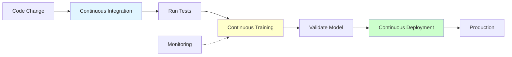
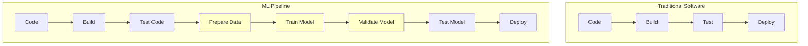

# CI/CD for ML

**Automate ML pipelines from training to deployment.** Learn continuous integration, continuous deployment, and continuous training for machine learning systems.

**Prerequisites:** Git, Docker, ML pipelines, testing basics

---

## 🎯 Overview

CI/CD for ML extends traditional software CI/CD to handle model training, validation, and deployment. It automates the entire ML lifecycle, ensuring consistent, reliable, and reproducible deployments.



---

## 🏗️ ML Pipeline Components

### Traditional Software CI/CD vs ML CI/CD



**Key Differences:**

| Aspect | Traditional CI/CD | ML CI/CD |
|--------|------------------|----------|
| **Artifacts** | Code, binaries | Code, data, models |
| **Testing** | Unit, integration | Unit, data, model tests |
| **Deployment** | Application | Model + application |
| **Triggers** | Code changes | Code, data, or performance changes |
| **Complexity** | Medium | High (data + code + models) |

---

## 🧪 Testing in ML Pipelines

### 1. Code Tests (Unit & Integration)

```python
import pytest
import numpy as np
from sklearn.ensemble import RandomForestClassifier

# Unit tests for data processing
def test_data_preprocessing():
    """Test data preprocessing function."""
    from src.preprocessing import preprocess_data

    # Sample input
    raw_data = {
        'feature1': [1, 2, 3],
        'feature2': ['A', 'B', 'C'],
        'target': [0, 1, 0]
    }

    # Expected output shape
    X, y = preprocess_data(raw_data)

    assert X.shape[0] == 3
    assert X.shape[1] == 5  # After encoding
    assert len(y) == 3
    assert y.dtype == np.int64

def test_feature_engineering():
    """Test feature engineering."""
    from src.features import create_features

    raw_features = np.array([[1, 2], [3, 4]])
    engineered = create_features(raw_features)

    # Check new features created
    assert engineered.shape[1] > raw_features.shape[1]
    assert not np.any(np.isnan(engineered))

# Integration tests
def test_training_pipeline():
    """Test complete training pipeline."""
    from src.train import train_model
    from sklearn.datasets import make_classification

    # Create dummy data
    X, y = make_classification(n_samples=100, n_features=10, random_state=42)

    # Train model
    model, metrics = train_model(X, y)

    # Verify model trained
    assert hasattr(model, 'predict')
    assert 'accuracy' in metrics
    assert metrics['accuracy'] > 0.5  # Better than random

def test_model_serialization():
    """Test model can be saved and loaded."""
    import joblib
    import tempfile

    model = RandomForestClassifier(n_estimators=10)
    X, y = make_classification(n_samples=100, n_features=5, random_state=42)
    model.fit(X, y)

    # Save
    with tempfile.NamedTemporaryFile(delete=False, suffix='.pkl') as f:
        joblib.dump(model, f.name)

        # Load
        loaded_model = joblib.load(f.name)

    # Verify predictions match
    assert np.array_equal(
        model.predict(X),
        loaded_model.predict(X)
    )
```

### 2. Data Tests

```python
import pandas as pd
import numpy as np

def test_data_schema():
    """Validate data schema."""
    from src.data import load_data

    df = load_data('data/train.csv')

    # Check required columns exist
    required_columns = ['feature1', 'feature2', 'target']
    assert all(col in df.columns for col in required_columns)

    # Check data types
    assert df['feature1'].dtype == np.float64
    assert df['target'].dtype == np.int64

def test_data_quality():
    """Test data quality checks."""
    from src.data import load_data

    df = load_data('data/train.csv')

    # No missing values in target
    assert df['target'].notna().all()

    # Reasonable value ranges
    assert df['feature1'].between(0, 100).all()

    # No duplicates
    assert not df.duplicated().any()

def test_data_distribution():
    """Test data distribution hasn't changed significantly."""
    from src.data import load_data
    from scipy.stats import ks_2samp

    # Load reference and current data
    reference_df = load_data('data/reference.csv')
    current_df = load_data('data/train.csv')

    # Test each feature
    for column in reference_df.select_dtypes(include=[np.number]).columns:
        stat, p_value = ks_2samp(
            reference_df[column],
            current_df[column]
        )

        # Alert if significant drift (p < 0.05)
        assert p_value > 0.05, f"Data drift detected in {column}"

# Great Expectations integration
from great_expectations.dataset import PandasDataset

def test_data_with_great_expectations():
    """Use Great Expectations for comprehensive data validation."""
    from src.data import load_data

    df = load_data('data/train.csv')
    ge_df = PandasDataset(df)

    # Expectations
    ge_df.expect_column_values_to_be_between('age', 0, 120)
    ge_df.expect_column_values_to_be_in_set('category', ['A', 'B', 'C'])
    ge_df.expect_column_mean_to_be_between('score', 0, 100)

    # Validate
    results = ge_df.validate()
    assert results['success'], f"Data validation failed: {results}"
```

### 3. Model Tests

```python
import numpy as np
from sklearn.metrics import accuracy_score

def test_model_accuracy_threshold():
    """Ensure model meets minimum accuracy."""
    from src.train import train_model
    from src.data import load_data

    X_train, y_train = load_data('data/train.csv')
    X_test, y_test = load_data('data/test.csv')

    model, _ = train_model(X_train, y_train)
    predictions = model.predict(X_test)

    accuracy = accuracy_score(y_test, predictions)

    # Model must meet minimum threshold
    assert accuracy >= 0.85, f"Model accuracy {accuracy:.3f} below threshold"

def test_model_inference_time():
    """Test model inference speed."""
    import time
    from src.model import load_model

    model = load_model('models/model.pkl')
    X_sample = np.random.randn(100, 10)

    # Measure inference time
    start = time.time()
    predictions = model.predict(X_sample)
    inference_time = (time.time() - start) / len(X_sample)

    # Must be under 10ms per prediction
    assert inference_time < 0.01, f"Inference too slow: {inference_time:.4f}s"

def test_model_fairness():
    """Test model fairness across subgroups."""
    from src.train import train_model
    from src.data import load_data

    X_test, y_test, sensitive_attr = load_data('data/test.csv', return_sensitive=True)
    model = load_model('models/model.pkl')

    # Predictions
    predictions = model.predict(X_test)

    # Calculate accuracy for each subgroup
    for group in sensitive_attr.unique():
        mask = sensitive_attr == group
        group_accuracy = accuracy_score(y_test[mask], predictions[mask])

        # Ensure fairness (no group < 80% accuracy)
        assert group_accuracy >= 0.80, f"Unfair for group {group}: {group_accuracy:.3f}"

def test_model_robustness():
    """Test model handles edge cases."""
    from src.model import load_model

    model = load_model('models/model.pkl')

    # Test with zeros
    zeros = np.zeros((1, 10))
    pred_zeros = model.predict(zeros)
    assert pred_zeros is not None

    # Test with extreme values
    extreme = np.full((1, 10), 1000)
    pred_extreme = model.predict(extreme)
    assert pred_extreme is not None

    # Test with missing indicators (if applicable)
    with_nan = np.full((1, 10), -999)  # Missing value indicator
    pred_nan = model.predict(with_nan)
    assert pred_nan is not None
```

---

## 🔄 Continuous Training (CT)

### Automated Retraining Pipeline

```python
import os
import mlflow
from datetime import datetime

class ContinuousTrainingPipeline:
    """
    Automated model retraining pipeline.
    """

    def __init__(self, config):
        self.config = config
        mlflow.set_experiment("continuous_training")

    def should_retrain(self):
        """
        Decide if retraining is needed.

        Triggers:
        - Scheduled (weekly/monthly)
        - Data drift detected
        - Performance degradation
        - New data available
        """
        # Check schedule
        last_training = self.get_last_training_date()
        days_since = (datetime.now() - last_training).days

        if days_since >= self.config.retrain_interval_days:
            return True, "Scheduled retraining"

        # Check drift
        drift_detected = self.check_data_drift()
        if drift_detected:
            return True, "Data drift detected"

        # Check performance
        current_accuracy = self.get_production_accuracy()
        if current_accuracy < self.config.min_accuracy:
            return True, f"Performance drop: {current_accuracy:.3f}"

        return False, None

    def run_training(self):
        """Execute training pipeline."""
        with mlflow.start_run(run_name=f"training_{datetime.now():%Y%m%d}"):

            # 1. Data validation
            print("Step 1/5: Validating data...")
            self.validate_data()

            # 2. Feature engineering
            print("Step 2/5: Engineering features...")
            X_train, y_train, X_val, y_val = self.prepare_data()

            # 3. Model training
            print("Step 3/5: Training model...")
            model = self.train_model(X_train, y_train)

            # 4. Model validation
            print("Step 4/5: Validating model...")
            metrics = self.validate_model(model, X_val, y_val)

            # 5. Model registration
            if metrics['accuracy'] >= self.config.min_accuracy:
                print("Step 5/5: Registering model...")
                self.register_model(model, metrics)
                return True, metrics
            else:
                print(f"Model below threshold: {metrics['accuracy']:.3f}")
                return False, metrics

    def validate_data(self):
        """Run data validation tests."""
        # Import test module
        import pytest
        result = pytest.main([
            'tests/test_data.py',
            '-v'
        ])

        if result != 0:
            raise ValueError("Data validation failed")

    def prepare_data(self):
        """Load and prepare training data."""
        from src.data import load_data
        from sklearn.model_selection import train_test_split

        # Load data
        df = load_data(self.config.data_path)

        # Split features and target
        X = df.drop('target', axis=1)
        y = df['target']

        # Train/val split
        X_train, X_val, y_train, y_val = train_test_split(
            X, y, test_size=0.2, random_state=42, stratify=y
        )

        # Log data info
        mlflow.log_params({
            'n_train': len(X_train),
            'n_val': len(X_val),
            'n_features': X_train.shape[1]
        })

        return X_train, y_train, X_val, y_val

    def train_model(self, X_train, y_train):
        """Train model with hyperparameter tuning."""
        from sklearn.ensemble import RandomForestClassifier
        from sklearn.model_selection import GridSearchCV

        # Hyperparameter grid
        param_grid = {
            'n_estimators': [100, 200],
            'max_depth': [10, 20, None],
            'min_samples_split': [2, 5]
        }

        # Grid search
        grid_search = GridSearchCV(
            RandomForestClassifier(random_state=42),
            param_grid,
            cv=5,
            scoring='accuracy',
            n_jobs=-1
        )

        grid_search.fit(X_train, y_train)

        # Log best params
        mlflow.log_params(grid_search.best_params_)

        return grid_search.best_estimator_

    def validate_model(self, model, X_val, y_val):
        """Validate model performance."""
        from sklearn.metrics import (
            accuracy_score, precision_score,
            recall_score, f1_score
        )

        predictions = model.predict(X_val)

        metrics = {
            'accuracy': accuracy_score(y_val, predictions),
            'precision': precision_score(y_val, predictions),
            'recall': recall_score(y_val, predictions),
            'f1': f1_score(y_val, predictions)
        }

        # Log metrics
        mlflow.log_metrics(metrics)

        return metrics

    def register_model(self, model, metrics):
        """Register model in model registry."""
        import joblib

        # Save model
        model_path = f"models/model_{datetime.now():%Y%m%d}.pkl"
        joblib.dump(model, model_path)

        # Log to MLflow
        mlflow.sklearn.log_model(
            model,
            "model",
            registered_model_name="fraud_detection"
        )

        print(f"Model registered with accuracy: {metrics['accuracy']:.3f}")

# Usage
config = {
    'retrain_interval_days': 7,
    'min_accuracy': 0.85,
    'data_path': 'data/latest.csv'
}

pipeline = ContinuousTrainingPipeline(config)

# Check if retraining needed
should_retrain, reason = pipeline.should_retrain()

if should_retrain:
    print(f"Retraining triggered: {reason}")
    success, metrics = pipeline.run_training()

    if success:
        print(f"Retraining successful: {metrics}")
    else:
        print("Retraining failed - model below threshold")
```

---

## 🚀 GitHub Actions CI/CD

### Complete ML Pipeline

**.github/workflows/ml-pipeline.yml:**

```yaml
name: ML Pipeline

on:
  push:
    branches: [main, develop]
  pull_request:
    branches: [main]
  schedule:
    # Run weekly retraining
    - cron: '0 0 * * 0'  # Every Sunday at midnight

env:
  PYTHON_VERSION: '3.9'
  MODEL_NAME: fraud_detection

jobs:
  # Job 1: Code Quality & Unit Tests
  test:
    runs-on: ubuntu-latest

    steps:
      - name: Checkout code
        uses: actions/checkout@v3

      - name: Set up Python
        uses: actions/setup-python@v4
        with:
          python-version: ${{ env.PYTHON_VERSION }}

      - name: Cache dependencies
        uses: actions/cache@v3
        with:
          path: ~/.cache/pip
          key: ${{ runner.os }}-pip-${{ hashFiles('**/requirements.txt') }}

      - name: Install dependencies
        run: |
          pip install -r requirements.txt
          pip install pytest pytest-cov flake8

      - name: Lint code
        run: |
          flake8 src/ --max-line-length=100

      - name: Run unit tests
        run: |
          pytest tests/ -v --cov=src --cov-report=xml

      - name: Upload coverage
        uses: codecov/codecov-action@v3
        with:
          file: ./coverage.xml

  # Job 2: Data Validation
  validate_data:
    runs-on: ubuntu-latest
    needs: test

    steps:
      - name: Checkout code
        uses: actions/checkout@v3

      - name: Set up Python
        uses: actions/setup-python@v4
        with:
          python-version: ${{ env.PYTHON_VERSION }}

      - name: Install dependencies
        run: |
          pip install -r requirements.txt
          pip install great-expectations

      - name: Download latest data
        run: |
          # Download from S3, GCS, etc.
          aws s3 cp s3://my-bucket/data/latest.csv data/

      - name: Validate data
        run: |
          python scripts/validate_data.py

      - name: Generate data report
        run: |
          python scripts/data_report.py

      - name: Upload data report
        uses: actions/upload-artifact@v3
        with:
          name: data-report
          path: reports/data_report.html

  # Job 3: Model Training
  train:
    runs-on: ubuntu-latest
    needs: validate_data

    steps:
      - name: Checkout code
        uses: actions/checkout@v3

      - name: Set up Python
        uses: actions/setup-python@v4
        with:
          python-version: ${{ env.PYTHON_VERSION }}

      - name: Install dependencies
        run: |
          pip install -r requirements.txt

      - name: Download data
        run: |
          aws s3 cp s3://my-bucket/data/latest.csv data/

      - name: Train model
        env:
          MLFLOW_TRACKING_URI: ${{ secrets.MLFLOW_TRACKING_URI }}
        run: |
          python src/train.py \
            --data-path data/latest.csv \
            --output-dir models/

      - name: Upload model artifact
        uses: actions/upload-artifact@v3
        with:
          name: model
          path: models/

  # Job 4: Model Evaluation
  evaluate:
    runs-on: ubuntu-latest
    needs: train

    steps:
      - name: Checkout code
        uses: actions/checkout@v3

      - name: Set up Python
        uses: actions/setup-python@v4
        with:
          python-version: ${{ env.PYTHON_VERSION }}

      - name: Install dependencies
        run: |
          pip install -r requirements.txt
          pip install pytest

      - name: Download model
        uses: actions/download-artifact@v3
        with:
          name: model
          path: models/

      - name: Download test data
        run: |
          aws s3 cp s3://my-bucket/data/test.csv data/

      - name: Run model tests
        run: |
          pytest tests/test_model.py -v

      - name: Evaluate model
        run: |
          python scripts/evaluate_model.py \
            --model-path models/model.pkl \
            --test-data data/test.csv

      - name: Check performance threshold
        run: |
          python scripts/check_threshold.py \
            --metrics-file reports/metrics.json \
            --threshold 0.85

  # Job 5: Build Docker Image
  build:
    runs-on: ubuntu-latest
    needs: evaluate

    steps:
      - name: Checkout code
        uses: actions/checkout@v3

      - name: Download model
        uses: actions/download-artifact@v3
        with:
          name: model
          path: models/

      - name: Set up Docker Buildx
        uses: docker/setup-buildx-action@v2

      - name: Login to Docker Hub
        uses: docker/login-action@v2
        with:
          username: ${{ secrets.DOCKER_USERNAME }}
          password: ${{ secrets.DOCKER_PASSWORD }}

      - name: Build and push
        uses: docker/build-push-action@v4
        with:
          context: .
          push: true
          tags: |
            myorg/${{ env.MODEL_NAME }}:latest
            myorg/${{ env.MODEL_NAME }}:${{ github.sha }}
          cache-from: type=registry,ref=myorg/${{ env.MODEL_NAME }}:buildcache
          cache-to: type=registry,ref=myorg/${{ env.MODEL_NAME }}:buildcache,mode=max

  # Job 6: Deploy to Staging
  deploy_staging:
    runs-on: ubuntu-latest
    needs: build
    if: github.ref == 'refs/heads/develop'

    steps:
      - name: Deploy to staging
        run: |
          # Deploy to Kubernetes staging
          kubectl set image deployment/${{ env.MODEL_NAME }} \
            app=myorg/${{ env.MODEL_NAME }}:${{ github.sha }} \
            --namespace=staging

      - name: Wait for rollout
        run: |
          kubectl rollout status deployment/${{ env.MODEL_NAME }} \
            --namespace=staging \
            --timeout=5m

      - name: Run integration tests
        run: |
          python tests/integration_test.py \
            --endpoint https://staging-api.example.com

  # Job 7: Deploy to Production
  deploy_production:
    runs-on: ubuntu-latest
    needs: deploy_staging
    if: github.ref == 'refs/heads/main'
    environment:
      name: production
      url: https://api.example.com

    steps:
      - name: Deploy to production
        run: |
          # Blue-green deployment
          kubectl set image deployment/${{ env.MODEL_NAME }}-blue \
            app=myorg/${{ env.MODEL_NAME }}:${{ github.sha }} \
            --namespace=production

      - name: Wait for rollout
        run: |
          kubectl rollout status deployment/${{ env.MODEL_NAME }}-blue \
            --namespace=production \
            --timeout=5m

      - name: Run smoke tests
        run: |
          python tests/smoke_test.py \
            --endpoint https://api.example.com

      - name: Switch traffic
        run: |
          # Switch traffic to new version
          kubectl patch service ${{ env.MODEL_NAME }} \
            -p '{"spec":{"selector":{"version":"blue"}}}' \
            --namespace=production

      - name: Monitor deployment
        run: |
          python scripts/monitor_deployment.py \
            --duration 300  # Monitor for 5 minutes

  # Job 8: Notify
  notify:
    runs-on: ubuntu-latest
    needs: [deploy_production]
    if: always()

    steps:
      - name: Send Slack notification
        uses: 8398a7/action-slack@v3
        with:
          status: ${{ job.status }}
          text: |
            ML Pipeline: ${{ job.status }}
            Commit: ${{ github.sha }}
            Model: ${{ env.MODEL_NAME }}
          webhook_url: ${{ secrets.SLACK_WEBHOOK }}
```

---

## 🔧 Versioning

### 1. Code Versioning (Git)

```bash
# Git workflow for ML projects
git checkout -b feature/improve-accuracy

# Make changes
git add src/model.py
git commit -m "feat: add gradient boosting model"

# Tag releases
git tag -a v1.2.0 -m "Release v1.2.0: Improved accuracy to 0.92"
git push origin v1.2.0
```

### 2. Data Versioning (DVC)

```bash
# Initialize DVC
dvc init

# Track data
dvc add data/train.csv
git add data/train.csv.dvc .gitignore
git commit -m "Add training data v1"

# Configure remote storage
dvc remote add -d storage s3://my-bucket/dvc-storage

# Push data
dvc push

# Pull specific version
git checkout v1.0.0
dvc pull
```

### 3. Model Versioning (MLflow)

```python
import mlflow

# Register model
mlflow.register_model(
    model_uri="runs:/abc123/model",
    name="fraud_detection"
)

# Transition to production
client = mlflow.tracking.MlflowClient()
client.transition_model_version_stage(
    name="fraud_detection",
    version=3,
    stage="Production"
)

# Load specific version
model = mlflow.pyfunc.load_model(
    model_uri="models:/fraud_detection/3"
)
```

---

## 📚 Summary

**Key Takeaways:**

1. **Test Everything**: Code, data, models
2. **Automate Training**: Continuous training on schedule/triggers
3. **Version All Artifacts**: Code, data, models
4. **Gradual Rollout**: Staging → Production
5. **Monitor Deployments**: Track metrics post-deployment
6. **Enable Rollback**: Keep previous versions available

**CI/CD Checklist:**
- ✅ Unit tests for code
- ✅ Data validation tests
- ✅ Model performance tests
- ✅ Automated training pipeline
- ✅ Model versioning
- ✅ Automated deployment
- ✅ Integration tests
- ✅ Monitoring and alerts

**Next Steps:**
- [Best Practices](best-practices.md) - Production ML best practices
- [Monitoring](monitoring.md) - Monitor deployed models
- [Model Deployment](model-deployment.md) - Deployment strategies

---

**Pro Tip:** Start with simple CI/CD and gradually add complexity. Don't try to implement everything at once!
