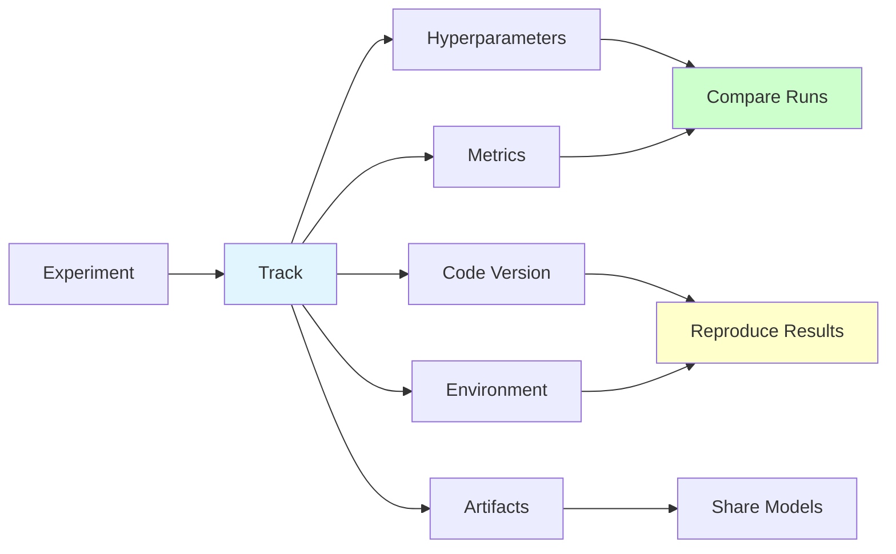
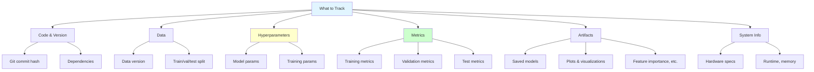

# Experiment Tracking

**Track, compare, and reproduce ML experiments systematically.** Learn to use MLflow, Weights & Biases, and TensorBoard for effective experiment management.

**Prerequisites:** Python, ML fundamentals, basic Git

---

## 🎯 Overview

Experiment tracking is the systematic recording of all aspects of ML experiments: hyperparameters, metrics, code versions, and artifacts. It's essential for reproducibility, collaboration, and understanding what works.



---

## 🤔 Why Tracking Matters

### Without Tracking
```python
# experiment_1.py - Lost forever!
model = RandomForest(n_estimators=100, max_depth=10)
model.fit(X_train, y_train)
# Accuracy: 0.87 (where did this come from?)
```

**Problems:**
- Can't reproduce results
- Don't remember which hyperparameters were used
- Hard to compare experiments
- Lost insights and learnings

### With Tracking
```python
import mlflow

with mlflow.start_run():
    # Track hyperparameters
    mlflow.log_params({
        "n_estimators": 100,
        "max_depth": 10,
        "random_state": 42
    })

    model = RandomForest(n_estimators=100, max_depth=10)
    model.fit(X_train, y_train)

    # Track metrics
    accuracy = model.score(X_test, y_test)
    mlflow.log_metric("accuracy", accuracy)

    # Track model
    mlflow.sklearn.log_model(model, "model")
```

**Benefits:**
- Full reproducibility
- Easy comparison across experiments
- Version control for models
- Team collaboration

---

## 📊 What to Track



### 1. Code & Version

**What:**
- Git commit hash
- Dependency versions
- Python version

**Why:** Ensures code reproducibility

**How:**
```python
import mlflow
import git

# Get git info
repo = git.Repo(search_parent_directories=True)
commit_hash = repo.head.object.hexsha

mlflow.log_param("git_commit", commit_hash)
mlflow.log_param("python_version", sys.version)
```

### 2. Data Information

**What:**
- Dataset version/hash
- Train/validation/test split ratios
- Data preprocessing steps
- Class distribution

**Why:** Data changes affect model performance

**How:**
```python
import hashlib

# Hash dataset for versioning
def hash_dataframe(df):
    return hashlib.md5(pd.util.hash_pandas_object(df).values).hexdigest()

mlflow.log_param("data_hash", hash_dataframe(df))
mlflow.log_param("train_size", len(X_train))
mlflow.log_param("test_size", len(X_test))
mlflow.log_param("n_features", X_train.shape[1])
```

### 3. Hyperparameters

**What:**
- Model hyperparameters
- Training hyperparameters (learning rate, batch size)
- Feature engineering parameters
- Preprocessing parameters

**Why:** Core of experiment comparison

**How:**
```python
params = {
    "model_type": "RandomForest",
    "n_estimators": 100,
    "max_depth": 10,
    "min_samples_split": 5,
    "learning_rate": 0.01,  # if applicable
    "batch_size": 32,
}

mlflow.log_params(params)
```

### 4. Metrics

**What:**
- Training metrics (loss, accuracy)
- Validation metrics
- Test metrics
- Custom business metrics

**Why:** Evaluate model performance

**How:**
```python
# Log metrics over epochs
for epoch in range(n_epochs):
    train_loss = train_epoch(model, train_loader)
    val_loss = validate(model, val_loader)

    mlflow.log_metrics({
        "train_loss": train_loss,
        "val_loss": val_loss
    }, step=epoch)

# Log final test metrics
mlflow.log_metrics({
    "test_accuracy": test_accuracy,
    "test_precision": test_precision,
    "test_recall": test_recall,
    "test_f1": test_f1
})
```

### 5. Artifacts

**What:**
- Trained model files
- Plots and visualizations
- Feature importance
- Confusion matrices
- Model architecture diagrams

**Why:** Visual analysis and model deployment

**How:**
```python
import matplotlib.pyplot as plt
from sklearn.metrics import ConfusionMatrixDisplay

# Log model
mlflow.sklearn.log_model(model, "model")

# Log confusion matrix
fig, ax = plt.subplots(figsize=(8, 6))
ConfusionMatrixDisplay.from_estimator(model, X_test, y_test, ax=ax)
mlflow.log_figure(fig, "confusion_matrix.png")

# Log feature importance
feature_importance = pd.DataFrame({
    'feature': feature_names,
    'importance': model.feature_importances_
}).sort_values('importance', ascending=False)

feature_importance.to_csv('feature_importance.csv', index=False)
mlflow.log_artifact('feature_importance.csv')
```

### 6. System Information

**What:**
- Hardware specifications
- Training time
- Memory usage
- GPU utilization

**Why:** Performance analysis and resource planning

**How:**
```python
import time
import psutil

start_time = time.time()

# Training code here...

end_time = time.time()
training_time = end_time - start_time

mlflow.log_metrics({
    "training_time_seconds": training_time,
    "memory_usage_mb": psutil.Process().memory_info().rss / 1024 ** 2,
    "cpu_percent": psutil.cpu_percent()
})
```

---

## 🛠️ Tools Comparison

### Tool Matrix

| Feature | MLflow | Weights & Biases | TensorBoard | Neptune.ai |
|---------|--------|------------------|-------------|------------|
| **Cost** | Free | Free (limited) | Free | Paid |
| **Hosting** | Self-hosted | Cloud | Self-hosted | Cloud |
| **UI Quality** | Basic | Excellent | Good | Excellent |
| **Collaboration** | Limited | Excellent | Limited | Excellent |
| **Model Registry** | Yes | Yes | No | Yes |
| **Integration** | Good | Excellent | PyTorch/TF | Excellent |
| **Learning Curve** | Medium | Easy | Easy | Easy |
| **Best For** | Open-source, flexibility | Teams, great UX | Quick viz | Enterprise |

### Quick Decision Guide

**Choose MLflow if:**
- You want full control and self-hosting
- You need integrated model registry
- You're building an MLOps platform
- Budget is tight

**Choose Weights & Biases if:**
- You need best-in-class UI/UX
- Team collaboration is priority
- You want real-time tracking
- You can afford the cost

**Choose TensorBoard if:**
- You're using TensorFlow/PyTorch
- You need quick visualization
- You want minimal setup
- You don't need advanced features

**Choose Neptune.ai if:**
- You're an enterprise team
- You need advanced features
- Compliance/security is critical
- Budget is not a constraint

---

## 🚀 Implementation: MLflow

### 1. Installation and Setup

```bash
# Install MLflow
pip install mlflow

# Start MLflow UI
mlflow ui --port 5000

# Access at http://localhost:5000
```

### 2. Basic Tracking

```python
import mlflow
import mlflow.sklearn
from sklearn.ensemble import RandomForestClassifier
from sklearn.metrics import accuracy_score, precision_score, recall_score

# Set experiment name
mlflow.set_experiment("credit-card-fraud-detection")

# Start a run
with mlflow.start_run(run_name="rf_baseline"):

    # Log parameters
    params = {
        "n_estimators": 100,
        "max_depth": 10,
        "min_samples_split": 5,
        "random_state": 42
    }
    mlflow.log_params(params)

    # Train model
    model = RandomForestClassifier(**params)
    model.fit(X_train, y_train)

    # Make predictions
    y_pred = model.predict(X_test)

    # Calculate and log metrics
    metrics = {
        "accuracy": accuracy_score(y_test, y_pred),
        "precision": precision_score(y_test, y_pred),
        "recall": recall_score(y_test, y_pred)
    }
    mlflow.log_metrics(metrics)

    # Log model
    mlflow.sklearn.log_model(
        model,
        "model",
        registered_model_name="fraud_detection_rf"
    )

    print(f"Logged run with metrics: {metrics}")
```

### 3. Advanced Tracking with Custom Metrics

```python
import mlflow
import numpy as np
from sklearn.metrics import roc_curve, auc
import matplotlib.pyplot as plt

def track_classification_experiment(model, X_train, y_train, X_test, y_test,
                                     params, run_name):
    """
    Comprehensive experiment tracking for classification.
    """
    with mlflow.start_run(run_name=run_name):

        # 1. Log parameters
        mlflow.log_params(params)

        # 2. Train model and track time
        import time
        start_time = time.time()
        model.fit(X_train, y_train)
        training_time = time.time() - start_time

        mlflow.log_metric("training_time_seconds", training_time)

        # 3. Predictions
        y_pred = model.predict(X_test)
        y_pred_proba = model.predict_proba(X_test)[:, 1]

        # 4. Log comprehensive metrics
        from sklearn.metrics import (
            accuracy_score, precision_score, recall_score,
            f1_score, roc_auc_score, confusion_matrix
        )

        metrics = {
            "accuracy": accuracy_score(y_test, y_pred),
            "precision": precision_score(y_test, y_pred),
            "recall": recall_score(y_test, y_pred),
            "f1_score": f1_score(y_test, y_pred),
            "roc_auc": roc_auc_score(y_test, y_pred_proba)
        }
        mlflow.log_metrics(metrics)

        # 5. Log confusion matrix as image
        fig, ax = plt.subplots(figsize=(8, 6))
        cm = confusion_matrix(y_test, y_pred)
        import seaborn as sns
        sns.heatmap(cm, annot=True, fmt='d', ax=ax, cmap='Blues')
        ax.set_xlabel('Predicted')
        ax.set_ylabel('Actual')
        ax.set_title('Confusion Matrix')
        mlflow.log_figure(fig, "confusion_matrix.png")
        plt.close()

        # 6. Log ROC curve
        fig, ax = plt.subplots(figsize=(8, 6))
        fpr, tpr, _ = roc_curve(y_test, y_pred_proba)
        roc_auc = auc(fpr, tpr)
        ax.plot(fpr, tpr, label=f'ROC curve (AUC = {roc_auc:.2f})')
        ax.plot([0, 1], [0, 1], 'k--', label='Random')
        ax.set_xlabel('False Positive Rate')
        ax.set_ylabel('True Positive Rate')
        ax.set_title('ROC Curve')
        ax.legend()
        mlflow.log_figure(fig, "roc_curve.png")
        plt.close()

        # 7. Log feature importance (if available)
        if hasattr(model, 'feature_importances_'):
            feature_names = [f"feature_{i}" for i in range(X_train.shape[1])]
            importance_df = pd.DataFrame({
                'feature': feature_names,
                'importance': model.feature_importances_
            }).sort_values('importance', ascending=False)

            # Plot feature importance
            fig, ax = plt.subplots(figsize=(10, 8))
            importance_df.head(20).plot(x='feature', y='importance',
                                         kind='barh', ax=ax)
            ax.set_xlabel('Importance')
            ax.set_title('Top 20 Feature Importances')
            mlflow.log_figure(fig, "feature_importance.png")
            plt.close()

            # Save as CSV
            importance_df.to_csv('feature_importance.csv', index=False)
            mlflow.log_artifact('feature_importance.csv')

        # 8. Log model
        mlflow.sklearn.log_model(model, "model")

        # 9. Log data statistics
        mlflow.log_params({
            "n_train_samples": len(X_train),
            "n_test_samples": len(X_test),
            "n_features": X_train.shape[1],
            "class_balance": f"{sum(y_train)}/{len(y_train)}"
        })

        return mlflow.active_run().info.run_id

# Usage
run_id = track_classification_experiment(
    model=RandomForestClassifier(n_estimators=100, max_depth=10),
    X_train=X_train,
    y_train=y_train,
    X_test=X_test,
    y_test=y_test,
    params={"n_estimators": 100, "max_depth": 10},
    run_name="rf_v1"
)
print(f"Run ID: {run_id}")
```

### 4. Hyperparameter Tuning with Tracking

```python
from sklearn.model_selection import GridSearchCV
import mlflow

# Set experiment
mlflow.set_experiment("hyperparameter-tuning")

# Define parameter grid
param_grid = {
    'n_estimators': [50, 100, 200],
    'max_depth': [5, 10, 15, None],
    'min_samples_split': [2, 5, 10]
}

# Parent run for the tuning experiment
with mlflow.start_run(run_name="rf_grid_search"):

    # Log the parameter grid
    mlflow.log_param("param_grid", str(param_grid))

    # Perform grid search
    grid_search = GridSearchCV(
        RandomForestClassifier(random_state=42),
        param_grid,
        cv=5,
        scoring='f1',
        n_jobs=-1
    )

    grid_search.fit(X_train, y_train)

    # Log each CV result as a child run
    for i, params in enumerate(grid_search.cv_results_['params']):
        with mlflow.start_run(run_name=f"cv_fold_{i}", nested=True):
            mlflow.log_params(params)
            mlflow.log_metric("mean_cv_score",
                            grid_search.cv_results_['mean_test_score'][i])
            mlflow.log_metric("std_cv_score",
                            grid_search.cv_results_['std_test_score'][i])

    # Log best parameters and score
    mlflow.log_params(grid_search.best_params_)
    mlflow.log_metric("best_cv_score", grid_search.best_score_)

    # Evaluate on test set
    best_model = grid_search.best_estimator_
    test_score = best_model.score(X_test, y_test)
    mlflow.log_metric("test_score", test_score)

    # Log best model
    mlflow.sklearn.log_model(best_model, "best_model")

    print(f"Best parameters: {grid_search.best_params_}")
    print(f"Best CV score: {grid_search.best_score_:.4f}")
    print(f"Test score: {test_score:.4f}")
```

### 5. Comparing Runs Programmatically

```python
from mlflow.tracking import MlflowClient

client = MlflowClient()

# Get experiment
experiment = client.get_experiment_by_name("credit-card-fraud-detection")
experiment_id = experiment.experiment_id

# Search for runs
runs = client.search_runs(
    experiment_ids=[experiment_id],
    order_by=["metrics.f1_score DESC"],
    max_results=10
)

# Compare runs
print("Top 10 runs by F1 score:\n")
print(f"{'Run ID':<40} {'F1 Score':<10} {'Model':<20}")
print("-" * 70)

for run in runs:
    run_id = run.info.run_id
    f1_score = run.data.metrics.get('f1_score', 0)
    model_type = run.data.params.get('model_type', 'Unknown')
    print(f"{run_id:<40} {f1_score:<10.4f} {model_type:<20}")
```

---

## 🔄 Best Practices

### 1. Naming Conventions

```python
# Good: Descriptive experiment names
mlflow.set_experiment("fraud-detection-q1-2024")

# Good: Meaningful run names
with mlflow.start_run(run_name="rf_tuned_v3_balanced_data"):
    pass

# Bad: Generic names
mlflow.set_experiment("experiment1")  # Not descriptive
with mlflow.start_run(run_name="test"):  # Not meaningful
    pass
```

### 2. Organize Experiments Hierarchically

```python
# Use nested runs for related experiments
with mlflow.start_run(run_name="model_comparison"):

    # Train multiple models as nested runs
    models = {
        "random_forest": RandomForestClassifier(),
        "gradient_boosting": GradientBoostingClassifier(),
        "logistic_regression": LogisticRegression()
    }

    for model_name, model in models.items():
        with mlflow.start_run(run_name=model_name, nested=True):
            model.fit(X_train, y_train)
            score = model.score(X_test, y_test)
            mlflow.log_metric("accuracy", score)
            mlflow.sklearn.log_model(model, "model")
```

### 3. Track Data Versions

```python
import hashlib
import json

def get_data_signature(df):
    """Create a hash of the dataset for versioning."""
    return hashlib.sha256(
        pd.util.hash_pandas_object(df).values
    ).hexdigest()

# Log data version
data_signature = get_data_signature(df)
mlflow.log_param("data_signature", data_signature)
mlflow.log_param("data_timestamp", df.index.max())

# Save data statistics
data_stats = {
    "n_rows": len(df),
    "n_features": len(df.columns),
    "missing_values": df.isnull().sum().to_dict()
}

with open('data_stats.json', 'w') as f:
    json.dump(data_stats, f, indent=2)
mlflow.log_artifact('data_stats.json')
```

### 4. Use Tags for Organization

```python
with mlflow.start_run():
    # Set tags for filtering and searching
    mlflow.set_tags({
        "team": "data-science",
        "project": "fraud-detection",
        "environment": "production",
        "model_type": "ensemble",
        "priority": "high"
    })

    # ... rest of tracking code
```

### 5. Create Custom Metrics

```python
def log_custom_business_metrics(y_true, y_pred, y_pred_proba,
                                 false_positive_cost=10,
                                 false_negative_cost=100):
    """
    Log custom business metrics.
    """
    from sklearn.metrics import confusion_matrix

    tn, fp, fn, tp = confusion_matrix(y_true, y_pred).ravel()

    # Business metrics
    cost = (fp * false_positive_cost) + (fn * false_negative_cost)
    savings = (tn * 0) + (tp * false_negative_cost)  # Saved costs

    mlflow.log_metrics({
        "total_cost": cost,
        "savings": savings,
        "net_benefit": savings - cost,
        "false_positive_rate": fp / (fp + tn),
        "false_negative_rate": fn / (fn + tp)
    })
```

### 6. Implement Automatic Tracking

```python
import mlflow.sklearn

# Enable autologging for scikit-learn
mlflow.sklearn.autolog()

# Now all sklearn operations are automatically logged
model = RandomForestClassifier(n_estimators=100)
model.fit(X_train, y_train)
# Parameters, metrics, and model are automatically logged!
```

---

## 🔄 Reproducibility

### Complete Reproducibility Checklist

```python
import mlflow
import git
import sys
import platform
import numpy as np
import random
import torch

def ensure_reproducibility(seed=42):
    """
    Ensure complete reproducibility of experiments.
    """
    # Set random seeds
    random.seed(seed)
    np.random.seed(seed)
    torch.manual_seed(seed)
    torch.cuda.manual_seed_all(seed)

    # PyTorch specific settings
    torch.backends.cudnn.deterministic = True
    torch.backends.cudnn.benchmark = False

    with mlflow.start_run():
        # 1. Log random seed
        mlflow.log_param("random_seed", seed)

        # 2. Log code version
        repo = git.Repo(search_parent_directories=True)
        mlflow.log_param("git_commit", repo.head.object.hexsha)
        mlflow.log_param("git_branch", repo.active_branch.name)

        # 3. Log environment
        mlflow.log_param("python_version", sys.version)
        mlflow.log_param("platform", platform.platform())

        # 4. Log dependencies
        import pkg_resources
        installed_packages = [
            f"{d.project_name}=={d.version}"
            for d in pkg_resources.working_set
        ]

        with open('requirements.txt', 'w') as f:
            f.write('\n'.join(sorted(installed_packages)))
        mlflow.log_artifact('requirements.txt')

        # 5. Log hardware info
        mlflow.log_param("cpu_count", os.cpu_count())
        if torch.cuda.is_available():
            mlflow.log_param("gpu_name", torch.cuda.get_device_name(0))
            mlflow.log_param("cuda_version", torch.version.cuda)

        # Now run your experiment...
```

### Reproduce an Experiment

```python
def reproduce_run(run_id):
    """
    Reproduce a specific run.
    """
    client = MlflowClient()
    run = client.get_run(run_id)

    # Get parameters
    params = run.data.params

    # Get artifacts (including model)
    artifact_uri = run.info.artifact_uri
    model = mlflow.sklearn.load_model(f"{artifact_uri}/model")

    # Get data version
    data_signature = params.get('data_signature')

    print(f"Reproducing run {run_id}")
    print(f"Parameters: {params}")
    print(f"Data signature: {data_signature}")
    print(f"Model loaded from: {artifact_uri}")

    return model, params
```

---

## 🎯 Real-World Example: End-to-End Tracking

```python
import mlflow
import mlflow.sklearn
from sklearn.ensemble import RandomForestClassifier
from sklearn.model_selection import train_test_split
from sklearn.preprocessing import StandardScaler
import pandas as pd
import numpy as np

class MLExperiment:
    """
    Complete ML experiment with comprehensive tracking.
    """

    def __init__(self, experiment_name):
        mlflow.set_experiment(experiment_name)
        self.experiment_name = experiment_name

    def run_experiment(self, X, y, params, run_name):
        """
        Run a complete ML experiment with tracking.
        """
        with mlflow.start_run(run_name=run_name):

            # 1. Log experiment metadata
            mlflow.set_tags({
                "experiment_type": "classification",
                "dataset": "credit_card_fraud",
                "version": "1.0"
            })

            # 2. Data preprocessing
            X_train, X_test, y_train, y_test = train_test_split(
                X, y, test_size=0.2, random_state=42, stratify=y
            )

            scaler = StandardScaler()
            X_train_scaled = scaler.fit_transform(X_train)
            X_test_scaled = scaler.transform(X_test)

            # Log data info
            mlflow.log_params({
                "n_samples": len(X),
                "n_features": X.shape[1],
                "n_train": len(X_train),
                "n_test": len(X_test),
                "positive_class_ratio": sum(y) / len(y)
            })

            # 3. Model training
            mlflow.log_params(params)

            model = RandomForestClassifier(**params)

            import time
            start_time = time.time()
            model.fit(X_train_scaled, y_train)
            training_time = time.time() - start_time

            mlflow.log_metric("training_time", training_time)

            # 4. Evaluation
            from sklearn.metrics import (
                accuracy_score, precision_score, recall_score,
                f1_score, roc_auc_score, classification_report
            )

            y_pred = model.predict(X_test_scaled)
            y_pred_proba = model.predict_proba(X_test_scaled)[:, 1]

            metrics = {
                "accuracy": accuracy_score(y_test, y_pred),
                "precision": precision_score(y_test, y_pred),
                "recall": recall_score(y_test, y_pred),
                "f1_score": f1_score(y_test, y_pred),
                "roc_auc": roc_auc_score(y_test, y_pred_proba)
            }

            mlflow.log_metrics(metrics)

            # 5. Save artifacts
            # Classification report
            report = classification_report(y_test, y_pred)
            with open('classification_report.txt', 'w') as f:
                f.write(report)
            mlflow.log_artifact('classification_report.txt')

            # Feature importance
            if hasattr(model, 'feature_importances_'):
                importance_df = pd.DataFrame({
                    'feature': range(X.shape[1]),
                    'importance': model.feature_importances_
                }).sort_values('importance', ascending=False)

                importance_df.to_csv('feature_importance.csv', index=False)
                mlflow.log_artifact('feature_importance.csv')

            # 6. Log model and scaler
            mlflow.sklearn.log_model(model, "model")
            mlflow.sklearn.log_model(scaler, "scaler")

            print(f"Experiment logged: {run_name}")
            print(f"Metrics: {metrics}")

            return model, metrics

# Usage
experiment = MLExperiment("fraud-detection-production")

params = {
    "n_estimators": 100,
    "max_depth": 10,
    "min_samples_split": 5,
    "random_state": 42,
    "n_jobs": -1
}

model, metrics = experiment.run_experiment(
    X=X,
    y=y,
    params=params,
    run_name="rf_baseline_v1"
)
```

---

## 🚨 Common Pitfalls

### 1. Not Tracking Everything
```python
# Bad: Incomplete tracking
with mlflow.start_run():
    mlflow.log_param("n_estimators", 100)
    # Missing: max_depth, random_state, data version, etc.
    model.fit(X_train, y_train)

# Good: Comprehensive tracking
with mlflow.start_run():
    mlflow.log_params({
        "n_estimators": 100,
        "max_depth": 10,
        "random_state": 42,
        "data_version": "v1.2.3"
    })
    model.fit(X_train, y_train)
```

### 2. Forgetting to Close Runs
```python
# Bad: Runs left open
mlflow.start_run()
# ... code ...
# Forgot to end_run()!

# Good: Use context manager
with mlflow.start_run():
    # ... code ...
    pass  # Automatically closed
```

### 3. Not Using Nested Runs
```python
# Bad: Flat structure for related experiments
for model_type in ['rf', 'gb', 'lr']:
    with mlflow.start_run(run_name=model_type):
        pass  # Hard to see relationships

# Good: Nested structure
with mlflow.start_run(run_name="model_comparison"):
    for model_type in ['rf', 'gb', 'lr']:
        with mlflow.start_run(run_name=model_type, nested=True):
            pass  # Clear hierarchy
```

---

## 📚 Summary

**Key Takeaways:**

1. **Track Everything**: Code, data, parameters, metrics, artifacts, environment
2. **Use Consistent Naming**: Descriptive experiment and run names
3. **Organize Hierarchically**: Use nested runs for related experiments
4. **Enable Reproducibility**: Log random seeds, dependencies, data versions
5. **Compare Systematically**: Use MLflow UI or programmatic comparison
6. **Automate When Possible**: Use autologging for common frameworks

**Next Steps:**
- [Model Deployment](model-deployment.md) - Deploy tracked models to production
- [CI/CD for ML](ci-cd.md) - Automate experiment tracking in pipelines
- [Best Practices](best-practices.md) - Production ML best practices

---

**Pro Tip:** Start tracking from day one! It's much harder to add tracking later, and you'll lose valuable insights from early experiments.
