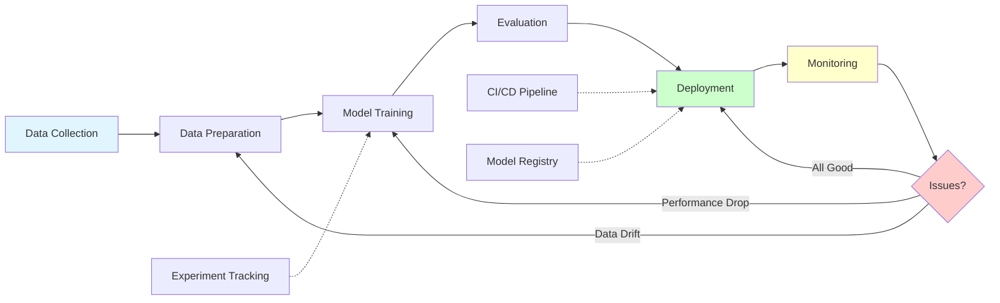
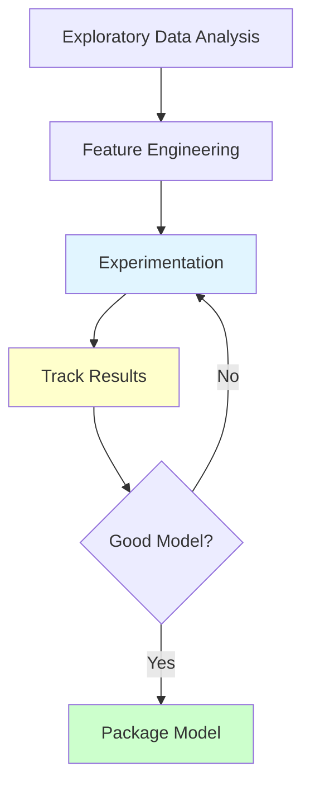
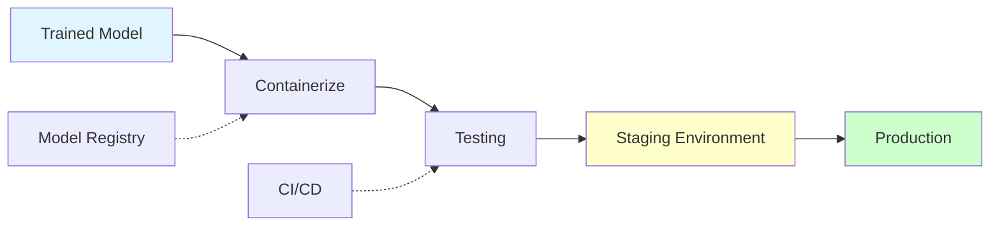
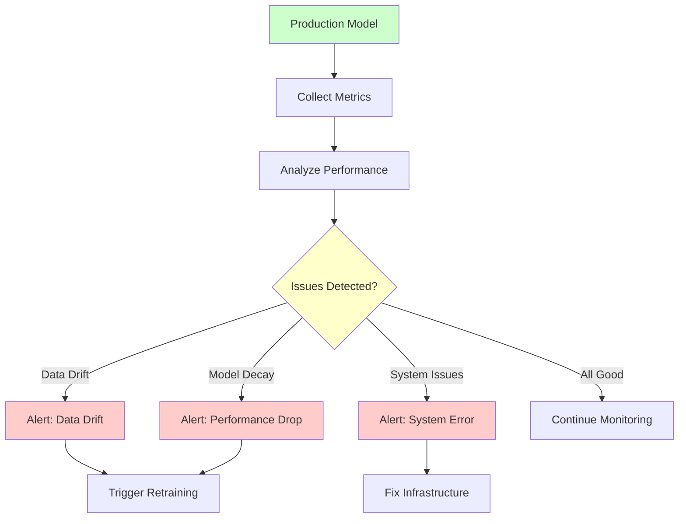
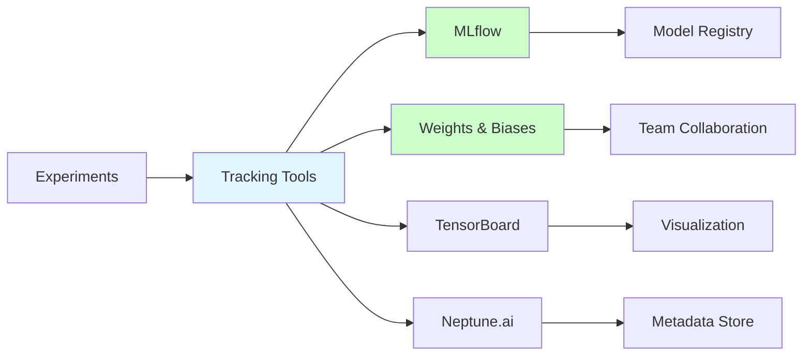
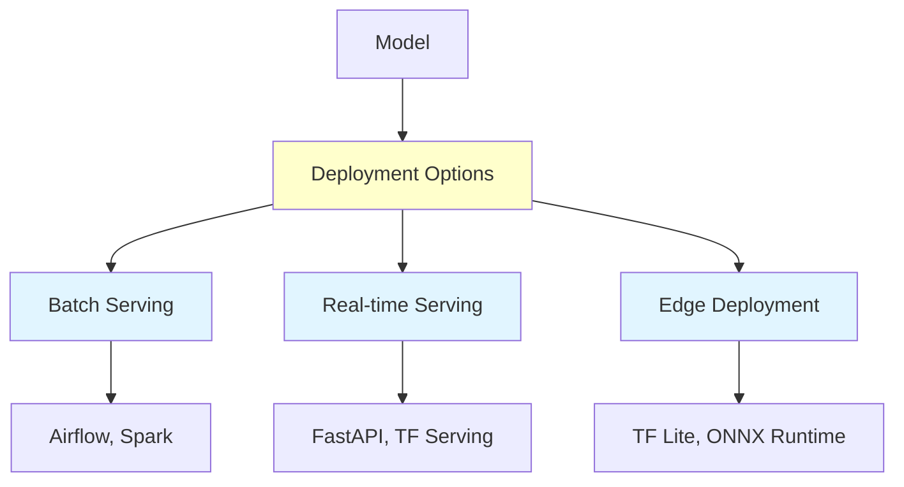
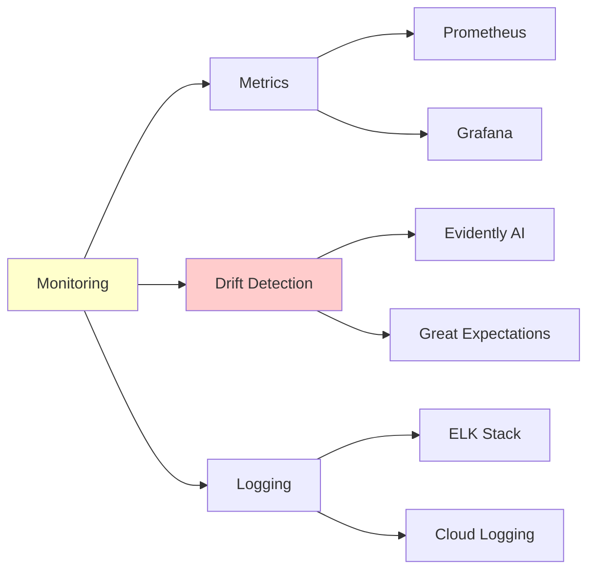
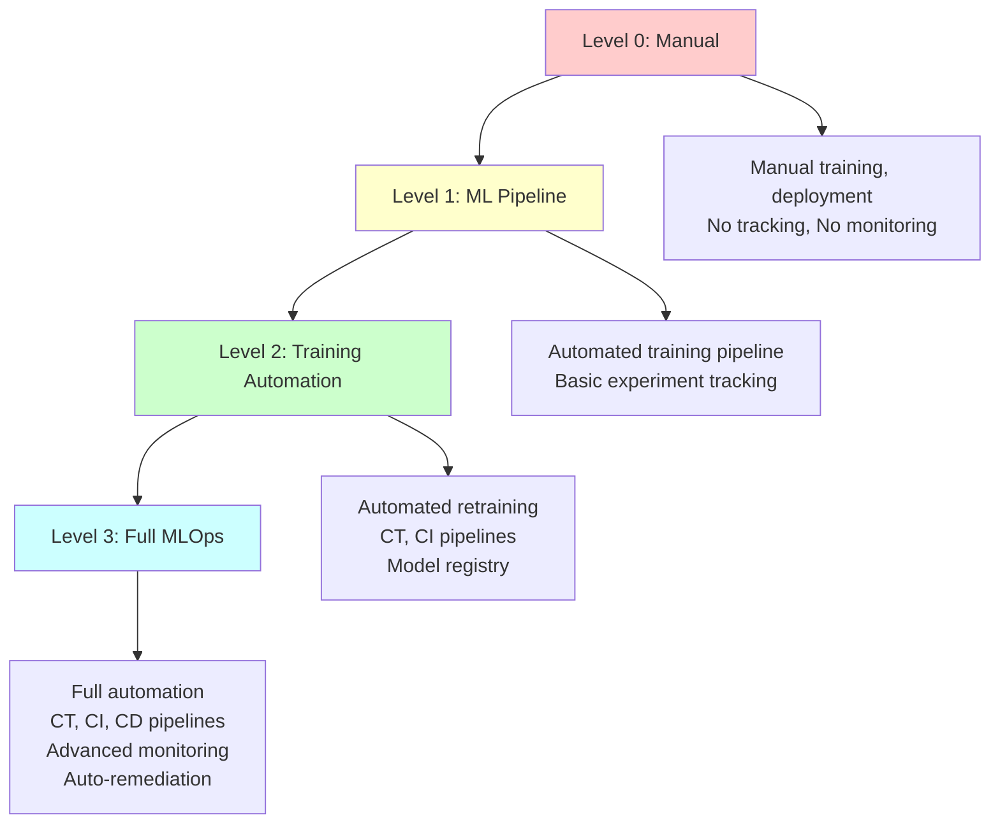

# MLOps & Production

**Deploy and maintain ML systems in production.** Master experiment tracking, deployment, monitoring, and CI/CD for machine learning.

**Difficulty:** 🔴 Advanced | **Time:** 3-4 weeks | **Prerequisites:** ML fundamentals, Docker, Git, Python

---

## 🎯 What is MLOps?

**MLOps (Machine Learning Operations)** brings DevOps practices to machine learning, enabling reliable and efficient deployment of ML models to production. It bridges the gap between model development and production deployment, ensuring ML systems are scalable, maintainable, and reliable.


```mermaid
graph LR
    Data[Data Collection] --> Prep[Data Preparation]
    Prep --> Train[Model Training]
    Train --> Eval[Evaluation]
    Eval --> Deploy[Deployment]
    Deploy --> Monitor[Monitoring]
    Monitor --> Alert{Issues?}
    Alert -->|Data Drift| Prep
    Alert -->|Performance Drop| Train
    Alert -->|All Good| Deploy

    Track[Experiment Tracking] -.-> Train
    CI[CI/CD Pipeline] -.-> Deploy
    Registry[Model Registry] -.-> Deploy

    style Data fill:#e1f5ff
    style Deploy fill:#ccffcc
    style Monitor fill:#ffffcc
    style Alert fill:#ffcccc
```

---

## 🏗️ ML Lifecycle in Production

### Development Phase

```mermaid
graph TB
    EDA[Exploratory Data Analysis] --> FE[Feature Engineering]
    FE --> Exp[Experimentation]
    Exp --> Track[Track Results]
    Track --> Eval{Good Model?}
    Eval -->|No| Exp
    Eval -->|Yes| Package[Package Model]

    style Exp fill:#e1f5ff
    style Track fill:#ffffcc
    style Package fill:#ccffcc
```

**Key Activities:**
- Data exploration and validation
- Feature engineering and selection
- Model experimentation and tuning
- Experiment tracking and versioning
- Model evaluation and validation

### Deployment Phase

```mermaid
graph LR
    Model[Trained Model] --> Container[Containerize]
    Container --> Test[Testing]
    Test --> Stage[Staging Environment]
    Stage --> Prod[Production]

    Registry[Model Registry] -.-> Container
    CI[CI/CD] -.-> Test

    style Model fill:#e1f5ff
    style Stage fill:#ffffcc
    style Prod fill:#ccffcc
```

**Key Activities:**
- Model packaging and containerization
- API development and testing
- Infrastructure provisioning
- Deployment strategy execution
- Load testing and validation

### Monitoring Phase

```mermaid
graph TB
    Prod[Production Model] --> Collect[Collect Metrics]
    Collect --> Analyze[Analyze Performance]
    Analyze --> Detect{Issues Detected?}
    Detect -->|Data Drift| Alert1[Alert: Data Drift]
    Detect -->|Model Decay| Alert2[Alert: Performance Drop]
    Detect -->|System Issues| Alert3[Alert: System Error]
    Detect -->|All Good| Continue[Continue Monitoring]

    Alert1 --> Retrain[Trigger Retraining]
    Alert2 --> Retrain
    Alert3 --> Fix[Fix Infrastructure]

    style Prod fill:#ccffcc
    style Detect fill:#ffffcc
    style Alert1 fill:#ffcccc
    style Alert2 fill:#ffcccc
    style Alert3 fill:#ffcccc
```

**Key Activities:**
- Model performance monitoring
- Data drift detection
- System health monitoring
- Alert management
- Automated retraining triggers

---

## 🚧 Key Challenges in Production ML

### 1. Model Decay
**Problem:** Model performance degrades over time due to changing data distributions.

**Solutions:**
- Continuous monitoring of model metrics
- Automated drift detection
- Scheduled retraining pipelines
- A/B testing for model updates

### 2. Reproducibility
**Problem:** Difficulty reproducing model results due to random seeds, dependency versions, data changes.

**Solutions:**
- Version control for code, data, and models
- Containerization (Docker)
- Experiment tracking tools
- Deterministic training pipelines

### 3. Scalability
**Problem:** Models that work on small datasets fail at production scale.

**Solutions:**
- Horizontal scaling with load balancers
- Model optimization (quantization, pruning)
- Batch prediction for throughput
- Caching strategies

### 4. Latency Requirements
**Problem:** Real-time predictions require low latency (<100ms).

**Solutions:**
- Model compression techniques
- Edge deployment
- Efficient serving frameworks
- Asynchronous processing

### 5. Data Quality
**Problem:** Production data differs from training data, causing prediction errors.

**Solutions:**
- Input validation and sanitization
- Feature store for consistency
- Data quality monitoring
- Graceful degradation strategies

### 6. Integration Complexity
**Problem:** Integrating ML models with existing systems and workflows.

**Solutions:**
- Standard API interfaces (REST, gRPC)
- Service mesh architecture
- Clear documentation
- SDK development

---

## 🛠️ Tools and Platforms Overview

### Experiment Tracking

```mermaid
graph LR
    Exp[Experiments] --> Track[Tracking Tools]
    Track --> MLflow[MLflow]
    Track --> WB[Weights & Biases]
    Track --> TB[TensorBoard]
    Track --> Neptune[Neptune.ai]

    MLflow --> Registry[Model Registry]
    WB --> Collab[Team Collaboration]
    TB --> Viz[Visualization]
    Neptune --> Meta[Metadata Store]

    style Track fill:#e1f5ff
    style MLflow fill:#ccffcc
    style WB fill:#ccffcc
```

**Tool Comparison:**

| Tool | Best For | Pros | Cons |
|------|----------|------|------|
| **MLflow** | Open-source, model registry | Free, integrated registry, flexible | Basic UI, self-hosted |
| **Weights & Biases** | Team collaboration | Great UI, real-time tracking | Paid for teams |
| **TensorBoard** | TensorFlow/PyTorch | Native integration, free | Limited features |
| **Neptune.ai** | Enterprise teams | Advanced features, scalable | Expensive |

### Model Deployment

```mermaid
graph TB
    Model[Model] --> Deploy[Deployment Options]

    Deploy --> Batch[Batch Serving]
    Deploy --> RT[Real-time Serving]
    Deploy --> Edge[Edge Deployment]

    Batch --> Tools1[Airflow, Spark]
    RT --> Tools2[FastAPI, TF Serving]
    Edge --> Tools3[TF Lite, ONNX Runtime]

    style Deploy fill:#ffffcc
    style Batch fill:#e1f5ff
    style RT fill:#e1f5ff
    style Edge fill:#e1f5ff
```

**Platform Comparison:**

| Platform | Use Case | Latency | Complexity | Cost |
|----------|----------|---------|------------|------|
| **FastAPI** | Custom APIs | Low | Medium | Low |
| **TF Serving** | TensorFlow models | Very Low | High | Medium |
| **Seldon Core** | Kubernetes native | Low | High | Medium |
| **SageMaker** | AWS ecosystem | Low | Low | High |
| **Vertex AI** | GCP ecosystem | Low | Low | High |

### Monitoring & Observability

```mermaid
graph LR
    Monitor[Monitoring] --> Metrics[Metrics]
    Monitor --> Drift[Drift Detection]
    Monitor --> Logging[Logging]

    Metrics --> Prom[Prometheus]
    Metrics --> Graf[Grafana]

    Drift --> Evidently[Evidently AI]
    Drift --> GE[Great Expectations]

    Logging --> ELK[ELK Stack]
    Logging --> Cloud[Cloud Logging]

    style Monitor fill:#ffffcc
    style Drift fill:#ffcccc
```

**Monitoring Stack:**
- **Prometheus + Grafana**: System metrics, latency, throughput
- **Evidently AI**: Data drift and model quality
- **Great Expectations**: Data validation
- **ELK Stack**: Centralized logging and debugging

---

## 📚 Topics Overview

### 🔬 Development Phase
- **[Experiment Tracking](experiment-tracking.md)**
  - Track hyperparameters, metrics, and artifacts
  - Tools: MLflow, Weights & Biases, TensorBoard
  - Reproducibility best practices

### 🚀 Deployment Phase
- **[Model Deployment](model-deployment.md)**
  - Deployment patterns: Batch, real-time, edge
  - REST APIs with FastAPI
  - Containerization with Docker
  - Cloud deployment (AWS, GCP, Azure)

- **[Model Serving](model-serving.md)**
  - Serving architectures and patterns
  - Latency vs throughput optimization
  - Model formats: ONNX, TensorRT
  - Caching and load balancing strategies

### 🔄 Operations Phase
- **[Monitoring & Drift Detection](monitoring.md)**
  - Model performance monitoring
  - Data drift and concept drift detection
  - Alerting strategies
  - Tools: Evidently, Great Expectations

- **[CI/CD for ML](ci-cd.md)**
  - ML pipeline automation
  - Testing: Unit, integration, model tests
  - Versioning: Data, code, models
  - Automated retraining triggers

### 📖 Best Practices
- **[Production ML Best Practices](best-practices.md)**
  - Model versioning and registry
  - Feature stores
  - A/B testing and shadow deployments
  - Rollback strategies
  - Security considerations

---

## 🎓 Learning Path

### Week 1: Development & Tracking
**Goal:** Set up experiment tracking and understand model lifecycle.

**Topics:**
- Experiment tracking fundamentals
- MLflow setup and usage
- Model versioning strategies
- Reproducibility practices

**Project:** Build an experiment tracking system for a classification model

### Week 2: Deployment Basics
**Goal:** Deploy your first ML model as a REST API.

**Topics:**
- REST API development with FastAPI
- Containerization with Docker
- Model serialization and loading
- Basic deployment patterns

**Project:** Deploy a model as a containerized REST API

### Week 3: Advanced Deployment & Serving
**Goal:** Implement scalable model serving with monitoring.

**Topics:**
- Model serving architectures
- Performance optimization
- Load balancing and scaling
- Cloud deployment options

**Project:** Deploy a high-performance serving system on cloud

### Week 4: Monitoring & Automation
**Goal:** Implement comprehensive monitoring and CI/CD.

**Topics:**
- Data drift detection
- Model performance monitoring
- CI/CD pipeline setup
- Automated retraining

**Project:** Build end-to-end MLOps pipeline with monitoring

---

## 🏆 Real-World Success Criteria

### Development Phase
- ✅ All experiments tracked with reproducible configs
- ✅ Models versioned and stored in registry
- ✅ Code under version control with clear documentation
- ✅ Automated model evaluation pipeline

### Deployment Phase
- ✅ Models deployed with <100ms latency (real-time)
- ✅ API handles 1000+ requests/second
- ✅ Zero-downtime deployments
- ✅ Rollback capability within 5 minutes

### Operations Phase
- ✅ Real-time monitoring dashboards
- ✅ Automated alerts for drift/degradation
- ✅ Model retraining triggered automatically
- ✅ SLA: 99.9% uptime

---

## 📊 MLOps Maturity Model


```mermaid
graph TB
    Level0[Level 0: Manual] --> Level1[Level 1: ML Pipeline]
    Level1 --> Level2[Level 2: Training Automation]
    Level2 --> Level3[Level 3: Full MLOps]

    Level0 --> Desc0[Manual training, deployment<br/>No tracking, No monitoring]
    Level1 --> Desc1[Automated training pipeline<br/>Basic experiment tracking]
    Level2 --> Desc2[Automated retraining<br/>CT, CI pipelines<br/>Model registry]
    Level3 --> Desc3[Full automation<br/>CT, CI, CD pipelines<br/>Advanced monitoring<br/>Auto-remediation]

    style Level0 fill:#ffcccc
    style Level1 fill:#ffffcc
    style Level2 fill:#ccffcc
    style Level3 fill:#ccffff
```

**Level 0: Manual (Ad-hoc)**
- Jupyter notebooks for everything
- Manual model deployment
- No version control
- No monitoring

**Level 1: ML Pipeline**
- Automated training pipeline
- Basic experiment tracking
- Manual deployment with scripts
- Basic monitoring

**Level 2: Training Automation**
- Automated training and evaluation
- Model registry
- Continuous training (CT)
- Continuous integration (CI)
- Data drift detection

**Level 3: Full MLOps**
- End-to-end automation
- Continuous deployment (CD)
- Advanced monitoring and alerting
- Automated retraining
- A/B testing infrastructure
- Feature store

---

## 🎯 Common Use Cases

### 1. Real-Time Predictions
**Examples:** Fraud detection, recommendation systems, ad targeting

**Requirements:**
- Low latency (<100ms)
- High availability (99.9%+)
- Scalability (1000+ RPS)

**Solutions:** FastAPI + ONNX Runtime, TensorFlow Serving, Edge deployment

### 2. Batch Predictions
**Examples:** Customer churn prediction, demand forecasting, risk scoring

**Requirements:**
- High throughput
- Cost efficiency
- Scheduled execution

**Solutions:** Apache Spark, Airflow, AWS Batch

### 3. Streaming Predictions
**Examples:** Real-time anomaly detection, live video analysis

**Requirements:**
- Stream processing
- Low latency
- Stateful processing

**Solutions:** Apache Kafka + Flink, AWS Kinesis, GCP Dataflow

### 4. Edge Deployment
**Examples:** Mobile apps, IoT devices, autonomous vehicles

**Requirements:**
- Small model size
- Fast inference
- Offline capability

**Solutions:** TensorFlow Lite, ONNX Runtime Mobile, Core ML

---

## 🚀 Getting Started

### Prerequisites Checklist
- ✅ Python programming (intermediate level)
- ✅ ML fundamentals (scikit-learn, TensorFlow/PyTorch)
- ✅ Docker basics
- ✅ Git version control
- ✅ REST API concepts
- ✅ Basic Linux/command line

### Initial Setup
```bash
# 1. Install MLflow for experiment tracking
pip install mlflow

# 2. Install FastAPI for model serving
pip install fastapi uvicorn

# 3. Install monitoring tools
pip install evidently prometheus-client

# 4. Install Docker (platform specific)
# Visit: https://docs.docker.com/get-docker/

# 5. Set up cloud CLI (optional)
pip install awscli  # AWS
pip install google-cloud-sdk  # GCP
pip install azure-cli  # Azure
```

### Your First MLOps Project
1. **Train a simple model** with experiment tracking
2. **Package it** in a Docker container
3. **Deploy it** as a REST API
4. **Monitor it** with basic metrics
5. **Iterate** based on feedback

---

## 🔗 External Resources

### Documentation
- [MLflow Documentation](https://mlflow.org/docs/latest/index.html)
- [FastAPI Guide](https://fastapi.tiangolo.com/)
- [Docker Documentation](https://docs.docker.com/)
- [Kubernetes for ML](https://kubernetes.io/docs/tutorials/)

### Books
- "Building Machine Learning Powered Applications" by Emmanuel Ameisen
- "Machine Learning Design Patterns" by Valliappa Lakshmanan
- "Designing Machine Learning Systems" by Chip Huyen

### Courses
- [Full Stack Deep Learning](https://fullstackdeeplearning.com/)
- [MLOps Specialization (Coursera)](https://www.coursera.org/specializations/machine-learning-engineering-for-production-mlops)
- [Made With ML](https://madewithml.com/)

---

## 🚀 Next Steps

**Ready for production?** Start with [Experiment Tracking](experiment-tracking.md) to build a solid foundation! 🚀

**Quick Navigation:**
1. [Experiment Tracking](experiment-tracking.md) - Track and reproduce experiments
2. [Model Deployment](model-deployment.md) - Deploy models to production
3. [Model Serving](model-serving.md) - Serve predictions at scale
4. [Monitoring](monitoring.md) - Monitor model performance
5. [CI/CD for ML](ci-cd.md) - Automate ML pipelines
6. [Best Practices](best-practices.md) - Production ML best practices
