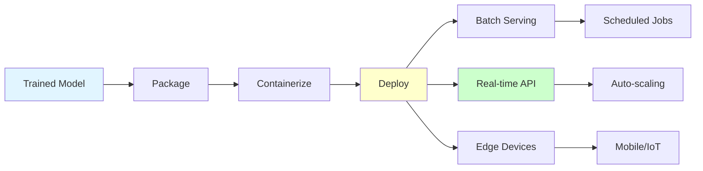
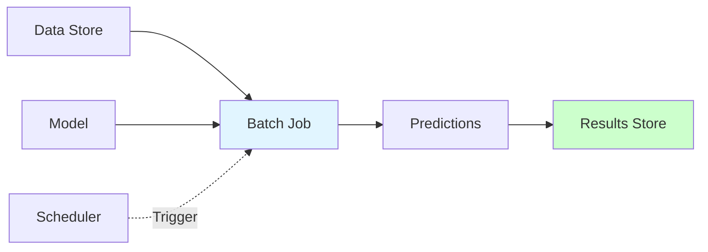
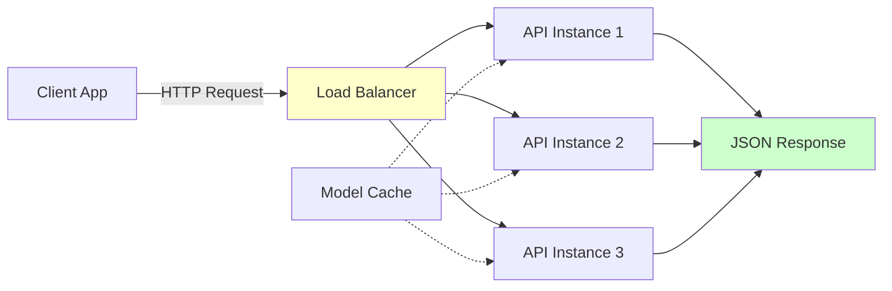
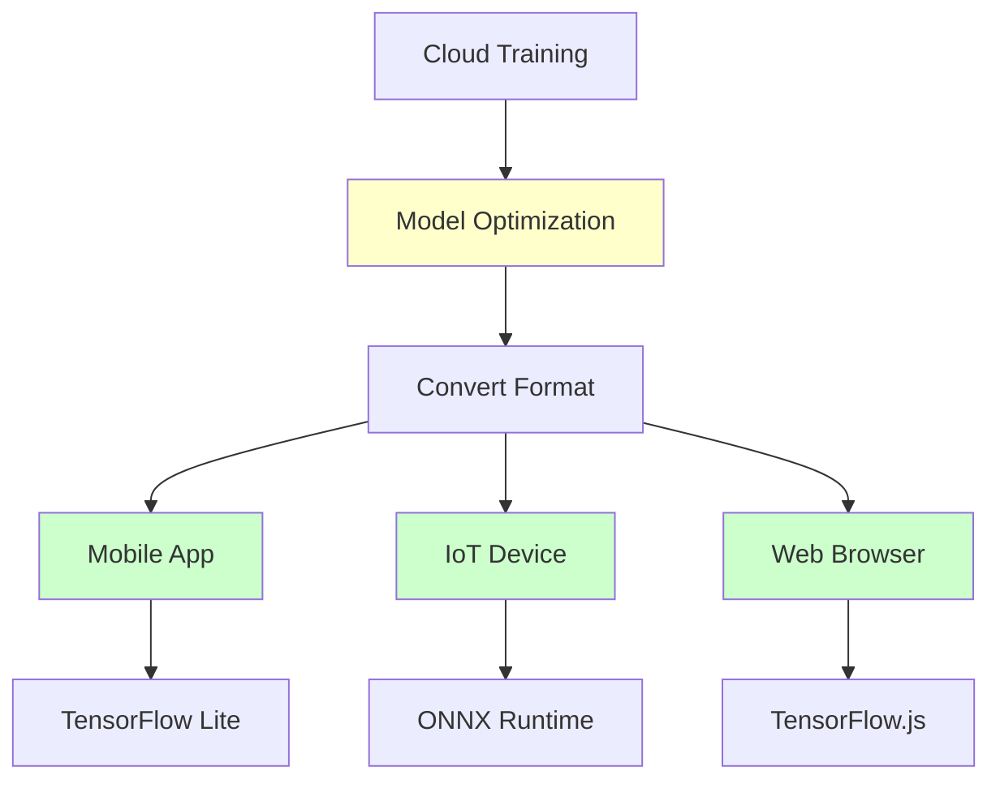
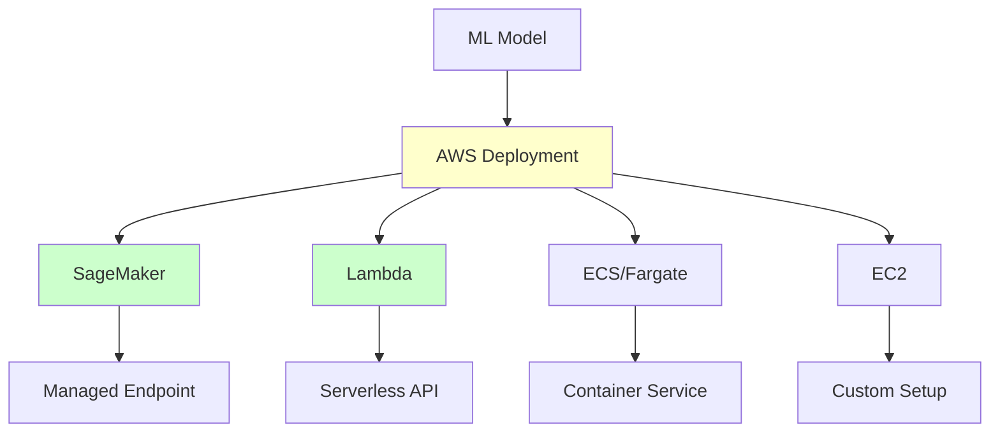

# Model Deployment

**Deploy ML models to production environments.** Learn deployment patterns, containerization, and cloud deployment strategies for scalable ML systems.

**Prerequisites:** Python, Docker basics, REST APIs, ML fundamentals

---

## 🎯 Overview

Model deployment is the process of making your trained ML model available for predictions in production. It involves packaging, serving, monitoring, and maintaining models in real-world environments.



---

## 🏗️ Deployment Patterns

### 1. Batch Prediction

**Use Case:** Process large datasets periodically (daily/weekly reports, batch scoring)



**Characteristics:**
- High throughput
- Non-real-time (minutes to hours)
- Cost-effective
- Simple architecture

**Example: Daily Churn Prediction**

```python
import pandas as pd
import joblib
from datetime import datetime

def batch_predict(model_path, input_data_path, output_path):
    """
    Batch prediction job for customer churn.
    """
    # Load model
    model = joblib.load(model_path)

    # Load data
    df = pd.read_csv(input_data_path)

    # Preprocess
    features = df[model.feature_names_]

    # Predict
    predictions = model.predict_proba(features)[:, 1]
    df['churn_probability'] = predictions
    df['prediction_date'] = datetime.now()

    # Save results
    df.to_csv(output_path, index=False)
    print(f"Processed {len(df)} records")

# Run batch job
if __name__ == "__main__":
    batch_predict(
        model_path="models/churn_model.pkl",
        input_data_path="data/customers_today.csv",
        output_path="data/predictions_today.csv"
    )
```

**Scheduling with Airflow:**

```python
from airflow import DAG
from airflow.operators.python import PythonOperator
from datetime import datetime, timedelta

default_args = {
    'owner': 'data-science',
    'depends_on_past': False,
    'start_date': datetime(2024, 1, 1),
    'retries': 3,
    'retry_delay': timedelta(minutes=5)
}

dag = DAG(
    'daily_churn_prediction',
    default_args=default_args,
    schedule_interval='0 2 * * *',  # 2 AM daily
    catchup=False
)

def extract_customer_data():
    # Extract data from database
    pass

def run_predictions():
    batch_predict(
        model_path="/models/churn_model.pkl",
        input_data_path="/data/customers.csv",
        output_path="/data/predictions.csv"
    )

def load_to_database():
    # Load predictions to database
    pass

extract = PythonOperator(
    task_id='extract_data',
    python_callable=extract_customer_data,
    dag=dag
)

predict = PythonOperator(
    task_id='run_predictions',
    python_callable=run_predictions,
    dag=dag
)

load = PythonOperator(
    task_id='load_results',
    python_callable=load_to_database,
    dag=dag
)

extract >> predict >> load
```

### 2. Real-Time API Serving

**Use Case:** Instant predictions for user-facing applications (recommendation, fraud detection)



**Characteristics:**
- Low latency (<100ms)
- Real-time responses
- Auto-scaling
- High availability

**Example: REST API with FastAPI**

```python
from fastapi import FastAPI, HTTPException
from pydantic import BaseModel
import joblib
import numpy as np
from typing import List
import logging

# Configure logging
logging.basicConfig(level=logging.INFO)
logger = logging.getLogger(__name__)

# Initialize FastAPI app
app = FastAPI(
    title="Fraud Detection API",
    description="Real-time fraud detection for credit card transactions",
    version="1.0.0"
)

# Load model at startup
model = None
scaler = None

@app.on_event("startup")
async def load_model():
    """Load model and preprocessing objects."""
    global model, scaler
    try:
        model = joblib.load("models/fraud_model.pkl")
        scaler = joblib.load("models/scaler.pkl")
        logger.info("Model loaded successfully")
    except Exception as e:
        logger.error(f"Failed to load model: {e}")
        raise

# Request/Response models
class Transaction(BaseModel):
    """Single transaction for prediction."""
    amount: float
    merchant_category: str
    transaction_hour: int
    day_of_week: int
    customer_age: int
    account_age_days: int

    class Config:
        schema_extra = {
            "example": {
                "amount": 125.50,
                "merchant_category": "retail",
                "transaction_hour": 14,
                "day_of_week": 3,
                "customer_age": 35,
                "account_age_days": 730
            }
        }

class PredictionResponse(BaseModel):
    """Prediction response."""
    is_fraud: bool
    fraud_probability: float
    risk_level: str

class BatchTransaction(BaseModel):
    """Batch of transactions."""
    transactions: List[Transaction]

# Helper functions
def preprocess_transaction(transaction: Transaction) -> np.ndarray:
    """Preprocess transaction for model input."""
    # Encode merchant category
    category_encoding = {
        'retail': 0, 'grocery': 1, 'gas': 2,
        'restaurant': 3, 'online': 4
    }

    features = np.array([
        transaction.amount,
        category_encoding.get(transaction.merchant_category, -1),
        transaction.transaction_hour,
        transaction.day_of_week,
        transaction.customer_age,
        transaction.account_age_days
    ]).reshape(1, -1)

    # Scale features
    features_scaled = scaler.transform(features)
    return features_scaled

def get_risk_level(probability: float) -> str:
    """Determine risk level based on probability."""
    if probability >= 0.8:
        return "high"
    elif probability >= 0.5:
        return "medium"
    else:
        return "low"

# API endpoints
@app.get("/")
async def root():
    """Health check endpoint."""
    return {
        "status": "healthy",
        "model": "fraud_detection_v1",
        "version": "1.0.0"
    }

@app.get("/health")
async def health():
    """Detailed health check."""
    if model is None:
        raise HTTPException(status_code=503, detail="Model not loaded")
    return {
        "status": "healthy",
        "model_loaded": model is not None,
        "scaler_loaded": scaler is not None
    }

@app.post("/predict", response_model=PredictionResponse)
async def predict(transaction: Transaction):
    """
    Predict fraud for a single transaction.

    Returns fraud probability and risk level.
    """
    try:
        # Preprocess
        features = preprocess_transaction(transaction)

        # Predict
        fraud_probability = float(model.predict_proba(features)[0, 1])
        is_fraud = fraud_probability >= 0.5
        risk_level = get_risk_level(fraud_probability)

        logger.info(
            f"Prediction: amount={transaction.amount}, "
            f"fraud_prob={fraud_probability:.3f}"
        )

        return PredictionResponse(
            is_fraud=is_fraud,
            fraud_probability=fraud_probability,
            risk_level=risk_level
        )

    except Exception as e:
        logger.error(f"Prediction error: {e}")
        raise HTTPException(status_code=500, detail=str(e))

@app.post("/predict/batch")
async def predict_batch(batch: BatchTransaction):
    """
    Predict fraud for multiple transactions.

    More efficient than individual requests for bulk predictions.
    """
    try:
        results = []

        for transaction in batch.transactions:
            features = preprocess_transaction(transaction)
            fraud_probability = float(model.predict_proba(features)[0, 1])
            is_fraud = fraud_probability >= 0.5
            risk_level = get_risk_level(fraud_probability)

            results.append({
                "is_fraud": is_fraud,
                "fraud_probability": fraud_probability,
                "risk_level": risk_level
            })

        return {"predictions": results}

    except Exception as e:
        logger.error(f"Batch prediction error: {e}")
        raise HTTPException(status_code=500, detail=str(e))

@app.get("/model/info")
async def model_info():
    """Get model information."""
    return {
        "model_type": type(model).__name__,
        "n_features": model.n_features_in_,
        "feature_names": model.feature_names_in_.tolist()
    }

# Run with: uvicorn api:app --reload --port 8000
```

**Client Usage:**

```python
import requests
import json

# Single prediction
transaction = {
    "amount": 125.50,
    "merchant_category": "online",
    "transaction_hour": 23,
    "day_of_week": 6,
    "customer_age": 25,
    "account_age_days": 90
}

response = requests.post(
    "http://localhost:8000/predict",
    json=transaction
)

print(response.json())
# Output: {
#   "is_fraud": true,
#   "fraud_probability": 0.87,
#   "risk_level": "high"
# }

# Batch prediction
batch = {
    "transactions": [transaction, transaction, transaction]
}

response = requests.post(
    "http://localhost:8000/predict/batch",
    json=batch
)

print(response.json())
```

### 3. Edge Deployment

**Use Case:** On-device predictions (mobile apps, IoT devices, offline scenarios)



**Characteristics:**
- Ultra-low latency
- Offline capability
- Privacy-preserving
- Limited resources

**Example: Convert to TensorFlow Lite**

```python
import tensorflow as tf
import numpy as np

def convert_to_tflite(model_path, output_path, optimize=True):
    """
    Convert Keras model to TensorFlow Lite.
    """
    # Load model
    model = tf.keras.models.load_model(model_path)

    # Convert to TFLite
    converter = tf.lite.TFLiteConverter.from_keras_model(model)

    if optimize:
        # Optimize for size and latency
        converter.optimizations = [tf.lite.Optimize.DEFAULT]

        # Optional: Quantize to int8
        converter.target_spec.supported_types = [tf.int8]

    tflite_model = converter.convert()

    # Save
    with open(output_path, 'wb') as f:
        f.write(tflite_model)

    # Check model size
    import os
    original_size = os.path.getsize(model_path)
    tflite_size = os.path.getsize(output_path)

    print(f"Original model size: {original_size / 1024 / 1024:.2f} MB")
    print(f"TFLite model size: {tflite_size / 1024 / 1024:.2f} MB")
    print(f"Compression ratio: {original_size / tflite_size:.2f}x")

# Convert model
convert_to_tflite(
    model_path="models/image_classifier.h5",
    output_path="models/image_classifier.tflite",
    optimize=True
)
```

**Inference with TFLite:**

```python
import tensorflow as tf
import numpy as np

def predict_tflite(model_path, input_data):
    """
    Run inference with TFLite model.
    """
    # Load TFLite model
    interpreter = tf.lite.Interpreter(model_path=model_path)
    interpreter.allocate_tensors()

    # Get input and output details
    input_details = interpreter.get_input_details()
    output_details = interpreter.get_output_details()

    # Prepare input
    input_data = np.array(input_data, dtype=np.float32)
    interpreter.set_tensor(input_details[0]['index'], input_data)

    # Run inference
    interpreter.invoke()

    # Get output
    output_data = interpreter.get_tensor(output_details[0]['index'])
    return output_data

# Usage
prediction = predict_tflite(
    model_path="models/image_classifier.tflite",
    input_data=preprocessed_image
)
```

---

## 🐳 Containerization with Docker

### Why Docker?

- **Consistency**: Same environment everywhere
- **Isolation**: Avoid dependency conflicts
- **Portability**: Run anywhere
- **Scalability**: Easy to replicate

### Dockerfile for ML API

```dockerfile
# Base image with Python
FROM python:3.9-slim

# Set working directory
WORKDIR /app

# Install system dependencies
RUN apt-get update && apt-get install -y \
    gcc \
    g++ \
    && rm -rf /var/lib/apt/lists/*

# Copy requirements first (for better caching)
COPY requirements.txt .

# Install Python dependencies
RUN pip install --no-cache-dir -r requirements.txt

# Copy application code
COPY api.py .
COPY models/ models/

# Create non-root user for security
RUN useradd -m -u 1000 mluser && \
    chown -R mluser:mluser /app
USER mluser

# Expose port
EXPOSE 8000

# Health check
HEALTHCHECK --interval=30s --timeout=10s --start-period=5s --retries=3 \
    CMD python -c "import requests; requests.get('http://localhost:8000/health')"

# Run application
CMD ["uvicorn", "api:app", "--host", "0.0.0.0", "--port", "8000"]
```

### Requirements File

```text
# requirements.txt
fastapi==0.104.1
uvicorn[standard]==0.24.0
pydantic==2.5.0
scikit-learn==1.3.2
numpy==1.24.3
joblib==1.3.2
pandas==2.1.3
```

### Build and Run

```bash
# Build Docker image
docker build -t fraud-detection-api:v1 .

# Run container
docker run -d \
    --name fraud-api \
    -p 8000:8000 \
    -e MODEL_PATH=/app/models/fraud_model.pkl \
    fraud-detection-api:v1

# Check logs
docker logs fraud-api

# Test API
curl http://localhost:8000/health

# Stop and remove
docker stop fraud-api
docker rm fraud-api
```

### Docker Compose for Multi-Service

```yaml
# docker-compose.yml
version: '3.8'

services:
  # ML API service
  api:
    build: .
    ports:
      - "8000:8000"
    environment:
      - MODEL_PATH=/app/models/fraud_model.pkl
      - LOG_LEVEL=info
    volumes:
      - ./models:/app/models:ro  # Read-only models
    healthcheck:
      test: ["CMD", "curl", "-f", "http://localhost:8000/health"]
      interval: 30s
      timeout: 10s
      retries: 3
    restart: unless-stopped

  # Redis for caching (optional)
  redis:
    image: redis:7-alpine
    ports:
      - "6379:6379"
    volumes:
      - redis-data:/data
    restart: unless-stopped

  # Prometheus for monitoring (optional)
  prometheus:
    image: prom/prometheus:latest
    ports:
      - "9090:9090"
    volumes:
      - ./prometheus.yml:/etc/prometheus/prometheus.yml
      - prometheus-data:/prometheus
    restart: unless-stopped

volumes:
  redis-data:
  prometheus-data:
```

```bash
# Start all services
docker-compose up -d

# View logs
docker-compose logs -f api

# Scale API instances
docker-compose up -d --scale api=3

# Stop all services
docker-compose down
```

---

## ☁️ Cloud Deployment

### AWS Deployment Options



### 1. AWS SageMaker

**Fully managed ML deployment platform.**

```python
import sagemaker
from sagemaker.sklearn import SKLearnModel

# Package model
model = SKLearnModel(
    model_data='s3://my-bucket/model.tar.gz',
    role='arn:aws:iam::123456789:role/SageMakerRole',
    entry_point='inference.py',
    framework_version='1.0-1'
)

# Deploy to endpoint
predictor = model.deploy(
    initial_instance_count=2,
    instance_type='ml.m5.large',
    endpoint_name='fraud-detection-endpoint'
)

# Make predictions
result = predictor.predict(transaction_data)
```

**inference.py:**

```python
import joblib
import numpy as np

def model_fn(model_dir):
    """Load model."""
    model = joblib.load(f"{model_dir}/model.pkl")
    return model

def input_fn(request_body, request_content_type):
    """Parse input data."""
    if request_content_type == 'application/json':
        import json
        data = json.loads(request_body)
        return np.array(data['features'])
    raise ValueError(f"Unsupported content type: {request_content_type}")

def predict_fn(input_data, model):
    """Run prediction."""
    return model.predict_proba(input_data)

def output_fn(prediction, response_content_type):
    """Format output."""
    if response_content_type == 'application/json':
        import json
        return json.dumps({'predictions': prediction.tolist()})
    raise ValueError(f"Unsupported content type: {response_content_type}")
```

### 2. AWS Lambda (Serverless)

**For lightweight models and infrequent predictions.**

```python
import json
import joblib
import numpy as np

# Load model at container initialization (outside handler)
model = joblib.load('/opt/ml/model.pkl')

def lambda_handler(event, context):
    """
    AWS Lambda handler for fraud detection.
    """
    try:
        # Parse input
        body = json.loads(event['body'])
        features = np.array(body['features']).reshape(1, -1)

        # Predict
        probability = float(model.predict_proba(features)[0, 1])

        # Return response
        return {
            'statusCode': 200,
            'body': json.dumps({
                'fraud_probability': probability,
                'is_fraud': probability >= 0.5
            })
        }

    except Exception as e:
        return {
            'statusCode': 500,
            'body': json.dumps({'error': str(e)})
        }
```

**Deployment with SAM:**

```yaml
# template.yaml
AWSTemplateFormatVersion: '2010-09-09'
Transform: AWS::Serverless-2016-10-31

Resources:
  FraudDetectionFunction:
    Type: AWS::Serverless::Function
    Properties:
      CodeUri: ./
      Handler: lambda_function.lambda_handler
      Runtime: python3.9
      MemorySize: 512
      Timeout: 30
      Events:
        PredictAPI:
          Type: Api
          Properties:
            Path: /predict
            Method: post
```

```bash
# Deploy
sam build
sam deploy --guided
```

### 3. Google Cloud Platform (Vertex AI)

```python
from google.cloud import aiplatform

# Initialize
aiplatform.init(
    project='my-project',
    location='us-central1'
)

# Upload model
model = aiplatform.Model.upload(
    display_name='fraud-detection',
    artifact_uri='gs://my-bucket/model',
    serving_container_image_uri='gcr.io/my-project/fraud-api:latest'
)

# Deploy to endpoint
endpoint = model.deploy(
    machine_type='n1-standard-4',
    min_replica_count=1,
    max_replica_count=5,
    traffic_percentage=100
)

# Predict
prediction = endpoint.predict(instances=[features])
```

### 4. Azure Machine Learning

```python
from azureml.core import Workspace, Model
from azureml.core.webservice import AciWebservice, Webservice

# Connect to workspace
ws = Workspace.from_config()

# Register model
model = Model.register(
    workspace=ws,
    model_path='./fraud_model.pkl',
    model_name='fraud-detection'
)

# Define deployment config
aci_config = AciWebservice.deploy_configuration(
    cpu_cores=2,
    memory_gb=4,
    auth_enabled=True
)

# Deploy
service = Model.deploy(
    workspace=ws,
    name='fraud-detection-service',
    models=[model],
    inference_config=inference_config,
    deployment_config=aci_config
)

service.wait_for_deployment(show_output=True)

# Get scoring URI
print(f"Scoring URI: {service.scoring_uri}")
```

---

## 🎯 Best Practices

### 1. Model Versioning

```python
# models/
#   ├── fraud_detection/
#   │   ├── v1.0.0/
#   │   │   ├── model.pkl
#   │   │   ├── scaler.pkl
#   │   │   └── metadata.json
#   │   ├── v1.1.0/
#   │   └── v2.0.0/

import json
import joblib
from pathlib import Path

class ModelRegistry:
    """Manage model versions."""

    def __init__(self, base_path):
        self.base_path = Path(base_path)

    def save_model(self, model, version, metadata):
        """Save model with version."""
        version_path = self.base_path / version
        version_path.mkdir(parents=True, exist_ok=True)

        # Save model
        joblib.dump(model, version_path / 'model.pkl')

        # Save metadata
        with open(version_path / 'metadata.json', 'w') as f:
            json.dump(metadata, f, indent=2)

    def load_model(self, version='latest'):
        """Load specific model version."""
        if version == 'latest':
            # Get latest version
            versions = sorted([d.name for d in self.base_path.iterdir()])
            version = versions[-1]

        version_path = self.base_path / version
        model = joblib.load(version_path / 'model.pkl')

        with open(version_path / 'metadata.json') as f:
            metadata = json.load(f)

        return model, metadata

# Usage
registry = ModelRegistry('models/fraud_detection')

registry.save_model(
    model=trained_model,
    version='v1.0.0',
    metadata={
        'accuracy': 0.95,
        'trained_at': '2024-01-15',
        'features': feature_names
    }
)

model, metadata = registry.load_model(version='v1.0.0')
```

### 2. Input Validation

```python
from pydantic import BaseModel, validator, Field
from typing import List

class Transaction(BaseModel):
    """Validated transaction input."""

    amount: float = Field(..., gt=0, lt=1000000, description="Transaction amount")
    merchant_category: str = Field(..., min_length=1, max_length=50)
    transaction_hour: int = Field(..., ge=0, le=23)
    customer_age: int = Field(..., ge=18, le=120)

    @validator('amount')
    def validate_amount(cls, v):
        if v < 0:
            raise ValueError('Amount must be positive')
        return v

    @validator('merchant_category')
    def validate_category(cls, v):
        valid_categories = ['retail', 'grocery', 'gas', 'restaurant', 'online']
        if v not in valid_categories:
            raise ValueError(f'Invalid category: {v}')
        return v
```

### 3. Error Handling

```python
from fastapi import HTTPException
import logging

logger = logging.getLogger(__name__)

@app.post("/predict")
async def predict(transaction: Transaction):
    try:
        # Preprocess
        features = preprocess(transaction)

        # Predict
        prediction = model.predict(features)

        return {"prediction": prediction}

    except ValueError as e:
        logger.warning(f"Invalid input: {e}")
        raise HTTPException(status_code=400, detail=str(e))

    except Exception as e:
        logger.error(f"Prediction failed: {e}", exc_info=True)
        raise HTTPException(status_code=500, detail="Internal server error")
```

### 4. Graceful Degradation

```python
class ModelAPI:
    """API with fallback logic."""

    def __init__(self):
        self.primary_model = load_model('v2.0.0')
        self.fallback_model = load_model('v1.0.0')  # Stable version

    async def predict(self, features):
        try:
            # Try primary model
            return self.primary_model.predict(features)

        except Exception as e:
            logger.warning(f"Primary model failed: {e}")

            # Fallback to stable model
            try:
                logger.info("Using fallback model")
                return self.fallback_model.predict(features)

            except Exception as e:
                logger.error(f"Fallback model failed: {e}")
                # Return default safe prediction
                return {"prediction": 0.5, "status": "degraded"}
```

---

## 🚨 Common Challenges

### 1. Model Size
**Problem:** Large models slow down deployment and inference.

**Solutions:**
- Model quantization
- Model pruning
- Knowledge distillation
- Use smaller model architectures

### 2. Cold Start
**Problem:** First request is slow (serverless deployments).

**Solutions:**
- Keep models loaded
- Use provisioned concurrency
- Model caching
- Warm-up requests

### 3. Dependency Management
**Problem:** Conflicting dependencies, version mismatches.

**Solutions:**
- Use Docker containers
- Pin dependency versions
- Use virtual environments
- Regular dependency updates

### 4. Security
**Problem:** Exposed APIs, unauthorized access.

**Solutions:**
- API authentication (JWT, OAuth)
- Rate limiting
- Input validation
- HTTPS only
- Regular security audits

---

## 📚 Summary

**Key Takeaways:**

1. **Choose the Right Pattern**: Batch, real-time, or edge based on requirements
2. **Containerize Everything**: Docker ensures consistency and portability
3. **Version Your Models**: Track and manage different model versions
4. **Validate Inputs**: Prevent errors with proper input validation
5. **Handle Errors Gracefully**: Implement fallbacks and error handling
6. **Monitor Everything**: Track performance, errors, and system health

**Next Steps:**
- [Model Serving](model-serving.md) - Optimize serving performance
- [Monitoring](monitoring.md) - Monitor deployed models
- [CI/CD for ML](ci-cd.md) - Automate deployment pipelines

---

**Pro Tip:** Start simple with a basic REST API, then scale up as needed. Don't over-engineer your first deployment!
