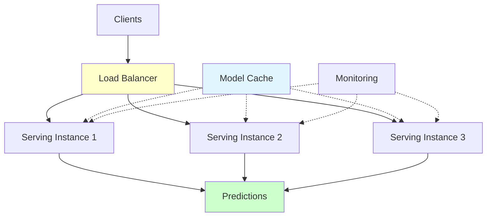
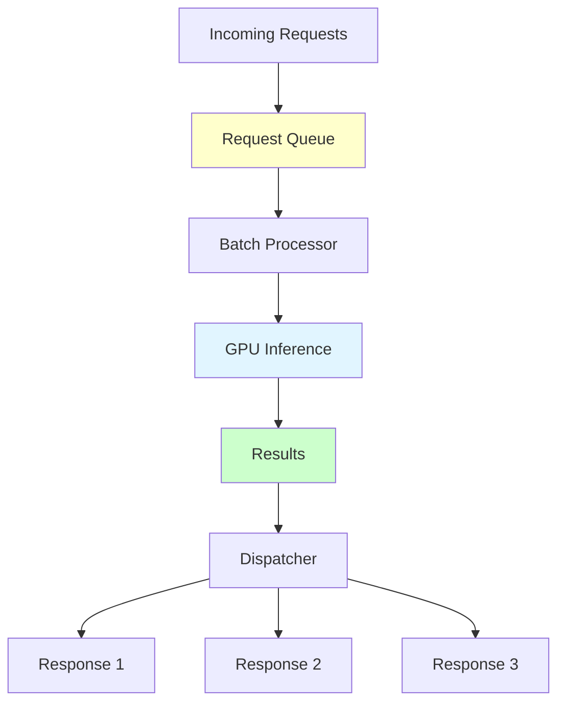
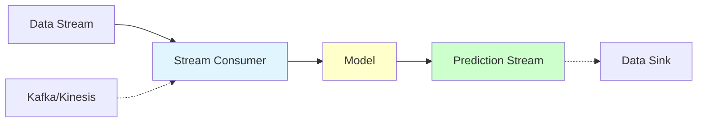
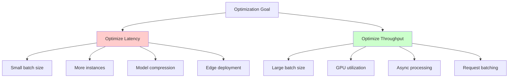
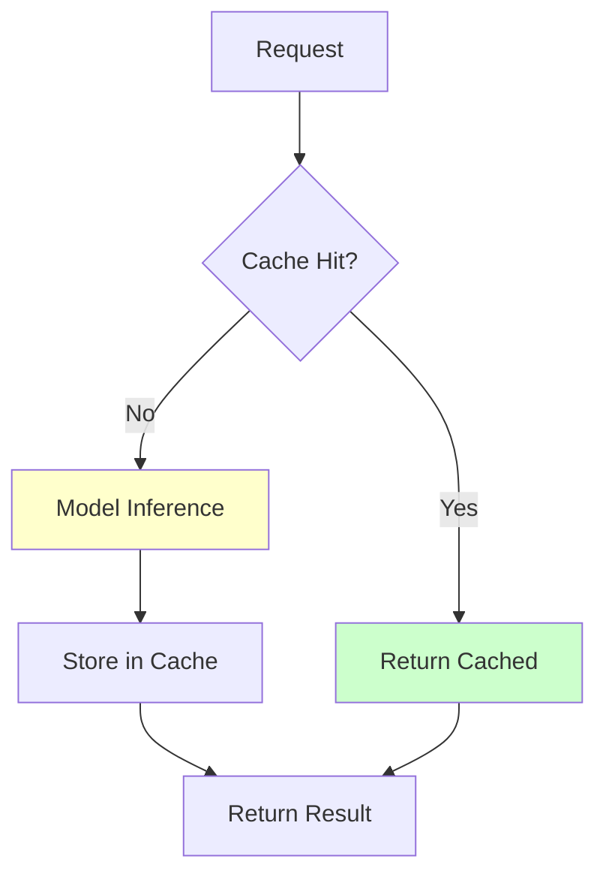
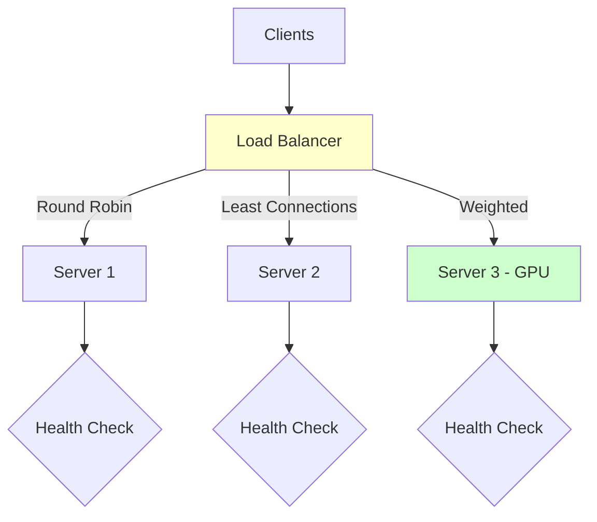

# Model Serving

**Serve ML predictions at scale with optimal performance.** Learn serving architectures, optimization techniques, and strategies for handling high-throughput, low-latency workloads.

**Prerequisites:** Model deployment basics, REST APIs, Python, performance optimization concepts

---

## 🎯 Overview

Model serving is the infrastructure and software layer that handles prediction requests efficiently at scale. It focuses on optimizing latency, throughput, and resource utilization while maintaining reliability.



---

## 🏗️ Serving Architectures

### 1. Online Serving (Synchronous)

**Use Case:** Real-time predictions with immediate response required


**Characteristics:**
- Low latency (<100ms)
- Request-response pattern
- Scales horizontally
- High availability required

**Example Architecture:**

```python
import asyncio
from fastapi import FastAPI
from typing import List
import numpy as np

app = FastAPI()

class ModelServer:
    """High-performance model server."""

    def __init__(self, model_path):
        self.model = self.load_model(model_path)
        self.model_lock = asyncio.Lock()

    def load_model(self, path):
        """Load model with optimization."""
        import joblib
        model = joblib.load(path)
        return model

    async def predict(self, features: np.ndarray) -> np.ndarray:
        """Thread-safe prediction."""
        async with self.model_lock:
            # Predictions are CPU-bound, run in executor
            loop = asyncio.get_event_loop()
            result = await loop.run_in_executor(
                None,
                self.model.predict_proba,
                features
            )
            return result

# Global model server
model_server = ModelServer("models/fraud_model.pkl")

@app.post("/predict")
async def predict(features: List[List[float]]):
    """Async prediction endpoint."""
    features_array = np.array(features)
    predictions = await model_server.predict(features_array)
    return {"predictions": predictions.tolist()}
```

### 2. Batch Serving (Asynchronous)

**Use Case:** High-throughput processing with relaxed latency requirements



**Characteristics:**
- High throughput
- Request batching
- Optimized GPU utilization
- Latency: 100ms-1s

**Example: Dynamic Batching**

```python
import asyncio
from collections import deque
from typing import List
import numpy as np
import time

class BatchingModelServer:
    """
    Model server with dynamic batching for GPU optimization.
    """

    def __init__(self, model, max_batch_size=32, max_wait_time=0.01):
        self.model = model
        self.max_batch_size = max_batch_size
        self.max_wait_time = max_wait_time  # 10ms

        self.request_queue = deque()
        self.response_futures = {}

        # Start batch processor
        asyncio.create_task(self.batch_processor())

    async def predict(self, features: np.ndarray):
        """
        Add prediction request to queue.
        Returns a future that resolves when prediction is ready.
        """
        future = asyncio.Future()
        request_id = id(future)

        self.request_queue.append((request_id, features))
        self.response_futures[request_id] = future

        return await future

    async def batch_processor(self):
        """
        Continuously process batched requests.
        """
        while True:
            # Wait for requests to accumulate
            if len(self.request_queue) == 0:
                await asyncio.sleep(0.001)  # 1ms
                continue

            # Collect batch
            batch_start = time.time()
            batch_requests = []
            batch_features = []

            while len(batch_requests) < self.max_batch_size:
                # Check timeout
                if time.time() - batch_start > self.max_wait_time:
                    break

                if len(self.request_queue) == 0:
                    # Wait a bit more for requests
                    await asyncio.sleep(0.001)
                    if time.time() - batch_start > self.max_wait_time:
                        break
                    continue

                request_id, features = self.request_queue.popleft()
                batch_requests.append(request_id)
                batch_features.append(features)

            if not batch_requests:
                continue

            # Process batch
            try:
                batch_array = np.vstack(batch_features)

                # Run inference (GPU-optimized)
                loop = asyncio.get_event_loop()
                predictions = await loop.run_in_executor(
                    None,
                    self.model.predict_proba,
                    batch_array
                )

                # Dispatch results
                for i, request_id in enumerate(batch_requests):
                    future = self.response_futures.pop(request_id)
                    future.set_result(predictions[i])

            except Exception as e:
                # Handle errors
                for request_id in batch_requests:
                    future = self.response_futures.pop(request_id)
                    future.set_exception(e)

# Usage with FastAPI
from fastapi import FastAPI

app = FastAPI()
batch_server = BatchingModelServer(model)

@app.post("/predict")
async def predict(features: List[float]):
    """Batched prediction endpoint."""
    features_array = np.array(features).reshape(1, -1)
    prediction = await batch_server.predict(features_array)
    return {"prediction": prediction.tolist()}
```

### 3. Streaming Serving

**Use Case:** Continuous predictions on data streams (IoT, real-time analytics)



**Example: Kafka Stream Processing**

```python
from confluent_kafka import Consumer, Producer
import json
import numpy as np

class StreamingModelServer:
    """
    Model server for streaming predictions.
    """

    def __init__(self, model, kafka_config):
        self.model = model

        # Kafka consumer for input
        self.consumer = Consumer({
            'bootstrap.servers': kafka_config['bootstrap_servers'],
            'group.id': 'ml-predictions',
            'auto.offset.reset': 'earliest'
        })
        self.consumer.subscribe(['transactions'])

        # Kafka producer for output
        self.producer = Producer({
            'bootstrap.servers': kafka_config['bootstrap_servers']
        })

    def process_stream(self):
        """
        Continuously process stream and produce predictions.
        """
        try:
            while True:
                # Poll for messages
                msg = self.consumer.poll(timeout=1.0)
                if msg is None:
                    continue

                if msg.error():
                    print(f"Consumer error: {msg.error()}")
                    continue

                # Parse message
                transaction = json.loads(msg.value().decode('utf-8'))
                features = np.array(transaction['features']).reshape(1, -1)

                # Predict
                prediction = self.model.predict_proba(features)[0, 1]

                # Produce result
                result = {
                    'transaction_id': transaction['id'],
                    'fraud_probability': float(prediction),
                    'timestamp': transaction['timestamp']
                }

                self.producer.produce(
                    'predictions',
                    key=transaction['id'].encode('utf-8'),
                    value=json.dumps(result).encode('utf-8')
                )
                self.producer.flush()

        finally:
            self.consumer.close()

# Run streaming server
if __name__ == "__main__":
    kafka_config = {'bootstrap_servers': 'localhost:9092'}
    server = StreamingModelServer(model, kafka_config)
    server.process_stream()
```

---

## ⚡ Performance Optimization

### 1. Latency vs Throughput Trade-offs



**Latency Optimization:**

```python
# 1. Model compression
import onnxruntime as ort

# Convert to ONNX for faster inference
onnx_model = convert_to_onnx(sklearn_model)

# Create session with optimizations
session = ort.InferenceSession(
    onnx_model,
    providers=['CPUExecutionProvider'],
    sess_options={
        'intra_op_num_threads': 4,
        'inter_op_num_threads': 1,
        'execution_mode': ort.ExecutionMode.ORT_SEQUENTIAL,
        'graph_optimization_level': ort.GraphOptimizationLevel.ORT_ENABLE_ALL
    }
)

# Fast inference
def predict_fast(features):
    input_name = session.get_inputs()[0].name
    prediction = session.run(None, {input_name: features})
    return prediction[0]
```

**Throughput Optimization:**

```python
# 2. Batch processing with GPU
import torch

class GPUBatchPredictor:
    """Optimize throughput with GPU batching."""

    def __init__(self, model, batch_size=128):
        self.model = model.cuda()
        self.batch_size = batch_size

    def predict_batch(self, features_list):
        """Process large batch on GPU."""
        predictions = []

        # Process in optimized batches
        for i in range(0, len(features_list), self.batch_size):
            batch = features_list[i:i + self.batch_size]
            batch_tensor = torch.tensor(batch).cuda()

            with torch.no_grad():
                batch_predictions = self.model(batch_tensor)

            predictions.extend(batch_predictions.cpu().numpy())

        return np.array(predictions)
```

### 2. Model Formats and Optimization

#### ONNX (Open Neural Network Exchange)

**Benefits:**
- Hardware-agnostic
- Optimized runtime
- Wide framework support

```python
import torch
import onnx
import onnxruntime as ort

# Convert PyTorch to ONNX
def convert_pytorch_to_onnx(model, input_shape, onnx_path):
    """Convert PyTorch model to ONNX."""
    model.eval()

    # Create dummy input
    dummy_input = torch.randn(1, *input_shape)

    # Export
    torch.onnx.export(
        model,
        dummy_input,
        onnx_path,
        export_params=True,
        opset_version=14,
        input_names=['input'],
        output_names=['output'],
        dynamic_axes={
            'input': {0: 'batch_size'},
            'output': {0: 'batch_size'}
        }
    )

    # Verify
    onnx_model = onnx.load(onnx_path)
    onnx.checker.check_model(onnx_model)

    print(f"Model exported to {onnx_path}")

# Use ONNX model
def predict_with_onnx(onnx_path, features):
    """Run inference with ONNX."""
    session = ort.InferenceSession(onnx_path)

    input_name = session.get_inputs()[0].name
    output = session.run(None, {input_name: features})

    return output[0]

# Benchmark
import time

# Original PyTorch
start = time.time()
for _ in range(1000):
    pytorch_model(dummy_input)
pytorch_time = time.time() - start

# ONNX
start = time.time()
for _ in range(1000):
    predict_with_onnx(onnx_path, dummy_input.numpy())
onnx_time = time.time() - start

print(f"PyTorch: {pytorch_time:.3f}s")
print(f"ONNX: {onnx_time:.3f}s")
print(f"Speedup: {pytorch_time / onnx_time:.2f}x")
```

#### TensorRT (NVIDIA GPU Optimization)

**Benefits:**
- Extreme GPU optimization
- Precision calibration (FP16, INT8)
- Layer fusion

```python
import tensorrt as trt
import pycuda.driver as cuda

class TensorRTInference:
    """TensorRT optimized inference."""

    def __init__(self, onnx_path, precision='fp16'):
        self.logger = trt.Logger(trt.Logger.WARNING)

        # Build engine
        builder = trt.Builder(self.logger)
        network = builder.create_network(1 << int(trt.NetworkDefinitionCreationFlag.EXPLICIT_BATCH))
        parser = trt.OnnxParser(network, self.logger)

        # Parse ONNX
        with open(onnx_path, 'rb') as f:
            parser.parse(f.read())

        # Build config
        config = builder.create_builder_config()
        config.max_workspace_size = 1 << 30  # 1GB

        if precision == 'fp16':
            config.set_flag(trt.BuilderFlag.FP16)
        elif precision == 'int8':
            config.set_flag(trt.BuilderFlag.INT8)

        # Build engine
        self.engine = builder.build_engine(network, config)
        self.context = self.engine.create_execution_context()

    def infer(self, input_data):
        """Run inference."""
        # Allocate buffers
        h_input = cuda.pagelocked_empty(input_data.size, dtype=np.float32)
        h_output = cuda.pagelocked_empty(output_size, dtype=np.float32)

        d_input = cuda.mem_alloc(h_input.nbytes)
        d_output = cuda.mem_alloc(h_output.nbytes)

        # Transfer to GPU
        cuda.memcpy_htod(d_input, input_data)

        # Execute
        self.context.execute_v2([int(d_input), int(d_output)])

        # Transfer back
        cuda.memcpy_dtoh(h_output, d_output)

        return h_output
```

### 3. Caching Strategies



**Example: Redis Caching**

```python
import redis
import json
import hashlib
from typing import Optional

class CachedModelServer:
    """Model server with Redis caching."""

    def __init__(self, model, redis_host='localhost', redis_port=6379, ttl=3600):
        self.model = model
        self.redis_client = redis.Redis(host=redis_host, port=redis_port, db=0)
        self.ttl = ttl  # Cache TTL in seconds

    def get_cache_key(self, features):
        """Generate cache key from features."""
        features_str = json.dumps(features.tolist())
        return hashlib.md5(features_str.encode()).hexdigest()

    def predict(self, features):
        """Predict with caching."""
        # Generate cache key
        cache_key = f"prediction:{self.get_cache_key(features)}"

        # Check cache
        cached_result = self.redis_client.get(cache_key)
        if cached_result is not None:
            return json.loads(cached_result)

        # Cache miss - run inference
        prediction = self.model.predict_proba(features)[0, 1]
        result = {"probability": float(prediction)}

        # Store in cache
        self.redis_client.setex(
            cache_key,
            self.ttl,
            json.dumps(result)
        )

        return result

# Usage with FastAPI
from fastapi import FastAPI

app = FastAPI()
cached_server = CachedModelServer(model)

@app.post("/predict")
async def predict(features: List[float]):
    features_array = np.array(features).reshape(1, -1)
    result = cached_server.predict(features_array)
    return result
```

**LRU Cache for Feature Embeddings:**

```python
from functools import lru_cache
import numpy as np

class FeatureCache:
    """Cache expensive feature computations."""

    @lru_cache(maxsize=10000)
    def compute_features(self, input_tuple):
        """Expensive feature computation with caching."""
        # Convert tuple back to array
        input_array = np.array(input_tuple)

        # Expensive computation
        features = expensive_feature_extraction(input_array)

        return features

    def predict(self, raw_input):
        """Predict with feature caching."""
        # Convert to hashable tuple for caching
        input_tuple = tuple(raw_input.flatten())

        # Get cached features
        features = self.compute_features(input_tuple)

        # Predict
        return self.model.predict(features)
```

### 4. Load Balancing



**NGINX Configuration:**

```nginx
# nginx.conf
upstream ml_servers {
    least_conn;  # Use least connections algorithm

    server api1:8000 max_fails=3 fail_timeout=30s;
    server api2:8000 max_fails=3 fail_timeout=30s;
    server api3:8000 max_fails=3 fail_timeout=30s weight=2;  # GPU server

    # Health check
    check interval=3000 rise=2 fall=3 timeout=1000;
}

server {
    listen 80;

    location /predict {
        proxy_pass http://ml_servers;
        proxy_set_header Host $host;
        proxy_set_header X-Real-IP $remote_addr;

        # Timeouts
        proxy_connect_timeout 10s;
        proxy_send_timeout 30s;
        proxy_read_timeout 30s;
    }

    location /health {
        access_log off;
        proxy_pass http://ml_servers/health;
    }
}
```

**Application-Level Load Balancing:**

```python
import random
from typing import List
import requests

class LoadBalancer:
    """Simple load balancer for ML servers."""

    def __init__(self, servers: List[str], strategy='round_robin'):
        self.servers = servers
        self.strategy = strategy
        self.current_index = 0
        self.server_health = {server: True for server in servers}

    def check_health(self, server):
        """Check server health."""
        try:
            response = requests.get(f"{server}/health", timeout=2)
            return response.status_code == 200
        except:
            return False

    def get_healthy_servers(self):
        """Get list of healthy servers."""
        healthy = []
        for server in self.servers:
            if self.server_health[server]:
                healthy.append(server)
        return healthy

    def select_server(self):
        """Select server based on strategy."""
        healthy_servers = self.get_healthy_servers()

        if not healthy_servers:
            raise Exception("No healthy servers available")

        if self.strategy == 'round_robin':
            server = healthy_servers[self.current_index % len(healthy_servers)]
            self.current_index += 1
            return server

        elif self.strategy == 'random':
            return random.choice(healthy_servers)

        elif self.strategy == 'least_latency':
            # Measure latency and pick fastest
            latencies = {}
            for server in healthy_servers:
                start = time.time()
                self.check_health(server)
                latencies[server] = time.time() - start
            return min(latencies, key=latencies.get)

    def predict(self, data):
        """Route prediction to selected server."""
        max_retries = 3

        for attempt in range(max_retries):
            try:
                server = self.select_server()
                response = requests.post(
                    f"{server}/predict",
                    json=data,
                    timeout=5
                )

                if response.status_code == 200:
                    return response.json()

            except Exception as e:
                # Mark server as unhealthy
                if attempt < max_retries - 1:
                    self.server_health[server] = False
                    continue
                raise

# Usage
lb = LoadBalancer(
    servers=['http://api1:8000', 'http://api2:8000', 'http://api3:8000'],
    strategy='round_robin'
)

result = lb.predict({"features": [1, 2, 3, 4]})
```

---

## 🔧 Advanced Techniques

### 1. Model Quantization

**Reduce model size and inference time.**

```python
import torch
import torch.quantization

def quantize_model(model, calibration_data):
    """
    Quantize PyTorch model to INT8.
    """
    # Set quantization config
    model.qconfig = torch.quantization.get_default_qconfig('fbgemm')

    # Prepare for quantization
    model_prepared = torch.quantization.prepare(model)

    # Calibrate with representative data
    model_prepared.eval()
    with torch.no_grad():
        for data in calibration_data:
            model_prepared(data)

    # Convert to quantized model
    model_quantized = torch.quantization.convert(model_prepared)

    return model_quantized

# Benchmark
import time

# Original model
start = time.time()
for _ in range(1000):
    model(test_input)
original_time = time.time() - start

# Quantized model
quantized_model = quantize_model(model, calibration_data)

start = time.time()
for _ in range(1000):
    quantized_model(test_input)
quantized_time = time.time() - start

print(f"Original: {original_time:.3f}s")
print(f"Quantized: {quantized_time:.3f}s")
print(f"Speedup: {original_time / quantized_time:.2f}x")

# Model size comparison
torch.save(model.state_dict(), 'model_original.pth')
torch.save(quantized_model.state_dict(), 'model_quantized.pth')

original_size = os.path.getsize('model_original.pth')
quantized_size = os.path.getsize('model_quantized.pth')

print(f"Size reduction: {original_size / quantized_size:.2f}x")
```

### 2. Model Pruning

**Remove unnecessary weights.**

```python
import torch
import torch.nn.utils.prune as prune

def prune_model(model, amount=0.3):
    """
    Prune model by removing low-magnitude weights.
    """
    # Prune each layer
    for name, module in model.named_modules():
        if isinstance(module, torch.nn.Linear):
            # Prune 30% of weights
            prune.l1_unstructured(module, name='weight', amount=amount)

    # Make pruning permanent
    for name, module in model.named_modules():
        if isinstance(module, torch.nn.Linear):
            prune.remove(module, 'weight')

    return model

# Usage
pruned_model = prune_model(model, amount=0.3)

# Evaluate accuracy vs speed trade-off
accuracy = evaluate(pruned_model, test_data)
print(f"Accuracy after pruning: {accuracy:.3f}")
```

### 3. Multi-Model Serving

**Serve multiple models efficiently.**

```python
from typing import Dict
import threading

class MultiModelServer:
    """Serve multiple models with shared resources."""

    def __init__(self):
        self.models: Dict[str, Any] = {}
        self.model_locks: Dict[str, threading.Lock] = {}

    def load_model(self, model_name: str, model_path: str):
        """Load a model."""
        import joblib
        self.models[model_name] = joblib.load(model_path)
        self.model_locks[model_name] = threading.Lock()
        print(f"Loaded model: {model_name}")

    def predict(self, model_name: str, features):
        """Predict with specific model."""
        if model_name not in self.models:
            raise ValueError(f"Model not found: {model_name}")

        with self.model_locks[model_name]:
            prediction = self.models[model_name].predict(features)

        return prediction

    def unload_model(self, model_name: str):
        """Unload model to free memory."""
        if model_name in self.models:
            del self.models[model_name]
            del self.model_locks[model_name]
            print(f"Unloaded model: {model_name}")

# Usage
server = MultiModelServer()
server.load_model('fraud_v1', 'models/fraud_v1.pkl')
server.load_model('fraud_v2', 'models/fraud_v2.pkl')
server.load_model('churn', 'models/churn.pkl')

# Route to specific model
prediction = server.predict('fraud_v2', features)
```

---

## 📊 Monitoring Serving Performance

```python
from prometheus_client import Counter, Histogram, Gauge
import time

# Metrics
prediction_counter = Counter(
    'predictions_total',
    'Total number of predictions',
    ['model', 'status']
)

prediction_latency = Histogram(
    'prediction_latency_seconds',
    'Prediction latency',
    ['model']
)

active_requests = Gauge(
    'active_requests',
    'Number of active requests'
)

def track_prediction(model_name):
    """Decorator to track prediction metrics."""
    def decorator(func):
        async def wrapper(*args, **kwargs):
            active_requests.inc()
            start_time = time.time()

            try:
                result = await func(*args, **kwargs)
                prediction_counter.labels(model=model_name, status='success').inc()
                return result

            except Exception as e:
                prediction_counter.labels(model=model_name, status='error').inc()
                raise

            finally:
                latency = time.time() - start_time
                prediction_latency.labels(model=model_name).observe(latency)
                active_requests.dec()

        return wrapper
    return decorator

# Usage
@app.post("/predict")
@track_prediction('fraud_detection_v1')
async def predict(features: List[float]):
    return model.predict(features)
```

---

## 📚 Summary

**Key Takeaways:**

1. **Choose the Right Architecture**: Online, batch, or streaming based on requirements
2. **Optimize for Your Bottleneck**: Latency vs throughput trade-offs
3. **Use Optimized Formats**: ONNX, TensorRT for faster inference
4. **Implement Caching**: Reduce redundant computations
5. **Load Balance**: Distribute traffic across instances
6. **Monitor Performance**: Track latency, throughput, errors

**Performance Hierarchy (fastest to slowest):**
1. TensorRT (GPU) + Quantization
2. ONNX Runtime + Optimization
3. Native Framework (PyTorch/TF) + GPU
4. Native Framework + CPU

**Next Steps:**
- [Monitoring](monitoring.md) - Monitor serving performance
- [Best Practices](best-practices.md) - Production serving best practices
- [CI/CD for ML](ci-cd.md) - Automate serving deployment

---

**Pro Tip:** Profile your serving pipeline to identify bottlenecks before optimizing. Measure first, optimize second!
