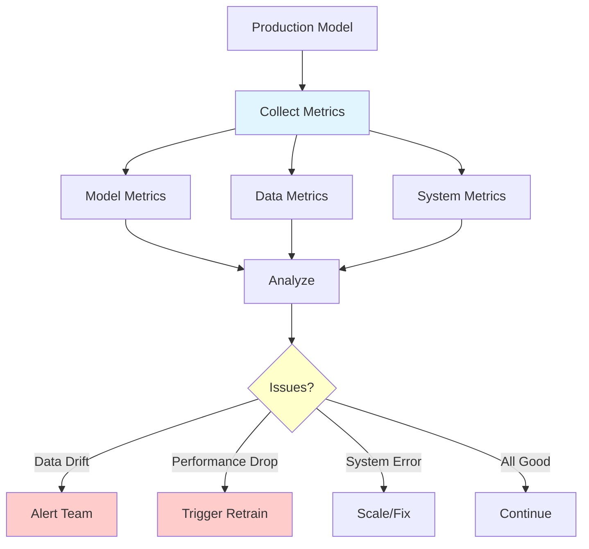
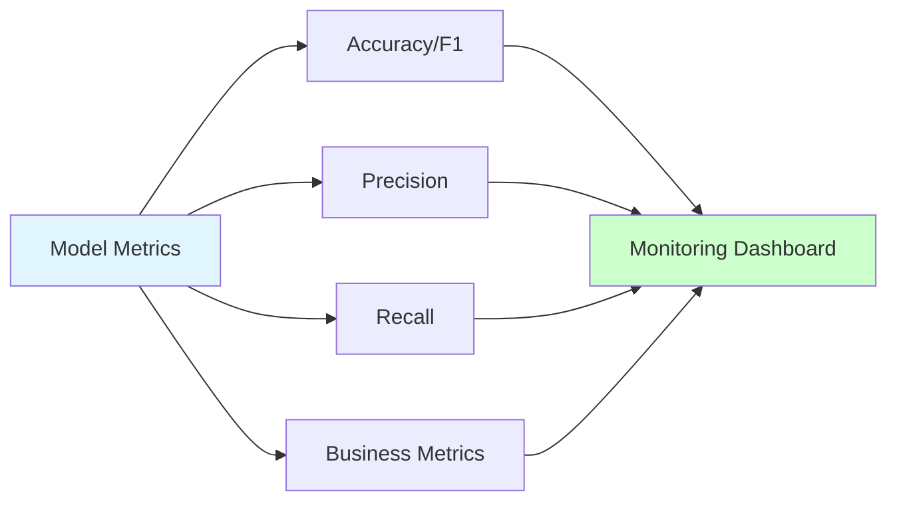
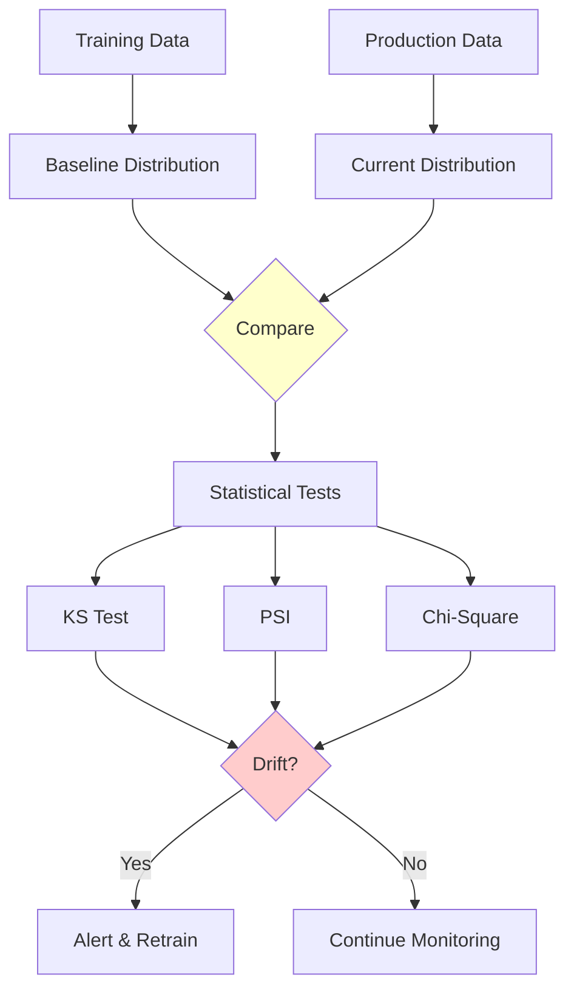
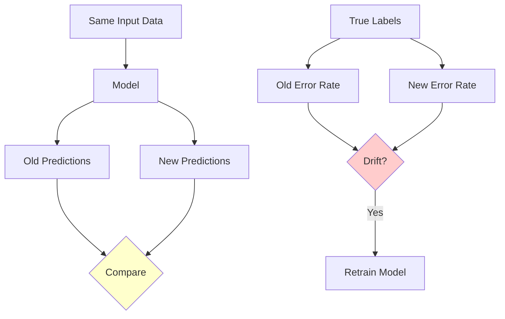

# Monitoring & Drift Detection

**Monitor ML model performance in production and detect issues early.** Learn to track model metrics, detect data drift, and implement alerting strategies.

**Prerequisites:** Model deployment, metrics, statistics, Python

---

## 🎯 Overview

Monitoring is the continuous observation of ML models in production to ensure they perform as expected. It includes tracking model metrics, detecting data drift, identifying concept drift, and alerting on anomalies.



---

## 📊 What to Monitor

### 1. Model Performance Metrics

**Track prediction quality over time.**



**Example: Classification Metrics Tracking**

```python
from sklearn.metrics import accuracy_score, precision_score, recall_score, f1_score
import time
from collections import deque
import numpy as np

class ModelPerformanceMonitor:
    """
    Monitor model performance metrics over time.
    """

    def __init__(self, window_size=1000):
        self.window_size = window_size

        # Sliding windows for metrics
        self.predictions = deque(maxlen=window_size)
        self.actuals = deque(maxlen=window_size)
        self.timestamps = deque(maxlen=window_size)

        # Metric history
        self.metric_history = {
            'accuracy': [],
            'precision': [],
            'recall': [],
            'f1': [],
            'timestamps': []
        }

    def log_prediction(self, y_true, y_pred):
        """Log a single prediction."""
        self.predictions.append(y_pred)
        self.actuals.append(y_true)
        self.timestamps.append(time.time())

    def compute_metrics(self):
        """Compute metrics on current window."""
        if len(self.predictions) < 10:
            return None

        y_true = np.array(self.actuals)
        y_pred = np.array(self.predictions)

        metrics = {
            'accuracy': accuracy_score(y_true, y_pred),
            'precision': precision_score(y_true, y_pred, zero_division=0),
            'recall': recall_score(y_true, y_pred, zero_division=0),
            'f1': f1_score(y_true, y_pred, zero_division=0),
            'n_samples': len(y_pred)
        }

        return metrics

    def update_history(self):
        """Update metric history."""
        metrics = self.compute_metrics()
        if metrics:
            for key, value in metrics.items():
                if key != 'n_samples':
                    self.metric_history[key].append(value)
            self.metric_history['timestamps'].append(time.time())

    def get_current_performance(self):
        """Get current performance summary."""
        metrics = self.compute_metrics()
        if not metrics:
            return "Insufficient data"

        return f"""
        Current Performance (last {len(self.predictions)} predictions):
        - Accuracy:  {metrics['accuracy']:.3f}
        - Precision: {metrics['precision']:.3f}
        - Recall:    {metrics['recall']:.3f}
        - F1 Score:  {metrics['f1']:.3f}
        """

    def detect_performance_degradation(self, threshold=0.05):
        """
        Detect if performance has degraded significantly.

        Returns True if recent performance is worse than baseline by threshold.
        """
        if len(self.metric_history['accuracy']) < 10:
            return False

        # Compare recent vs baseline
        baseline = np.mean(self.metric_history['accuracy'][:10])
        recent = np.mean(self.metric_history['accuracy'][-10:])

        degradation = baseline - recent

        if degradation > threshold:
            return True, f"Performance degraded by {degradation:.3f}"

        return False, None

# Usage
monitor = ModelPerformanceMonitor(window_size=1000)

# Log predictions as they come
for true_label, prediction in zip(y_true_stream, predictions_stream):
    monitor.log_prediction(true_label, prediction)

    # Periodically update and check
    if len(monitor.predictions) % 100 == 0:
        monitor.update_history()
        print(monitor.get_current_performance())

        is_degraded, message = monitor.detect_performance_degradation()
        if is_degraded:
            print(f"⚠️  ALERT: {message}")
```

### 2. Data Drift Detection

**Detect when input data distribution changes.**



#### Kolmogorov-Smirnov Test

```python
from scipy.stats import ks_2samp
import numpy as np
import pandas as pd

class DataDriftDetector:
    """
    Detect data drift using statistical tests.
    """

    def __init__(self, reference_data, feature_names, threshold=0.05):
        """
        Args:
            reference_data: Training/baseline data
            feature_names: List of feature names
            threshold: P-value threshold for drift detection
        """
        self.reference_data = reference_data
        self.feature_names = feature_names
        self.threshold = threshold

    def ks_test(self, reference, current):
        """
        Kolmogorov-Smirnov test for continuous features.
        """
        statistic, p_value = ks_2samp(reference, current)
        return {
            'statistic': statistic,
            'p_value': p_value,
            'drift_detected': p_value < self.threshold
        }

    def detect_drift(self, current_data):
        """
        Detect drift for all features.
        """
        results = {}

        for i, feature_name in enumerate(self.feature_names):
            reference_feature = self.reference_data[:, i]
            current_feature = current_data[:, i]

            # Remove NaN values
            reference_feature = reference_feature[~np.isnan(reference_feature)]
            current_feature = current_feature[~np.isnan(current_feature)]

            # Run KS test
            result = self.ks_test(reference_feature, current_feature)
            results[feature_name] = result

        return results

    def generate_report(self, current_data):
        """
        Generate drift detection report.
        """
        results = self.detect_drift(current_data)

        print("=" * 70)
        print("Data Drift Detection Report")
        print("=" * 70)

        drifted_features = []

        for feature_name, result in results.items():
            status = "⚠️  DRIFT" if result['drift_detected'] else "✓ OK"
            print(f"{feature_name:30s} | {status:10s} | p-value: {result['p_value']:.4f}")

            if result['drift_detected']:
                drifted_features.append(feature_name)

        print("=" * 70)
        print(f"Summary: {len(drifted_features)}/{len(results)} features drifted")

        return drifted_features

# Usage
detector = DataDriftDetector(
    reference_data=X_train,
    feature_names=feature_names,
    threshold=0.05
)

# Check for drift in production data
drifted_features = detector.generate_report(X_production)

if drifted_features:
    print(f"⚠️  Alert: Drift detected in {len(drifted_features)} features")
    # Trigger retraining or investigation
```

#### Population Stability Index (PSI)

```python
import numpy as np

def calculate_psi(reference, current, bins=10):
    """
    Calculate Population Stability Index (PSI).

    PSI < 0.1: No significant change
    0.1 <= PSI < 0.2: Moderate change
    PSI >= 0.2: Significant change (drift detected)
    """
    # Create bins
    breakpoints = np.linspace(
        min(reference.min(), current.min()),
        max(reference.max(), current.max()),
        bins + 1
    )

    # Calculate percentage in each bin
    reference_counts = np.histogram(reference, bins=breakpoints)[0]
    current_counts = np.histogram(current, bins=breakpoints)[0]

    # Convert to percentages (avoid division by zero)
    reference_pct = reference_counts / len(reference)
    current_pct = current_counts / len(current)

    # Add small constant to avoid log(0)
    epsilon = 1e-10
    reference_pct = np.clip(reference_pct, epsilon, 1)
    current_pct = np.clip(current_pct, epsilon, 1)

    # Calculate PSI
    psi = np.sum((current_pct - reference_pct) * np.log(current_pct / reference_pct))

    return psi

class PSIDriftDetector:
    """Drift detection using PSI."""

    def __init__(self, reference_data, feature_names):
        self.reference_data = reference_data
        self.feature_names = feature_names

    def detect_drift(self, current_data):
        """Detect drift using PSI."""
        results = {}

        for i, feature_name in enumerate(self.feature_names):
            reference_feature = self.reference_data[:, i]
            current_feature = current_data[:, i]

            # Calculate PSI
            psi = calculate_psi(reference_feature, current_feature)

            # Interpret PSI
            if psi < 0.1:
                status = "No drift"
            elif psi < 0.2:
                status = "Moderate drift"
            else:
                status = "Significant drift"

            results[feature_name] = {
                'psi': psi,
                'status': status,
                'drift_detected': psi >= 0.2
            }

        return results

    def generate_report(self, current_data):
        """Generate PSI report."""
        results = self.detect_drift(current_data)

        print("=" * 80)
        print("PSI Drift Detection Report")
        print("=" * 80)

        for feature_name, result in results.items():
            status_emoji = "⚠️" if result['drift_detected'] else "✓"
            print(f"{status_emoji} {feature_name:30s} | PSI: {result['psi']:.4f} | {result['status']}")

        print("=" * 80)

        return results

# Usage
psi_detector = PSIDriftDetector(X_train, feature_names)
psi_results = psi_detector.generate_report(X_production)
```

#### Using Evidently AI

```python
from evidently.report import Report
from evidently.metric_preset import DataDriftPreset, DataQualityPreset
import pandas as pd

def detect_drift_with_evidently(reference_df, current_df):
    """
    Comprehensive drift detection with Evidently AI.
    """
    # Create report
    report = Report(metrics=[
        DataDriftPreset(),
        DataQualityPreset()
    ])

    # Run report
    report.run(reference_data=reference_df, current_data=current_df)

    # Save HTML report
    report.save_html("drift_report.html")

    # Get results programmatically
    results = report.as_dict()

    # Check for drift
    drift_detected = results['metrics'][0]['result']['dataset_drift']

    if drift_detected:
        drifted_features = [
            feature for feature, info in results['metrics'][0]['result']['drift_by_columns'].items()
            if info['drift_detected']
        ]
        print(f"⚠️  Drift detected in features: {drifted_features}")
    else:
        print("✓ No drift detected")

    return drift_detected, results

# Usage
reference_df = pd.DataFrame(X_train, columns=feature_names)
current_df = pd.DataFrame(X_production, columns=feature_names)

drift_detected, report = detect_drift_with_evidently(reference_df, current_df)
```

### 3. Concept Drift Detection

**Detect when the relationship between features and target changes.**



```python
import numpy as np
from sklearn.metrics import accuracy_score
from collections import deque

class ConceptDriftDetector:
    """
    Detect concept drift using ADWIN (Adaptive Windowing).
    """

    def __init__(self, delta=0.002, window_size=100):
        """
        Args:
            delta: Confidence level (smaller = more sensitive)
            window_size: Minimum window size
        """
        self.delta = delta
        self.window_size = window_size
        self.window = deque(maxlen=10000)
        self.drift_detected = False

    def add_element(self, error):
        """
        Add prediction error (0 or 1).

        Args:
            error: 1 if incorrect, 0 if correct
        """
        self.window.append(error)

        if len(self.window) >= self.window_size:
            self.detect_drift()

    def detect_drift(self):
        """Detect drift using window statistics."""
        if len(self.window) < self.window_size:
            return False

        # Split window in half
        mid = len(self.window) // 2
        window1 = list(self.window)[:mid]
        window2 = list(self.window)[mid:]

        # Calculate means
        mean1 = np.mean(window1)
        mean2 = np.mean(window2)

        # Calculate difference
        diff = abs(mean1 - mean2)

        # Statistical threshold
        n1, n2 = len(window1), len(window2)
        m = 1 / (1/n1 + 1/n2)
        threshold = np.sqrt((2 / m) * np.log(2 / self.delta))

        # Check for drift
        if diff > threshold:
            self.drift_detected = True
            return True

        return False

    def reset(self):
        """Reset detector after retraining."""
        self.window.clear()
        self.drift_detected = False

# Usage
drift_detector = ConceptDriftDetector(delta=0.002)

for y_true, y_pred in zip(y_true_stream, predictions_stream):
    # Log error (1 if wrong, 0 if correct)
    error = int(y_true != y_pred)
    drift_detector.add_element(error)

    if drift_detector.drift_detected:
        print("⚠️  Concept drift detected! Trigger retraining.")
        # Retrain model
        # ...
        drift_detector.reset()
```

### 4. System Metrics

**Monitor system health and resource usage.**

```python
from prometheus_client import Gauge, Counter, Histogram
import psutil
import time

# Define metrics
cpu_usage = Gauge('cpu_usage_percent', 'CPU usage percentage')
memory_usage = Gauge('memory_usage_percent', 'Memory usage percentage')
request_latency = Histogram('request_latency_seconds', 'Request latency')
error_rate = Counter('errors_total', 'Total errors')

def monitor_system_metrics():
    """Continuously monitor system metrics."""
    while True:
        # CPU usage
        cpu_usage.set(psutil.cpu_percent(interval=1))

        # Memory usage
        memory = psutil.virtual_memory()
        memory_usage.set(memory.percent)

        time.sleep(10)  # Update every 10 seconds

# Run in background thread
import threading
monitor_thread = threading.Thread(target=monitor_system_metrics, daemon=True)
monitor_thread.start()
```

---

## 🚨 Alerting Strategies

### 1. Threshold-Based Alerts

```python
class AlertManager:
    """
    Manage alerts based on thresholds.
    """

    def __init__(self):
        self.alerts = []

    def check_metric(self, metric_name, value, threshold, comparison='less'):
        """
        Check if metric triggers alert.

        Args:
            metric_name: Name of metric
            value: Current value
            threshold: Threshold value
            comparison: 'less', 'greater', or 'equal'
        """
        triggered = False

        if comparison == 'less' and value < threshold:
            triggered = True
        elif comparison == 'greater' and value > threshold:
            triggered = True
        elif comparison == 'equal' and abs(value - threshold) < 1e-6:
            triggered = True

        if triggered:
            alert = {
                'metric': metric_name,
                'value': value,
                'threshold': threshold,
                'timestamp': time.time()
            }
            self.alerts.append(alert)
            self.send_alert(alert)

        return triggered

    def send_alert(self, alert):
        """Send alert notification."""
        print(f"⚠️  ALERT: {alert['metric']} = {alert['value']:.3f} (threshold: {alert['threshold']})")

        # Send email, Slack message, etc.
        # self.send_email(alert)
        # self.send_slack(alert)

# Usage
alert_manager = AlertManager()

# Check accuracy
current_accuracy = 0.82
alert_manager.check_metric('accuracy', current_accuracy, threshold=0.85, comparison='less')

# Check latency
current_latency = 150  # ms
alert_manager.check_metric('latency_ms', current_latency, threshold=100, comparison='greater')
```

### 2. Anomaly Detection Alerts

```python
from sklearn.ensemble import IsolationForest
import numpy as np

class AnomalyDetector:
    """
    Detect anomalous behavior in metrics.
    """

    def __init__(self, contamination=0.1):
        self.model = IsolationForest(contamination=contamination, random_state=42)
        self.fitted = False

    def fit(self, historical_data):
        """Fit on historical metric data."""
        self.model.fit(historical_data)
        self.fitted = True

    def detect_anomaly(self, current_metrics):
        """
        Detect if current metrics are anomalous.

        Returns:
            is_anomaly: Boolean
            anomaly_score: Float (lower = more anomalous)
        """
        if not self.fitted:
            raise ValueError("Model not fitted")

        current_metrics = np.array(current_metrics).reshape(1, -1)

        # Predict (-1 for anomaly, 1 for normal)
        prediction = self.model.predict(current_metrics)
        is_anomaly = prediction[0] == -1

        # Get anomaly score
        anomaly_score = self.model.score_samples(current_metrics)[0]

        return is_anomaly, anomaly_score

# Usage
# Collect historical metrics
historical_metrics = []
for day in range(30):
    daily_metrics = [
        accuracy[day],
        precision[day],
        recall[day],
        latency[day]
    ]
    historical_metrics.append(daily_metrics)

historical_metrics = np.array(historical_metrics)

# Fit anomaly detector
anomaly_detector = AnomalyDetector(contamination=0.05)
anomaly_detector.fit(historical_metrics)

# Check current metrics
current_metrics = [0.75, 0.70, 0.80, 120]  # accuracy, precision, recall, latency
is_anomaly, score = anomaly_detector.detect_anomaly(current_metrics)

if is_anomaly:
    print(f"⚠️  Anomalous metrics detected! Score: {score:.3f}")
```

### 3. Slack Integration

```python
import requests
import json

def send_slack_alert(webhook_url, message):
    """
    Send alert to Slack channel.

    Args:
        webhook_url: Slack webhook URL
        message: Alert message
    """
    payload = {
        "text": message,
        "username": "ML Monitor Bot",
        "icon_emoji": ":robot_face:"
    }

    response = requests.post(
        webhook_url,
        data=json.dumps(payload),
        headers={'Content-Type': 'application/json'}
    )

    return response.status_code == 200

# Usage
def alert_on_drift(drifted_features):
    """Alert when drift is detected."""
    message = f"""
    🚨 *Data Drift Alert*

    Drift detected in {len(drifted_features)} features:
    {', '.join(drifted_features)}

    *Action Required:*
    - Investigate data pipeline
    - Consider retraining model
    - Review feature engineering

    Dashboard: https://monitoring.example.com/drift
    """

    send_slack_alert(SLACK_WEBHOOK_URL, message)

# Trigger alert
if drifted_features:
    alert_on_drift(drifted_features)
```

---

## 📊 Monitoring Dashboard

### Grafana + Prometheus Setup

**prometheus.yml:**

```yaml
global:
  scrape_interval: 15s

scrape_configs:
  - job_name: 'ml_model'
    static_configs:
      - targets: ['api:8000']
```

**Python Integration:**

```python
from prometheus_client import start_http_server, Gauge, Counter, Histogram
from fastapi import FastAPI
import numpy as np

app = FastAPI()

# Prometheus metrics
prediction_counter = Counter(
    'predictions_total',
    'Total predictions made',
    ['model_version', 'prediction_class']
)

prediction_latency = Histogram(
    'prediction_latency_seconds',
    'Prediction latency in seconds',
    ['model_version']
)

model_accuracy = Gauge(
    'model_accuracy',
    'Current model accuracy',
    ['model_version']
)

feature_mean = Gauge(
    'feature_mean',
    'Mean value of features',
    ['feature_name']
)

@app.on_event("startup")
async def startup():
    """Start Prometheus metrics server."""
    start_http_server(8001)  # Prometheus metrics on port 8001

@app.post("/predict")
async def predict(features: List[float]):
    """Prediction endpoint with monitoring."""
    import time
    start_time = time.time()

    # Make prediction
    prediction = model.predict([features])[0]

    # Update metrics
    prediction_counter.labels(
        model_version='v1.0',
        prediction_class=str(prediction)
    ).inc()

    latency = time.time() - start_time
    prediction_latency.labels(model_version='v1.0').observe(latency)

    # Update feature statistics
    for i, value in enumerate(features):
        feature_mean.labels(feature_name=f'feature_{i}').set(value)

    return {"prediction": int(prediction)}

# Periodically update accuracy metric
def update_accuracy():
    """Update accuracy metric based on recent predictions."""
    while True:
        accuracy = compute_recent_accuracy()
        model_accuracy.labels(model_version='v1.0').set(accuracy)
        time.sleep(60)  # Update every minute

import threading
accuracy_thread = threading.Thread(target=update_accuracy, daemon=True)
accuracy_thread.start()
```

---

## 🔧 Complete Monitoring Solution

```python
import logging
from dataclasses import dataclass
from typing import List, Dict
import numpy as np

@dataclass
class MonitoringConfig:
    """Configuration for monitoring."""
    drift_threshold: float = 0.05
    performance_threshold: float = 0.85
    window_size: int = 1000
    check_interval: int = 3600  # 1 hour

class MLMonitoringSystem:
    """
    Complete ML monitoring system.
    """

    def __init__(self, config: MonitoringConfig):
        self.config = config
        self.logger = logging.getLogger(__name__)

        # Initialize components
        self.performance_monitor = ModelPerformanceMonitor(config.window_size)
        self.drift_detector = DataDriftDetector(
            reference_data=X_train,
            feature_names=feature_names,
            threshold=config.drift_threshold
        )
        self.concept_drift_detector = ConceptDriftDetector()
        self.alert_manager = AlertManager()

        # Storage
        self.current_predictions = []
        self.current_actuals = []

    def log_prediction(self, features, prediction, actual=None):
        """
        Log a prediction for monitoring.

        Args:
            features: Input features
            prediction: Model prediction
            actual: True label (if available)
        """
        # Store for drift detection
        self.current_predictions.append(features)

        # Log performance (if actual is available)
        if actual is not None:
            self.performance_monitor.log_prediction(actual, prediction)

            # Concept drift detection
            error = int(actual != prediction)
            self.concept_drift_detector.add_element(error)

            if self.concept_drift_detector.drift_detected:
                self.alert_manager.send_alert({
                    'type': 'concept_drift',
                    'message': 'Concept drift detected',
                    'timestamp': time.time()
                })

    def check_system_health(self):
        """
        Periodic health check.
        """
        # Check model performance
        metrics = self.performance_monitor.compute_metrics()
        if metrics and metrics['accuracy'] < self.config.performance_threshold:
            self.alert_manager.check_metric(
                'accuracy',
                metrics['accuracy'],
                self.config.performance_threshold,
                comparison='less'
            )

        # Check for data drift
        if len(self.current_predictions) >= self.config.window_size:
            current_data = np.array(self.current_predictions)
            drifted_features = self.drift_detector.generate_report(current_data)

            if drifted_features:
                self.alert_manager.send_alert({
                    'type': 'data_drift',
                    'features': drifted_features,
                    'message': f'Data drift in {len(drifted_features)} features',
                    'timestamp': time.time()
                })

            # Reset buffer
            self.current_predictions = []

    def generate_health_report(self):
        """Generate comprehensive health report."""
        report = {
            'timestamp': time.time(),
            'performance': self.performance_monitor.compute_metrics(),
            'alerts': self.alert_manager.alerts,
            'system_status': 'healthy' if not self.alert_manager.alerts else 'degraded'
        }

        return report

# Usage
config = MonitoringConfig(
    drift_threshold=0.05,
    performance_threshold=0.85,
    window_size=1000
)

monitoring_system = MLMonitoringSystem(config)

# In production loop
for features, prediction, actual in prediction_stream:
    monitoring_system.log_prediction(features, prediction, actual)

    # Periodic health check
    if should_check_health():
        monitoring_system.check_system_health()
        report = monitoring_system.generate_health_report()
        print(f"Health Report: {report}")
```

---

## 📚 Summary

**Key Takeaways:**

1. **Monitor Three Levels**: Model metrics, data drift, system metrics
2. **Detect Drift Early**: Use statistical tests (KS, PSI, Chi-square)
3. **Track Concept Drift**: Monitor prediction errors over time
4. **Set Up Alerts**: Threshold-based and anomaly detection
5. **Use Dashboards**: Visualize metrics with Grafana/Prometheus
6. **Automate Response**: Trigger retraining on drift detection

**Monitoring Checklist:**
- ✅ Model performance metrics (accuracy, precision, recall)
- ✅ Data drift detection (distribution changes)
- ✅ Concept drift detection (relationship changes)
- ✅ System metrics (latency, throughput, errors)
- ✅ Alerting system (Slack, email, PagerDuty)
- ✅ Monitoring dashboard (Grafana, custom)
- ✅ Automated retraining triggers

**Next Steps:**
- [CI/CD for ML](ci-cd.md) - Automate retraining and deployment
- [Best Practices](best-practices.md) - Production ML best practices
- [Model Deployment](model-deployment.md) - Deploy monitored models

---

**Pro Tip:** Start monitoring from day one! It's much harder to add monitoring to an existing system than to build it in from the start.
