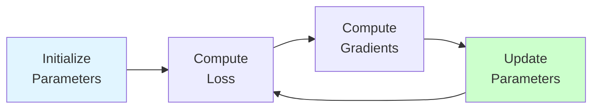

# Optimization & Tuning

**Improve model performance through optimization.** Master gradient descent, optimizers, regularization, and hyperparameter tuning.

**Difficulty:** 🟡🔴 Intermediate to Advanced | **Time:** 2-3 weeks | **Prerequisites:** [ML Fundamentals](../fundamentals/index.md), Calculus

---

## 🎯 What is Optimization?

**Optimization** finds the best parameters for your model by minimizing (or maximizing) an objective function.

**Key Goals:**
- 🎯 Minimize loss function
- ⚡ Train faster
- 🛡️ Prevent overfitting
- 🔧 Find best hyperparameters

---

## 📚 Topics Overview

### Core Optimization
- [Gradient Descent](gradient-descent.md) 🟡
- [Optimizers (SGD, Adam, RMSprop)](optimizers.md) 🟡

### Regularization
- [Regularization (L1, L2, Elastic Net)](regularization.md) 🟡
- [Dropout](dropout.md) 🟡
- [Batch Normalization](batch-normalization.md) 🔴

### Hyperparameter Tuning
- [Hyperparameter Tuning](hyperparameter-tuning.md) 🟡
- [Learning Rate Scheduling](learning-rate-scheduling.md) 🟡

---

## 🎓 Learning Path

### Week 1: Gradient Descent & Optimizers
Understand how models learn and different optimization algorithms.

### Week 2: Regularization
Learn techniques to prevent overfitting.

### Week 3: Hyperparameter Tuning
Master systematic search for best hyperparameters.

---

## 🚀 Next Steps

**Ready to optimize?** Start with [Gradient Descent](gradient-descent.md)! ⚡
