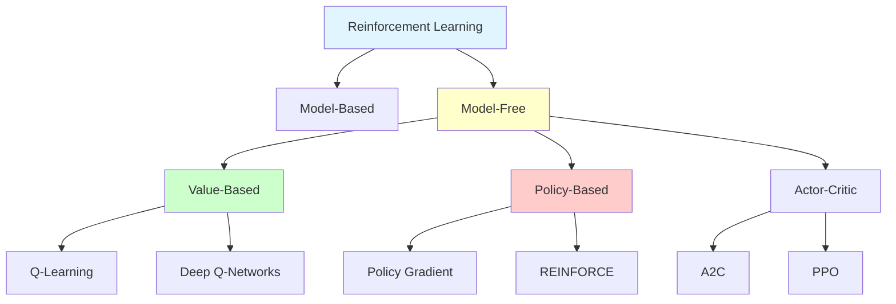

# Reinforcement Learning

**Learn through trial and error by interacting with an environment to maximize cumulative rewards.**

Reinforcement Learning (RL) is a paradigm where agents learn optimal behavior through experience, receiving rewards or penalties for their actions.

---

## 🎯 What is Reinforcement Learning?

### The Learning Paradigm

**Different from Supervised Learning:**

| Aspect | Supervised Learning | Reinforcement Learning |
|--------|-------------------|----------------------|
| **Data** | Fixed dataset with labels | Interactive environment |
| **Feedback** | Immediate correct answer | Delayed rewards |
| **Goal** | Minimize prediction error | Maximize cumulative reward |
| **Examples** | (image, label) pairs | (state, action, reward) sequences |

**The RL Setup:**
```
Agent observes State → Takes Action → Receives Reward → Observes new State → ...
```

### Real-World Analogy: Learning to Play Chess

**Supervised Learning Approach:**
- Give agent millions of (board position, best move) pairs
- Learn to predict the best move for any position
- Requires expert demonstrations

**Reinforcement Learning Approach:**
- Agent plays chess games
- Wins → positive reward, Losses → negative reward
- Learns which moves lead to winning
- Discovers strategies through experience

**Key Difference:** RL learns from outcomes (win/lose), not from being told the correct move.

---

## 🔑 Core Concepts

### 1. Agent and Environment

**The Interaction Loop:**

```
┌──────────┐
│  Agent   │ ← Observes state
└────┬─────┘
     │ Takes action
     ▼
┌──────────┐
│Environment│ → Provides reward
└────┬─────┘
     │ Transitions to new state
     ▼
   (Loop)
```

**Components:**
- **Agent:** The learner/decision maker (e.g., robot, game player, trading bot)
- **Environment:** Everything the agent interacts with (e.g., game, physical world, market)
- **State (s):** Current situation of the environment
- **Action (a):** What the agent can do
- **Reward (r):** Feedback signal indicating how good an action was

### 2. The Goal: Maximize Cumulative Reward

**Not just immediate reward, but long-term total:**

```
Goal: Maximize G_t = r_t + r_{t+1} + r_{t+2} + ... + r_T

With discounting: G_t = r_t + γ·r_{t+1} + γ²·r_{t+2} + ...

Where:
  G_t = Return (cumulative reward from time t)
  r_t = Immediate reward at time t
  γ = Discount factor (0 ≤ γ ≤ 1)
```

**Discount Factor (γ):**
- γ = 0: Only care about immediate reward (myopic)
- γ = 1: All future rewards equally important
- γ = 0.9-0.99: Typical values (balance present and future)

### 3. The Exploration-Exploitation Dilemma

**The Trade-off:**
- **Exploitation:** Choose actions you know give high reward
- **Exploration:** Try new actions to discover potentially better rewards

**Example: Restaurant Choice**
- **Exploit:** Go to your favorite restaurant (known reward)
- **Explore:** Try a new restaurant (unknown potential reward)

**Strategies:**
- **ε-greedy:** With probability ε, explore (random action); otherwise exploit
- **Softmax:** Choose actions probabilistically based on estimated values
- **UCB (Upper Confidence Bound):** Explore actions with high uncertainty

---

## 📊 Types of RL Algorithms

### Overview



### 1. Model-Free vs. Model-Based

**Model-Free (Learn policy or value function directly):**
- Don't learn model of environment
- Learn from experience (trial and error)
- Examples: Q-Learning, Policy Gradient
- ✅ Simpler, more general
- ❌ Sample inefficient

**Model-Based (Learn model of environment):**
- Learn dynamics: P(s'|s,a) and R(s,a)
- Plan using the model
- ✅ Sample efficient
- ❌ Model errors compound

### 2. Value-Based Methods

**Learn value of states or state-action pairs:**

**Q-Learning:**
- Learn Q(s,a) = expected return from taking action a in state s
- Choose action with highest Q-value
- Off-policy (can learn from any experience)

**Deep Q-Networks (DQN):**
- Use neural networks to approximate Q-function
- Enabled RL to solve complex problems (Atari games)

[→ Learn Q-Learning](q-learning.md){ .md-button }
[→ Learn DQN](deep-q-networks.md){ .md-button }

### 3. Policy-Based Methods

**Learn policy π(a|s) directly:**

**Policy Gradient:**
- Parametrize policy with weights θ
- Optimize θ to maximize expected return
- Can learn stochastic policies

**REINFORCE:**
- Monte Carlo policy gradient
- Update policy based on episode returns

[→ Learn Policy Gradient](policy-gradient.md){ .md-button }

### 4. Actor-Critic Methods

**Combine value-based and policy-based:**

**Architecture:**
- **Actor:** Policy π(a|s) that selects actions
- **Critic:** Value function V(s) that evaluates states

**Advantages:**
- Lower variance than pure policy gradient
- More stable than pure value-based

**Modern Algorithms:**
- A2C (Advantage Actor-Critic)
- A3C (Asynchronous A2C)
- PPO (Proximal Policy Optimization)
- SAC (Soft Actor-Critic)

[→ Learn Actor-Critic](actor-critic.md){ .md-button }

---

## 🎓 Learning Path

### For Beginners 🟢

**Start Here:**
1. [RL Fundamentals](fundamentals.md) - MDPs, value functions, Bellman equations
2. Understand the concepts through simple examples
3. Implement basic RL in grid worlds

**Prerequisites:**
- Basic probability
- Python programming
- Understanding of optimization

### For Intermediate 🟡

**After Fundamentals:**
1. [Q-Learning](q-learning.md) - Classic value-based algorithm
2. [Deep Q-Networks](deep-q-networks.md) - Scaling to complex problems
3. Implement DQN on Atari games

**Prerequisites:**
- RL fundamentals
- Deep learning basics
- PyTorch or TensorFlow

### For Advanced 🔴

**Advanced Topics:**
1. [Policy Gradient](policy-gradient.md) - Policy-based methods
2. [Actor-Critic](actor-critic.md) - State-of-the-art algorithms
3. Multi-agent RL, meta-RL, inverse RL

**Prerequisites:**
- Solid understanding of Q-learning and DQN
- Advanced deep learning
- Strong mathematical background

---

## 🎮 Classic RL Problems

### 1. Grid World

**Problem:** Navigate from start to goal in a grid

```
┌───┬───┬───┬───┐
│ S │   │   │   │  S = Start
├───┼───┼───┼───┤  G = Goal
│   │ X │   │   │  X = Obstacle
├───┼───┼───┼───┤  Actions: ↑,↓,←,→
│   │   │   │ G │  Reward: -1 per step, +10 at goal
└───┴───┴───┴───┘
```

**Why It's Useful:** Simple environment to understand RL concepts

### 2. CartPole

**Problem:** Balance pole on cart by moving left/right

```
      |
      |    ← Pole
    ┌─┴─┐
    │   │  ← Cart
  ══════════  ← Track
```

**Challenge:** Continuous state space (position, velocity, angle, angular velocity)

### 3. Mountain Car

**Problem:** Drive underpowered car up a hill

```
        /╲
       /  ╲    ← Goal
      /    ╲
  ╱╲/      ╲
 /   Car    ╲
```

**Challenge:** Reward only at goal (sparse rewards)

### 4. Atari Games

**Problem:** Play Atari games from pixels

**Achievements:**
- DQN playing Breakout, Pong, Space Invaders
- Superhuman performance in many games
- Input: Raw pixel observations
- Output: Game controls

### 5. Robotics

**Real-world Applications:**
- Robot manipulation (grasping, assembly)
- Locomotion (walking, running)
- Autonomous driving
- Drone control

---

## 🚀 Applications

### 1. Game Playing

**Successes:**
- **AlphaGo:** Defeated world champion in Go
- **AlphaStar:** Grandmaster level in StarCraft II
- **OpenAI Five:** Competitive Dota 2 team
- **MuZero:** Learns game rules from scratch

### 2. Robotics

**Applications:**
- Robotic manipulation and grasping
- Autonomous navigation
- Quadruped locomotion
- Industrial automation

### 3. Autonomous Vehicles

**Use Cases:**
- Self-driving cars (Waymo, Tesla)
- Autonomous drones
- Marine vessel navigation
- Warehouse robots

### 4. Finance

**Trading and Portfolio Management:**
- Algorithmic trading strategies
- Portfolio optimization
- Risk management
- Market making

### 5. Healthcare

**Medical Applications:**
- Treatment policy optimization
- Drug dosage recommendations
- Clinical trial design
- Hospital resource allocation

### 6. Recommendation Systems

**Personalization:**
- Content recommendation (YouTube, Netflix)
- Ad placement optimization
- News feed curation
- E-commerce product recommendations

### 7. Natural Language

**Dialogue Systems:**
- Chatbots and conversational AI
- Neural machine translation
- Text generation with feedback
- Question answering

---

## 📈 Key Algorithms Comparison

| Algorithm | Type | On/Off-Policy | Continuous Actions | Difficulty | Best For |
|-----------|------|---------------|-------------------|------------|----------|
| **Q-Learning** | Value-based | Off-policy | ❌ | 🟢 Easy | Discrete actions, learning |
| **DQN** | Value-based | Off-policy | ❌ | 🟡 Medium | Discrete actions, deep learning |
| **REINFORCE** | Policy-based | On-policy | ✅ | 🟡 Medium | Simple policy gradient |
| **A2C/A3C** | Actor-Critic | On-policy | ✅ | 🔴 Hard | General purpose |
| **PPO** | Actor-Critic | On-policy | ✅ | 🔴 Hard | State-of-the-art, stable |
| **SAC** | Actor-Critic | Off-policy | ✅ | 🔴 Hard | Continuous control |
| **DDPG** | Actor-Critic | Off-policy | ✅ | 🔴 Hard | Continuous control |

---

## ⚠️ Common Challenges

### 1. Sparse Rewards

**Problem:** Reward signal is rare (only at goal)

**Example:** Mountain Car - reward only when reaching top
- Agent receives -1 for thousands of steps
- Hard to learn without ever reaching goal

**Solutions:**
- Reward shaping (add intermediate rewards)
- Curriculum learning (start with easier tasks)
- Hindsight Experience Replay

### 2. Credit Assignment

**Problem:** Which action caused the reward?

**Example:** Chess - won game, but which move was key?

**Solutions:**
- Temporal difference learning
- Advantage estimation
- Eligibility traces

### 3. Sample Inefficiency

**Problem:** RL requires massive amounts of experience

**Example:** DQN needs millions of game frames to train

**Solutions:**
- Experience replay (reuse past experiences)
- Model-based RL (learn environment model)
- Transfer learning (pre-training)

### 4. Instability

**Problem:** Training can be unstable, diverge, or get stuck

**Causes:**
- Deadly triad (function approximation + bootstrapping + off-policy)
- Non-stationary targets
- High variance gradients

**Solutions:**
- Target networks (DQN)
- Gradient clipping
- Careful hyperparameter tuning
- Trust region methods (PPO, TRPO)

---

## 🎯 Best Practices

### 1. Start Simple

```python
# Don't start with:
# - Complex environments (raw pixels)
# - Advanced algorithms (PPO, SAC)

# Start with:
# - Simple environments (CartPole, GridWorld)
# - Basic algorithms (Q-Learning, DQN)

# Then progress to:
# - More complex environments
# - State-of-the-art algorithms
```

### 2. Baseline and Benchmark

**Always compare against:**
- Random policy (worst case)
- Hand-coded policy (if available)
- Published results (for standard benchmarks)

### 3. Visualization

**Monitor:**
- Episode rewards over time
- Episode length over time
- Q-value distributions
- Policy entropy (for policy-based)
- Loss curves

### 4. Reproducibility

```python
# Set random seeds
import random
import numpy as np
import torch

random.seed(42)
np.random.seed(42)
torch.manual_seed(42)

# Log hyperparameters
config = {
    'learning_rate': 0.001,
    'gamma': 0.99,
    'epsilon': 0.1,
    'batch_size': 64,
    # ... all hyperparameters
}
```

---

## 🛠️ Tools and Libraries

### Environments

**OpenAI Gym:**
```python
import gym

env = gym.make('CartPole-v1')
state = env.reset()

for _ in range(1000):
    action = env.action_space.sample()  # Random action
    state, reward, done, info = env.step(action)
    if done:
        state = env.reset()
```

**Other Frameworks:**
- **Gymnasium:** Modern fork of OpenAI Gym
- **PyBullet:** Physics simulation
- **MuJoCo:** Advanced physics for robotics
- **Unity ML-Agents:** Game engine integration

### RL Libraries

**Stable-Baselines3 (Recommended):**
```python
from stable_baselines3 import PPO

model = PPO('MlpPolicy', 'CartPole-v1', verbose=1)
model.learn(total_timesteps=10000)
model.save("ppo_cartpole")
```

**Other Libraries:**
- **RLlib:** Scalable RL library (Ray)
- **TF-Agents:** TensorFlow RL
- **Dopamine:** Google's RL framework
- **CleanRL:** Single-file implementations

---

## 📚 Learning Resources

### Books

**For Beginners:**
- "Reinforcement Learning: An Introduction" by Sutton & Barto (2nd ed.)
  - The RL bible, comprehensive and accessible

**For Advanced:**
- "Deep Reinforcement Learning Hands-On" by Maxim Lapan
- "Algorithms for Reinforcement Learning" by Csaba Szepesvári

### Online Courses

**Recommended:**
- **David Silver's RL Course (DeepMind)** - Excellent introduction
- **CS285 (UC Berkeley)** - Deep RL, cutting-edge topics
- **Spinning Up in Deep RL (OpenAI)** - Practical guide with code

### Tutorials and Blogs

- **Lil'Log** - Excellent RL explanations
- **Distill.pub** - Visual RL tutorials
- **Spinning Up** - OpenAI's educational resource

---

## 🚀 Quick Start

### 1. Learn Fundamentals
[Start with RL Fundamentals →](fundamentals.md){ .md-button .md-button--primary }

### 2. Implement Q-Learning
[Learn Q-Learning →](q-learning.md){ .md-button }

### 3. Scale with Deep RL
[Explore Deep Q-Networks →](deep-q-networks.md){ .md-button }

### 4. Advanced Algorithms
[Policy Gradient →](policy-gradient.md){ .md-button }
[Actor-Critic →](actor-critic.md){ .md-button }

---

## 🎯 What's Next?

**Choose Your Path:**

**Beginner?** Start with [Fundamentals](fundamentals.md) to understand MDPs, value functions, and Bellman equations.

**Intermediate?** Jump to [Q-Learning](q-learning.md) or [Deep Q-Networks](deep-q-networks.md) to implement your first RL agent.

**Advanced?** Explore [Policy Gradient](policy-gradient.md) and [Actor-Critic](actor-critic.md) methods for state-of-the-art algorithms.

---

**Key Takeaway:** Reinforcement Learning enables agents to learn optimal behavior through trial and error, discovering strategies that maximize long-term rewards rather than requiring explicit supervision. It's the paradigm behind AlphaGo, autonomous vehicles, and robotic control.
