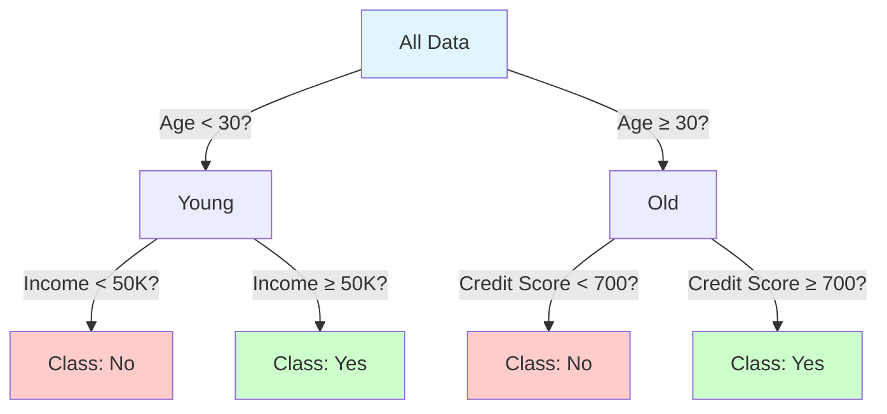

# Decision Trees

**Tree-based model using if-then rules for classification.** Learns a hierarchy of questions to ask about features, creating an interpretable flowchart-like structure. One of the most intuitive and explainable ML algorithms.

**Difficulty:** 🟢 Beginner | **Time:** 3-4 hours | **Prerequisites:** Basic Statistics, Information Theory (optional)

---

## Overview

Decision Trees split data recursively based on feature values to create a tree structure where each internal node represents a decision based on a feature, and each leaf represents a class prediction. They're highly interpretable but prone to overfitting.

**Use cases:** Medical diagnosis, credit approval, customer segmentation, fraud detection, feature selection

---

## Intuition 💡

### The Big Idea

Like playing "20 Questions" - ask a series of yes/no questions about features until you can classify the data. Each question splits the data to make classes more pure.



### Real-World Analogy

Think of diagnosing a patient:
1. **Question 1:** Does the patient have a fever? → If yes, go to path A; if no, path B
2. **Question 2 (path A):** Is fever > 102°F? → Continue branching...
3. **Leaf nodes:** Final diagnosis (flu, cold, allergies, etc.)

The tree learns which questions to ask and in what order to best separate diseases!

### How Splitting Works

```
Initial: [A, A, B, B, B, A, B]  ← Mixed (impure)
         Gini = 0.49

Split on Feature X < 5:
  Left:  [A, A, A]              ← Pure!
         Gini = 0.0
  Right: [B, B, B, B]            ← Pure!
         Gini = 0.0

This split is good! Reduces impurity significantly.
```

---

## When to Use ✅ / When to Avoid ❌

### ✅ Good For

| Scenario | Why It Works |
|----------|--------------|
| **Interpretability needed** | Can visualize and explain decisions |
| **Mixed feature types** | Handles numeric and categorical naturally |
| **Non-linear relationships** | Captures complex interactions |
| **No preprocessing** | No need for scaling or normalization |
| **Feature selection** | Automatically selects important features |
| **Quick baseline** | Fast to train, good starting point |

**Examples:**
- Medical diagnosis (doctors need explanations)
- Credit approval (regulatory requirements)
- Fraud detection (need to explain flags)
- Customer churn prediction

### ❌ Not Good For

| Scenario | Why It Fails |
|----------|--------------|
| **Need high accuracy** | Often overfits, high variance |
| **Linear relationships** | Overcomplicated for linear boundaries |
| **Extrapolation** | Cannot predict beyond training range |
| **Unstable** | Small data changes → different tree |
| **Biased splits** | Favors features with more categories |

**When to use instead:**
- High accuracy: Random Forest, Gradient Boosting
- Linear data: Logistic Regression, Linear SVM
- Stability: Ensemble methods (bagging, boosting)

---

## Mathematical Foundation

### Impurity Measures

**1. Gini Impurity** (default in sklearn)

Probability of misclassifying a randomly chosen element:

$$\text{Gini}(S) = 1 - \sum_{i=1}^{c} p_i^2$$

Where $p_i$ is the proportion of class $i$ in set $S$.

**Properties:**
- $\text{Gini} = 0$ → Pure (all same class)
- $\text{Gini} = 0.5$ → Maximally impure (binary, 50-50 split)

**Example:**
- Set: [A, A, A, B, B] → $p_A = 3/5, p_B = 2/5$
- $\text{Gini} = 1 - (3/5)^2 - (2/5)^2 = 1 - 0.36 - 0.16 = 0.48$

**2. Entropy** (information theory)

Measure of disorder/uncertainty:

$$\text{Entropy}(S) = -\sum_{i=1}^{c} p_i \log_2(p_i)$$

**Properties:**
- $\text{Entropy} = 0$ → Pure (no uncertainty)
- $\text{Entropy} = 1$ → Maximally impure (binary, 50-50)

### Information Gain

Reduction in impurity from a split:

$$\text{IG}(S, A) = \text{Impurity}(S) - \sum_{v \in \text{Values}(A)} \frac{|S_v|}{|S|} \text{Impurity}(S_v)$$

Where:
- $S$ = parent set
- $A$ = feature to split on
- $S_v$ = subset where feature $A$ has value $v$

**Goal:** Maximize information gain (choose split that reduces impurity most)

### CART Algorithm (Classification and Regression Trees)

```
function BuildTree(data, features):
    if stopping_condition:
        return LeafNode(most_common_class)

    best_feature, best_threshold = FindBestSplit(data, features)

    left_data = data where feature < threshold
    right_data = data where feature >= threshold

    left_subtree = BuildTree(left_data, features)
    right_subtree = BuildTree(right_data, features)

    return DecisionNode(best_feature, best_threshold, left_subtree, right_subtree)
```

**Stopping Conditions:**
- Max depth reached
- Min samples per leaf
- All samples same class
- No more information gain

---

## Implementation

### Using Scikit-learn

=== "Basic Decision Tree"

    ```python
    import numpy as np
    import matplotlib.pyplot as plt
    from sklearn.tree import DecisionTreeClassifier, plot_tree
    from sklearn.model_selection import train_test_split
    from sklearn.metrics import classification_report, confusion_matrix, accuracy_score
    from sklearn.datasets import make_classification

    # Generate data
    X, y = make_classification(
        n_samples=1000,
        n_features=20,
        n_informative=15,
        n_redundant=5,
        n_classes=3,
        random_state=42
    )

    # Split data
    X_train, X_test, y_train, y_test = train_test_split(
        X, y, test_size=0.2, stratify=y, random_state=42
    )

    # Create and train model
    model = DecisionTreeClassifier(
        criterion='gini',      # or 'entropy'
        max_depth=5,           # Limit depth to prevent overfitting
        min_samples_split=20,  # Min samples to split a node
        min_samples_leaf=10,   # Min samples in leaf
        random_state=42
    )
    model.fit(X_train, y_train)

    # Predictions
    y_pred = model.predict(X_test)
    y_pred_proba = model.predict_proba(X_test)

    # Evaluate
    print("Decision Tree Results:")
    print(f"Accuracy: {accuracy_score(y_test, y_pred):.3f}")
    print("\nClassification Report:")
    print(classification_report(y_test, y_pred))

    # Confusion Matrix
    cm = confusion_matrix(y_test, y_pred)
    print("\nConfusion Matrix:")
    print(cm)

    # Tree statistics
    print(f"\nTree Depth: {model.get_depth()}")
    print(f"Number of Leaves: {model.get_n_leaves()}")
    ```

=== "Visualize Tree"

    ```python
    # Visualize the tree
    plt.figure(figsize=(20, 10))
    plot_tree(
        model,
        feature_names=[f'feature_{i}' for i in range(X.shape[1])],
        class_names=['Class 0', 'Class 1', 'Class 2'],
        filled=True,
        rounded=True,
        fontsize=10
    )
    plt.title('Decision Tree Visualization')
    plt.show()

    # Alternative: Export to text
    from sklearn.tree import export_text
    tree_rules = export_text(model, feature_names=[f'feature_{i}' for i in range(X.shape[1])])
    print("\nTree Rules:")
    print(tree_rules)
    ```

=== "Feature Importance"

    ```python
    # Feature importance
    feature_importance = model.feature_importances_
    sorted_idx = np.argsort(feature_importance)[::-1]

    plt.figure(figsize=(10, 6))
    plt.bar(range(10), feature_importance[sorted_idx][:10])
    plt.xticks(range(10), [f'Feature {i}' for i in sorted_idx[:10]], rotation=45)
    plt.xlabel('Features')
    plt.ylabel('Importance')
    plt.title('Top 10 Feature Importances')
    plt.tight_layout()
    plt.show()

    print("\nTop 5 Important Features:")
    for idx in sorted_idx[:5]:
        print(f"Feature {idx}: {feature_importance[idx]:.3f}")
    ```

=== "Pruning Analysis"

    ```python
    # Compare different max_depth values
    from sklearn.model_selection import cross_val_score

    depths = range(1, 21)
    train_scores = []
    test_scores = []

    for depth in depths:
        model_depth = DecisionTreeClassifier(max_depth=depth, random_state=42)
        model_depth.fit(X_train, y_train)

        train_scores.append(model_depth.score(X_train, y_train))
        test_scores.append(model_depth.score(X_test, y_test))

    plt.figure(figsize=(10, 6))
    plt.plot(depths, train_scores, label='Training Accuracy', marker='o')
    plt.plot(depths, test_scores, label='Test Accuracy', marker='s')
    plt.xlabel('Max Depth')
    plt.ylabel('Accuracy')
    plt.title('Training vs Test Accuracy by Tree Depth')
    plt.legend()
    plt.grid(True)
    plt.show()

    # Find optimal depth
    optimal_depth = depths[np.argmax(test_scores)]
    print(f"Optimal Max Depth: {optimal_depth}")
    ```

### From Scratch

```python
class Node:
    """Node in decision tree"""
    def __init__(self, feature=None, threshold=None, left=None, right=None, value=None):
        self.feature = feature        # Feature index to split on
        self.threshold = threshold    # Threshold value
        self.left = left              # Left subtree
        self.right = right            # Right subtree
        self.value = value            # Class value (for leaf nodes)


class DecisionTreeClassifierFromScratch:
    """Decision Tree using CART algorithm"""

    def __init__(self, max_depth=10, min_samples_split=2, min_samples_leaf=1):
        self.max_depth = max_depth
        self.min_samples_split = min_samples_split
        self.min_samples_leaf = min_samples_leaf
        self.root = None

    def _gini_impurity(self, y):
        """Calculate Gini impurity"""
        classes, counts = np.unique(y, return_counts=True)
        probabilities = counts / len(y)
        gini = 1 - np.sum(probabilities ** 2)
        return gini

    def _entropy(self, y):
        """Calculate entropy"""
        classes, counts = np.unique(y, return_counts=True)
        probabilities = counts / len(y)
        entropy = -np.sum(probabilities * np.log2(probabilities + 1e-10))
        return entropy

    def _information_gain(self, X, y, feature, threshold):
        """Calculate information gain from a split"""
        # Parent impurity
        parent_impurity = self._gini_impurity(y)

        # Split
        left_mask = X[:, feature] < threshold
        right_mask = ~left_mask

        if np.sum(left_mask) == 0 or np.sum(right_mask) == 0:
            return 0  # No split

        # Children impurity
        n = len(y)
        n_left, n_right = np.sum(left_mask), np.sum(right_mask)
        left_impurity = self._gini_impurity(y[left_mask])
        right_impurity = self._gini_impurity(y[right_mask])

        # Weighted average
        child_impurity = (n_left / n) * left_impurity + (n_right / n) * right_impurity

        # Information gain
        return parent_impurity - child_impurity

    def _best_split(self, X, y):
        """Find best split"""
        best_gain = -1
        best_feature = None
        best_threshold = None

        n_features = X.shape[1]

        for feature in range(n_features):
            thresholds = np.unique(X[:, feature])

            for threshold in thresholds:
                gain = self._information_gain(X, y, feature, threshold)

                if gain > best_gain:
                    best_gain = gain
                    best_feature = feature
                    best_threshold = threshold

        return best_feature, best_threshold

    def _build_tree(self, X, y, depth=0):
        """Recursively build tree"""
        n_samples, n_features = X.shape
        n_classes = len(np.unique(y))

        # Stopping criteria
        if (depth >= self.max_depth or
            n_classes == 1 or
            n_samples < self.min_samples_split):
            # Create leaf node
            leaf_value = np.argmax(np.bincount(y))
            return Node(value=leaf_value)

        # Find best split
        feature, threshold = self._best_split(X, y)

        if feature is None:
            leaf_value = np.argmax(np.bincount(y))
            return Node(value=leaf_value)

        # Split data
        left_mask = X[:, feature] < threshold
        right_mask = ~left_mask

        # Check min_samples_leaf
        if np.sum(left_mask) < self.min_samples_leaf or np.sum(right_mask) < self.min_samples_leaf:
            leaf_value = np.argmax(np.bincount(y))
            return Node(value=leaf_value)

        # Recursively build subtrees
        left_subtree = self._build_tree(X[left_mask], y[left_mask], depth + 1)
        right_subtree = self._build_tree(X[right_mask], y[right_mask], depth + 1)

        return Node(feature, threshold, left_subtree, right_subtree)

    def fit(self, X, y):
        """Train the tree"""
        self.root = self._build_tree(X, y)
        return self

    def _predict_sample(self, x, node):
        """Predict single sample"""
        if node.value is not None:
            return node.value

        if x[node.feature] < node.threshold:
            return self._predict_sample(x, node.left)
        else:
            return self._predict_sample(x, node.right)

    def predict(self, X):
        """Predict class labels"""
        return np.array([self._predict_sample(x, self.root) for x in X])

# Usage
model_scratch = DecisionTreeClassifierFromScratch(
    max_depth=5,
    min_samples_split=20,
    min_samples_leaf=10
)
model_scratch.fit(X_train, y_train)

y_pred_scratch = model_scratch.predict(X_test)
print(f"\nAccuracy (from scratch): {accuracy_score(y_test, y_pred_scratch):.3f}")
```

---

## Visualization

### Decision Boundary (2D)

```python
def plot_decision_boundary_tree(X, y, model, title="Decision Tree Boundary"):
    """Visualize decision boundary"""
    h = 0.02
    x_min, x_max = X[:, 0].min() - 1, X[:, 0].max() + 1
    y_min, y_max = X[:, 1].min() - 1, X[:, 1].max() + 1

    xx, yy = np.meshgrid(
        np.arange(x_min, x_max, h),
        np.arange(y_min, y_max, h)
    )

    Z = model.predict(np.c_[xx.ravel(), yy.ravel()])
    Z = Z.reshape(xx.shape)

    plt.figure(figsize=(10, 6))
    plt.contourf(xx, yy, Z, alpha=0.4, cmap='viridis')
    plt.scatter(X[:, 0], X[:, 1], c=y, edgecolors='black', cmap='viridis')
    plt.xlabel('Feature 1')
    plt.ylabel('Feature 2')
    plt.title(title)
    plt.colorbar()
    plt.show()

# Example
X_2d, y_2d = make_classification(
    n_samples=200,
    n_features=2,
    n_redundant=0,
    n_informative=2,
    n_clusters_per_class=1,
    random_state=42
)

model_2d = DecisionTreeClassifier(max_depth=4, random_state=42)
model_2d.fit(X_2d, y_2d)
plot_decision_boundary_tree(X_2d, y_2d, model_2d)
```

### Compare Depths

```python
fig, axes = plt.subplots(2, 3, figsize=(18, 12))
depths = [1, 2, 3, 5, 10, 20]

for ax, depth in zip(axes.ravel(), depths):
    model_depth = DecisionTreeClassifier(max_depth=depth, random_state=42)
    model_depth.fit(X_2d, y_2d)

    # Create mesh
    h = 0.02
    x_min, x_max = X_2d[:, 0].min() - 1, X_2d[:, 0].max() + 1
    y_min, y_max = X_2d[:, 1].min() - 1, X_2d[:, 1].max() + 1
    xx, yy = np.meshgrid(np.arange(x_min, x_max, h), np.arange(y_min, y_max, h))

    Z = model_depth.predict(np.c_[xx.ravel(), yy.ravel()])
    Z = Z.reshape(xx.shape)

    ax.contourf(xx, yy, Z, alpha=0.4, cmap='viridis')
    ax.scatter(X_2d[:, 0], X_2d[:, 1], c=y_2d, edgecolors='black', cmap='viridis')
    ax.set_title(f'Max Depth = {depth}')
    ax.set_xlabel('Feature 1')
    ax.set_ylabel('Feature 2')

plt.tight_layout()
plt.show()
```

---

## Hyperparameters

### Key Parameters

| Parameter | What It Does | Default | Tips |
|-----------|--------------|---------|------|
| `max_depth` | Maximum tree depth | None | Start with 3-10, tune to prevent overfitting |
| `min_samples_split` | Min samples to split node | 2 | Increase to prevent overfitting |
| `min_samples_leaf` | Min samples in leaf | 1 | Increase for smoother boundaries |
| `max_features` | Features to consider for split | None | 'sqrt' or 'log2' for regularization |
| `criterion` | Split quality measure | 'gini' | 'gini' or 'entropy' (usually similar) |
| `max_leaf_nodes` | Limit number of leaves | None | Alternative to max_depth |

### Pre-Pruning (During Training)

```python
# Conservative tree (avoid overfitting)
model_pruned = DecisionTreeClassifier(
    max_depth=5,              # Limit depth
    min_samples_split=20,     # Need 20 samples to split
    min_samples_leaf=10,      # Each leaf needs 10 samples
    max_features='sqrt',      # Random feature subset
    max_leaf_nodes=20,        # Limit total leaves
    random_state=42
)
```

### Post-Pruning (After Training)

```python
# Cost-complexity pruning (ccp_alpha)
path = model.cost_complexity_pruning_path(X_train, y_train)
ccp_alphas = path.ccp_alphas

# Try different alphas
models = []
for ccp_alpha in ccp_alphas[:-1]:  # Exclude max alpha (stump)
    model_alpha = DecisionTreeClassifier(
        random_state=42,
        ccp_alpha=ccp_alpha
    )
    model_alpha.fit(X_train, y_train)
    models.append(model_alpha)

# Plot accuracy vs alpha
train_scores = [m.score(X_train, y_train) for m in models]
test_scores = [m.score(X_test, y_test) for m in models]

plt.figure(figsize=(10, 6))
plt.plot(ccp_alphas[:-1], train_scores, marker='o', label='Train', drawstyle="steps-post")
plt.plot(ccp_alphas[:-1], test_scores, marker='s', label='Test', drawstyle="steps-post")
plt.xlabel('Alpha (Complexity Parameter)')
plt.ylabel('Accuracy')
plt.title('Accuracy vs Pruning Parameter')
plt.legend()
plt.show()
```

---

## Complexity Analysis

**Time Complexity:**
- Training: $O(n \cdot m \cdot \log m)$ where $n$ = features, $m$ = samples
- Prediction: $O(\log m)$ average, $O(m)$ worst case (unbalanced tree)

**Space Complexity:** $O(m)$ to store tree nodes

**Key Trade-off:** Deeper trees → more accurate but slower and overfit

---

## Common Pitfalls

### 1. Overfitting

!!! warning "Tree Memorizes Training Data"
    **Problem:** Without constraints, tree grows until it perfectly fits training data (100% accuracy), but fails on test data.

    **Solution:** Limit tree complexity

    ```python
    # Bad: Unlimited growth
    model_overfit = DecisionTreeClassifier()  # Will overfit!

    # Good: Constrain growth
    model_good = DecisionTreeClassifier(
        max_depth=5,
        min_samples_split=20,
        min_samples_leaf=10
    )
    ```

### 2. Instability (High Variance)

!!! warning "Small Changes → Completely Different Tree"
    **Problem:** Slight change in data can produce completely different tree structure.

    **Example:**
    ```
    Original data: Age > 30 → Income > 50K → ...
    One sample changed: Income > 45K → Credit > 700 → ...
    Completely different structure!
    ```

    **Solution:** Use ensemble methods (Random Forest, Gradient Boosting)

### 3. Biased Toward Features with Many Categories

!!! warning "Favors Features with More Unique Values"
    **Problem:** Information gain biased toward features with many categories.

    **Solution:**
    - Use Gain Ratio instead of Information Gain
    - Or use Random Forest (samples features randomly)

### 4. Cannot Extrapolate

!!! warning "Predictions Limited to Training Range"
    **Problem:** Tree can only predict values seen during training.

    **Example:**
    ```python
    # Training: Ages 20-60
    # Test: Age 75 → Will use closest leaf (e.g., 60)
    # Cannot extrapolate beyond training range!
    ```

### 5. Not Scaling Features

!!! tip "Decision Trees Don't Need Feature Scaling!"
    Unlike many algorithms, decision trees are invariant to feature scaling (uses thresholds, not distances).

    ```python
    # No need to scale!
    model = DecisionTreeClassifier()
    model.fit(X_train, y_train)  # Works with any scale
    ```

---

## Practice Problems

### 🟢 Beginner

!!! example "Problem 1: Iris Classification"
    Build a decision tree on the Iris dataset.

    **Tasks:**
    1. Load iris dataset
    2. Train decision tree with max_depth=3
    3. Visualize the tree
    4. Interpret the decision rules

!!! example "Problem 2: Tune Max Depth"
    Experiment with different max_depth values (1 to 20).

    **Tasks:**
    1. Plot training vs test accuracy
    2. Find optimal depth
    3. Identify overfitting point

### 🟡 Intermediate

!!! example "Problem 3: Pruning Analysis"
    Compare pre-pruning and post-pruning.

    **Tasks:**
    1. Train unpruned tree (baseline)
    2. Apply pre-pruning (max_depth, min_samples)
    3. Apply post-pruning (ccp_alpha)
    4. Compare performance

!!! example "Problem 4: Feature Importance"
    Analyze which features are most important.

    **Tasks:**
    1. Train on dataset with many features
    2. Extract feature importances
    3. Remove low-importance features
    4. Retrain and compare performance

### 🔴 Advanced

!!! example "Problem 5: Imbalanced Classes"
    Handle imbalanced dataset (90% one class, 10% other).

    **Tasks:**
    1. Baseline performance
    2. Use `class_weight='balanced'`
    3. Adjust `min_samples_leaf` based on minority class
    4. Compare with Random Forest

!!! example "Problem 6: Real-World Medical Diagnosis"
    Build interpretable model for disease diagnosis.

    **Tasks:**
    1. Use medical dataset (e.g., heart disease)
    2. Train shallow tree (max_depth=4) for interpretability
    3. Extract and document decision rules
    4. Validate with domain expert
    5. Compare accuracy vs interpretability trade-off

---

## Related Topics

- [Random Forest](random-forest.md) - Ensemble of decision trees
- [Gradient Boosting](gradient-boosting.md) - Sequential tree ensemble
- Feature Selection - Use tree-based importance
- Interpretability - Explain predictions
- CART Algorithm - Algorithm details

---

## References

1. **Scikit-learn:** [Decision Trees](https://scikit-learn.org/stable/modules/tree.html)
2. **Book:** *Classification and Regression Trees* by Breiman et al. (1984)
3. **Paper:** "Induction of Decision Trees" by Quinlan (1986)
4. **Tutorial:** [Understanding Decision Trees](https://towardsdatascience.com/decision-trees-explained-3ec41632ceb6)
5. **Visualization:** [Decision Tree Visualizer](http://www.r2d3.us/visual-intro-to-machine-learning-part-1/)

---

**Next Steps:**
- Learn [Random Forest](random-forest.md) to reduce overfitting
- Try [Gradient Boosting](gradient-boosting.md) for higher accuracy
- Explore Feature Engineering

**Master interpretable classification with Decision Trees!** 🌳
