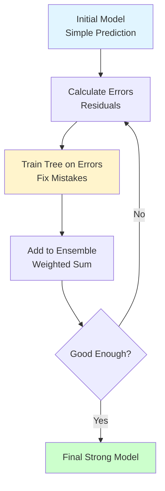

# Gradient Boosting (XGBoost, LightGBM)

**Sequential ensemble that corrects previous mistakes.** Builds trees one at a time, each fixing errors of the previous ensemble. Often achieves state-of-the-art performance on structured data.

**Difficulty:** 🔴 Advanced | **Time:** 5-6 hours | **Prerequisites:** Decision Trees, Ensemble Methods, Gradient Descent, Calculus

---

## Overview

Gradient Boosting builds an additive model by sequentially training weak learners (typically shallow decision trees) to correct the errors of the previous ensemble. Unlike Random Forest (parallel), boosting is sequential - each tree learns from mistakes of all previous trees.

**Use cases:** Kaggle competitions, ranking systems, click prediction, financial modeling, risk assessment

---

## Intuition 💡

### The Big Idea

**"Learn from your mistakes"** - Start with a simple model, identify where it fails, build another model to fix those failures, repeat. Like iteratively improving an essay based on feedback.



### Real-World Analogy

Think of learning to shoot basketball free throws:
- **Attempt 1:** You shoot → miss by 2 feet to the right
- **Correction 1:** Aim 2 feet left → now you're only 6 inches off
- **Correction 2:** Fine-tune by 6 inches → now you're 1 inch off
- **Continue:** Each adjustment fixes previous error
- **Result:** After many corrections, you're very accurate

Gradient Boosting does this with predictions!

### Boosting vs Bagging

```
Random Forest (Bagging):
Tree 1: [Trained on sample 1] ──┐
Tree 2: [Trained on sample 2] ──┤→ Average/Vote → Prediction
Tree 3: [Trained on sample 3] ──┘
(Parallel, independent trees)

Gradient Boosting:
Tree 1: [Trained on data] → Errors₁ →
Tree 2: [Trained on errors₁] → Errors₂ →
Tree 3: [Trained on errors₂] → ... → Prediction
(Sequential, each fixes previous)
```

---

## When to Use ✅ / When to Avoid ❌

### ✅ Good For

| Scenario | Why It Works |
|----------|--------------|
| **Need highest accuracy** | Often wins competitions, SOTA on tabular data |
| **Tabular/structured data** | Excellent for features + labels |
| **Feature interactions** | Automatically captures complex interactions |
| **Mixed data types** | Handles numeric, categorical, missing values |
| **Ranking problems** | Great for learning to rank |
| **Medium-sized datasets** | Best performance on 1K-1M samples |

**Examples:**
- Kaggle competitions (dominates)
- Click-through rate prediction
- Credit scoring
- Fraud detection
- Recommendation systems
- Sales forecasting

### ❌ Not Good For

| Scenario | Why It Fails |
|----------|--------------|
| **Need interpretability** | Black box, hard to explain |
| **Real-time/low-latency** | Slower than linear models |
| **Small datasets** | Risk severe overfitting |
| **Noisy labels** | Can overfit to noise |
| **Linear relationships** | Overcomplicated |
| **Incremental learning** | Must retrain from scratch |

**When to use instead:**
- Interpretability: Decision Trees, Logistic Regression
- Speed: Logistic Regression, Random Forest
- Small data: Logistic Regression, SVM
- Online learning: Online algorithms, Neural Networks

---

## Mathematical Foundation

### Additive Model

Build model as sum of weak learners:

$$F_M(x) = \sum_{m=1}^{M} \gamma_m h_m(x)$$

Where:
- $F_M$ = final model after $M$ iterations
- $h_m$ = weak learner (tree) at iteration $m$
- $\gamma_m$ = learning rate / weight

### Gradient Descent in Function Space

**Loss Function:** $L(y, F(x))$

**Goal:** Minimize loss by updating function

$$F_{m}(x) = F_{m-1}(x) + \gamma_m h_m(x)$$

**Gradient (Residuals):**

$$r_{im} = -\left[\frac{\partial L(y_i, F(x_i))}{\partial F(x_i)}\right]_{F=F_{m-1}}$$

**Algorithm:**
1. Initialize: $F_0(x) = \arg\min_{\gamma} \sum_{i=1}^{n} L(y_i, \gamma)$
2. For $m = 1$ to $M$:
   - Compute pseudo-residuals: $r_{im}$
   - Fit tree $h_m(x)$ to residuals
   - Update: $F_m(x) = F_{m-1}(x) + \nu \cdot h_m(x)$

Where $\nu$ is learning rate (0 < $\nu$ ≤ 1)

### Common Loss Functions

**Binary Classification (Log Loss):**

$$L(y, F) = \log(1 + e^{-2yF}) \quad y \in \{-1, 1\}$$

**Multi-class (Softmax):**

$$L(y, F) = -\sum_{k=1}^{K} y_k \log(p_k)$$

**Regression (MSE):**

$$L(y, F) = \frac{1}{2}(y - F)^2$$

### Regularization

**Learning Rate (Shrinkage):**

$$F_m = F_{m-1} + \nu \cdot h_m, \quad 0 < \nu \leq 1$$

Small $\nu$ requires more trees but generalizes better.

**Tree Constraints:**
- Max depth (usually 3-8)
- Min samples per leaf
- Max features

---

## Implementation

### Using Scikit-learn

=== "Gradient Boosting Classifier"

    ```python
    import numpy as np
    import matplotlib.pyplot as plt
    from sklearn.ensemble import GradientBoostingClassifier
    from sklearn.model_selection import train_test_split, cross_val_score
    from sklearn.metrics import classification_report, confusion_matrix, accuracy_score
    from sklearn.datasets import make_classification

    # Generate data
    X, y = make_classification(
        n_samples=1000,
        n_features=20,
        n_informative=15,
        n_redundant=5,
        random_state=42
    )

    # Split data
    X_train, X_test, y_train, y_test = train_test_split(
        X, y, test_size=0.2, stratify=y, random_state=42
    )

    # Create and train Gradient Boosting
    model = GradientBoostingClassifier(
        n_estimators=100,       # Number of boosting stages
        learning_rate=0.1,      # Shrinkage parameter
        max_depth=3,            # Shallow trees (weak learners)
        min_samples_split=10,
        min_samples_leaf=5,
        subsample=0.8,          # Stochastic GB (< 1.0)
        random_state=42
    )
    model.fit(X_train, y_train)

    # Predictions
    y_pred = model.predict(X_test)
    y_pred_proba = model.predict_proba(X_test)

    # Evaluate
    print("Gradient Boosting Results:")
    print(f"Accuracy: {accuracy_score(y_test, y_pred):.3f}")

    print("\nClassification Report:")
    print(classification_report(y_test, y_pred))

    # Training progress
    train_score = np.zeros((model.n_estimators,), dtype=np.float64)
    for i, y_pred_train in enumerate(model.staged_predict(X_train)):
        train_score[i] = accuracy_score(y_train, y_pred_train)

    test_score = np.zeros((model.n_estimators,), dtype=np.float64)
    for i, y_pred_test in enumerate(model.staged_predict(X_test)):
        test_score[i] = accuracy_score(y_test, y_pred_test)

    # Plot
    plt.figure(figsize=(10, 6))
    plt.plot(train_score, label='Training Accuracy')
    plt.plot(test_score, label='Test Accuracy')
    plt.xlabel('Number of Boosting Iterations')
    plt.ylabel('Accuracy')
    plt.title('Boosting Iterations vs Accuracy')
    plt.legend()
    plt.grid(True)
    plt.show()
    ```

=== "XGBoost"

    ```python
    import xgboost as xgb

    # Create DMatrix (XGBoost's data structure)
    dtrain = xgb.DMatrix(X_train, label=y_train)
    dtest = xgb.DMatrix(X_test, label=y_test)

    # Parameters
    params = {
        'objective': 'binary:logistic',  # Binary classification
        'max_depth': 6,                   # Tree depth
        'learning_rate': 0.1,             # Eta
        'n_estimators': 100,
        'subsample': 0.8,                 # Row sampling
        'colsample_bytree': 0.8,         # Column sampling
        'eval_metric': 'logloss',
        'seed': 42
    }

    # Train with early stopping
    evals = [(dtrain, 'train'), (dtest, 'test')]
    model_xgb = xgb.train(
        params,
        dtrain,
        num_boost_round=100,
        evals=evals,
        early_stopping_rounds=10,
        verbose_eval=20
    )

    # Predictions
    y_pred_xgb = (model_xgb.predict(dtest) > 0.5).astype(int)

    print(f"\nXGBoost Accuracy: {accuracy_score(y_test, y_pred_xgb):.3f}")

    # Feature importance
    xgb.plot_importance(model_xgb, max_num_features=10)
    plt.title('XGBoost Feature Importance')
    plt.tight_layout()
    plt.show()

    # Alternative: sklearn API
    model_xgb_sklearn = xgb.XGBClassifier(
        max_depth=6,
        learning_rate=0.1,
        n_estimators=100,
        subsample=0.8,
        colsample_bytree=0.8,
        random_state=42
    )
    model_xgb_sklearn.fit(
        X_train, y_train,
        eval_set=[(X_test, y_test)],
        early_stopping_rounds=10,
        verbose=False
    )

    print(f"XGBoost (sklearn API) Accuracy: {model_xgb_sklearn.score(X_test, y_test):.3f}")
    ```

=== "LightGBM"

    ```python
    import lightgbm as lgb

    # Create Dataset
    train_data = lgb.Dataset(X_train, label=y_train)
    test_data = lgb.Dataset(X_test, label=y_test, reference=train_data)

    # Parameters
    params = {
        'objective': 'binary',
        'metric': 'binary_logloss',
        'boosting_type': 'gbdt',
        'num_leaves': 31,
        'learning_rate': 0.1,
        'feature_fraction': 0.8,
        'bagging_fraction': 0.8,
        'bagging_freq': 5,
        'verbose': -1,
        'seed': 42
    }

    # Train
    model_lgb = lgb.train(
        params,
        train_data,
        num_boost_round=100,
        valid_sets=[train_data, test_data],
        valid_names=['train', 'valid'],
        callbacks=[
            lgb.early_stopping(stopping_rounds=10),
            lgb.log_evaluation(period=20)
        ]
    )

    # Predictions
    y_pred_lgb = (model_lgb.predict(X_test) > 0.5).astype(int)

    print(f"\nLightGBM Accuracy: {accuracy_score(y_test, y_pred_lgb):.3f}")

    # Feature importance
    lgb.plot_importance(model_lgb, max_num_features=10)
    plt.title('LightGBM Feature Importance')
    plt.tight_layout()
    plt.show()

    # Alternative: sklearn API
    model_lgb_sklearn = lgb.LGBMClassifier(
        num_leaves=31,
        learning_rate=0.1,
        n_estimators=100,
        random_state=42
    )
    model_lgb_sklearn.fit(
        X_train, y_train,
        eval_set=[(X_test, y_test)],
        callbacks=[lgb.early_stopping(stopping_rounds=10)]
    )

    print(f"LightGBM (sklearn API) Accuracy: {model_lgb_sklearn.score(X_test, y_test):.3f}")
    ```

=== "CatBoost"

    ```python
    from catboost import CatBoostClassifier

    # Train model
    model_cat = CatBoostClassifier(
        iterations=100,
        learning_rate=0.1,
        depth=6,
        random_seed=42,
        verbose=20
    )

    model_cat.fit(
        X_train, y_train,
        eval_set=(X_test, y_test),
        early_stopping_rounds=10
    )

    # Predictions
    y_pred_cat = model_cat.predict(X_test)

    print(f"\nCatBoost Accuracy: {accuracy_score(y_test, y_pred_cat):.3f}")

    # Feature importance
    feature_importance = model_cat.get_feature_importance()
    plt.figure(figsize=(10, 6))
    plt.bar(range(len(feature_importance)), feature_importance)
    plt.xlabel('Feature Index')
    plt.ylabel('Importance')
    plt.title('CatBoost Feature Importance')
    plt.show()
    ```

### From Scratch (Simplified)

```python
from sklearn.tree import DecisionTreeRegressor

class GradientBoostingFromScratch:
    """Simplified Gradient Boosting for binary classification"""

    def __init__(self, n_estimators=100, learning_rate=0.1, max_depth=3):
        self.n_estimators = n_estimators
        self.learning_rate = learning_rate
        self.max_depth = max_depth
        self.trees = []
        self.F0 = None  # Initial prediction

    def _sigmoid(self, x):
        """Sigmoid function"""
        return 1 / (1 + np.exp(-np.clip(x, -500, 500)))

    def _log_loss_gradient(self, y, y_pred):
        """Gradient of log loss (negative gradient = residuals)"""
        # For log loss: gradient = p - y where p = sigmoid(F(x))
        p = self._sigmoid(y_pred)
        return y - p

    def fit(self, X, y):
        """Train the model"""
        n_samples = X.shape[0]

        # Initialize with log odds
        pos_ratio = np.mean(y)
        self.F0 = np.log(pos_ratio / (1 - pos_ratio + 1e-10))

        # Current predictions (in log-odds space)
        F = np.full(n_samples, self.F0)

        # Iteratively fit trees
        for i in range(self.n_estimators):
            # Calculate pseudo-residuals (negative gradient)
            residuals = self._log_loss_gradient(y, F)

            # Fit tree to residuals
            tree = DecisionTreeRegressor(
                max_depth=self.max_depth,
                random_state=i
            )
            tree.fit(X, residuals)

            # Update predictions
            update = tree.predict(X)
            F += self.learning_rate * update

            # Store tree
            self.trees.append(tree)

            if (i + 1) % 20 == 0:
                # Calculate accuracy
                y_pred = (self._sigmoid(F) > 0.5).astype(int)
                acc = np.mean(y_pred == y)
                print(f"Iteration {i + 1}: Training Accuracy = {acc:.3f}")

        return self

    def predict_proba(self, X):
        """Predict probabilities"""
        # Start with initial prediction
        F = np.full(X.shape[0], self.F0)

        # Add predictions from all trees
        for tree in self.trees:
            F += self.learning_rate * tree.predict(X)

        # Convert to probabilities
        proba = self._sigmoid(F)
        return np.column_stack([1 - proba, proba])

    def predict(self, X):
        """Predict class labels"""
        proba = self.predict_proba(X)
        return (proba[:, 1] > 0.5).astype(int)

# Usage
model_scratch = GradientBoostingFromScratch(
    n_estimators=100,
    learning_rate=0.1,
    max_depth=3
)
model_scratch.fit(X_train, y_train)

y_pred_scratch = model_scratch.predict(X_test)
print(f"\nAccuracy (from scratch): {accuracy_score(y_test, y_pred_scratch):.3f}")

# Compare with sklearn
print(f"Accuracy (sklearn): {accuracy_score(y_test, y_pred):.3f}")
```

---

## Visualization

### Learning Curves

```python
def plot_learning_curves(model, X_train, y_train, X_test, y_test):
    """Plot training progress"""
    train_scores = []
    test_scores = []

    for i, (train_pred, test_pred) in enumerate(
        zip(model.staged_predict(X_train), model.staged_predict(X_test))
    ):
        train_scores.append(accuracy_score(y_train, train_pred))
        test_scores.append(accuracy_score(y_test, test_pred))

    plt.figure(figsize=(10, 6))
    plt.plot(train_scores, label='Training', alpha=0.8)
    plt.plot(test_scores, label='Test', alpha=0.8)
    plt.xlabel('Number of Boosting Iterations')
    plt.ylabel('Accuracy')
    plt.title('Gradient Boosting: Learning Curves')
    plt.legend()
    plt.grid(True)

    # Mark overfitting point
    best_iteration = np.argmax(test_scores)
    plt.axvline(best_iteration, color='red', linestyle='--',
                label=f'Best iteration: {best_iteration}')
    plt.legend()
    plt.show()

    return best_iteration

best_iter = plot_learning_curves(model, X_train, y_train, X_test, y_test)
print(f"Best iteration: {best_iter}")
```

### Feature Importance Comparison

```python
# Compare feature importance across implementations
fig, axes = plt.subplots(2, 2, figsize=(15, 12))

# Sklearn Gradient Boosting
feature_names = [f'Feature {i}' for i in range(X.shape[1])]
importance_gb = model.feature_importances_
sorted_idx_gb = np.argsort(importance_gb)[::-1][:10]

axes[0, 0].bar(range(10), importance_gb[sorted_idx_gb])
axes[0, 0].set_xticks(range(10))
axes[0, 0].set_xticklabels([feature_names[i] for i in sorted_idx_gb], rotation=45)
axes[0, 0].set_title('Sklearn GradientBoosting')
axes[0, 0].set_ylabel('Importance')

# XGBoost (if available)
if 'model_xgb_sklearn' in locals():
    importance_xgb = model_xgb_sklearn.feature_importances_
    sorted_idx_xgb = np.argsort(importance_xgb)[::-1][:10]

    axes[0, 1].bar(range(10), importance_xgb[sorted_idx_xgb])
    axes[0, 1].set_xticks(range(10))
    axes[0, 1].set_xticklabels([feature_names[i] for i in sorted_idx_xgb], rotation=45)
    axes[0, 1].set_title('XGBoost')
    axes[0, 1].set_ylabel('Importance')

# LightGBM (if available)
if 'model_lgb_sklearn' in locals():
    importance_lgb = model_lgb_sklearn.feature_importances_
    sorted_idx_lgb = np.argsort(importance_lgb)[::-1][:10]

    axes[1, 0].bar(range(10), importance_lgb[sorted_idx_lgb])
    axes[1, 0].set_xticks(range(10))
    axes[1, 0].set_xticklabels([feature_names[i] for i in sorted_idx_lgb], rotation=45)
    axes[1, 0].set_title('LightGBM')
    axes[1, 0].set_ylabel('Importance')

# CatBoost (if available)
if 'model_cat' in locals():
    importance_cat = model_cat.get_feature_importance()
    sorted_idx_cat = np.argsort(importance_cat)[::-1][:10]

    axes[1, 1].bar(range(10), importance_cat[sorted_idx_cat])
    axes[1, 1].set_xticks(range(10))
    axes[1, 1].set_xticklabels([feature_names[i] for i in sorted_idx_cat], rotation=45)
    axes[1, 1].set_title('CatBoost')
    axes[1, 1].set_ylabel('Importance')

plt.tight_layout()
plt.show()
```

### Effect of Learning Rate

```python
fig, axes = plt.subplots(2, 2, figsize=(15, 12))
learning_rates = [0.01, 0.1, 0.5, 1.0]

for ax, lr in zip(axes.ravel(), learning_rates):
    model_lr = GradientBoostingClassifier(
        n_estimators=100,
        learning_rate=lr,
        max_depth=3,
        random_state=42
    )
    model_lr.fit(X_train, y_train)

    # Get learning curves
    train_scores = []
    test_scores = []

    for train_pred, test_pred in zip(
        model_lr.staged_predict(X_train),
        model_lr.staged_predict(X_test)
    ):
        train_scores.append(accuracy_score(y_train, train_pred))
        test_scores.append(accuracy_score(y_test, test_pred))

    ax.plot(train_scores, label='Train', alpha=0.8)
    ax.plot(test_scores, label='Test', alpha=0.8)
    ax.set_xlabel('Iterations')
    ax.set_ylabel('Accuracy')
    ax.set_title(f'Learning Rate = {lr}')
    ax.legend()
    ax.grid(True)

plt.tight_layout()
plt.show()
```

---

## Hyperparameters

### Key Parameters

| Parameter | What It Does | Default | Tips |
|-----------|--------------|---------|------|
| `n_estimators` | Number of boosting stages | 100 | More is better but watch for overfitting |
| `learning_rate` | Shrinkage parameter | 0.1 | Lower = more trees needed but better generalization |
| `max_depth` | Maximum tree depth | 3 | Keep shallow (3-8) for weak learners |
| `min_samples_split` | Min samples to split | 2 | Increase to prevent overfitting |
| `min_samples_leaf` | Min samples in leaf | 1 | Increase for regularization |
| `subsample` | Fraction of samples per tree | 1.0 | < 1.0 for stochastic GB (0.8 common) |
| `max_features` | Features per split | None | 'sqrt' or fraction for regularization |

### XGBoost Specific

| Parameter | What It Does | Default | Tips |
|-----------|--------------|---------|------|
| `eta` | Learning rate | 0.3 | Lower for better generalization |
| `gamma` | Min loss reduction for split | 0 | Increase to prevent overfitting |
| `lambda` | L2 regularization | 1 | Increase for regularization |
| `alpha` | L1 regularization | 0 | Use for feature selection |
| `colsample_bytree` | Column sampling per tree | 1.0 | 0.6-0.9 typical |
| `colsample_bylevel` | Column sampling per level | 1.0 | Additional regularization |

### Tuning Strategy

```python
# Step 1: Fix learning_rate, tune tree params
from sklearn.model_selection import RandomizedSearchCV

param_dist_1 = {
    'n_estimators': [100],  # Fix initially
    'learning_rate': [0.1],
    'max_depth': [3, 5, 7, 9],
    'min_samples_split': [2, 5, 10],
    'min_samples_leaf': [1, 2, 4],
    'subsample': [0.6, 0.8, 1.0]
}

# Step 2: Fix tree params, tune learning_rate and n_estimators
param_dist_2 = {
    'n_estimators': [50, 100, 200, 500],
    'learning_rate': [0.01, 0.05, 0.1, 0.2],
    'max_depth': [5],  # Use best from step 1
    'subsample': [0.8]
}

# For XGBoost
xgb_params = {
    'max_depth': [3, 5, 7],
    'learning_rate': [0.01, 0.1, 0.3],
    'n_estimators': [100, 200, 500],
    'colsample_bytree': [0.6, 0.8, 1.0],
    'subsample': [0.6, 0.8, 1.0],
    'gamma': [0, 0.1, 0.5],
    'reg_alpha': [0, 0.1, 1],
    'reg_lambda': [1, 2, 5]
}
```

---

## Complexity Analysis

**Time Complexity:**
- Training: $O(n \cdot m \cdot d \cdot T)$ where $n$ = trees, $m$ = samples, $d$ = depth, $T$ = features
- Prediction: $O(n \cdot d)$

**Space Complexity:** $O(n \cdot d)$ to store trees

**XGBoost/LightGBM:** More efficient implementations, especially for large datasets

---

## Common Pitfalls

### 1. Overfitting

!!! warning "Most Common Problem with Gradient Boosting"
    **Problem:** Sequential nature → can overfit if too many iterations

    **Solution:** Early stopping, regularization

    ```python
    # Use early stopping
    model = GradientBoostingClassifier(
        n_estimators=1000,  # Large number
        learning_rate=0.1,
        validation_fraction=0.2,  # Hold out for validation
        n_iter_no_change=10,      # Stop if no improvement
        random_state=42
    )

    # For XGBoost
    model_xgb = xgb.XGBClassifier(
        n_estimators=1000,
        learning_rate=0.1,
        early_stopping_rounds=10
    )
    model_xgb.fit(
        X_train, y_train,
        eval_set=[(X_test, y_test)],
        verbose=False
    )
    ```

### 2. Learning Rate Too High

!!! warning "High Learning Rate → Unstable"
    **Problem:** High learning rate → can't find optimal solution

    **Solution:** Lower learning rate, more trees

    ```python
    # Bad: Fast but unstable
    model_bad = GradientBoostingClassifier(
        n_estimators=50,
        learning_rate=1.0  # Too high!
    )

    # Good: Slower but stable
    model_good = GradientBoostingClassifier(
        n_estimators=500,
        learning_rate=0.01  # Low learning rate
    )
    ```

### 3. Trees Too Deep

!!! warning "Deep Trees → Strong Learners → Less Benefit from Boosting"
    **Problem:** Boosting works best with weak learners

    **Solution:** Keep trees shallow (3-8 depth)

    ```python
    # Trees should be shallow
    model = GradientBoostingClassifier(
        max_depth=3,  # Weak learners
        n_estimators=100
    )
    ```

### 4. Not Using Regularization

!!! warning "Easy to Overfit Without Regularization"
    **Solution:** Use subsample, max_features, min_samples_leaf

    ```python
    model = GradientBoostingClassifier(
        n_estimators=100,
        learning_rate=0.1,
        subsample=0.8,        # Stochastic GB
        max_features='sqrt',  # Random features
        min_samples_leaf=5,   # Min leaf size
        max_depth=5
    )
    ```

### 5. Ignoring Feature Engineering

!!! tip "Gradient Boosting Benefits from Good Features"
    While it can handle raw features, feature engineering still helps!

    ```python
    # Create interaction features
    from sklearn.preprocessing import PolynomialFeatures

    poly = PolynomialFeatures(degree=2, interaction_only=True)
    X_poly = poly.fit_transform(X)
    ```

---

## Practice Problems

### 🟢 Beginner

!!! example "Problem 1: Compare with Random Forest"
    Train both and compare.

    **Tasks:**
    1. Train Random Forest and Gradient Boosting
    2. Compare accuracy, training time
    3. Visualize learning curves
    4. Analyze when each is better

!!! example "Problem 2: Learning Rate Experiments"
    Study effect of learning rate.

    **Tasks:**
    1. Try learning rates: 0.01, 0.1, 0.5, 1.0
    2. Plot learning curves for each
    3. Find optimal combination with n_estimators
    4. Analyze trade-offs

### 🟡 Intermediate

!!! example "Problem 3: Early Stopping"
    Implement and tune early stopping.

    **Tasks:**
    1. Train with large n_estimators
    2. Use validation set for early stopping
    3. Plot train/val curves
    4. Find optimal stopping point

!!! example "Problem 4: Compare Implementations"
    Compare sklearn, XGBoost, LightGBM, CatBoost.

    **Tasks:**
    1. Train all four on same data
    2. Compare accuracy, speed, memory
    3. Analyze feature importance differences
    4. When to use each?

### 🔴 Advanced

!!! example "Problem 5: Kaggle Competition"
    Apply to real competition dataset.

    **Tasks:**
    1. Feature engineering pipeline
    2. Hyperparameter optimization (Optuna/Hyperopt)
    3. Cross-validation strategy
    4. Ensemble multiple GB models
    5. Post-processing predictions

!!! example "Problem 6: Custom Loss Function"
    Implement custom loss for business metric.

    **Tasks:**
    1. Define custom loss function (e.g., weighted F1)
    2. Implement gradient and hessian
    3. Train XGBoost with custom objective
    4. Compare with standard loss
    5. Validate business impact

---

## Related Topics

- [Decision Trees](decision-trees.md) - Weak learners in boosting
- [Random Forest](random-forest.md) - Alternative ensemble method
- [Ensemble Methods](../ensemble-methods/index.md) - General theory
- [Hyperparameter Tuning](../../optimization/hyperparameter-tuning.md) - Optimization strategies
- [Feature Engineering](../../preprocessing/feature-engineering.md) - Improve inputs

---

## References

1. **Scikit-learn:** [Gradient Boosting](https://scikit-learn.org/stable/modules/ensemble.html#gradient-boosting)
2. **XGBoost:** [Documentation](https://xgboost.readthedocs.io/)
3. **LightGBM:** [Documentation](https://lightgbm.readthedocs.io/)
4. **CatBoost:** [Documentation](https://catboost.ai/)
5. **Paper:** "Greedy Function Approximation: A Gradient Boosting Machine" by Friedman (2001)
6. **Paper:** "XGBoost: A Scalable Tree Boosting System" by Chen & Guestrin (2016)
7. **Book:** *The Elements of Statistical Learning* Chapter 10

---

**Next Steps:**
- Practice on [Kaggle competitions](https://www.kaggle.com/competitions)
- Learn [SHAP](https://github.com/slundberg/shap) for model interpretation
- Explore [Hyperparameter Optimization](../../optimization/hyperparameter-tuning.md)

**Master state-of-the-art predictions with Gradient Boosting!** 🚀
