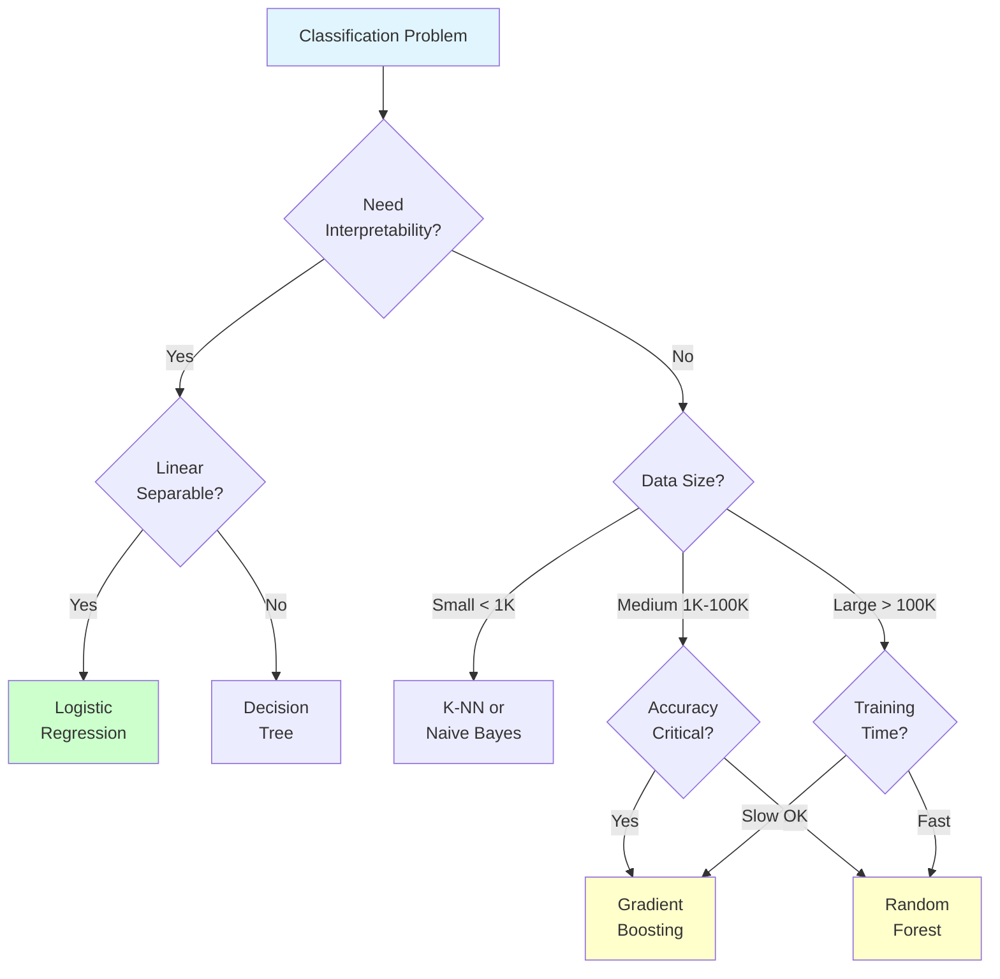

# Classification

**Predict categorical labels.** Master classification algorithms from logistic regression to advanced ensemble methods.

**Difficulty:** 🟢🟡 Beginner to Intermediate | **Time:** 3-4 weeks | **Prerequisites:** [ML Fundamentals](../../fundamentals/index.md)

---

## 🎯 What is Classification?

**Classification** predicts discrete categories or classes based on input features. It's one of the most common ML tasks.

**Examples:**
- Email: Spam or Not Spam
- Image: Cat, Dog, or Bird
- Medical: Disease or Healthy
- Finance: Fraud or Legitimate
- Sentiment: Positive, Negative, Neutral

```mermaid
graph LR
    A[Input Features<br/>X] --> B[Classification<br/>Model]
    B --> C[Category/Class<br/>ŷ ∈ {1,2,...,K}]

    style A fill:#e1f5ff
    style C fill:#ccffcc
```

**Types:**
- **Binary:** Two classes (spam/ham, fraud/legitimate)
- **Multi-class:** Multiple classes (digit 0-9, animal types)
- **Multi-label:** Multiple labels per instance (tags on articles)

---

## 📚 Topics

### 1. Logistic Regression 🟢
**Probabilistic classifier - the foundation of classification**

Despite the name, it's a classification algorithm that predicts class probabilities.

**Key Formula:**
```
P(y=1|x) = σ(β₀ + β₁x₁ + ... + βₙxₙ)
σ(z) = 1 / (1 + e^(-z))  (sigmoid function)
```

**Key Concepts:**
- Sigmoid activation function
- Log loss (binary cross-entropy)
- Decision boundary
- Probability interpretation
- Multi-class with one-vs-rest or softmax

**When to Use:**
- Binary classification
- Need probability estimates
- Baseline classifier
- Interpretability important
- Linearly separable data

**[→ Learn Logistic Regression](logistic-regression.md)**

**Difficulty:** 🟢 | **Time:** 4-5 hours | **Interview:** ⭐⭐⭐⭐⭐

---

### 2. Naive Bayes 🟢
**Fast probabilistic classifier based on Bayes' theorem**

Assumes features are independent (naive assumption) but works surprisingly well.

**Key Formula:**
```
P(y|X) ∝ P(y) × P(x₁|y) × P(x₂|y) × ... × P(xₙ|y)
```

**Key Concepts:**
- Bayes' theorem
- Conditional independence assumption
- Variants: Gaussian, Multinomial, Bernoulli
- Fast training and prediction
- Works well with small data

**When to Use:**
- Text classification (spam, sentiment)
- Real-time prediction needed
- High-dimensional data
- Small training sets
- Need fast training

**[→ Learn Naive Bayes](naive-bayes.md)**

**Difficulty:** 🟢 | **Time:** 3-4 hours | **Interview:** ⭐⭐⭐

---

### 3. Decision Trees 🟢
**Tree-based classifier using if-else rules**

Build a tree of decisions based on feature values - highly interpretable.

**Key Formula:**
```
Gini Impurity: G = 1 - Σpᵢ²
Entropy: H = -Σpᵢ log₂(pᵢ)
Information Gain: IG = H(parent) - Weighted H(children)
```

**Key Concepts:**
- Recursive partitioning
- Splitting criteria (Gini, Entropy)
- Pruning (pre-pruning, post-pruning)
- Feature importance
- Handles non-linear relationships
- No feature scaling needed

**When to Use:**
- Need interpretability
- Mixed data types (categorical + numerical)
- Non-linear relationships
- Feature interactions important
- Quick baseline

**[→ Learn Decision Trees](decision-trees.md)**

**Difficulty:** 🟢 | **Time:** 4-5 hours | **Interview:** ⭐⭐⭐⭐

---

### 4. K-Nearest Neighbors (KNN) 🟢
**Instance-based learning - predict based on nearest neighbors**

No training phase - stores data and finds K nearest neighbors at prediction time.

**Key Formula:**
```
Distance: d(x, x') = √Σ(xᵢ - x'ᵢ)²  (Euclidean)
Prediction: Majority vote of K nearest neighbors
```

**Key Concepts:**
- Distance metrics (Euclidean, Manhattan, Minkowski)
- Choosing K (small K → overfitting, large K → underfitting)
- Lazy learning (no training)
- Curse of dimensionality
- Feature scaling critical

**When to Use:**
- Small to medium datasets
- Simple baseline
- Non-linear decision boundaries
- Multi-class problems
- Non-parametric approach

**[→ Learn K-Nearest Neighbors](knn.md)**

**Difficulty:** 🟢 | **Time:** 3-4 hours | **Interview:** ⭐⭐⭐

---

### 5. Support Vector Machines (SVM) 🟡
**Find optimal hyperplane with maximum margin**

Powerful algorithm that finds the decision boundary with the largest margin.

**Key Formula:**
```
Maximize margin: min 1/2||w||² + C Σξᵢ
Decision: f(x) = sign(w·x + b)
Kernel trick: K(x, x') = φ(x)·φ(x')
```

**Key Concepts:**
- Maximum margin classifier
- Support vectors (critical points on margin)
- Kernel trick (linear, RBF, polynomial, sigmoid)
- Soft margin (C parameter)
- Handles non-linear with kernels
- Works well in high dimensions

**When to Use:**
- High-dimensional data (text, images)
- Clear margin of separation
- More features than samples
- Non-linear with kernel trick
- Binary classification (but can extend)

**[→ Learn Support Vector Machines](svm.md)**

**Difficulty:** 🟡 | **Time:** 5-6 hours | **Interview:** ⭐⭐⭐⭐

---

### 6. Random Forest 🟡
**Ensemble of decision trees - robust and accurate**

Build multiple decision trees and aggregate their predictions (bagging).

**Key Concepts:**
- Bagging (Bootstrap Aggregating)
- Random feature selection at each split
- Voting for classification
- Out-of-bag (OOB) error estimation
- Feature importance
- Less prone to overfitting than single tree
- Handles large datasets

**When to Use:**
- Need robust predictions
- Feature importance analysis
- Large datasets
- Prevent overfitting
- Production systems
- Don't need interpretability

**[→ Learn Random Forest](random-forest.md)**

**Difficulty:** 🟡 | **Time:** 4-5 hours | **Interview:** ⭐⭐⭐⭐⭐

---

### 7. Gradient Boosting 🟡
**Sequential ensemble - state-of-the-art for tabular data**

Build trees sequentially, each correcting errors of previous trees.

**Key Concepts:**
- Boosting (sequential learning)
- Gradient descent in function space
- Learning rate (shrinkage)
- XGBoost, LightGBM, CatBoost implementations
- Regularization parameters
- Feature importance
- Handles missing values

**When to Use:**
- Kaggle competitions (often wins!)
- Structured/tabular data
- Need highest accuracy
- Have time for careful tuning
- Production systems

**[→ Learn Gradient Boosting](gradient-boosting.md)**

**Difficulty:** 🟡 | **Time:** 5-6 hours | **Interview:** ⭐⭐⭐⭐⭐

---

## 📊 Algorithm Comparison

### Quick Reference Table

| Algorithm | Speed | Accuracy | Interpretability | Hyperparameters | Scaling Needed |
|-----------|-------|----------|------------------|-----------------|----------------|
| **Logistic Regression** | ⚡⚡⚡ | ⭐⭐ | ⭐⭐⭐ | Few | Yes |
| **Naive Bayes** | ⚡⚡⚡ | ⭐⭐ | ⭐⭐ | None | No |
| **Decision Trees** | ⚡⚡ | ⭐⭐ | ⭐⭐⭐ | Medium | No |
| **K-NN** | ⚡ | ⭐⭐ | ⭐ | Few (K) | Yes |
| **SVM** | ⚡⚡ | ⭐⭐⭐ | ⭐ | Many | Yes |
| **Random Forest** | ⚡⚡ | ⭐⭐⭐⭐ | ⭐⭐ | Medium | No |
| **Gradient Boosting** | ⚡ | ⭐⭐⭐⭐⭐ | ⭐ | Many | No |

### Detailed Pros and Cons

#### Logistic Regression
**Pros:** ✅ Fast, interpretable, probability estimates, works well with few features
**Cons:** ❌ Assumes linearity, sensitive to outliers, needs feature engineering
**Best for:** Baseline, binary classification, need probabilities

#### Naive Bayes
**Pros:** ✅ Very fast, works with small data, handles high dimensions, simple
**Cons:** ❌ Independence assumption rarely true, not best accuracy
**Best for:** Text classification, real-time, baseline

#### Decision Trees
**Pros:** ✅ Highly interpretable, handles non-linear, no scaling needed, visualizable
**Cons:** ❌ Easily overfits, unstable (small data changes), not best accuracy
**Best for:** Interpretability, mixed data types, quick analysis

#### K-NN
**Pros:** ✅ Simple, no training, non-linear, multi-class friendly
**Cons:** ❌ Slow prediction, memory intensive, curse of dimensionality, needs scaling
**Best for:** Small datasets, simple baseline, local patterns

#### SVM
**Pros:** ✅ Effective in high dimensions, memory efficient, versatile kernels
**Cons:** ❌ Slow on large datasets, many hyperparameters, needs scaling
**Best for:** Text classification, high-dimensional, clear margin

#### Random Forest
**Pros:** ✅ High accuracy, robust, feature importance, handles overfitting
**Cons:** ❌ Less interpretable, slower than single tree, memory intensive
**Best for:** Production, robust predictions, feature analysis

#### Gradient Boosting
**Pros:** ✅ Best accuracy, handles complex patterns, feature importance, robust
**Cons:** ❌ Slow training, many hyperparameters, can overfit, needs tuning
**Best for:** Competitions, maximum accuracy, tabular data

---

## 🎯 Algorithm Selection Guide



### Decision Matrix

| Scenario | Recommended Algorithm |
|----------|----------------------|
| **Need interpretability** | Logistic Regression, Decision Tree |
| **High-dimensional (text, images)** | SVM, Naive Bayes |
| **Small dataset (< 1K)** | K-NN, Naive Bayes |
| **Large dataset (> 100K)** | Random Forest, XGBoost |
| **Maximum accuracy** | XGBoost, LightGBM |
| **Fast prediction** | Logistic Regression, Naive Bayes |
| **Non-linear boundaries** | SVM (RBF), Random Forest, XGBoost |
| **Production system** | Random Forest, XGBoost |
| **Quick baseline** | Logistic Regression, Decision Tree |

---

## 📈 Evaluation Metrics

### Key Metrics for Classification

#### 1. Accuracy
```
Accuracy = (TP + TN) / (TP + TN + FP + FN)
```
- Simple to understand
- ⚠️ Misleading with imbalanced data!

#### 2. Precision
```
Precision = TP / (TP + FP)
```
- Of predicted positives, how many are correct?
- Important when false positives are costly

#### 3. Recall (Sensitivity)
```
Recall = TP / (TP + FN)
```
- Of actual positives, how many did we find?
- Important when false negatives are costly

#### 4. F1-Score
```
F1 = 2 × (Precision × Recall) / (Precision + Recall)
```
- Harmonic mean of precision and recall
- Good for imbalanced data

#### 5. ROC-AUC
- ROC curve: True Positive Rate vs False Positive Rate
- AUC: Area Under Curve (0.5 = random, 1.0 = perfect)
- Good for comparing models

**Which to Use?**
- **Accuracy:** Balanced datasets
- **Precision:** Minimize false positives (spam, ads)
- **Recall:** Minimize false negatives (disease, fraud)
- **F1:** Imbalanced data
- **ROC-AUC:** Compare models, threshold selection

**[→ Learn More: Classification Metrics](../../evaluation/classification-metrics.md)**

---

## 🛠️ Practical Implementation

### Complete Pipeline

```python
from sklearn.model_selection import train_test_split, cross_val_score
from sklearn.preprocessing import StandardScaler
from sklearn.linear_model import LogisticRegression
from sklearn.tree import DecisionTreeClassifier
from sklearn.ensemble import RandomForestClassifier, GradientBoostingClassifier
from sklearn.svm import SVC
from sklearn.neighbors import KNeighborsClassifier
from sklearn.naive_bayes import GaussianNB
from sklearn.metrics import accuracy_score, classification_report, confusion_matrix

# 1. Split data
X_train, X_test, y_train, y_test = train_test_split(
    X, y, test_size=0.2, random_state=42, stratify=y
)

# 2. Scale features (for some algorithms)
scaler = StandardScaler()
X_train_scaled = scaler.fit_transform(X_train)
X_test_scaled = scaler.transform(X_test)

# 3. Train multiple models
models = {
    'Logistic Regression': LogisticRegression(),
    'Naive Bayes': GaussianNB(),
    'Decision Tree': DecisionTreeClassifier(),
    'K-NN': KNeighborsClassifier(),
    'SVM': SVC(probability=True),
    'Random Forest': RandomForestClassifier(),
    'XGBoost': GradientBoostingClassifier()
}

# 4. Compare models
for name, model in models.items():
    # Use scaled data for LR, KNN, SVM
    if name in ['Logistic Regression', 'K-NN', 'SVM']:
        model.fit(X_train_scaled, y_train)
        y_pred = model.predict(X_test_scaled)
    else:
        model.fit(X_train, y_train)
        y_pred = model.predict(X_test)

    accuracy = accuracy_score(y_test, y_pred)
    print(f"{name}: {accuracy:.3f}")

# 5. Detailed evaluation of best model
best_model = RandomForestClassifier(n_estimators=100, random_state=42)
best_model.fit(X_train, y_train)
y_pred = best_model.predict(X_test)

print("\nClassification Report:")
print(classification_report(y_test, y_pred))
print("\nConfusion Matrix:")
print(confusion_matrix(y_test, y_pred))

# 6. Cross-validation
scores = cross_val_score(best_model, X, y, cv=5)
print(f"\nCross-validation scores: {scores}")
print(f"Mean CV score: {scores.mean():.3f} (+/- {scores.std():.3f})")
```

---

## 📚 Hands-On Projects

### Beginner Projects
1. **Iris Classification** 🟢
   - Multi-class (3 species)
   - Try all basic algorithms
   - Compare performance
   - Visualize decision boundaries

2. **Email Spam Detection** 🟢
   - Binary classification
   - Text preprocessing
   - Naive Bayes, Logistic Regression
   - Evaluate with precision/recall

### Intermediate Projects
3. **Titanic Survival Prediction** 🟡
   - Feature engineering
   - Handle missing values
   - Try ensemble methods
   - Kaggle submission

4. **Credit Card Fraud Detection** 🟡
   - Imbalanced data handling
   - SMOTE, undersampling
   - Precision-recall tradeoff
   - Cost-sensitive learning

### Advanced Projects
5. **Multi-class Image Classification** 🔴
   - CIFAR-10 or Fashion-MNIST
   - Feature extraction
   - Ensemble methods
   - Model stacking

6. **Customer Churn Prediction** 🔴
   - Business problem
   - Feature engineering
   - Model interpretation
   - Cost-benefit analysis

---

## 🎓 Learning Path

### Week 1: Basics (🟢)
**Day 1-2:** Logistic Regression
- Theory, sigmoid function
- Implementation
- Project: Binary classification

**Day 3:** Naive Bayes
- Bayes theorem
- Text classification
- Project: Spam detector

**Day 4-5:** Decision Trees
- Splitting criteria
- Pruning
- Project: Iris classification

**Day 6-7:** K-NN
- Distance metrics
- K selection
- Project: Digit recognition

### Week 2: Intermediate (🟡)
**Day 1-3:** SVM
- Maximum margin
- Kernel trick
- Project: Text classification

**Day 4-5:** Random Forest
- Bagging
- Feature importance
- Project: Tabular data

**Day 6-7:** Review and practice
- Compare all algorithms
- Kaggle competition

### Week 3: Advanced (🟡)
**Day 1-4:** Gradient Boosting
- XGBoost, LightGBM
- Hyperparameter tuning
- Project: Kaggle competition

**Day 5-7:** Real-world project
- End-to-end pipeline
- Model deployment
- Monitoring

---

## ⚠️ Common Pitfalls

!!! danger "Critical Mistakes"
    1. **Using accuracy on imbalanced data** - Use F1, precision, recall
    2. **Not scaling features** - Critical for SVM, K-NN, Logistic Regression
    3. **Data leakage** - Always split before preprocessing
    4. **Overfitting** - Use cross-validation
    5. **Wrong metrics** - Choose based on business problem
    6. **Not handling imbalanced data** - Use SMOTE, class weights
    7. **Testing on training data** - Always use separate test set

---

## 📖 Additional Resources

### Books
- *An Introduction to Statistical Learning* - Chapters 4, 8, 9
- *Hands-On Machine Learning* - Chapters 3, 4, 7
- *Pattern Recognition and Machine Learning* - Chapters 4, 7

### Online Courses
- Andrew Ng's ML Course - Weeks 2-6
- Fast.ai - Lessons 1-4
- StatQuest (YouTube) - Classification playlist

### Practice
- Kaggle Learn - Intermediate ML
- Kaggle Competitions: Titanic, Digit Recognizer
- UCI ML Repository - Classification datasets

---

## 🚀 Next Steps

**After mastering classification:**

1. **Explore Ensemble Methods:**
   - [Bagging](../ensemble-methods/bagging.md)
   - [Boosting](../ensemble-methods/boosting.md)
   - [Stacking](../ensemble-methods/stacking.md)

2. **Improve Your Skills:**
   - [Feature Engineering](../../feature-engineering/index.md)
   - [Handling Imbalanced Data](../../feature-engineering/imbalanced-data.md)
   - [Model Evaluation](../../evaluation/index.md)

3. **Advanced Topics:**
   - [Deep Learning](../../deep-learning/index.md)
   - [Neural Networks](../../deep-learning/neural-networks-basics.md)

---

**Ready to master classification?** Start with [Logistic Regression](logistic-regression.md)! 🚀
