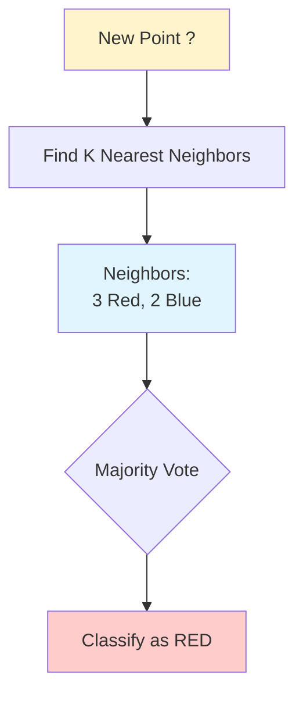

# K-Nearest Neighbors (KNN)

**Classify based on K nearest training examples.** Non-parametric, instance-based learning that makes predictions by finding the K most similar examples in the training data. Simple yet powerful for many problems.

**Difficulty:** 🟢 Beginner | **Time:** 2-3 hours | **Prerequisites:** Distance Metrics, Basic Statistics

---

## Overview

K-Nearest Neighbors (KNN) is a lazy learning algorithm that stores all training data and makes predictions by voting among the K nearest neighbors. It's intuitive, requires no training phase, and works well for both classification and regression.

**Use cases:** Recommendation systems, pattern recognition, anomaly detection, image classification, handwriting recognition

---

## Intuition 💡

### The Big Idea

"You are the average of the five people you spend the most time with." KNN applies this to data: to classify a new point, look at its K nearest neighbors and take a majority vote.



### Real-World Analogy

Think of movie recommendations:
- **You:** Like movies A, B, C
- **Process:** Find users with similar taste (nearest neighbors)
- **Recommendation:** See what movies they liked that you haven't seen
- **Prediction:** If 4 out of 5 similar users loved movie X, you'll probably like it too!

### How It Works Visually

```
Training Data:
  ● ● ●  Red class
       ○ ○  Blue class

New Point: ?

Find 5 nearest:
  ● ● ●  3 Red
  ○ ○    2 Blue

Vote: Red wins (3 vs 2)
Prediction: Red class
```

---

## When to Use ✅ / When to Avoid ❌

### ✅ Good For

| Scenario | Why It Works |
|----------|--------------|
| **Small to medium datasets** | Stores all training data in memory |
| **Low dimensions (< 20)** | Distance meaningful in low dimensions |
| **Non-linear boundaries** | Can capture complex decision boundaries |
| **No training time** | Immediate deployment, online learning |
| **Multi-class naturally** | Extends easily to many classes |
| **Noisy data** | Robust due to averaging |

**Examples:**
- Handwriting recognition (MNIST)
- Recommendation systems
- Anomaly detection
- Medical diagnosis
- Image classification

### ❌ Not Good For

| Scenario | Why It Fails |
|----------|--------------|
| **Large datasets** | Slow prediction (must search all points) |
| **High dimensions (> 50)** | Curse of dimensionality |
| **Imbalanced classes** | Majority class dominates |
| **Different feature scales** | Must scale features first |
| **Need fast predictions** | Prediction is slow (O(n)) |
| **Memory constraints** | Stores entire dataset |

**When to use instead:**
- Large datasets: Logistic Regression, SVM, Neural Networks
- High dimensions: Dimensionality reduction (PCA) first, or use Random Forest
- Fast predictions: Decision Trees, Logistic Regression

---

## Mathematical Foundation

### Distance Metrics

**1. Euclidean Distance** (default, L2 norm)

$$d(x, y) = \sqrt{\sum_{i=1}^{n}(x_i - y_i)^2}$$

Most common, assumes all dimensions equally important.

**2. Manhattan Distance** (L1 norm, City Block)

$$d(x, y) = \sum_{i=1}^{n}|x_i - y_i|$$

Good for high-dimensional data, grid-like movement.

**3. Minkowski Distance** (generalization)

$$d(x, y) = \left(\sum_{i=1}^{n}|x_i - y_i|^p\right)^{1/p}$$

Where:
- $p = 1$ → Manhattan
- $p = 2$ → Euclidean
- $p = \infty$ → Chebyshev

**4. Cosine Similarity** (for text, angles)

$$\text{similarity}(x, y) = \frac{x \cdot y}{||x|| \cdot ||y||}$$

Measures angle, not magnitude. Good for sparse high-dimensional data.

### Classification Rule

**Uniform Weights:**

$$\hat{y} = \text{mode}(y_1, y_2, ..., y_K)$$

All neighbors vote equally.

**Distance Weights:**

$$\hat{y} = \arg\max_c \sum_{i=1}^{K} w_i \cdot \mathbb{1}(y_i = c)$$

Where $w_i = \frac{1}{d_i}$ (closer neighbors have more influence).

### Curse of Dimensionality

As dimensions increase:
- All points become equidistant
- "Nearest" neighbors aren't actually close
- Volume of hypersphere vanishes

**Example:** In 100 dimensions, distance between closest and farthest point differs by < 1%!

---

## Implementation

### Using Scikit-learn

=== "Basic KNN"

    ```python
    import numpy as np
    import matplotlib.pyplot as plt
    from sklearn.neighbors import KNeighborsClassifier
    from sklearn.model_selection import train_test_split, cross_val_score
    from sklearn.metrics import classification_report, confusion_matrix, accuracy_score
    from sklearn.datasets import make_classification
    from sklearn.preprocessing import StandardScaler

    # Generate data
    X, y = make_classification(
        n_samples=1000,
        n_features=20,
        n_informative=15,
        n_redundant=5,
        n_classes=3,
        random_state=42
    )

    # Split data
    X_train, X_test, y_train, y_test = train_test_split(
        X, y, test_size=0.2, stratify=y, random_state=42
    )

    # IMPORTANT: Scale features!
    scaler = StandardScaler()
    X_train_scaled = scaler.fit_transform(X_train)
    X_test_scaled = scaler.transform(X_test)

    # Create and train model
    model = KNeighborsClassifier(
        n_neighbors=5,        # K value
        weights='uniform',    # or 'distance'
        metric='euclidean',   # distance metric
        algorithm='auto'      # 'ball_tree', 'kd_tree', or 'brute'
    )
    model.fit(X_train_scaled, y_train)

    # Predictions
    y_pred = model.predict(X_test_scaled)
    y_pred_proba = model.predict_proba(X_test_scaled)

    # Evaluate
    print("KNN Results:")
    print(f"Accuracy: {accuracy_score(y_test, y_pred):.3f}")
    print("\nClassification Report:")
    print(classification_report(y_test, y_pred))

    # Confusion Matrix
    cm = confusion_matrix(y_test, y_pred)
    print("\nConfusion Matrix:")
    print(cm)
    ```

=== "Finding Optimal K"

    ```python
    # Try different K values
    k_range = range(1, 31)
    train_scores = []
    test_scores = []

    for k in k_range:
        knn = KNeighborsClassifier(n_neighbors=k)
        knn.fit(X_train_scaled, y_train)

        train_scores.append(knn.score(X_train_scaled, y_train))
        test_scores.append(knn.score(X_test_scaled, y_test))

    # Plot
    plt.figure(figsize=(10, 6))
    plt.plot(k_range, train_scores, label='Training Accuracy', marker='o')
    plt.plot(k_range, test_scores, label='Test Accuracy', marker='s')
    plt.xlabel('K (Number of Neighbors)')
    plt.ylabel('Accuracy')
    plt.title('Training vs Test Accuracy by K')
    plt.legend()
    plt.grid(True)
    plt.show()

    # Optimal K
    optimal_k = k_range[np.argmax(test_scores)]
    print(f"Optimal K: {optimal_k}")
    print(f"Best Test Accuracy: {max(test_scores):.3f}")
    ```

=== "Distance Metrics Comparison"

    ```python
    # Compare different distance metrics
    metrics = ['euclidean', 'manhattan', 'minkowski', 'chebyshev']

    for metric in metrics:
        knn = KNeighborsClassifier(n_neighbors=5, metric=metric)
        scores = cross_val_score(knn, X_train_scaled, y_train, cv=5)

        print(f"{metric.capitalize()}:")
        print(f"  Mean CV Accuracy: {scores.mean():.3f} (+/- {scores.std() * 2:.3f})")
    ```

=== "Weighted vs Uniform"

    ```python
    # Compare uniform vs distance weighting
    for weight in ['uniform', 'distance']:
        knn = KNeighborsClassifier(n_neighbors=5, weights=weight)
        knn.fit(X_train_scaled, y_train)

        train_acc = knn.score(X_train_scaled, y_train)
        test_acc = knn.score(X_test_scaled, y_test)

        print(f"\nWeights: {weight}")
        print(f"  Training Accuracy: {train_acc:.3f}")
        print(f"  Test Accuracy: {test_acc:.3f}")
    ```

### From Scratch

```python
class KNNClassifierFromScratch:
    """K-Nearest Neighbors from scratch"""

    def __init__(self, n_neighbors=5, weights='uniform', metric='euclidean'):
        self.n_neighbors = n_neighbors
        self.weights = weights
        self.metric = metric
        self.X_train = None
        self.y_train = None

    def fit(self, X, y):
        """Store training data (lazy learning)"""
        self.X_train = X
        self.y_train = y
        return self

    def _euclidean_distance(self, x1, x2):
        """Calculate Euclidean distance"""
        return np.sqrt(np.sum((x1 - x2) ** 2))

    def _manhattan_distance(self, x1, x2):
        """Calculate Manhattan distance"""
        return np.sum(np.abs(x1 - x2))

    def _calculate_distance(self, x1, x2):
        """Calculate distance based on metric"""
        if self.metric == 'euclidean':
            return self._euclidean_distance(x1, x2)
        elif self.metric == 'manhattan':
            return self._manhattan_distance(x1, x2)
        else:
            raise ValueError(f"Unknown metric: {self.metric}")

    def _predict_single(self, x):
        """Predict single sample"""
        # Calculate distances to all training points
        distances = [self._calculate_distance(x, x_train) for x_train in self.X_train]

        # Get K nearest neighbors
        k_indices = np.argsort(distances)[:self.n_neighbors]
        k_nearest_labels = self.y_train[k_indices]
        k_nearest_distances = np.array(distances)[k_indices]

        # Vote
        if self.weights == 'uniform':
            # Simple majority vote
            prediction = np.argmax(np.bincount(k_nearest_labels))
        else:  # distance weighting
            # Weighted vote (inverse distance)
            weights = 1 / (k_nearest_distances + 1e-5)  # Avoid division by zero

            # Count weighted votes for each class
            classes = np.unique(self.y_train)
            weighted_votes = np.zeros(len(classes))

            for i, c in enumerate(classes):
                mask = k_nearest_labels == c
                weighted_votes[i] = np.sum(weights[mask])

            prediction = classes[np.argmax(weighted_votes)]

        return prediction

    def predict(self, X):
        """Predict class labels"""
        predictions = [self._predict_single(x) for x in X]
        return np.array(predictions)

    def predict_proba(self, X):
        """Predict class probabilities"""
        probas = []

        for x in X:
            # Calculate distances
            distances = [self._calculate_distance(x, x_train) for x_train in self.X_train]

            # Get K nearest
            k_indices = np.argsort(distances)[:self.n_neighbors]
            k_nearest_labels = self.y_train[k_indices]

            # Calculate probabilities
            classes = np.unique(self.y_train)
            class_probs = np.zeros(len(classes))

            for i, c in enumerate(classes):
                class_probs[i] = np.sum(k_nearest_labels == c) / self.n_neighbors

            probas.append(class_probs)

        return np.array(probas)

# Usage
model_scratch = KNNClassifierFromScratch(
    n_neighbors=5,
    weights='uniform',
    metric='euclidean'
)
model_scratch.fit(X_train_scaled, y_train)

y_pred_scratch = model_scratch.predict(X_test_scaled)
print(f"\nAccuracy (from scratch): {accuracy_score(y_test, y_pred_scratch):.3f}")

# Compare with sklearn
print(f"Accuracy (sklearn): {accuracy_score(y_test, y_pred):.3f}")
```

---

## Visualization

### Decision Boundary (2D)

```python
def plot_knn_boundary(X, y, k, title="KNN Decision Boundary"):
    """Visualize KNN decision boundary"""
    # Scale data
    scaler = StandardScaler()
    X_scaled = scaler.fit_transform(X)

    # Train model
    model = KNeighborsClassifier(n_neighbors=k)
    model.fit(X_scaled, y)

    # Create mesh
    h = 0.02
    x_min, x_max = X_scaled[:, 0].min() - 1, X_scaled[:, 0].max() + 1
    y_min, y_max = X_scaled[:, 1].min() - 1, X_scaled[:, 1].max() + 1

    xx, yy = np.meshgrid(
        np.arange(x_min, x_max, h),
        np.arange(y_min, y_max, h)
    )

    Z = model.predict(np.c_[xx.ravel(), yy.ravel()])
    Z = Z.reshape(xx.shape)

    # Plot
    plt.figure(figsize=(10, 6))
    plt.contourf(xx, yy, Z, alpha=0.4, cmap='viridis')
    plt.scatter(X_scaled[:, 0], X_scaled[:, 1], c=y, edgecolors='black', cmap='viridis')
    plt.xlabel('Feature 1 (scaled)')
    plt.ylabel('Feature 2 (scaled)')
    plt.title(f'{title} (K={k})')
    plt.colorbar()
    plt.show()

# Example
X_2d, y_2d = make_classification(
    n_samples=200,
    n_features=2,
    n_redundant=0,
    n_informative=2,
    n_clusters_per_class=1,
    random_state=42
)

plot_knn_boundary(X_2d, y_2d, k=5)
```

### Compare Different K Values

```python
fig, axes = plt.subplots(2, 3, figsize=(18, 12))
k_values = [1, 3, 5, 10, 20, 50]

scaler = StandardScaler()
X_2d_scaled = scaler.fit_transform(X_2d)

for ax, k in zip(axes.ravel(), k_values):
    model_k = KNeighborsClassifier(n_neighbors=k)
    model_k.fit(X_2d_scaled, y_2d)

    # Create mesh
    h = 0.02
    x_min, x_max = X_2d_scaled[:, 0].min() - 1, X_2d_scaled[:, 0].max() + 1
    y_min, y_max = X_2d_scaled[:, 1].min() - 1, X_2d_scaled[:, 1].max() + 1
    xx, yy = np.meshgrid(np.arange(x_min, x_max, h), np.arange(y_min, y_max, h))

    Z = model_k.predict(np.c_[xx.ravel(), yy.ravel()])
    Z = Z.reshape(xx.shape)

    ax.contourf(xx, yy, Z, alpha=0.4, cmap='viridis')
    ax.scatter(X_2d_scaled[:, 0], X_2d_scaled[:, 1], c=y_2d, edgecolors='black', cmap='viridis')
    ax.set_title(f'K = {k}')
    ax.set_xlabel('Feature 1')
    ax.set_ylabel('Feature 2')

plt.tight_layout()
plt.show()
```

### Effect of Feature Scaling

```python
fig, axes = plt.subplots(1, 2, figsize=(16, 6))

# Without scaling
model_unscaled = KNeighborsClassifier(n_neighbors=5)
model_unscaled.fit(X_2d, y_2d)

# With scaling
model_scaled = KNeighborsClassifier(n_neighbors=5)
model_scaled.fit(X_2d_scaled, y_2d)

# Plot both
for ax, model, X_plot, title in zip(
    axes,
    [model_unscaled, model_scaled],
    [X_2d, X_2d_scaled],
    ['Without Scaling', 'With Scaling']
):
    h = 0.02
    x_min, x_max = X_plot[:, 0].min() - 1, X_plot[:, 0].max() + 1
    y_min, y_max = X_plot[:, 1].min() - 1, X_plot[:, 1].max() + 1
    xx, yy = np.meshgrid(np.arange(x_min, x_max, h), np.arange(y_min, y_max, h))

    Z = model.predict(np.c_[xx.ravel(), yy.ravel()])
    Z = Z.reshape(xx.shape)

    ax.contourf(xx, yy, Z, alpha=0.4, cmap='viridis')
    ax.scatter(X_plot[:, 0], X_plot[:, 1], c=y_2d, edgecolors='black', cmap='viridis')
    ax.set_title(title)
    ax.set_xlabel('Feature 1')
    ax.set_ylabel('Feature 2')

plt.tight_layout()
plt.show()
```

---

## Hyperparameters

### Key Parameters

| Parameter | What It Does | Default | Tips |
|-----------|--------------|---------|------|
| `n_neighbors` (K) | Number of neighbors to consider | 5 | Odd number for binary, tune with CV |
| `weights` | Vote weighting | 'uniform' | 'distance' for weighted voting |
| `metric` | Distance calculation | 'minkowski' | 'euclidean', 'manhattan', 'cosine' |
| `algorithm` | Algorithm to compute neighbors | 'auto' | 'ball_tree', 'kd_tree', 'brute' |
| `leaf_size` | Leaf size for tree algorithms | 30 | Trade-off: memory vs speed |
| `p` | Power parameter for Minkowski | 2 | 1=Manhattan, 2=Euclidean |

### Choosing K

```python
# Rules of thumb for K:
# - Start with sqrt(n) where n = training samples
# - Use odd K for binary classification (avoid ties)
# - Small K: Low bias, high variance (overfitting)
# - Large K: High bias, low variance (underfitting)

n_samples = len(X_train)
k_start = int(np.sqrt(n_samples))

print(f"Training samples: {n_samples}")
print(f"Suggested starting K: {k_start}")

# Make it odd for binary classification
if k_start % 2 == 0:
    k_start += 1

print(f"Adjusted K (odd): {k_start}")
```

### Algorithm Selection

```python
# Compare algorithms
from time import time

algorithms = ['brute', 'ball_tree', 'kd_tree']

for algo in algorithms:
    start = time()
    knn = KNeighborsClassifier(n_neighbors=5, algorithm=algo)
    knn.fit(X_train_scaled, y_train)
    y_pred = knn.predict(X_test_scaled)
    duration = time() - start

    acc = accuracy_score(y_test, y_pred)
    print(f"{algo:10s}: Accuracy={acc:.3f}, Time={duration:.3f}s")
```

---

## Complexity Analysis

**Time Complexity:**
- Training: $O(1)$ (just stores data)
- Prediction: $O(n \cdot d)$ per sample (brute force)
  - With KD-tree: $O(d \cdot \log n)$ (only works well in low dimensions)
- Total prediction for $m$ samples: $O(m \cdot n \cdot d)$

**Space Complexity:** $O(n \cdot d)$ (stores all training data)

**Key Bottleneck:** Prediction is slow! Must compute distance to all training points.

---

## Common Pitfalls

### 1. Not Scaling Features

!!! warning "Most Critical Mistake with KNN!"
    **Problem:** Features with large ranges dominate distance calculation.

    **Example:**
    ```
    Feature 1 (Age): 20-80 (range = 60)
    Feature 2 (Income): 20,000-200,000 (range = 180,000)

    Distance dominated by income! Age essentially ignored.
    ```

    **Solution:** ALWAYS scale features

    ```python
    from sklearn.preprocessing import StandardScaler

    scaler = StandardScaler()
    X_train_scaled = scaler.fit_transform(X_train)
    X_test_scaled = scaler.transform(X_test)

    # Now all features have mean=0, std=1
    ```

### 2. Choosing Wrong K

!!! warning "K Too Small or Too Large"
    **K=1:** Noisy, overfits, sensitive to outliers

    **K=N:** Always predicts majority class, underfits

    **Solution:** Use cross-validation

    ```python
    from sklearn.model_selection import GridSearchCV

    param_grid = {'n_neighbors': range(1, 31)}
    grid_search = GridSearchCV(
        KNeighborsClassifier(),
        param_grid,
        cv=5,
        scoring='accuracy'
    )
    grid_search.fit(X_train_scaled, y_train)

    print(f"Best K: {grid_search.best_params_['n_neighbors']}")
    ```

### 3. Curse of Dimensionality

!!! warning "High Dimensions Make All Points Equidistant"
    **Problem:** In high dimensions (> 50), distance becomes meaningless.

    **Solution:**
    - Dimensionality reduction (PCA, t-SNE)
    - Feature selection
    - Use different algorithm

    ```python
    from sklearn.decomposition import PCA

    # Reduce dimensions
    pca = PCA(n_components=20)
    X_train_reduced = pca.fit_transform(X_train_scaled)
    X_test_reduced = pca.transform(X_test_scaled)

    # Now use KNN
    knn = KNeighborsClassifier(n_neighbors=5)
    knn.fit(X_train_reduced, y_train)
    ```

### 4. Imbalanced Classes

!!! warning "Majority Class Dominates Voting"
    **Problem:** If 90% of neighbors are class A, always predicts A.

    **Solution:**
    - Use distance weighting (`weights='distance'`)
    - Balance dataset (SMOTE, oversampling)
    - Adjust class weights

    ```python
    # Distance weighting helps
    knn = KNeighborsClassifier(n_neighbors=5, weights='distance')
    ```

### 5. Using KNN on Large Datasets

!!! warning "Prediction is Slow!"
    **Problem:** Must compute distance to ALL training points for each prediction.

    **Example:**
    ```
    Training: 1M samples
    Prediction: Must compute 1M distances per sample!
    ```

    **Solution:**
    - Use approximate nearest neighbors (Annoy, FAISS)
    - Sample training data
    - Use different algorithm (Random Forest, Logistic Regression)

---

## Practice Problems

### 🟢 Beginner

!!! example "Problem 1: Iris Classification"
    Apply KNN to the Iris dataset.

    **Tasks:**
    1. Load iris dataset
    2. Scale features
    3. Try K = 1, 5, 10
    4. Visualize decision boundaries

!!! example "Problem 2: Find Optimal K"
    Experiment with different K values.

    **Tasks:**
    1. Try K from 1 to 50
    2. Plot accuracy vs K
    3. Identify best K
    4. Explain overfitting/underfitting

### 🟡 Intermediate

!!! example "Problem 3: Distance Metrics Comparison"
    Compare different distance metrics.

    **Tasks:**
    1. Try Euclidean, Manhattan, Minkowski, Cosine
    2. Compare accuracy for each
    3. Visualize different boundaries
    4. When is each metric better?

!!! example "Problem 4: Handling Imbalanced Data"
    Dataset: Fraud detection (99% legitimate, 1% fraud)

    **Tasks:**
    1. Baseline KNN performance
    2. Try `weights='distance'`
    3. Use SMOTE for balancing
    4. Optimize for F1-score (not accuracy)

### 🔴 Advanced

!!! example "Problem 5: Image Classification (MNIST)"
    Classify handwritten digits.

    **Tasks:**
    1. Load MNIST dataset
    2. Dimensionality reduction (PCA to 50 dims)
    3. Optimize K with cross-validation
    4. Compare with other algorithms
    5. Analyze which digits are confused

!!! example "Problem 6: Fast Approximate KNN"
    Build scalable KNN for large dataset.

    **Tasks:**
    1. Use large dataset (100K+ samples)
    2. Implement approximate nearest neighbors (Annoy/FAISS)
    3. Compare speed vs accuracy trade-off
    4. Measure query time for different approaches

---

## Related Topics

- [Distance Metrics](../../math/distance-metrics.md) - Mathematical foundation
- [Dimensionality Reduction](../../preprocessing/dimensionality-reduction.md) - PCA, t-SNE
- [Feature Scaling](../../preprocessing/feature-scaling.md) - Normalization, standardization
- [Recommendation Systems](../../applications/recommender-systems.md) - Collaborative filtering
- [Anomaly Detection](../../unsupervised-learning/anomaly-detection.md) - KNN for outliers

---

## References

1. **Scikit-learn:** [KNN](https://scikit-learn.org/stable/modules/neighbors.html)
2. **Paper:** "Nearest Neighbor Pattern Classification" by Cover & Hart (1967)
3. **Book:** *Pattern Recognition and Machine Learning* by Bishop
4. **Tutorial:** [Understanding KNN Algorithm](https://towardsdatascience.com/machine-learning-basics-with-the-k-nearest-neighbors-algorithm-6a6e71d01761)
5. **Fast KNN:** [Annoy](https://github.com/spotify/annoy), [FAISS](https://github.com/facebookresearch/faiss)

---

**Next Steps:**
- Try [Kaggle Fashion-MNIST](https://www.kaggle.com/zalando-research/fashionmnist)
- Learn [Random Forest](random-forest.md) for faster predictions
- Explore [Dimensionality Reduction](../../preprocessing/dimensionality-reduction.md)

**Master instance-based learning with K-Nearest Neighbors!** 🎯
