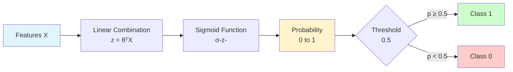

# Logistic Regression

**Predict probabilities for binary classification.** Despite its name, logistic regression is used for classification, not regression. It predicts the probability that an input belongs to a particular class.

**Difficulty:** 🟢 Beginner | **Time:** 2-3 hours | **Prerequisites:** Linear Regression, Basic Probability

---

## Overview

Logistic Regression uses the sigmoid function to transform linear combinations of features into probabilities between 0 and 1. It's the go-to algorithm for binary classification problems.

**Use cases:** Spam detection, disease diagnosis, customer churn prediction, credit default prediction

---

## Intuition 💡

###The Big Idea

Linear regression outputs any value (-∞ to +∞), but for classification we need probabilities (0 to 1). Logistic regression **squashes** the output through a sigmoid function to get valid probabilities.



### Real-World Analogy

Think of email spam detection:
- **Input:** Email features (word frequencies, sender info, links)
- **Process:** Model combines features → gets a score → converts to probability
- **Output:** "This email has 85% probability of being spam"
- **Decision:** If probability > 50%, classify as spam

### Sigmoid Function Visualization

```
p(x)
1.0 |         ┌────────
    |        ╱
0.5 |      ╱  ← Decision boundary
    |    ╱
0.0 |──╱───────────────→ z
       Sigmoid: σ(z) = 1/(1 + e^(-z))
```

---

## When to Use ✅ / When to Avoid ❌

### ✅ Good For

| Scenario | Why It Works |
|----------|--------------|
| **Binary classification** | Spam/not spam, fraud/legitimate, yes/no |
| **Probability estimates** | Need confidence scores, not just predictions |
| **Linearly separable classes** | When decision boundary is roughly linear |
| **Interpretability** | Coefficients show feature importance |
| **Baseline model** | Fast, simple, good starting point |
| **Large datasets** | Scales well, efficient training |

**Examples:**
- Email spam detection
- Disease diagnosis (positive/negative)
- Customer churn (will leave / won't leave)
- Credit default prediction

### ❌ Not Good For

| Scenario | Why It Fails |
|----------|--------------|
| **Multi-class problems** | Use Multinomial Logistic Regression or other algorithms |
| **Non-linear boundaries** | Complex decision boundaries (use SVM, trees, NN) |
| **Highly imbalanced data** | Biased toward majority class without adjustment |
| **Perfect separation** | Algorithm may not converge |

**When to use instead:**
- Multi-class: Softmax Regression, Random Forest
- Non-linear: SVM with RBF kernel, Neural Networks
- Imbalanced: Adjust class weights, use SMOTE

---

## Mathematical Foundation

### The Sigmoid Function

Converts any value to range [0, 1]:

$$\sigma(z) = \frac{1}{1 + e^{-z}}$$

Properties:
- $\sigma(0) = 0.5$ (neutral point)
- $\sigma(+\infty) \rightarrow 1$
- $\sigma(-\infty) \rightarrow 0$
- Smooth, differentiable everywhere

### The Model

$$P(y=1|x) = \sigma(\theta^T x) = \frac{1}{1 + e^{-\theta^T x}}$$

Where:
- $P(y=1|x)$ = probability that instance $x$ belongs to class 1
- $\theta^T x$ = linear combination of features
- $\theta$ = model parameters (weights)

### Cost Function (Log Loss)

Cannot use MSE (non-convex for logistic regression). Use **log loss** instead:

$$J(\theta) = -\frac{1}{m}\sum_{i=1}^{m}\left[y^{(i)}\log(\hat{y}^{(i)}) + (1-y^{(i)})\log(1-\hat{y}^{(i)})\right]$$

**Intuition:**
- If $y = 1$ and $\hat{y} \rightarrow 1$: loss $ \rightarrow 0$ (good!)
- If $y = 1$ and $\hat{y} \rightarrow 0$: loss $\rightarrow \infty$ (bad!)

### Gradient Descent Update

$$\theta_j := \theta_j - \alpha \frac{\partial J}{\partial \theta_j}$$

Where:

$$\frac{\partial J}{\partial \theta_j} = \frac{1}{m}\sum_{i=1}^{m}(\hat{y}^{(i)} - y^{(i)})x_j^{(i)}$$

---

## Implementation

### Using Scikit-learn

```python
import numpy as np
import matplotlib.pyplot as plt
from sklearn.linear_model import LogisticRegression
from sklearn.model_selection import train_test_split
from sklearn.metrics import classification_report, confusion_matrix, roc_auc_score
from sklearn.datasets import make_classification

# Generate binary classification data
X, y = make_classification(
    n_samples=1000,
    n_features=20,
    n_informative=15,
    n_redundant=5,
    random_state=42
)

# Split data
X_train, X_test, y_train, y_test = train_test_split(
    X, y, test_size=0.2, stratify=y, random_state=42
)

# Create and train model
model = LogisticRegression(max_iter=1000, random_state=42)
model.fit(X_train, y_train)

# Predictions
y_pred = model.predict(X_test)
y_pred_proba = model.predict_proba(X_test)[:, 1]  # Probability for class 1

# Evaluate
print("Classification Report:")
print(classification_report(y_test, y_pred))

print(f"\nROC-AUC Score: {roc_auc_score(y_test, y_pred_proba):.3f}")

# Confusion Matrix
cm = confusion_matrix(y_test, y_pred)
print("\nConfusion Matrix:")
print(cm)

# Feature importance
print("\nTop 5 Important Features:")
feature_importance = np.abs(model.coef_[0])
top_indices = np.argsort(feature_importance)[::-1][:5]
for idx in top_indices:
    print(f"Feature {idx}: {feature_importance[idx]:.3f}")
```

### From Scratch

```python
class LogisticRegressionFromScratch:
    """Logistic Regression using Gradient Descent"""

    def __init__(self, learning_rate=0.01, n_iterations=1000):
        self.lr = learning_rate
        self.n_iterations = n_iterations
        self.weights = None
        self.bias = None
        self.losses = []

    def sigmoid(self, z):
        """Sigmoid activation function"""
        return 1 / (1 + np.exp(-np.clip(z, -500, 500)))  # Clip for numerical stability

    def fit(self, X, y):
        """Train the model"""
        n_samples, n_features = X.shape

        # Initialize parameters
        self.weights = np.zeros(n_features)
        self.bias = 0

        # Gradient descent
        for i in range(self.n_iterations):
            # Forward pass
            linear_output = np.dot(X, self.weights) + self.bias
            y_pred = self.sigmoid(linear_output)

            # Compute loss (binary cross-entropy)
            loss = -np.mean(y * np.log(y_pred + 1e-15) + (1 - y) * np.log(1 - y_pred + 1e-15))
            self.losses.append(loss)

            # Compute gradients
            dw = (1 / n_samples) * np.dot(X.T, (y_pred - y))
            db = (1 / n_samples) * np.sum(y_pred - y)

            # Update parameters
            self.weights -= self.lr * dw
            self.bias -= self.lr * db

            if i % 100 == 0:
                print(f"Iteration {i}: Loss = {loss:.4f}")

        return self

    def predict_proba(self, X):
        """Predict probabilities"""
        linear_output = np.dot(X, self.weights) + self.bias
        return self.sigmoid(linear_output)

    def predict(self, X, threshold=0.5):
        """Predict class labels"""
        probabilities = self.predict_proba(X)
        return (probabilities >= threshold).astype(int)

# Usage
model_scratch = LogisticRegressionFromScratch(learning_rate=0.1, n_iterations=1000)
model_scratch.fit(X_train, y_train)

y_pred_scratch = model_scratch.predict(X_test)
y_pred_proba_scratch = model_scratch.predict_proba(X_test)

print(f"\nAccuracy (from scratch): {np.mean(y_pred_scratch == y_test):.3f}")

# Plot loss curve
plt.figure(figsize=(10, 6))
plt.plot(model_scratch.losses)
plt.xlabel('Iteration')
plt.ylabel('Loss (Binary Cross-Entropy)')
plt.title('Training Loss over Time')
plt.show()
```

---

## Visualization

### Decision Boundary (2D)

```python
def plot_decision_boundary(X, y, model):
    """Visualize decision boundary for 2D data"""
    h = 0.02  # Step size
    x_min, x_max = X[:, 0].min() - 1, X[:, 0].max() + 1
    y_min, y_max = X[:, 1].min() - 1, X[:, 1].max() + 1

    xx, yy = np.meshgrid(
        np.arange(x_min, x_max, h),
        np.arange(y_min, y_max, h)
    )

    Z = model.predict(np.c_[xx.ravel(), yy.ravel()])
    Z = Z.reshape(xx.shape)

    plt.figure(figsize=(10, 6))
    plt.contourf(xx, yy, Z, alpha=0.4, cmap='RdYlBu')
    plt.scatter(X[:, 0], X[:, 1], c=y, edgecolors='black', cmap='RdYlBu')
    plt.xlabel('Feature 1')
    plt.ylabel('Feature 2')
    plt.title('Logistic Regression Decision Boundary')
    plt.colorbar()
    plt.show()

# Example with 2 features
X_2d, y_2d = make_classification(
    n_samples=200,
    n_features=2,
    n_redundant=0,
    n_informative=2,
    random_state=1
)
model_2d = LogisticRegression()
model_2d.fit(X_2d, y_2d)
plot_decision_boundary(X_2d, y_2d, model_2d)
```

### ROC Curve

```python
from sklearn.metrics import roc_curve, auc

fpr, tpr, thresholds = roc_curve(y_test, y_pred_proba)
roc_auc = auc(fpr, tpr)

plt.figure(figsize=(8, 6))
plt.plot(fpr, tpr, color='darkorange', lw=2, label=f'ROC curve (AUC = {roc_auc:.2f})')
plt.plot([0, 1], [0, 1], color='navy', lw=2, linestyle='--', label='Random')
plt.xlabel('False Positive Rate')
plt.ylabel('True Positive Rate')
plt.title('Receiver Operating Characteristic (ROC) Curve')
plt.legend(loc="lower right")
plt.show()
```

---

## Hyperparameters

### Key Parameters

| Parameter | What It Does | Default | Tips |
|-----------|--------------|---------|------|
| `C` | Inverse of regularization strength | 1.0 | Smaller = stronger regularization |
| `penalty` | Regularization type | 'l2' | 'l1' for feature selection, 'l2' for shrinkage |
| `solver` | Optimization algorithm | 'lbfgs' | 'liblinear' for small datasets, 'saga' for large |
| `max_iter` | Maximum iterations | 100 | Increase if not converging |
| `class_weight` | Handle imbalanced data | None | Use 'balanced' for imbalanced datasets |

### Example with Hyperparameters

```python
# For imbalanced data
model = LogisticRegression(
    C=0.1,  # Strong regularization
    penalty='l1',  # Feature selection
    solver='saga',  # Supports L1
    class_weight='balanced',  # Handle imbalance
    max_iter=1000
)
model.fit(X_train, y_train)
```

---

## Complexity Analysis

**Time Complexity:**
- Training: $O(k \cdot n \cdot m)$ where $k$ = iterations, $n$ = features, $m$ = samples
- Prediction: $O(n)$ per sample

**Space Complexity:** $O(n)$ for storing weights

---

## Common Pitfalls

### 1. Using Wrong Evaluation Metric

!!! warning "Accuracy is Misleading for Imbalanced Data"
    **Problem:** 99% accuracy sounds great, but if 99% of data is negative class, always predicting negative gives 99% accuracy!

    **Solution:** Use F1-score, Precision, Recall, or ROC-AUC

    ```python
    from sklearn.metrics import f1_score, precision_score, recall_score

    print(f"F1 Score: {f1_score(y_test, y_pred):.3f}")
    print(f"Precision: {precision_score(y_test, y_pred):.3f}")
    print(f"Recall: {recall_score(y_test, y_pred):.3f}")
    ```

### 2. Not Scaling Features

!!! warning "Unscaled Features Slow Convergence"
    **Solution:** Always scale features

    ```python
    from sklearn.preprocessing import StandardScaler

    scaler = StandardScaler()
    X_train_scaled = scaler.fit_transform(X_train)
    X_test_scaled = scaler.transform(X_test)
    ```

### 3. Ignoring Class Imbalance

!!! warning "Biased Toward Majority Class"
    **Solutions:**
    - Use `class_weight='balanced'`
    - Oversample minority class (SMOTE)
    - Undersample majority class
    - Adjust decision threshold

    ```python
    # Adjust threshold
    threshold = 0.3  # Lower to catch more positives
    y_pred_adjusted = (y_pred_proba >= threshold).astype(int)
    ```

### 4. Perfect Separation

!!! warning "Algorithm May Not Converge"
    If classes are perfectly separable, logistic regression may not converge (weights → ∞).

    **Solution:** Add regularization

    ```python
    model = LogisticRegression(C=1.0, penalty='l2')  # Regularization prevents infinite weights
    ```

---

## Multi-Class Extension

### One-vs-Rest (OvR)

Train N binary classifiers for N classes:

```python
# Sklearn handles automatically
model = LogisticRegression(multi_class='ovr')
model.fit(X_train, y_train)  # Works with multi-class y
```

### Multinomial (Softmax)

Direct multi-class extension:

```python
model = LogisticRegression(multi_class='multinomial', solver='lbfgs')
model.fit(X_train, y_train)
```

---

## Practice Problems

### 🟢 Beginner

!!! example "Problem 1: Spam Classifier"
    Build a spam email classifier. Dataset: emails with word frequencies. Target: spam/not spam.

    **Tasks:**
    1. Load data and split
    2. Train logistic regression
    3. Evaluate with confusion matrix

!!! example "Problem 2: Probability Threshold"
    Experiment with different probability thresholds (0.3, 0.5, 0.7). How does it affect precision vs recall?

### 🟡 Intermediate

!!! example "Problem 3: Imbalanced Data"
    Dataset: Credit card fraud (99% legitimate, 1% fraud). Handle class imbalance and optimize for catching fraud.

    **Hint:** Use `class_weight='balanced'` and optimize for recall.

!!! example "Problem 4: Feature Engineering"
    Create new features (polynomials, interactions) and see if model improves. Use regularization to prevent overfitting.

### 🔴 Advanced

!!! example "Problem 5: Production System"
    Build complete fraud detection system:
    - Feature engineering pipeline
    - Handle class imbalance
    - Cross-validation
    - Model calibration
    - Deploy with threshold tuning

---

## Related Topics

- [Linear Regression](../regression/linear-regression.md) - Foundation for logistic regression
- [Naive Bayes](naive-bayes.md) - Probabilistic classifier
- [Decision Trees](decision-trees.md) - Non-linear boundaries
- [SVM](svm.md) - Maximum margin classifier
- [Regularization](../../optimization/regularization.md) - L1, L2 penalties

---

## References

1. **Scikit-learn:** [Logistic Regression](https://scikit-learn.org/stable/modules/generated/sklearn.linear_model.LogisticRegression.html)
2. **Andrew Ng:** [CS229 Lecture Notes](http://cs229.stanford.edu/)
3. **Book:** *Hands-On Machine Learning* Chapter 4
4. **Paper:** "The Origins of Logistic Regression" by Cramer (2002)
5. **Interactive:** [Visual Logistic Regression](http://setosa.io/ev/image-kernels/)

---

**Next Steps:**
- Try [Kaggle Titanic](https://www.kaggle.com/c/titanic) - classic binary classification
- Learn [SVM](svm.md) for complex decision boundaries
- Explore [Ensemble Methods](../ensemble-methods/index.md) for better performance

**Master binary classification with Logistic Regression!** 🎯
