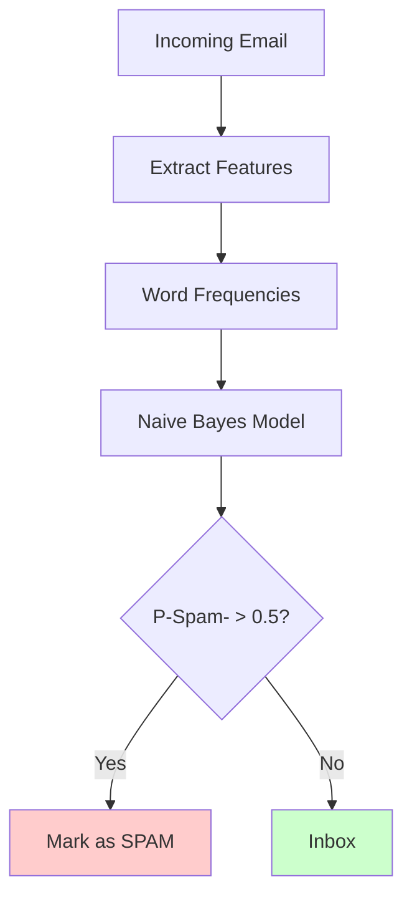

# Naive Bayes

**Probabilistic classifier based on Bayes' theorem.** Calculates the probability of each class given the features using conditional independence assumptions. Fast, simple, and surprisingly effective.

**Difficulty:** 🟢 Beginner | **Time:** 2-3 hours | **Prerequisites:** Basic Probability, Conditional Probability

---

## Overview

Naive Bayes is a family of probabilistic classifiers based on applying Bayes' theorem with strong (naive) independence assumptions between features. Despite this simplification, it works remarkably well in many real-world applications.

**Use cases:** Spam filtering, sentiment analysis, document classification, medical diagnosis, real-time prediction

---

## Intuition 💡

### The Big Idea

Given features, calculate the probability of each class and pick the most probable one. The "naive" part assumes all features are independent given the class (which is rarely true but works well in practice).

```mermaid
graph LR
    A[Email Words:<br/>free, winner, money] --> B[Calculate P-Spam|Words-]
    A --> C[Calculate P-Ham|Words-]
    B --> D{Compare<br/>Probabilities}
    C --> D
    D -->|P-Spam- > P-Ham-| E[Classify: SPAM]
    D -->|P-Ham- > P-Spam-| F[Classify: HAM]

    style A fill:#e1f5ff
    style B fill:#ffcccc
    style C fill:#ccffcc
    style E fill:#ffcccc
    style F fill:#ccffcc
```

### Real-World Analogy

Think of diagnosing a disease:
- **Prior:** 1% of people have the disease (base rate)
- **Evidence:** Patient has symptoms A, B, C
- **Process:** For each symptom, ask "How likely is this symptom if they have/don't have disease?"
- **Conclusion:** Multiply probabilities, compare, make diagnosis

The "naive" assumption: symptoms are independent (having fever doesn't affect probability of cough). Not true in reality, but simplifies calculations!

### Bayes' Theorem Visualization

```
P(Spam|"free money")  =  P("free money"|Spam) × P(Spam)
                         ─────────────────────────────────
                               P("free money")

     posterior           likelihood × prior
   (what we want)      ─────────────────────
                           evidence
```

---

## When to Use ✅ / When to Avoid ❌

### ✅ Good For

| Scenario | Why It Works |
|----------|--------------|
| **Text classification** | Bag-of-words naturally fits independence assumption |
| **Real-time prediction** | Extremely fast, no training time needed |
| **Small training sets** | Needs few examples per class |
| **High-dimensional data** | Handles many features efficiently |
| **Multi-class problems** | Naturally extends to multiple classes |
| **Baseline model** | Quick to implement, strong baseline |

**Examples:**
- Spam email filtering
- Sentiment analysis (positive/negative/neutral)
- Document categorization (sports/politics/tech)
- Medical diagnosis
- Real-time recommendations

### ❌ Not Good For

| Scenario | Why It Fails |
|----------|--------------|
| **Feature correlations** | Assumes independence (naive assumption) |
| **Continuous features** | Gaussian NB makes normality assumption |
| **Complex relationships** | Linear decision boundaries only |
| **Need probabilities** | Probability estimates can be poor (but rankings good) |

**When to use instead:**
- Correlated features: Logistic Regression, SVM
- Non-linear boundaries: Decision Trees, Random Forest
- Better probabilities: Logistic Regression (with calibration)

---

## Mathematical Foundation

### Bayes' Theorem

$$P(y|X) = \frac{P(X|y) \cdot P(y)}{P(X)}$$

Where:
- $P(y|X)$ = posterior probability (class $y$ given features $X$)
- $P(X|y)$ = likelihood (features given class)
- $P(y)$ = prior probability (class frequency)
- $P(X)$ = evidence (constant for all classes)

### Naive Independence Assumption

$$P(X|y) = P(x_1, x_2, ..., x_n|y) = \prod_{i=1}^{n} P(x_i|y)$$

Assumes features are conditionally independent given the class.

### Classification Rule

Choose class with maximum posterior probability:

$$\hat{y} = \arg\max_{y} P(y) \prod_{i=1}^{n} P(x_i|y)$$

In practice, use log to avoid underflow:

$$\hat{y} = \arg\max_{y} \left[\log P(y) + \sum_{i=1}^{n} \log P(x_i|y)\right]$$

### Types of Naive Bayes

**1. Gaussian Naive Bayes** (continuous features)

Assumes features follow normal distribution:

$$P(x_i|y) = \frac{1}{\sqrt{2\pi\sigma_y^2}} \exp\left(-\frac{(x_i - \mu_y)^2}{2\sigma_y^2}\right)$$

**2. Multinomial Naive Bayes** (count features)

For text classification with word counts:

$$P(x_i|y) = \frac{N_{yi} + \alpha}{N_y + \alpha n}$$

Where $\alpha$ is smoothing parameter (Laplace smoothing).

**3. Bernoulli Naive Bayes** (binary features)

For binary/boolean features (word present/absent):

$$P(x_i|y) = P(i|y)x_i + (1 - P(i|y))(1 - x_i)$$

---

## Implementation

### Using Scikit-learn

=== "Gaussian NB (Continuous Features)"

    ```python
    import numpy as np
    import matplotlib.pyplot as plt
    from sklearn.naive_bayes import GaussianNB
    from sklearn.model_selection import train_test_split
    from sklearn.metrics import classification_report, confusion_matrix, accuracy_score
    from sklearn.datasets import make_classification

    # Generate continuous feature data
    X, y = make_classification(
        n_samples=1000,
        n_features=20,
        n_informative=15,
        n_redundant=5,
        n_classes=3,
        random_state=42
    )

    # Split data
    X_train, X_test, y_train, y_test = train_test_split(
        X, y, test_size=0.2, stratify=y, random_state=42
    )

    # Create and train model
    model = GaussianNB()
    model.fit(X_train, y_train)

    # Predictions
    y_pred = model.predict(X_test)
    y_pred_proba = model.predict_proba(X_test)

    # Evaluate
    print("Gaussian Naive Bayes Results:")
    print(f"Accuracy: {accuracy_score(y_test, y_pred):.3f}")
    print("\nClassification Report:")
    print(classification_report(y_test, y_pred))

    # Confusion Matrix
    cm = confusion_matrix(y_test, y_pred)
    print("\nConfusion Matrix:")
    print(cm)

    # Class priors
    print("\nClass Priors:")
    print(model.class_prior_)
    ```

=== "Multinomial NB (Text Classification)"

    ```python
    from sklearn.naive_bayes import MultinomialNB
    from sklearn.feature_extraction.text import CountVectorizer
    from sklearn.datasets import fetch_20newsgroups

    # Load text data
    categories = ['alt.atheism', 'soc.religion.christian', 'comp.graphics', 'sci.med']
    newsgroups_train = fetch_20newsgroups(subset='train', categories=categories)
    newsgroups_test = fetch_20newsgroups(subset='test', categories=categories)

    # Convert text to word counts
    vectorizer = CountVectorizer(max_features=5000, stop_words='english')
    X_train = vectorizer.fit_transform(newsgroups_train.data)
    X_test = vectorizer.transform(newsgroups_test.data)
    y_train = newsgroups_train.target
    y_test = newsgroups_test.target

    # Train model
    model = MultinomialNB(alpha=1.0)  # alpha for Laplace smoothing
    model.fit(X_train, y_train)

    # Predictions
    y_pred = model.predict(X_test)

    # Evaluate
    print("Multinomial Naive Bayes Results:")
    print(f"Accuracy: {accuracy_score(y_test, y_pred):.3f}")
    print("\nClassification Report:")
    print(classification_report(y_test, y_pred, target_names=newsgroups_test.target_names))

    # Show most informative features for each class
    feature_names = vectorizer.get_feature_names_out()
    for i, category in enumerate(categories):
        top10 = np.argsort(model.feature_log_prob_[i])[-10:]
        print(f"\nTop words for {category}:")
        print(" ".join([feature_names[j] for j in top10]))
    ```

=== "Bernoulli NB (Binary Features)"

    ```python
    from sklearn.naive_bayes import BernoulliNB

    # Convert to binary features (word present/absent)
    X_train_binary = (X_train > 0).astype(int)
    X_test_binary = (X_test > 0).astype(int)

    # Train model
    model = BernoulliNB(alpha=1.0)
    model.fit(X_train_binary, y_train)

    # Predictions
    y_pred = model.predict(X_test_binary)

    print("Bernoulli Naive Bayes Results:")
    print(f"Accuracy: {accuracy_score(y_test, y_pred):.3f}")
    ```

### From Scratch

=== "Gaussian Naive Bayes"

    ```python
    class GaussianNaiveBayesFromScratch:
        """Gaussian Naive Bayes from scratch"""

        def __init__(self):
            self.classes = None
            self.mean = {}      # Mean of each feature for each class
            self.var = {}       # Variance of each feature for each class
            self.priors = {}    # Prior probability of each class

        def fit(self, X, y):
            """Train the model"""
            self.classes = np.unique(y)
            n_samples = X.shape[0]

            for c in self.classes:
                X_c = X[y == c]
                self.mean[c] = X_c.mean(axis=0)
                self.var[c] = X_c.var(axis=0)
                self.priors[c] = X_c.shape[0] / n_samples

            return self

        def _calculate_likelihood(self, x, mean, var):
            """Calculate Gaussian likelihood P(x|y)"""
            eps = 1e-4  # Avoid division by zero
            exponent = np.exp(-((x - mean) ** 2) / (2 * (var + eps)))
            return exponent / np.sqrt(2 * np.pi * (var + eps))

        def _calculate_posterior(self, x):
            """Calculate posterior probability for each class"""
            posteriors = {}

            for c in self.classes:
                # Log prior
                prior = np.log(self.priors[c])

                # Sum of log likelihoods
                likelihood = np.sum(np.log(self._calculate_likelihood(
                    x, self.mean[c], self.var[c]
                )))

                # Posterior (log scale)
                posteriors[c] = prior + likelihood

            return posteriors

        def predict(self, X):
            """Predict class labels"""
            predictions = []

            for x in X:
                posteriors = self._calculate_posterior(x)
                predictions.append(max(posteriors, key=posteriors.get))

            return np.array(predictions)

        def predict_proba(self, X):
            """Predict class probabilities"""
            probas = []

            for x in X:
                posteriors = self._calculate_posterior(x)

                # Convert log probabilities to probabilities
                log_probs = np.array([posteriors[c] for c in self.classes])
                # Normalize using log-sum-exp trick
                max_log_prob = np.max(log_probs)
                exp_probs = np.exp(log_probs - max_log_prob)
                probs = exp_probs / np.sum(exp_probs)

                probas.append(probs)

            return np.array(probas)

    # Usage
    model_scratch = GaussianNaiveBayesFromScratch()
    model_scratch.fit(X_train, y_train)

    y_pred_scratch = model_scratch.predict(X_test)
    y_pred_proba_scratch = model_scratch.predict_proba(X_test)

    print(f"\nAccuracy (from scratch): {accuracy_score(y_test, y_pred_scratch):.3f}")

    # Compare with sklearn
    print(f"Accuracy (sklearn): {accuracy_score(y_test, y_pred):.3f}")
    ```

=== "Multinomial Naive Bayes"

    ```python
    class MultinomialNaiveBayesFromScratch:
        """Multinomial Naive Bayes from scratch (for text)"""

        def __init__(self, alpha=1.0):
            self.alpha = alpha  # Laplace smoothing
            self.classes = None
            self.class_word_counts = {}
            self.class_totals = {}
            self.priors = {}
            self.vocab_size = 0

        def fit(self, X, y):
            """Train the model"""
            self.classes = np.unique(y)
            n_samples = X.shape[0]
            self.vocab_size = X.shape[1]

            for c in self.classes:
                X_c = X[y == c]
                self.class_word_counts[c] = X_c.sum(axis=0)
                self.class_totals[c] = X_c.sum()
                self.priors[c] = X_c.shape[0] / n_samples

            return self

        def predict(self, X):
            """Predict class labels"""
            predictions = []

            for x in X:
                posteriors = {}

                for c in self.classes:
                    # Log prior
                    log_prior = np.log(self.priors[c])

                    # Log likelihood with Laplace smoothing
                    word_probs = (self.class_word_counts[c] + self.alpha) / \
                                 (self.class_totals[c] + self.alpha * self.vocab_size)

                    log_likelihood = np.sum(x * np.log(word_probs))

                    posteriors[c] = log_prior + log_likelihood

                predictions.append(max(posteriors, key=posteriors.get))

            return np.array(predictions)

    # Usage with sparse matrix
    model_scratch = MultinomialNaiveBayesFromScratch(alpha=1.0)
    model_scratch.fit(X_train.toarray(), y_train)

    y_pred_scratch = model_scratch.predict(X_test.toarray())
    print(f"Accuracy (from scratch): {accuracy_score(y_test, y_pred_scratch):.3f}")
    ```

---

## Visualization

### Decision Boundaries (2D)

```python
def plot_naive_bayes_boundary(X, y, model, title="Naive Bayes Decision Boundary"):
    """Visualize decision boundary for 2D data"""
    h = 0.02
    x_min, x_max = X[:, 0].min() - 1, X[:, 0].max() + 1
    y_min, y_max = X[:, 1].min() - 1, X[:, 1].max() + 1

    xx, yy = np.meshgrid(
        np.arange(x_min, x_max, h),
        np.arange(y_min, y_max, h)
    )

    Z = model.predict(np.c_[xx.ravel(), yy.ravel()])
    Z = Z.reshape(xx.shape)

    plt.figure(figsize=(10, 6))
    plt.contourf(xx, yy, Z, alpha=0.4, cmap='viridis')
    plt.scatter(X[:, 0], X[:, 1], c=y, edgecolors='black', cmap='viridis')
    plt.xlabel('Feature 1')
    plt.ylabel('Feature 2')
    plt.title(title)
    plt.colorbar()
    plt.show()

# Example with 2 features
X_2d, y_2d = make_classification(
    n_samples=200,
    n_features=2,
    n_redundant=0,
    n_informative=2,
    n_classes=3,
    n_clusters_per_class=1,
    random_state=42
)

model_2d = GaussianNB()
model_2d.fit(X_2d, y_2d)
plot_naive_bayes_boundary(X_2d, y_2d, model_2d)
```

### Probability Distributions per Class

```python
def plot_feature_distributions(X, y, feature_idx=0):
    """Plot feature distributions for each class"""
    classes = np.unique(y)

    plt.figure(figsize=(12, 4))

    for c in classes:
        X_c = X[y == c, feature_idx]
        plt.hist(X_c, bins=30, alpha=0.5, label=f'Class {c}', density=True)

        # Plot fitted Gaussian
        mu = X_c.mean()
        sigma = X_c.std()
        x_range = np.linspace(X_c.min(), X_c.max(), 100)
        gaussian = (1 / (np.sqrt(2 * np.pi) * sigma)) * \
                   np.exp(-0.5 * ((x_range - mu) / sigma) ** 2)
        plt.plot(x_range, gaussian, linewidth=2, label=f'Class {c} Gaussian')

    plt.xlabel(f'Feature {feature_idx}')
    plt.ylabel('Density')
    plt.title('Feature Distributions per Class')
    plt.legend()
    plt.show()

plot_feature_distributions(X_train, y_train, feature_idx=0)
```

### Confusion Matrix Heatmap

```python
import seaborn as sns

def plot_confusion_matrix(y_test, y_pred, classes):
    """Plot confusion matrix"""
    cm = confusion_matrix(y_test, y_pred)

    plt.figure(figsize=(8, 6))
    sns.heatmap(cm, annot=True, fmt='d', cmap='Blues',
                xticklabels=classes, yticklabels=classes)
    plt.xlabel('Predicted')
    plt.ylabel('Actual')
    plt.title('Confusion Matrix')
    plt.show()

plot_confusion_matrix(y_test, y_pred, classes=['Class 0', 'Class 1', 'Class 2'])
```

### Most Informative Words (Text Classification)

```python
def show_top_features(vectorizer, model, class_labels, n=10):
    """Show top N features for each class"""
    feature_names = vectorizer.get_feature_names_out()

    fig, axes = plt.subplots(2, 2, figsize=(15, 10))
    axes = axes.ravel()

    for i, label in enumerate(class_labels):
        top_indices = np.argsort(model.feature_log_prob_[i])[-n:][::-1]
        top_features = [feature_names[j] for j in top_indices]
        top_probs = model.feature_log_prob_[i][top_indices]

        axes[i].barh(range(n), top_probs)
        axes[i].set_yticks(range(n))
        axes[i].set_yticklabels(top_features)
        axes[i].set_xlabel('Log Probability')
        axes[i].set_title(f'Top {n} words for: {label}')
        axes[i].invert_yaxis()

    plt.tight_layout()
    plt.show()

# Usage with text model
show_top_features(vectorizer, model, categories, n=10)
```

---

## Hyperparameters

### Key Parameters

| Parameter | What It Does | Default | Tips |
|-----------|--------------|---------|------|
| `var_smoothing` (Gaussian) | Portion of largest variance added to all | 1e-9 | Increase if features have zero variance |
| `alpha` (Multinomial/Bernoulli) | Laplace smoothing parameter | 1.0 | 0 = no smoothing, higher = more smoothing |
| `fit_prior` | Whether to learn class prior | True | False = use uniform prior |
| `class_prior` | Manual prior probabilities | None | Use for imbalanced datasets |

### Example with Hyperparameters

```python
# Gaussian NB with smoothing
model_gaussian = GaussianNB(var_smoothing=1e-8)

# Multinomial NB with custom smoothing
model_multinomial = MultinomialNB(
    alpha=0.5,  # Less smoothing
    fit_prior=True
)

# Custom class priors (for imbalanced data)
model_custom = MultinomialNB(
    alpha=1.0,
    fit_prior=False,
    class_prior=[0.6, 0.3, 0.1]  # Manual priors
)
```

---

## Complexity Analysis

**Time Complexity:**
- Training: $O(n \cdot d)$ where $n$ = samples, $d$ = features
- Prediction: $O(c \cdot d)$ where $c$ = classes

**Space Complexity:** $O(c \cdot d)$ to store means and variances

**Key Advantage:** Extremely fast! No iterative optimization needed.

---

## Common Pitfalls

### 1. Zero Probability Problem

!!! warning "Word Never Seen in Training"
    **Problem:** If a word never appears with a class during training, $P(word|class) = 0$, making entire posterior zero!

    **Solution:** Laplace smoothing (add-one smoothing)

    ```python
    # Without smoothing (bad!)
    model = MultinomialNB(alpha=0)  # Will fail on unseen words

    # With smoothing (good!)
    model = MultinomialNB(alpha=1.0)  # Adds 1 to all counts
    ```

### 2. Feature Independence Assumption

!!! warning "Features are Rarely Independent"
    **Problem:** Naive Bayes assumes features are independent, which is often violated.

    **Example:** In text, "San Francisco" - seeing "San" makes "Francisco" very likely!

    **Solution:**
    - Accept it! Often works despite violation
    - Try bigrams/trigrams for text
    - Consider alternatives (Logistic Regression) if performance poor

    ```python
    # Use bigrams for text to capture some dependencies
    from sklearn.feature_extraction.text import CountVectorizer

    vectorizer = CountVectorizer(ngram_range=(1, 2))  # Unigrams + bigrams
    ```

### 3. Continuous Features in Multinomial NB

!!! warning "Multinomial NB Requires Non-negative Counts"
    **Problem:** Multinomial NB expects count data (non-negative integers)

    **Solution:** Use Gaussian NB for continuous features

    ```python
    # Wrong!
    model = MultinomialNB()
    model.fit(continuous_features, y)  # May fail or give poor results

    # Right!
    model = GaussianNB()
    model.fit(continuous_features, y)
    ```

### 4. Not Handling Class Imbalance

!!! warning "Biased Toward Majority Class"
    **Solution:** Adjust class priors

    ```python
    # Option 1: Let it learn from data (default)
    model = GaussianNB(fit_prior=True)

    # Option 2: Set uniform priors
    model = GaussianNB(fit_prior=False)

    # Option 3: Custom priors
    model = GaussianNB(
        fit_prior=False,
        priors=[0.5, 0.5]  # Equal weight to both classes
    )
    ```

### 5. Poor Probability Estimates

!!! warning "Probabilities Can Be Extreme (Too Confident)"
    **Problem:** Naive Bayes often gives probabilities close to 0 or 1 (overconfident)

    **Solution:**
    - Use for ranking, not absolute probabilities
    - Apply calibration if you need good probabilities

    ```python
    from sklearn.calibration import CalibratedClassifierCV

    # Calibrate the model
    model_calibrated = CalibratedClassifierCV(model, cv=5)
    model_calibrated.fit(X_train, y_train)

    # Now probabilities are better calibrated
    y_pred_proba_calibrated = model_calibrated.predict_proba(X_test)
    ```

---

## Use Cases Deep Dive

### Spam Email Filter



**Why Naive Bayes?**
- Fast classification (millions of emails/day)
- Works well with high-dimensional text data
- Can update incrementally with new examples

### Sentiment Analysis

```python
def sentiment_analysis_example():
    """Sentiment analysis with Naive Bayes"""
    from sklearn.datasets import load_files
    from sklearn.model_selection import cross_val_score

    # Movie reviews dataset
    reviews = [
        "This movie is excellent! Best film of the year.",
        "Terrible waste of time. Do not watch.",
        "Pretty good, I enjoyed it.",
        "Awful acting and boring plot.",
    ]
    sentiments = [1, 0, 1, 0]  # 1=positive, 0=negative

    # Convert to features
    vectorizer = CountVectorizer(max_features=1000)
    X = vectorizer.fit_transform(reviews)

    # Train model
    model = MultinomialNB(alpha=1.0)
    model.fit(X, sentiments)

    # Test new review
    new_review = ["This film is absolutely amazing"]
    X_new = vectorizer.transform(new_review)

    prediction = model.predict(X_new)[0]
    probability = model.predict_proba(X_new)[0]

    print(f"Sentiment: {'Positive' if prediction == 1 else 'Negative'}")
    print(f"Confidence: {probability[prediction]:.2%}")

sentiment_analysis_example()
```

---

## Practice Problems

### 🟢 Beginner

!!! example "Problem 1: Spam Classifier"
    Build a spam email classifier using the spam dataset.

    **Tasks:**
    1. Load spam/ham emails dataset
    2. Convert to word counts with CountVectorizer
    3. Train MultinomialNB
    4. Evaluate with accuracy and confusion matrix

    **Hint:** Use `alpha=1.0` for Laplace smoothing

!!! example "Problem 2: Iris Classification"
    Use Gaussian NB on the classic Iris dataset.

    **Tasks:**
    1. Load iris dataset
    2. Split train/test
    3. Train GaussianNB
    4. Visualize decision boundaries (use 2 features)

### 🟡 Intermediate

!!! example "Problem 3: News Article Classifier"
    Classify news articles into categories (politics, sports, tech).

    **Tasks:**
    1. Use 20 newsgroups dataset
    2. Try different vectorization (CountVectorizer vs TfidfVectorizer)
    3. Compare MultinomialNB vs BernoulliNB
    4. Show most informative words per category

!!! example "Problem 4: Handling Imbalanced Data"
    Dataset: Medical diagnosis (95% healthy, 5% disease)

    **Tasks:**
    1. Train baseline model
    2. Adjust class priors
    3. Compare performance with different priors
    4. Optimize for recall (catch diseases)

### 🔴 Advanced

!!! example "Problem 5: Real-Time Tweet Sentiment"
    Build real-time sentiment analyzer for tweets.

    **Tasks:**
    1. Collect/use Twitter sentiment dataset
    2. Handle preprocessing (URLs, mentions, hashtags)
    3. Feature engineering (unigrams, bigrams, emojis)
    4. Compare different NB variants
    5. Implement online learning (update model incrementally)
    6. Deploy as API endpoint

!!! example "Problem 6: Naive Bayes Ensemble"
    Combine multiple Naive Bayes models.

    **Tasks:**
    1. Train different NB variants (Gaussian, Multinomial, Bernoulli)
    2. Use different feature representations
    3. Ensemble predictions (voting or averaging)
    4. Compare with single model performance

---

## Related Topics

- [Logistic Regression](logistic-regression.md) - Alternative probabilistic classifier
- [Decision Trees](decision-trees.md) - Non-linear classifier
- Text Classification - NLP applications
- Feature Engineering - Improve features
- Probability Theory - Mathematical foundation

---

## References

1. **Scikit-learn:** [Naive Bayes](https://scikit-learn.org/stable/modules/naive_bayes.html)
2. **Paper:** "Naive Bayes at Forty" by Lewis (1998)
3. **Book:** *Pattern Recognition and Machine Learning* by Bishop
4. **Tutorial:** [Stanford CS229 Notes](http://cs229.stanford.edu/)
5. **Application:** "Spam Filtering with Naive Bayes" by Sahami et al.

---

**Next Steps:**
- Try [Kaggle SMS Spam Collection](https://www.kaggle.com/uciml/sms-spam-collection-dataset)
- Learn [Logistic Regression](logistic-regression.md) for comparison
- Explore [Ensemble Methods](../ensemble-methods/index.md) for better performance

**Master probabilistic classification with Naive Bayes!** 🎯
