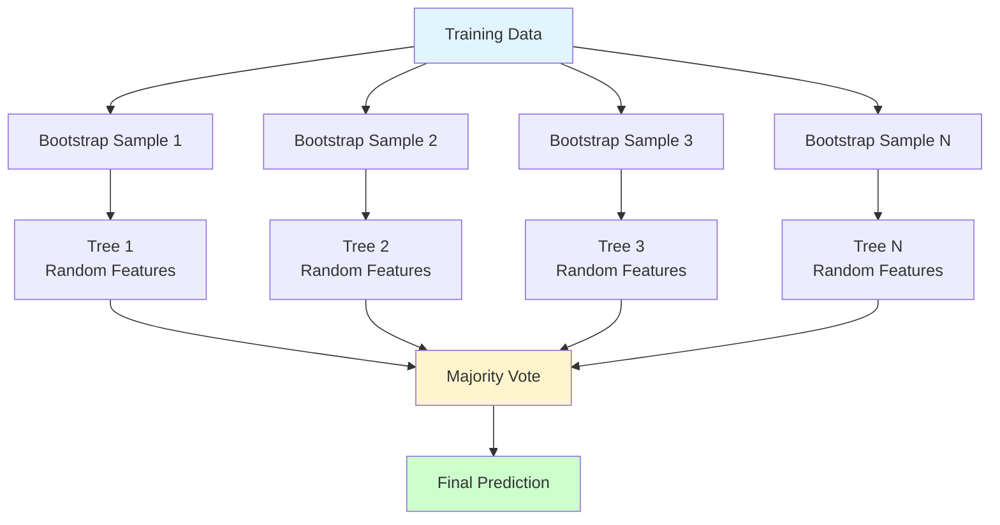

# Random Forest

**Ensemble of decision trees using bagging and random feature selection.** Combines multiple decision trees to create a more robust and accurate model. One of the most popular and effective ML algorithms.

**Difficulty:** 🟡 Intermediate | **Time:** 3-4 hours | **Prerequisites:** Decision Trees, Bootstrap Sampling, Ensemble Methods

---

## Overview

Random Forest builds multiple decision trees on random subsets of data and features, then combines their predictions through voting (classification) or averaging (regression). This reduces overfitting and variance while maintaining low bias.

**Use cases:** Feature selection, classification/regression, anomaly detection, recommendation systems, risk assessment

---

## Intuition 💡

### The Big Idea

**"Wisdom of crowds"** - Individual decision trees overfit and are unstable, but averaging many diverse trees gives robust predictions. Like asking 100 experts instead of 1!



### Real-World Analogy

Think of diagnosing a disease:
- **Single doctor:** Might overfit to recent cases, miss rare conditions
- **Panel of doctors:** Each sees different patients, considers different symptoms
- **Consensus:** Vote on diagnosis → more reliable than any single doctor
- **Random Forest:** Each tree is a "doctor," final prediction is their vote

### How Randomness Helps

**Two Sources of Randomness:**

1. **Bagging (Bootstrap Aggregating):** Each tree trained on random subset of data
2. **Feature Randomness:** Each split considers random subset of features

```
Original Data: [1,2,3,4,5,6,7,8,9,10]

Tree 1: [1,1,3,5,7,8,9]      Features: [A, C, E]
Tree 2: [2,3,4,4,6,8,10]     Features: [B, D, E]
Tree 3: [1,2,5,6,7,7,9]      Features: [A, B, D]
...

Each tree is different → diverse predictions → better generalization!
```

---

## When to Use ✅ / When to Avoid ❌

### ✅ Good For

| Scenario | Why It Works |
|----------|--------------|
| **General purpose** | Works well on most problems out-of-box |
| **Tabular data** | Excellent for structured/tabular data |
| **Feature importance** | Provides robust feature rankings |
| **Non-linear relationships** | Captures complex patterns |
| **Robust to outliers** | Less sensitive than single trees |
| **Handles missing values** | Can work with incomplete data |
| **No feature scaling** | Works with any scale |

**Examples:**
- Kaggle competitions (often wins)
- Risk assessment (credit, insurance)
- Medical diagnosis
- Customer churn prediction
- Fraud detection

### ❌ Not Good For

| Scenario | Why It Fails |
|----------|--------------|
| **Need interpretability** | Black box, hard to explain |
| **Real-time predictions** | Slower than single tree |
| **High-cardinality categoricals** | Can be biased |
| **Extrapolation** | Cannot predict beyond training range |
| **Very large datasets** | Memory intensive (stores many trees) |
| **Linear relationships** | Overcomplicated for linear data |

**When to use instead:**
- Interpretability: Single Decision Tree, Logistic Regression
- Speed: Logistic Regression, Naive Bayes
- Linear: Logistic Regression, Linear SVM
- Very large data: Gradient Boosting (XGBoost, LightGBM)

---

## Mathematical Foundation

### Bootstrap Aggregating (Bagging)

**Bootstrap Sample:** Random sample with replacement

$$S_i = \text{sample}(D, n, \text{replacement=True})$$

Train tree $T_i$ on $S_i$

**Final Prediction:**

Classification: $$\hat{y} = \text{mode}(T_1(x), T_2(x), ..., T_n(x))$$

Regression: $$\hat{y} = \frac{1}{n}\sum_{i=1}^{n}T_i(x)$$

### Random Feature Selection

At each split, randomly select $m$ features from total $p$ features:

$$m = \sqrt{p} \quad \text{(classification)}$$
$$m = \frac{p}{3} \quad \text{(regression)}$$

Choose best split among these $m$ features.

**Why it works:** Decorrelates trees → reduces variance

### Out-of-Bag (OOB) Error

Each tree uses ~63.2% of data (bootstrap). Remaining ~36.8% are "out-of-bag".

**OOB Score:** Use OOB samples as validation set (free cross-validation!)

$$\text{OOB Error} = \frac{1}{n}\sum_{i=1}^{n} \mathbb{1}(\hat{y}_i^{\text{OOB}} \neq y_i)$$

### Feature Importance

**Gini Importance (Mean Decrease in Impurity):**

$$\text{Importance}(f) = \sum_{t \in \text{Trees}} \sum_{s \in \text{Splits using } f} \Delta \text{Impurity}_s$$

**Permutation Importance:**

Shuffle feature → measure decrease in accuracy → importance

---

## Implementation

### Using Scikit-learn

=== "Basic Random Forest"

    ```python
    import numpy as np
    import matplotlib.pyplot as plt
    from sklearn.ensemble import RandomForestClassifier
    from sklearn.model_selection import train_test_split, cross_val_score
    from sklearn.metrics import classification_report, confusion_matrix, accuracy_score
    from sklearn.datasets import make_classification

    # Generate data
    X, y = make_classification(
        n_samples=1000,
        n_features=20,
        n_informative=15,
        n_redundant=5,
        n_classes=3,
        random_state=42
    )

    # Split data
    X_train, X_test, y_train, y_test = train_test_split(
        X, y, test_size=0.2, stratify=y, random_state=42
    )

    # Create and train Random Forest
    model = RandomForestClassifier(
        n_estimators=100,       # Number of trees
        max_depth=10,           # Max depth per tree
        min_samples_split=10,   # Min samples to split
        min_samples_leaf=5,     # Min samples in leaf
        max_features='sqrt',    # Features per split
        random_state=42,
        n_jobs=-1,              # Use all CPU cores
        oob_score=True          # Calculate OOB score
    )
    model.fit(X_train, y_train)

    # Predictions
    y_pred = model.predict(X_test)
    y_pred_proba = model.predict_proba(X_test)

    # Evaluate
    print("Random Forest Results:")
    print(f"Accuracy: {accuracy_score(y_test, y_pred):.3f}")
    print(f"OOB Score: {model.oob_score_:.3f}")

    print("\nClassification Report:")
    print(classification_report(y_test, y_pred))

    # Confusion Matrix
    cm = confusion_matrix(y_test, y_pred)
    print("\nConfusion Matrix:")
    print(cm)
    ```

=== "Feature Importance"

    ```python
    # Get feature importances
    feature_importance = model.feature_importances_
    sorted_idx = np.argsort(feature_importance)[::-1]

    # Plot feature importance
    plt.figure(figsize=(10, 6))
    plt.bar(range(min(10, len(feature_importance))),
            feature_importance[sorted_idx][:10])
    plt.xticks(range(min(10, len(feature_importance))),
               [f'Feature {i}' for i in sorted_idx[:10]],
               rotation=45)
    plt.xlabel('Features')
    plt.ylabel('Importance')
    plt.title('Top 10 Feature Importances')
    plt.tight_layout()
    plt.show()

    print("\nTop 5 Important Features:")
    for idx in sorted_idx[:5]:
        print(f"Feature {idx}: {feature_importance[idx]:.3f}")

    # Permutation importance (more reliable)
    from sklearn.inspection import permutation_importance

    perm_importance = permutation_importance(
        model, X_test, y_test, n_repeats=10, random_state=42
    )

    print("\nPermutation Importance (Top 5):")
    perm_sorted_idx = perm_importance.importances_mean.argsort()[::-1]
    for idx in perm_sorted_idx[:5]:
        print(f"Feature {idx}: {perm_importance.importances_mean[idx]:.3f} "
              f"± {perm_importance.importances_std[idx]:.3f}")
    ```

=== "Hyperparameter Tuning"

    ```python
    from sklearn.model_selection import RandomizedSearchCV

    # Parameter grid
    param_distributions = {
        'n_estimators': [50, 100, 200, 500],
        'max_depth': [None, 10, 20, 30],
        'min_samples_split': [2, 5, 10, 20],
        'min_samples_leaf': [1, 2, 5, 10],
        'max_features': ['sqrt', 'log2', None],
        'bootstrap': [True, False]
    }

    # Randomized search (faster than grid search)
    random_search = RandomizedSearchCV(
        RandomForestClassifier(random_state=42),
        param_distributions,
        n_iter=20,           # Number of parameter combinations to try
        cv=5,
        scoring='accuracy',
        n_jobs=-1,
        verbose=1,
        random_state=42
    )

    random_search.fit(X_train, y_train)

    print("Best Parameters:")
    print(random_search.best_params_)
    print(f"\nBest Cross-Validation Score: {random_search.best_score_:.3f}")

    # Test best model
    best_model = random_search.best_estimator_
    y_pred_best = best_model.predict(X_test)
    print(f"Test Accuracy: {accuracy_score(y_test, y_pred_best):.3f}")
    ```

=== "Learning Curves"

    ```python
    # Effect of number of trees
    n_estimators_range = [10, 50, 100, 200, 500]
    train_scores = []
    test_scores = []
    oob_scores = []

    for n_est in n_estimators_range:
        rf = RandomForestClassifier(
            n_estimators=n_est,
            max_depth=10,
            random_state=42,
            oob_score=True,
            n_jobs=-1
        )
        rf.fit(X_train, y_train)

        train_scores.append(rf.score(X_train, y_train))
        test_scores.append(rf.score(X_test, y_test))
        oob_scores.append(rf.oob_score_)

    # Plot
    plt.figure(figsize=(10, 6))
    plt.plot(n_estimators_range, train_scores, label='Training', marker='o')
    plt.plot(n_estimators_range, test_scores, label='Test', marker='s')
    plt.plot(n_estimators_range, oob_scores, label='OOB', marker='^')
    plt.xlabel('Number of Trees')
    plt.ylabel('Accuracy')
    plt.title('Learning Curves: Effect of Number of Trees')
    plt.legend()
    plt.grid(True)
    plt.show()
    ```

### From Scratch (Simplified)

```python
from sklearn.tree import DecisionTreeClassifier

class RandomForestFromScratch:
    """Simplified Random Forest implementation"""

    def __init__(self, n_estimators=100, max_depth=10, max_features='sqrt',
                 min_samples_split=2, bootstrap=True, random_state=None):
        self.n_estimators = n_estimators
        self.max_depth = max_depth
        self.max_features = max_features
        self.min_samples_split = min_samples_split
        self.bootstrap = bootstrap
        self.random_state = random_state
        self.trees = []
        self.feature_indices = []

    def _bootstrap_sample(self, X, y, rng):
        """Create bootstrap sample"""
        n_samples = X.shape[0]
        indices = rng.choice(n_samples, size=n_samples, replace=True)
        return X[indices], y[indices]

    def _get_max_features(self, n_features):
        """Calculate max features per split"""
        if self.max_features == 'sqrt':
            return int(np.sqrt(n_features))
        elif self.max_features == 'log2':
            return int(np.log2(n_features))
        else:
            return n_features

    def fit(self, X, y):
        """Train the forest"""
        n_samples, n_features = X.shape
        max_features = self._get_max_features(n_features)

        # Set random seed
        rng = np.random.RandomState(self.random_state)

        # Train each tree
        for i in range(self.n_estimators):
            # Bootstrap sample
            if self.bootstrap:
                X_sample, y_sample = self._bootstrap_sample(X, y, rng)
            else:
                X_sample, y_sample = X, y

            # Random feature subset
            feature_indices = rng.choice(
                n_features,
                size=max_features,
                replace=False
            )
            self.feature_indices.append(feature_indices)

            # Train decision tree on subset
            tree = DecisionTreeClassifier(
                max_depth=self.max_depth,
                min_samples_split=self.min_samples_split,
                random_state=rng.randint(10000)
            )
            tree.fit(X_sample[:, feature_indices], y_sample)
            self.trees.append(tree)

            if (i + 1) % 20 == 0:
                print(f"Trained {i + 1}/{self.n_estimators} trees")

        return self

    def predict(self, X):
        """Predict class labels"""
        # Get predictions from all trees
        predictions = np.array([
            tree.predict(X[:, features])
            for tree, features in zip(self.trees, self.feature_indices)
        ])

        # Majority vote
        from scipy.stats import mode
        majority_votes = mode(predictions, axis=0, keepdims=False)[0]

        return majority_votes

    def predict_proba(self, X):
        """Predict class probabilities"""
        # Get probabilities from all trees
        all_probs = np.array([
            tree.predict_proba(X[:, features])
            for tree, features in zip(self.trees, self.feature_indices)
        ])

        # Average probabilities
        avg_probs = np.mean(all_probs, axis=0)

        return avg_probs

# Usage
model_scratch = RandomForestFromScratch(
    n_estimators=100,
    max_depth=10,
    max_features='sqrt',
    min_samples_split=10,
    random_state=42
)
model_scratch.fit(X_train, y_train)

y_pred_scratch = model_scratch.predict(X_test)
print(f"\nAccuracy (from scratch): {accuracy_score(y_test, y_pred_scratch):.3f}")

# Compare with sklearn
print(f"Accuracy (sklearn): {accuracy_score(y_test, y_pred):.3f}")
```

---

## Visualization

### Decision Boundaries

```python
def plot_rf_boundary(X, y, n_estimators, title="Random Forest Decision Boundary"):
    """Visualize Random Forest decision boundary"""
    model = RandomForestClassifier(n_estimators=n_estimators, random_state=42)
    model.fit(X, y)

    # Create mesh
    h = 0.02
    x_min, x_max = X[:, 0].min() - 1, X[:, 0].max() + 1
    y_min, y_max = X[:, 1].min() - 1, X[:, 1].max() + 1

    xx, yy = np.meshgrid(
        np.arange(x_min, x_max, h),
        np.arange(y_min, y_max, h)
    )

    Z = model.predict(np.c_[xx.ravel(), yy.ravel()])
    Z = Z.reshape(xx.shape)

    # Plot
    plt.figure(figsize=(10, 6))
    plt.contourf(xx, yy, Z, alpha=0.4, cmap='viridis')
    plt.scatter(X[:, 0], X[:, 1], c=y, edgecolors='black', cmap='viridis')
    plt.xlabel('Feature 1')
    plt.ylabel('Feature 2')
    plt.title(f'{title} (n_estimators={n_estimators})')
    plt.colorbar()
    plt.show()

# Example
X_2d, y_2d = make_classification(
    n_samples=200,
    n_features=2,
    n_redundant=0,
    n_informative=2,
    n_clusters_per_class=1,
    random_state=42
)

plot_rf_boundary(X_2d, y_2d, n_estimators=100)
```

### Compare Different Number of Trees

```python
fig, axes = plt.subplots(2, 3, figsize=(18, 12))
n_trees = [1, 5, 10, 50, 100, 500]

for ax, n_est in zip(axes.ravel(), n_trees):
    model_n = RandomForestClassifier(n_estimators=n_est, random_state=42)
    model_n.fit(X_2d, y_2d)

    # Create mesh
    h = 0.02
    x_min, x_max = X_2d[:, 0].min() - 1, X_2d[:, 0].max() + 1
    y_min, y_max = X_2d[:, 1].min() - 1, X_2d[:, 1].max() + 1
    xx, yy = np.meshgrid(np.arange(x_min, x_max, h), np.arange(y_min, y_max, h))

    Z = model_n.predict(np.c_[xx.ravel(), yy.ravel()])
    Z = Z.reshape(xx.shape)

    ax.contourf(xx, yy, Z, alpha=0.4, cmap='viridis')
    ax.scatter(X_2d[:, 0], X_2d[:, 1], c=y_2d, edgecolors='black', cmap='viridis')
    ax.set_title(f'n_estimators = {n_est}')
    ax.set_xlabel('Feature 1')
    ax.set_ylabel('Feature 2')

plt.tight_layout()
plt.show()
```

### Feature Importance Visualization

```python
import seaborn as sns

# Get feature importances
feature_names = [f'Feature {i}' for i in range(X.shape[1])]
importances = model.feature_importances_
indices = np.argsort(importances)[::-1][:10]

# Plot
plt.figure(figsize=(12, 6))
plt.subplot(1, 2, 1)
plt.bar(range(10), importances[indices])
plt.xticks(range(10), [feature_names[i] for i in indices], rotation=45, ha='right')
plt.title('Feature Importance (Gini)')
plt.ylabel('Importance')

# Permutation importance
from sklearn.inspection import permutation_importance
perm_importance = permutation_importance(model, X_test, y_test, n_repeats=10, random_state=42)
perm_indices = perm_importance.importances_mean.argsort()[::-1][:10]

plt.subplot(1, 2, 2)
plt.bar(range(10), perm_importance.importances_mean[perm_indices])
plt.errorbar(range(10), perm_importance.importances_mean[perm_indices],
             yerr=perm_importance.importances_std[perm_indices], fmt='none', c='black')
plt.xticks(range(10), [feature_names[i] for i in perm_indices], rotation=45, ha='right')
plt.title('Feature Importance (Permutation)')
plt.ylabel('Importance')

plt.tight_layout()
plt.show()
```

---

## Hyperparameters

### Key Parameters

| Parameter | What It Does | Default | Tips |
|-----------|--------------|---------|------|
| `n_estimators` | Number of trees | 100 | More is better (diminishing returns after ~200) |
| `max_depth` | Maximum tree depth | None | Limit to prevent overfitting |
| `max_features` | Features per split | 'sqrt' | 'sqrt' for classification, None/3 for regression |
| `min_samples_split` | Min samples to split | 2 | Increase for regularization |
| `min_samples_leaf` | Min samples in leaf | 1 | Increase for smoother boundaries |
| `bootstrap` | Use bootstrap sampling | True | Usually keep True |
| `oob_score` | Calculate OOB error | False | Set True for free validation |
| `n_jobs` | Parallel jobs | None | Use -1 for all cores |

### Tuning Strategy

```python
# Quick tuning strategy
from sklearn.model_selection import RandomizedSearchCV

# Step 1: Tune number of trees
param_grid_1 = {
    'n_estimators': [50, 100, 200, 500, 1000]
}

# Step 2: Tune tree-specific params
param_grid_2 = {
    'n_estimators': [100],  # Use best from step 1
    'max_depth': [10, 20, 30, None],
    'min_samples_split': [2, 5, 10],
    'min_samples_leaf': [1, 2, 4]
}

# Step 3: Tune other params
param_grid_3 = {
    'n_estimators': [100],
    'max_depth': [20],      # Use best from step 2
    'min_samples_split': [5],
    'max_features': ['sqrt', 'log2', None],
    'bootstrap': [True, False]
}
```

---

## Complexity Analysis

**Time Complexity:**
- Training: $O(n \cdot m \cdot \log(m) \cdot k)$ where $n$ = trees, $m$ = samples, $k$ = features
- Prediction: $O(n \cdot d)$ where $n$ = trees, $d$ = depth

**Space Complexity:** $O(n \cdot d)$ to store all trees

**Parallelization:** Easily parallelizable (trees independent)

---

## Common Pitfalls

### 1. Too Few Trees

!!! warning "Need Enough Trees for Stability"
    **Problem:** Too few trees → high variance, unstable predictions

    **Solution:** Use at least 100 trees, monitor OOB error convergence

    ```python
    # Plot OOB error vs number of trees
    oob_errors = []
    for n in range(1, 201, 10):
        rf = RandomForestClassifier(n_estimators=n, oob_score=True, random_state=42)
        rf.fit(X_train, y_train)
        oob_errors.append(1 - rf.oob_score_)

    plt.plot(range(1, 201, 10), oob_errors)
    plt.xlabel('Number of Trees')
    plt.ylabel('OOB Error')
    plt.title('OOB Error Convergence')
    plt.show()
    ```

### 2. Not Tuning Tree Depth

!!! warning "Unlimited Depth Can Overfit"
    **Problem:** No `max_depth` → trees grow until pure → overfitting on each bootstrap sample

    **Solution:** Tune `max_depth` or use `min_samples_leaf`

    ```python
    # Compare different max_depth
    for depth in [5, 10, 20, None]:
        rf = RandomForestClassifier(max_depth=depth, n_estimators=100, random_state=42)
        rf.fit(X_train, y_train)
        print(f"max_depth={depth}: Train={rf.score(X_train, y_train):.3f}, "
              f"Test={rf.score(X_test, y_test):.3f}")
    ```

### 3. Ignoring Class Imbalance

!!! warning "Biased Toward Majority Class"
    **Solution:** Use `class_weight='balanced'` or `class_weight='balanced_subsample'`

    ```python
    rf = RandomForestClassifier(
        n_estimators=100,
        class_weight='balanced_subsample',  # Balance each bootstrap sample
        random_state=42
    )
    ```

### 4. Using Default `max_features` for Everything

!!! warning "Optimal max_features Varies"
    **Guidelines:**
    - Classification: `sqrt(n_features)` (default)
    - Regression: `n_features/3`
    - High correlation: Use smaller fraction
    - Low correlation: Can use more features

### 5. Not Using OOB Score

!!! tip "Free Cross-Validation!"
    **Use OOB score instead of separate validation set**

    ```python
    rf = RandomForestClassifier(n_estimators=100, oob_score=True, random_state=42)
    rf.fit(X_train, y_train)

    print(f"OOB Score: {rf.oob_score_:.3f}")
    print(f"Test Score: {rf.score(X_test, y_test):.3f}")
    # Usually very close!
    ```

---

## Practice Problems

### 🟢 Beginner

!!! example "Problem 1: Compare with Decision Tree"
    Train both single tree and Random Forest.

    **Tasks:**
    1. Train decision tree (no max_depth)
    2. Train Random Forest (100 trees)
    3. Compare train vs test accuracy
    4. Visualize decision boundaries

!!! example "Problem 2: Effect of Number of Trees"
    Study how many trees are needed.

    **Tasks:**
    1. Try n_estimators from 1 to 500
    2. Plot train/test/OOB accuracy
    3. Find point of diminishing returns
    4. Analyze computation time vs accuracy

### 🟡 Intermediate

!!! example "Problem 3: Feature Importance Analysis"
    Identify most important features.

    **Tasks:**
    1. Train Random Forest on dataset with 50 features
    2. Compare Gini vs Permutation importance
    3. Remove bottom 25% features
    4. Retrain and compare performance

!!! example "Problem 4: Hyperparameter Optimization"
    Find optimal hyperparameters.

    **Tasks:**
    1. Use RandomizedSearchCV
    2. Search over all major parameters
    3. Analyze parameter importance
    4. Plot validation curves

### 🔴 Advanced

!!! example "Problem 5: Imbalanced Classification"
    Handle severe class imbalance (99:1 ratio).

    **Tasks:**
    1. Baseline Random Forest
    2. Try `class_weight='balanced_subsample'`
    3. Combine with SMOTE
    4. Optimize for F1-score
    5. Compare with other algorithms

!!! example "Problem 6: Production System"
    Build complete ML pipeline.

    **Tasks:**
    1. Feature engineering pipeline
    2. Cross-validation strategy
    3. Hyperparameter tuning
    4. Model interpretation (SHAP values)
    5. Deployment considerations (model size, inference time)
    6. A/B test against baseline

---

## Related Topics

- [Decision Trees](decision-trees.md) - Building block of Random Forest
- [Gradient Boosting](gradient-boosting.md) - Alternative ensemble method
- Feature Selection - Use RF importance
- [Ensemble Methods](../ensemble-methods/index.md) - General ensemble theory
- Model Interpretation - SHAP, LIME

---

## References

1. **Scikit-learn:** [Random Forest](https://scikit-learn.org/stable/modules/ensemble.html#forest)
2. **Paper:** "Random Forests" by Breiman (2001)
3. **Book:** *The Elements of Statistical Learning* Chapter 15
4. **Tutorial:** [Understanding Random Forests](https://towardsdatascience.com/understanding-random-forest-58381e0602d2)
5. **Visualization:** [Random Forest Visualizer](https://explained.ai/rf-importance/)

---

**Next Steps:**
- Try [Kaggle Titanic](https://www.kaggle.com/c/titanic) with Random Forest
- Learn [Gradient Boosting](gradient-boosting.md) for even better performance
- Explore Model Interpretation with SHAP

**Master ensemble learning with Random Forest!** 🌲
