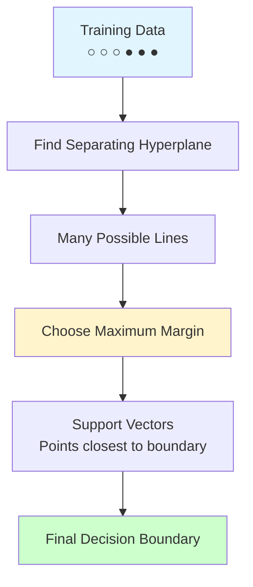

# Support Vector Machines (SVM)

**Find optimal hyperplane that maximizes margin between classes.** Powerful algorithm that can handle both linear and non-linear classification using the kernel trick. One of the most robust and versatile ML algorithms.

**Difficulty:** 🟡 Intermediate | **Time:** 4-5 hours | **Prerequisites:** Linear Algebra, Calculus, Optimization

---

## Overview

Support Vector Machines (SVM) find the hyperplane that best separates classes by maximizing the margin (distance) between classes. The support vectors (points closest to the boundary) define the decision boundary. Using kernels, SVM can handle non-linear problems.

**Use cases:** Image classification, text classification, bioinformatics, anomaly detection, face detection

---

## Intuition 💡

### The Big Idea

Among all possible lines/hyperplanes that separate two classes, choose the one with the **maximum margin** (widest street between classes). This provides the most robust separation.



### Real-World Analogy

Think of dividing a park into two sections with a fence:
- **Bad fence:** Close to one side → people can easily cross
- **Good fence:** Right in the middle, maximum space on both sides → clear separation
- **Support vectors:** Houses closest to fence that determine its position
- **Margin:** Width of buffer zone on both sides of fence

### Maximum Margin Visualization

```
Class 0: ○ ○ ○              Class 1: ● ● ●
         ○ ○ ○                       ● ● ●
           ○ ○○                     ●● ●

              |←  Margin  →|
         ○    |            |    ●
              |---LINE-----|         ← Decision boundary
         ○    |            |    ●
              |←  Margin  →|

Support Vectors: ○         ●
(closest points that define the margin)
```

---

## When to Use ✅ / When to Avoid ❌

### ✅ Good For

| Scenario | Why It Works |
|----------|--------------|
| **High-dimensional data** | Effective even when dims > samples |
| **Clear margin exists** | Works best with good class separation |
| **Non-linear boundaries** | Kernel trick handles complex shapes |
| **Small to medium datasets** | Memory efficient (only stores support vectors) |
| **Binary classification** | Naturally designed for two classes |
| **Robust to outliers** | Margin maximization provides robustness |

**Examples:**
- Text classification (spam detection, sentiment analysis)
- Image classification (face detection, OCR)
- Bioinformatics (protein classification, gene expression)
- Handwriting recognition

### ❌ Not Good For

| Scenario | Why It Fails |
|----------|--------------|
| **Large datasets (> 10K)** | Training time O(n²) to O(n³) |
| **Many classes** | One-vs-rest becomes inefficient |
| **Probability estimates** | Doesn't naturally output probabilities |
| **Noisy data** | Sensitive to overlapping classes |
| **Need interpretability** | Hard to interpret (especially with kernels) |

**When to use instead:**
- Large datasets: Logistic Regression, Random Forest, Neural Networks
- Many classes: Decision Trees, Random Forest
- Need probabilities: Logistic Regression, Naive Bayes
- Interpretability: Decision Trees, Logistic Regression

---

## Mathematical Foundation

### Linear SVM (Hard Margin)

**Objective:** Find hyperplane $w^T x + b = 0$ that maximizes margin.

**Margin:** Distance between hyperplane and nearest points:

$$\text{margin} = \frac{2}{||w||}$$

**Optimization Problem:**

$$\min_{w, b} \frac{1}{2}||w||^2$$

Subject to: $y_i(w^T x_i + b) \geq 1$ for all $i$

**Intuition:** Minimize $||w||$ (maximize margin) while correctly classifying all points.

### Soft Margin SVM

Real data isn't perfectly separable → allow some misclassifications.

**Optimization with Slack Variables:**

$$\min_{w, b, \xi} \frac{1}{2}||w||^2 + C\sum_{i=1}^{n}\xi_i$$

Subject to:
- $y_i(w^T x_i + b) \geq 1 - \xi_i$
- $\xi_i \geq 0$

Where:
- $\xi_i$ = slack variable (how much point violates margin)
- $C$ = regularization parameter (trade-off: margin vs errors)

**C Parameter:**
- Large $C$ → Small margin, fewer errors (risk overfitting)
- Small $C$ → Large margin, more errors (risk underfitting)

### Kernel Trick

Transform to higher dimension without explicit computation.

**Kernel Function:** $K(x_i, x_j) = \phi(x_i)^T \phi(x_j)$

**Common Kernels:**

**1. Linear Kernel:**
$$K(x_i, x_j) = x_i^T x_j$$

**2. Polynomial Kernel:**
$$K(x_i, x_j) = (x_i^T x_j + c)^d$$

**3. RBF (Gaussian) Kernel:**
$$K(x_i, x_j) = \exp\left(-\gamma ||x_i - x_j||^2\right)$$

**4. Sigmoid Kernel:**
$$K(x_i, x_j) = \tanh(\gamma x_i^T x_j + c)$$

### Hinge Loss

Loss function for SVM:

$$L(y, f(x)) = \max(0, 1 - y \cdot f(x))$$

- Correctly classified with margin > 1: Loss = 0
- Within margin or misclassified: Loss increases linearly

---

## Implementation

### Using Scikit-learn

=== "Linear SVM"

    ```python
    import numpy as np
    import matplotlib.pyplot as plt
    from sklearn.svm import SVC
    from sklearn.model_selection import train_test_split, GridSearchCV
    from sklearn.metrics import classification_report, confusion_matrix, accuracy_score
    from sklearn.datasets import make_classification
    from sklearn.preprocessing import StandardScaler

    # Generate data
    X, y = make_classification(
        n_samples=1000,
        n_features=20,
        n_informative=15,
        n_redundant=5,
        random_state=42
    )

    # Split data
    X_train, X_test, y_train, y_test = train_test_split(
        X, y, test_size=0.2, stratify=y, random_state=42
    )

    # IMPORTANT: Scale features!
    scaler = StandardScaler()
    X_train_scaled = scaler.fit_transform(X_train)
    X_test_scaled = scaler.transform(X_test)

    # Create and train linear SVM
    model = SVC(
        kernel='linear',
        C=1.0,           # Regularization
        random_state=42
    )
    model.fit(X_train_scaled, y_train)

    # Predictions
    y_pred = model.predict(X_test_scaled)

    # Evaluate
    print("Linear SVM Results:")
    print(f"Accuracy: {accuracy_score(y_test, y_pred):.3f}")
    print(f"\nNumber of Support Vectors: {model.n_support_}")
    print(f"Total Support Vectors: {np.sum(model.n_support_)}")

    print("\nClassification Report:")
    print(classification_report(y_test, y_pred))

    # Support vectors
    print(f"\nSupport vector indices: {model.support_[:10]}...")  # First 10
    ```

=== "RBF Kernel SVM"

    ```python
    # RBF (Radial Basis Function) kernel for non-linear data
    model_rbf = SVC(
        kernel='rbf',
        C=1.0,           # Regularization
        gamma='scale',   # Kernel coefficient (1/(n_features * X.var()))
        random_state=42
    )
    model_rbf.fit(X_train_scaled, y_train)

    y_pred_rbf = model_rbf.predict(X_test_scaled)

    print("RBF SVM Results:")
    print(f"Accuracy: {accuracy_score(y_test, y_pred_rbf):.3f}")
    print(f"Number of Support Vectors: {model_rbf.n_support_}")
    ```

=== "Polynomial Kernel"

    ```python
    # Polynomial kernel
    model_poly = SVC(
        kernel='poly',
        degree=3,        # Degree of polynomial
        C=1.0,
        gamma='scale',
        coef0=1,         # Independent term
        random_state=42
    )
    model_poly.fit(X_train_scaled, y_train)

    y_pred_poly = model_poly.predict(X_test_scaled)

    print("Polynomial SVM Results:")
    print(f"Accuracy: {accuracy_score(y_test, y_pred_poly):.3f}")
    ```

=== "Hyperparameter Tuning"

    ```python
    # Grid search for best parameters
    param_grid = {
        'C': [0.1, 1, 10, 100],
        'gamma': ['scale', 'auto', 0.001, 0.01, 0.1, 1],
        'kernel': ['rbf', 'poly', 'sigmoid']
    }

    grid_search = GridSearchCV(
        SVC(random_state=42),
        param_grid,
        cv=5,
        scoring='accuracy',
        n_jobs=-1,
        verbose=1
    )

    grid_search.fit(X_train_scaled, y_train)

    print("Best Parameters:")
    print(grid_search.best_params_)
    print(f"\nBest Cross-Validation Score: {grid_search.best_score_:.3f}")

    # Test best model
    best_model = grid_search.best_estimator_
    y_pred_best = best_model.predict(X_test_scaled)
    print(f"Test Accuracy: {accuracy_score(y_test, y_pred_best):.3f}")
    ```

=== "Probability Estimates"

    ```python
    # SVM with probability estimates (slower but provides probabilities)
    model_proba = SVC(
        kernel='rbf',
        C=1.0,
        probability=True,  # Enable probability estimates
        random_state=42
    )
    model_proba.fit(X_train_scaled, y_train)

    # Predict probabilities
    y_pred_proba = model_proba.predict_proba(X_test_scaled)

    print("Probability estimates for first 5 samples:")
    print(y_pred_proba[:5])

    # ROC AUC
    from sklearn.metrics import roc_auc_score
    print(f"\nROC-AUC: {roc_auc_score(y_test, y_pred_proba[:, 1]):.3f}")
    ```

### From Scratch (Simplified Linear SVM)

```python
class LinearSVMFromScratch:
    """Simplified Linear SVM using Gradient Descent"""

    def __init__(self, C=1.0, learning_rate=0.001, n_iterations=1000):
        self.C = C
        self.lr = learning_rate
        self.n_iterations = n_iterations
        self.w = None
        self.b = None
        self.losses = []

    def _hinge_loss(self, X, y):
        """Calculate hinge loss"""
        n_samples = X.shape[0]

        # Calculate distances
        distances = 1 - y * (np.dot(X, self.w) + self.b)

        # Hinge loss
        hinge_loss = np.maximum(0, distances)

        # Total loss: regularization + hinge loss
        loss = 0.5 * np.dot(self.w, self.w) + self.C * np.mean(hinge_loss)

        return loss

    def fit(self, X, y):
        """Train the SVM"""
        n_samples, n_features = X.shape

        # Convert labels to -1 and 1
        y_ = np.where(y <= 0, -1, 1)

        # Initialize parameters
        self.w = np.zeros(n_features)
        self.b = 0

        # Gradient descent
        for i in range(self.n_iterations):
            # Calculate loss
            loss = self._hinge_loss(X, y_)
            self.losses.append(loss)

            # Calculate gradients
            distances = 1 - y_ * (np.dot(X, self.w) + self.b)

            # Gradients
            dw = np.zeros(n_features)
            db = 0

            for idx, d in enumerate(distances):
                if d > 0:  # Misclassified or within margin
                    dw += -self.C * y_[idx] * X[idx]
                    db += -self.C * y_[idx]

            dw = self.w + dw / n_samples
            db = db / n_samples

            # Update parameters
            self.w -= self.lr * dw
            self.b -= self.lr * db

            if i % 100 == 0:
                print(f"Iteration {i}: Loss = {loss:.4f}")

        return self

    def predict(self, X):
        """Predict class labels"""
        linear_output = np.dot(X, self.w) + self.b
        return np.sign(linear_output).astype(int)

    def decision_function(self, X):
        """Calculate decision function values"""
        return np.dot(X, self.w) + self.b

# Usage
model_scratch = LinearSVMFromScratch(C=1.0, learning_rate=0.001, n_iterations=1000)
model_scratch.fit(X_train_scaled, y_train)

y_pred_scratch = model_scratch.predict(X_test_scaled)
y_pred_scratch = np.where(y_pred_scratch == -1, 0, 1)  # Convert back to 0/1

print(f"\nAccuracy (from scratch): {accuracy_score(y_test, y_pred_scratch):.3f}")

# Plot loss curve
plt.figure(figsize=(10, 6))
plt.plot(model_scratch.losses)
plt.xlabel('Iteration')
plt.ylabel('Loss (Hinge Loss)')
plt.title('Training Loss over Time')
plt.show()
```

---

## Visualization

### Decision Boundary with Support Vectors

```python
def plot_svm_boundary(X, y, model, title="SVM Decision Boundary"):
    """Visualize SVM decision boundary and support vectors"""
    # Create mesh
    h = 0.02
    x_min, x_max = X[:, 0].min() - 1, X[:, 0].max() + 1
    y_min, y_max = X[:, 1].min() - 1, X[:, 1].max() + 1

    xx, yy = np.meshgrid(
        np.arange(x_min, x_max, h),
        np.arange(y_min, y_max, h)
    )

    Z = model.predict(np.c_[xx.ravel(), yy.ravel()])
    Z = Z.reshape(xx.shape)

    plt.figure(figsize=(10, 6))

    # Plot decision boundary
    plt.contourf(xx, yy, Z, alpha=0.4, cmap='RdYlBu')

    # Plot data points
    plt.scatter(X[:, 0], X[:, 1], c=y, edgecolors='black', cmap='RdYlBu')

    # Plot support vectors
    plt.scatter(
        model.support_vectors_[:, 0],
        model.support_vectors_[:, 1],
        s=200,
        linewidth=2,
        facecolors='none',
        edgecolors='green',
        label='Support Vectors'
    )

    plt.xlabel('Feature 1')
    plt.ylabel('Feature 2')
    plt.title(title)
    plt.legend()
    plt.colorbar()
    plt.show()

# Example with 2D data
X_2d, y_2d = make_classification(
    n_samples=200,
    n_features=2,
    n_redundant=0,
    n_informative=2,
    random_state=42
)

scaler = StandardScaler()
X_2d_scaled = scaler.fit_transform(X_2d)

model_2d = SVC(kernel='linear', C=1.0)
model_2d.fit(X_2d_scaled, y_2d)
plot_svm_boundary(X_2d_scaled, y_2d, model_2d, "Linear SVM")
```

### Compare Different Kernels

```python
fig, axes = plt.subplots(2, 2, figsize=(15, 12))
kernels = ['linear', 'rbf', 'poly', 'sigmoid']

for ax, kernel in zip(axes.ravel(), kernels):
    model_kernel = SVC(kernel=kernel, C=1.0, gamma='scale')
    model_kernel.fit(X_2d_scaled, y_2d)

    # Create mesh
    h = 0.02
    x_min, x_max = X_2d_scaled[:, 0].min() - 1, X_2d_scaled[:, 0].max() + 1
    y_min, y_max = X_2d_scaled[:, 1].min() - 1, X_2d_scaled[:, 1].max() + 1
    xx, yy = np.meshgrid(np.arange(x_min, x_max, h), np.arange(y_min, y_max, h))

    Z = model_kernel.predict(np.c_[xx.ravel(), yy.ravel()])
    Z = Z.reshape(xx.shape)

    ax.contourf(xx, yy, Z, alpha=0.4, cmap='RdYlBu')
    ax.scatter(X_2d_scaled[:, 0], X_2d_scaled[:, 1], c=y_2d, edgecolors='black', cmap='RdYlBu')
    ax.scatter(
        model_kernel.support_vectors_[:, 0],
        model_kernel.support_vectors_[:, 1],
        s=200,
        linewidth=2,
        facecolors='none',
        edgecolors='green'
    )
    ax.set_title(f'{kernel.capitalize()} Kernel (SVs: {len(model_kernel.support_vectors_)})')
    ax.set_xlabel('Feature 1')
    ax.set_ylabel('Feature 2')

plt.tight_layout()
plt.show()
```

### Effect of C Parameter

```python
fig, axes = plt.subplots(2, 2, figsize=(15, 12))
C_values = [0.1, 1, 10, 100]

for ax, C in zip(axes.ravel(), C_values):
    model_C = SVC(kernel='rbf', C=C, gamma='scale')
    model_C.fit(X_2d_scaled, y_2d)

    # Create mesh
    h = 0.02
    x_min, x_max = X_2d_scaled[:, 0].min() - 1, X_2d_scaled[:, 0].max() + 1
    y_min, y_max = X_2d_scaled[:, 1].min() - 1, X_2d_scaled[:, 1].max() + 1
    xx, yy = np.meshgrid(np.arange(x_min, x_max, h), np.arange(y_min, y_max, h))

    Z = model_C.predict(np.c_[xx.ravel(), yy.ravel()])
    Z = Z.reshape(xx.shape)

    ax.contourf(xx, yy, Z, alpha=0.4, cmap='RdYlBu')
    ax.scatter(X_2d_scaled[:, 0], X_2d_scaled[:, 1], c=y_2d, edgecolors='black', cmap='RdYlBu')
    ax.scatter(
        model_C.support_vectors_[:, 0],
        model_C.support_vectors_[:, 1],
        s=200,
        linewidth=2,
        facecolors='none',
        edgecolors='green'
    )
    ax.set_title(f'C = {C} (SVs: {len(model_C.support_vectors_)})')
    ax.set_xlabel('Feature 1')
    ax.set_ylabel('Feature 2')

plt.tight_layout()
plt.show()
```

---

## Hyperparameters

### Key Parameters

| Parameter | What It Does | Default | Tips |
|-----------|--------------|---------|------|
| `C` | Regularization strength | 1.0 | Small=large margin, Large=small margin/fewer errors |
| `kernel` | Kernel function | 'rbf' | 'linear', 'rbf', 'poly', 'sigmoid' |
| `gamma` | Kernel coefficient (RBF, poly, sigmoid) | 'scale' | 'scale', 'auto', or float. High=overfitting |
| `degree` | Degree of polynomial kernel | 3 | Only for 'poly' kernel |
| `coef0` | Independent term in kernel | 0.0 | For 'poly' and 'sigmoid' |
| `probability` | Enable probability estimates | False | Set True for predict_proba (slower) |

### C vs Gamma

```python
# Visualize C and gamma effects
from sklearn.model_selection import validation_curve

# C parameter
C_range = np.logspace(-2, 3, 6)
train_scores, test_scores = validation_curve(
    SVC(kernel='rbf', gamma='scale'),
    X_train_scaled, y_train,
    param_name='C',
    param_range=C_range,
    cv=5
)

plt.figure(figsize=(15, 5))

plt.subplot(1, 2, 1)
plt.plot(C_range, train_scores.mean(axis=1), label='Training', marker='o')
plt.plot(C_range, test_scores.mean(axis=1), label='Validation', marker='s')
plt.xlabel('C (Regularization)')
plt.ylabel('Accuracy')
plt.xscale('log')
plt.title('Effect of C Parameter')
plt.legend()
plt.grid(True)

# Gamma parameter
gamma_range = np.logspace(-3, 1, 5)
train_scores, test_scores = validation_curve(
    SVC(kernel='rbf', C=1.0),
    X_train_scaled, y_train,
    param_name='gamma',
    param_range=gamma_range,
    cv=5
)

plt.subplot(1, 2, 2)
plt.plot(gamma_range, train_scores.mean(axis=1), label='Training', marker='o')
plt.plot(gamma_range, test_scores.mean(axis=1), label='Validation', marker='s')
plt.xlabel('Gamma')
plt.ylabel('Accuracy')
plt.xscale('log')
plt.title('Effect of Gamma Parameter')
plt.legend()
plt.grid(True)

plt.tight_layout()
plt.show()
```

---

## Complexity Analysis

**Time Complexity:**
- Training: $O(n^2)$ to $O(n^3)$ where $n$ = samples
- Prediction: $O(n_{sv} \cdot d)$ where $n_{sv}$ = support vectors, $d$ = features

**Space Complexity:** $O(n_{sv} \cdot d)$ (only stores support vectors)

**Key Trade-off:** Slow training but fast prediction (if few support vectors)

---

## Common Pitfalls

### 1. Not Scaling Features

!!! warning "Critical for SVM!"
    **Problem:** SVM uses distances, so unscaled features dominate.

    **Solution:** ALWAYS scale

    ```python
    from sklearn.preprocessing import StandardScaler

    scaler = StandardScaler()
    X_train_scaled = scaler.fit_transform(X_train)
    X_test_scaled = scaler.transform(X_test)
    ```

### 2. Wrong C and Gamma

!!! warning "Overfitting or Underfitting"
    **Problem:**
    - High C + High gamma → Overfitting (too complex)
    - Low C + Low gamma → Underfitting (too simple)

    **Solution:** Use GridSearchCV

    ```python
    param_grid = {
        'C': [0.1, 1, 10, 100],
        'gamma': [0.001, 0.01, 0.1, 1]
    }
    grid_search = GridSearchCV(SVC(kernel='rbf'), param_grid, cv=5)
    ```

### 3. Using SVM on Large Datasets

!!! warning "Training Takes Forever!"
    **Problem:** O(n²) to O(n³) complexity → slow for large n

    **Solution:**
    - Use LinearSVC (optimized for linear kernel)
    - Sample data
    - Use different algorithm (Logistic Regression, Random Forest)

    ```python
    from sklearn.svm import LinearSVC

    # Much faster for linear kernel
    model = LinearSVC(C=1.0, max_iter=1000)
    ```

### 4. Choosing Wrong Kernel

!!! warning "Kernel Selection Matters"
    **Guidelines:**
    - Linear: Linear relationships, high dimensions, text
    - RBF: General purpose, non-linear
    - Polynomial: Specific non-linear patterns
    - Sigmoid: Neural network-like

    **Try this order:** Linear → RBF → Polynomial

### 5. Imbalanced Classes

!!! warning "Biased Toward Majority"
    **Solution:** Use `class_weight='balanced'`

    ```python
    model = SVC(kernel='rbf', C=1.0, class_weight='balanced')
    ```

---

## Practice Problems

### 🟢 Beginner

!!! example "Problem 1: Iris with Linear SVM"
    Apply linear SVM to Iris dataset.

    **Tasks:**
    1. Scale features
    2. Train linear SVM
    3. Identify support vectors
    4. Visualize decision boundary

!!! example "Problem 2: Kernel Comparison"
    Compare different kernels on same dataset.

    **Tasks:**
    1. Try linear, RBF, polynomial
    2. Compare accuracy
    3. Count support vectors for each
    4. When does each work best?

### 🟡 Intermediate

!!! example "Problem 3: Hyperparameter Tuning"
    Optimize C and gamma for RBF kernel.

    **Tasks:**
    1. Grid search over C and gamma
    2. Plot validation curves
    3. Analyze overfitting/underfitting
    4. Test on holdout set

!!! example "Problem 4: Multi-class Classification"
    Use SVM for multi-class problem (10 classes).

    **Tasks:**
    1. Understand one-vs-rest strategy
    2. Train and evaluate
    3. Analyze confusion matrix
    4. Compare with Decision Tree

### 🔴 Advanced

!!! example "Problem 5: Text Classification"
    Spam detection with SVM.

    **Tasks:**
    1. TF-IDF vectorization
    2. Linear SVM (high dimensions)
    3. Handle imbalanced classes
    4. Compare with Naive Bayes
    5. Analyze most important features

!!! example "Problem 6: Custom Kernel"
    Implement custom kernel for special data.

    **Tasks:**
    1. Define custom kernel function
    2. Implement in sklearn
    3. Compare with standard kernels
    4. Analyze when custom kernel helps

---

## Related Topics

- [Logistic Regression](logistic-regression.md) - Linear classifier alternative
- Kernel Methods - Mathematical foundation
- Optimization - SVM optimization
- Feature Scaling - Required preprocessing
- Text Classification - SVM for NLP

---

## References

1. **Scikit-learn:** [SVM](https://scikit-learn.org/stable/modules/svm.html)
2. **Paper:** "Support-Vector Networks" by Cortes & Vapnik (1995)
3. **Book:** *Learning with Kernels* by Schölkopf & Smola
4. **Tutorial:** [Understanding SVM](https://towardsdatascience.com/support-vector-machine-introduction-to-machine-learning-algorithms-934a444fca47)
5. **Interactive:** [SVM Visualizer](https://cs.stanford.edu/people/karpathy/svmjs/demo/)

---

**Next Steps:**
- Try [Kaggle Digit Recognizer](https://www.kaggle.com/c/digit-recognizer)
- Learn [Random Forest](random-forest.md) for faster training
- Explore Kernel Methods deeply

**Master maximum margin classification with SVM!** 🎯
