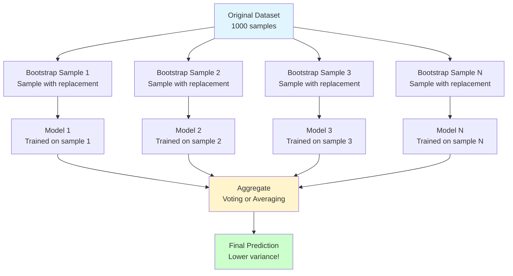

# Bagging (Bootstrap Aggregating)

**Reduce variance by training multiple models on different data subsets.** Bagging is the foundation of Random Forest and a powerful technique to combat overfitting.

**Difficulty:** 🟡 Intermediate | **Time:** 3-4 hours | **Prerequisites:** Decision Trees, Basic Statistics

---

## Overview

Bagging creates multiple versions of a predictor by training on bootstrap samples of the data, then aggregates their predictions through voting (classification) or averaging (regression). It's particularly effective for unstable models like decision trees.

**Core idea:** Many slightly different models average out their individual errors.

**Use cases:** Random Forest, bagging decision trees, stabilizing any high-variance model

---

## Intuition 💡

### The Big Idea

Imagine asking 10 slightly different experts for advice. Each expert learned from slightly different experiences (data subsets). Their individual opinions might vary, but their collective average is more reliable than any single expert.



### Real-World Analogy

**Stock Market Predictions:**
- **Single analyst:** Predicts based on one perspective, might be biased
- **10 analysts (each with different data samples):** Each makes slightly different predictions
- **Aggregated forecast:** Average of all predictions is more stable and accurate

### Bootstrap Sampling Visualization

```python
Original Data: [1, 2, 3, 4, 5, 6, 7, 8, 9, 10]

Bootstrap Sample 1: [1, 1, 3, 5, 6, 7, 8, 9, 9, 10]  # Some repeated, some missing
Bootstrap Sample 2: [2, 2, 3, 4, 5, 6, 7, 8, 10, 10]
Bootstrap Sample 3: [1, 3, 3, 4, 5, 6, 7, 8, 9, 10]

Each sample:
- Same size as original
- Sampling WITH replacement
- ~63% unique samples, ~37% out-of-bag
```

---

## When to Use ✅ / When to Avoid ❌

### ✅ Good For

| Scenario | Why It Works |
|----------|--------------|
| **High variance models** | Decision trees prone to overfitting → bagging stabilizes |
| **Unstable models** | Small data changes cause big prediction changes → averaging helps |
| **Reduce overfitting** | Averaging multiple models smooths out individual quirks |
| **Parallel training** | All models train independently → can use multiple CPUs |
| **Feature importance** | Can aggregate importance across all models |
| **Out-of-bag validation** | Free validation set without holdout data |

**Examples:**
- Deep decision trees (Random Forest)
- Neural networks (ensemble)
- SVM models
- Any algorithm sensitive to training data

### ❌ Not Good For

| Scenario | Why It Fails |
|----------|--------------|
| **High bias models** | Can't fix underfitting → boosting is better |
| **Linear models** | Already stable, bagging adds little value |
| **Need interpretability** | Multiple models harder to explain than single model |
| **Very limited data** | Bootstrap might not provide enough diversity |
| **Real-time prediction** | Need to run N models → N times slower |

**When to use instead:**
- High bias: Boosting (AdaBoost, XGBoost)
- Linear relationships: Linear/Logistic Regression
- Need interpretability: Single decision tree with max_depth
- Need speed: Single optimized model

---

## Mathematical Foundation

### Bootstrap Sampling

**Bootstrap:** Sample with replacement from dataset of size $n$ to create new dataset of size $n$.

$$\text{Bootstrap Sample } B_i = \{x_{j_1}, x_{j_2}, ..., x_{j_n}\}$$

Where each $j_k$ is randomly selected from $\{1, 2, ..., n\}$ with replacement.

**Key Property:** Each bootstrap sample contains approximately **63.2%** unique samples from original data.

$$P(\text{sample selected at least once}) = 1 - (1 - \frac{1}{n})^n \approx 1 - \frac{1}{e} \approx 0.632$$

### Aggregation

**Classification (Voting):**

$$\hat{y} = \text{mode}(h_1(x), h_2(x), ..., h_B(x))$$

Where $h_i$ is the prediction of model $i$, and $B$ is the number of models.

**Regression (Averaging):**

$$\hat{y} = \frac{1}{B}\sum_{i=1}^{B}h_i(x)$$

### Variance Reduction

For independent models with variance $\sigma^2$:

$$\text{Var}(\text{average}) = \frac{\sigma^2}{B}$$

Where $B$ is the number of models.

**In practice:** Models are correlated, so reduction is less dramatic but still significant.

$$\text{Var}(\text{bagged}) = \rho\sigma^2 + \frac{1-\rho}{B}\sigma^2$$

Where $\rho$ is the correlation between models. Lower correlation → better variance reduction!

### Out-of-Bag (OOB) Estimation

Each bootstrap sample omits ~37% of data. These **out-of-bag** samples provide free validation:

$$\text{OOB Error} = \frac{1}{n}\sum_{i=1}^{n}\mathbb{1}(\hat{y}_i^{OOB} \neq y_i)$$

Where $\hat{y}_i^{OOB}$ is the prediction for sample $i$ using only models that didn't see it in training.

---

## Implementation

### Using Scikit-learn

```python
import numpy as np
import matplotlib.pyplot as plt
from sklearn.ensemble import BaggingClassifier, BaggingRegressor
from sklearn.tree import DecisionTreeClassifier, DecisionTreeRegressor
from sklearn.model_selection import train_test_split, cross_val_score
from sklearn.metrics import accuracy_score, mean_squared_error
from sklearn.datasets import make_classification, make_regression

# Generate classification data
X, y = make_classification(
    n_samples=1000,
    n_features=20,
    n_informative=15,
    n_redundant=5,
    random_state=42
)

X_train, X_test, y_train, y_test = train_test_split(
    X, y, test_size=0.2, random_state=42
)

# Single decision tree (baseline)
single_tree = DecisionTreeClassifier(random_state=42)
single_tree.fit(X_train, y_train)
single_acc = accuracy_score(y_test, single_tree.predict(X_test))
print(f"Single Tree Accuracy: {single_acc:.3f}")

# Bagging ensemble
bagging_model = BaggingClassifier(
    base_estimator=DecisionTreeClassifier(),
    n_estimators=50,           # Number of models in ensemble
    max_samples=0.8,           # Use 80% of data for each model
    max_features=0.8,          # Use 80% of features for each model
    bootstrap=True,            # Sample with replacement
    bootstrap_features=False,  # Don't bootstrap features
    oob_score=True,           # Compute out-of-bag score
    n_jobs=-1,                # Use all CPU cores
    random_state=42
)

bagging_model.fit(X_train, y_train)

# Evaluate
bagging_acc = accuracy_score(y_test, bagging_model.predict(X_test))
print(f"Bagging Accuracy: {bagging_acc:.3f}")
print(f"OOB Score: {bagging_model.oob_score_:.3f}")
print(f"Improvement: {(bagging_acc - single_acc)*100:.1f}%")

# Predict with individual estimators
predictions = np.array([
    estimator.predict(X_test) for estimator in bagging_model.estimators_
])
print(f"\nPrediction diversity (std): {np.std(predictions, axis=0).mean():.3f}")
```

### Bagging for Regression

```python
# Generate regression data
X_reg, y_reg = make_regression(
    n_samples=500,
    n_features=10,
    n_informative=8,
    noise=10,
    random_state=42
)

X_train_r, X_test_r, y_train_r, y_test_r = train_test_split(
    X_reg, y_reg, test_size=0.2, random_state=42
)

# Single tree
single_tree_reg = DecisionTreeRegressor(random_state=42)
single_tree_reg.fit(X_train_r, y_train_r)
single_mse = mean_squared_error(y_test_r, single_tree_reg.predict(X_test_r))
print(f"Single Tree MSE: {single_mse:.2f}")

# Bagging regressor
bagging_reg = BaggingRegressor(
    base_estimator=DecisionTreeRegressor(),
    n_estimators=50,
    max_samples=0.8,
    oob_score=True,
    n_jobs=-1,
    random_state=42
)

bagging_reg.fit(X_train_r, y_train_r)
bagging_mse = mean_squared_error(y_test_r, bagging_reg.predict(X_test_r))
print(f"Bagging MSE: {bagging_mse:.2f}")
print(f"OOB Score (R²): {bagging_reg.oob_score_:.3f}")
print(f"Error Reduction: {((single_mse - bagging_mse)/single_mse)*100:.1f}%")
```

---

## From Scratch Implementation

### Bagging Classifier from Scratch

```python
class BaggingClassifierScratch:
    """Bagging Classifier implemented from scratch"""

    def __init__(self, base_estimator=None, n_estimators=10, max_samples=1.0,
                 random_state=None):
        self.base_estimator = base_estimator
        self.n_estimators = n_estimators
        self.max_samples = max_samples
        self.random_state = random_state
        self.estimators_ = []
        self.oob_predictions_ = None

    def _bootstrap_sample(self, X, y, rng):
        """Create bootstrap sample"""
        n_samples = int(len(X) * self.max_samples)
        indices = rng.choice(len(X), size=n_samples, replace=True)
        oob_indices = list(set(range(len(X))) - set(indices))
        return X[indices], y[indices], oob_indices

    def fit(self, X, y):
        """Train bagging ensemble"""
        rng = np.random.RandomState(self.random_state)

        # Store OOB predictions for each sample
        self.oob_predictions_ = [[] for _ in range(len(X))]

        # Train each estimator
        for i in range(self.n_estimators):
            # Create bootstrap sample
            X_boot, y_boot, oob_indices = self._bootstrap_sample(X, y, rng)

            # Clone and train base estimator
            from sklearn.base import clone
            estimator = clone(self.base_estimator)
            estimator.fit(X_boot, y_boot)
            self.estimators_.append(estimator)

            # Collect OOB predictions
            if len(oob_indices) > 0:
                oob_pred = estimator.predict(X[oob_indices])
                for idx, pred in zip(oob_indices, oob_pred):
                    self.oob_predictions_[idx].append(pred)

        return self

    def predict(self, X):
        """Predict by majority voting"""
        # Get predictions from all estimators
        predictions = np.array([
            estimator.predict(X) for estimator in self.estimators_
        ])

        # Majority vote
        from scipy import stats
        final_predictions = stats.mode(predictions, axis=0)[0].ravel()
        return final_predictions

    def oob_score(self, y_true):
        """Calculate out-of-bag score"""
        oob_preds = []
        valid_samples = []

        for i, preds in enumerate(self.oob_predictions_):
            if len(preds) > 0:
                from scipy import stats
                oob_preds.append(stats.mode(preds)[0][0])
                valid_samples.append(i)

        if len(valid_samples) == 0:
            return None

        y_valid = y_true[valid_samples]
        return np.mean(np.array(oob_preds) == y_valid)

# Usage
from sklearn.tree import DecisionTreeClassifier

bagging_scratch = BaggingClassifierScratch(
    base_estimator=DecisionTreeClassifier(max_depth=10),
    n_estimators=50,
    max_samples=0.8,
    random_state=42
)

bagging_scratch.fit(X_train, y_train)
y_pred_scratch = bagging_scratch.predict(X_test)
scratch_acc = accuracy_score(y_test, y_pred_scratch)
print(f"\nFrom Scratch Accuracy: {scratch_acc:.3f}")
print(f"OOB Score: {bagging_scratch.oob_score(y_train):.3f}")
```

---

## Visualization

### Bootstrap Sample Distribution

```python
def visualize_bootstrap():
    """Show how bootstrap sampling works"""
    original = np.arange(1, 11)
    n_bootstraps = 5

    fig, axes = plt.subplots(n_bootstraps + 1, 1, figsize=(12, 8))

    # Original data
    axes[0].bar(range(len(original)), original, color='steelblue', alpha=0.7)
    axes[0].set_title('Original Data', fontsize=12, fontweight='bold')
    axes[0].set_ylabel('Value')
    axes[0].set_xticks(range(len(original)))
    axes[0].set_xticklabels(original)

    # Bootstrap samples
    for i in range(n_bootstraps):
        bootstrap = np.random.choice(original, size=len(original), replace=True)
        unique, counts = np.unique(bootstrap, return_counts=True)

        axes[i+1].bar(unique - 1, counts, color='coral', alpha=0.7)
        axes[i+1].set_title(f'Bootstrap Sample {i+1}', fontsize=10)
        axes[i+1].set_ylabel('Frequency')
        axes[i+1].set_xticks(range(len(original)))
        axes[i+1].set_xticklabels(original)
        axes[i+1].set_ylim(0, 3)

        # Mark OOB samples
        oob = set(original) - set(bootstrap)
        if oob:
            axes[i+1].text(0.02, 0.95, f'OOB: {sorted(oob)}',
                          transform=axes[i+1].transAxes,
                          fontsize=8, verticalalignment='top',
                          bbox=dict(boxstyle='round', facecolor='wheat', alpha=0.5))

    plt.tight_layout()
    plt.savefig('bootstrap_sampling.png', dpi=150, bbox_inches='tight')
    plt.show()

visualize_bootstrap()
```

### Variance Reduction Visualization

```python
def plot_variance_reduction():
    """Show how bagging reduces variance"""
    n_estimators_range = range(1, 101)
    n_trials = 20

    single_errors = []
    bagging_errors = []

    for n_est in n_estimators_range:
        trial_errors = []
        for _ in range(n_trials):
            # Create data with some noise
            X, y = make_classification(n_samples=200, n_features=20,
                                      random_state=np.random.randint(1000))
            X_train, X_test, y_train, y_test = train_test_split(
                X, y, test_size=0.3, random_state=42
            )

            # Bagging
            bag = BaggingClassifier(
                base_estimator=DecisionTreeClassifier(),
                n_estimators=n_est,
                random_state=42
            )
            bag.fit(X_train, y_train)
            error = 1 - bag.score(X_test, y_test)
            trial_errors.append(error)

        bagging_errors.append(np.mean(trial_errors))
        if n_est == 1:
            single_errors.extend(trial_errors)

    plt.figure(figsize=(12, 6))

    # Plot variance across trials for single model
    plt.subplot(1, 2, 1)
    plt.hist(single_errors, bins=15, color='coral', alpha=0.7, edgecolor='black')
    plt.axvline(np.mean(single_errors), color='red', linestyle='--',
                linewidth=2, label=f'Mean: {np.mean(single_errors):.3f}')
    plt.xlabel('Error Rate')
    plt.ylabel('Frequency')
    plt.title('Single Tree - High Variance')
    plt.legend()

    # Plot error vs number of estimators
    plt.subplot(1, 2, 2)
    plt.plot(n_estimators_range, bagging_errors, linewidth=2, color='steelblue')
    plt.axhline(np.mean(single_errors), color='red', linestyle='--',
                label='Single Tree Average')
    plt.xlabel('Number of Estimators')
    plt.ylabel('Average Error Rate')
    plt.title('Bagging - Variance Reduction')
    plt.grid(True, alpha=0.3)
    plt.legend()

    plt.tight_layout()
    plt.savefig('variance_reduction.png', dpi=150, bbox_inches='tight')
    plt.show()

plot_variance_reduction()
```

### OOB Error vs Test Error

```python
def plot_oob_vs_test_error():
    """Compare OOB error with test set error"""
    n_estimators_range = range(1, 101, 5)
    oob_errors = []
    test_errors = []

    for n_est in n_estimators_range:
        bag = BaggingClassifier(
            base_estimator=DecisionTreeClassifier(),
            n_estimators=n_est,
            oob_score=True,
            random_state=42
        )
        bag.fit(X_train, y_train)

        oob_errors.append(1 - bag.oob_score_)
        test_errors.append(1 - bag.score(X_test, y_test))

    plt.figure(figsize=(10, 6))
    plt.plot(n_estimators_range, oob_errors, 'o-', label='OOB Error',
             linewidth=2, markersize=6)
    plt.plot(n_estimators_range, test_errors, 's-', label='Test Error',
             linewidth=2, markersize=6)
    plt.xlabel('Number of Estimators')
    plt.ylabel('Error Rate')
    plt.title('OOB Error vs Test Error')
    plt.legend()
    plt.grid(True, alpha=0.3)
    plt.savefig('oob_vs_test.png', dpi=150, bbox_inches='tight')
    plt.show()

plot_oob_vs_test_error()
```

---

## Random Forest: Bagging's Most Famous Child

### What Makes Random Forest Special?

Random Forest = Bagging + **Random Feature Selection**

**Key difference:** At each split in each tree, only consider a random subset of features.

```python
# Bagging: Uses all features
bagging = BaggingClassifier(
    base_estimator=DecisionTreeClassifier(),
    n_estimators=100
)

# Random Forest: Random feature subset at each split
from sklearn.ensemble import RandomForestClassifier
rf = RandomForestClassifier(
    n_estimators=100,
    max_features='sqrt'  # √n features at each split
)
```

**Why this helps:** Further decorrelates trees → better variance reduction!

### Comparison Example

```python
from sklearn.ensemble import RandomForestClassifier

# 1. Bagging with decision trees
bagging = BaggingClassifier(
    base_estimator=DecisionTreeClassifier(),
    n_estimators=100,
    random_state=42
)

# 2. Random Forest
rf = RandomForestClassifier(
    n_estimators=100,
    random_state=42
)

# Compare
bagging.fit(X_train, y_train)
rf.fit(X_train, y_train)

print(f"Bagging Accuracy: {bagging.score(X_test, y_test):.3f}")
print(f"Random Forest Accuracy: {rf.score(X_test, y_test):.3f}")

# Random Forest usually wins due to better decorrelation!
```

---

## Hyperparameters

### Key Parameters

| Parameter | What It Does | Typical Range | Tips |
|-----------|--------------|---------------|------|
| `n_estimators` | Number of models in ensemble | 10-500 | More is better but diminishing returns after 100 |
| `max_samples` | Fraction of samples for each model | 0.5-1.0 | Lower = more diversity, higher = more data |
| `max_features` | Fraction of features for each model | 0.5-1.0 | Lower = more diversity (like Random Forest) |
| `bootstrap` | Whether to use bootstrap sampling | True/False | Always True for bagging |
| `bootstrap_features` | Bootstrap features too | True/False | False usually better |
| `oob_score` | Calculate out-of-bag score | True/False | True for free validation |
| `n_jobs` | Number of parallel jobs | -1 | Use -1 for all cores |

### Tuning Example

```python
from sklearn.model_selection import GridSearchCV

# Define parameter grid
param_grid = {
    'n_estimators': [10, 50, 100, 200],
    'max_samples': [0.5, 0.7, 0.9, 1.0],
    'max_features': [0.5, 0.7, 0.9, 1.0]
}

# Grid search
grid_search = GridSearchCV(
    BaggingClassifier(
        base_estimator=DecisionTreeClassifier(),
        oob_score=True,
        n_jobs=-1
    ),
    param_grid=param_grid,
    cv=5,
    scoring='accuracy',
    n_jobs=-1
)

grid_search.fit(X_train, y_train)
print(f"Best parameters: {grid_search.best_params_}")
print(f"Best CV score: {grid_search.best_score_:.3f}")
print(f"Test score: {grid_search.score(X_test, y_test):.3f}")
```

---

## Common Pitfalls

### 1. Using Stable Models as Base Learners

!!! warning "Bagging Stable Models is Ineffective"
    **Problem:** Bagging Linear Regression or Logistic Regression adds little value.

    **Why:** These models are already stable; different bootstrap samples give similar models.

    **Solution:** Use bagging with high-variance models like:
    - Deep decision trees
    - Neural networks
    - k-NN with small k

    ```python
    # ❌ Bad: Bagging logistic regression
    from sklearn.linear_model import LogisticRegression
    bad_bagging = BaggingClassifier(LogisticRegression())

    # ✅ Good: Bagging decision trees
    good_bagging = BaggingClassifier(DecisionTreeClassifier())
    ```

### 2. Too Few Estimators

!!! warning "Insufficient Ensemble Size"
    **Problem:** Using only 5-10 estimators doesn't provide enough averaging.

    **Solution:** Use at least 50-100 estimators. Plot learning curve to find optimal number.

    ```python
    # Plot error vs number of estimators
    errors = []
    for n in range(1, 201, 10):
        bag = BaggingClassifier(n_estimators=n)
        bag.fit(X_train, y_train)
        errors.append(1 - bag.score(X_test, y_test))

    plt.plot(range(1, 201, 10), errors)
    plt.xlabel('Number of Estimators')
    plt.ylabel('Error Rate')
    plt.title('Find Optimal Number of Estimators')
    plt.show()
    ```

### 3. Not Using OOB Evaluation

!!! warning "Wasting the Free Validation Set"
    **Problem:** Creating separate validation set when OOB gives free estimate.

    **Solution:** Use `oob_score=True` to get validation estimate without holdout.

    ```python
    # Use OOB score instead of separate validation set
    bagging = BaggingClassifier(
        n_estimators=100,
        oob_score=True  # Enable OOB evaluation
    )
    bagging.fit(X_train, y_train)

    print(f"OOB Score: {bagging.oob_score_:.3f}")  # Free validation!
    print(f"Test Score: {bagging.score(X_test, y_test):.3f}")
    # OOB score is usually close to test score
    ```

### 4. Forgetting to Scale Features for Distance-Based Models

!!! warning "Unscaled Features in Bagged k-NN"
    **Problem:** If base learner is distance-based (k-NN, SVM), unscaled features hurt performance.

    **Solution:** Scale features before bagging.

    ```python
    from sklearn.preprocessing import StandardScaler
    from sklearn.neighbors import KNeighborsClassifier
    from sklearn.pipeline import Pipeline

    # Create pipeline with scaling
    bagged_knn = BaggingClassifier(
        base_estimator=Pipeline([
            ('scaler', StandardScaler()),
            ('knn', KNeighborsClassifier())
        ]),
        n_estimators=50
    )
    ```

### 5. Not Considering Computational Cost

!!! warning "Bagging is N Times Slower"
    **Problem:** Training 100 models takes 100x time; prediction is 100x slower.

    **Solution:**
    - Use `n_jobs=-1` for parallel training
    - Balance performance vs. speed (maybe 50 estimators is enough)
    - Consider pruning ensemble (keep best performers)

    ```python
    # Parallel training
    bagging = BaggingClassifier(
        n_estimators=100,
        n_jobs=-1  # Use all CPU cores
    )

    # For production: consider smaller ensemble
    production_bagging = BaggingClassifier(
        n_estimators=20  # Faster but still effective
    )
    ```

---

## Practice Problems

### 🟢 Beginner

!!! example "Problem 1: Single Tree vs Bagging"
    **Goal:** See variance reduction in action

    **Tasks:**
    1. Load iris dataset
    2. Train a single deep decision tree (no max_depth)
    3. Train bagging ensemble with 50 trees
    4. Compare test accuracy across 10 different random splits
    5. Calculate mean and std of accuracy for both

    **Observation:** Bagging should have similar mean but lower std!

!!! example "Problem 2: Explore OOB Scores"
    **Goal:** Understand out-of-bag evaluation

    **Tasks:**
    1. Train bagging with `oob_score=True`
    2. Compare OOB score with test score
    3. Try different `max_samples` values
    4. Plot OOB score vs test score for different settings

### 🟡 Intermediate

!!! example "Problem 3: Hyperparameter Tuning"
    **Goal:** Find optimal bagging configuration

    **Tasks:**
    1. Load a real dataset (e.g., from UCI ML Repository)
    2. Use GridSearchCV to tune:
       - `n_estimators`: [10, 50, 100, 200]
       - `max_samples`: [0.5, 0.7, 0.9]
       - `max_features`: [0.5, 0.7, 0.9]
    3. Plot heatmaps of performance
    4. Identify optimal configuration

!!! example "Problem 4: Bagging Different Base Learners"
    **Goal:** Compare bagging with different algorithms

    **Tasks:**
    1. Create bagging ensembles with:
       - Decision trees
       - k-NN
       - SVM
    2. Compare performance improvement from bagging for each
    3. Which base learner benefits most from bagging?

### 🔴 Advanced

!!! example "Problem 5: Implement Feature Importance Aggregation"
    **Goal:** Aggregate feature importance across bagged models

    **Tasks:**
    1. Train bagging ensemble
    2. Extract feature importance from each tree
    3. Compute mean and std of importance
    4. Visualize with error bars
    5. Compare with Random Forest's built-in feature importance

!!! example "Problem 6: Build Custom Bagging Variant"
    **Goal:** Create a custom bagging implementation

    **Tasks:**
    1. Implement bagging with:
       - Different aggregation methods (weighted voting)
       - Feature bootstrapping
       - Stratified sampling for imbalanced data
    2. Compare with sklearn's BaggingClassifier
    3. Test on imbalanced dataset

---

## Real-World Applications

### Industry Use Cases

| Domain | Application | Why Bagging |
|--------|-------------|-------------|
| **Finance** | Credit scoring | Reduce variance in risk predictions |
| **Healthcare** | Disease diagnosis | More robust than single model |
| **E-commerce** | Product recommendations | Handle diverse user patterns |
| **Manufacturing** | Quality control | Stable predictions from sensor data |
| **Insurance** | Claim prediction | Reduce overfitting on historical data |

### Success Stories

**Random Forest in Production:**
- **Netflix:** Movie recommendations
- **Microsoft:** Kinect gesture recognition
- **Amazon:** Product recommendations
- **NASA:** Mars rover navigation

---

## Complexity Analysis

### Time Complexity

| Operation | Single Model | Bagging (B models) |
|-----------|-------------|-------------------|
| **Training** | $O(n \log n \cdot m)$ | $O(B \cdot n \log n \cdot m)$ |
| **Prediction** | $O(\log n)$ | $O(B \cdot \log n)$ |
| **OOB Evaluation** | N/A | $O(B \cdot n \log n \cdot m)$ |

Where: $n$ = samples, $m$ = features, $B$ = number of estimators

**Note:** Training can be parallelized → wall-clock time ≈ single model (with enough CPUs)

### Space Complexity

- **Storage:** $O(B \cdot S)$ where $S$ is single model size
- **Memory during training:** $O(B \cdot n \cdot m)$ for bootstrap samples

---

## Related Topics

- [Random Forest](../classification/random-forest.md) - Bagging + random feature selection
- [Boosting](boosting.md) - Sequential ensemble for reducing bias
- [Stacking](stacking.md) - Meta-learning ensemble
- [Decision Trees](../classification/decision-trees.md) - Most common base learner
- [Ensemble Methods Overview](index.md) - Compare all ensemble approaches

---

## References

1. **Original Paper:** Breiman, L. (1996). "Bagging Predictors" *Machine Learning* 24(2): 123-140
2. **Scikit-learn:** [Bagging Documentation](https://scikit-learn.org/stable/modules/ensemble.html#bagging)
3. **Book:** *The Elements of Statistical Learning* by Hastie, Tibshirani, Friedman (Chapter 8.7)
4. **Book:** *Hands-On Machine Learning* by Aurélien Géron (Chapter 7)
5. **Video:** [StatQuest: Bagging](https://www.youtube.com/watch?v=2Mg8QD0F1dQ)

---

**Next Steps:**
- Master [Random Forest](../classification/random-forest.md) - The most popular bagging method
- Learn [Boosting](boosting.md) - For reducing bias instead of variance
- Explore [Stacking](stacking.md) - Combining different model types

**Ready to reduce variance and build robust models?** Practice with the problems above! 🚀
