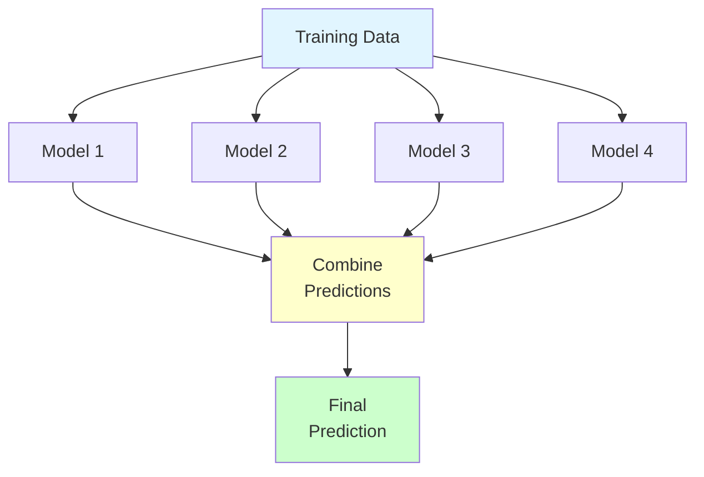
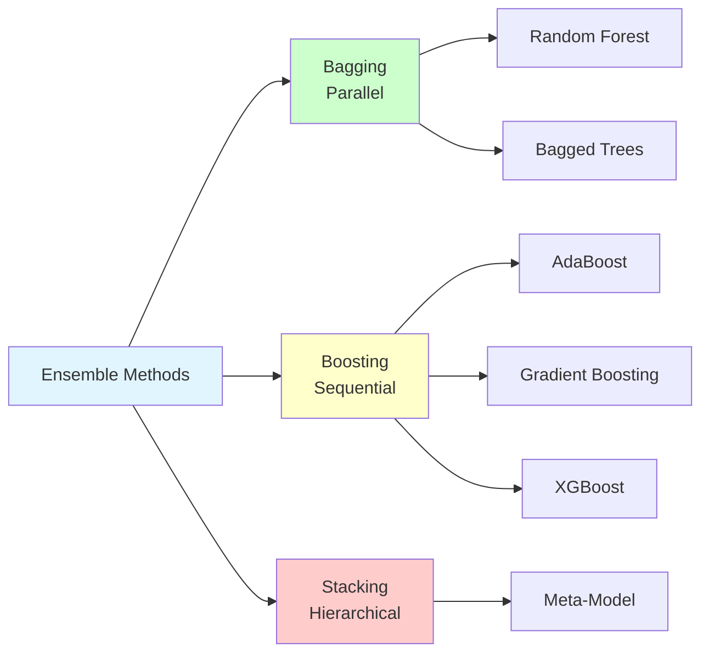
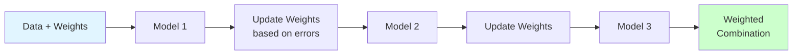
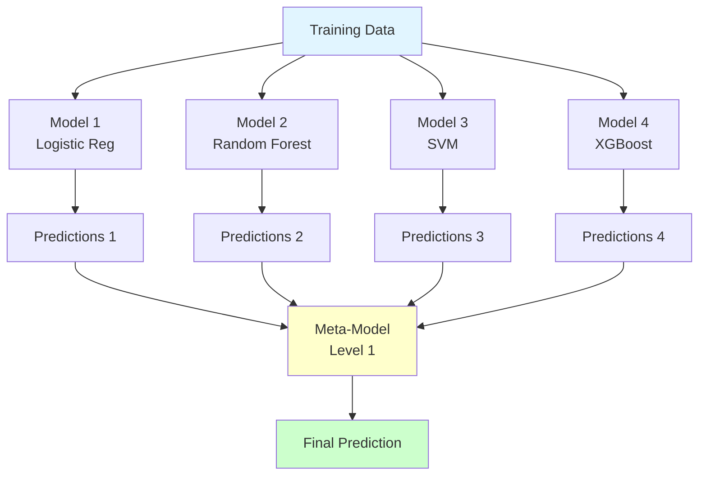
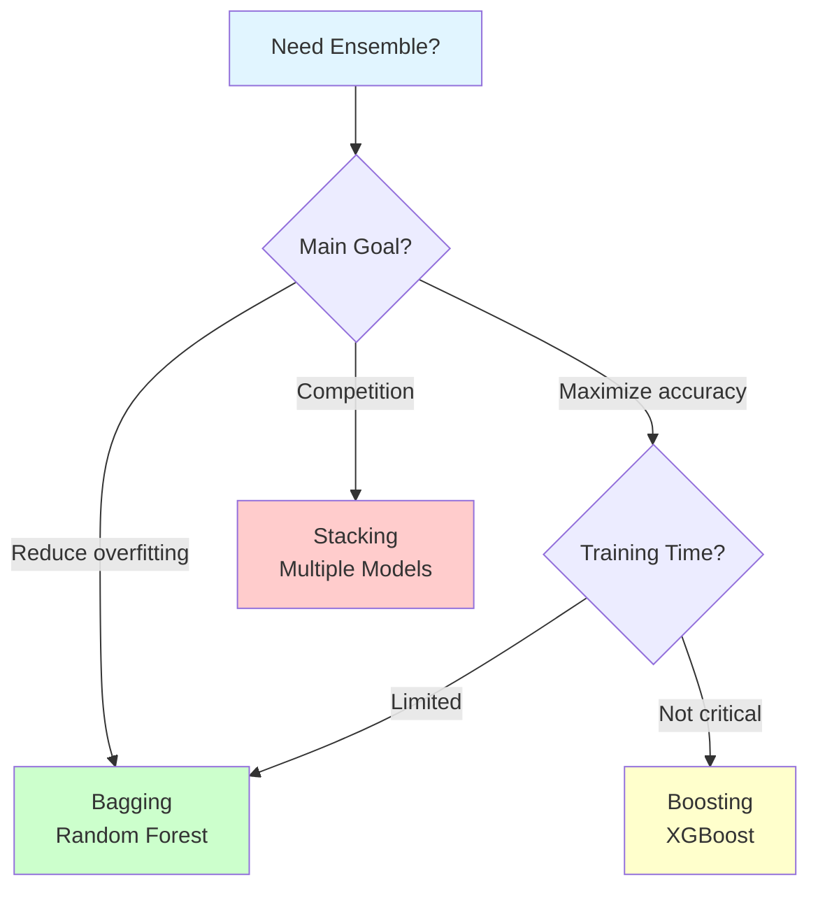

# Ensemble Methods

**Combine multiple models for superior performance.** Master bagging, boosting, and stacking to build state-of-the-art ML systems.

**Difficulty:** 🟡🔴 Intermediate to Advanced | **Time:** 2-3 weeks | **Prerequisites:** [Decision Trees](../classification/decision-trees.md), [Random Forest](../classification/random-forest.md)

---

## 🎯 What are Ensemble Methods?

**Ensemble methods** combine predictions from multiple models to create a stronger, more robust predictor. The key idea: "wisdom of crowds" - many weak learners can form a strong learner.

**Core Principle:**
```
Individual Model 1: 60% accuracy
Individual Model 2: 62% accuracy
Individual Model 3: 58% accuracy
Ensemble (combined): 75% accuracy! 🎯
```



**Why Ensembles Work:**
- Reduce variance (bagging)
- Reduce bias (boosting)
- Improve robustness
- Capture diverse patterns
- Better generalization

---

## 📚 Main Approaches

### Three Main Types



| Method | Training | Goal | Reduces | Best For |
|--------|----------|------|---------|----------|
| **Bagging** | Parallel | Reduce variance | Overfitting | Unstable models |
| **Boosting** | Sequential | Reduce bias | Underfitting | Maximize accuracy |
| **Stacking** | Hierarchical | Combine diverse | Both | Competition winning |

---

## 🎒 1. Bagging (Bootstrap Aggregating)

### Overview 🟡
**Train multiple models in parallel on different subsets of data and aggregate their predictions.**

**Key Formula:**
```
1. Create N bootstrap samples (sample with replacement)
2. Train N models in parallel
3. Aggregate: Voting (classification) or Averaging (regression)
```

**Visual:**
```
Original Data: [1,2,3,4,5,6,7,8,9,10]

Bootstrap Sample 1: [1,1,3,5,6,7,8,9,9,10]  → Model 1
Bootstrap Sample 2: [2,2,3,4,5,6,7,8,10,10] → Model 2
Bootstrap Sample 3: [1,3,3,4,5,6,7,8,9,10]  → Model 3

Aggregate predictions → Final output
```

### Key Concepts
- **Bootstrap sampling:** Sample with replacement
- **Parallel training:** All models train independently
- **Aggregation:**
  - Classification: Majority voting
  - Regression: Average predictions
- **Out-of-bag (OOB) error:** Use unsampled data for validation
- **Reduces variance:** Averages out overfitting

### Algorithms Using Bagging
1. **Random Forest** - Bagging + random feature selection
2. **Bagged Decision Trees**
3. **Extra Trees** - Extremely randomized trees

### When to Use Bagging
✅ Model has high variance (overfitting)
✅ Model is unstable (small changes → big difference)
✅ Want to reduce overfitting
✅ Can train models in parallel
✅ Have computational resources

❌ Model has high bias (underfitting)
❌ Need interpretability
❌ Limited computational resources

### Practical Example

```python
from sklearn.ensemble import BaggingClassifier
from sklearn.tree import DecisionTreeClassifier
from sklearn.model_selection import train_test_split
from sklearn.metrics import accuracy_score

# Base model: Decision Tree (high variance)
base_model = DecisionTreeClassifier(max_depth=None)  # Prone to overfitting

# Bagging ensemble
bagging_model = BaggingClassifier(
    base_estimator=base_model,
    n_estimators=50,           # Number of models
    max_samples=0.8,           # 80% of data for each model
    max_features=0.8,          # 80% of features
    bootstrap=True,            # Sample with replacement
    oob_score=True,           # Use out-of-bag samples for validation
    n_jobs=-1,                # Use all CPU cores
    random_state=42
)

# Train
bagging_model.fit(X_train, y_train)

# Evaluate
print(f"OOB Score: {bagging_model.oob_score_:.3f}")
y_pred = bagging_model.predict(X_test)
print(f"Test Accuracy: {accuracy_score(y_test, y_pred):.3f}")
```

**[→ Learn More: Bagging](bagging.md)**

**Difficulty:** 🟡 | **Time:** 3-4 hours | **Interview:** ⭐⭐⭐

---

## 🚀 2. Boosting

### Overview 🟡
**Train models sequentially, each focusing on correcting errors made by previous models.**

**Key Formula:**
```
1. Train weak learner on data
2. Increase weight of misclassified examples
3. Train next weak learner on reweighted data
4. Repeat N times
5. Weighted combination of all learners
```

**Visual:**
```
Round 1: Train Model 1 → Errors: [2, 7, 9]
Round 2: Train Model 2 (focus on 2,7,9) → Errors: [5, 9]
Round 3: Train Model 3 (focus on 5,9) → Errors: [9]
Round 4: Train Model 4 (focus on 9) → Errors: []

Final: Weighted sum of all models
```



### Key Concepts
- **Sequential training:** Each model depends on previous
- **Error weighting:** Focus on hard examples
- **Weak learners:** Often shallow trees (stumps)
- **Learning rate:** Control contribution of each model
- **Reduces bias:** Corrects systematic errors
- **Can overfit:** If too many iterations

### Main Boosting Algorithms

#### AdaBoost (Adaptive Boosting)
- Adjusts sample weights
- Binary classification focus
- Simple and interpretable

#### Gradient Boosting
- Fits to residuals (errors)
- More flexible loss functions
- Better for regression

#### XGBoost (Extreme Gradient Boosting)
- Optimized implementation
- Regularization built-in
- Handles missing values
- Parallel processing
- **Most popular for competitions!**

#### LightGBM
- Faster than XGBoost
- Better for large datasets
- Leaf-wise tree growth

#### CatBoost
- Handles categorical features natively
- Reduces overfitting
- Ordered boosting

### When to Use Boosting
✅ Need maximum accuracy
✅ Tabular/structured data
✅ Have time for tuning
✅ Can tolerate slow training
✅ Kaggle competitions
✅ Production systems (after tuning)

❌ Need fast training
❌ Limited tuning time
❌ Very noisy data (may overfit)
❌ Need interpretability

### Practical Example

```python
from sklearn.ensemble import GradientBoostingClassifier, AdaBoostClassifier
from xgboost import XGBClassifier
from lightgbm import LGBMClassifier

# 1. AdaBoost
ada_model = AdaBoostClassifier(
    n_estimators=50,
    learning_rate=1.0,
    random_state=42
)

# 2. Gradient Boosting (sklearn)
gb_model = GradientBoostingClassifier(
    n_estimators=100,
    learning_rate=0.1,
    max_depth=3,
    random_state=42
)

# 3. XGBoost (most popular!)
xgb_model = XGBClassifier(
    n_estimators=100,
    learning_rate=0.1,
    max_depth=3,
    subsample=0.8,
    colsample_bytree=0.8,
    random_state=42
)

# 4. LightGBM (fastest)
lgbm_model = LGBMClassifier(
    n_estimators=100,
    learning_rate=0.1,
    max_depth=3,
    random_state=42
)

# Train and compare
for name, model in [('AdaBoost', ada_model),
                     ('GradientBoosting', gb_model),
                     ('XGBoost', xgb_model),
                     ('LightGBM', lgbm_model)]:
    model.fit(X_train, y_train)
    score = model.score(X_test, y_test)
    print(f"{name}: {score:.3f}")
```

**[→ Learn More: Boosting](boosting.md)**

**Difficulty:** 🟡 | **Time:** 4-5 hours | **Interview:** ⭐⭐⭐⭐

---

## 🏗️ 3. Stacking (Stacked Generalization)

### Overview 🔴
**Use predictions from multiple base models as features for a meta-model.**

**Architecture:**
```
Level 0 (Base Models):
- Logistic Regression
- Random Forest
- SVM
- XGBoost

↓ (predictions become features)

Level 1 (Meta-Model):
- Logistic Regression combines base predictions
```



### Key Concepts
- **Base models (Level 0):** Diverse algorithms
- **Meta-model (Level 1):** Learns to combine base models
- **Cross-validation:** Prevent data leakage
- **Diversity is key:** Use different model types
- **Can have multiple levels:** Stack of stacks

### Critical: Avoiding Data Leakage

**Wrong Way (Leakage!):**
```python
# Train base models on full training set
base_model_1.fit(X_train, y_train)
base_model_2.fit(X_train, y_train)

# Get predictions on same training set
train_preds_1 = base_model_1.predict(X_train)  # LEAKAGE!
train_preds_2 = base_model_2.predict(X_train)  # LEAKAGE!

# Train meta-model
meta_model.fit([train_preds_1, train_preds_2], y_train)
```

**Right Way (Cross-Validation):**
```python
# Use cross-validation to get out-of-fold predictions
from sklearn.model_selection import cross_val_predict

# Get predictions without leakage
train_preds_1 = cross_val_predict(base_model_1, X_train, y_train, cv=5)
train_preds_2 = cross_val_predict(base_model_2, X_train, y_train, cv=5)

# Train meta-model on out-of-fold predictions
meta_model.fit([train_preds_1, train_preds_2], y_train)
```

### When to Use Stacking
✅ Have multiple good models
✅ Need absolute best performance
✅ Kaggle competitions
✅ Models are diverse (different types)
✅ Have computational resources
✅ Can handle complexity

❌ Need interpretability
❌ Limited computational resources
❌ Need fast training/prediction
❌ Simple problem
❌ Production constraints

### Practical Example

```python
from sklearn.ensemble import StackingClassifier
from sklearn.linear_model import LogisticRegression
from sklearn.ensemble import RandomForestClassifier
from sklearn.svm import SVC
from xgboost import XGBClassifier

# Define base models (diverse!)
base_models = [
    ('lr', LogisticRegression()),
    ('rf', RandomForestClassifier(n_estimators=100)),
    ('svm', SVC(probability=True)),
    ('xgb', XGBClassifier())
]

# Define meta-model
meta_model = LogisticRegression()

# Create stacking ensemble
stacking_model = StackingClassifier(
    estimators=base_models,
    final_estimator=meta_model,
    cv=5,  # Use 5-fold CV to avoid leakage
    n_jobs=-1
)

# Train (handles CV automatically)
stacking_model.fit(X_train, y_train)

# Predict
y_pred = stacking_model.predict(X_test)
print(f"Stacking Accuracy: {accuracy_score(y_test, y_pred):.3f}")
```

**[→ Learn More: Stacking](stacking.md)**

**Difficulty:** 🔴 | **Time:** 4-5 hours | **Interview:** ⭐⭐⭐

---

## 📊 Comparison Table

### Bagging vs Boosting vs Stacking

| Aspect | Bagging | Boosting | Stacking |
|--------|---------|----------|----------|
| **Training** | Parallel | Sequential | Hierarchical |
| **Focus** | Reduce variance | Reduce bias | Combine diverse models |
| **Base Models** | Same type | Same type (weak) | Different types |
| **Weights** | Equal | Weighted by performance | Learned by meta-model |
| **Speed** | Fast (parallel) | Slower (sequential) | Slowest |
| **Overfitting Risk** | Lower | Higher | Medium |
| **Interpretability** | Medium | Low | Very low |
| **Best Use** | Reduce overfitting | Maximize accuracy | Competition winning |

### Performance Comparison

```
Typical Accuracy Gains:

Single Model:          70%
Bagging (RF):         75-80%  (+5-10%)
Boosting (XGBoost):   80-85%  (+10-15%)
Stacking:             85-90%  (+15-20%)

Note: Actual gains depend on problem and data
```

---

## 🎯 Choosing the Right Ensemble

### Decision Flow



### Practical Guidelines

**Use Bagging (Random Forest) when:**
- Model overfits (high variance)
- Need fast training
- Want feature importance
- Production system
- Good default choice

**Use Boosting (XGBoost) when:**
- Need best accuracy
- Tabular data
- Can tune hyperparameters
- Competition or critical application
- Have computational resources

**Use Stacking when:**
- Need absolute best performance
- Have multiple good models
- Competition final submission
- Models are diverse
- Computational cost acceptable

---

## 🛠️ Hyperparameter Tuning

### Bagging Parameters
```python
BaggingClassifier(
    n_estimators=50,       # Number of models (more is better, diminishing returns)
    max_samples=0.8,       # Fraction of samples for each model
    max_features=0.8,      # Fraction of features
    bootstrap=True,        # Sample with replacement
    oob_score=True        # Use out-of-bag for validation
)
```

### Boosting Parameters (XGBoost)
```python
XGBClassifier(
    n_estimators=100,      # Number of trees (more → better but slower)
    learning_rate=0.1,     # Shrinkage (lower → need more trees)
    max_depth=3,           # Tree depth (higher → more complex)
    subsample=0.8,         # Fraction of samples per tree
    colsample_bytree=0.8,  # Fraction of features per tree
    reg_alpha=0,           # L1 regularization
    reg_lambda=1,          # L2 regularization
)
```

### Grid Search Example
```python
from sklearn.model_selection import GridSearchCV

# XGBoost parameter grid
param_grid = {
    'n_estimators': [50, 100, 200],
    'learning_rate': [0.01, 0.1, 0.3],
    'max_depth': [3, 5, 7],
    'subsample': [0.8, 1.0],
}

grid_search = GridSearchCV(
    XGBClassifier(),
    param_grid,
    cv=5,
    scoring='accuracy',
    n_jobs=-1
)

grid_search.fit(X_train, y_train)
print(f"Best params: {grid_search.best_params_}")
print(f"Best score: {grid_search.best_score_:.3f}")
```

---

## 📚 Hands-On Projects

### Beginner: Bagging Comparison 🟡
**Goal:** Compare single tree vs Random Forest
- Train decision tree (baseline)
- Train bagging ensemble
- Compare overfitting
- Analyze OOB score

### Intermediate: XGBoost Tuning 🟡
**Goal:** Master gradient boosting
- Load Kaggle dataset
- Hyperparameter tuning
- Feature importance
- Submit to competition

### Advanced: Stacking Ensemble 🔴
**Goal:** Build competition-winning stack
- Train diverse base models
- Implement stacking with CV
- Multiple meta-model comparison
- Achieve top performance

---

## 🎓 Learning Path

### Week 1: Bagging
- Days 1-2: Theory and Random Forest
- Days 3-4: Implementation and tuning
- Days 5-7: Project and practice

### Week 2: Boosting
- Days 1-2: AdaBoost and Gradient Boosting
- Days 3-5: XGBoost and LightGBM
- Days 6-7: Hyperparameter tuning project

### Week 3: Stacking
- Days 1-3: Stacking theory and implementation
- Days 4-5: Avoiding data leakage
- Days 6-7: Competition project

---

## ⚠️ Common Pitfalls

!!! danger "Critical Mistakes"
    1. **Data leakage in stacking** - Must use CV!
    2. **Overfitting with boosting** - Use validation set
    3. **Too many estimators** - Diminishing returns
    4. **Ignoring diversity** - Use different model types for stacking
    5. **Not tuning hyperparameters** - Critical for boosting
    6. **Forgetting regularization** - Especially with XGBoost

---

## 📖 Additional Resources

### Books
- *Ensemble Methods* by Zhi-Hua Zhou
- *Hands-On Machine Learning* - Chapter 7
- *The Elements of Statistical Learning* - Chapter 15

### Online
- XGBoost documentation
- Kaggle Ensembling Guide
- StatQuest: Random Forest, AdaBoost, XGBoost

### Competitions
- Kaggle competitions (ensembles often win!)
- DrivenData
- Zindi

---

## 🚀 Next Steps

**After mastering ensembles:**

1. **Improve Skills:**
   - [Hyperparameter Tuning](../../optimization/hyperparameter-tuning.md)
   - [Feature Engineering](../../feature-engineering/index.md)
   - [Model Selection](../../evaluation/model-selection.md)

2. **Advanced Topics:**
   - [Deep Learning](../../deep-learning/index.md)
   - [MLOps and Deployment](../../mlops/index.md)

3. **Practice:**
   - Join Kaggle competitions
   - Build portfolio projects
   - Contribute to open source

---

**Ready to master ensemble methods?** Start with [Bagging](bagging.md)! 🚀

**Remember:** Ensembles are powerful but add complexity - use them when the performance gain justifies the cost!
