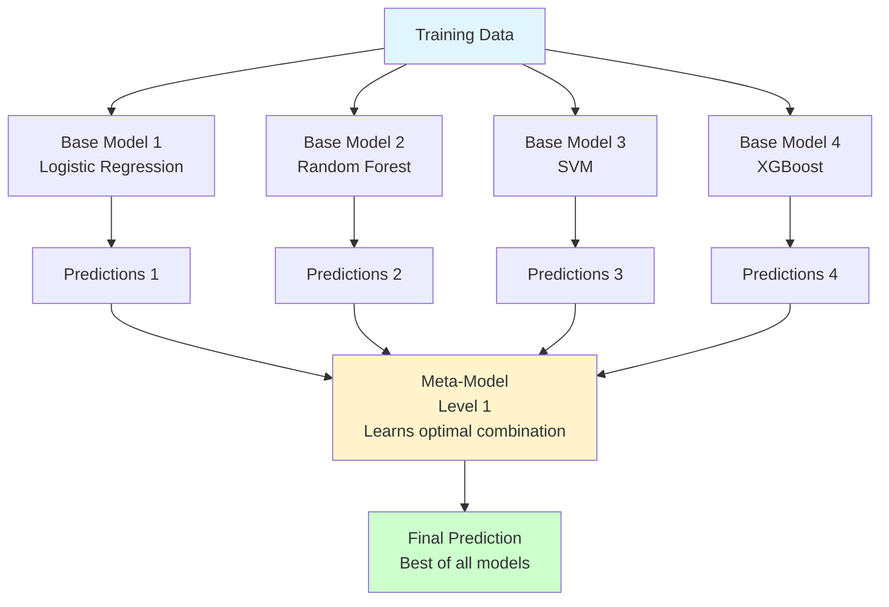

# Stacking (Stacked Generalization)

**Learn to optimally combine diverse models through meta-learning.** Stacking is the secret behind competition-winning ensembles and achieves performance beyond single algorithms.

**Difficulty:** 🔴 Advanced | **Time:** 4-5 hours | **Prerequisites:** Multiple ML algorithms, Cross-validation, Ensemble basics

---

## Overview

Stacking combines predictions from multiple base models (Level 0) using a meta-model (Level 1) that learns how to best combine them. Unlike simple averaging, the meta-model discovers optimal weights and interactions between base models.

**Core idea:** Train a model to combine other models - "learning to learn."

**Use cases:** Kaggle competitions, production systems needing maximum accuracy, combining diverse model strengths

---

## Intuition 💡

### The Big Idea

Imagine you're making a critical decision and consult three experts:
- **Doctor:** Medical perspective
- **Data Scientist:** Statistical analysis
- **Domain Expert:** Industry knowledge

Instead of averaging their opinions, you learn a **meta-strategy**: "Trust the doctor 60% when symptoms are clear, trust the data scientist 30% when data is abundant, trust domain expert 10% for context."

Stacking learns this meta-strategy automatically!



### Real-World Analogy

**Medical Diagnosis Committee:**
- **Test 1:** Blood test (80% accurate)
- **Test 2:** X-ray (75% accurate)
- **Test 3:** Physical exam (70% accurate)

**Simple averaging:** Combine with equal weights → 82% accurate

**Stacking approach:** Learn that blood test is more reliable for certain conditions, X-ray for others → 90% accurate!

### Why Not Just Average?

```python
# Simple Voting/Averaging
prediction = (model1 + model2 + model3) / 3

# Stacking (Meta-Learning)
# Meta-model learns: "Use model1 heavily for type A data,
#                     model2 for type B, model3 as tiebreaker"
prediction = meta_model([model1, model2, model3])
# Meta-model discovers optimal combination automatically!
```

---

## When to Use ✅ / When to Avoid ❌

### ✅ Good For

| Scenario | Why It Works |
|----------|--------------|
| **Multiple good models** | Each model captures different patterns |
| **Diverse model types** | Linear, tree-based, neural - different strengths |
| **Need maximum accuracy** | Often beats single best model by 1-3% |
| **Kaggle competitions** | Top leaderboard positions often use stacking |
| **High-stakes predictions** | Medical, financial, safety-critical applications |
| **Different feature representations** | Text, images, tabular combined |

**Examples:**
- Kaggle: Combining XGBoost, Neural Nets, Random Forest
- Medical: Combining multiple diagnostic tools
- Finance: Ensemble of risk models
- Recommendation: Combining collaborative filtering + content-based

### ❌ Not Good For

| Scenario | Why It Fails |
|----------|--------------|
| **Need interpretability** | Meta-model adds complexity layer |
| **Limited computational resources** | Training N+1 models is expensive |
| **Real-time prediction** | Need to run all models sequentially |
| **Simple problems** | Single model might be sufficient |
| **Small datasets** | Risk of overfitting meta-model |
| **Production constraints** | Maintenance of multiple models |

**When to use instead:**
- Need speed: Single optimized model
- Need interpretability: Single decision tree or linear model
- Simple problem: Logistic Regression, Random Forest
- Limited data: Simpler ensemble like bagging

---

## Mathematical Foundation

### Two-Level Architecture

**Level 0 (Base Models):**

$$h_1(x), h_2(x), ..., h_K(x)$$

Where $K$ is the number of base models.

**Level 1 (Meta-Model):**

$$\hat{y} = g(h_1(x), h_2(x), ..., h_K(x))$$

Where $g$ is the meta-model that learns to combine base predictions.

### The Data Leakage Problem

**WRONG approach (causes overfitting):**

```
1. Train base models on full training set
2. Get predictions on same training set  ← LEAKAGE!
3. Train meta-model on these predictions
```

This causes meta-model to overfit because base models have already seen the data.

**CORRECT approach (using cross-validation):**

```
1. Split training data into K folds
2. For each fold:
   - Train base models on other K-1 folds
   - Predict on held-out fold (out-of-fold predictions)
3. Train meta-model on out-of-fold predictions (no leakage!)
```

### Out-of-Fold Predictions

For K-fold cross-validation:

$$\text{Meta-features} = \{h_i^{(j)}(x) : i=1...M, j=1...K\}$$

Where:
- $h_i^{(j)}$ = base model $i$ trained on fold $j$
- $M$ = number of base models
- $K$ = number of folds

These predictions are used to train the meta-model without data leakage.

---

## Implementation

### Using Scikit-learn StackingClassifier

```python
import numpy as np
import matplotlib.pyplot as plt
from sklearn.ensemble import StackingClassifier, RandomForestClassifier, GradientBoostingClassifier
from sklearn.linear_model import LogisticRegression
from sklearn.svm import SVC
from sklearn.neighbors import KNeighborsClassifier
from sklearn.datasets import make_classification
from sklearn.model_selection import train_test_split, cross_val_score
from sklearn.metrics import accuracy_score, classification_report
import xgboost as xgb

# Generate data
X, y = make_classification(
    n_samples=2000,
    n_features=20,
    n_informative=15,
    n_redundant=5,
    random_state=42
)

X_train, X_test, y_train, y_test = train_test_split(
    X, y, test_size=0.2, random_state=42
)

# Define diverse base models (Level 0)
base_models = [
    ('lr', LogisticRegression(max_iter=1000, random_state=42)),
    ('rf', RandomForestClassifier(n_estimators=100, random_state=42)),
    ('svm', SVC(probability=True, random_state=42)),
    ('xgb', xgb.XGBClassifier(n_estimators=100, random_state=42,
                              use_label_encoder=False, eval_metric='logloss')),
    ('knn', KNeighborsClassifier(n_neighbors=5))
]

# Define meta-model (Level 1)
meta_model = LogisticRegression()

# Create stacking ensemble
stacking_clf = StackingClassifier(
    estimators=base_models,
    final_estimator=meta_model,
    cv=5,  # Use 5-fold CV to generate meta-features
    stack_method='auto',  # Use predict_proba if available
    n_jobs=-1,
    verbose=1
)

# Train
print("Training stacking ensemble...")
stacking_clf.fit(X_train, y_train)

# Evaluate
y_pred = stacking_clf.predict(X_test)
stacking_acc = accuracy_score(y_test, y_pred)

print(f"\nStacking Accuracy: {stacking_acc:.3f}")
print("\nClassification Report:")
print(classification_report(y_test, y_pred))

# Compare with individual base models
print("\n" + "="*60)
print("Individual Base Model Performance:")
print("="*60)

for name, model in base_models:
    model.fit(X_train, y_train)
    score = model.score(X_test, y_test)
    print(f"{name:20s}: {score:.3f}")

print(f"\n{'Stacking Ensemble':20s}: {stacking_acc:.3f}")
print("="*60)
```

### Manual Stacking Implementation

```python
from sklearn.model_selection import KFold

class StackingEnsemble:
    """Stacking ensemble implemented from scratch"""

    def __init__(self, base_models, meta_model, n_folds=5):
        self.base_models = base_models
        self.meta_model = meta_model
        self.n_folds = n_folds
        self.fitted_base_models = []

    def fit(self, X, y):
        """Train stacking ensemble with proper CV"""
        n_samples = len(X)
        n_models = len(self.base_models)

        # Initialize meta-features
        meta_features = np.zeros((n_samples, n_models))

        # K-Fold cross-validation
        kfold = KFold(n_splits=self.n_folds, shuffle=True, random_state=42)

        print(f"Generating out-of-fold predictions using {self.n_folds}-fold CV...")

        for i, (name, model) in enumerate(self.base_models):
            print(f"  Processing {name}...")

            for fold_idx, (train_idx, val_idx) in enumerate(kfold.split(X)):
                X_train_fold = X[train_idx]
                y_train_fold = y[train_idx]
                X_val_fold = X[val_idx]

                # Clone and train on fold
                from sklearn.base import clone
                model_fold = clone(model)
                model_fold.fit(X_train_fold, y_train_fold)

                # Predict on validation fold (out-of-fold prediction)
                if hasattr(model_fold, 'predict_proba'):
                    meta_features[val_idx, i] = model_fold.predict_proba(X_val_fold)[:, 1]
                else:
                    meta_features[val_idx, i] = model_fold.predict(X_val_fold)

        # Train base models on full training data for final predictions
        print("\nTraining base models on full training data...")
        self.fitted_base_models = []
        for name, model in self.base_models:
            print(f"  Training {name}...")
            from sklearn.base import clone
            fitted_model = clone(model)
            fitted_model.fit(X, y)
            self.fitted_base_models.append((name, fitted_model))

        # Train meta-model on out-of-fold predictions
        print("\nTraining meta-model...")
        self.meta_model.fit(meta_features, y)

        return self

    def predict(self, X):
        """Make predictions using stacked ensemble"""
        # Get predictions from base models
        n_samples = len(X)
        n_models = len(self.fitted_base_models)
        meta_features = np.zeros((n_samples, n_models))

        for i, (name, model) in enumerate(self.fitted_base_models):
            if hasattr(model, 'predict_proba'):
                meta_features[:, i] = model.predict_proba(X)[:, 1]
            else:
                meta_features[:, i] = model.predict(X)

        # Meta-model makes final prediction
        return self.meta_model.predict(meta_features)

    def predict_proba(self, X):
        """Predict probabilities"""
        n_samples = len(X)
        n_models = len(self.fitted_base_models)
        meta_features = np.zeros((n_samples, n_models))

        for i, (name, model) in enumerate(self.fitted_base_models):
            if hasattr(model, 'predict_proba'):
                meta_features[:, i] = model.predict_proba(X)[:, 1]
            else:
                meta_features[:, i] = model.predict(X)

        return self.meta_model.predict_proba(meta_features)

# Usage
base_models_scratch = [
    ('lr', LogisticRegression(random_state=42)),
    ('rf', RandomForestClassifier(n_estimators=50, random_state=42)),
    ('xgb', xgb.XGBClassifier(n_estimators=50, random_state=42,
                              use_label_encoder=False, eval_metric='logloss'))
]

meta_model_scratch = LogisticRegression()

stacking_scratch = StackingEnsemble(
    base_models=base_models_scratch,
    meta_model=meta_model_scratch,
    n_folds=5
)

stacking_scratch.fit(X_train, y_train)
y_pred_scratch = stacking_scratch.predict(X_test)
scratch_acc = accuracy_score(y_test, y_pred_scratch)

print(f"\nFrom Scratch Stacking Accuracy: {scratch_acc:.3f}")
```

---

## Visualization

### Stacking Architecture Diagram

```python
def visualize_stacking_architecture():
    """Visualize the two-level stacking architecture"""
    import matplotlib.patches as mpatches
    from matplotlib.patches import FancyBboxPatch, FancyArrowPatch

    fig, ax = plt.subplots(figsize=(14, 10))
    ax.set_xlim(0, 10)
    ax.set_ylim(0, 10)
    ax.axis('off')

    # Training Data
    data_box = FancyBboxPatch((3.5, 8.5), 3, 0.8,
                               boxstyle="round,pad=0.1",
                               edgecolor='black', facecolor='lightblue', linewidth=2)
    ax.add_patch(data_box)
    ax.text(5, 8.9, 'Training Data', ha='center', va='center',
            fontsize=14, fontweight='bold')

    # Level 0 (Base Models)
    base_models_names = ['Logistic\nRegression', 'Random\nForest', 'SVM', 'XGBoost']
    base_y = 6.5
    base_colors = ['#FFB6C1', '#FFD700', '#98FB98', '#87CEEB']

    for i, (name, color) in enumerate(zip(base_models_names, base_colors)):
        x = 1.5 + i * 2
        box = FancyBboxPatch((x-0.6, base_y-0.4), 1.2, 1,
                            boxstyle="round,pad=0.1",
                            edgecolor='black', facecolor=color, linewidth=2)
        ax.add_patch(box)
        ax.text(x, base_y + 0.1, name, ha='center', va='center',
                fontsize=10, fontweight='bold')

        # Arrow from data to model
        arrow = FancyArrowPatch((5, 8.5), (x, base_y + 0.6),
                               arrowstyle='->', lw=2, color='gray', alpha=0.6)
        ax.add_artist(arrow)

    # Level 0 Label
    ax.text(0.5, base_y + 0.1, 'Level 0\n(Base)', ha='center', va='center',
            fontsize=11, fontweight='bold', bbox=dict(boxstyle='round', facecolor='wheat'))

    # Meta-features
    meta_feat_y = 4.5
    for i in range(4):
        x = 1.5 + i * 2
        # Arrow from base model to meta-features
        arrow = FancyArrowPatch((x, base_y - 0.4), (x, meta_feat_y + 0.5),
                               arrowstyle='->', lw=2, color='gray', alpha=0.6)
        ax.add_artist(arrow)

    meta_box = FancyBboxPatch((1, meta_feat_y - 0.3), 8, 0.8,
                             boxstyle="round,pad=0.1",
                             edgecolor='black', facecolor='lightyellow',
                             linewidth=2, linestyle='--')
    ax.add_patch(meta_box)
    ax.text(5, meta_feat_y + 0.1, 'Meta-Features (Base Model Predictions)',
            ha='center', va='center', fontsize=11, fontweight='bold')

    # Meta-Model (Level 1)
    meta_model_y = 2.5
    meta_box2 = FancyBboxPatch((3.5, meta_model_y - 0.5), 3, 1.2,
                              boxstyle="round,pad=0.1",
                              edgecolor='black', facecolor='#FFA07A', linewidth=3)
    ax.add_patch(meta_box2)
    ax.text(5, meta_model_y + 0.1, 'Meta-Model\n(Level 1)\nLearns to Combine',
            ha='center', va='center', fontsize=12, fontweight='bold')

    # Arrow from meta-features to meta-model
    arrow = FancyArrowPatch((5, meta_feat_y - 0.3), (5, meta_model_y + 0.7),
                           arrowstyle='->', lw=3, color='darkblue')
    ax.add_artist(arrow)

    # Final Prediction
    final_y = 0.5
    final_box = FancyBboxPatch((3.5, final_y - 0.3), 3, 0.8,
                              boxstyle="round,pad=0.1",
                              edgecolor='black', facecolor='lightgreen', linewidth=2)
    ax.add_patch(final_box)
    ax.text(5, final_y + 0.1, 'Final Prediction', ha='center', va='center',
            fontsize=14, fontweight='bold')

    # Arrow from meta-model to final
    arrow = FancyArrowPatch((5, meta_model_y - 0.5), (5, final_y + 0.5),
                           arrowstyle='->', lw=3, color='darkgreen')
    ax.add_artist(arrow)

    plt.title('Stacking Ensemble Architecture', fontsize=16, fontweight='bold', pad=20)
    plt.tight_layout()
    plt.savefig('stacking_architecture.png', dpi=150, bbox_inches='tight')
    plt.show()

visualize_stacking_architecture()
```

### Performance Comparison

```python
def compare_models_vs_stacking():
    """Compare individual models with stacking"""
    # Train all models
    models = {
        'Logistic Regression': LogisticRegression(random_state=42),
        'Random Forest': RandomForestClassifier(n_estimators=100, random_state=42),
        'SVM': SVC(probability=True, random_state=42),
        'XGBoost': xgb.XGBClassifier(n_estimators=100, random_state=42,
                                     use_label_encoder=False, eval_metric='logloss'),
        'Gradient Boosting': GradientBoostingClassifier(n_estimators=100, random_state=42)
    }

    scores = {}

    # Individual models
    for name, model in models.items():
        model.fit(X_train, y_train)
        score = model.score(X_test, y_test)
        scores[name] = score

    # Stacking
    stacking_score = stacking_acc
    scores['Stacking Ensemble'] = stacking_score

    # Plot
    fig, ax = plt.subplots(figsize=(12, 6))

    names = list(scores.keys())
    values = list(scores.values())
    colors = ['steelblue'] * (len(names) - 1) + ['coral']

    bars = ax.barh(names, values, color=colors, alpha=0.8, edgecolor='black')

    # Highlight best performance
    best_idx = np.argmax(values)
    bars[best_idx].set_edgecolor('red')
    bars[best_idx].set_linewidth(3)

    # Add value labels
    for i, (name, value) in enumerate(zip(names, values)):
        ax.text(value + 0.005, i, f'{value:.3f}', va='center', fontweight='bold')

    ax.set_xlabel('Accuracy', fontsize=12)
    ax.set_title('Model Comparison: Individual vs Stacking', fontsize=14, fontweight='bold')
    ax.set_xlim(0.5, 1.0)
    ax.grid(axis='x', alpha=0.3)

    plt.tight_layout()
    plt.savefig('stacking_comparison.png', dpi=150, bbox_inches='tight')
    plt.show()

compare_models_vs_stacking()
```

### Meta-Model Feature Importance

```python
def plot_meta_model_weights():
    """Show how meta-model weights base models"""
    # Get meta-model coefficients (for logistic regression meta-model)
    if hasattr(stacking_clf.final_estimator_, 'coef_'):
        weights = stacking_clf.final_estimator_.coef_[0]
        names = [name for name, _ in base_models]

        plt.figure(figsize=(10, 6))
        colors = ['green' if w > 0 else 'red' for w in weights]
        bars = plt.barh(names, weights, color=colors, alpha=0.7, edgecolor='black')

        plt.xlabel('Meta-Model Weight', fontsize=12)
        plt.title('How Meta-Model Weights Each Base Model', fontsize=14, fontweight='bold')
        plt.axvline(x=0, color='black', linestyle='--', linewidth=1)
        plt.grid(axis='x', alpha=0.3)

        # Add value labels
        for i, (name, weight) in enumerate(zip(names, weights)):
            plt.text(weight, i, f' {weight:.3f}', va='center', fontweight='bold')

        plt.tight_layout()
        plt.savefig('meta_model_weights.png', dpi=150, bbox_inches='tight')
        plt.show()

plot_meta_model_weights()
```

---

## Advanced Stacking Techniques

### Multi-Level Stacking

```python
# Level 0: Base models
level_0_models = [
    ('lr', LogisticRegression(random_state=42)),
    ('rf', RandomForestClassifier(n_estimators=100, random_state=42)),
    ('xgb', xgb.XGBClassifier(n_estimators=100, random_state=42,
                              use_label_encoder=False, eval_metric='logloss'))
]

# Level 1: Meta-models
level_1_meta = StackingClassifier(
    estimators=level_0_models,
    final_estimator=LogisticRegression(),
    cv=5
)

# Level 2: Final meta-meta-model
level_2_models = [
    ('stack1', level_1_meta),
    ('rf', RandomForestClassifier(n_estimators=100, random_state=42)),
]

final_stack = StackingClassifier(
    estimators=level_2_models,
    final_estimator=LogisticRegression(),
    cv=3
)

final_stack.fit(X_train, y_train)
print(f"Multi-level Stacking: {final_stack.score(X_test, y_test):.3f}")
```

### Blending (Holdout-Based Stacking)

```python
# Split training data
from sklearn.model_selection import train_test_split

X_train_base, X_train_meta, y_train_base, y_train_meta = train_test_split(
    X_train, y_train, test_size=0.5, random_state=42
)

# Train base models on first half
base_predictions = []

for name, model in base_models:
    model.fit(X_train_base, y_train_base)

    # Predict on second half (meta-training data)
    if hasattr(model, 'predict_proba'):
        pred = model.predict_proba(X_train_meta)[:, 1]
    else:
        pred = model.predict(X_train_meta)

    base_predictions.append(pred)

# Stack predictions
meta_features_train = np.column_stack(base_predictions)

# Train meta-model
meta_model_blend = LogisticRegression()
meta_model_blend.fit(meta_features_train, y_train_meta)

# For test prediction
test_predictions = []
for name, model in base_models:
    if hasattr(model, 'predict_proba'):
        pred = model.predict_proba(X_test)[:, 1]
    else:
        pred = model.predict(X_test)
    test_predictions.append(pred)

meta_features_test = np.column_stack(test_predictions)
y_pred_blend = meta_model_blend.predict(meta_features_test)

print(f"Blending Accuracy: {accuracy_score(y_test, y_pred_blend):.3f}")
```

### Feature Augmentation Stacking

```python
# Instead of just using base predictions, combine with original features
def stacking_with_features(X_train, y_train, X_test):
    """Stacking that also includes original features"""

    # Get out-of-fold predictions
    kfold = KFold(n_splits=5, shuffle=True, random_state=42)
    n_models = len(base_models)
    meta_features_train = np.zeros((len(X_train), n_models))

    for i, (name, model) in enumerate(base_models):
        for train_idx, val_idx in kfold.split(X_train):
            from sklearn.base import clone
            model_fold = clone(model)
            model_fold.fit(X_train[train_idx], y_train[train_idx])

            if hasattr(model_fold, 'predict_proba'):
                meta_features_train[val_idx, i] = model_fold.predict_proba(X_train[val_idx])[:, 1]
            else:
                meta_features_train[val_idx, i] = model_fold.predict(X_train[val_idx])

    # Augment with original features
    augmented_train = np.hstack([X_train, meta_features_train])

    # Train meta-model on augmented features
    meta_model_aug = xgb.XGBClassifier(n_estimators=100, random_state=42)
    meta_model_aug.fit(augmented_train, y_train)

    # Test predictions
    meta_features_test = np.zeros((len(X_test), n_models))
    for i, (name, model) in enumerate(base_models):
        model.fit(X_train, y_train)
        if hasattr(model, 'predict_proba'):
            meta_features_test[:, i] = model.predict_proba(X_test)[:, 1]
        else:
            meta_features_test[:, i] = model.predict(X_test)

    augmented_test = np.hstack([X_test, meta_features_test])
    y_pred_aug = meta_model_aug.predict(augmented_test)

    return y_pred_aug

y_pred_augmented = stacking_with_features(X_train, y_train, X_test)
print(f"Augmented Stacking: {accuracy_score(y_test, y_pred_augmented):.3f}")
```

---

## Hyperparameters

### Key Choices

| Choice | Options | Impact |
|--------|---------|--------|
| **Base Models** | Diverse algorithms | More diversity = better |
| **Number of Base Models** | 3-10 typically | Too many = overfitting, too few = limited |
| **Meta-Model** | Simple (LR) or complex (XGB) | Simple often works best |
| **CV Folds** | 3-10 | More folds = less variance but slower |
| **Stack Method** | predict vs predict_proba | Probabilities usually better |

### Best Practices

```python
# Good stacking configuration
good_stacking = StackingClassifier(
    estimators=[
        # Diverse base models
        ('linear', LogisticRegression()),  # Linear
        ('tree', RandomForestClassifier()),  # Tree-based
        ('boost', xgb.XGBClassifier()),  # Boosting
        ('svm', SVC(probability=True)),  # Kernel method
    ],
    final_estimator=LogisticRegression(),  # Simple meta-model
    cv=5,  # 5-fold CV
    stack_method='predict_proba',  # Use probabilities
    n_jobs=-1
)
```

---

## Common Pitfalls

### 1. Data Leakage in Stacking

!!! danger "Training Meta-Model on Same Data"
    **Problem:** Training base models and meta-model on the same data causes severe overfitting.

    **Example of WRONG approach:**
    ```python
    # ❌ WRONG - Data leakage!
    model1.fit(X_train, y_train)
    model2.fit(X_train, y_train)

    # Getting predictions on training data = LEAKAGE
    pred1 = model1.predict(X_train)
    pred2 = model2.predict(X_train)

    # Meta-model sees data base models already learned from
    meta_model.fit([pred1, pred2], y_train)  # OVERFITS!
    ```

    **Correct approach:**
    ```python
    # ✅ CORRECT - Use cross-validation
    stacking = StackingClassifier(
        estimators=[('m1', model1), ('m2', model2)],
        final_estimator=meta_model,
        cv=5  # Ensures no leakage
    )
    stacking.fit(X_train, y_train)
    ```

### 2. Using Similar Base Models

!!! warning "Lack of Diversity"
    **Problem:** Using 3 random forests doesn't add value - they'll make similar predictions.

    **Bad example:**
    ```python
    # ❌ Bad - All tree-based, similar behavior
    base_models = [
        ('rf1', RandomForestClassifier()),
        ('rf2', RandomForestClassifier(max_depth=10)),
        ('rf3', RandomForestClassifier(n_estimators=200)),
    ]
    ```

    **Good example:**
    ```python
    # ✅ Good - Diverse algorithm types
    base_models = [
        ('linear', LogisticRegression()),  # Linear
        ('tree', RandomForestClassifier()),  # Ensemble
        ('svm', SVC(probability=True)),  # Kernel
        ('nn', MLPClassifier()),  # Neural network
    ]
    ```

### 3. Complex Meta-Model

!!! warning "Overfitting Meta-Model"
    **Problem:** Using complex meta-model (e.g., deep XGBoost) can overfit.

    **Solution:** Keep meta-model simple - it just needs to combine, not learn complex patterns.

    ```python
    # ❌ Often too complex
    meta_model = xgb.XGBClassifier(max_depth=10, n_estimators=500)

    # ✅ Usually better
    meta_model = LogisticRegression()  # Simple linear combination
    # or
    meta_model = xgb.XGBClassifier(max_depth=2, n_estimators=50)  # Shallow
    ```

### 4. Not Considering Computational Cost

!!! warning "Training Multiple Models is Expensive"
    **Problem:** Stacking 5 models takes 5x training time, 5x memory, 5x prediction time.

    **Solution:**
    - Use `n_jobs=-1` for parallelization
    - Consider cost vs accuracy trade-off
    - For production, maybe 3 models is enough

    ```python
    # Track training time
    import time
    start = time.time()
    stacking.fit(X_train, y_train)
    print(f"Training time: {time.time() - start:.2f}s")

    # Consider simpler alternative if too slow
    if training_time > threshold:
        # Use single XGBoost instead
        simple_model = xgb.XGBClassifier()
    ```

### 5. Ignoring Class Imbalance

!!! warning "Biased Toward Majority Class"
    **Solution:** Handle imbalance in both base models and meta-model.

    ```python
    from sklearn.utils.class_weight import compute_sample_weight

    # Weight samples in base models
    sample_weights = compute_sample_weight('balanced', y_train)

    # Or use SMOTE for base models
    from imblearn.over_sampling import SMOTE
    smote = SMOTE(random_state=42)
    X_train_balanced, y_train_balanced = smote.fit_resample(X_train, y_train)
    ```

---

## Practice Problems

### 🟢 Beginner

!!! example "Problem 1: Simple Stacking"
    **Goal:** Implement basic stacking ensemble

    **Tasks:**
    1. Load iris dataset
    2. Create 3 base models: Logistic Regression, Random Forest, SVM
    3. Use LogisticRegression as meta-model
    4. Train with StackingClassifier (cv=5)
    5. Compare with individual base models

!!! example "Problem 2: Data Leakage Experiment"
    **Goal:** See the impact of data leakage

    **Tasks:**
    1. Implement stacking WITHOUT proper CV (leakage)
    2. Implement stacking WITH proper CV (no leakage)
    3. Compare train vs test performance
    4. Observe overfitting in leakage version

### 🟡 Intermediate

!!! example "Problem 3: Optimize Base Model Diversity"
    **Goal:** Find optimal base model combination

    **Tasks:**
    1. Try 10 different base models
    2. Test all combinations of 3-5 models
    3. Measure correlation between predictions
    4. Find combination with:
       - Low correlation
       - High individual performance
    5. Compare final stacking performance

!!! example "Problem 4: Meta-Model Comparison"
    **Goal:** Compare different meta-models

    **Tasks:**
    1. Use same base models
    2. Try meta-models: LogisticRegression, RandomForest, XGBoost, SVM
    3. Compare performance and training time
    4. Analyze which meta-model learns best combination

### 🔴 Advanced

!!! example "Problem 5: Multi-Level Stacking"
    **Goal:** Build 3-level stacking ensemble

    **Tasks:**
    1. Level 0: 5 base models
    2. Level 1: 2 meta-models combining level 0
    3. Level 2: Final meta-meta-model
    4. Use proper CV at each level
    5. Compare with single-level stacking
    6. Analyze complexity vs performance trade-off

!!! example "Problem 6: Kaggle Competition Stacking"
    **Goal:** Build competition-grade ensemble

    **Tasks:**
    1. Choose a Kaggle competition
    2. Build diverse base models (10+)
    3. Implement feature-augmented stacking
    4. Use blending for final submission
    5. Perform extensive hyperparameter tuning
    6. Aim for top 10% leaderboard

---

## Real-World Applications

### Industry Use Cases

| Domain | Application | Base Models | Meta-Model |
|--------|-------------|-------------|------------|
| **Finance** | Credit risk | LR, XGB, RF, NN | LR |
| **Healthcare** | Disease diagnosis | RF, SVM, XGB | LR |
| **E-commerce** | Recommendation | Collaborative, Content, XGB | XGB |
| **Insurance** | Claim prediction | RF, GBM, GLM | LR |
| **Ad Tech** | CTR prediction | FM, XGB, NN | LR |

### Competition Success Stories

**Netflix Prize (2009):**
- Winning solution: Stacked ensemble of 100+ models
- Combined matrix factorization, RBMs, k-NN
- Meta-model: Blended linear regression
- Result: $1 million prize

**Kaggle Competitions:**
- Top solutions almost always use stacking
- Typical setup: 5-15 diverse base models
- Common meta-model: Logistic Regression or shallow XGBoost

---

## Complexity Analysis

### Time Complexity

| Operation | Complexity |
|-----------|------------|
| **Training** | $O(K \cdot T_{base} + T_{meta})$ |
| **Prediction** | $O(K \cdot P_{base} + P_{meta})$ |
| **With CV** | $O(F \cdot K \cdot T_{base} + T_{meta})$ |

Where:
- $K$ = number of base models
- $F$ = number of CV folds
- $T_{base}$ = training time per base model
- $P_{base}$ = prediction time per base model

**Note:** Training can be parallelized across base models.

### Space Complexity

- **Models:** $O(K \cdot S_{base} + S_{meta})$ where $S$ is model size
- **Meta-features:** $O(n \cdot K)$ for storing predictions

---

## Related Topics

- [Bagging](bagging.md) - Parallel ensemble for variance reduction
- [Boosting](boosting.md) - Sequential ensemble for bias reduction
- [Random Forest](../classification/random-forest.md) - Popular bagging method
- XGBoost - State-of-the-art boosting
- [Cross-Validation](../../evaluation/cross-validation.md) - Proper validation technique
- [Ensemble Methods Overview](index.md) - All ensemble approaches

---

## References

1. **Original Paper:** Wolpert, D. (1992) "Stacked Generalization" *Neural Networks* 5(2): 241-259

2. **Scikit-learn:** [Stacking Documentation](https://scikit-learn.org/stable/modules/ensemble.html#stacking)

3. **Books:**
   - *The Elements of Statistical Learning* Chapter 8.8
   - *Hands-On Machine Learning* Chapter 7

4. **Competition Guides:**
   - [Kaggle Ensembling Guide](https://mlwave.com/kaggle-ensembling-guide/)
   - [Netflix Prize Solution](https://www.netflixprize.com/assets/GrandPrize2009_BPC_BellKor.pdf)

5. **Videos:**
   - [Stacking Tutorial](https://www.youtube.com/watch?v=J5j0LfL6-6c)
   - [Kaggle Stacking Strategies](https://www.youtube.com/watch?v=TuIgtitqJho)

---

**Next Steps:**
- Practice on [Kaggle competitions](https://www.kaggle.com/competitions)
- Build portfolio project with stacking
- Explore AutoML - Automated stacking

**Ready to build competition-winning ensembles?** Start with Problem 1 and work your way up! 🏆
