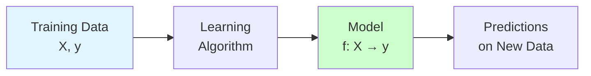
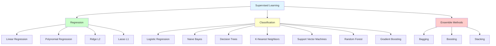
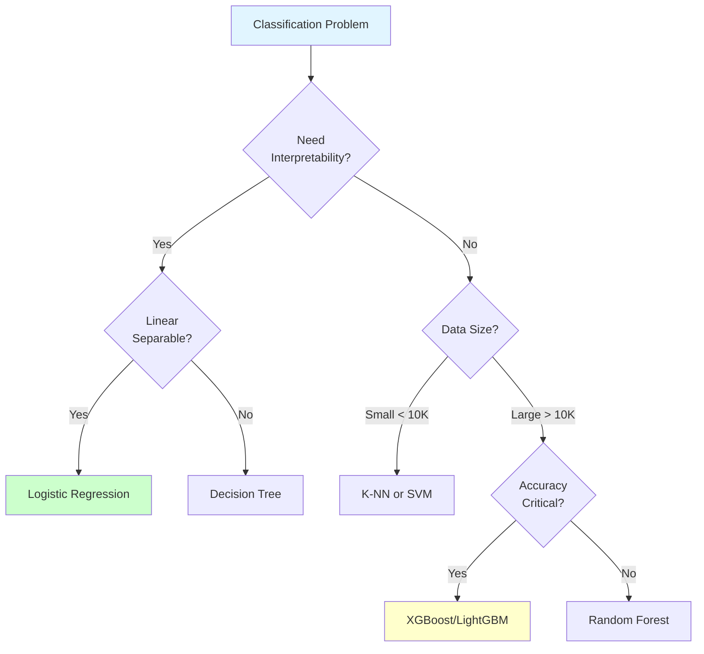
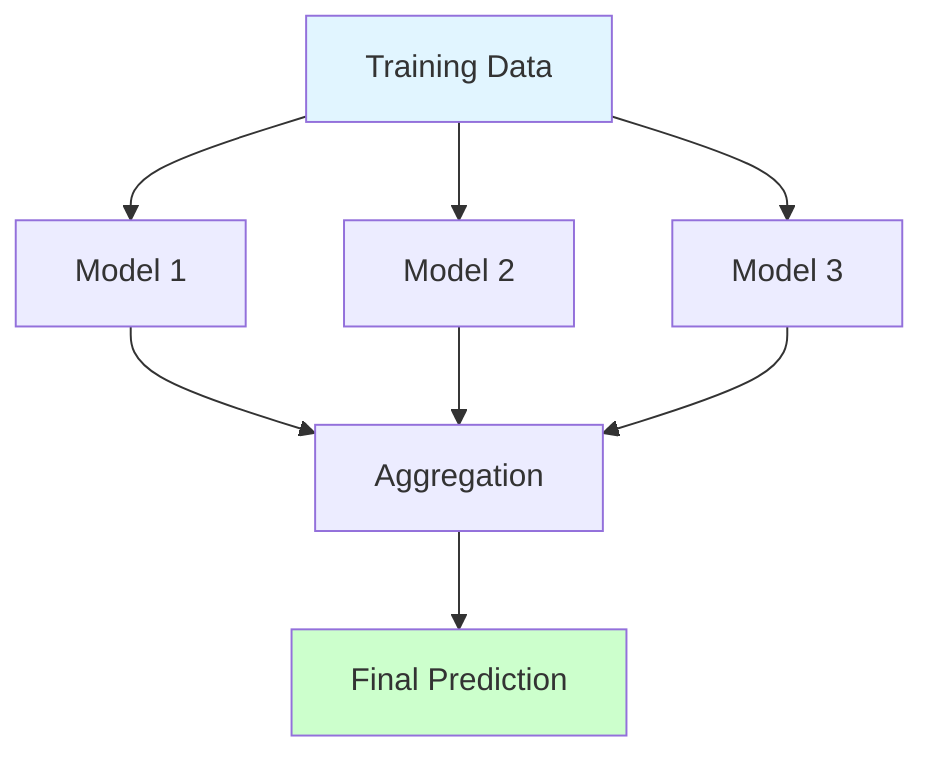

# Supervised Learning

**Master learning from labeled data.** Comprehensive coverage of regression, classification, and ensemble methods with mathematical intuition and practical implementations.

**Difficulty:** 🟢🟡 Beginner to Intermediate | **Time:** 4-6 weeks | **Prerequisites:** [ML Fundamentals](../fundamentals/index.md)

---

## 🎯 What is Supervised Learning?

**Supervised learning** is learning from labeled data - you have input features (X) and corresponding outputs (y), and you want to learn a mapping function f: X → y.



**Two Main Types:**
1. **Regression:** Predict continuous values (prices, temperatures)
2. **Classification:** Predict categories (spam/not spam, cat/dog)

---

## 📚 Section Overview



---

## 🔢 Regression

**Predict continuous numerical values**

### Overview
Regression algorithms predict real-valued outputs. Use when your target variable is continuous (house prices, temperature, stock prices, age).

**Common Applications:**
- Price prediction
- Demand forecasting
- Risk assessment
- Time series forecasting

### Topics

#### 1. Linear Regression 🟢
**The foundation of regression - simple and interpretable**

Learn the most fundamental ML algorithm that assumes linear relationships.

**Key Concepts:**
- Simple linear regression (one feature)
- Multiple linear regression (many features)
- Ordinary Least Squares (OLS)
- Assumptions: linearity, independence, normality, homoscedasticity
- Cost function: Mean Squared Error (MSE)

**Mathematical Foundation:**
```
y = β₀ + β₁x₁ + β₂x₂ + ... + βₙxₙ + ε
Minimize: J(β) = (1/2m) Σ(ŷᵢ - yᵢ)²
```

**When to Use:**
- Linear relationships
- Need interpretability
- Baseline model
- Small to medium datasets

**[→ Learn Linear Regression](regression/linear-regression.md)**

**Time:** 4-6 hours | **Difficulty:** 🟢 | **Interview:** ⭐⭐⭐⭐⭐

---

#### 2. Polynomial Regression 🟢
**Capture non-linear relationships with polynomial features**

Extend linear regression to model curved relationships.

**Key Concepts:**
- Feature engineering with polynomials
- Degree selection
- Overfitting risk with high degrees
- Interaction terms

**Mathematical Foundation:**
```
y = β₀ + β₁x + β₂x² + β₃x³ + ... + βₙxⁿ
```

**When to Use:**
- Non-linear but smooth relationships
- When you understand the relationship shape

**[→ Learn Polynomial Regression](regression/polynomial-regression.md)**

**Time:** 2-3 hours | **Difficulty:** 🟢

---

#### 3. Ridge Regression (L2 Regularization) 🟡
**Linear regression with L2 penalty to prevent overfitting**

Add regularization to handle multicollinearity and overfitting.

**Key Concepts:**
- L2 penalty: sum of squared coefficients
- Shrinks coefficients toward zero (but not exactly zero)
- Hyperparameter λ (alpha) controls regularization strength
- Handles multicollinearity well

**Mathematical Foundation:**
```
J(β) = MSE + λ Σβᵢ²
Minimizes squared error + penalty for large weights
```

**When to Use:**
- High multicollinearity
- More features than samples
- Prevent overfitting
- Keep all features

**[→ Learn Ridge Regression](regression/ridge-regression.md)**

**Time:** 3-4 hours | **Difficulty:** 🟡 | **Interview:** ⭐⭐⭐⭐

---

#### 4. Lasso Regression (L1 Regularization) 🟡
**Linear regression with L1 penalty for feature selection**

Regularization that can eliminate features by setting coefficients to zero.

**Key Concepts:**
- L1 penalty: sum of absolute values of coefficients
- Sets some coefficients exactly to zero (feature selection!)
- Hyperparameter λ (alpha) controls sparsity
- Useful for high-dimensional data

**Mathematical Foundation:**
```
J(β) = MSE + λ Σ|βᵢ|
Can shrink coefficients to exactly 0
```

**Ridge vs Lasso:**
| Aspect | Ridge (L2) | Lasso (L1) |
|--------|-----------|-----------|
| Penalty | Σβᵢ² | Σ\|βᵢ\| |
| Feature selection | No | Yes |
| Coefficients | Shrink toward 0 | Can be exactly 0 |
| Use when | Keep all features | Want feature selection |

**When to Use:**
- Feature selection needed
- Sparse solutions
- High-dimensional data
- Interpretability important

**[→ Learn Lasso Regression](regression/lasso-regression.md)**

**Time:** 3-4 hours | **Difficulty:** 🟡 | **Interview:** ⭐⭐⭐⭐

---

### Regression Quick Comparison

| Algorithm | Pros | Cons | Use Case |
|-----------|------|------|----------|
| **Linear** | Simple, interpretable, fast | Assumes linearity | Baseline, linear relationships |
| **Polynomial** | Captures curves | Overfits easily | Non-linear, smooth curves |
| **Ridge** | Handles multicollinearity | Doesn't eliminate features | Many correlated features |
| **Lasso** | Feature selection | Arbitrary selection with correlation | High-dimensional, sparse |

**[→ Explore All Regression Topics](regression/index.md)**

---

## 🎯 Classification

**Predict categorical labels**

### Overview
Classification algorithms predict discrete classes. Use when your target variable is categorical (spam/ham, cat/dog, disease diagnosis).

**Common Applications:**
- Spam detection
- Image classification
- Medical diagnosis
- Fraud detection
- Sentiment analysis

### Topics

#### 1. Logistic Regression 🟢
**The foundation of classification - probabilistic and interpretable**

Despite the name, it's a classification algorithm that predicts probabilities.

**Key Concepts:**
- Sigmoid function: σ(z) = 1/(1 + e^(-z))
- Log loss (binary cross-entropy)
- Decision boundary
- Probability interpretation
- Multi-class with softmax

**Mathematical Foundation:**
```
P(y=1|x) = σ(β₀ + β₁x₁ + ... + βₙxₙ)
σ(z) = 1/(1 + e^(-z))
```

**When to Use:**
- Binary classification
- Need probability estimates
- Interpretability important
- Baseline classifier

**[→ Learn Logistic Regression](classification/logistic-regression.md)**

**Time:** 4-5 hours | **Difficulty:** 🟢 | **Interview:** ⭐⭐⭐⭐⭐

---

#### 2. Naive Bayes 🟢
**Fast probabilistic classifier based on Bayes' theorem**

Assumes feature independence but works surprisingly well in practice.

**Key Concepts:**
- Bayes' theorem: P(y|X) ∝ P(X|y)P(y)
- "Naive" independence assumption
- Variants: Gaussian, Multinomial, Bernoulli
- Fast training and prediction

**When to Use:**
- Text classification (spam, sentiment)
- Real-time prediction
- High-dimensional data
- Small training set

**[→ Learn Naive Bayes](classification/naive-bayes.md)**

**Time:** 3-4 hours | **Difficulty:** 🟢 | **Interview:** ⭐⭐⭐

---

#### 3. Decision Trees 🟢
**Interpretable tree-based classifier using if-else rules**

Build a tree of decisions based on feature values.

**Key Concepts:**
- Splitting criteria: Gini impurity, Entropy, Information Gain
- Recursive partitioning
- Pruning to prevent overfitting
- Highly interpretable
- Handles non-linear relationships

**Mathematical Foundation:**
```
Gini Impurity: G = 1 - Σ(pᵢ)²
Entropy: H = -Σpᵢ log₂(pᵢ)
Information Gain: IG = H(parent) - Σ[weighted H(children)]
```

**When to Use:**
- Need interpretability
- Mixed data types
- Non-linear relationships
- Feature interactions

**[→ Learn Decision Trees](classification/decision-trees.md)**

**Time:** 4-5 hours | **Difficulty:** 🟢 | **Interview:** ⭐⭐⭐⭐

---

#### 4. K-Nearest Neighbors (KNN) 🟢
**Instance-based learning: predict based on nearest neighbors**

No training phase - just store data and find nearest neighbors.

**Key Concepts:**
- Distance metrics: Euclidean, Manhattan, Minkowski
- Choosing K (number of neighbors)
- Lazy learning (no training)
- Curse of dimensionality
- Feature scaling critical

**When to Use:**
- Small to medium datasets
- Simple baseline
- Non-linear decision boundaries
- Multi-class problems

**[→ Learn K-Nearest Neighbors](classification/knn.md)**

**Time:** 3-4 hours | **Difficulty:** 🟢 | **Interview:** ⭐⭐⭐

---

#### 5. Support Vector Machines (SVM) 🟡
**Find optimal decision boundary with maximum margin**

Powerful algorithm that finds the hyperplane that best separates classes.

**Key Concepts:**
- Maximum margin classifier
- Support vectors (critical points)
- Kernel trick (linear, RBF, polynomial)
- Soft margin for non-separable data
- C parameter (regularization)

**Mathematical Foundation:**
```
Maximize margin: min 1/2||w||² + C Σξᵢ
Decision function: f(x) = sign(w·x + b)
Kernel trick: K(x, x') = φ(x)·φ(x')
```

**When to Use:**
- High-dimensional data
- Clear margin of separation
- More features than samples
- Non-linear with kernel trick

**[→ Learn Support Vector Machines](classification/svm.md)**

**Time:** 5-6 hours | **Difficulty:** 🟡 | **Interview:** ⭐⭐⭐⭐

---

#### 6. Random Forest 🟡
**Ensemble of decision trees for robust predictions**

Build multiple decision trees and aggregate their predictions.

**Key Concepts:**
- Bagging (Bootstrap Aggregating)
- Random feature selection
- Out-of-bag (OOB) error
- Feature importance
- Less prone to overfitting than single tree

**When to Use:**
- Robust predictions needed
- Feature importance analysis
- Handle overfitting
- Large datasets
- Production systems

**[→ Learn Random Forest](classification/random-forest.md)**

**Time:** 4-5 hours | **Difficulty:** 🟡 | **Interview:** ⭐⭐⭐⭐⭐

---

#### 7. Gradient Boosting (XGBoost, LightGBM, CatBoost) 🟡
**Sequential ensemble that corrects previous mistakes**

Build trees sequentially, each correcting errors of previous trees.

**Key Concepts:**
- Boosting vs bagging
- Learning rate (shrinkage)
- XGBoost, LightGBM, CatBoost implementations
- Regularization parameters
- Handling missing values
- Feature importance

**When to Use:**
- Kaggle competitions (often wins!)
- Structured/tabular data
- Need high accuracy
- Have time for tuning

**[→ Learn Gradient Boosting](classification/gradient-boosting.md)**

**Time:** 5-6 hours | **Difficulty:** 🟡 | **Interview:** ⭐⭐⭐⭐⭐

---

### Classification Algorithm Selection



**[→ Explore All Classification Topics](classification/index.md)**

---

## 🎭 Ensemble Methods

**Combine multiple models for superior performance**

### Overview
Ensemble methods combine predictions from multiple models to create a stronger predictor.

**Main Approaches:**
1. **Bagging:** Train models in parallel (Random Forest)
2. **Boosting:** Train models sequentially (XGBoost, AdaBoost)
3. **Stacking:** Use meta-learner to combine models



### Topics

#### 1. Bagging (Bootstrap Aggregating) 🟡
**Reduce variance by averaging multiple models**

Train multiple models on different subsets and average predictions.

**Key Concepts:**
- Bootstrap sampling (sample with replacement)
- Train models in parallel
- Voting (classification) or averaging (regression)
- Out-of-bag evaluation
- Random Forest is bagging with decision trees

**When to Use:**
- Reduce overfitting
- Stabilize predictions
- Parallel training possible

**[→ Learn Bagging](ensemble-methods/bagging.md)**

**Time:** 3-4 hours | **Difficulty:** 🟡

---

#### 2. Boosting (AdaBoost, Gradient Boosting) 🟡
**Reduce bias by sequentially correcting errors**

Train models sequentially, each focusing on mistakes of previous ones.

**Key Concepts:**
- Sequential training
- Weight misclassified examples more
- Learning rate controls contribution
- AdaBoost, Gradient Boosting, XGBoost
- More prone to overfitting than bagging

**When to Use:**
- Need high accuracy
- Have computational resources
- Can tune carefully

**[→ Learn Boosting](ensemble-methods/boosting.md)**

**Time:** 4-5 hours | **Difficulty:** 🟡 | **Interview:** ⭐⭐⭐⭐

---

#### 3. Stacking 🔴
**Meta-learning: train a model to combine other models**

Use predictions from base models as features for a meta-model.

**Key Concepts:**
- Base models (level 0)
- Meta-model (level 1)
- Avoid leakage with cross-validation
- Can combine diverse models

**When to Use:**
- Have multiple good models
- Need best possible performance
- Have time for complexity

**[→ Learn Stacking](ensemble-methods/stacking.md)**

**Time:** 4-5 hours | **Difficulty:** 🔴

---

### Ensemble Methods Comparison

| Method | Training | Reduces | Best For |
|--------|----------|---------|----------|
| **Bagging** | Parallel | Variance | Reduce overfitting |
| **Boosting** | Sequential | Bias | Maximize accuracy |
| **Stacking** | Hierarchical | Both | Combine diverse models |

**[→ Explore Ensemble Methods](ensemble-methods/index.md)**

---

## 🎯 Algorithm Selection Guide

### Quick Decision Tree

```python
if problem == "regression":
    if relationship == "linear":
        use LinearRegression()
    elif want_feature_selection:
        use Lasso()
    elif multicollinearity:
        use Ridge()
    else:
        use RandomForestRegressor() or XGBRegressor()

elif problem == "classification":
    if need_interpretability:
        use LogisticRegression() or DecisionTreeClassifier()
    elif small_dataset:
        use KNN() or NaiveBayes()
    elif need_accuracy and have_time:
        use XGBClassifier() or LGBMClassifier()
    else:
        use RandomForestClassifier()
```

### Comprehensive Comparison

| Algorithm | Speed | Accuracy | Interpretability | Best For |
|-----------|-------|----------|------------------|----------|
| Linear/Logistic Regression | ⚡⚡⚡ | ⭐⭐ | ⭐⭐⭐ | Baseline, interpretability |
| Naive Bayes | ⚡⚡⚡ | ⭐⭐ | ⭐⭐ | Text, real-time |
| Decision Trees | ⚡⚡ | ⭐⭐ | ⭐⭐⭐ | Interpretability |
| K-NN | ⚡ | ⭐⭐ | ⭐ | Small datasets |
| SVM | ⚡⚡ | ⭐⭐⭐ | ⭐ | High-dimensional |
| Random Forest | ⚡⚡ | ⭐⭐⭐⭐ | ⭐⭐ | Robust, production |
| XGBoost | ⚡ | ⭐⭐⭐⭐⭐ | ⭐ | Competitions, accuracy |

---

## 📊 Hands-On Projects

### Beginner Projects
1. **House Price Prediction** (Regression)
   - Linear, Ridge, Lasso comparison
   - Feature engineering
   - Evaluation metrics

2. **Iris Classification** (Multi-class)
   - Logistic Regression, Decision Tree, KNN
   - Visualization
   - Confusion matrix

### Intermediate Projects
3. **Credit Card Fraud Detection**
   - Imbalanced data handling
   - Multiple classifiers
   - ROC-AUC analysis

4. **Customer Churn Prediction**
   - Feature engineering
   - Model comparison
   - Business insights

### Advanced Projects
5. **Kaggle Competition**
   - Ensemble methods
   - Hyperparameter tuning
   - Model stacking

---

## 🎓 Learning Path

### Week 1-2: Regression 🟢
- Day 1-3: Linear Regression
- Day 4-5: Polynomial Regression
- Day 6-7: Ridge and Lasso
- Project: House price prediction

### Week 3-4: Classification Basics 🟢
- Day 1-2: Logistic Regression
- Day 3-4: Decision Trees
- Day 5: KNN
- Day 6-7: Naive Bayes
- Project: Spam classifier

### Week 5-6: Advanced Classification 🟡
- Day 1-3: SVM
- Day 4-7: Random Forest and Gradient Boosting
- Project: Fraud detection

### Week 7: Ensemble Methods 🟡
- Day 1-3: Bagging and Boosting theory
- Day 4-5: XGBoost deep dive
- Day 6-7: Stacking
- Project: Kaggle competition

---

## 📚 Essential Resources

### Books
- *An Introduction to Statistical Learning* - Chapters 3-8
- *Hands-On Machine Learning* - Chapters 2-7
- *The Elements of Statistical Learning* - Chapters 3-10

### Online Courses
- Andrew Ng's ML Course - Week 1-6
- Fast.ai - Lessons 1-4
- StatQuest (YouTube) - All algorithms

### Practice
- Kaggle Learn - Intro to ML
- Kaggle Competitions - Titanic, House Prices
- UCI ML Repository - Datasets

---

## ⚠️ Common Pitfalls

!!! danger "Critical Mistakes to Avoid"
    1. **Data Leakage** - Always split before preprocessing!
    2. **Ignoring Imbalanced Data** - Don't use accuracy on imbalanced datasets
    3. **Not Scaling Features** - Critical for SVM, KNN, linear models
    4. **Overfitting** - Always use validation set
    5. **Wrong Metrics** - Choose metrics that match business goals
    6. **Feature Engineering** - Don't skip this step!

---

## 🚀 Next Steps

**After mastering supervised learning:**

1. **Explore Unsupervised Learning:**
   - [Clustering](../unsupervised-learning/clustering/index.md)
   - [Dimensionality Reduction](../unsupervised-learning/dimensionality-reduction/index.md)

2. **Improve Your Skills:**
   - [Feature Engineering](../feature-engineering/index.md)
   - [Model Evaluation](../evaluation/index.md)
   - [Hyperparameter Tuning](../optimization/hyperparameter-tuning.md)

3. **Advanced Topics:**
   - [Deep Learning](../deep-learning/index.md)
   - [MLOps](../mlops/index.md)

---

**Ready to master supervised learning?** Start with [Linear Regression](regression/linear-regression.md) or [Logistic Regression](classification/logistic-regression.md)! 🚀
