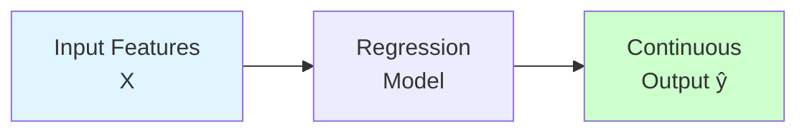
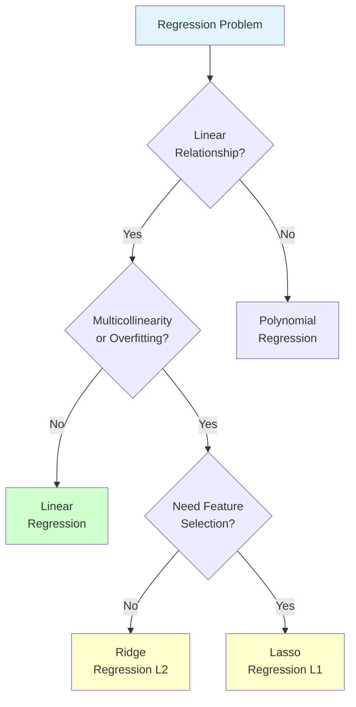

# Regression

**Predict continuous numerical values.** Master regression algorithms from linear models to advanced regularization techniques.

**Difficulty:** 🟢 Beginner | **Time:** 2-3 weeks | **Prerequisites:** [ML Fundamentals](../../fundamentals/index.md)

---

## 🎯 What is Regression?

**Regression** predicts continuous numerical outcomes based on input features. It's one of the most fundamental ML tasks.

**Examples:**
- Predict house prices based on size, location, age
- Forecast sales based on advertising spend
- Estimate temperature based on weather data
- Predict stock prices based on historical data



---

## 📚 Topics

### 1. Linear Regression 🟢
**The foundation - assume linear relationship between features and target**

**Formula:** `y = β₀ + β₁x₁ + β₂x₂ + ... + βₙxₙ`

**Key Concepts:**
- Ordinary Least Squares (OLS)
- Cost function: Mean Squared Error
- Normal equation vs Gradient Descent
- R² score for evaluation
- Assumptions: linearity, independence, normality, homoscedasticity

**When to Use:**
- Linear relationships
- Need interpretability
- Baseline model
- Small to medium datasets

**[→ Learn Linear Regression](linear-regression.md)**

**Difficulty:** 🟢 | **Time:** 4-6 hours | **Interview:** ⭐⭐⭐⭐⭐

---

### 2. Polynomial Regression 🟢
**Extend linear regression to capture non-linear relationships**

**Formula:** `y = β₀ + β₁x + β₂x² + β₃x³ + ...`

**Key Concepts:**
- Polynomial feature transformation
- Degree selection
- Overfitting risk
- Feature interactions
- Still uses linear regression after transformation

**When to Use:**
- Non-linear but smooth relationships
- Know the relationship shape
- Small number of features

**Visual:**
```
Degree 1: ──────  (straight line)
Degree 2: ∪∩      (parabola)
Degree 3: ∿       (cubic curve)
Degree 10: 〰️〰️  (overfits!)
```

**[→ Learn Polynomial Regression](polynomial-regression.md)**

**Difficulty:** 🟢 | **Time:** 2-3 hours

---

### 3. Ridge Regression (L2 Regularization) 🟡
**Add penalty for large coefficients to prevent overfitting**

**Formula:** `Cost = MSE + λ Σβᵢ²`

**Key Concepts:**
- L2 regularization penalty
- Shrinks coefficients toward zero
- Handles multicollinearity
- Hyperparameter λ (alpha)
- Keep all features (no feature selection)

**When to Use:**
- Many correlated features
- More features than samples
- Prevent overfitting
- Don't need feature selection

**Effect of λ:**
```
λ = 0:     No regularization (standard linear regression)
λ small:   Slight shrinkage
λ large:   Heavy shrinkage (coefficients → 0)
λ = ∞:     All coefficients = 0
```

**[→ Learn Ridge Regression](ridge-regression.md)**

**Difficulty:** 🟡 | **Time:** 3-4 hours | **Interview:** ⭐⭐⭐⭐

---

### 4. Lasso Regression (L1 Regularization) 🟡
**Regularization that eliminates features by setting coefficients to zero**

**Formula:** `Cost = MSE + λ Σ|βᵢ|`

**Key Concepts:**
- L1 regularization penalty
- Sets coefficients exactly to zero
- Automatic feature selection
- Produces sparse models
- Hyperparameter λ (alpha)

**When to Use:**
- High-dimensional data
- Want feature selection
- Sparse solutions needed
- Interpretability important

**Ridge vs Lasso:**
```
Ridge (L2): β₁=0.3, β₂=0.2, β₃=0.1  (all features kept)
Lasso (L1): β₁=0.5, β₂=0,   β₃=0    (feature selection)
```

**[→ Learn Lasso Regression](lasso-regression.md)**

**Difficulty:** 🟡 | **Time:** 3-4 hours | **Interview:** ⭐⭐⭐⭐

---

## 📊 Algorithm Comparison

### Visual Comparison

| Algorithm | Equation | Complexity | Regularization | Feature Selection |
|-----------|----------|------------|----------------|-------------------|
| **Linear** | y = β₀ + Σβᵢxᵢ | 🟢 Simple | None | No |
| **Polynomial** | y = β₀ + Σβᵢxᵢ^k | 🟡 Medium | None | No |
| **Ridge** | MSE + λΣβᵢ² | 🟡 Medium | L2 | No |
| **Lasso** | MSE + λΣ\|βᵢ\| | 🟡 Medium | L1 | Yes |

### When to Use Which



### Pros and Cons

#### Linear Regression
**Pros:**
- ✅ Simple and interpretable
- ✅ Fast training and prediction
- ✅ Works well with few features
- ✅ No hyperparameters to tune

**Cons:**
- ❌ Assumes linearity
- ❌ Sensitive to outliers
- ❌ Multicollinearity issues
- ❌ Overfits with many features

#### Polynomial Regression
**Pros:**
- ✅ Captures non-linear relationships
- ✅ Still interpretable (for low degrees)
- ✅ Flexible curve fitting

**Cons:**
- ❌ Easily overfits (high degree)
- ❌ Sensitive to outliers
- ❌ Extrapolation problems
- ❌ Choosing degree is tricky

#### Ridge Regression
**Pros:**
- ✅ Handles multicollinearity
- ✅ Prevents overfitting
- ✅ Stable with many features
- ✅ Keeps all features

**Cons:**
- ❌ No feature selection
- ❌ Need to tune λ
- ❌ Less interpretable
- ❌ All features included

#### Lasso Regression
**Pros:**
- ✅ Automatic feature selection
- ✅ Produces sparse models
- ✅ Handles high dimensions
- ✅ More interpretable (fewer features)

**Cons:**
- ❌ Arbitrary selection with correlated features
- ❌ Need to tune λ
- ❌ Unstable with small λ
- ❌ May remove important features

---

## 🎯 Evaluation Metrics

### For Regression Problems

#### 1. Mean Squared Error (MSE)
```
MSE = (1/n) Σ(yᵢ - ŷᵢ)²
```
- Penalizes large errors more
- Not in original units
- Always positive

#### 2. Root Mean Squared Error (RMSE)
```
RMSE = √MSE
```
- In original units of target
- Interpretable
- Standard metric

#### 3. Mean Absolute Error (MAE)
```
MAE = (1/n) Σ|yᵢ - ŷᵢ|
```
- Less sensitive to outliers
- In original units
- Easy to understand

#### 4. R² Score (Coefficient of Determination)
```
R² = 1 - (SS_res / SS_tot)
```
- 0 to 1 (higher is better)
- Percentage of variance explained
- Can be negative (worse than mean)

**Which to Use?**
- **MSE/RMSE:** When large errors are costly
- **MAE:** When all errors treated equally
- **R²:** For comparing models, understanding fit

---

## 🛠️ Practical Implementation

### Code Template

```python
from sklearn.linear_model import LinearRegression, Ridge, Lasso
from sklearn.preprocessing import PolynomialFeatures
from sklearn.model_selection import train_test_split
from sklearn.metrics import mean_squared_error, r2_score

# Load and split data
X_train, X_test, y_train, y_test = train_test_split(
    X, y, test_size=0.2, random_state=42
)

# 1. Linear Regression
linear_model = LinearRegression()
linear_model.fit(X_train, y_train)
y_pred = linear_model.predict(X_test)
print(f"Linear R²: {r2_score(y_test, y_pred)}")

# 2. Polynomial Regression
poly = PolynomialFeatures(degree=2)
X_poly_train = poly.fit_transform(X_train)
X_poly_test = poly.transform(X_test)
poly_model = LinearRegression()
poly_model.fit(X_poly_train, y_train)
y_pred = poly_model.predict(X_poly_test)
print(f"Polynomial R²: {r2_score(y_test, y_pred)}")

# 3. Ridge Regression
ridge_model = Ridge(alpha=1.0)
ridge_model.fit(X_train, y_train)
y_pred = ridge_model.predict(X_test)
print(f"Ridge R²: {r2_score(y_test, y_pred)}")

# 4. Lasso Regression
lasso_model = Lasso(alpha=1.0)
lasso_model.fit(X_train, y_train)
y_pred = lasso_model.predict(X_test)
print(f"Lasso R²: {r2_score(y_test, y_pred)}")
print(f"Features selected: {(lasso_model.coef_ != 0).sum()}")
```

### Hyperparameter Tuning

```python
from sklearn.model_selection import GridSearchCV

# Ridge
param_grid = {'alpha': [0.001, 0.01, 0.1, 1, 10, 100]}
ridge_cv = GridSearchCV(Ridge(), param_grid, cv=5)
ridge_cv.fit(X_train, y_train)
print(f"Best alpha: {ridge_cv.best_params_}")

# Lasso
lasso_cv = GridSearchCV(Lasso(), param_grid, cv=5)
lasso_cv.fit(X_train, y_train)
print(f"Best alpha: {lasso_cv.best_params_}")
```

---

## 📚 Hands-On Projects

### Beginner: House Price Prediction
**Goal:** Predict house prices using linear and polynomial regression

**Dataset:** Boston Housing or Kaggle House Prices

**Steps:**
1. Load and explore data
2. Feature engineering
3. Train linear regression (baseline)
4. Try polynomial features
5. Compare models
6. Evaluate with MSE, R²

### Intermediate: Sales Forecasting with Regularization
**Goal:** Predict sales with many features, handle multicollinearity

**Steps:**
1. Create many features (interactions, polynomials)
2. Check for multicollinearity (VIF)
3. Train Ridge and Lasso
4. Compare feature selection
5. Tune hyperparameters
6. Interpret coefficients

### Advanced: Multi-Output Regression
**Goal:** Predict multiple targets simultaneously

**Steps:**
1. Multi-output problem setup
2. Ridge/Lasso with multiple outputs
3. Feature importance analysis
4. Cross-validation
5. Production pipeline

---

## 🎓 Learning Path

### Week 1: Linear and Polynomial
**Days 1-3:** Linear Regression
- Theory and math
- Implementation from scratch
- Scikit-learn
- Project: Simple prediction

**Days 4-5:** Polynomial Regression
- Feature engineering
- Overfitting detection
- Degree selection
- Project: Non-linear data

### Week 2: Regularization
**Days 1-3:** Ridge Regression
- L2 regularization
- Hyperparameter tuning
- Cross-validation
- Project: High-dimensional data

**Days 4-5:** Lasso Regression
- L1 regularization
- Feature selection
- Elastic Net (bonus)
- Project: Feature selection task

**Days 6-7:** Comparison and Practice
- Compare all methods
- Kaggle competition
- Review and consolidate

---

## ⚠️ Common Mistakes

!!! danger "Pitfalls to Avoid"
    1. **Not scaling features** - Critical for Ridge/Lasso
    2. **Polynomial overfitting** - Always validate
    3. **Wrong train/test split** - Scale after splitting!
    4. **Ignoring assumptions** - Check linearity, normality
    5. **Using R² alone** - Check residual plots
    6. **Not tuning λ** - Cross-validate regularization parameter

---

## 📖 Additional Resources

### Theory
- *An Introduction to Statistical Learning* - Chapter 3, 6
- *The Elements of Statistical Learning* - Chapter 3
- Khan Academy - Linear Regression

### Practice
- Kaggle: House Prices Competition
- UCI ML Repository: Regression datasets
- StatQuest (YouTube): Regression series

### Tools
- Scikit-learn documentation
- Statsmodels for detailed statistics
- Yellowbrick for visualization

---

## 🚀 Next Steps

**After mastering regression:**

1. **Learn Classification:**
   - [Logistic Regression](../classification/logistic-regression.md)
   - [Decision Trees](../classification/decision-trees.md)

2. **Improve Your Skills:**
   - [Feature Engineering](../../feature-engineering/index.md)
   - [Cross-Validation](../../evaluation/cross-validation.md)
   - [Hyperparameter Tuning](../../optimization/hyperparameter-tuning.md)

3. **Advanced Topics:**
   - [Neural Networks](../../deep-learning/neural-networks-basics.md)
   - Elastic Net (Ridge + Lasso)
   - Quantile Regression

---

**Ready to master regression?** Start with [Linear Regression](linear-regression.md)! 🚀
