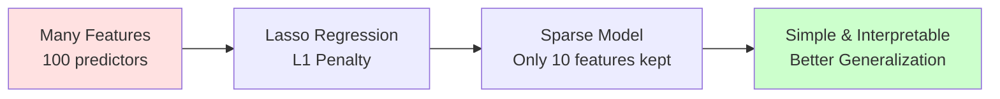

# Lasso Regression

**Automatic feature selection through L1 regularization by setting coefficients exactly to zero.** Lasso (Least Absolute Shrinkage and Selection Operator) adds a penalty that shrinks less important features to zero, giving you sparse models that are both simple and interpretable.

**Difficulty:** 🟡 Intermediate | **Time:** 2-3 hours | **Prerequisites:** Linear Regression, Ridge Regression

---

## Overview

Lasso Regression uses L1 regularization, which adds a penalty proportional to the absolute value of coefficients. Unlike Ridge (L2), Lasso can set coefficients exactly to zero, effectively performing automatic feature selection while preventing overfitting.

**Use cases:** High-dimensional data, feature selection, sparse solutions, interpretable models

---

## Intuition 💡

### The Big Idea

While Ridge shrinks all coefficients toward zero, Lasso goes further: it sets coefficients of unimportant features **exactly to zero**. This is automatic feature selection built into the optimization process.



### Real-World Analogy

Imagine predicting house prices with 100 potential features (size, rooms, age, neighborhood, school quality, crime rate, etc.):

- **Linear Regression:** Uses ALL 100 features → overfits, hard to interpret
- **Ridge Regression:** Shrinks all 100 coefficients → still uses all features
- **Lasso Regression:** Says "only 15 features actually matter" → sets 85 to zero → simple, interpretable model

### Visual Understanding

```
Coefficient Value
  ↑
  |  ●●●        ← Linear: All features used
  |
  |    ◆◆◆     ← Ridge: All shrunk but non-zero
  |
  |      ■■■__ ← Lasso: Many exactly zero!
  |_________________________________→ Feature Index

Lasso creates sparse solutions
(most coefficients = 0)
```

### Why Does Lasso Set Coefficients to Zero?

The L1 penalty has "corners" at zero that make it likely to hit exactly zero during optimization, unlike smooth L2.

```
Ridge (L2): |β| = √(β²)    ← Smooth, approaches zero gradually
Lasso (L1): |β| = |β|      ← Has corner at zero, hits it exactly
```

---

## When to Use ✅ / When to Avoid ❌

### ✅ Good For

| Scenario | Why It Works |
|----------|--------------|
| **Feature selection needed** | Automatically identifies important features by setting others to zero |
| **High-dimensional data** | Reduces 1000s of features to interpretable subset |
| **Sparse solutions desired** | Many features, but only a few truly matter |
| **Interpretability priority** | Smaller model easier to understand and explain |
| **Redundant features** | Picks one from correlated group, sets others to zero |
| **Model deployment** | Fewer features = faster predictions, less data needed |

**Examples:**
- Genomics: 20,000 genes, find ~50 that predict disease
- Text classification: 10,000 words, identify key terms
- Financial modeling: 500 factors, find 20 most predictive
- Sensor data: 100 sensors, identify critical ones

### ❌ Not Good For

| Scenario | Why It Fails / Alternative |
|----------|----------------------------|
| **Highly correlated features** | Arbitrarily picks one, ignores others → Use **Ridge** or **Elastic Net** |
| **All features important** | Don't want feature selection → Use **Ridge** |
| **More features than samples (n > p)** | Can select at most n features → Use **Elastic Net** |
| **Grouped correlated features** | Won't select the group together → Use **Group Lasso** |
| **Features on different scales** | Must scale first! Lasso is scale-sensitive |

**When to use instead:**
- Correlated features + selection: **Elastic Net** (combines L1 + L2)
- All features useful: **Ridge**
- Complex non-linear: **Random Forest** (built-in feature importance)
- Need grouped selection: **Group Lasso**, **Sparse Group Lasso**

---

## Mathematical Foundation

### Cost Function with L1 Penalty

Lasso minimizes:

$$J(\beta) = \frac{1}{2m}\sum_{i=1}^{m}(\hat{y}^{(i)} - y^{(i)})^2 + \alpha \sum_{j=1}^{n}|\beta_j|$$

Where:
- First term: Mean Squared Error (fit to data)
- Second term: L1 penalty (sum of absolute values)
- $\alpha$ (alpha): Regularization strength (hyperparameter)
- $|\beta_j|$: Absolute value of coefficient (not squared like Ridge!)

### Comparison: Ridge vs Lasso

| Aspect | Ridge (L2) | Lasso (L1) |
|--------|------------|------------|
| **Penalty** | $\alpha \sum \beta_j^2$ | $\alpha \sum |\beta_j|$ |
| **Coefficients** | Shrink toward zero | Set exactly to zero |
| **Feature selection** | No | Yes |
| **Solution** | Closed-form available | No closed-form (iterative) |
| **Correlated features** | Shares weight evenly | Picks one arbitrarily |

### No Closed-Form Solution

Unlike Ridge, Lasso has no closed-form solution due to the non-differentiable absolute value at zero. Must use iterative methods:

1. **Coordinate Descent** (most common, efficient)
2. **Least Angle Regression (LARS)**
3. **Proximal Gradient Descent**

### Coordinate Descent Algorithm

Optimize one coefficient at a time, cycling through all:

$$\beta_j := \text{soft\_threshold}\left( \frac{\sum x_{ij}(y_i - \hat{y}_i^{(-j)})}{{\sum x_{ij}^2}}, \alpha \right)$$

Where soft-thresholding operator:

$$\text{soft\_threshold}(z, \lambda) = \begin{cases}
z - \lambda & \text{if } z > \lambda \\
0 & \text{if } |z| \leq \lambda \\
z + \lambda & \text{if } z < -\lambda
\end{cases}$$

This is what sets coefficients exactly to zero!

---

## Implementation

### Using Scikit-learn

```python
import numpy as np
import matplotlib.pyplot as plt
from sklearn.linear_model import Lasso, Ridge, LinearRegression
from sklearn.model_selection import train_test_split
from sklearn.preprocessing import StandardScaler
from sklearn.metrics import mean_squared_error, r2_score

# Generate data with sparse true coefficients
np.random.seed(42)
n_samples = 100
n_features = 20

# Only 5 out of 20 features are truly important
X = np.random.randn(n_samples, n_features)
true_coef = np.zeros(n_features)
true_coef[:5] = [5, 3, -2, 4, -3]  # Only first 5 features matter

y = X @ true_coef + np.random.randn(n_samples) * 0.5

# Split and scale
X_train, X_test, y_train, y_test = train_test_split(
    X, y, test_size=0.2, random_state=42
)

scaler = StandardScaler()
X_train_scaled = scaler.fit_transform(X_train)
X_test_scaled = scaler.transform(X_test)

# Train Lasso
lasso = Lasso(alpha=0.1)
lasso.fit(X_train_scaled, y_train)

# Compare with Ridge and Linear
ridge = Ridge(alpha=0.1)
linear = LinearRegression()

ridge.fit(X_train_scaled, y_train)
linear.fit(X_train_scaled, y_train)

# Predictions
y_pred_lasso = lasso.predict(X_test_scaled)
y_pred_ridge = ridge.predict(X_test_scaled)
y_pred_linear = linear.predict(X_test_scaled)

# Evaluate
print("Lasso Regression (α=0.1):")
print(f"  Test R²:  {r2_score(y_test, y_pred_lasso):.3f}")
print(f"  RMSE:     {np.sqrt(mean_squared_error(y_test, y_pred_lasso)):.3f}")
print(f"  Non-zero coefs: {np.sum(lasso.coef_ != 0)} / {n_features}")

print("\nRidge Regression (α=0.1):")
print(f"  Test R²:  {r2_score(y_test, y_pred_ridge):.3f}")
print(f"  RMSE:     {np.sqrt(mean_squared_error(y_test, y_pred_ridge)):.3f}")
print(f"  Non-zero coefs: {np.sum(ridge.coef_ != 0)} / {n_features}")

print("\nLinear Regression:")
print(f"  Test R²:  {r2_score(y_test, y_pred_linear):.3f}")
print(f"  RMSE:     {np.sqrt(mean_squared_error(y_test, y_pred_linear)):.3f}")

# Visualize coefficients
fig, axes = plt.subplots(1, 3, figsize=(15, 5))

for ax, model, name in zip(axes, [linear, ridge, lasso],
                             ['Linear', 'Ridge', 'Lasso']):
    ax.stem(range(n_features), true_coef, linefmt='g-', markerfmt='go',
            basefmt=' ', label='True')
    ax.stem(range(n_features), model.coef_, linefmt='r-', markerfmt='rs',
            basefmt=' ', label='Learned')
    ax.set_xlabel('Feature Index')
    ax.set_ylabel('Coefficient Value')
    ax.set_title(f'{name} Coefficients')
    ax.legend()
    ax.grid(True, alpha=0.3)
    ax.axhline(y=0, color='black', linewidth=0.5)

plt.tight_layout()
plt.show()
```

### Feature Selection with Lasso

```python
# Identify selected features
selected_features = np.where(lasso.coef_ != 0)[0]
print(f"\nLasso selected {len(selected_features)} features:")
print(f"Indices: {selected_features.tolist()}")
print(f"True important features: [0, 1, 2, 3, 4]")

# Compare coefficient magnitudes
print("\nCoefficient magnitudes:")
print(f"Lasso - Mean |coef|: {np.mean(np.abs(lasso.coef_)):.3f}")
print(f"Ridge - Mean |coef|: {np.mean(np.abs(ridge.coef_)):.3f}")
print(f"Linear - Mean |coef|: {np.mean(np.abs(linear.coef_)):.3f}")
```

### Effect of Alpha on Feature Selection

```python
# Try different alpha values
alphas = [0.001, 0.01, 0.1, 0.5, 1.0, 2.0]
n_features_selected = []
train_scores = []
test_scores = []
coefficients = []

for alpha in alphas:
    lasso = Lasso(alpha=alpha, max_iter=10000)
    lasso.fit(X_train_scaled, y_train)

    n_features_selected.append(np.sum(lasso.coef_ != 0))
    train_scores.append(lasso.score(X_train_scaled, y_train))
    test_scores.append(lasso.score(X_test_scaled, y_test))
    coefficients.append(lasso.coef_.copy())

# Visualize
fig, axes = plt.subplots(1, 2, figsize=(15, 5))

# Performance vs alpha
axes[0].semilogx(alphas, train_scores, 'o-', label='Train Score', linewidth=2)
axes[0].semilogx(alphas, test_scores, 's-', label='Test Score', linewidth=2)
axes[0].set_xlabel('Alpha (log scale)')
axes[0].set_ylabel('R² Score')
axes[0].set_title('Model Performance vs Alpha')
axes[0].legend()
axes[0].grid(True, alpha=0.3)

# Features selected vs alpha
ax2 = axes[0].twinx()
ax2.semilogx(alphas, n_features_selected, 'D-', color='green',
             label='Features Selected', linewidth=2)
ax2.set_ylabel('Number of Features Selected', color='green')
ax2.tick_params(axis='y', labelcolor='green')

# Regularization path
coefficients = np.array(coefficients)
for i in range(n_features):
    axes[1].semilogx(alphas, coefficients[:, i], 'o-', alpha=0.6)
axes[1].set_xlabel('Alpha (log scale)')
axes[1].set_ylabel('Coefficient Value')
axes[1].set_title('Lasso Regularization Path')
axes[1].axhline(y=0, color='black', linestyle='--', linewidth=1)
axes[1].grid(True, alpha=0.3)

plt.tight_layout()
plt.show()
```

!!! tip "Interpreting Lasso Paths"
    - **Low α:** Most features kept (like linear regression)
    - **Medium α:** Gradual feature elimination
    - **High α:** Only most important features remain
    - **Very high α:** All features eliminated (only intercept)

### From Scratch - Coordinate Descent

```python
class LassoRegression:
    """Lasso Regression using Coordinate Descent"""

    def __init__(self, alpha=1.0, max_iter=1000, tol=1e-4):
        self.alpha = alpha
        self.max_iter = max_iter
        self.tol = tol
        self.coef_ = None
        self.intercept_ = None
        self.n_iter_ = 0

    def _soft_threshold(self, rho, lambda_):
        """Soft-thresholding operator"""
        if rho < -lambda_:
            return rho + lambda_
        elif rho > lambda_:
            return rho - lambda_
        else:
            return 0

    def fit(self, X, y):
        """Train using coordinate descent"""
        n_samples, n_features = X.shape

        # Center data (Lasso typically doesn't penalize intercept)
        X_mean = np.mean(X, axis=0)
        y_mean = np.mean(y)
        X_centered = X - X_mean
        y_centered = y - y_mean

        # Initialize coefficients
        self.coef_ = np.zeros(n_features)

        # Coordinate descent
        for iteration in range(self.max_iter):
            coef_old = self.coef_.copy()

            # Update each coefficient
            for j in range(n_features):
                # Compute residual without feature j
                residual = y_centered - X_centered @ self.coef_ + \
                          X_centered[:, j] * self.coef_[j]

                # Compute rho_j
                rho = np.dot(X_centered[:, j], residual)

                # Soft-threshold
                z_j = np.sum(X_centered[:, j] ** 2)
                if z_j > 0:
                    self.coef_[j] = self._soft_threshold(rho, n_samples * self.alpha) / z_j

            # Check convergence
            diff = np.max(np.abs(self.coef_ - coef_old))
            if diff < self.tol:
                self.n_iter_ = iteration + 1
                break

        # Compute intercept
        self.intercept_ = y_mean - np.dot(X_mean, self.coef_)

        return self

    def predict(self, X):
        """Make predictions"""
        return X @ self.coef_ + self.intercept_

# Usage
lasso_scratch = LassoRegression(alpha=0.1, max_iter=1000)
lasso_scratch.fit(X_train_scaled, y_train)
y_pred_scratch = lasso_scratch.predict(X_test_scaled)

print(f"From Scratch - Test R²: {r2_score(y_test, y_pred_scratch):.3f}")
print(f"Converged in {lasso_scratch.n_iter_} iterations")
print(f"Non-zero coefficients: {np.sum(lasso_scratch.coef_ != 0)}")

# Compare with sklearn
lasso_sklearn = Lasso(alpha=0.1, max_iter=1000)
lasso_sklearn.fit(X_train_scaled, y_train)

print(f"\nCoefficient comparison:")
print(f"Max difference: {np.max(np.abs(lasso_scratch.coef_ - lasso_sklearn.coef_)):.6f}")
```

### Cross-Validation for Optimal Alpha

```python
from sklearn.linear_model import LassoCV

# LassoCV automatically finds best alpha using cross-validation
alphas = np.logspace(-4, 1, 100)

lasso_cv = LassoCV(alphas=alphas, cv=5, max_iter=10000, random_state=42)
lasso_cv.fit(X_train_scaled, y_train)

print(f"Optimal alpha: {lasso_cv.alpha_:.4f}")
print(f"Test R²: {lasso_cv.score(X_test_scaled, y_test):.3f}")
print(f"Features selected: {np.sum(lasso_cv.coef_ != 0)} / {n_features}")

# Visualize CV results
mse_path = np.mean(lasso_cv.mse_path_, axis=1)
std_path = np.std(lasso_cv.mse_path_, axis=1)

plt.figure(figsize=(10, 6))
plt.semilogx(lasso_cv.alphas_, mse_path, label='Mean CV MSE')
plt.fill_between(lasso_cv.alphas_, mse_path - std_path, mse_path + std_path,
                 alpha=0.2)
plt.axvline(lasso_cv.alpha_, color='red', linestyle='--',
            label=f'Optimal α = {lasso_cv.alpha_:.4f}')
plt.xlabel('Alpha')
plt.ylabel('Mean Squared Error')
plt.title('Cross-Validation for Optimal Alpha')
plt.legend()
plt.grid(True, alpha=0.3)
plt.show()
```

---

## Visualization

### Lasso vs Ridge Feature Selection

```python
# Compare feature selection behavior
alphas_to_plot = [0.01, 0.1, 0.5, 1.0]
fig, axes = plt.subplots(2, 4, figsize=(20, 10))

for idx, alpha in enumerate(alphas_to_plot):
    # Lasso
    lasso = Lasso(alpha=alpha, max_iter=10000)
    lasso.fit(X_train_scaled, y_train)

    # Ridge
    ridge = Ridge(alpha=alpha)
    ridge.fit(X_train_scaled, y_train)

    # Plot Lasso
    axes[0, idx].stem(range(n_features), true_coef, linefmt='g-', markerfmt='go',
                      basefmt=' ', label='True', alpha=0.5)
    axes[0, idx].stem(range(n_features), lasso.coef_, linefmt='r-', markerfmt='rs',
                      basefmt=' ', label='Lasso')
    axes[0, idx].set_title(f'Lasso (α={alpha})\n{np.sum(lasso.coef_ != 0)} features')
    axes[0, idx].set_xlabel('Feature Index')
    axes[0, idx].set_ylabel('Coefficient')
    axes[0, idx].legend()
    axes[0, idx].grid(True, alpha=0.3)
    axes[0, idx].axhline(y=0, color='black', linewidth=0.5)

    # Plot Ridge
    axes[1, idx].stem(range(n_features), true_coef, linefmt='g-', markerfmt='go',
                      basefmt=' ', label='True', alpha=0.5)
    axes[1, idx].stem(range(n_features), ridge.coef_, linefmt='b-', markerfmt='bs',
                      basefmt=' ', label='Ridge')
    axes[1, idx].set_title(f'Ridge (α={alpha})\n{np.sum(ridge.coef_ != 0)} features')
    axes[1, idx].set_xlabel('Feature Index')
    axes[1, idx].set_ylabel('Coefficient')
    axes[1, idx].legend()
    axes[1, idx].grid(True, alpha=0.3)
    axes[1, idx].axhline(y=0, color='black', linewidth=0.5)

plt.tight_layout()
plt.show()
```

### Geometric Interpretation

```python
# Visualize why Lasso sets coefficients to zero (geometric view)
fig, axes = plt.subplots(1, 2, figsize=(14, 6))

# Ridge constraint region (circle)
theta = np.linspace(0, 2*np.pi, 100)
r = 1
axes[0].plot(r*np.cos(theta), r*np.sin(theta), 'b-', linewidth=2,
             label='L2 constraint: β₁² + β₂² ≤ t')
axes[0].set_aspect('equal')
axes[0].axhline(y=0, color='gray', linewidth=0.5)
axes[0].axvline(x=0, color='gray', linewidth=0.5)
axes[0].grid(True, alpha=0.3)
axes[0].set_xlabel('β₁')
axes[0].set_ylabel('β₂')
axes[0].set_title('Ridge (L2): Smooth constraint\nGradually shrinks to zero')
axes[0].legend()

# Add elliptical contours (RSS)
for level in [0.5, 1.0, 1.5]:
    theta = np.linspace(0, 2*np.pi, 100)
    axes[0].plot(2 + level*np.cos(theta), 0.5 + level*0.7*np.sin(theta),
                 'r--', alpha=0.5)

# Lasso constraint region (diamond)
axes[1].plot([1, 0, -1, 0, 1], [0, 1, 0, -1, 0], 'r-', linewidth=2,
             label='L1 constraint: |β₁| + |β₂| ≤ t')
axes[1].set_aspect('equal')
axes[1].axhline(y=0, color='gray', linewidth=0.5)
axes[1].axvline(x=0, color='gray', linewidth=0.5)
axes[1].grid(True, alpha=0.3)
axes[1].set_xlabel('β₁')
axes[1].set_ylabel('β₂')
axes[1].set_title('Lasso (L1): Diamond constraint\nHits corners → zero coefficients')
axes[1].legend()

# Add elliptical contours (RSS)
for level in [0.5, 1.0, 1.5]:
    theta = np.linspace(0, 2*np.pi, 100)
    axes[1].plot(2 + level*np.cos(theta), 0.5 + level*0.7*np.sin(theta),
                 'r--', alpha=0.5)

plt.tight_layout()
plt.show()
```

!!! tip "Why Lasso Creates Sparse Solutions"
    The diamond shape of L1 constraint has **corners on the axes**. When RSS contours (ellipses) touch the constraint, they're likely to hit a corner where one coefficient is exactly zero. Ridge's circular constraint has no corners, so both coefficients shrink gradually but never hit zero exactly.

### Sparse vs Dense Solutions

```python
# Create high-dimensional problem
n_samples = 50
n_features = 100
n_informative = 10

X_high = np.random.randn(n_samples, n_features)
true_coef_high = np.zeros(n_features)
true_coef_high[:n_informative] = np.random.randn(n_informative)
y_high = X_high @ true_coef_high + np.random.randn(n_samples) * 0.1

# Scale
scaler = StandardScaler()
X_high_scaled = scaler.fit_transform(X_high)

# Fit models
lasso_high = LassoCV(alphas=np.logspace(-3, 1, 50), cv=5, max_iter=10000)
ridge_high = Ridge(alpha=1.0)

lasso_high.fit(X_high_scaled, y_high)
ridge_high.fit(X_high_scaled, y_high)

# Visualize sparsity
fig, axes = plt.subplots(2, 2, figsize=(14, 10))

# Coefficients comparison
axes[0, 0].stem(range(n_features), true_coef_high, linefmt='g-', markerfmt='go',
                basefmt=' ', label='True (10 non-zero)', alpha=0.5)
axes[0, 0].set_title('True Coefficients')
axes[0, 0].set_xlabel('Feature Index')
axes[0, 0].set_ylabel('Coefficient Value')
axes[0, 0].legend()
axes[0, 0].grid(True, alpha=0.3)

axes[0, 1].stem(range(n_features), lasso_high.coef_, linefmt='r-', markerfmt='rs',
                basefmt=' ')
axes[0, 1].set_title(f'Lasso ({np.sum(lasso_high.coef_ != 0)} non-zero)')
axes[0, 1].set_xlabel('Feature Index')
axes[0, 1].set_ylabel('Coefficient Value')
axes[0, 1].grid(True, alpha=0.3)

axes[1, 0].stem(range(n_features), ridge_high.coef_, linefmt='b-', markerfmt='bs',
                basefmt=' ')
axes[1, 0].set_title(f'Ridge ({np.sum(ridge_high.coef_ != 0)} non-zero)')
axes[1, 0].set_xlabel('Feature Index')
axes[1, 0].set_ylabel('Coefficient Value')
axes[1, 0].grid(True, alpha=0.3)

# Coefficient magnitude distribution
axes[1, 1].hist(np.abs(lasso_high.coef_), bins=30, alpha=0.5, label='Lasso', color='red')
axes[1, 1].hist(np.abs(ridge_high.coef_), bins=30, alpha=0.5, label='Ridge', color='blue')
axes[1, 1].set_xlabel('|Coefficient|')
axes[1, 1].set_ylabel('Frequency')
axes[1, 1].set_title('Coefficient Magnitude Distribution')
axes[1, 1].legend()
axes[1, 1].set_yscale('log')

plt.tight_layout()
plt.show()

print(f"True non-zero features: {n_informative}")
print(f"Lasso selected: {np.sum(lasso_high.coef_ != 0)}")
print(f"Ridge selected: {np.sum(ridge_high.coef_ != 0)}")
```

---

## Hyperparameters

### Key Parameters

| Parameter | What It Does | Typical Range | Tips |
|-----------|--------------|---------------|------|
| `alpha` | Regularization strength | 0.001 - 10 | **Most critical!**<br/>Higher = more features eliminated<br/>Use LassoCV to find optimal |
| `max_iter` | Maximum iterations | 1000 - 100000 | Increase if not converging<br/>Lasso may need more than Ridge |
| `tol` | Convergence tolerance | 1e-4 to 1e-6 | Lower = more precise convergence |
| `selection` | Coefficient update order | 'cyclic', 'random' | 'random' can be faster |
| `warm_start` | Reuse previous solution | True/False | True for path computation |

### Finding Optimal Alpha

```python
from sklearn.model_selection import cross_val_score

# Method 1: LassoCV (recommended)
lasso_cv = LassoCV(
    alphas=np.logspace(-4, 1, 100),
    cv=10,
    max_iter=10000,
    n_jobs=-1,
    random_state=42
)
lasso_cv.fit(X_train_scaled, y_train)
print(f"LassoCV optimal alpha: {lasso_cv.alpha_:.4f}")

# Method 2: Manual grid search with custom scoring
alphas = np.logspace(-4, 1, 50)
scores = []
n_features_list = []

for alpha in alphas:
    lasso = Lasso(alpha=alpha, max_iter=10000)
    cv_scores = cross_val_score(lasso, X_train_scaled, y_train, cv=5, scoring='r2')
    scores.append(cv_scores.mean())
    lasso.fit(X_train_scaled, y_train)  # Fit to get feature count
    n_features_list.append(np.sum(lasso.coef_ != 0))

# Find alpha with best score
best_idx = np.argmax(scores)
best_alpha = alphas[best_idx]
best_score = scores[best_idx]
best_n_features = n_features_list[best_idx]

plt.figure(figsize=(12, 5))

# Plot 1: Scores
plt.subplot(1, 2, 1)
plt.semilogx(alphas, scores, 'o-', linewidth=2)
plt.axvline(best_alpha, color='red', linestyle='--',
            label=f'Best α={best_alpha:.4f}, R²={best_score:.3f}')
plt.xlabel('Alpha')
plt.ylabel('Cross-Validation R² Score')
plt.title('Model Performance vs Alpha')
plt.legend()
plt.grid(True, alpha=0.3)

# Plot 2: Feature count
plt.subplot(1, 2, 2)
plt.semilogx(alphas, n_features_list, 's-', linewidth=2, color='green')
plt.axvline(best_alpha, color='red', linestyle='--',
            label=f'Best α: {best_n_features} features')
plt.xlabel('Alpha')
plt.ylabel('Number of Selected Features')
plt.title('Feature Selection vs Alpha')
plt.legend()
plt.grid(True, alpha=0.3)

plt.tight_layout()
plt.show()
```

!!! tip "Choosing Alpha Strategy"
    - **Performance priority:** Choose α that maximizes CV score
    - **Sparsity priority:** Choose higher α for fewer features (may sacrifice some accuracy)
    - **Balance:** Use "1-SE rule" - choose simpler model within 1 standard error of best

---

## Complexity Analysis

### Time Complexity

| Method | Training | Prediction | Notes |
|--------|----------|------------|-------|
| **Coordinate Descent** | $O(k \cdot p \cdot n)$ | $O(p)$ | $k$ = iterations, $p$ = features, $n$ = samples |
| **LARS** | $O(p^3 + p^2 n)$ | $O(p)$ | Faster when $p \ll n$ |
| **For α path (multiple αs)** | $O(k \cdot p \cdot n \cdot m)$ | $O(p)$ | $m$ = number of α values |

### Space Complexity

- **Storage:** $O(p)$ for coefficients (sparse!)
- **Training:** $O(np)$ for data matrix
- **Advantage:** Sparse solution uses less memory for deployment

### Comparison with Ridge

- **Training:** Similar complexity, but Lasso may need more iterations
- **Prediction:** Same $O(p)$, but Lasso often has fewer non-zero coefficients → faster in practice
- **Memory:** Lasso uses less memory (sparse storage)

---

## Common Pitfalls

### 1. Not Scaling Features

!!! warning "Scaling is MANDATORY for Lasso"
    **Problem:** Lasso's L1 penalty treats all coefficients equally. Unscaled features have arbitrary magnitudes → unfair penalization.

    **Example:**
    - Feature 1: Income ($20k-$200k) → large scale
    - Feature 2: Age (20-80) → small scale

    Lasso will eliminate Feature 2 first (smaller scale), even if it's important!

    **Solution:** ALWAYS scale
    ```python
    from sklearn.preprocessing import StandardScaler
    from sklearn.pipeline import Pipeline

    # CORRECT: Pipeline with scaling
    pipeline = Pipeline([
        ('scaler', StandardScaler()),
        ('lasso', LassoCV(cv=5))
    ])
    pipeline.fit(X_train, y_train)
    ```

### 2. Convergence Issues

!!! warning "Lasso Not Converging"
    **Problem:** Coordinate descent may not converge within default iterations.

    **Signs:**
    ```
    ConvergenceWarning: Objective did not converge.
    ```

    **Solutions:**
    ```python
    # Increase max_iter
    lasso = Lasso(alpha=0.1, max_iter=100000)

    # Or loosen tolerance
    lasso = Lasso(alpha=0.1, tol=1e-3)

    # Check if it converged
    lasso.fit(X_train_scaled, y_train)
    print(f"Converged in {lasso.n_iter_} iterations")
    ```

### 3. Arbitrary Selection Among Correlated Features

!!! warning "Correlated Features Problem"
    **Problem:** When features are highly correlated, Lasso arbitrarily picks one and sets others to zero. This is unstable and misleading.

    **Example:**
    - Features: "house size sq ft" and "house size sq meters" (perfectly correlated)
    - Lasso will randomly pick one, set other to zero
    - Results change with different random seeds!

    **Solution:** Use Elastic Net (combines L1 + L2)
    ```python
    from sklearn.linear_model import ElasticNetCV

    # Elastic Net handles correlated features better
    elastic = ElasticNetCV(
        l1_ratio=[.1, .5, .7, .9, .95, .99, 1],  # Try different L1/L2 mixes
        alphas=np.logspace(-4, 1, 50),
        cv=5
    )
    elastic.fit(X_train_scaled, y_train)

    print(f"Optimal l1_ratio: {elastic.l1_ratio_:.2f}")
    print(f"Optimal alpha: {elastic.alpha_:.4f}")
    ```

### 4. Over-Sparsification

!!! warning "Alpha Too High"
    **Problem:** Too much regularization eliminates all features.

    **Signs:**
    - All coefficients zero (or only intercept)
    - Poor performance on both train and test
    - Model predicts constant value

    **Solution:**
    ```python
    # Check if model is too sparse
    if np.sum(lasso.coef_ != 0) < 3:
        print("⚠️  Warning: Very sparse model, try lower alpha")

    # Use cross-validation to find better alpha
    lasso_cv = LassoCV(alphas=np.logspace(-4, 0, 50), cv=5)
    lasso_cv.fit(X_train_scaled, y_train)
    ```

### 5. Under-Sparsification

!!! warning "Alpha Too Low"
    **Problem:** Regularization too weak, keeps too many features.

    **Signs:**
    - Most/all features selected
    - Behaves like linear regression
    - Overfitting observed

    **Solution:**
    ```python
    # Check feature count
    n_selected = np.sum(lasso.coef_ != 0)
    if n_selected > 0.7 * n_features:
        print(f"⚠️  Warning: {n_selected}/{n_features} features selected")
        print("Consider higher alpha for more feature selection")
    ```

### 6. Misinterpreting Zero Coefficients

!!! warning "Zero ≠ Unimportant"
    **Problem:** Lasso sets correlated features to zero, but they might still be important!

    **Example:**
    - Two highly correlated features A and B, both important
    - Lasso keeps A, sets B=0
    - B appears "unimportant" but that's misleading!

    **Solution:**
    - Check feature correlations before interpreting results
    - Consider Elastic Net for correlated features
    - Use domain knowledge to validate selections

---

## Evaluation Metrics

### Standard Metrics + Sparsity

```python
from sklearn.metrics import (
    mean_squared_error,
    mean_absolute_error,
    r2_score
)

def evaluate_lasso(model, X_train, X_test, y_train, y_test, alpha):
    """Comprehensive Lasso evaluation with sparsity metrics"""

    y_train_pred = model.predict(X_train)
    y_test_pred = model.predict(X_test)

    print(f"Lasso Regression (α={alpha})")
    print("=" * 60)

    # Standard regression metrics
    train_r2 = r2_score(y_train, y_train_pred)
    test_r2 = r2_score(y_test, y_test_pred)

    print(f"\nPerformance Metrics:")
    print(f"  Train R²: {train_r2:.3f}")
    print(f"  Test R²:  {test_r2:.3f}")
    print(f"  Train RMSE: {np.sqrt(mean_squared_error(y_train, y_train_pred)):.3f}")
    print(f"  Test RMSE:  {np.sqrt(mean_squared_error(y_test, y_test_pred)):.3f}")

    # Sparsity metrics
    n_features = len(model.coef_)
    n_selected = np.sum(model.coef_ != 0)
    sparsity = 1 - (n_selected / n_features)

    print(f"\nSparsity Metrics:")
    print(f"  Total features:     {n_features}")
    print(f"  Selected features:  {n_selected}")
    print(f"  Eliminated features: {n_features - n_selected}")
    print(f"  Sparsity:           {sparsity:.1%}")

    # Coefficient analysis
    non_zero_coefs = model.coef_[model.coef_ != 0]
    if len(non_zero_coefs) > 0:
        print(f"\nCoefficient Statistics (non-zero only):")
        print(f"  Mean |coef|: {np.mean(np.abs(non_zero_coefs)):.3f}")
        print(f"  Max |coef|:  {np.max(np.abs(non_zero_coefs)):.3f}")
        print(f"  Min |coef|:  {np.min(np.abs(non_zero_coefs)):.3f}")

    # Feature importance
    if n_selected > 0:
        feature_importance = np.argsort(np.abs(model.coef_))[::-1]
        print(f"\nTop 5 Important Features:")
        for i, idx in enumerate(feature_importance[:5]):
            if model.coef_[idx] != 0:
                print(f"  {i+1}. Feature {idx}: {model.coef_[idx]:.3f}")

    # Generalization check
    gap = train_r2 - test_r2
    if gap > 0.1:
        print(f"\n⚠️  Warning: High train-test gap ({gap:.3f})")
    elif gap < 0:
        print(f"\n✓ Test score better than train (good!)")
    else:
        print(f"\n✓ Good generalization (gap: {gap:.3f})")

    return {
        'train_r2': train_r2,
        'test_r2': test_r2,
        'n_selected': n_selected,
        'sparsity': sparsity
    }

# Usage
lasso = LassoCV(alphas=np.logspace(-3, 1, 50), cv=5, max_iter=10000)
lasso.fit(X_train_scaled, y_train)
results = evaluate_lasso(lasso, X_train_scaled, X_test_scaled,
                         y_train, y_test, lasso.alpha_)
```

---

## Practice Problems

### 🟢 Beginner

!!! example "Problem 1: Feature Selection"
    Generate data with 20 features where only 5 are truly important. Use Lasso to identify the important features.

    **Tasks:**
    - Create synthetic data with known sparse coefficients
    - Train Lasso with different alphas
    - Visualize which features are selected
    - Compare with true important features

    **Hint:** Use `make_regression` with `n_informative=5`.

!!! example "Problem 2: Lasso vs Ridge Comparison"
    Train both Lasso and Ridge on the same dataset. Compare:
    - Number of features selected
    - Coefficient magnitudes
    - Test performance

    **Hint:** Use the same alpha for fair comparison.

### 🟡 Intermediate

!!! example "Problem 3: Optimal Alpha Selection"
    Use cross-validation to find optimal alpha. Plot:
    - CV score vs alpha
    - Number of selected features vs alpha
    - Regularization path

    **Challenge:** Implement "1-SE rule" to select simpler model.

!!! example "Problem 4: Handle Correlated Features"
    Create dataset with groups of highly correlated features. Show Lasso's arbitrary selection problem and solve with Elastic Net.

    **Tasks:**
    - Create 3 groups of 3 correlated features each
    - Show Lasso picks one from each group arbitrarily
    - Demonstrate Elastic Net's better behavior
    - Visualize coefficient stability across different random seeds

### 🔴 Advanced

!!! example "Problem 5: High-Dimensional Real Data"
    Apply Lasso to real high-dimensional data (genomics, text classification, or sensor data).

    **Requirements:**
    - Handle data preprocessing (scaling, missing values)
    - Use LassoCV for alpha selection
    - Analyze selected features (are they meaningful?)
    - Compare with Random Forest feature importance
    - Create interpretable visualizations
    - Deploy model with only selected features

!!! example "Problem 6: Production Pipeline with Feature Selection"
    Build complete ML pipeline:
    - Exploratory data analysis
    - Feature engineering
    - Lasso feature selection
    - Model comparison (Lasso, Ridge, Elastic Net, RF)
    - Hyperparameter tuning
    - Model interpretation
    - Create deployment-ready artifact (save scaler + model + selected features)

    **Include:**
    - Cross-validation with proper pipeline
    - Learning curves
    - Feature importance analysis
    - Model persistence
    - Prediction API with input validation

---

## Extensions & Variations

### Elastic Net (Best of Both Worlds)

Combines L1 (Lasso) and L2 (Ridge):

$$J(\beta) = \frac{1}{2m}\sum_{i=1}^{m}(\hat{y}^{(i)} - y^{(i)})^2 + \alpha \left( \rho \sum|\beta_j| + \frac{1-\rho}{2}\sum\beta_j^2 \right)$$

```python
from sklearn.linear_model import ElasticNet, ElasticNetCV

# Elastic Net: balance between Lasso and Ridge
# l1_ratio: 0 = Ridge, 1 = Lasso, 0.5 = equal mix
elastic = ElasticNetCV(
    l1_ratio=[.1, .5, .7, .9, .95, .99],  # Try different mixes
    alphas=np.logspace(-4, 1, 50),
    cv=5,
    max_iter=10000
)
elastic.fit(X_train_scaled, y_train)

print(f"Optimal l1_ratio: {elastic.l1_ratio_:.2f}")
print(f"Optimal alpha: {elastic.alpha_:.4f}")
print(f"Features selected: {np.sum(elastic.coef_ != 0)}")
```

### Group Lasso

Select/eliminate groups of features together:

```python
# Example: sklearn-compatible group lasso
# from group_lasso import GroupLasso

# Define feature groups
groups = np.array([0, 0, 0, 1, 1, 1, 2, 2, 2, 3, 3, 3])

# Group Lasso eliminates entire groups
# Useful when features naturally group (e.g., one-hot encoded categories)
```

### Adaptive Lasso

Weights the L1 penalty by coefficient importance:

```python
# Two-stage approach
# Stage 1: Ridge to get initial estimates
ridge = Ridge(alpha=1.0)
ridge.fit(X_train_scaled, y_train)

# Stage 2: Adaptive weights for Lasso
weights = 1 / (np.abs(ridge.coef_) + 1e-6)

# Lasso with weighted penalties (requires custom implementation)
# More likely to keep truly important features
```

### Sparse Group Lasso

Sparsity both within and across groups:

```python
# Combines Group Lasso + Lasso
# Eliminates groups AND individual features within groups
# Useful for structured feature selection
```

---

## Real-World Applications

1. **Genomics:** Select relevant genes from 20,000+ for disease prediction
2. **Text Classification:** Identify key words from 10,000+ vocabulary
3. **Finance:** Feature selection for trading strategies (100+ indicators)
4. **Medical Diagnosis:** Select relevant symptoms/tests from comprehensive exams
5. **Sensor Networks:** Identify critical sensors (reduce monitoring costs)
6. **Marketing:** Find effective features from customer behavior data

### Example: Gene Selection for Cancer Prediction

```python
# Simulate gene expression data
np.random.seed(42)
n_patients = 100
n_genes = 1000
n_cancer_genes = 20

# Gene expression data
X_genes = np.random.randn(n_patients, n_genes)

# Only 20 genes are related to cancer
true_coef = np.zeros(n_genes)
cancer_genes = np.random.choice(n_genes, n_cancer_genes, replace=False)
true_coef[cancer_genes] = np.random.randn(n_cancer_genes)

# Cancer outcome (0 or 1, but treat as regression for simplicity)
y_cancer = (X_genes @ true_coef + np.random.randn(n_patients)) > 0
y_cancer = y_cancer.astype(float)

# Scale
scaler = StandardScaler()
X_genes_scaled = scaler.fit_transform(X_genes)

# Lasso feature selection
lasso_genes = LassoCV(alphas=np.logspace(-4, 0, 50), cv=10, max_iter=10000)
lasso_genes.fit(X_genes_scaled, y_cancer)

# Identify selected genes
selected_genes = np.where(lasso_genes.coef_ != 0)[0]

print(f"Total genes: {n_genes}")
print(f"True cancer genes: {n_cancer_genes}")
print(f"Lasso selected: {len(selected_genes)}")

# How many true positives?
true_positives = len(set(selected_genes) & set(cancer_genes))
false_positives = len(set(selected_genes) - set(cancer_genes))
false_negatives = len(set(cancer_genes) - set(selected_genes))

print(f"\nFeature Selection Quality:")
print(f"  True positives:  {true_positives}/{n_cancer_genes}")
print(f"  False positives: {false_positives}")
print(f"  False negatives: {false_negatives}")
print(f"  Precision: {true_positives/(true_positives+false_positives):.2%}")
print(f"  Recall:    {true_positives/n_cancer_genes:.2%}")
```

---

## Related Topics

- [Linear Regression](linear-regression.md) - Foundation without regularization
- [Ridge Regression](ridge-regression.md) - L2 regularization (comparison)
- [Elastic Net](elastic-net.md) - Combines L1 + L2
- [Feature Selection Methods](../../preprocessing/feature-selection.md) - Other approaches
- [Polynomial Regression](polynomial-regression.md) - Use Lasso to select polynomial terms

---

## References

1. **Scikit-learn Documentation:** [Lasso Regression](https://scikit-learn.org/stable/modules/generated/sklearn.linear_model.Lasso.html)
2. **Paper:** Tibshirani (1996) - "Regression Shrinkage and Selection via the Lasso"
3. **Book:** *Elements of Statistical Learning* by Hastie et al. (Chapter 3.4)
4. **Book:** *Statistical Learning with Sparsity* by Hastie et al. (2015)
5. **Course:** Stanford CS229 - Regularization and Feature Selection
6. **Interactive:** [Lasso Path Visualization](http://www.science.smith.edu/~jcrouser/SDS293/labs/lab10-py.html)

---

**Next Steps:**
- Compare with [Ridge Regression](ridge-regression.md)
- Learn [Elastic Net](elastic-net.md) for handling correlated features
- Apply to [Polynomial Features](polynomial-regression.md) for automatic term selection
- Explore [Advanced Feature Selection](../../preprocessing/feature-selection.md)

**Ready to select features like a pro?** Start with the beginner problems above!
