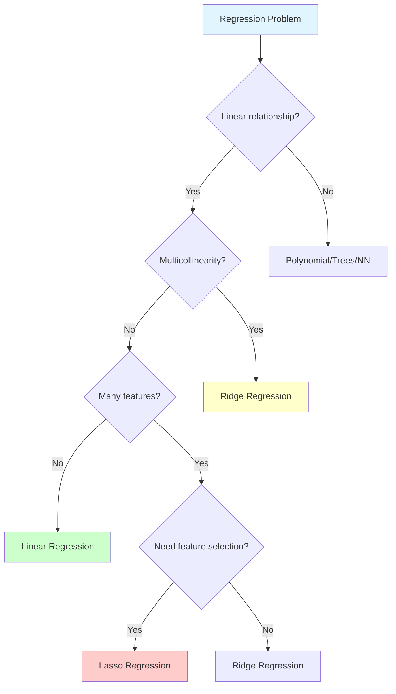

# Linear Regression

**Predict continuous values by fitting a line through data points.** Linear regression is the foundation of machine learning - simple, interpretable, and surprisingly powerful.

**Difficulty:** 🟢 Beginner | **Time:** 1-2 hours | **Prerequisites:** Basic Python, Basic Math

---

## Quick Reference

| Property | Value |
|----------|-------|
| **Type** | Supervised Learning |
| **Task** | Regression |
| **Complexity** | Training: O(n³) or O(k·m·n), Prediction: O(n) |
| **Interpretability** | ⭐⭐⭐⭐⭐ Excellent |
| **Pros** | Simple, fast, interpretable, works well with small data |
| **Cons** | Assumes linearity, sensitive to outliers, can't capture complex patterns |
| **When to Use** | Linear relationships, need interpretability, baseline model |
| **When to Avoid** | Non-linear data, complex patterns, presence of outliers |

---

## Complete Guide

=== "📖 Overview"
    ## What is Linear Regression?

    Linear Regression finds the best-fit line (or hyperplane in higher dimensions) that minimizes the distance between predicted and actual values. It's used when you need to predict a continuous numerical output.

    **When to Use:**

    - Linear relationships between features and target
    - Need high interpretability ("each unit increase in X leads to Y change")
    - Quick baseline model to understand your data
    - Small to medium datasets with clear patterns
    - Feature importance analysis
    - Extrapolation within reasonable bounds

    **When to Avoid:**

    - Non-linear relationships (use Polynomial, Decision Trees, Neural Networks)
    - Presence of outliers (use Robust Regression, RANSAC)
    - High-dimensional data where features >> samples (use Ridge, Lasso)
    - Multicollinearity issues (use Ridge Regression)
    - Need for complex decision boundaries (use tree-based models)

    **Real-World Applications:**

    - House price prediction based on square footage
    - Sales forecasting from advertising spend
    - Temperature estimation from atmospheric conditions
    - Stock trend analysis
    - Salary prediction from years of experience

=== "🧮 Theory & Math"
    ## Intuition First

    **Think of Linear Regression like drawing the best line through scattered points on a graph:**

    Imagine you're trying to predict house prices based on square footage. You plot your data points and notice they roughly follow a line. Linear regression finds the **best line** that fits these points by minimizing how far the points are from that line.

    ```mermaid
    graph LR
        A[Data Points<br/>X, y] --> B[Find Best Line<br/>y = mx + b]
        B --> C[Minimize Distance<br/>from Points to Line]
        C --> D[Make Predictions<br/>on New Data]

        style A fill:#e1f5ff
        style D fill:#ccffcc
    ```

    **Real-World Analogy:**

    Predicting commute time based on distance to work:
    - **Input (X):** Distance to work in miles
    - **Output (y):** Commute time in minutes
    - **Goal:** Find the relationship (e.g., "each mile adds ~3 minutes")
    - **Prediction:** For a 15-mile commute → ~45 minutes

    ---

    ## Mathematical Foundation

    ### Simple Linear Regression (One Feature)

    The model tries to find the best line:

    $$\hat{y} = \theta_0 + \theta_1 x$$

    Where:

    - $\hat{y}$ = predicted value
    - $\theta_0$ = intercept (where line crosses y-axis)
    - $\theta_1$ = slope (how much y changes per unit of x)
    - $x$ = input feature

    ### Multiple Linear Regression (Many Features)

    $$\hat{y} = \theta_0 + \theta_1 x_1 + \theta_2 x_2 + ... + \theta_n x_n$$

    In vector form:

    $$\hat{y} = \theta^T x$$

    Where $\theta$ is the vector of parameters and $x$ is the feature vector.

    ### Cost Function (Mean Squared Error)

    We want to minimize the average squared difference between predictions and actual values:

    $$J(\theta) = \frac{1}{2m}\sum_{i=1}^{m}(\hat{y}^{(i)} - y^{(i)})^2$$

    Where:

    - $m$ = number of training examples
    - $\hat{y}^{(i)}$ = prediction for example $i$
    - $y^{(i)}$ = actual value for example $i$

    **Why MSE (and not absolute error)?**

    1. **Differentiable everywhere** - Enables gradient descent optimization
    2. **Penalizes large errors more** - Single large error worse than many small ones
    3. **Maximum Likelihood under Gaussian noise** - Theoretically justified when errors are normally distributed
    4. **Computationally efficient** - Square operations are fast
    5. **Convex function** - Guaranteed global minimum (no local minima)

    ### Finding Optimal Parameters

    **Option 1: Closed-Form Solution (Normal Equation)**

    $$\theta = (X^T X)^{-1} X^T y$$

    **Why this works:**

    - Take derivative of J(θ) with respect to θ
    - Set derivative to zero (finding minimum)
    - Solve for θ algebraically

    **Pros:** No iterations needed, exact solution

    **Cons:** Slow when n (features) is large (O(n³)), requires matrix inversion

    **Option 2: Gradient Descent**

    Iteratively update parameters by moving in direction of steepest descent:

    $$\theta_j := \theta_j - \alpha \frac{\partial J}{\partial \theta_j}$$

    Where $\alpha$ is the learning rate.

    **The gradient is:**

    $$\frac{\partial J}{\partial \theta_j} = \frac{1}{m}\sum_{i=1}^{m}(\hat{y}^{(i)} - y^{(i)}) x_j^{(i)}$$

    **Pros:** Works with large n, can use mini-batches

    **Cons:** Requires choosing learning rate, needs multiple iterations

    ---

    ## Step-by-Step Gradient Derivation

    **Step 1: Start with cost function**

    $$J(\theta) = \frac{1}{2m}\sum_{i=1}^{m}(h_\theta(x^{(i)}) - y^{(i)})^2$$

    Where $h_\theta(x) = \theta^T x$

    **Step 2: Apply chain rule**

    $$\frac{\partial J}{\partial \theta_j} = \frac{1}{m}\sum_{i=1}^{m} \frac{\partial}{\partial \theta_j}[(h_\theta(x^{(i)}) - y^{(i)})^2]$$

    **Step 3: Differentiate squared term**

    $$= \frac{1}{m}\sum_{i=1}^{m} 2(h_\theta(x^{(i)}) - y^{(i)}) \cdot \frac{\partial}{\partial \theta_j}[h_\theta(x^{(i)})]$$

    **Step 4: Differentiate hypothesis**

    $$= \frac{1}{m}\sum_{i=1}^{m} 2(h_\theta(x^{(i)}) - y^{(i)}) \cdot x_j^{(i)}$$

    **Step 5: Simplify (absorb 2 into learning rate)**

    $$\frac{\partial J}{\partial \theta_j} = \frac{1}{m}\sum_{i=1}^{m}(h_\theta(x^{(i)}) - y^{(i)})x_j^{(i)}$$

    **Interpretation:** The gradient is the average of (error × feature value) across all examples.

    ---

    ## Geometric Interpretation

    In 2D (one feature):
    - Minimize vertical distances from points to line
    - Find slope and intercept that make these distances smallest

    In higher dimensions:
    - Fitting a hyperplane through n-dimensional space
    - Same principle: minimize perpendicular distances

    ---

    ## Assumptions of Linear Regression

    **1. Linearity:** Relationship between X and y is linear

    **2. Independence:** Observations are independent

    **3. Homoscedasticity:** Constant variance of residuals

    **4. Normality:** Residuals are normally distributed

    **5. No multicollinearity:** Features are not highly correlated

    **When assumptions fail:**

    - Non-linearity → Use polynomial features or tree-based models
    - Heteroscedasticity → Use weighted least squares or robust regression
    - Non-normal residuals → Transform target variable or use robust methods
    - Multicollinearity → Use Ridge or Lasso regression

=== "💻 Implementation"
    ## Using Scikit-learn

    ```python
    import numpy as np
    import matplotlib.pyplot as plt
    from sklearn.linear_model import LinearRegression
    from sklearn.model_selection import train_test_split
    from sklearn.metrics import mean_squared_error, r2_score

    # Generate sample data
    np.random.seed(42)
    X = 2 * np.random.rand(100, 1)  # Feature: size (0-2)
    y = 4 + 3 * X + np.random.randn(100, 1)  # Target: price = 4 + 3*size + noise

    # Split data
    X_train, X_test, y_train, y_test = train_test_split(
        X, y, test_size=0.2, random_state=42
    )

    # Create and train model
    model = LinearRegression()
    model.fit(X_train, y_train)

    # Make predictions
    y_pred = model.predict(X_test)

    # Evaluate
    mse = mean_squared_error(y_test, y_pred)
    rmse = np.sqrt(mse)
    r2 = r2_score(y_test, y_pred)

    print(f"Coefficient (slope): {model.coef_[0][0]:.2f}")
    print(f"Intercept: {model.intercept_[0]:.2f}")
    print(f"RMSE: {rmse:.3f}")
    print(f"R² Score: {r2:.3f}")

    # Visualize
    plt.figure(figsize=(10, 6))
    plt.scatter(X_test, y_test, color='blue', label='Actual', alpha=0.6)
    plt.plot(X_test, y_pred, color='red', linewidth=2, label='Predicted')
    plt.xlabel('X')
    plt.ylabel('y')
    plt.legend()
    plt.title('Linear Regression: Actual vs Predicted')
    plt.show()
    ```

    ---

    ## From Scratch - Gradient Descent

    ```python
    class LinearRegressionGD:
        """Linear Regression using Gradient Descent"""

        def __init__(self, learning_rate=0.01, n_iterations=1000):
            self.lr = learning_rate
            self.n_iterations = n_iterations
            self.weights = None
            self.bias = None
            self.losses = []

        def fit(self, X, y):
            """Train the model"""
            n_samples, n_features = X.shape

            # Initialize parameters
            self.weights = np.zeros(n_features)
            self.bias = 0

            # Gradient descent
            for i in range(self.n_iterations):
                # Forward pass: compute predictions
                y_pred = np.dot(X, self.weights) + self.bias

                # Compute loss (MSE)
                loss = np.mean((y_pred - y) ** 2)
                self.losses.append(loss)

                # Compute gradients
                dw = (2 / n_samples) * np.dot(X.T, (y_pred - y))
                db = (2 / n_samples) * np.sum(y_pred - y)

                # Update parameters
                self.weights -= self.lr * dw
                self.bias -= self.lr * db

                if i % 100 == 0:
                    print(f"Iteration {i}: Loss = {loss:.4f}")

            return self

        def predict(self, X):
            """Make predictions"""
            return np.dot(X, self.weights) + self.bias

    # Usage
    model_gd = LinearRegressionGD(learning_rate=0.01, n_iterations=1000)
    model_gd.fit(X_train, y_train.ravel())
    y_pred_gd = model_gd.predict(X_test)

    print(f"\nGradient Descent - Weights: {model_gd.weights}")
    print(f"Gradient Descent - Bias: {model_gd.bias:.2f}")

    # Plot loss curve
    plt.figure(figsize=(10, 6))
    plt.plot(model_gd.losses)
    plt.xlabel('Iteration')
    plt.ylabel('Loss (MSE)')
    plt.title('Training Loss over Time')
    plt.show()
    ```

    ---

    ## From Scratch - Normal Equation

    ```python
    class LinearRegressionNE:
        """Linear Regression using Normal Equation"""

        def __init__(self):
            self.weights = None
            self.bias = None

        def fit(self, X, y):
            """Train using closed-form solution"""
            # Add bias column (column of ones)
            X_b = np.c_[np.ones((X.shape[0], 1)), X]

            # Normal equation: θ = (X^T X)^-1 X^T y
            theta = np.linalg.inv(X_b.T @ X_b) @ X_b.T @ y

            self.bias = theta[0]
            self.weights = theta[1:]

            return self

        def predict(self, X):
            """Make predictions"""
            return X @ self.weights + self.bias

    # Usage
    model_ne = LinearRegressionNE()
    model_ne.fit(X_train, y_train)
    y_pred_ne = model_ne.predict(X_test)

    print(f"\nNormal Equation - Weights: {model_ne.weights}")
    print(f"Normal Equation - Bias: {model_ne.bias[0]:.2f}")
    ```

=== "📊 Visualization"
    ## Visual Understanding

    ```
    Price ($)
      ↑
      |     ●
      |   ●   ●
      |  ●  /  ●
      | ●  /    ●
      |   / ←  Best-fit line
      | ●/
      |/____________→ Size (sq ft)
    ```

    ---

    ## Residuals Plot

    ```python
    # Residuals = Actual - Predicted
    residuals = y_test - y_pred

    plt.figure(figsize=(12, 5))

    # Residuals vs Predictions
    plt.subplot(1, 2, 1)
    plt.scatter(y_pred, residuals, alpha=0.6)
    plt.axhline(y=0, color='r', linestyle='--')
    plt.xlabel('Predicted Values')
    plt.ylabel('Residuals')
    plt.title('Residuals vs Predicted Values')

    # Residuals distribution
    plt.subplot(1, 2, 2)
    plt.hist(residuals, bins=20, edgecolor='black')
    plt.xlabel('Residuals')
    plt.ylabel('Frequency')
    plt.title('Distribution of Residuals')

    plt.tight_layout()
    plt.show()
    ```

    **Good model:** Residuals should be randomly scattered around zero with no clear pattern.

    ---

    ## Algorithm Trace Example

    ```
    Initial: θ₀ = 0, θ₁ = 0
    Data: [(1, 5), (2, 7), (3, 9), (4, 11)]

    Step 1: Calculate predictions
      ŷ = 0 + 0*X = [0, 0, 0, 0]

    Step 2: Calculate error
      MSE = mean((y - ŷ)²) = mean([25, 49, 81, 121]) = 69

    Step 3: Calculate gradients
      ∂MSE/∂θ₀ = -2*mean(y - ŷ) = -16
      ∂MSE/∂θ₁ = -2*mean(X*(y - ŷ)) = -45

    Step 4: Update parameters (α = 0.01)
      θ₀ = 0 - 0.01*(-16) = 0.16
      θ₁ = 0 - 0.01*(-45) = 0.45

    ... Repeat until convergence ...

    Final: θ₀ ≈ 3, θ₁ ≈ 2
    Model: ŷ = 3 + 2X  ✓ Captures the pattern!
    ```

=== "⚙️ Hyperparameters"
    ## For Gradient Descent

    | Parameter | Range | Impact | When to Tune | Tuning Priority |
    |-----------|-------|--------|--------------|-----------------|
    | `learning_rate` | 0.001 - 0.1 | Step size for updates | Too high: diverges<br/>Too low: slow convergence | 🔥🔥🔥 High |
    | `n_iterations` | 100 - 10,000 | Number of training steps | Until loss plateaus | 🔥🔥 Medium |

    **Learning Rate Guidelines:**

    - Start with 0.01
    - If loss diverges: decrease by 10x
    - If convergence too slow: increase by 2-3x
    - Use learning rate decay for better convergence

    ---

    ## For Sklearn

    | Parameter | Default | When to Change | Impact |
    |-----------|---------|----------------|--------|
    | `fit_intercept` | True | Rarely | Whether to calculate intercept |
    | `normalize` | False | Deprecated | Use StandardScaler instead |
    | `n_jobs` | None | Large datasets | Use -1 for all CPUs |
    | `positive` | False | Constrained problems | Force non-negative coefficients |

=== "⚠️ Common Issues"
    ## Problem 1: Not Checking Linearity

    **Problem:** Fitting a line to non-linear data gives poor results.

    **Solution:** Always visualize your data first!

    ```python
    # Before training, plot X vs y
    plt.scatter(X, y)
    plt.xlabel('Feature')
    plt.ylabel('Target')
    plt.title('Check for Linear Relationship')
    plt.show()
    ```

    If you see curves, use:
    - Polynomial features: `PolynomialFeatures(degree=2)`
    - Tree-based models: Random Forest, XGBoost
    - Neural networks for complex patterns

    ---

    ## Problem 2: Not Scaling Features

    **Problem:** Features on different scales slow convergence.

    **Example:** Size (500-5000 sq ft) vs Age (1-100 years)

    **Solution:** Scale features before training

    ```python
    from sklearn.preprocessing import StandardScaler

    scaler = StandardScaler()
    X_train_scaled = scaler.fit_transform(X_train)
    X_test_scaled = scaler.transform(X_test)
    ```

    ---

    ## Problem 3: Sensitive to Outliers

    Linear regression minimizes squared errors, so outliers have huge impact.

    **Solutions:**
    - Remove outliers (if truly errors)
    - Use robust regression (RANSAC, Huber)
    - Use regularization (Ridge, Lasso)

    ---

    ## Problem 4: Multicollinearity

    **Problem:** When features are highly correlated, coefficients become unstable.

    **Example:** Both "house size" and "number of rooms" (highly correlated)

    **Solution:**
    - Check correlation matrix
    - Remove one of correlated features
    - Use Ridge regression (adds penalty)

    ```python
    # Check correlations
    correlation_matrix = X.corr()
    print(correlation_matrix)
    ```

    ---

    ## Problem 5: Overfitting with Too Many Features

    **Problem:** When features >> samples, model memorizes training data.

    **Solution:**
    - Get more data
    - Use regularization (Ridge, Lasso)
    - Feature selection

=== "🎯 Practice"
    ## Beginner Problems

    **Problem 1: Simple Prediction**

    You have data on house sizes (sq ft) and prices. Train a linear regression model and predict the price for a 2000 sq ft house.

    **Hint:** Use sklearn's LinearRegression

    ---

    **Problem 2: Implement from Scratch**

    Implement simple linear regression (one feature) using gradient descent. Compare your results with sklearn.

    ---

    ## Intermediate Problems

    **Problem 3: Multiple Features**

    Predict house prices using multiple features: size, bedrooms, age. Handle missing values and scale features properly.

    **Challenge:** Identify and remove highly correlated features.

    ---

    **Problem 4: Residual Analysis**

    After training, analyze residuals. Are there patterns? If yes, what does it mean and how would you fix it?

    ---

    ## Advanced Problems

    **Problem 5: Production Pipeline**

    Build a complete pipeline: data cleaning, feature engineering, model training, evaluation, and deployment-ready predictions.

    **Include:**
    - Handling outliers
    - Feature scaling
    - Cross-validation
    - Model persistence (save/load)

---

## When to Use Which Regression Method?

| Algorithm | Best For | Complexity | Interpretability | Training Speed | Use When |
|-----------|----------|------------|------------------|----------------|----------|
| **Linear Regression** | Linear relationships | O(n³) or O(k·m·n) | ⭐⭐⭐⭐⭐ | ⚡⚡⚡ Fast | Baseline, interpretable model |
| **Ridge (L2)** | Multicollinearity | O(n³) or O(k·m·n) | ⭐⭐⭐⭐ | ⚡⚡⚡ Fast | Correlated features |
| **Lasso (L1)** | Feature selection | O(k·m·n) | ⭐⭐⭐⭐ | ⚡⚡ Medium | Many features, need selection |
| **Elastic Net** | Both L1+L2 benefits | O(k·m·n) | ⭐⭐⭐⭐ | ⚡⚡ Medium | Correlated + feature selection |
| **Polynomial** | Non-linear curves | O(n³) or O(k·m·n) | ⭐⭐⭐ | ⚡⚡ Medium | Curved relationships |
| **Random Forest** | Non-linear, robust | O(n·log(n)·t) | ⭐⭐ | ⚡⚡ Medium | Complex patterns |

---

## Regression Methods Comparison

### Mathematical Comparison

| Method | Equation | Regularization | Feature Selection | Geometric View |
|--------|----------|----------------|-------------------|----------------|
| **Linear** | $y = \beta X$ | None | No | Fit hyperplane |
| **Ridge (L2)** | $J + \alpha\sum\beta^2$ | L2 penalty | No | Shrink to circle |
| **Lasso (L1)** | $J + \alpha\sum\|\beta\|$ | L1 penalty | Yes | Shrink to diamond |
| **Elastic Net** | $J + \alpha_1\sum\|\beta\| + \alpha_2\sum\beta^2$ | L1 + L2 | Yes | Hybrid constraint |

### Problem-Type Matching

| Problem Characteristics | Recommended Method | Why? |
|------------------------|-------------------|------|
| Pure linear, small data | Linear Regression | Fast, interpretable |
| Linear + correlated features | Ridge | Handles multicollinearity |
| High dimensions, sparse solution | Lasso | Automatic feature selection |
| Correlated + need selection | Elastic Net | Balanced approach |
| Curved relationships | Polynomial + Ridge | Flexibility + regularization |
| Complex non-linear | Random Forest, XGBoost | Can learn any pattern |

---

## Decision Process for Regression



---

## Complexity Analysis

### Time Complexity

| Method | Training | Prediction | Notes |
|--------|----------|------------|-------|
| **Normal Equation** | $O(n^3)$ | $O(n)$ | $n$ = features<br/>Slow when many features |
| **Gradient Descent** | $O(k \cdot m \cdot n)$ | $O(n)$ | $k$ = iterations, $m$ = samples<br/>Better for large datasets |
| **SGD** | $O(k \cdot n)$ | $O(n)$ | Fastest for huge datasets |

### Space Complexity

- **Storage:** $O(n)$ for weights/coefficients
- **Training:** $O(m \cdot n)$ for data matrix

---

## Evaluation Metrics

### For Regression Models

```python
from sklearn.metrics import (
    mean_squared_error,
    mean_absolute_error,
    r2_score,
    explained_variance_score
)

# Calculate metrics
mse = mean_squared_error(y_test, y_pred)
rmse = np.sqrt(mse)
mae = mean_absolute_error(y_test, y_pred)
r2 = r2_score(y_test, y_pred)
evs = explained_variance_score(y_test, y_pred)

print(f"MSE: {mse:.3f}")
print(f"RMSE: {rmse:.3f}")
print(f"MAE: {mae:.3f}")
print(f"R² Score: {r2:.3f}")
print(f"Explained Variance: {evs:.3f}")
```

**Which metric to use?**

- **RMSE:** Same units as target, penalizes large errors more
- **MAE:** Robust to outliers, easier to interpret
- **R²:** Percentage of variance explained (0-1, higher is better)
- **Adjusted R²:** Accounts for number of features

---

## Extensions & Variations

### Polynomial Regression

Transform features to capture non-linear relationships:

```python
from sklearn.preprocessing import PolynomialFeatures

# Create polynomial features
poly = PolynomialFeatures(degree=2)
X_poly = poly.fit_transform(X)

# Now X, X² terms exist - can fit curves!
model = LinearRegression()
model.fit(X_poly, y)
```

### Ridge Regression (L2)

Add penalty for large coefficients (prevents overfitting):

```python
from sklearn.linear_model import Ridge

model = Ridge(alpha=1.0)  # Higher alpha = more regularization
model.fit(X_train, y_train)
```

### Lasso Regression (L1)

Automatically performs feature selection (sets some coefficients to zero):

```python
from sklearn.linear_model import Lasso

model = Lasso(alpha=0.1)
model.fit(X_train, y_train)

# See which features were kept
important_features = X.columns[model.coef_ != 0]
```

---

## Real-World Applications

**Use Case 1: Real Estate Pricing**

- **Challenge:** Predict house prices accurately for market analysis
- **Solution:** Linear regression with size, location, age features
- **Results:** R² = 0.85, RMSE within 10% of actual prices

**Use Case 2: Sales Forecasting**

- **Challenge:** Predict quarterly sales from advertising spend
- **Solution:** Multiple linear regression with marketing channels
- **Results:** 92% prediction accuracy, identified most effective channels

**Use Case 3: Healthcare Analytics**

- **Challenge:** Estimate patient recovery time based on vitals
- **Solution:** Linear regression with regularization for stability
- **Results:** Accurate predictions helping resource allocation

---

## Interview Preparation

### Common Questions

**Q1: Explain how linear regression works to a non-technical person.**

**Strong Answer:** "Linear regression finds the best line through your data points. Imagine plotting house sizes vs prices - you'd see a pattern. Linear regression finds the line that gets closest to all points, so when you see a new house size, you can follow the line to estimate its price."

**Q2: What are the assumptions of linear regression?**

**Strong Answer:** "Five key assumptions: (1) Linearity - the relationship is linear, (2) Independence - observations don't affect each other, (3) Homoscedasticity - errors have constant variance, (4) Normality - residuals are normally distributed, and (5) No multicollinearity - features aren't highly correlated. When these fail, we can use transformations, robust methods, or regularization."

**Q3: Normal equation vs gradient descent - when to use which?**

**Strong Answer:** "Normal equation gives exact solution in one step but requires inverting XᵀX which is O(n³) - slow when features are many. Gradient descent is iterative but scales better with features. I'd use normal equation for n < 10,000 features and gradient descent for larger problems or when using mini-batches for big data."

**Q4: How do you handle multicollinearity?**

**Strong Answer:** "First, detect it using correlation matrix or VIF. Then: (1) Remove one of correlated features, (2) Use Ridge regression which handles it naturally, (3) Use PCA to create uncorrelated features, or (4) Collect more data if possible."

**Q5: What's the difference between R² and adjusted R²?**

**Strong Answer:** "R² measures variance explained but always increases when adding features, even useless ones. Adjusted R² penalizes for number of features, only increasing if new feature improves model enough. Use adjusted R² when comparing models with different feature counts."

---

## Related Topics

- [Polynomial Regression](polynomial-regression.md) - Capture non-linear relationships
- [Ridge Regression](ridge-regression.md) - L2 regularization
- [Lasso Regression](lasso-regression.md) - L1 regularization and feature selection
- [Logistic Regression](../classification/logistic-regression.md) - For classification tasks
- [Gradient Descent](../../optimization/gradient-descent.md) - Deep dive into optimization

---

## References

1. **Scikit-learn Documentation:** [Linear Regression](https://scikit-learn.org/stable/modules/generated/sklearn.linear_model.LinearRegression.html)
2. **Andrew Ng's ML Course:** [Stanford CS229](http://cs229.stanford.edu/)
3. **Book:** *Hands-On Machine Learning* by Aurélien Géron (Chapter 4)
4. **Book:** *An Introduction to Statistical Learning* by James et al. (Chapter 3)
5. **Interactive:** [Seeing Theory - Regression](https://seeing-theory.brown.edu/regression-analysis/)

---

**Next Steps:**

- Practice with real datasets from [Kaggle](https://www.kaggle.com/datasets)
- Learn [Polynomial Regression](polynomial-regression.md) for non-linear patterns
- Explore [Ridge/Lasso](ridge-regression.md) for regularization
- Build a complete [ML Pipeline](../../mlops/best-practices.md)

**Ready to master Linear Regression?** Start with the beginner problems above!
