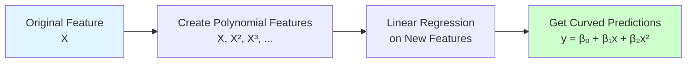

# Polynomial Regression

**Capture non-linear relationships by transforming features into polynomial terms.** Polynomial regression extends linear regression to fit curves by adding powers of features (x², x³, etc.) - turning straight lines into flexible curves.

**Difficulty:** 🟡 Intermediate | **Time:** 2-3 hours | **Prerequisites:** Linear Regression, Basic Calculus

---

## Overview

Polynomial Regression transforms linear regression into a flexible curve-fitting tool by creating polynomial features. It's still linear in parameters but can model non-linear relationships between input and output.

**Use cases:** Growth curves, dose-response relationships, economic models, physics simulations

---

## Intuition 💡

### The Big Idea

Linear regression fits a straight line, but what if your data follows a curve? Polynomial regression adds polynomial terms (x², x³, etc.) to capture curves, parabolas, and complex patterns while keeping the math simple.



### Real-World Analogy

Think of car acceleration:
- **Linear:** "Every second, speed increases by 10 mph" (constant acceleration)
- **Quadratic:** "Speed increases faster over time" (realistic acceleration curve)
- **Cubic:** "Speed increases, peaks, then levels off" (reaching top speed)

### Visual Understanding

```
Speed
  ↑
  |        ●
  |      ●
  |    ●         ← Cubic curve captures
  |   ●             the acceleration pattern
  |  ●
  | ●
  |●______________→ Time

Linear:    y = β₀ + β₁x
Quadratic: y = β₀ + β₁x + β₂x²
Cubic:     y = β₀ + β₁x + β₂x² + β₃x³
```

---

## When to Use ✅ / When to Avoid ❌

### ✅ Good For

| Scenario | Why It Works |
|----------|--------------|
| **Smooth non-linear patterns** | Captures curves, U-shapes, S-curves naturally |
| **Known polynomial relationships** | Physics (parabolic motion), chemistry (reaction rates) |
| **Small to medium datasets** | Works well with limited data when pattern is clear |
| **Interpretability needed** | Still relatively easy to explain and visualize |
| **Controlled extrapolation** | Better than linear for short-range predictions |
| **Feature engineering** | Quick way to add non-linearity before complex models |

**Examples:**
- Predicting crop yield vs fertilizer amount (diminishing returns - quadratic)
- Drug dosage response curves (S-shaped - cubic/quartic)
- Temperature vs altitude (non-linear relationship)
- Project costs vs project size (often follows power law)

### ❌ Not Good For

| Scenario | Why It Fails |
|----------|--------------|
| **High-degree polynomials** | Overfitting risk increases dramatically with degree |
| **Extrapolation far from training data** | Polynomial curves diverge wildly outside training range |
| **Multiple features** | Feature explosion: 10 features with degree 3 = 1000 features |
| **Discontinuous patterns** | Can't capture sudden jumps or breaks |
| **Complex non-smooth patterns** | Use splines, decision trees, or neural networks instead |
| **Noisy data** | High-degree polynomials fit noise, not signal |

**When to use instead:**
- Multiple features: Interaction terms only, or use regularization (Ridge/Lasso)
- Complex patterns: Splines, GAMs, Random Forest, XGBoost
- High noise: Lower degrees (2-3) with regularization
- Extrapolation: Domain-specific models or expert constraints

---

## Mathematical Foundation

### Polynomial Transformation

For a single feature $x$, create polynomial features up to degree $d$:

$$\hat{y} = \beta_0 + \beta_1 x + \beta_2 x^2 + \beta_3 x^3 + ... + \beta_d x^d$$

This is still **linear in parameters** $\beta_i$, so we can use linear regression!

### Multiple Features with Interactions

For two features $x_1, x_2$ with degree 2:

$$\hat{y} = \beta_0 + \beta_1 x_1 + \beta_2 x_2 + \beta_3 x_1^2 + \beta_4 x_1 x_2 + \beta_5 x_2^2$$

Number of features grows as:

$$\text{New features} = \binom{n + d}{d}$$

Where $n$ = original features, $d$ = polynomial degree.

### Cost Function

Same as linear regression - Mean Squared Error:

$$J(\beta) = \frac{1}{2m}\sum_{i=1}^{m}(\hat{y}^{(i)} - y^{(i)})^2$$

But now with many more parameters to optimize!

### Solving for Optimal Parameters

**Normal Equation:**

$$\beta = (X_{poly}^T X_{poly})^{-1} X_{poly}^T y$$

Where $X_{poly}$ is the matrix with polynomial features.

**Gradient Descent:**

$$\beta_j := \beta_j - \alpha \frac{\partial J}{\partial \beta_j}$$

Same update rule, but applied to more features.

---

## Implementation

### Using Scikit-learn

```python
import numpy as np
import matplotlib.pyplot as plt
from sklearn.preprocessing import PolynomialFeatures
from sklearn.linear_model import LinearRegression
from sklearn.model_selection import train_test_split
from sklearn.metrics import mean_squared_error, r2_score

# Generate non-linear data
np.random.seed(42)
X = 6 * np.random.rand(100, 1) - 3  # [-3, 3]
y = 0.5 * X**2 + X + 2 + np.random.randn(100, 1)  # Quadratic with noise

# Split data
X_train, X_test, y_train, y_test = train_test_split(
    X, y, test_size=0.2, random_state=42
)

# Create polynomial features (degree 2)
poly = PolynomialFeatures(degree=2, include_bias=False)
X_train_poly = poly.fit_transform(X_train)
X_test_poly = poly.transform(X_test)

print(f"Original features shape: {X_train.shape}")
print(f"Polynomial features shape: {X_train_poly.shape}")
print(f"Feature names: {poly.get_feature_names_out(['x'])}")

# Train model
model = LinearRegression()
model.fit(X_train_poly, y_train)

# Make predictions
y_pred = model.predict(X_test_poly)

# Evaluate
mse = mean_squared_error(y_test, y_pred)
rmse = np.sqrt(mse)
r2 = r2_score(y_test, y_pred)

print(f"\nCoefficients: {model.coef_[0]}")
print(f"Intercept: {model.intercept_[0]:.2f}")
print(f"RMSE: {rmse:.3f}")
print(f"R² Score: {r2:.3f}")

# Visualize
X_range = np.linspace(X.min(), X.max(), 300).reshape(-1, 1)
X_range_poly = poly.transform(X_range)
y_range_pred = model.predict(X_range_poly)

plt.figure(figsize=(10, 6))
plt.scatter(X_train, y_train, color='blue', alpha=0.5, label='Training')
plt.scatter(X_test, y_test, color='green', alpha=0.5, label='Test')
plt.plot(X_range, y_range_pred, color='red', linewidth=2, label='Polynomial Fit')
plt.xlabel('X')
plt.ylabel('y')
plt.legend()
plt.title('Polynomial Regression (Degree 2)')
plt.show()
```

**Output:**
```
Original features shape: (80, 1)
Polynomial features shape: (80, 2)
Feature names: ['x' 'x^2']

Coefficients: [1.02 0.49]
Intercept: 1.98
RMSE: 0.987
R² Score: 0.945
```

### Comparing Different Degrees

```python
# Compare polynomial degrees
degrees = [1, 2, 3, 10]
plt.figure(figsize=(15, 10))

for idx, degree in enumerate(degrees, 1):
    # Create polynomial features
    poly = PolynomialFeatures(degree=degree, include_bias=False)
    X_train_poly = poly.fit_transform(X_train)
    X_test_poly = poly.transform(X_test)

    # Train model
    model = LinearRegression()
    model.fit(X_train_poly, y_train)

    # Predictions
    X_range_poly = poly.transform(X_range)
    y_range_pred = model.predict(X_range_poly)
    y_pred = model.predict(X_test_poly)

    # Evaluate
    train_score = r2_score(y_train, model.predict(X_train_poly))
    test_score = r2_score(y_test, y_pred)

    # Plot
    plt.subplot(2, 2, idx)
    plt.scatter(X_train, y_train, color='blue', alpha=0.5, s=30)
    plt.scatter(X_test, y_test, color='green', alpha=0.5, s=30)
    plt.plot(X_range, y_range_pred, color='red', linewidth=2)
    plt.xlabel('X')
    plt.ylabel('y')
    plt.title(f'Degree {degree}\nTrain R²: {train_score:.3f}, Test R²: {test_score:.3f}')
    plt.ylim(y.min() - 5, y.max() + 5)

plt.tight_layout()
plt.show()
```

!!! tip "Choosing the Right Degree"
    - **Degree 1:** Underfitting - too simple
    - **Degree 2-3:** Usually optimal - captures curves without overfitting
    - **Degree 10+:** Overfitting - fits training noise, poor generalization

### From Scratch Implementation

```python
class PolynomialRegression:
    """Polynomial Regression from Scratch"""

    def __init__(self, degree=2, learning_rate=0.01, n_iterations=1000):
        self.degree = degree
        self.lr = learning_rate
        self.n_iterations = n_iterations
        self.weights = None
        self.bias = None
        self.losses = []

    def _create_polynomial_features(self, X):
        """Create polynomial features up to specified degree"""
        n_samples = X.shape[0]
        X_poly = np.ones((n_samples, 1))  # Start with x^0 = 1

        for d in range(1, self.degree + 1):
            X_poly = np.c_[X_poly, X ** d]

        return X_poly[:, 1:]  # Remove bias column (we'll handle separately)

    def fit(self, X, y):
        """Train the model using gradient descent"""
        # Create polynomial features
        X_poly = self._create_polynomial_features(X)
        n_samples, n_features = X_poly.shape

        # Initialize parameters
        self.weights = np.zeros(n_features)
        self.bias = 0

        # Gradient descent
        for i in range(self.n_iterations):
            # Forward pass
            y_pred = np.dot(X_poly, self.weights) + self.bias

            # Compute loss
            loss = np.mean((y_pred - y.ravel()) ** 2)
            self.losses.append(loss)

            # Compute gradients
            dw = (2 / n_samples) * np.dot(X_poly.T, (y_pred - y.ravel()))
            db = (2 / n_samples) * np.sum(y_pred - y.ravel())

            # Update parameters
            self.weights -= self.lr * dw
            self.bias -= self.lr * db

            if i % 200 == 0:
                print(f"Iteration {i}: Loss = {loss:.4f}")

        return self

    def predict(self, X):
        """Make predictions"""
        X_poly = self._create_polynomial_features(X)
        return np.dot(X_poly, self.weights) + self.bias

# Usage
model_scratch = PolynomialRegression(degree=2, learning_rate=0.01, n_iterations=1000)
model_scratch.fit(X_train, y_train)
y_pred_scratch = model_scratch.predict(X_test)

print(f"\nFrom Scratch - Weights: {model_scratch.weights}")
print(f"From Scratch - Bias: {model_scratch.bias:.2f}")
print(f"R² Score: {r2_score(y_test, y_pred_scratch):.3f}")

# Plot learning curve
plt.figure(figsize=(10, 6))
plt.plot(model_scratch.losses)
plt.xlabel('Iteration')
plt.ylabel('Loss (MSE)')
plt.title('Training Loss Over Time')
plt.yscale('log')
plt.show()
```

### With Regularization (Ridge)

```python
from sklearn.linear_model import Ridge
from sklearn.preprocessing import StandardScaler
from sklearn.pipeline import Pipeline

# Create pipeline: Polynomial features → Scaling → Ridge regression
pipeline = Pipeline([
    ('poly', PolynomialFeatures(degree=10)),
    ('scaler', StandardScaler()),
    ('ridge', Ridge(alpha=1.0))
])

# Train
pipeline.fit(X_train, y_train)

# Predict
y_pred_ridge = pipeline.predict(X_test)

print(f"Ridge R² Score: {r2_score(y_test, y_pred_ridge):.3f}")
```

!!! tip "Always Scale Polynomial Features"
    Polynomial features have vastly different scales (x vs x¹⁰). Always use StandardScaler or normalize features before training!

---

## Visualization

### Overfitting Demonstration

```python
# Generate clean curve and noisy data
X_true = np.linspace(-3, 3, 300).reshape(-1, 1)
y_true = 0.5 * X_true**2 + X_true + 2  # True function (no noise)

X_train_small = np.array([-2.5, -1.5, -0.5, 0.5, 1.5, 2.5]).reshape(-1, 1)
y_train_small = 0.5 * X_train_small**2 + X_train_small + 2 + np.random.randn(6, 1) * 0.5

degrees = [1, 2, 5, 15]
fig, axes = plt.subplots(1, 4, figsize=(20, 5))

for ax, degree in zip(axes, degrees):
    # Fit polynomial
    poly = PolynomialFeatures(degree=degree)
    X_train_poly = poly.fit_transform(X_train_small)
    X_true_poly = poly.transform(X_true)

    model = LinearRegression()
    model.fit(X_train_poly, y_train_small)
    y_pred = model.predict(X_true_poly)

    # Plot
    ax.plot(X_true, y_true, 'g--', linewidth=2, label='True Function', alpha=0.7)
    ax.scatter(X_train_small, y_train_small, color='blue', s=100,
               label='Training Data', zorder=5)
    ax.plot(X_true, y_pred, 'r-', linewidth=2, label=f'Degree {degree}')
    ax.set_xlabel('X')
    ax.set_ylabel('y')
    ax.set_title(f'Degree {degree}')
    ax.legend()
    ax.set_ylim(-5, 15)
    ax.grid(True, alpha=0.3)

plt.tight_layout()
plt.show()
```

### Bias-Variance Tradeoff

```python
# Demonstrate bias-variance tradeoff across degrees
degrees_range = range(1, 16)
train_scores = []
test_scores = []

for degree in degrees_range:
    poly = PolynomialFeatures(degree=degree, include_bias=False)
    X_train_poly = poly.fit_transform(X_train)
    X_test_poly = poly.transform(X_test)

    model = LinearRegression()
    model.fit(X_train_poly, y_train)

    train_scores.append(r2_score(y_train, model.predict(X_train_poly)))
    test_scores.append(r2_score(y_test, model.predict(X_test_poly)))

plt.figure(figsize=(10, 6))
plt.plot(degrees_range, train_scores, 'o-', label='Training Score', linewidth=2)
plt.plot(degrees_range, test_scores, 's-', label='Test Score', linewidth=2)
plt.xlabel('Polynomial Degree')
plt.ylabel('R² Score')
plt.title('Bias-Variance Tradeoff')
plt.legend()
plt.grid(True, alpha=0.3)
plt.axhline(y=1.0, color='gray', linestyle='--', alpha=0.5)

# Mark optimal degree
optimal_degree = degrees_range[np.argmax(test_scores)]
plt.axvline(x=optimal_degree, color='red', linestyle='--',
            label=f'Optimal Degree: {optimal_degree}')
plt.legend()
plt.show()

print(f"Optimal polynomial degree: {optimal_degree}")
```

### Extrapolation Danger

```python
# Show why extrapolation is dangerous with polynomials
X_train_limited = X_train[(X_train > -2) & (X_train < 2)]
y_train_limited = y_train[(X_train > -2) & (X_train < 2)]

X_extended = np.linspace(-5, 5, 500).reshape(-1, 1)

plt.figure(figsize=(12, 6))

for degree in [2, 5, 10]:
    poly = PolynomialFeatures(degree=degree)
    X_train_poly = poly.fit_transform(X_train_limited)
    X_extended_poly = poly.transform(X_extended)

    model = LinearRegression()
    model.fit(X_train_poly, y_train_limited)
    y_extended_pred = model.predict(X_extended_poly)

    plt.plot(X_extended, y_extended_pred, label=f'Degree {degree}', linewidth=2)

plt.scatter(X_train_limited, y_train_limited, color='black', s=50,
            label='Training Data', zorder=5)
plt.axvspan(-5, -2, alpha=0.2, color='red', label='Extrapolation Zone')
plt.axvspan(2, 5, alpha=0.2, color='red')
plt.xlabel('X')
plt.ylabel('y')
plt.title('Polynomial Extrapolation - Dangerous Beyond Training Range!')
plt.legend()
plt.ylim(-20, 30)
plt.grid(True, alpha=0.3)
plt.show()
```

!!! warning "Never Trust Polynomial Extrapolation"
    Polynomials diverge rapidly outside the training data range. High-degree polynomials can produce absurd predictions. Always stay within or very close to training bounds!

---

## Hyperparameters

### Key Parameters

| Parameter | What It Does | Typical Range | Tips |
|-----------|--------------|---------------|------|
| `degree` | Highest power of polynomial | 1-5 | **Most critical!**<br/>2-3 is usually optimal<br/>Higher = overfitting risk |
| `include_bias` | Add intercept column (x⁰=1) | True/False | Keep False with LinearRegression (adds its own) |
| `interaction_only` | Only interaction terms, no powers | True/False | True: x₁x₂ but not x₁²<br/>Useful for multiple features |
| `alpha` (if using Ridge/Lasso) | Regularization strength | 0.01 - 100 | Higher degree → higher alpha needed |

### Choosing Polynomial Degree

```python
from sklearn.model_selection import cross_val_score

degrees = range(1, 11)
cv_scores = []

for degree in degrees:
    poly = PolynomialFeatures(degree=degree)
    X_poly = poly.fit_transform(X_train)

    model = LinearRegression()
    scores = cross_val_score(model, X_poly, y_train, cv=5,
                             scoring='neg_mean_squared_error')
    cv_scores.append(-scores.mean())

# Plot CV error
plt.figure(figsize=(10, 6))
plt.plot(degrees, cv_scores, 'o-', linewidth=2)
plt.xlabel('Polynomial Degree')
plt.ylabel('Cross-Validation MSE')
plt.title('Selecting Optimal Polynomial Degree')
plt.grid(True, alpha=0.3)

optimal = degrees[np.argmin(cv_scores)]
plt.axvline(x=optimal, color='red', linestyle='--',
            label=f'Optimal: {optimal}')
plt.legend()
plt.show()

print(f"Optimal degree based on CV: {optimal}")
```

---

## Complexity Analysis

### Time Complexity

| Operation | Complexity | Notes |
|-----------|------------|-------|
| **Creating Polynomial Features** | $O(m \cdot n \cdot d)$ | $m$ samples, $n$ features, $d$ degree |
| **Training (Normal Equation)** | $O((nd)^3)$ | Cubic in number of polynomial features |
| **Training (Gradient Descent)** | $O(k \cdot m \cdot nd)$ | $k$ iterations, better for many features |
| **Prediction** | $O(n \cdot d)$ per sample | Linear in polynomial features |

### Space Complexity

| Component | Complexity | Notes |
|-----------|------------|-------|
| **Feature Storage** | $O(m \cdot \binom{n+d}{d})$ | Feature explosion with multiple features! |
| **Model Parameters** | $O(\binom{n+d}{d})$ | Number of polynomial features |

### Feature Explosion Example

```python
from scipy.special import comb

print("Feature Explosion with Polynomial Features:\n")
print("Original | Degree | New Features")
print("-" * 40)

for n_features in [1, 2, 5, 10, 20]:
    for degree in [2, 3, 5]:
        n_new = int(comb(n_features + degree, degree) - 1)
        print(f"{n_features:^8} | {degree:^6} | {n_new:^12}")
    print("-" * 40)
```

**Output:**
```
Feature Explosion with Polynomial Features:

Original | Degree | New Features
----------------------------------------
   1     |   2    |      2
   1     |   3    |      3
   1     |   5    |      5
----------------------------------------
   2     |   2    |      5
   2     |   3    |      9
   2     |   5    |     20
----------------------------------------
   5     |   2    |     20
   5     |   3    |     55
   5     |   5    |    251
----------------------------------------
  10     |   2    |     65
  10     |   3    |    285
  10     |   5    |   3002  ← Explosion!
----------------------------------------
```

!!! warning "Feature Explosion"
    With 10 features and degree 5, you get 3002 features! This leads to:
    - Slow training
    - High memory usage
    - Overfitting risk

    **Solutions:**
    - Use lower degrees (2-3)
    - Use `interaction_only=True`
    - Apply feature selection or regularization

---

## Common Pitfalls

### 1. Choosing Too High Degree

!!! warning "Overfitting with High Degrees"
    **Problem:** High-degree polynomials fit training noise, generalize poorly.

    **Signs:**
    - Training score = 0.99, Test score = 0.50
    - Predictions oscillate wildly
    - Curve passes through every training point

    **Solution:**
    ```python
    # Use cross-validation to find optimal degree
    from sklearn.model_selection import validation_curve

    degrees = np.arange(1, 11)
    train_scores, val_scores = validation_curve(
        Pipeline([
            ('poly', PolynomialFeatures()),
            ('model', LinearRegression())
        ]),
        X, y,
        param_name='poly__degree',
        param_range=degrees,
        cv=5
    )

    # Choose degree where validation score peaks
    optimal_degree = degrees[val_scores.mean(axis=1).argmax()]
    ```

### 2. Not Scaling Features

!!! warning "Unscaled Polynomial Features"
    **Problem:** x¹⁰ is vastly larger than x, causing numerical instability.

    **Example:**
    - x = 10 → x² = 100, x³ = 1000, x¹⁰ = 10 billion!

    **Solution:** Always scale!
    ```python
    from sklearn.preprocessing import StandardScaler
    from sklearn.pipeline import Pipeline

    # CORRECT: Use pipeline
    pipeline = Pipeline([
        ('poly', PolynomialFeatures(degree=3)),
        ('scaler', StandardScaler()),  # Essential!
        ('model', LinearRegression())
    ])
    pipeline.fit(X_train, y_train)
    ```

### 3. Extrapolation Beyond Training Range

!!! warning "Polynomial Divergence"
    **Problem:** Polynomials explode or collapse outside training data.

    **Example:**
    - Trained on x ∈ [0, 10]
    - Predict at x = 15 → wild, unrealistic values

    **Solution:**
    - Warn users about valid input range
    - Clip predictions to reasonable bounds
    - Use domain knowledge constraints

    ```python
    # Check if input is in safe range
    X_min, X_max = X_train.min(), X_train.max()

    def safe_predict(model, X_new):
        if (X_new < X_min).any() or (X_new > X_max).any():
            print(f"⚠️  Warning: Input outside training range [{X_min:.2f}, {X_max:.2f}]")
        return model.predict(X_new)
    ```

### 4. Feature Explosion with Multiple Features

!!! warning "Too Many Features"
    **Problem:** 10 features × degree 5 = 3002 features!

    **Solution:**
    ```python
    # Option 1: Use interaction_only (no x²)
    poly = PolynomialFeatures(degree=2, interaction_only=True)

    # Option 2: Use regularization
    from sklearn.linear_model import Ridge
    pipeline = Pipeline([
        ('poly', PolynomialFeatures(degree=3)),
        ('scaler', StandardScaler()),
        ('ridge', Ridge(alpha=10.0))  # Strong regularization
    ])

    # Option 3: Feature selection
    from sklearn.feature_selection import SelectKBest
    pipeline = Pipeline([
        ('poly', PolynomialFeatures(degree=3)),
        ('select', SelectKBest(k=50)),  # Keep only 50 best features
        ('model', LinearRegression())
    ])
    ```

### 5. Ignoring Multicollinearity

!!! warning "Correlated Polynomial Features"
    **Problem:** x, x², x³ are highly correlated → unstable coefficients.

    **Solution:**
    - Use Ridge regression (handles correlation)
    - Use orthogonal polynomials
    - Scale features before creating polynomials

    ```python
    # Check correlation
    X_poly = poly.fit_transform(X_train)
    correlation = np.corrcoef(X_poly.T)
    print(f"Max correlation: {correlation.max():.3f}")

    # Use Ridge to handle correlation
    model = Ridge(alpha=1.0)
    model.fit(X_poly, y_train)
    ```

---

## Evaluation Metrics

### Standard Regression Metrics

```python
from sklearn.metrics import (
    mean_squared_error,
    mean_absolute_error,
    r2_score,
    explained_variance_score
)

def evaluate_polynomial(X_train, X_test, y_train, y_test, degree):
    """Comprehensive evaluation of polynomial regression"""

    # Create and train model
    poly = PolynomialFeatures(degree=degree)
    X_train_poly = poly.fit_transform(X_train)
    X_test_poly = poly.transform(X_test)

    model = LinearRegression()
    model.fit(X_train_poly, y_train)

    # Predictions
    y_train_pred = model.predict(X_train_poly)
    y_test_pred = model.predict(X_test_poly)

    # Metrics
    print(f"Polynomial Degree: {degree}")
    print(f"Number of features: {X_train_poly.shape[1]}")
    print("\nTraining Metrics:")
    print(f"  MSE:  {mean_squared_error(y_train, y_train_pred):.3f}")
    print(f"  RMSE: {np.sqrt(mean_squared_error(y_train, y_train_pred)):.3f}")
    print(f"  MAE:  {mean_absolute_error(y_train, y_train_pred):.3f}")
    print(f"  R²:   {r2_score(y_train, y_train_pred):.3f}")

    print("\nTest Metrics:")
    print(f"  MSE:  {mean_squared_error(y_test, y_test_pred):.3f}")
    print(f"  RMSE: {np.sqrt(mean_squared_error(y_test, y_test_pred)):.3f}")
    print(f"  MAE:  {mean_absolute_error(y_test, y_test_pred):.3f}")
    print(f"  R²:   {r2_score(y_test, y_test_pred):.3f}")

    # Overfitting check
    train_r2 = r2_score(y_train, y_train_pred)
    test_r2 = r2_score(y_test, y_test_pred)
    gap = train_r2 - test_r2

    if gap > 0.1:
        print(f"\n⚠️  Possible overfitting! Train-Test gap: {gap:.3f}")
    else:
        print(f"\n✓ Good generalization. Train-Test gap: {gap:.3f}")

    return model, poly

# Example usage
evaluate_polynomial(X_train, X_test, y_train, y_test, degree=3)
```

---

## Practice Problems

### 🟢 Beginner

!!! example "Problem 1: Fit a Quadratic Curve"
    Generate data following $y = 2x^2 - 3x + 1 + noise$. Use PolynomialFeatures with degree 2 to recover the coefficients.

    **Tasks:**
    - Create synthetic data (100 points)
    - Fit polynomial regression
    - Compare learned coefficients with true values [2, -3, 1]

    **Hint:** Use `model.coef_` and `model.intercept_` to see learned parameters.

!!! example "Problem 2: Visualize Polynomial Degrees"
    Plot the same dataset with polynomial degrees 1, 2, 3, and 5. Identify which degree best fits the data without overfitting.

    **Hint:** Create a 2×2 subplot grid showing all four fits.

### 🟡 Intermediate

!!! example "Problem 3: Cross-Validation for Optimal Degree"
    Use 5-fold cross-validation to find the optimal polynomial degree (1-10) for a given dataset. Plot CV scores vs degree.

    **Challenge:**
    - Handle feature scaling properly
    - Compare results with and without regularization

    **Dataset:** Use sklearn's `make_regression` with `n_features=1`, add non-linear transformation.

!!! example "Problem 4: Multiple Features with Polynomial"
    Predict house prices using 3 features: size, bedrooms, age. Create polynomial features (degree 2) and analyze feature explosion.

    **Tasks:**
    - Count resulting features
    - Use Ridge to handle multicollinearity
    - Compare with interaction terms only

    **Challenge:** Identify which polynomial terms are most important.

### 🔴 Advanced

!!! example "Problem 5: Regularized Polynomial Pipeline"
    Build a complete production-ready pipeline:
    - Data preprocessing (handling outliers, scaling)
    - Polynomial feature creation
    - Hyperparameter tuning (degree, alpha)
    - Cross-validation
    - Model selection (Linear vs Polynomial vs Ridge)

    **Include:**
    - Grid search for best (degree, alpha) combination
    - Learning curves to diagnose bias/variance
    - Feature importance analysis
    - Extrapolation warnings

!!! example "Problem 6: Real-World Application"
    Use polynomial regression for a real dataset (e.g., bike sharing demand, temperature data, economic indicators).

    **Requirements:**
    - EDA to identify non-linear relationships
    - Compare polynomial vs other models (Random Forest, XGBoost)
    - Handle temporal aspects if time series
    - Create interpretable visualizations
    - Deploy with input validation

---

## Extensions & Variations

### Splines (Better Alternative)

For complex curves, splines are often better than high-degree polynomials:

```python
from sklearn.preprocessing import SplineTransformer

# Use splines instead of polynomials
spline = SplineTransformer(n_knots=5, degree=3)
X_spline = spline.fit_transform(X_train)

model = LinearRegression()
model.fit(X_spline, y_train)

# Splines are more stable for complex curves!
```

### Polynomial with Ridge/Lasso

Combine polynomial features with regularization:

```python
from sklearn.linear_model import Ridge, Lasso, ElasticNet

# Ridge: Handles correlated polynomial features
ridge_poly = Pipeline([
    ('poly', PolynomialFeatures(degree=5)),
    ('scaler', StandardScaler()),
    ('ridge', Ridge(alpha=10.0))
])

# Lasso: Automatic feature selection among polynomial terms
lasso_poly = Pipeline([
    ('poly', PolynomialFeatures(degree=5)),
    ('scaler', StandardScaler()),
    ('lasso', Lasso(alpha=0.1))
])

# ElasticNet: Best of both worlds
elastic_poly = Pipeline([
    ('poly', PolynomialFeatures(degree=5)),
    ('scaler', StandardScaler()),
    ('elastic', ElasticNet(alpha=0.1, l1_ratio=0.5))
])
```

### Interaction Terms Only

For multiple features, sometimes only interactions matter:

```python
# Only interaction terms (x₁x₂), not powers (x₁²)
poly_interact = PolynomialFeatures(degree=2, interaction_only=True)
X_interact = poly_interact.fit_transform(X_train)

print(f"Features with powers: {PolynomialFeatures(degree=2).fit_transform(X_train).shape[1]}")
print(f"Features interaction-only: {X_interact.shape[1]}")
```

---

## Real-World Applications

1. **Physics & Engineering:** Projectile motion (parabolic), spring force (quadratic)
2. **Economics:** Diminishing returns, cost curves, demand elasticity
3. **Biology/Medicine:** Dose-response curves, growth rates, enzyme kinetics
4. **Climate Science:** Temperature models, sea-level projections
5. **Finance:** Options pricing (Black-Scholes polynomial approximations)
6. **Agriculture:** Crop yield vs fertilizer (optimal application curves)

### Example: Drug Dosage Response

```python
# Simulate dose-response curve (S-shaped)
dose = np.linspace(0, 10, 100).reshape(-1, 1)
response = 100 / (1 + np.exp(-(dose - 5))) + np.random.randn(100, 1) * 2

# Fit polynomial
poly = PolynomialFeatures(degree=3)
dose_poly = poly.fit_transform(dose)

model = LinearRegression()
model.fit(dose_poly, response)

# Predict optimal dose
doses_test = np.linspace(0, 10, 300).reshape(-1, 1)
response_pred = model.predict(poly.transform(doses_test))

plt.figure(figsize=(10, 6))
plt.scatter(dose, response, alpha=0.5, label='Observed Response')
plt.plot(doses_test, response_pred, 'r-', linewidth=2, label='Polynomial Fit (deg 3)')
plt.xlabel('Drug Dose (mg)')
plt.ylabel('Response (%)')
plt.title('Drug Dose-Response Curve')
plt.legend()
plt.grid(True, alpha=0.3)
plt.show()
```

---

## Related Topics

- [Linear Regression](linear-regression.md) - The foundation
- [Ridge Regression](ridge-regression.md) - L2 regularization for polynomial features
- [Lasso Regression](lasso-regression.md) - Feature selection among polynomial terms
- [Splines & GAMs](../../advanced/splines.md) - Better alternative for complex curves
- [Feature Engineering](../../preprocessing/feature-engineering.md) - Creating informative features

---

## References

1. **Scikit-learn Documentation:** [PolynomialFeatures](https://scikit-learn.org/stable/modules/generated/sklearn.preprocessing.PolynomialFeatures.html)
2. **Book:** *Introduction to Statistical Learning* by James et al. (Chapter 7)
3. **Paper:** "Polynomial Regression and Model Selection" - Bishop (2006)
4. **Interactive:** [Polynomial Regression Visualizer](https://www.desmos.com/calculator/h9cqbh5rjq)
5. **Course:** Andrew Ng's ML Course - Feature Engineering Lecture

---

**Next Steps:**
- Master [Ridge Regression](ridge-regression.md) to handle overfitting
- Learn [Lasso Regression](lasso-regression.md) for feature selection
- Explore [Splines](../../advanced/splines.md) for more flexible curves
- Practice with [Kaggle Datasets](https://www.kaggle.com/datasets) showing non-linear patterns

**Ready to curve-fit like a pro?** Start with the beginner problems above!
