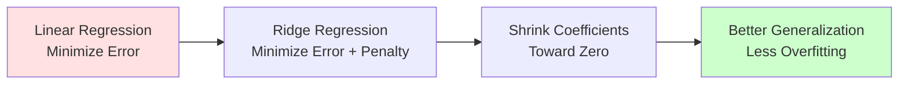

# Ridge Regression

**Prevent overfitting with L2 regularization by shrinking coefficients toward zero.** Ridge regression adds a penalty term to linear regression, keeping models simple and improving generalization when you have many features or correlated predictors.

**Difficulty:** 🟡 Intermediate | **Time:** 2-3 hours | **Prerequisites:** Linear Regression, Basic Linear Algebra

---

## Overview

Ridge Regression (L2 regularization) extends linear regression by adding a penalty proportional to the square of coefficients. This shrinks coefficients toward zero, preventing overfitting and handling multicollinearity naturally.

**Use cases:** High-dimensional data, correlated features, preventing overfitting, stable predictions

---

## Intuition 💡

### The Big Idea

Linear regression finds coefficients that minimize error on training data. But sometimes it fits training noise too well (overfitting). Ridge regression says: "Minimize error, BUT also keep coefficients small." This trades a little training accuracy for better generalization.



### Real-World Analogy

Think of predicting house prices with 100 features (size, rooms, age, neighborhood, school quality, etc.):

- **Linear Regression:** Uses ALL features with arbitrary weights → overfits to training data
- **Ridge Regression:** Says "each feature can help, but don't rely too heavily on any one" → keeps weights balanced and small
- **Result:** More stable predictions on new houses

### Visual Understanding

```
Coefficient Size
  ↑
  |  ●  ← Linear Regression: Large coefficients
  |
  |    ◆ ← Ridge (α=1): Smaller coefficients
  |
  |      ■ ← Ridge (α=10): Even smaller
  |_________________________________→ Feature Index

Ridge shrinks all coefficients proportionally
(none become exactly zero)
```

---

## When to Use ✅ / When to Avoid ❌

### ✅ Good For

| Scenario | Why It Works |
|----------|--------------|
| **Many features** | Prevents overfitting when features > samples |
| **Correlated features (multicollinearity)** | Handles correlation gracefully, shares weight among correlated features |
| **Overfitting observed** | Training score >> test score → Ridge helps |
| **Numerical stability** | Adds to diagonal of X^TX, making it invertible |
| **All features potentially useful** | Keeps all features (with small weights) |
| **Polynomial features** | Essential when using high-degree polynomials |

**Examples:**
- Predicting with 50 features from 100 samples
- Features like "house size" and "# rooms" (correlated)
- High-degree polynomial regression (degree 5+)
- Genomics: thousands of genes, hundreds of samples

### ❌ Not Good For

| Scenario | Why It Fails / Alternative |
|----------|----------------------------|
| **Need exact feature selection** | Ridge shrinks but doesn't eliminate → Use **Lasso** instead |
| **Sparse solutions desired** | Ridge keeps all features → Use **Lasso** or **Elastic Net** |
| **Very few features** | Regularization might not be needed → Try plain linear regression first |
| **Features on different scales** | Must scale features first! Ridge is scale-sensitive |
| **Interpretability priority** | Shrinkage makes coefficients harder to interpret |

**When to use instead:**
- Feature selection needed: **Lasso** (L1)
- Best of both worlds: **Elastic Net** (L1 + L2)
- Few features, linear relationship: **Linear Regression**
- Complex non-linear: **Random Forest**, **XGBoost**

---

## Mathematical Foundation

### Cost Function with L2 Penalty

Ridge regression minimizes:

$$J(\beta) = \frac{1}{2m}\sum_{i=1}^{m}(\hat{y}^{(i)} - y^{(i)})^2 + \alpha \sum_{j=1}^{n}\beta_j^2$$

Where:
- First term: Mean Squared Error (fit to data)
- Second term: L2 penalty (keep coefficients small)
- $\alpha$ (alpha): Regularization strength (hyperparameter)
- $\beta_j$: Model coefficients (NOT including bias/intercept)

**Note:** The bias term $\beta_0$ is typically NOT penalized.

### In Matrix Form

$$J(\beta) = \frac{1}{2m}||X\beta - y||^2 + \alpha||\beta||^2$$

Where $||\beta||^2 = \beta^T\beta$ is the L2 norm squared.

### Closed-Form Solution

Unlike standard linear regression, Ridge has a modified normal equation:

$$\beta = (X^T X + \alpha I)^{-1} X^T y$$

Where:
- $I$ is the identity matrix
- Adding $\alpha I$ makes the matrix always invertible!

### Gradient Descent Update

$$\beta_j := \beta_j - \eta \left( \frac{1}{m}\sum_{i=1}^{m}((\hat{y}^{(i)} - y^{(i)}) \cdot x_j^{(i)}) + \alpha \beta_j \right)$$

The extra $\alpha \beta_j$ term shrinks coefficients toward zero each iteration.

### Effect of Alpha (α)

- **α = 0:** Ridge = Linear Regression (no penalty)
- **α → ∞:** All coefficients → 0 (under-fitting)
- **α optimal:** Balance between fit and simplicity

---

## Implementation

### Using Scikit-learn

```python
import numpy as np
import matplotlib.pyplot as plt
from sklearn.linear_model import Ridge, LinearRegression
from sklearn.model_selection import train_test_split
from sklearn.preprocessing import StandardScaler
from sklearn.metrics import mean_squared_error, r2_score

# Generate data with correlated features
np.random.seed(42)
n_samples = 100
n_features = 10

# Create correlated features
X = np.random.randn(n_samples, n_features)
# Make features correlated
X[:, 1] = X[:, 0] + 0.1 * np.random.randn(n_samples)
X[:, 2] = X[:, 0] + 0.1 * np.random.randn(n_samples)

# True model uses only 3 features
true_coef = np.zeros(n_features)
true_coef[:3] = [5, 3, -2]
y = X @ true_coef + np.random.randn(n_samples) * 0.5

# Split and scale data
X_train, X_test, y_train, y_test = train_test_split(
    X, y, test_size=0.2, random_state=42
)

scaler = StandardScaler()
X_train_scaled = scaler.fit_transform(X_train)
X_test_scaled = scaler.transform(X_test)

# Train Ridge model
ridge = Ridge(alpha=1.0)
ridge.fit(X_train_scaled, y_train)

# Compare with Linear Regression
linear = LinearRegression()
linear.fit(X_train_scaled, y_train)

# Predictions
y_pred_ridge = ridge.predict(X_test_scaled)
y_pred_linear = linear.predict(X_test_scaled)

# Evaluate
print("Ridge Regression (α=1.0):")
print(f"  Train R²: {ridge.score(X_train_scaled, y_train):.3f}")
print(f"  Test R²:  {r2_score(y_test, y_pred_ridge):.3f}")
print(f"  RMSE:     {np.sqrt(mean_squared_error(y_test, y_pred_ridge)):.3f}")

print("\nLinear Regression:")
print(f"  Train R²: {linear.score(X_train_scaled, y_train):.3f}")
print(f"  Test R²:  {r2_score(y_test, y_pred_linear):.3f}")
print(f"  RMSE:     {np.sqrt(mean_squared_error(y_test, y_pred_linear)):.3f}")

# Compare coefficients
plt.figure(figsize=(12, 5))

plt.subplot(1, 2, 1)
plt.stem(range(n_features), true_coef, linefmt='g-', markerfmt='go', label='True')
plt.stem(range(n_features), ridge.coef_, linefmt='b-', markerfmt='bs',
         label='Ridge', markerfmt='bs')
plt.stem(range(n_features), linear.coef_, linefmt='r-', markerfmt='r^',
         label='Linear', markerfmt='r^')
plt.xlabel('Feature Index')
plt.ylabel('Coefficient Value')
plt.title('Coefficient Comparison')
plt.legend()
plt.grid(True, alpha=0.3)

plt.subplot(1, 2, 2)
plt.scatter(y_test, y_pred_ridge, alpha=0.6, label='Ridge')
plt.scatter(y_test, y_pred_linear, alpha=0.6, label='Linear')
plt.plot([y_test.min(), y_test.max()], [y_test.min(), y_test.max()],
         'k--', lw=2, label='Perfect')
plt.xlabel('True Values')
plt.ylabel('Predictions')
plt.title('Predictions vs Actual')
plt.legend()
plt.grid(True, alpha=0.3)

plt.tight_layout()
plt.show()
```

### Effect of Alpha Parameter

```python
# Try different alpha values
alphas = [0.001, 0.01, 0.1, 1, 10, 100]
train_scores = []
test_scores = []
coefficients = []

for alpha in alphas:
    ridge = Ridge(alpha=alpha)
    ridge.fit(X_train_scaled, y_train)

    train_scores.append(ridge.score(X_train_scaled, y_train))
    test_scores.append(ridge.score(X_test_scaled, y_test))
    coefficients.append(ridge.coef_)

# Plot results
fig, axes = plt.subplots(1, 2, figsize=(15, 5))

# Scores vs alpha
axes[0].semilogx(alphas, train_scores, 'o-', label='Train Score', linewidth=2)
axes[0].semilogx(alphas, test_scores, 's-', label='Test Score', linewidth=2)
axes[0].set_xlabel('Alpha (log scale)')
axes[0].set_ylabel('R² Score')
axes[0].set_title('Model Performance vs Alpha')
axes[0].legend()
axes[0].grid(True, alpha=0.3)

# Coefficient paths
coefficients = np.array(coefficients)
for i in range(n_features):
    axes[1].semilogx(alphas, coefficients[:, i], 'o-', label=f'Feature {i}')
axes[1].set_xlabel('Alpha (log scale)')
axes[1].set_ylabel('Coefficient Value')
axes[1].set_title('Coefficient Shrinkage (Regularization Path)')
axes[1].legend(bbox_to_anchor=(1.05, 1), loc='upper left')
axes[1].grid(True, alpha=0.3)

plt.tight_layout()
plt.show()
```

!!! tip "Interpreting Regularization Paths"
    - **Low α:** Coefficients remain large (like linear regression)
    - **Medium α:** Coefficients shrink smoothly
    - **High α:** All coefficients approach zero
    - **Optimal α:** Where test score is maximized

### From Scratch Implementation

```python
class RidgeRegression:
    """Ridge Regression from Scratch"""

    def __init__(self, alpha=1.0, learning_rate=0.01, n_iterations=1000):
        self.alpha = alpha
        self.lr = learning_rate
        self.n_iterations = n_iterations
        self.weights = None
        self.bias = None
        self.losses = []

    def fit(self, X, y):
        """Train using gradient descent with L2 penalty"""
        n_samples, n_features = X.shape

        # Initialize parameters
        self.weights = np.zeros(n_features)
        self.bias = 0

        # Gradient descent
        for i in range(self.n_iterations):
            # Forward pass
            y_pred = np.dot(X, self.weights) + self.bias

            # Compute loss (MSE + L2 penalty)
            mse = np.mean((y_pred - y) ** 2)
            l2_penalty = self.alpha * np.sum(self.weights ** 2)
            loss = mse + l2_penalty
            self.losses.append(loss)

            # Compute gradients
            dw = (2 / n_samples) * np.dot(X.T, (y_pred - y)) + 2 * self.alpha * self.weights
            db = (2 / n_samples) * np.sum(y_pred - y)

            # Update parameters
            self.weights -= self.lr * dw
            self.bias -= self.lr * db

            if i % 200 == 0:
                print(f"Iteration {i}: Loss = {loss:.4f}")

        return self

    def predict(self, X):
        """Make predictions"""
        return np.dot(X, self.weights) + self.bias

    def fit_closed_form(self, X, y):
        """Train using closed-form solution"""
        n_features = X.shape[1]

        # Add bias column
        X_b = np.c_[np.ones((X.shape[0], 1)), X]

        # Ridge solution: β = (X^T X + αI)^-1 X^T y
        identity = np.eye(n_features + 1)
        identity[0, 0] = 0  # Don't penalize bias

        theta = np.linalg.inv(X_b.T @ X_b + self.alpha * identity) @ X_b.T @ y

        self.bias = theta[0]
        self.weights = theta[1:]

        return self

# Usage - Gradient Descent
model_gd = RidgeRegression(alpha=1.0, learning_rate=0.01, n_iterations=1000)
model_gd.fit(X_train_scaled, y_train)
y_pred_gd = model_gd.predict(X_test_scaled)

print(f"\nGradient Descent - Test R²: {r2_score(y_test, y_pred_gd):.3f}")

# Usage - Closed Form
model_cf = RidgeRegression(alpha=1.0)
model_cf.fit_closed_form(X_train_scaled, y_train)
y_pred_cf = model_cf.predict(X_test_scaled)

print(f"Closed Form - Test R²: {r2_score(y_test, y_pred_cf):.3f}")

# Plot learning curve
plt.figure(figsize=(10, 6))
plt.plot(model_gd.losses)
plt.xlabel('Iteration')
plt.ylabel('Loss (MSE + L2 Penalty)')
plt.title('Training Loss Over Time')
plt.yscale('log')
plt.grid(True, alpha=0.3)
plt.show()
```

### Cross-Validation for Optimal Alpha

```python
from sklearn.linear_model import RidgeCV

# RidgeCV automatically finds best alpha using cross-validation
alphas = np.logspace(-3, 3, 50)  # Try 50 alpha values from 0.001 to 1000

ridge_cv = RidgeCV(alphas=alphas, cv=5, scoring='r2')
ridge_cv.fit(X_train_scaled, y_train)

print(f"Optimal alpha: {ridge_cv.alpha_:.4f}")
print(f"Best CV score: {ridge_cv.best_score_:.3f}")
print(f"Test R²: {ridge_cv.score(X_test_scaled, y_test):.3f}")

# Use the optimal alpha
best_ridge = Ridge(alpha=ridge_cv.alpha_)
best_ridge.fit(X_train_scaled, y_train)
```

---

## Visualization

### Regularization Path

```python
from sklearn.linear_model import Ridge

# Create range of alpha values
alphas = np.logspace(-2, 4, 100)
coefs = []

for alpha in alphas:
    ridge = Ridge(alpha=alpha, fit_intercept=True)
    ridge.fit(X_train_scaled, y_train)
    coefs.append(ridge.coef_)

# Plot coefficient paths
plt.figure(figsize=(12, 6))
coefs = np.array(coefs)

for i in range(X.shape[1]):
    plt.plot(alphas, coefs[:, i], label=f'Feature {i}')

plt.xscale('log')
plt.xlabel('Alpha (Regularization Strength)')
plt.ylabel('Coefficient Value')
plt.title('Ridge Regularization Path - Coefficient Shrinkage')
plt.legend(bbox_to_anchor=(1.05, 1), loc='upper left')
plt.grid(True, alpha=0.3)
plt.axhline(y=0, color='black', linestyle='--', linewidth=1)
plt.tight_layout()
plt.show()
```

### Bias-Variance Tradeoff

```python
from sklearn.model_selection import learning_curve

# Learning curves for different alphas
alphas_to_plot = [0.01, 1, 100]
fig, axes = plt.subplots(1, 3, figsize=(18, 5))

for idx, alpha in enumerate(alphas_to_plot):
    train_sizes, train_scores, val_scores = learning_curve(
        Ridge(alpha=alpha),
        X_train_scaled, y_train,
        cv=5,
        n_jobs=-1,
        train_sizes=np.linspace(0.1, 1.0, 10),
        scoring='r2'
    )

    train_mean = np.mean(train_scores, axis=1)
    train_std = np.std(train_scores, axis=1)
    val_mean = np.mean(val_scores, axis=1)
    val_std = np.std(val_scores, axis=1)

    axes[idx].plot(train_sizes, train_mean, 'o-', label='Training Score')
    axes[idx].plot(train_sizes, val_mean, 's-', label='Validation Score')
    axes[idx].fill_between(train_sizes, train_mean - train_std,
                            train_mean + train_std, alpha=0.1)
    axes[idx].fill_between(train_sizes, val_mean - val_std,
                            val_mean + val_std, alpha=0.1)
    axes[idx].set_xlabel('Training Size')
    axes[idx].set_ylabel('R² Score')
    axes[idx].set_title(f'Learning Curve (α={alpha})')
    axes[idx].legend()
    axes[idx].grid(True, alpha=0.3)

plt.tight_layout()
plt.show()
```

### Multicollinearity Handling

```python
# Demonstrate Ridge handling correlated features
from sklearn.datasets import make_regression

# Create highly correlated features
X_corr, y_corr = make_regression(n_samples=100, n_features=5,
                                  n_informative=2, noise=10, random_state=42)

# Make features highly correlated
X_corr[:, 1] = X_corr[:, 0] + 0.05 * np.random.randn(100)
X_corr[:, 2] = X_corr[:, 0] + 0.05 * np.random.randn(100)

# Check correlation
import seaborn as sns
correlation_matrix = np.corrcoef(X_corr.T)

plt.figure(figsize=(12, 5))

plt.subplot(1, 2, 1)
sns.heatmap(correlation_matrix, annot=True, cmap='coolwarm', center=0,
            square=True, linewidths=1)
plt.title('Feature Correlation Matrix')

# Compare Linear vs Ridge coefficients
scaler = StandardScaler()
X_corr_scaled = scaler.fit_transform(X_corr)

linear = LinearRegression()
ridge = Ridge(alpha=10.0)

linear.fit(X_corr_scaled, y_corr)
ridge.fit(X_corr_scaled, y_corr)

plt.subplot(1, 2, 2)
x_pos = np.arange(5)
width = 0.35
plt.bar(x_pos - width/2, linear.coef_, width, label='Linear', alpha=0.7)
plt.bar(x_pos + width/2, ridge.coef_, width, label='Ridge', alpha=0.7)
plt.xlabel('Feature Index')
plt.ylabel('Coefficient Value')
plt.title('Coefficient Comparison\n(Ridge handles correlation better)')
plt.legend()
plt.xticks(x_pos, [f'F{i}' for i in range(5)])
plt.grid(True, alpha=0.3, axis='y')

plt.tight_layout()
plt.show()

print("Features 0, 1, 2 are highly correlated!")
print(f"Linear regression coefficients: {linear.coef_}")
print(f"Ridge regression coefficients: {ridge.coef_}")
print("\nRidge distributes weight more evenly among correlated features.")
```

---

## Hyperparameters

### Key Parameters

| Parameter | What It Does | Typical Range | Tips |
|-----------|--------------|---------------|------|
| `alpha` | Regularization strength | 0.01 - 1000 | **Most important!**<br/>Higher = more shrinkage<br/>Use cross-validation to find optimal |
| `fit_intercept` | Calculate intercept | True/False | Keep True (bias not penalized) |
| `solver` | Algorithm to use | 'auto', 'svd', 'cholesky', etc. | 'auto' is smart<br/>'svd' for wide datasets<br/>'sag' for large datasets |
| `max_iter` | Max iterations (iterative solvers) | 1000-10000 | Only for iterative solvers |
| `tol` | Convergence tolerance | 1e-3 to 1e-5 | Lower = more precise |

### Selecting Alpha with Cross-Validation

```python
from sklearn.model_selection import GridSearchCV

# Method 1: RidgeCV (specialized, faster)
ridge_cv = RidgeCV(alphas=np.logspace(-3, 3, 50), cv=5)
ridge_cv.fit(X_train_scaled, y_train)
print(f"RidgeCV best alpha: {ridge_cv.alpha_:.4f}")

# Method 2: GridSearchCV (more flexible)
param_grid = {'alpha': np.logspace(-3, 3, 20)}
ridge_grid = GridSearchCV(Ridge(), param_grid, cv=5, scoring='r2')
ridge_grid.fit(X_train_scaled, y_train)
print(f"GridSearchCV best alpha: {ridge_grid.best_params_['alpha']:.4f}")

# Visualize CV results
cv_results = ridge_grid.cv_results_
plt.figure(figsize=(10, 6))
plt.semilogx(param_grid['alpha'], cv_results['mean_test_score'], 'o-')
plt.fill_between(param_grid['alpha'],
                  cv_results['mean_test_score'] - cv_results['std_test_score'],
                  cv_results['mean_test_score'] + cv_results['std_test_score'],
                  alpha=0.2)
plt.xlabel('Alpha')
plt.ylabel('Cross-Validation R² Score')
plt.title('Finding Optimal Alpha via Cross-Validation')
plt.axvline(ridge_grid.best_params_['alpha'], color='red', linestyle='--',
            label=f"Best α = {ridge_grid.best_params_['alpha']:.3f}")
plt.legend()
plt.grid(True, alpha=0.3)
plt.show()
```

---

## Complexity Analysis

### Time Complexity

| Method | Training | Prediction | Notes |
|--------|----------|------------|-------|
| **Closed Form (Cholesky)** | $O(n^3 + mn^2)$ | $O(n)$ | $n$ = features, $m$ = samples<br/>Fast for small $n$ |
| **SVD** | $O(mn^2)$ | $O(n)$ | More stable, good for wide data |
| **Gradient Descent** | $O(k \cdot mn)$ | $O(n)$ | $k$ = iterations<br/>Best for large $n$ or $m$ |
| **Stochastic Gradient Descent** | $O(k \cdot n)$ | $O(n)$ | Fastest for huge datasets |

### Space Complexity

- **Storage:** $O(n)$ for weights
- **Training:** $O(mn)$ for data matrix
- **Closed form:** $O(n^2)$ for $(X^T X)$ matrix

### Comparison with Linear Regression

Ridge is only slightly slower than linear regression, with same prediction complexity.

---

## Common Pitfalls

### 1. Not Scaling Features

!!! warning "Feature Scaling is CRITICAL for Ridge"
    **Problem:** Ridge penalizes large coefficients. Unscaled features have arbitrary magnitudes, leading to unfair penalization.

    **Example:**
    - Feature 1: House size (500-5000) → large coefficient
    - Feature 2: # bedrooms (1-10) → small coefficient

    Ridge will incorrectly penalize Feature 1 more!

    **Solution:** ALWAYS scale features
    ```python
    from sklearn.preprocessing import StandardScaler
    from sklearn.pipeline import Pipeline

    # CORRECT: Pipeline with scaling
    pipeline = Pipeline([
        ('scaler', StandardScaler()),
        ('ridge', Ridge(alpha=1.0))
    ])
    pipeline.fit(X_train, y_train)

    # WRONG: No scaling
    # ridge = Ridge(alpha=1.0)
    # ridge.fit(X_train, y_train)  # BAD!
    ```

### 2. Using Default Alpha Without Tuning

!!! warning "Default α=1.0 May Not Be Optimal"
    **Problem:** Optimal alpha varies widely by dataset (could be 0.01 or 1000).

    **Solution:** Always use cross-validation
    ```python
    # Use RidgeCV to find optimal alpha
    ridge_cv = RidgeCV(alphas=np.logspace(-3, 3, 50), cv=5)
    ridge_cv.fit(X_train_scaled, y_train)

    print(f"Optimal alpha: {ridge_cv.alpha_}")
    ```

### 3. Over-Regularization

!!! warning "Alpha Too High"
    **Problem:** All coefficients shrink to near zero → underfitting.

    **Signs:**
    - Training and test scores both low
    - Predictions are nearly constant
    - Coefficients all close to zero

    **Solution:**
    - Reduce alpha
    - Use cross-validation
    - Check learning curves

    ```python
    # Check if under-fitting
    if train_score < 0.5 and test_score < 0.5:
        print("⚠️  Possible under-fitting. Try lower alpha.")
    ```

### 4. Under-Regularization

!!! warning "Alpha Too Low"
    **Problem:** Ridge behaves like linear regression → overfitting not prevented.

    **Signs:**
    - Training score >> test score
    - Large coefficients
    - High variance

    **Solution:**
    - Increase alpha
    - Check train-test gap

    ```python
    # Check for overfitting
    gap = train_score - test_score
    if gap > 0.15:
        print("⚠️  Overfitting detected. Try higher alpha.")
    ```

### 5. Comparing Models Without Same Scaling

!!! warning "Inconsistent Preprocessing"
    **Problem:** Comparing Ridge on scaled data vs Linear on unscaled data is unfair.

    **Solution:** Use same preprocessing for all models
    ```python
    # CORRECT: Same preprocessing
    X_train_scaled = scaler.fit_transform(X_train)
    X_test_scaled = scaler.transform(X_test)

    ridge.fit(X_train_scaled, y_train)
    linear.fit(X_train_scaled, y_train)

    # Now comparison is fair!
    ```

---

## Evaluation Metrics

### Standard Regression Metrics

```python
from sklearn.metrics import (
    mean_squared_error,
    mean_absolute_error,
    r2_score
)

def evaluate_ridge(model, X_train, X_test, y_train, y_test, alpha):
    """Comprehensive Ridge evaluation"""

    y_train_pred = model.predict(X_train)
    y_test_pred = model.predict(X_test)

    print(f"Ridge Regression (α={alpha})")
    print("=" * 50)

    # Training metrics
    train_mse = mean_squared_error(y_train, y_train_pred)
    train_rmse = np.sqrt(train_mse)
    train_r2 = r2_score(y_train, y_train_pred)

    print(f"\nTraining Metrics:")
    print(f"  MSE:  {train_mse:.3f}")
    print(f"  RMSE: {train_rmse:.3f}")
    print(f"  R²:   {train_r2:.3f}")

    # Test metrics
    test_mse = mean_squared_error(y_test, y_test_pred)
    test_rmse = np.sqrt(test_mse)
    test_r2 = r2_score(y_test, y_test_pred)

    print(f"\nTest Metrics:")
    print(f"  MSE:  {test_mse:.3f}")
    print(f"  RMSE: {test_rmse:.3f}")
    print(f"  R²:   {test_r2:.3f}")

    # Generalization
    gap = train_r2 - test_r2
    print(f"\nGeneralization Gap: {gap:.3f}")

    if gap > 0.1:
        print("⚠️  High gap - consider increasing alpha")
    elif gap < 0.05:
        print("✓ Good generalization!")

    # Coefficient analysis
    print(f"\nCoefficient Statistics:")
    print(f"  Number of features: {len(model.coef_)}")
    print(f"  Mean |coefficient|: {np.mean(np.abs(model.coef_)):.3f}")
    print(f"  Max |coefficient|:  {np.max(np.abs(model.coef_)):.3f}")
    print(f"  Non-zero coefs:     {np.sum(model.coef_ != 0)}")

    return {
        'train_r2': train_r2,
        'test_r2': test_r2,
        'gap': gap
    }

# Usage
ridge = Ridge(alpha=1.0)
ridge.fit(X_train_scaled, y_train)
results = evaluate_ridge(ridge, X_train_scaled, X_test_scaled,
                         y_train, y_test, alpha=1.0)
```

---

## Practice Problems

### 🟢 Beginner

!!! example "Problem 1: Basic Ridge Implementation"
    Train both Linear Regression and Ridge Regression on the same dataset. Compare their coefficients and test performance.

    **Tasks:**
    - Generate data with 5 features (use `make_regression`)
    - Scale features properly
    - Train both models
    - Compare coefficients visually

    **Hint:** Use `StandardScaler` before training.

!!! example "Problem 2: Observe Regularization Effect"
    Create a dataset where Linear Regression overfits. Show how Ridge prevents this.

    **Hint:** Use 20 features with only 50 samples. Compare train vs test scores.

### 🟡 Intermediate

!!! example "Problem 3: Find Optimal Alpha"
    Use cross-validation to find the optimal alpha for a given dataset. Plot CV score vs alpha.

    **Challenge:**
    - Try alphas from 0.001 to 1000 (log scale)
    - Use 10-fold CV
    - Visualize regularization path

    **Dataset:** Load `sklearn.datasets.load_diabetes()`

!!! example "Problem 4: Handle Multicollinearity"
    Create a dataset with highly correlated features. Show that Ridge handles it better than Linear Regression.

    **Tasks:**
    - Create 3 features where F2 ≈ F1 and F3 ≈ F1
    - Compare coefficient stability
    - Show that Ridge shares weights among correlated features

    **Challenge:** Calculate Variance Inflation Factor (VIF) before and after regularization.

### 🔴 Advanced

!!! example "Problem 5: Complete Ridge Pipeline"
    Build a production-ready Ridge regression pipeline:
    - Data cleaning (handle missing values, outliers)
    - Feature engineering (polynomial features, interactions)
    - Scaling
    - Hyperparameter tuning (alpha, polynomial degree)
    - Model comparison (Linear, Ridge, Lasso)
    - Cross-validation and learning curves

    **Include:**
    - Grid search for (alpha, degree) pairs
    - Feature importance analysis
    - Residual diagnostics
    - Model persistence (save/load)

!!! example "Problem 6: Real-World Application"
    Apply Ridge to a real high-dimensional dataset (e.g., Boston Housing, California Housing, or genomics data).

    **Requirements:**
    - EDA and correlation analysis
    - Handle multicollinearity
    - Compare multiple models
    - Interpret coefficients (which features matter most?)
    - Deploy with proper scaling and validation

---

## Extensions & Variations

### Elastic Net (Ridge + Lasso)

Combines L1 and L2 penalties:

```python
from sklearn.linear_model import ElasticNet

# Elastic Net: α * (l1_ratio * L1 + (1 - l1_ratio) * L2)
elastic = ElasticNet(alpha=1.0, l1_ratio=0.5)  # 50% L1, 50% L2
elastic.fit(X_train_scaled, y_train)

# l1_ratio = 0.0 → Ridge
# l1_ratio = 1.0 → Lasso
# l1_ratio = 0.5 → Balance
```

### Kernel Ridge Regression

Extend to non-linear relationships using kernel trick:

```python
from sklearn.kernel_ridge import KernelRidge

# Polynomial kernel
kr_poly = KernelRidge(alpha=1.0, kernel='poly', degree=2)
kr_poly.fit(X_train_scaled, y_train)

# RBF kernel
kr_rbf = KernelRidge(alpha=1.0, kernel='rbf', gamma=0.1)
kr_rbf.fit(X_train_scaled, y_train)
```

### Bayesian Ridge Regression

Estimate regularization parameter automatically:

```python
from sklearn.linear_model import BayesianRidge

# Automatically determines optimal alpha and lambda
bayesian = BayesianRidge(compute_score=True)
bayesian.fit(X_train_scaled, y_train)

print(f"Estimated alpha: {bayesian.alpha_}")
print(f"Estimated lambda: {bayesian.lambda_}")
```

---

## Real-World Applications

1. **Genomics:** Predict disease from thousands of genes (features >> samples)
2. **Finance:** Portfolio optimization, risk modeling with correlated assets
3. **Marketing:** Customer lifetime value with many behavioral features
4. **Signal Processing:** Denoising, compression with regularization
5. **Computer Vision:** Image reconstruction, super-resolution
6. **Climate Science:** Temperature prediction with correlated weather variables

### Example: Housing Prices with Correlated Features

```python
from sklearn.datasets import fetch_california_housing

# Load real dataset
housing = fetch_california_housing()
X_housing = housing.data
y_housing = housing.target

# Check correlation
correlation = np.corrcoef(X_housing.T)
high_corr_pairs = np.where((np.abs(correlation) > 0.7) & (correlation != 1))
print(f"Highly correlated feature pairs: {len(high_corr_pairs[0]) // 2}")

# Train-test split and scale
X_train, X_test, y_train, y_test = train_test_split(
    X_housing, y_housing, test_size=0.2, random_state=42
)

scaler = StandardScaler()
X_train_scaled = scaler.fit_transform(X_train)
X_test_scaled = scaler.transform(X_test)

# Compare models
linear = LinearRegression()
ridge = RidgeCV(alphas=np.logspace(-3, 3, 50), cv=5)

linear.fit(X_train_scaled, y_train)
ridge.fit(X_train_scaled, y_train)

print(f"Linear Regression - Test R²: {linear.score(X_test_scaled, y_test):.3f}")
print(f"Ridge Regression - Test R²: {ridge.score(X_test_scaled, y_test):.3f}")
print(f"Optimal alpha: {ridge.alpha_:.4f}")
```

---

## Related Topics

- [Linear Regression](linear-regression.md) - Foundation without regularization
- [Lasso Regression](lasso-regression.md) - L1 regularization for feature selection
- Elastic Net - Combination of Ridge and Lasso
- [Polynomial Regression](polynomial-regression.md) - Use Ridge with polynomial features
- Feature Scaling - Critical preprocessing step

---

## References

1. **Scikit-learn Documentation:** [Ridge Regression](https://scikit-learn.org/stable/modules/generated/sklearn.linear_model.Ridge.html)
2. **Book:** *Elements of Statistical Learning* by Hastie et al. (Chapter 3.4)
3. **Paper:** Hoerl & Kennard (1970) - "Ridge Regression: Biased Estimation for Nonorthogonal Problems"
4. **Course:** Stanford CS229 - Regularization Lecture
5. **Interactive:** [Ridge vs Lasso Visualization](http://www.science.smith.edu/~jcrouser/SDS293/labs/lab10-py.html)

---

**Next Steps:**
- Learn [Lasso Regression](lasso-regression.md) for feature selection
- Combine both in Elastic Net
- Apply to [Polynomial Features](polynomial-regression.md)
- Explore [Cross-Validation Techniques](../../evaluation/cross-validation.md)

**Ready to regularize like a pro?** Start with the beginner problems above!
