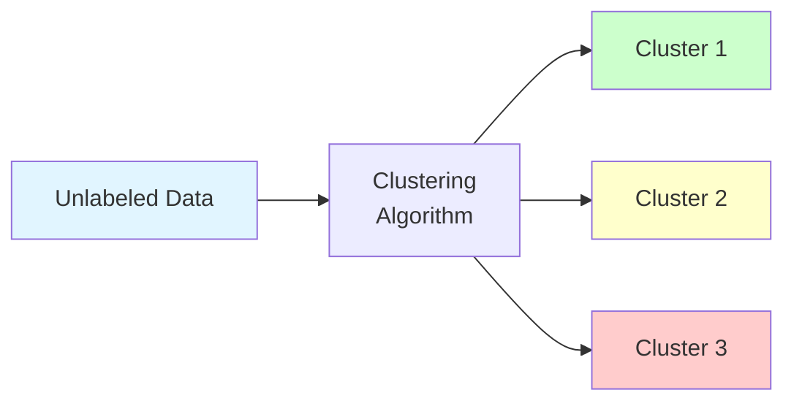
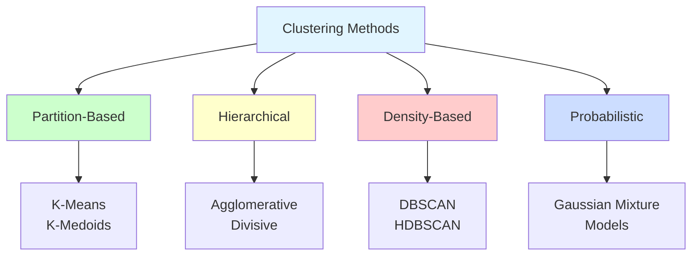
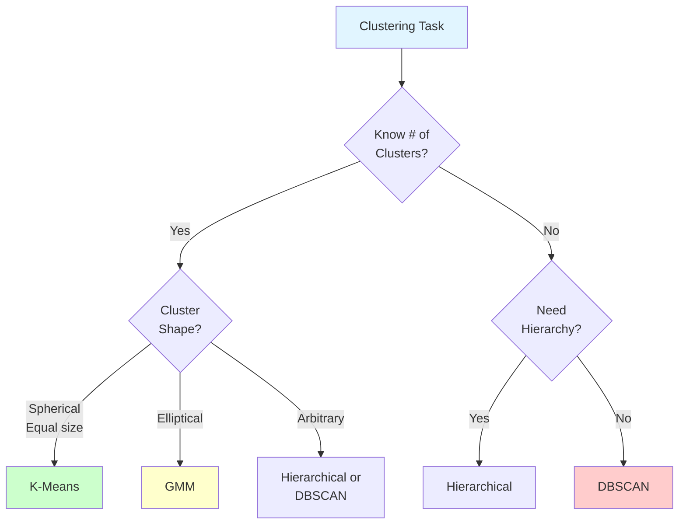
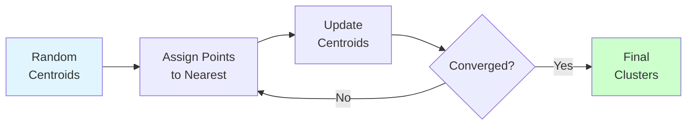
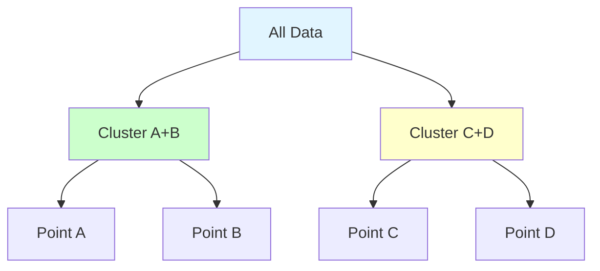
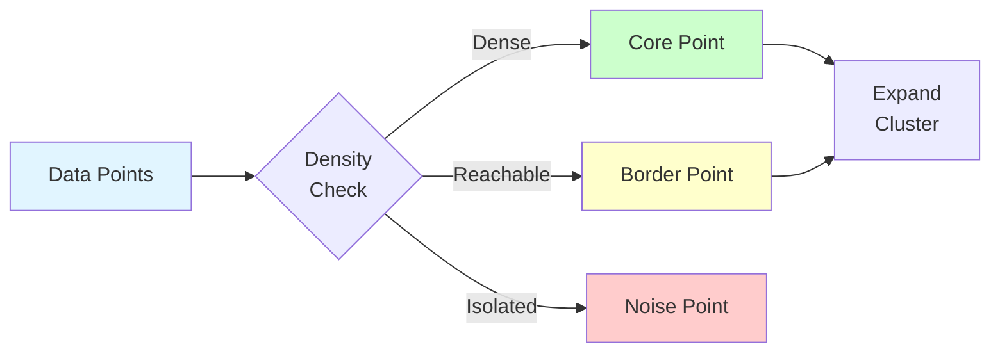
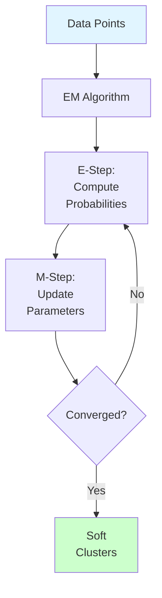

# Clustering

**Group similar data points together without labels.** Master partition-based, hierarchical, density-based, and probabilistic clustering algorithms.

**Difficulty:** 🟡 Intermediate | **Time:** 2-3 weeks | **Prerequisites:** [ML Fundamentals](../../fundamentals/index.md), Distance Metrics

---

## 🎯 What is Clustering?

**Clustering** is the task of dividing data points into groups (clusters) such that points in the same cluster are more similar to each other than to points in other clusters.



**Key Concepts:**
- **Intra-cluster similarity:** Points within cluster are similar
- **Inter-cluster dissimilarity:** Different clusters are dissimilar
- **Unsupervised:** No labels, discover structure
- **Applications:** Customer segmentation, document grouping, image segmentation

---

## 📊 Clustering Categories



### 1. Partition-Based Clustering
- Divide data into K non-overlapping clusters
- Each point belongs to exactly one cluster
- **Example:** K-Means, K-Medoids

### 2. Hierarchical Clustering
- Build tree-like hierarchy of clusters
- Can extract clusters at any level
- **Example:** Agglomerative, Divisive

### 3. Density-Based Clustering
- Find regions of high density
- Can discover arbitrary shapes
- **Example:** DBSCAN, HDBSCAN

### 4. Probabilistic Clustering
- Soft assignments with probabilities
- Statistical model of data
- **Example:** Gaussian Mixture Models

---

## 🔍 Algorithm Comparison

### Feature Comparison

| Algorithm | Clusters Shape | # Clusters | Outliers | Scalability | Deterministic |
|-----------|----------------|------------|----------|-------------|---------------|
| **K-Means** | Spherical | Must specify | Sensitive | ⭐⭐⭐ | No (random init) |
| **Hierarchical** | Any | Flexible | Sensitive | ⭐ (O(n³)) | Yes |
| **DBSCAN** | Arbitrary | Automatic | Robust | ⭐⭐ | Yes |
| **GMM** | Elliptical | Must specify | Moderate | ⭐⭐ | No (EM init) |

### Use Case Guide



---

## 📚 Topics

### 1. K-Means Clustering 🟡

**Partition data into K spherical clusters by minimizing within-cluster variance**



**Algorithm:**
```
1. Choose K (number of clusters)
2. Initialize K centroids (K-Means++)
3. Assign each point to nearest centroid
4. Update centroids = mean of assigned points
5. Repeat 3-4 until convergence
```

**Key Concepts:**
- Within-Cluster Sum of Squares (WCSS): Σ ||xᵢ - cⱼ||²
- Elbow method for choosing K
- K-Means++ initialization (better than random)
- Lloyd's algorithm
- Mini-batch K-Means for large data

**Strengths:**
- Fast and scalable: O(n·k·i·d)
- Simple to understand and implement
- Works well with spherical clusters
- Guaranteed to converge

**Limitations:**
- Must specify K
- Assumes spherical clusters
- Sensitive to initialization
- Sensitive to outliers
- Requires feature scaling

→ Learn K-Means (coming soon)

**Time:** 3-4 hours | **Difficulty:** 🟡 | **Interview:** ⭐⭐⭐⭐

---

### 2. Hierarchical Clustering 🟡

**Build tree (dendrogram) of nested clusters**



**Approaches:**
- **Agglomerative (bottom-up):** Start with individual points, merge similar ones
- **Divisive (top-down):** Start with all points, recursively split

**Linkage Methods:**
- **Single linkage:** Minimum distance between clusters
- **Complete linkage:** Maximum distance between clusters
- **Average linkage:** Average distance between all pairs
- **Ward linkage:** Minimize variance increase

**Key Concepts:**
- Dendrogram visualization
- No need to specify K upfront
- Cut tree at any height for different K
- Distance matrix computation

**Strengths:**
- Hierarchical structure intuitive
- No need to specify K
- Deterministic (same input → same output)
- Flexible cluster shapes

**Limitations:**
- Expensive: O(n³) time, O(n²) space
- Not scalable to large datasets
- Cannot undo merges/splits
- Sensitive to noise and outliers

→ Learn Hierarchical Clustering (coming soon)

**Time:** 3-4 hours | **Difficulty:** 🟡 | **Interview:** ⭐⭐⭐

---

### 3. DBSCAN (Density-Based) 🟡

**Find clusters as dense regions separated by low-density regions**



**Key Concepts:**
- **eps (ε):** Neighborhood radius
- **min_samples:** Minimum points to form dense region
- **Core point:** Has ≥ min_samples within eps
- **Border point:** Reachable from core, but not core itself
- **Noise point:** Neither core nor border

**Algorithm:**
```
1. For each unvisited point p:
2.   Mark p as visited
3.   Find all points within eps of p
4.   If < min_samples: mark as noise (may change later)
5.   Else: create new cluster, expand from p
6.   Recursively add density-reachable points
```

**Strengths:**
- No need to specify K
- Discovers arbitrary cluster shapes
- Robust to outliers (marks as noise)
- Only 2 parameters

**Limitations:**
- Struggles with varying densities
- Sensitive to eps and min_samples
- High dimensional data (curse of dimensionality)
- Not fully deterministic with border points

→ Learn DBSCAN (coming soon)

**Time:** 3-4 hours | **Difficulty:** 🟡 | **Interview:** ⭐⭐⭐

---

### 4. Gaussian Mixture Models (GMM) 🔴

**Probabilistic model: data as mixture of Gaussian distributions**



**Key Concepts:**
- **Soft clustering:** Each point has probability for each cluster
- **Mixture model:** P(x) = Σ πₖ·N(x|μₖ,Σₖ)
- **EM Algorithm:** Expectation-Maximization
  - E-step: Compute cluster probabilities
  - M-step: Update means, covariances, weights
- **Model selection:** BIC, AIC for choosing K

**Mathematical Foundation:**
```
Mixture: P(x) = Σᵏ πₖ · N(x|μₖ, Σₖ)

E-Step: γᵢₖ = πₖ·N(xᵢ|μₖ,Σₖ) / Σⱼ πⱼ·N(xᵢ|μⱼ,Σⱼ)

M-Step:
  μₖ = Σᵢ γᵢₖ·xᵢ / Σᵢ γᵢₖ
  Σₖ = Σᵢ γᵢₖ·(xᵢ-μₖ)(xᵢ-μₖ)ᵀ / Σᵢ γᵢₖ
  πₖ = (Σᵢ γᵢₖ) / n
```

**Strengths:**
- Soft clustering (probabilities)
- Can model elliptical clusters
- Statistical framework
- Uncertainty quantification

**Limitations:**
- Must specify K
- Assumes Gaussian distributions
- Sensitive to initialization
- Can converge to local optima
- More complex than K-Means

→ Learn Gaussian Mixture Models (coming soon)

**Time:** 4-5 hours | **Difficulty:** 🔴 | **Interview:** ⭐⭐⭐

---

## 📈 Evaluation Metrics

### Internal Metrics (No ground truth)

#### 1. Silhouette Score
**Measures how similar points are to their cluster vs other clusters**

$$s(i) = \frac{b(i) - a(i)}{\max(a(i), b(i))}$$

Where:
- $a(i)$ = average distance to points in same cluster
- $b(i)$ = average distance to points in nearest other cluster
- Range: [-1, 1], higher is better

```python
from sklearn.metrics import silhouette_score
score = silhouette_score(X, labels)  # Higher is better
```

#### 2. Davies-Bouldin Index
**Average similarity between each cluster and its most similar cluster**

- Lower is better
- Measures cluster separation and compactness

```python
from sklearn.metrics import davies_bouldin_score
score = davies_bouldin_score(X, labels)  # Lower is better
```

#### 3. Calinski-Harabasz Index
**Ratio of between-cluster to within-cluster variance**

- Higher is better
- Fast to compute

```python
from sklearn.metrics import calinski_harabasz_score
score = calinski_harabasz_score(X, labels)  # Higher is better
```

### External Metrics (With ground truth)

#### 4. Adjusted Rand Index (ARI)
**Measures similarity between true and predicted clusters**

- Range: [-1, 1], 1 is perfect
- Adjusted for chance

```python
from sklearn.metrics import adjusted_rand_score
score = adjusted_rand_score(y_true, y_pred)
```

#### 5. Normalized Mutual Information (NMI)
**Information shared between true and predicted clusters**

- Range: [0, 1], 1 is perfect
- Normalized for different cluster sizes

```python
from sklearn.metrics import normalized_mutual_info_score
score = normalized_mutual_info_score(y_true, y_pred)
```

---

## 🎯 Choosing the Right Algorithm

### Quick Decision Guide

```python
# Pseudocode for algorithm selection
if you_know_k and clusters_are_spherical:
    use_kmeans()
elif you_know_k and want_probabilities:
    use_gmm()
elif you_dont_know_k and have_hierarchy:
    use_hierarchical()
elif arbitrary_shapes or many_outliers:
    use_dbscan()
elif very_large_dataset:
    use_minibatch_kmeans()
else:
    # Start with K-Means as baseline
    use_kmeans()
```

### Detailed Comparison

| Scenario | Best Algorithm | Why |
|----------|----------------|-----|
| **Known K, spherical clusters** | K-Means | Fast, simple, effective |
| **Known K, elliptical clusters** | GMM | Models covariance structure |
| **Unknown K, need hierarchy** | Hierarchical | Dendrogram reveals structure |
| **Arbitrary shapes** | DBSCAN | Density-based, flexible |
| **Want probabilities** | GMM | Soft assignments |
| **Large dataset (millions)** | Mini-Batch K-Means | Scalable variant |
| **Many outliers** | DBSCAN | Marks outliers as noise |
| **Need interpretability** | K-Means or Hierarchical | Clear cluster assignments |

---

## 🛠️ Complete Clustering Pipeline

```python
import numpy as np
import matplotlib.pyplot as plt
from sklearn.preprocessing import StandardScaler
from sklearn.cluster import KMeans, DBSCAN, AgglomerativeClustering
from sklearn.mixture import GaussianMixture
from sklearn.metrics import silhouette_score, davies_bouldin_score
from sklearn.datasets import make_blobs

# 1. Generate or load data
X, y_true = make_blobs(n_samples=500, centers=4, n_features=2,
                       cluster_std=1.0, random_state=42)

# 2. Scale data (CRITICAL!)
scaler = StandardScaler()
X_scaled = scaler.fit_transform(X)

# 3. K-Means
kmeans = KMeans(n_clusters=4, random_state=42, n_init=10)
labels_km = kmeans.fit_predict(X_scaled)
print(f"K-Means Silhouette: {silhouette_score(X_scaled, labels_km):.3f}")

# 4. Hierarchical
hierarchical = AgglomerativeClustering(n_clusters=4, linkage='ward')
labels_hc = hierarchical.fit_predict(X_scaled)
print(f"Hierarchical Silhouette: {silhouette_score(X_scaled, labels_hc):.3f}")

# 5. DBSCAN
dbscan = DBSCAN(eps=0.5, min_samples=5)
labels_db = dbscan.fit_predict(X_scaled)
print(f"DBSCAN Clusters: {len(set(labels_db)) - (1 if -1 in labels_db else 0)}")

# 6. GMM
gmm = GaussianMixture(n_components=4, random_state=42)
labels_gmm = gmm.fit_predict(X_scaled)
print(f"GMM BIC: {gmm.bic(X_scaled):.2f}")

# 7. Visualize all
fig, axes = plt.subplots(2, 2, figsize=(12, 10))

axes[0, 0].scatter(X[:, 0], X[:, 1], c=labels_km, cmap='viridis')
axes[0, 0].set_title('K-Means')

axes[0, 1].scatter(X[:, 0], X[:, 1], c=labels_hc, cmap='viridis')
axes[0, 1].set_title('Hierarchical')

axes[1, 0].scatter(X[:, 0], X[:, 1], c=labels_db, cmap='viridis')
axes[1, 0].set_title('DBSCAN')

axes[1, 1].scatter(X[:, 0], X[:, 1], c=labels_gmm, cmap='viridis')
axes[1, 1].set_title('GMM')

plt.tight_layout()
plt.show()
```

---

## ⚠️ Common Pitfalls

### 1. Not Scaling Features

!!! danger "Distance-Based Methods Need Scaling"
    K-Means, Hierarchical, DBSCAN all use distances. Features on different scales will dominate!

    **Solution:**
    ```python
    from sklearn.preprocessing import StandardScaler
    scaler = StandardScaler()
    X_scaled = scaler.fit_transform(X)
    ```

### 2. Wrong Number of Clusters

!!! warning "Choosing K Without Analysis"
    Don't guess K! Use elbow method, silhouette analysis, or domain knowledge.

    **Solution:**
    ```python
    # Elbow method
    inertias = []
    K_range = range(2, 11)
    for k in K_range:
        kmeans = KMeans(n_clusters=k, random_state=42)
        kmeans.fit(X_scaled)
        inertias.append(kmeans.inertia_)

    plt.plot(K_range, inertias, 'bo-')
    plt.xlabel('Number of Clusters (K)')
    plt.ylabel('Inertia (WCSS)')
    plt.title('Elbow Method')
    plt.show()
    ```

### 3. Using Wrong Algorithm for Data Shape

!!! warning "K-Means on Non-Spherical Clusters"
    K-Means assumes spherical clusters. For arbitrary shapes, use DBSCAN.

    **Example:**
    - Moons, circles → DBSCAN
    - Elongated ellipses → GMM
    - Spherical blobs → K-Means

### 4. Ignoring Outliers

!!! danger "Outliers Affect Centroids"
    Outliers pull K-Means and Hierarchical centroids. Use DBSCAN or remove outliers first.

### 5. Not Validating Clusters

!!! warning "Trust But Verify"
    Always validate clusters:
    - Visualize (PCA/t-SNE if high-dimensional)
    - Compute metrics (silhouette, Davies-Bouldin)
    - Check business/domain logic
    - Profile clusters (statistics per cluster)

---

## 🎓 Learning Path

### Week 1: K-Means
- **Day 1-2:** Algorithm and math
- **Day 3:** Implementation (sklearn + scratch)
- **Day 4:** Elbow method, silhouette
- **Day 5:** Project: Customer segmentation

### Week 2: Hierarchical & DBSCAN
- **Day 1-2:** Hierarchical clustering, dendrogram
- **Day 3-4:** DBSCAN algorithm and parameters
- **Day 5:** Compare all three methods

### Week 3: GMM & Advanced
- **Day 1-2:** Gaussian Mixture Models, EM algorithm
- **Day 3:** Model selection (BIC, AIC)
- **Day 4-5:** Real-world project combining methods

---

## 📚 Hands-On Projects

### 🟢 Beginner: Customer Segmentation
**Goal:** Segment customers using K-Means

**Tasks:**
1. Load customer data (age, income, spending)
2. Scale features
3. Use elbow method to choose K
4. Cluster with K-Means
5. Profile each segment
6. Business recommendations

**Dataset:** Mall Customer Segmentation Data (Kaggle)

---

### 🟡 Intermediate: Document Clustering
**Goal:** Group similar documents using hierarchical clustering

**Tasks:**
1. TF-IDF vectorization
2. Hierarchical clustering
3. Dendrogram visualization
4. Compare with K-Means
5. Topic extraction per cluster

**Dataset:** 20 Newsgroups or BBC News

---

### 🔴 Advanced: Multi-Method Comparison
**Goal:** Compare all clustering methods on complex data

**Tasks:**
1. Generate datasets with different shapes
2. Apply K-Means, Hierarchical, DBSCAN, GMM
3. Evaluate with multiple metrics
4. Visualize results
5. Analyze when each method works best

---

## 📖 References

### Papers
1. **K-Means:** MacQueen (1967) - "Some Methods for Classification and Analysis of Multivariate Observations"
2. **K-Means++:** Arthur & Vassilvitskii (2007) - "k-means++: The Advantages of Careful Seeding"
3. **DBSCAN:** Ester et al. (1996) - "A Density-Based Algorithm for Discovering Clusters"
4. **GMM:** Dempster et al. (1977) - "Maximum Likelihood from Incomplete Data via the EM Algorithm"

### Books
- *Pattern Recognition and Machine Learning* - Bishop, Chapter 9
- *The Elements of Statistical Learning* - Chapter 14
- *Hands-On Machine Learning* - Chapter 9

### Online Resources
- Scikit-learn [Clustering Documentation](https://scikit-learn.org/stable/modules/clustering.html)
- [StatQuest: K-Means](https://www.youtube.com/watch?v=4b5d3muPQmA)
- [Visualizing K-Means](https://www.naftaliharris.com/blog/visualizing-k-means-clustering/)

---

## 🚀 Next Steps

**After mastering clustering:**

1. **Dimensionality Reduction:** PCA, t-SNE
2. **Anomaly Detection:** Isolation Forest
3. **Advanced:** Semi-supervised learning, deep clustering

---

**Ready to discover hidden groups in your data?** Start with K-Means! 🎯
