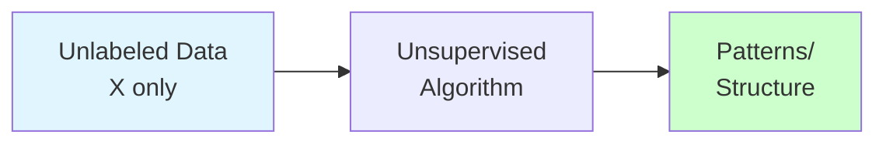
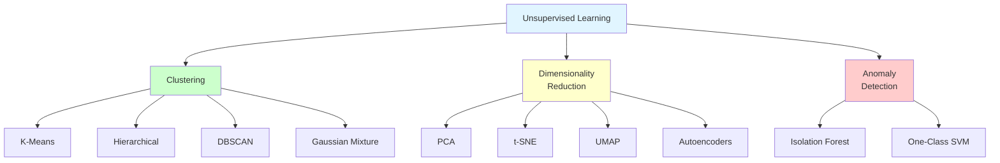
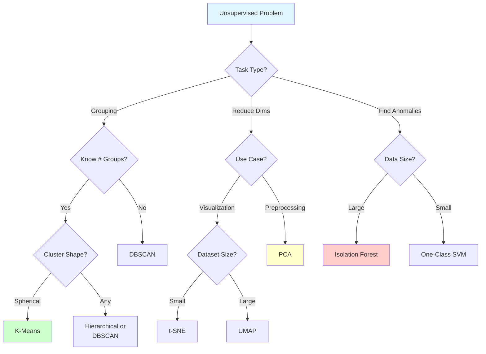

# Unsupervised Learning

**Discover hidden patterns in unlabeled data.** Master clustering, dimensionality reduction, and anomaly detection without predefined labels.

**Difficulty:** 🟡 Intermediate | **Time:** 3-4 weeks | **Prerequisites:** [ML Fundamentals](../fundamentals/index.md), [Linear Algebra](../fundamentals/mathematics.md)

---

## 🎯 What is Unsupervised Learning?

**Unsupervised learning** finds patterns and structure in data without labeled outputs. You only have input features (X), no target variable (y).



**Key Difference:**
```
Supervised:   (X, y) → Model → Predictions
Unsupervised: (X)    → Model → Patterns/Groups/Dimensions
```

**Main Tasks:**
1. **Clustering:** Group similar data points
2. **Dimensionality Reduction:** Compress data while preserving information
3. **Anomaly Detection:** Find unusual patterns

---

## 📚 Section Overview



---

## 📊 1. Clustering

**Group similar data points together**

### Overview
Clustering partitions data into groups (clusters) where points within a cluster are more similar to each other than to points in other clusters.

**Applications:**
- Customer segmentation
- Document grouping
- Image segmentation
- Anomaly detection
- Data compression

### Topics

#### K-Means Clustering 🟡
**Partition data into K spherical clusters**

**Algorithm:**
```
1. Choose K (number of clusters)
2. Initialize K centroids randomly
3. Assign each point to nearest centroid
4. Update centroids (mean of assigned points)
5. Repeat 3-4 until convergence
```

**Key Concepts:**
- Within-cluster sum of squares (WCSS)
- Elbow method for choosing K
- K-Means++ initialization
- Limitations: assumes spherical clusters
- Fast and scalable

**When to Use:**
- Know number of clusters (or can estimate)
- Clusters are roughly spherical
- Similar cluster sizes
- Large datasets (efficient)

**[→ Learn K-Means](clustering/kmeans.md)**

**Difficulty:** 🟡 | **Time:** 3-4 hours | **Interview:** ⭐⭐⭐⭐

---

#### Hierarchical Clustering 🟡
**Build tree of clusters (dendrogram)**

**Types:**
- **Agglomerative (bottom-up):** Start with individual points, merge
- **Divisive (top-down):** Start with all points, split

**Key Concepts:**
- Dendrogram visualization
- Linkage methods: single, complete, average, Ward
- No need to specify K upfront
- Can get clusters at any level

**When to Use:**
- Want dendrogram visualization
- Don't know K
- Small to medium datasets
- Hierarchical structure important

**[→ Learn Hierarchical Clustering](clustering/hierarchical.md)**

**Difficulty:** 🟡 | **Time:** 3-4 hours | **Interview:** ⭐⭐⭐

---

#### DBSCAN 🟡
**Density-Based Spatial Clustering - finds arbitrary shapes**

**Algorithm:**
```
1. Define neighborhood (epsilon radius)
2. Define minimum points in neighborhood
3. Core points: have min points in neighborhood
4. Expand clusters from core points
5. Border points and noise
```

**Key Concepts:**
- Finds arbitrary-shaped clusters
- Automatically determines number of clusters
- Identifies outliers as noise
- Parameters: eps (radius), min_samples
- Not sensitive to outliers

**When to Use:**
- Unknown number of clusters
- Arbitrary cluster shapes
- Data has noise/outliers
- Varying cluster densities

**[→ Learn DBSCAN](clustering/dbscan.md)**

**Difficulty:** 🟡 | **Time:** 3-4 hours | **Interview:** ⭐⭐⭐

---

#### Gaussian Mixture Models (GMM) 🔴
**Probabilistic clustering - soft assignments**

**Key Concepts:**
- Assumes data is mixture of Gaussians
- Soft clustering (probabilities)
- Expectation-Maximization (EM) algorithm
- Can model elliptical clusters
- Provides uncertainty estimates

**When to Use:**
- Need probability of cluster membership
- Clusters are elliptical
- Want statistical model
- Uncertainty quantification

**[→ Learn Gaussian Mixture Models](clustering/gaussian-mixture.md)**

**Difficulty:** 🔴 | **Time:** 4-5 hours | **Interview:** ⭐⭐⭐

---

### Clustering Comparison

| Algorithm | Clusters Shape | # Clusters | Speed | Outliers | Scalability |
|-----------|----------------|------------|-------|----------|-------------|
| **K-Means** | Spherical | Must specify | ⚡⚡⚡ | Sensitive | ⭐⭐⭐ |
| **Hierarchical** | Any | Flexible | ⚡ | Sensitive | ⭐ |
| **DBSCAN** | Any | Automatic | ⚡⚡ | Robust | ⭐⭐ |
| **GMM** | Elliptical | Must specify | ⚡⚡ | Moderate | ⭐⭐ |

**[→ Explore All Clustering Topics](clustering/index.md)**

---

## 📉 2. Dimensionality Reduction

**Reduce features while preserving information**

### Overview
Transform high-dimensional data to lower dimensions while retaining important information.

**Why Reduce Dimensions?**
- Visualization (2D/3D plots)
- Remove noise
- Speed up algorithms
- Avoid curse of dimensionality
- Feature extraction

**Applications:**
- Data visualization
- Preprocessing for ML
- Image compression
- Feature extraction

### Topics

#### Principal Component Analysis (PCA) 🟡
**Linear dimensionality reduction - find principal directions**

**Key Concepts:**
- Finds directions of maximum variance
- Linear transformation
- Eigenvalues and eigenvectors
- Variance explained ratio
- Unsupervised feature extraction

**Mathematical Foundation:**
```
1. Standardize data
2. Compute covariance matrix
3. Compute eigenvalues/eigenvectors
4. Sort by eigenvalue (variance explained)
5. Project data onto top K eigenvectors
```

**When to Use:**
- Linear relationships
- Want interpretable components
- Preprocessing for ML
- Data visualization
- Image compression

**[→ Learn PCA](dimensionality-reduction/pca.md)**

**Difficulty:** 🟡 | **Time:** 4-5 hours | **Interview:** ⭐⭐⭐⭐

---

#### t-SNE 🟡
**Non-linear visualization - preserve local structure**

**Key Concepts:**
- Preserves local neighborhoods
- Non-linear transformation
- Excellent for visualization (2D/3D)
- Stochastic (different runs vary)
- Computational expensive
- Perplexity parameter (neighborhood size)

**When to Use:**
- Visualization only (2D/3D)
- High-dimensional data (images, embeddings)
- Want to see clusters
- Don't need inverse transform

**[→ Learn t-SNE](dimensionality-reduction/tsne.md)**

**Difficulty:** 🟡 | **Time:** 3-4 hours | **Interview:** ⭐⭐⭐

---

#### UMAP 🔴
**Uniform Manifold Approximation and Projection**

**Key Concepts:**
- Preserves global and local structure
- Faster than t-SNE
- Can be used for preprocessing
- More stable than t-SNE
- Better preserves distances

**When to Use:**
- Visualization and preprocessing
- Large datasets (faster than t-SNE)
- Want global structure preserved
- Need reproducibility

**[→ Learn UMAP](dimensionality-reduction/umap.md)**

**Difficulty:** 🔴 | **Time:** 3-4 hours | **Interview:** ⭐⭐

---

#### Autoencoders 🔴
**Neural network-based dimensionality reduction**

**Key Concepts:**
- Encoder-decoder architecture
- Non-linear transformation
- Learned representations
- Can reconstruct data
- Variational autoencoders (VAE)

**When to Use:**
- Complex non-linear relationships
- Deep learning pipeline
- Need reconstruction
- Large datasets
- Feature learning

**[→ Learn Autoencoders](dimensionality-reduction/autoencoders.md)**

**Difficulty:** 🔴 | **Time:** 5-6 hours | **Interview:** ⭐⭐⭐

---

### Dimensionality Reduction Comparison

| Method | Linear | Speed | Use Case | Interpretable |
|--------|--------|-------|----------|---------------|
| **PCA** | Yes | ⚡⚡⚡ | Preprocessing, compression | Yes |
| **t-SNE** | No | ⚡ | Visualization only | No |
| **UMAP** | No | ⚡⚡ | Visualization + preprocessing | No |
| **Autoencoders** | No | ⚡⚡ | Complex patterns, deep learning | No |

**[→ Explore Dimensionality Reduction](dimensionality-reduction/index.md)**

---

## ⚠️ 3. Anomaly Detection

**Identify unusual patterns or outliers**

### Overview
Find data points that significantly deviate from the normal pattern.

**Applications:**
- Fraud detection
- Network intrusion
- Manufacturing defects
- Health monitoring
- System failures

### Topics

#### Isolation Forest 🟡
**Isolate anomalies using random trees**

**Key Concepts:**
- Anomalies are easier to isolate
- Random partitioning
- Anomaly score based on path length
- Fast and scalable
- No need for normal/anomalous labels

**When to Use:**
- High-dimensional data
- Need fast detection
- Unknown anomaly patterns
- Large datasets

**[→ Learn Isolation Forest](anomaly-detection/isolation-forest.md)**

**Difficulty:** 🟡 | **Time:** 3-4 hours | **Interview:** ⭐⭐⭐

---

#### One-Class SVM 🟡
**Learn boundary around normal data**

**Key Concepts:**
- Learns decision boundary
- Kernel trick for non-linear
- Sensitive to outliers in training
- RBF kernel common

**When to Use:**
- Small datasets
- Need decision boundary
- Normal data available
- Few features

**[→ Learn One-Class SVM](anomaly-detection/one-class-svm.md)**

**Difficulty:** 🟡 | **Time:** 3-4 hours | **Interview:** ⭐⭐

---

### Anomaly Detection Comparison

| Method | Speed | Scalability | Sensitivity | Best For |
|--------|-------|-------------|-------------|----------|
| **Isolation Forest** | ⚡⚡⚡ | ⭐⭐⭐ | Robust | High-dim, large data |
| **One-Class SVM** | ⚡⚡ | ⭐⭐ | Sensitive | Small data, need boundary |

**[→ Explore Anomaly Detection](anomaly-detection/index.md)**

---

## 🎯 Algorithm Selection Guide



---

## 🛠️ Practical Implementation

### Complete Workflow

```python
import numpy as np
import matplotlib.pyplot as plt
from sklearn.preprocessing import StandardScaler
from sklearn.decomposition import PCA
from sklearn.manifold import TSNE
from sklearn.cluster import KMeans, DBSCAN
from sklearn.ensemble import IsolationForest

# 1. Standardize data (important!)
scaler = StandardScaler()
X_scaled = scaler.fit_transform(X)

# 2. Dimensionality Reduction
## PCA
pca = PCA(n_components=2)
X_pca = pca.fit_transform(X_scaled)
print(f"Variance explained: {pca.explained_variance_ratio_.sum():.2f}")

## t-SNE (for visualization)
tsne = TSNE(n_components=2, random_state=42)
X_tsne = tsne.fit_transform(X_scaled)

# 3. Clustering
## K-Means
kmeans = KMeans(n_clusters=3, random_state=42)
clusters_kmeans = kmeans.fit_predict(X_scaled)

## DBSCAN
dbscan = DBSCAN(eps=0.5, min_samples=5)
clusters_dbscan = dbscan.fit_predict(X_scaled)

# 4. Anomaly Detection
iso_forest = IsolationForest(contamination=0.1, random_state=42)
anomalies = iso_forest.fit_predict(X_scaled)

# 5. Visualize
fig, axes = plt.subplots(2, 2, figsize=(12, 10))

# PCA clusters
axes[0, 0].scatter(X_pca[:, 0], X_pca[:, 1], c=clusters_kmeans)
axes[0, 0].set_title('K-Means on PCA')

# t-SNE clusters
axes[0, 1].scatter(X_tsne[:, 0], X_tsne[:, 1], c=clusters_kmeans)
axes[0, 1].set_title('K-Means on t-SNE')

# DBSCAN
axes[1, 0].scatter(X_pca[:, 0], X_pca[:, 1], c=clusters_dbscan)
axes[1, 0].set_title('DBSCAN')

# Anomalies
axes[1, 1].scatter(X_pca[:, 0], X_pca[:, 1], c=anomalies)
axes[1, 1].set_title('Anomalies (Isolation Forest)')

plt.tight_layout()
plt.show()
```

---

## 📚 Hands-On Projects

### Beginner Projects
1. **Customer Segmentation** 🟡
   - K-Means clustering
   - Elbow method
   - Visualize segments
   - Profile clusters

2. **Image Compression with PCA** 🟡
   - Load images
   - Apply PCA
   - Reconstruct with different components
   - Compare quality vs compression

### Intermediate Projects
3. **High-Dimensional Data Visualization** 🟡
   - MNIST or Fashion-MNIST
   - PCA, t-SNE, UMAP comparison
   - Cluster visualization
   - Interpretation

4. **Anomaly Detection in Transactions** 🟡
   - Credit card fraud dataset
   - Isolation Forest
   - Evaluate with labeled test set
   - Threshold tuning

### Advanced Projects
5. **Hierarchical Customer Analysis** 🔴
   - Multiple clustering methods
   - Dendrogram analysis
   - Feature engineering
   - Business insights

6. **Autoencoder for Anomaly Detection** 🔴
   - Build autoencoder
   - Reconstruction error for anomalies
   - Compare with Isolation Forest
   - Visualization

---

## 🎓 Learning Path

### Week 1: Clustering
**Days 1-2:** K-Means
- Algorithm and math
- Implementation
- Elbow method
- Project: Customer segmentation

**Days 3-4:** Hierarchical and DBSCAN
- Agglomerative clustering
- Dendrogram
- DBSCAN algorithm
- Project: Arbitrary shapes

**Days 5-7:** GMM and Practice
- Gaussian Mixture Models
- EM algorithm
- Compare all clustering methods

### Week 2-3: Dimensionality Reduction
**Days 1-3:** PCA
- Theory and math
- Eigenvalues/eigenvectors
- Implementation
- Project: Image compression

**Days 4-5:** t-SNE and UMAP
- Non-linear methods
- Visualization
- Parameter tuning
- Project: High-dim visualization

**Days 6-7:** Autoencoders
- Neural network basics
- Encoder-decoder
- Training
- Project: Feature learning

### Week 4: Anomaly Detection
**Days 1-3:** Isolation Forest
- Algorithm
- Implementation
- Threshold tuning
- Project: Fraud detection

**Days 4-5:** One-Class SVM
- Theory
- Comparison with Isolation Forest
- Project: Outlier detection

**Days 6-7:** Review and Integration
- Combine methods
- Real-world project
- Portfolio piece

---

## ⚠️ Common Pitfalls

!!! danger "Critical Mistakes"
    1. **Not scaling data** - Critical for distance-based methods
    2. **Using t-SNE for preprocessing** - Only for visualization!
    3. **Wrong K in K-Means** - Use elbow method or silhouette score
    4. **Ignoring cluster validation** - Always validate clusters
    5. **Overfitting PCA** - Don't use too many components
    6. **No baseline** - Compare against simple methods

---

## 📖 Additional Resources

### Books
- *Hands-On Machine Learning* - Chapters 8, 9
- *Pattern Recognition and Machine Learning* - Chapters 9, 12
- *An Introduction to Statistical Learning* - Chapter 12

### Online Courses
- Andrew Ng's ML Course - Week 8
- StatQuest (YouTube) - PCA, K-Means, t-SNE
- Fast.ai - Practical Deep Learning

### Tools
- Scikit-learn documentation
- UMAP documentation
- Yellowbrick for visualization

---

## 🚀 Next Steps

**After mastering unsupervised learning:**

1. **Combine with Supervised Learning:**
   - Use clustering for feature engineering
   - PCA for preprocessing
   - Semi-supervised learning

2. **Advanced Topics:**
   - [Deep Learning](../deep-learning/index.md)
   - [Feature Engineering](../feature-engineering/index.md)
   - [Model Evaluation](../evaluation/index.md)

3. **Specialization:**
   - NLP embeddings (Word2Vec, BERT)
   - Image embeddings (CNN features)
   - Recommendation systems

---

**Ready to discover hidden patterns?** Start with [K-Means Clustering](clustering/kmeans.md) or [PCA](dimensionality-reduction/pca.md)! 🚀

**Remember:** Unsupervised learning is exploratory - iterate and validate your findings!
