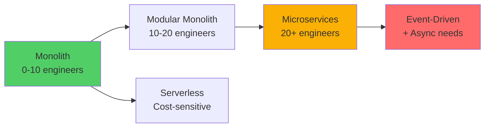

# Architecture Patterns

**Choose the right architecture for your system** | 🏛️ Patterns | ⚖️ Trade-offs | 💼 Decision Guide

## Overview

Architectural patterns define the high-level structure of your system. The right architecture depends on your team size, scale requirements, and business constraints.

---

## Quick Decision Guide

| Pattern | Team Size | Scale | Complexity | Use Case |
|---------|-----------|-------|------------|----------|
| **Monolithic** | 1-10 | <100K users | Low | Startups, MVPs, simple apps |
| **Microservices** | 10+ | 100K-10M+ | High | Large orgs, independent scaling |
| **Event-Driven** | 5-20 | Variable | High | Real-time, async workflows |
| **Serverless** | 1-5 | Variable | Medium | Low traffic, cost optimization |
| **Service-Oriented (SOA)** | 20+ | 1M+ | Very High | Enterprise, legacy integration |
| **Layered/N-Tier** | 5-15 | <1M | Medium | Traditional enterprise apps |

---

## Architecture Patterns

### Core Patterns

| Pattern | Status | Description |
|---------|--------|-------------|
| [Monolithic Architecture](monolithic.md) | 📝 Planned | Single deployable unit, simple to start |
| [Microservices Architecture](microservices.md) | 📝 Planned | Independent services, complex coordination |
| [Event-Driven Architecture](event-driven.md) | 📝 Planned | Async communication via events |
| [Serverless Architecture](serverless.md) | 📝 Planned | Function-as-a-Service, pay-per-use |
| [Service-Oriented Architecture](soa.md) | 📝 Planned | Enterprise service bus, SOAP/ESB |
| [Layered Architecture](layered.md) | 📝 Planned | N-tier, presentation/business/data layers |

---

## When to Use Each Pattern

### Start Here: Monolithic
**Best for:** Startups, MVPs, small teams (1-10 people)

**Pros:**
- ✅ Simple to develop, test, deploy
- ✅ Fast iteration (no distributed system complexity)
- ✅ Easy debugging (single codebase)
- ✅ Lower operational cost

**Cons:**
- ❌ Hard to scale different components independently
- ❌ Deployment risk (entire app goes down)
- ❌ Team coordination bottleneck at scale

**When to migrate:** When you hit 10+ engineers or need independent scaling

---

### Scale Up: Microservices
**Best for:** Growing companies, 10+ engineers, independent teams

**Pros:**
- ✅ Independent scaling (scale only what needs it)
- ✅ Independent deployment (no coordination needed)
- ✅ Technology diversity (use best tool per service)
- ✅ Fault isolation (one service fails, others continue)

**Cons:**
- ❌ Distributed system complexity (network, latency, failures)
- ❌ Data consistency challenges
- ❌ Operational overhead (monitoring, tracing, deployment)
- ❌ Team coordination needed

**When to use:** When monolith becomes bottleneck (code, deployment, or scaling)

---

### Special Cases: Event-Driven
**Best for:** Real-time systems, async workflows, decoupled systems

**Pros:**
- ✅ Loose coupling (producers don't know consumers)
- ✅ Scalability (add consumers without changing producers)
- ✅ Resilience (async means less synchronous failures)

**Cons:**
- ❌ Complex debugging (event flow across services)
- ❌ Eventual consistency
- ❌ Event schema management

**When to use:** Real-time notifications, data pipelines, audit logs

---

### Cost Optimization: Serverless
**Best for:** Variable traffic, low traffic, cost-sensitive projects

**Pros:**
- ✅ Pay only for usage (no idle server costs)
- ✅ Auto-scaling (handles spikes automatically)
- ✅ No server management

**Cons:**
- ❌ Cold start latency (first request slow)
- ❌ Vendor lock-in (AWS Lambda, Azure Functions)
- ❌ Limited execution time (15 min max)

**When to use:** APIs with variable traffic, scheduled jobs, webhooks

---

## Migration Paths

**Don't skip steps!** Going from monolith → microservices without modularizing first = disaster.

---

## Architecture Decision Framework

Ask these questions to choose the right architecture:

### 1. Team Size & Structure
- **1-5 people:** Monolithic or Serverless
- **5-10 people:** Modular Monolith
- **10-30 people:** Microservices (few services)
- **30+ people:** Microservices (many services)

### 2. Scale Requirements
- **<10K users:** Monolithic
- **10K-100K users:** Monolithic or Modular Monolith
- **100K-1M users:** Microservices (if needed)
- **1M+ users:** Microservices (likely needed)

### 3. Traffic Patterns
- **Steady traffic:** Monolithic or Microservices
- **Spiky traffic:** Serverless or Auto-scaling
- **Real-time events:** Event-Driven

### 4. Organizational Constraints
- **Startup (speed matters):** Monolithic
- **Enterprise (teams independent):** Microservices or SOA
- **Cost-conscious:** Serverless or Monolithic

---

## Common Mistakes

| Mistake | Problem | Solution |
|---------|---------|----------|
| **Premature microservices** | Complexity for 3-person team | Start monolith, migrate later |
| **No clear boundaries** | Services tightly coupled | Domain-driven design, bounded contexts |
| **Shared database** | Not real microservices | Database per service |
| **No API gateway** | Client calls many services | API gateway for routing |
| **Microservices everywhere** | Some services too small | Group related functionality |

---

## Further Reading

**Related Topics:**
- [Scalability Patterns](../scalability/index.md) - How to scale your architecture
- [Distributed Systems](../distributed-systems/index.md) - Concepts for microservices
- [Communication Patterns](../communication/index.md) - How services communicate
- [Deployment Strategies](../deployment/index.md) - How to deploy different architectures

**Practice:**
- [Design Instagram](../problems/instagram.md) - Monolith → Microservices migration
- [Design Netflix](../problems/netflix.md) - Microservices architecture
- [Design Uber](../problems/uber.md) - Event-driven architecture

---

**Choose the simplest architecture that meets your needs! 🏛️**
