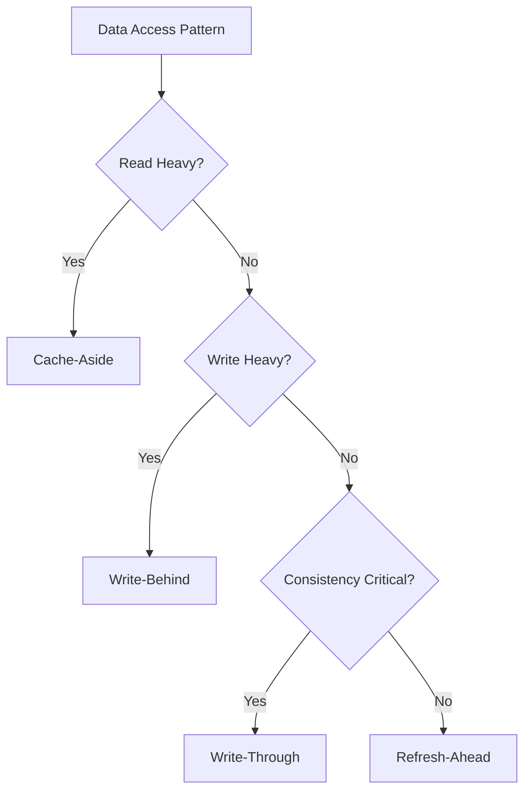

# Caching Strategies 🚀

Master caching patterns, technologies, and strategies to build high-performance systems.

## 📋 Core Topics

### Caching Patterns

- **[Cache-Aside](cache-aside.md)** - Lazy loading pattern, application manages cache
- **[Write-Through](write-through.md)** - Write to cache and database simultaneously
- **[Write-Behind](write-behind.md)** - Asynchronous write to database from cache
- **[Refresh-Ahead](refresh-ahead.md)** - Proactive cache refresh before expiration

### Cache Technologies

- **[Redis](redis.md)** - In-memory data structure store
- **[Memcached](memcached.md)** - High-performance distributed memory caching
- **[CDN](cdn.md)** - Content Delivery Networks for global caching
- **[Application Cache](application.md)** - In-process caching strategies

### Advanced Concepts

- **[Cache Invalidation](invalidation.md)** - Strategies for keeping cache consistent
- **[Distributed Caching](distributed.md)** - Multi-node cache coordination
- **[Cache Warming](warming.md)** - Pre-loading cache with critical data
- **[Cache Compression](compression.md)** - Optimizing memory usage

## 🔍 Quick Reference

### Cache Level Comparison

| Cache Level | Latency | Capacity | Scope | Use Case |
|-------------|---------|----------|-------|----------|
| CPU L1/L2 | 1-10ns | KB-MB | Single Core | Processor operations |
| RAM | 10-100ns | GB | Single Machine | Application data |
| SSD | 0.1-1ms | TB | Single Machine | Persistent cache |
| Network Cache | 1-10ms | TB+ | Distributed | Shared application data |
| CDN | 10-100ms | PB+ | Global | Static content delivery |

### Caching Decision Matrix



## 🛠️ Implementation Examples

### Redis Cache Implementation

```python
import redis
import json
import hashlib
from typing import Any, Optional, Union
from functools import wraps
import time

class RedisCache:
    def __init__(self, host: str = 'localhost', port: int = 6379, db: int = 0):
        self.redis_client = redis.Redis(
            host=host, 
            port=port, 
            db=db, 
            decode_responses=True,
            socket_connect_timeout=5,
            socket_timeout=5,
            retry_on_timeout=True
        )
        
    def get(self, key: str) -> Optional[Any]:
        """Get value from cache"""
        try:
            value = self.redis_client.get(key)
            if value:
                return json.loads(value)
            return None
        except (redis.RedisError, json.JSONDecodeError):
            return None
    
    def set(self, key: str, value: Any, ttl: int = 3600) -> bool:
        """Set value in cache with TTL"""
        try:
            serialized_value = json.dumps(value, default=str)
            return self.redis_client.setex(key, ttl, serialized_value)
        except (redis.RedisError, TypeError):
            return False
    
    def delete(self, key: str) -> bool:
        """Delete key from cache"""
        try:
            return bool(self.redis_client.delete(key))
        except redis.RedisError:
            return False
    
    def exists(self, key: str) -> bool:
        """Check if key exists in cache"""
        try:
            return bool(self.redis_client.exists(key))
        except redis.RedisError:
            return False

# Decorator for automatic caching
def cache_result(cache_instance: RedisCache, ttl: int = 3600):
    def decorator(func):
        @wraps(func)
        def wrapper(*args, **kwargs):
            # Generate cache key
            key_data = f"{func.__name__}:{args}:{sorted(kwargs.items())}"
            cache_key = hashlib.md5(key_data.encode()).hexdigest()
            
            # Try to get from cache
            cached_result = cache_instance.get(cache_key)
            if cached_result is not None:
                return cached_result
            
            # Execute function and cache result
            result = func(*args, **kwargs)
            cache_instance.set(cache_key, result, ttl)
            return result
        return wrapper
    return decorator

# Usage example
cache = RedisCache()

@cache_result(cache, ttl=1800)
def get_user_profile(user_id: int):
    """Expensive database operation"""
    # Simulate database call
    time.sleep(0.1)
    return {
        'id': user_id,
        'name': f'User {user_id}',
        'email': f'user{user_id}@example.com'
    }
```

### Multi-Level Caching Strategy

```python
from typing import Dict, Any, Callable
import time

class MultiLevelCache:
    def __init__(self):
        self.l1_cache: Dict[str, Any] = {}  # In-memory cache
        self.l1_ttl: Dict[str, float] = {}  # TTL tracking
        self.l2_cache = RedisCache()  # Redis cache
        self.l1_max_size = 1000
        
    def get(self, key: str) -> Optional[Any]:
        """Get from L1 first, then L2"""
        # Check L1 cache
        if key in self.l1_cache and time.time() < self.l1_ttl.get(key, 0):
            return self.l1_cache[key]
        
        # Check L2 cache
        value = self.l2_cache.get(key)
        if value is not None:
            # Promote to L1
            self._set_l1(key, value, 300)  # 5 min L1 TTL
            return value
        
        return None
    
    def set(self, key: str, value: Any, l1_ttl: int = 300, l2_ttl: int = 3600):
        """Set in both cache levels"""
        self._set_l1(key, value, l1_ttl)
        self.l2_cache.set(key, value, l2_ttl)
    
    def _set_l1(self, key: str, value: Any, ttl: int):
        """Set in L1 cache with size management"""
        if len(self.l1_cache) >= self.l1_max_size:
            # LRU eviction - remove oldest entries
            oldest_key = min(self.l1_ttl.keys(), key=self.l1_ttl.get)
            del self.l1_cache[oldest_key]
            del self.l1_ttl[oldest_key]
        
        self.l1_cache[key] = value
        self.l1_ttl[key] = time.time() + ttl
    
    def invalidate(self, key: str):
        """Invalidate from both levels"""
        self.l1_cache.pop(key, None)
        self.l1_ttl.pop(key, None)
        self.l2_cache.delete(key)
```

### Cache-Aside Pattern

```python
class UserService:
    def __init__(self, db_connection, cache: RedisCache):
        self.db = db_connection
        self.cache = cache
        
    async def get_user(self, user_id: int) -> Optional[dict]:
        """Cache-aside pattern implementation"""
        cache_key = f"user:{user_id}"
        
        # 1. Check cache first
        user = self.cache.get(cache_key)
        if user:
            return user
        
        # 2. Cache miss - get from database
        user = await self.db.fetch_one(
            "SELECT * FROM users WHERE id = $1", user_id
        )
        
        if user:
            # 3. Update cache
            self.cache.set(cache_key, dict(user), ttl=1800)
        
        return dict(user) if user else None
    
    async def update_user(self, user_id: int, user_data: dict):
        """Update with cache invalidation"""
        cache_key = f"user:{user_id}"
        
        # 1. Update database
        await self.db.execute(
            "UPDATE users SET name = $1, email = $2 WHERE id = $3",
            user_data['name'], user_data['email'], user_id
        )
        
        # 2. Invalidate cache
        self.cache.delete(cache_key)
        
        # 3. Optionally refresh cache
        return await self.get_user(user_id)
```

## 📊 Cache Performance Optimization

### Cache Hit Rate Monitoring

```python
class CacheMetrics:
    def __init__(self):
        self.hits = 0
        self.misses = 0
        self.total_requests = 0
    
    def record_hit(self):
        self.hits += 1
        self.total_requests += 1
    
    def record_miss(self):
        self.misses += 1
        self.total_requests += 1
    
    @property
    def hit_rate(self) -> float:
        if self.total_requests == 0:
            return 0.0
        return self.hits / self.total_requests
    
    @property
    def miss_rate(self) -> float:
        return 1.0 - self.hit_rate
    
    def reset(self):
        self.hits = 0
        self.misses = 0
        self.total_requests = 0

# Enhanced cache with metrics
class MonitoredCache(RedisCache):
    def __init__(self, *args, **kwargs):
        super().__init__(*args, **kwargs)
        self.metrics = CacheMetrics()
    
    def get(self, key: str) -> Optional[Any]:
        result = super().get(key)
        if result is not None:
            self.metrics.record_hit()
        else:
            self.metrics.record_miss()
        return result
```

### Cache Invalidation Patterns

```python
class CacheInvalidationManager:
    def __init__(self, cache: RedisCache):
        self.cache = cache
        
    def invalidate_by_pattern(self, pattern: str):
        """Invalidate all keys matching pattern"""
        keys = self.cache.redis_client.keys(pattern)
        if keys:
            self.cache.redis_client.delete(*keys)
    
    def invalidate_by_tags(self, tags: list):
        """Tag-based invalidation"""
        for tag in tags:
            tag_key = f"tag:{tag}"
            keys = self.cache.redis_client.smembers(tag_key)
            if keys:
                # Remove tagged keys
                self.cache.redis_client.delete(*keys)
                # Remove tag set
                self.cache.redis_client.delete(tag_key)
    
    def tag_key(self, key: str, tags: list):
        """Associate key with tags for future invalidation"""
        for tag in tags:
            tag_key = f"tag:{tag}"
            self.cache.redis_client.sadd(tag_key, key)

# Usage example
invalidation_manager = CacheInvalidationManager(cache)

# Tag a cached user with relevant tags
user_key = f"user:{user_id}"
invalidation_manager.tag_key(user_key, ['user_data', f'user_{user_id}'])

# Later, invalidate all user data
invalidation_manager.invalidate_by_tags(['user_data'])
```

## 🎯 Best Practices

### Cache Strategy Selection

- [ ] **Identify access patterns** - Read-heavy vs write-heavy
- [ ] **Measure cache hit rates** - Aim for >80% hit rate
- [ ] **Set appropriate TTL** - Balance freshness vs performance
- [ ] **Implement cache warming** for critical data
- [ ] **Monitor cache memory usage** - Prevent eviction storms
- [ ] **Use consistent hashing** for distributed caches
- [ ] **Implement circuit breakers** for cache failures
- [ ] **Plan for cache invalidation** strategies

### Common Anti-Patterns to Avoid

❌ **Cache Stampede** - Multiple requests for same expired key
✅ **Solution**: Use locks or background refresh

❌ **Hot Keys** - Few keys getting most traffic
✅ **Solution**: Distribute load, use local caching

❌ **Large Objects** - Storing massive objects in cache
✅ **Solution**: Cache references or summary data

❌ **No Monitoring** - Flying blind on cache performance
✅ **Solution**: Implement comprehensive metrics

## 🔗 Related Topics

- [Database Systems](../databases/index.md) - Cache-database integration
- [Load Balancing](../load-balancing/index.md) - Distributed cache considerations
- [Performance Optimization](../performance/index.md) - Overall system performance
- [CDN Strategies](../networking/cdn.md) - Content delivery caching

## 📚 Additional Resources

- [Redis Documentation](https://redis.io/documentation) - Comprehensive Redis guide
- [Memcached Wiki](https://github.com/memcached/memcached/wiki) - Memcached best practices
- [High Scalability](http://highscalability.com/) - Real-world caching examples
- [Cache Performance Patterns](https://docs.microsoft.com/en-us/azure/architecture/patterns/cache-aside)
