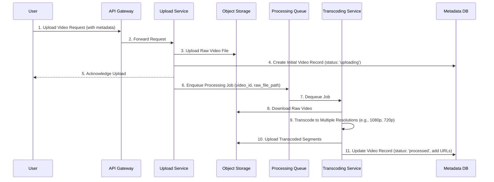

# High-Level Architecture and Diagrams

This section outlines the overall architecture of the video streaming platform using Mermaid diagrams to visualize the system's components and data flow.

## System Architecture

The system is designed as a set of decoupled microservices, each responsible for a specific business capability. This approach allows for independent scaling, development, and deployment.

```mermaid
graph TB
    subgraph "User-Facing"
        Users[Users]
    end

    subgraph "Content Delivery Network"
        CDN[Global CDN / Edge Servers]
    end

    subgraph "Core Backend Services (API Gateway)"
        LB[Load Balancer]
        API[API Gateway]
    end

    subgraph "Microservices"
        Auth[Auth Service]
        Video[Video Service]
        User[User Service]
        Rec[Recommendation Engine]
        Search[Search Service]
        Analytics[Analytics Service]
        Live[Live Streaming Service]
    end

    subgraph "Video Processing Pipeline"
        Upload[Upload Service]
        Processing[Video Processing Queue]
        Transcoding[Transcoding Workers]
    end

    subgraph "Data Stores"
        ObjectStore[Object Storage (S3/GCS)]
        MetadataDB[(Video Metadata DB)]
        UserDB[(User Database)]
        RecDB[(Graph/Vector DB)]
        SearchIndex[Search Index]
        DataWarehouse[(Analytics Warehouse)]
    end

    Users --> CDN
    Users --> LB
    LB --> API

    API --> Auth
    API --> Video
    API --> User
    API --> Rec
    API --> Search
    API --> Analytics
    API --> Live

    Video --> Upload
    Upload --> ObjectStore
    Upload --> Processing
    Processing --> Transcoding
    Transcoding --> ObjectStore
    Transcoding --> MetadataDB

    CDN --> ObjectStore

    User --> UserDB
    Video --> MetadataDB
    Rec --> RecDB
    Search --> SearchIndex
    Analytics --> DataWarehouse
```

## Data Flow: Video Upload & Processing

This diagram illustrates the sequence of events when a user uploads a new video.


