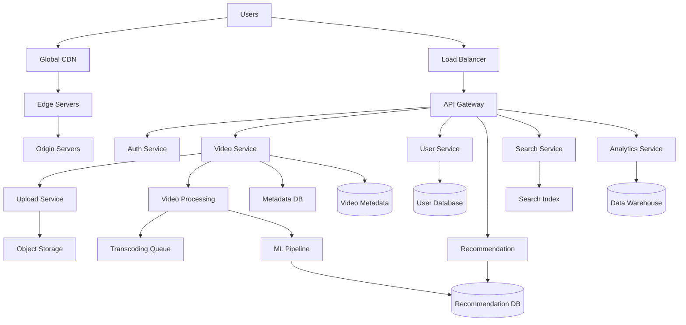

# Video Streaming Platform System Design 🎬

Design a global video streaming platform like YouTube or Netflix that can handle millions of concurrent users streaming billions of hours of content.

## 📋 Problem Statement

Design a video streaming platform that supports:
- Video upload, processing, and storage
- Global content delivery with low latency
- Personalized recommendations
- Live streaming capabilities
- Multiple device support (mobile, web, TV)
- Monetization through ads and subscriptions

## 🎯 Requirements Gathering

### Functional Requirements

**Core Features:**
- Video upload and processing
- Video streaming and playback
- User authentication and profiles
- Search and discovery
- Recommendations
- Comments and social features
- Subscription management
- Advertisement system
- Live streaming
- Analytics and reporting

**Content Management:**
- Support multiple video formats (MP4, AVI, MOV)
- Automatic transcoding to multiple resolutions
- Thumbnail generation
- Metadata management
- Content moderation

### Non-Functional Requirements

**Scale Requirements:**
- 2 billion monthly active users
- 1 billion hours watched daily
- 500 hours of video uploaded per minute
- 99.9% uptime
- Global availability in 190+ countries

**Performance Requirements:**
- Video start time < 2 seconds
- Buffering rate < 0.5%
- Support 4K, 1080p, 720p, 480p streaming
- Adaptive bitrate streaming
- CDN latency < 100ms globally

**Storage Requirements:**
- Store exabytes of video content
- 30+ day backup retention
- Geographic content distribution
- Cost-effective storage tiers

## 🏗️ High-Level Architecture



## 🔧 Component Deep Dive

### 1. Video Upload Service

**Architecture:**
```python
class VideoUploadService:
    """Handles video upload and initial processing"""
    
    def __init__(self):
        self.storage_client = S3Client()
        self.queue_client = SQSClient()
        self.metadata_db = VideoDB()
    
    async def upload_video(self, user_id: str, video_file: bytes, metadata: dict):
        """Upload video with chunked transfer"""
        
        # Generate unique video ID
        video_id = generate_uuid()
        
        # Create upload session
        upload_session = await self.create_upload_session(video_id, len(video_file))
        
        try:
            # Upload to S3 with multipart upload
            s3_key = f"raw-videos/{video_id}/{metadata['filename']}"
            await self.storage_client.multipart_upload(
                bucket="video-uploads",
                key=s3_key,
                data=video_file,
                chunk_size=5 * 1024 * 1024  # 5MB chunks
            )
            
            # Store metadata
            video_record = {
                'video_id': video_id,
                'user_id': user_id,
                'title': metadata['title'],
                'description': metadata['description'],
                'filename': metadata['filename'],
                'file_size': len(video_file),
                'upload_time': datetime.utcnow(),
                'status': 'uploaded',
                's3_location': s3_key
            }
            
            await self.metadata_db.insert_video(video_record)
            
            # Queue for processing
            await self.queue_client.send_message(
                queue="video-processing",
                message={
                    'video_id': video_id,
                    's3_location': s3_key,
                    'processing_priority': self.get_priority(user_id)
                }
            )
            
            return {'video_id': video_id, 'status': 'upload_complete'}
            
        except Exception as e:
            await self.cleanup_failed_upload(video_id)
            raise VideoUploadException(f"Upload failed: {str(e)}")
    
    async def create_upload_session(self, video_id: str, file_size: int):
        """Create resumable upload session"""
        session = {
            'video_id': video_id,
            'total_size': file_size,
            'uploaded_chunks': [],
            'created_at': datetime.utcnow(),
            'expires_at': datetime.utcnow() + timedelta(hours=24)
        }
        
        await self.metadata_db.store_upload_session(session)
        return session
```

**Key Design Decisions:**
- **Multipart Upload**: Handle large video files (up to 100GB)
- **Resumable Uploads**: Allow users to resume interrupted uploads
- **Async Processing**: Decouple upload from processing
- **Duplicate Detection**: Hash-based deduplication

### 2. Video Processing Pipeline

**Architecture:**
```python
class VideoProcessingPipeline:
    """Handles video transcoding and optimization"""
    
    def __init__(self):
        self.transcoding_service = FFmpegService()
        self.thumbnail_service = ThumbnailService()
        self.ml_service = MLAnalysisService()
        self.cdn_service = CDNService()
    
    async def process_video(self, video_id: str, s3_location: str):
        """Complete video processing pipeline"""
        
        try:
            # Download original video
            original_video = await self.download_from_s3(s3_location)
            
            # Extract video metadata
            metadata = await self.extract_metadata(original_video)
            
            # Generate multiple resolutions
            transcoded_videos = await self.transcode_video(
                original_video, 
                resolutions=['2160p', '1080p', '720p', '480p', '360p', '240p']
            )
            
            # Generate thumbnails
            thumbnails = await self.generate_thumbnails(original_video)
            
            # Upload to CDN
            cdn_urls = await self.upload_to_cdn(video_id, transcoded_videos)
            
            # ML analysis for recommendations
            ml_features = await self.ml_service.analyze_video(original_video)
            
            # Update video status
            await self.update_video_status(video_id, {
                'status': 'processed',
                'cdn_urls': cdn_urls,
                'thumbnails': thumbnails,
                'duration': metadata['duration'],
                'ml_features': ml_features,
                'available_resolutions': list(transcoded_videos.keys())
            })
            
            # Generate preview for quick loading
            await self.generate_preview_segments(video_id, transcoded_videos['720p'])
            
        except Exception as e:
            await self.handle_processing_error(video_id, str(e))
    
    async def transcode_video(self, video_data: bytes, resolutions: list):
        """Transcode video to multiple resolutions"""
        transcoded = {}
        
        # Parallel transcoding for different resolutions
        tasks = []
        for resolution in resolutions:
            task = self.transcoding_service.transcode(
                video_data, 
                resolution,
                codec='h264',
                adaptive_bitrate=True
            )
            tasks.append((resolution, task))
        
        results = await asyncio.gather(*[task for _, task in tasks])
        
        for (resolution, _), result in zip(tasks, results):
            transcoded[resolution] = result
        
        return transcoded
    
    async def generate_thumbnails(self, video_data: bytes):
        """Generate thumbnails at different timestamps"""
        thumbnails = []
        
        # Generate thumbnails at 10%, 25%, 50%, 75%, 90% of video
        timestamps = [0.1, 0.25, 0.5, 0.75, 0.9]
        
        for timestamp in timestamps:
            thumbnail = await self.thumbnail_service.extract_frame(
                video_data, 
                timestamp_ratio=timestamp,
                size=(320, 180)
            )
            thumbnails.append(thumbnail)
        
        return thumbnails
```

**Processing Features:**
- **Adaptive Bitrate**: Multiple quality levels for different connections
- **Parallel Processing**: Transcode multiple resolutions simultaneously
- **Smart Thumbnails**: Extract representative frames
- **ML Analysis**: Content categorization and recommendation features
- **Preview Generation**: Quick preview segments for instant playback

### 3. Content Delivery Network (CDN)

**Global CDN Strategy:**
```python
class GlobalCDNManager:
    """Manages global content distribution"""
    
    def __init__(self):
        self.edge_locations = self.load_edge_locations()
        self.origin_servers = OriginServerCluster()
        self.cache_manager = CacheManager()
    
    def get_optimal_cdn_endpoint(self, user_location: str, video_id: str):
        """Find closest CDN endpoint for user"""
        
        # Get user's geographic location
        user_coords = self.get_coordinates(user_location)
        
        # Find nearest edge locations
        nearest_edges = self.find_nearest_edges(user_coords, limit=3)
        
        # Check cache status at each edge
        for edge in nearest_edges:
            cache_status = self.cache_manager.check_cache(edge.id, video_id)
            
            if cache_status == 'HIT':
                return {
                    'endpoint': edge.url,
                    'latency_estimate': edge.latency,
                    'cache_status': 'HIT'
                }
        
        # If not cached, select best edge and trigger pre-loading
        best_edge = nearest_edges[0]
        self.cache_manager.preload_content(best_edge.id, video_id)
        
        return {
            'endpoint': best_edge.url,
            'latency_estimate': best_edge.latency,
            'cache_status': 'MISS'
        }
    
    async def adaptive_streaming_manifest(self, video_id: str, user_context: dict):
        """Generate adaptive streaming manifest (HLS/DASH)"""
        
        video_metadata = await self.get_video_metadata(video_id)
        user_bandwidth = user_context.get('bandwidth', 5000)  # kbps
        device_type = user_context.get('device_type', 'mobile')
        
        # Select appropriate resolutions based on bandwidth
        available_resolutions = []
        
        if user_bandwidth >= 25000:  # 25 Mbps
            available_resolutions.extend(['2160p', '1080p', '720p', '480p'])
        elif user_bandwidth >= 8000:  # 8 Mbps
            available_resolutions.extend(['1080p', '720p', '480p'])
        elif user_bandwidth >= 3000:  # 3 Mbps
            available_resolutions.extend(['720p', '480p', '360p'])
        else:
            available_resolutions.extend(['480p', '360p', '240p'])
        
        # Generate manifest
        manifest = {
            'video_id': video_id,
            'duration': video_metadata['duration'],
            'segments': [],
            'resolutions': available_resolutions
        }
        
        # Create segments for each resolution
        for resolution in available_resolutions:
            segments = await self.create_segments(video_id, resolution)
            manifest['segments'].extend(segments)
        
        return manifest
```

**CDN Features:**
- **Geographic Distribution**: 1000+ edge locations globally
- **Intelligent Caching**: ML-based cache warming
- **Adaptive Streaming**: HLS/DASH protocol support
- **Real-time Analytics**: Monitor performance and adjust routing

### 4. Recommendation Engine

**ML-Powered Recommendations:**
```python
class RecommendationEngine:
    """Personalized video recommendation system"""
    
    def __init__(self):
        self.user_model = UserBehaviorModel()
        self.content_model = ContentAnalysisModel()
        self.collaborative_filter = CollaborativeFilteringModel()
        self.real_time_model = RealTimeModel()
    
    async def get_recommendations(self, user_id: str, context: dict):
        """Generate personalized recommendations"""
        
        # Get user profile and history
        user_profile = await self.user_model.get_profile(user_id)
        watch_history = await self.user_model.get_watch_history(user_id, limit=1000)
        
        # Get real-time context
        current_session = context.get('current_session', {})
        time_of_day = context.get('timestamp', datetime.utcnow())
        device_type = context.get('device_type', 'mobile')
        
        # Generate candidate videos from multiple sources
        candidates = []
        
        # 1. Collaborative filtering
        similar_users = await self.collaborative_filter.find_similar_users(user_id)
        collab_candidates = await self.get_videos_from_similar_users(similar_users)
        candidates.extend(collab_candidates)
        
        # 2. Content-based filtering
        user_preferences = self.extract_preferences(watch_history)
        content_candidates = await self.content_model.find_similar_content(user_preferences)
        candidates.extend(content_candidates)
        
        # 3. Trending and popular content
        trending_candidates = await self.get_trending_videos(time_of_day, user_profile['location'])
        candidates.extend(trending_candidates)
        
        # 4. Real-time session-based recommendations
        session_candidates = await self.real_time_model.get_session_recommendations(
            current_session, user_profile
        )
        candidates.extend(session_candidates)
        
        # Remove duplicates and already watched videos
        candidates = self.deduplicate_and_filter(candidates, watch_history)
        
        # Rank using ensemble model
        ranked_recommendations = await self.rank_candidates(
            candidates, user_profile, context
        )
        
        return ranked_recommendations[:50]  # Return top 50
    
    async def rank_candidates(self, candidates: list, user_profile: dict, context: dict):
        """Rank candidate videos using ML model"""
        
        features = []
        for video in candidates:
            video_features = await self.extract_video_features(video)
            user_video_features = self.compute_user_video_interaction_features(
                user_profile, video_features
            )
            context_features = self.extract_context_features(context)
            
            combined_features = {
                **video_features,
                **user_video_features,
                **context_features
            }
            features.append(combined_features)
        
        # Use trained ML model to predict engagement probability
        engagement_scores = await self.ml_ranking_model.predict(features)
        
        # Combine with diversity and freshness scores
        final_scores = []
        for i, (video, engagement_score) in enumerate(zip(candidates, engagement_scores)):
            diversity_score = self.calculate_diversity_score(video, candidates[:i])
            freshness_score = self.calculate_freshness_score(video)
            
            final_score = (
                0.7 * engagement_score +
                0.2 * diversity_score +
                0.1 * freshness_score
            )
            final_scores.append((video, final_score))
        
        # Sort by final score
        ranked = sorted(final_scores, key=lambda x: x[1], reverse=True)
        return [video for video, score in ranked]
```

### 5. Live Streaming Service

**Real-time Streaming:**
```python
class LiveStreamingService:
    """Handle live video streaming"""
    
    def __init__(self):
        self.rtmp_servers = RTMPServerCluster()
        self.transcoding_cluster = LiveTranscodingCluster()
        self.websocket_manager = WebSocketManager()
    
    async def start_live_stream(self, user_id: str, stream_config: dict):
        """Start a live streaming session"""
        
        # Generate stream key
        stream_key = self.generate_stream_key(user_id)
        
        # Allocate RTMP ingestion server
        rtmp_server = await self.rtmp_servers.allocate_server(
            user_location=stream_config['location']
        )
        
        # Set up live transcoding pipeline
        transcoding_pipeline = await self.transcoding_cluster.create_pipeline(
            stream_key=stream_key,
            resolutions=['1080p', '720p', '480p', '360p'],
            latency_mode='low'  # <3 second latency
        )
        
        # Create stream metadata
        stream_metadata = {
            'stream_id': stream_key,
            'user_id': user_id,
            'title': stream_config['title'],
            'category': stream_config['category'],
            'start_time': datetime.utcnow(),
            'status': 'live',
            'rtmp_url': rtmp_server.ingestion_url,
            'stream_key': stream_key
        }
        
        await self.store_stream_metadata(stream_metadata)
        
        # Set up real-time chat
        chat_room = await self.websocket_manager.create_chat_room(stream_key)
        
        return {
            'stream_key': stream_key,
            'rtmp_url': rtmp_server.ingestion_url,
            'playback_urls': transcoding_pipeline.playback_urls,
            'chat_room_id': chat_room.id
        }
    
    async def handle_live_chat(self, stream_id: str, user_id: str, message: str):
        """Handle real-time chat messages"""
        
        # Validate and sanitize message
        cleaned_message = await self.sanitize_message(message)
        
        # Check rate limiting
        if not await self.check_rate_limit(user_id, stream_id):
            raise RateLimitExceededException()
        
        # Get user info for display
        user_info = await self.get_user_display_info(user_id)
        
        # Create chat message
        chat_message = {
            'message_id': generate_uuid(),
            'stream_id': stream_id,
            'user_id': user_id,
            'username': user_info['username'],
            'message': cleaned_message,
            'timestamp': datetime.utcnow(),
            'user_badges': user_info.get('badges', [])
        }
        
        # Broadcast to all viewers
        await self.websocket_manager.broadcast_to_stream(stream_id, chat_message)
        
        # Store for moderation and replay
        await self.store_chat_message(chat_message)
```

## 💾 Database Design

### User Data Schema

```sql
-- User management tables
CREATE TABLE users (
    user_id UUID PRIMARY KEY,
    username VARCHAR(50) UNIQUE NOT NULL,
    email VARCHAR(255) UNIQUE NOT NULL,
    password_hash VARCHAR(255) NOT NULL,
    created_at TIMESTAMP DEFAULT CURRENT_TIMESTAMP,
    last_login TIMESTAMP,
    subscription_type VARCHAR(20) DEFAULT 'free',
    profile_image_url TEXT,
    verification_status VARCHAR(20) DEFAULT 'unverified'
);

CREATE TABLE user_profiles (
    user_id UUID REFERENCES users(user_id),
    display_name VARCHAR(100),
    bio TEXT,
    location VARCHAR(100),
    birth_date DATE,
    preferred_language VARCHAR(10),
    content_preferences JSONB,
    privacy_settings JSONB,
    created_at TIMESTAMP DEFAULT CURRENT_TIMESTAMP,
    updated_at TIMESTAMP DEFAULT CURRENT_TIMESTAMP
);

-- Subscription management
CREATE TABLE subscriptions (
    subscription_id UUID PRIMARY KEY,
    user_id UUID REFERENCES users(user_id),
    plan_type VARCHAR(50) NOT NULL,
    status VARCHAR(20) NOT NULL,
    started_at TIMESTAMP NOT NULL,
    expires_at TIMESTAMP,
    auto_renew BOOLEAN DEFAULT TRUE,
    payment_method_id VARCHAR(100)
);
```

### Video Metadata Schema

```sql
-- Video content tables
CREATE TABLE videos (
    video_id UUID PRIMARY KEY,
    user_id UUID REFERENCES users(user_id),
    title VARCHAR(500) NOT NULL,
    description TEXT,
    thumbnail_url TEXT,
    duration INTEGER, -- seconds
    file_size BIGINT,
    upload_date TIMESTAMP DEFAULT CURRENT_TIMESTAMP,
    publish_date TIMESTAMP,
    status VARCHAR(20) DEFAULT 'processing',
    view_count BIGINT DEFAULT 0,
    like_count INTEGER DEFAULT 0,
    dislike_count INTEGER DEFAULT 0,
    comment_count INTEGER DEFAULT 0,
    category VARCHAR(50),
    tags TEXT[],
    language VARCHAR(10),
    privacy_setting VARCHAR(20) DEFAULT 'public',
    monetization_enabled BOOLEAN DEFAULT FALSE
);

CREATE TABLE video_files (
    file_id UUID PRIMARY KEY,
    video_id UUID REFERENCES videos(video_id),
    resolution VARCHAR(10), -- 1080p, 720p, etc.
    format VARCHAR(10), -- mp4, webm, etc.
    bitrate INTEGER,
    file_url TEXT NOT NULL,
    file_size BIGINT,
    codec VARCHAR(20)
);

CREATE TABLE video_analytics (
    analytics_id UUID PRIMARY KEY,
    video_id UUID REFERENCES videos(video_id),
    date DATE,
    views INTEGER DEFAULT 0,
    watch_time_seconds BIGINT DEFAULT 0,
    unique_viewers INTEGER DEFAULT 0,
    avg_view_duration REAL,
    retention_rate JSONB, -- retention at different percentages
    traffic_sources JSONB,
    demographics JSONB
);
```

### Viewing History & Recommendations

```sql
-- User interaction tables
CREATE TABLE watch_history (
    history_id UUID PRIMARY KEY,
    user_id UUID REFERENCES users(user_id),
    video_id UUID REFERENCES videos(video_id),
    watched_at TIMESTAMP DEFAULT CURRENT_TIMESTAMP,
    watch_duration INTEGER, -- seconds watched
    completion_rate REAL, -- percentage completed
    device_type VARCHAR(20),
    session_id UUID
);

CREATE TABLE user_interactions (
    interaction_id UUID PRIMARY KEY,
    user_id UUID REFERENCES users(user_id),
    video_id UUID REFERENCES videos(video_id),
    interaction_type VARCHAR(20), -- like, dislike, comment, share
    interaction_data JSONB,
    created_at TIMESTAMP DEFAULT CURRENT_TIMESTAMP
);

CREATE TABLE recommendations (
    recommendation_id UUID PRIMARY KEY,
    user_id UUID REFERENCES users(user_id),
    video_id UUID REFERENCES videos(video_id),
    recommendation_type VARCHAR(50), -- trending, personalized, similar
    score REAL,
    generated_at TIMESTAMP DEFAULT CURRENT_TIMESTAMP,
    clicked BOOLEAN DEFAULT FALSE,
    position INTEGER -- position in recommendation list
);
```

### Sharding Strategy

**Horizontal Partitioning:**
```python
class DatabaseSharding:
    """Database sharding strategy for video platform"""
    
    def __init__(self):
        self.user_shards = 64  # Shard user data
        self.video_shards = 256  # Shard video metadata
        self.analytics_shards = 32  # Shard analytics data
    
    def get_user_shard(self, user_id: str) -> str:
        """Determine user data shard"""
        shard_id = hash(user_id) % self.user_shards
        return f"user_shard_{shard_id}"
    
    def get_video_shard(self, video_id: str) -> str:
        """Determine video metadata shard"""
        shard_id = hash(video_id) % self.video_shards
        return f"video_shard_{shard_id}"
    
    def get_analytics_shard(self, date: datetime) -> str:
        """Determine analytics shard by date"""
        # Partition by month for efficient time-based queries
        shard_id = (date.year * 12 + date.month) % self.analytics_shards
        return f"analytics_shard_{shard_id}"
```

## 🛠️ Technology Stack

### Backend Services
- **Application Layer**: Node.js/Go microservices
- **API Gateway**: Kong/AWS API Gateway
- **Message Queue**: Apache Kafka for event streaming
- **Search**: Elasticsearch for video search
- **Cache**: Redis for session data, Memcached for metadata

### Data Storage
- **User Data**: PostgreSQL (sharded)
- **Video Metadata**: MongoDB (sharded by video_id)
- **Analytics**: ClickHouse for real-time analytics
- **Object Storage**: AWS S3/Google Cloud Storage
- **CDN**: CloudFlare/CloudFront + custom edge servers

### ML & Analytics
- **Recommendation Engine**: TensorFlow/PyTorch
- **Video Analysis**: OpenCV for computer vision
- **Real-time Analytics**: Apache Spark Streaming
- **Feature Store**: Feast for ML feature management

### Infrastructure
- **Container Orchestration**: Kubernetes
- **Service Mesh**: Istio for microservice communication
- **Monitoring**: Prometheus + Grafana
- **Logging**: ELK Stack (Elasticsearch, Logstash, Kibana)

## 📈 Scalability Strategies

### Horizontal Scaling

**Auto-scaling Configuration:**
```yaml
# Kubernetes HPA for video processing
apiVersion: autoscaling/v2
kind: HorizontalPodAutoscaler
metadata:
  name: video-processing-hpa
spec:
  scaleTargetRef:
    apiVersion: apps/v1
    kind: Deployment
    name: video-processing-service
  minReplicas: 10
  maxReplicas: 1000
  metrics:
  - type: Resource
    resource:
      name: cpu
      target:
        type: Utilization
        averageUtilization: 70
  - type: Resource
    resource:
      name: memory
      target:
        type: Utilization
        averageUtilization: 80
  - type: Pods
    pods:
      metric:
        name: queue_length
      target:
        type: AverageValue
        averageValue: "100"
```

### Database Scaling

**Read Replicas & Caching:**
```python
class DatabaseScalingStrategy:
    """Database scaling patterns"""
    
    def __init__(self):
        self.write_db = WriteDatabase()
        self.read_replicas = ReadReplicaCluster()
        self.cache = RedisCluster()
    
    async def read_video_metadata(self, video_id: str):
        """Read with cache-aside pattern"""
        
        # Try cache first
        cached_data = await self.cache.get(f"video:{video_id}")
        if cached_data:
            return cached_data
        
        # Fall back to read replica
        data = await self.read_replicas.query(
            "SELECT * FROM videos WHERE video_id = %s",
            [video_id]
        )
        
        # Cache for future reads
        await self.cache.set(f"video:{video_id}", data, ttl=3600)
        return data
    
    async def write_video_metadata(self, video_data: dict):
        """Write with cache invalidation"""
        
        # Write to primary database
        await self.write_db.insert("videos", video_data)
        
        # Invalidate cache
        await self.cache.delete(f"video:{video_data['video_id']}")
        
        # Update search index asynchronously
        await self.update_search_index(video_data)
```

### Global Distribution

**Multi-Region Deployment:**
```python
class GlobalDistribution:
    """Multi-region deployment strategy"""
    
    def __init__(self):
        self.regions = {
            'us-east-1': {'primary': True, 'population': 330_000_000},
            'eu-west-1': {'primary': False, 'population': 500_000_000},
            'ap-southeast-1': {'primary': False, 'population': 600_000_000},
            'us-west-2': {'primary': False, 'population': 40_000_000}
        }
    
    def route_user_request(self, user_location: str):
        """Route user to nearest region"""
        
        # Calculate distance to each region
        distances = {}
        for region, config in self.regions.items():
            distance = self.calculate_distance(user_location, region)
            distances[region] = distance
        
        # Select closest region
        closest_region = min(distances, key=distances.get)
        
        return {
            'region': closest_region,
            'endpoint': f"https://api-{closest_region}.videoplatform.com",
            'cdn_endpoint': f"https://cdn-{closest_region}.videoplatform.com"
        }
```

## ⚖️ Trade-offs & Design Decisions

### Storage vs. Compute Trade-offs

**1. Video Processing Strategy**
- **Trade-off**: Pre-process all resolutions vs. on-demand transcoding
- **Decision**: Pre-process popular resolutions, on-demand for less common
- **Reasoning**: Balance storage costs with user experience

**2. Caching Strategy**
- **Trade-off**: Cache everything vs. intelligent caching
- **Decision**: Multi-tier caching with ML-based cache warming
- **Reasoning**: Optimize for both cost and performance

### Consistency vs. Availability

**3. View Count Accuracy**
- **Trade-off**: Real-time accuracy vs. system performance
- **Decision**: Eventually consistent with periodic reconciliation
- **Reasoning**: Users tolerate slight delays in view counts for better performance

**4. Recommendation Freshness**
- **Trade-off**: Real-time recommendations vs. computational cost
- **Decision**: Hybrid approach with real-time signals and batch updates
- **Reasoning**: Balance personalization with system efficiency

### Cost Optimization

**5. Content Storage**
- **Strategy**: Tiered storage with automated lifecycle management
```python
class StorageLifecycleManager:
    """Manage video storage lifecycle for cost optimization"""
    
    def __init__(self):
        self.storage_tiers = {
            'hot': {'cost_per_gb': 0.023, 'retrieval_time': '0ms'},
            'warm': {'cost_per_gb': 0.0125, 'retrieval_time': '3-5h'},
            'cold': {'cost_per_gb': 0.004, 'retrieval_time': '12h'},
            'archive': {'cost_per_gb': 0.001, 'retrieval_time': '48h'}
        }
    
    def determine_storage_tier(self, video_metadata: dict):
        """Determine appropriate storage tier for video"""
        
        days_since_upload = (datetime.utcnow() - video_metadata['upload_date']).days
        view_velocity = video_metadata['view_count'] / max(days_since_upload, 1)
        
        if view_velocity > 1000:  # High velocity
            return 'hot'
        elif view_velocity > 100:  # Medium velocity
            return 'warm'
        elif days_since_upload < 365:  # Recent but low velocity
            return 'warm'
        elif video_metadata['view_count'] > 10000:  # Popular but old
            return 'cold'
        else:  # Old and unpopular
            return 'archive'
```

## 🚀 Performance Optimizations

### Video Streaming Optimizations

**1. Adaptive Bitrate Streaming**
```python
class AdaptiveBitrateStreaming:
    """Optimize video quality based on network conditions"""
    
    def __init__(self):
        self.quality_ladder = [
            {'resolution': '2160p', 'bitrate': 25000, 'min_bandwidth': 30000},
            {'resolution': '1080p', 'bitrate': 8000, 'min_bandwidth': 10000},
            {'resolution': '720p', 'bitrate': 5000, 'min_bandwidth': 6000},
            {'resolution': '480p', 'bitrate': 2500, 'min_bandwidth': 3000},
            {'resolution': '360p', 'bitrate': 1000, 'min_bandwidth': 1200},
            {'resolution': '240p', 'bitrate': 500, 'min_bandwidth': 600}
        ]
    
    def select_initial_quality(self, user_bandwidth: int, device_type: str):
        """Select initial video quality"""
        
        # Device-specific adjustments
        if device_type == 'mobile':
            max_resolution = '720p'
        elif device_type == 'tv':
            max_resolution = '2160p'
        else:  # desktop/tablet
            max_resolution = '1080p'
        
        # Find best quality within bandwidth and device limits
        for quality in self.quality_ladder:
            if (quality['min_bandwidth'] <= user_bandwidth and 
                self.compare_resolutions(quality['resolution'], max_resolution) <= 0):
                return quality
        
        # Fallback to lowest quality
        return self.quality_ladder[-1]
    
    def adjust_quality_dynamic(self, current_quality: str, network_metrics: dict):
        """Dynamically adjust quality based on network performance"""
        
        buffer_health = network_metrics['buffer_level']
        bandwidth_estimate = network_metrics['bandwidth_estimate']
        packet_loss = network_metrics['packet_loss_rate']
        
        # Calculate quality adjustment
        if buffer_health < 5 and packet_loss > 0.02:  # Poor conditions
            return self.step_down_quality(current_quality)
        elif buffer_health > 30 and packet_loss < 0.001:  # Good conditions
            return self.step_up_quality(current_quality, bandwidth_estimate)
        
        return current_quality  # No change needed
```

**2. Preloading Strategy**
```python
class VideoPreloadingStrategy:
    """Intelligent video preloading"""
    
    def __init__(self):
        self.ml_model = PreloadingMLModel()
        self.user_behavior = UserBehaviorAnalyzer()
    
    async def determine_preload_candidates(self, user_id: str, current_video: str):
        """Determine which videos to preload for user"""
        
        # Get user watching patterns
        patterns = await self.user_behavior.analyze_patterns(user_id)
        
        # Get videos likely to be watched next
        next_video_predictions = await self.ml_model.predict_next_videos(
            user_id, current_video, patterns
        )
        
        # Select top candidates for preloading
        preload_candidates = []
        for prediction in next_video_predictions[:3]:  # Top 3 predictions
            if prediction['probability'] > 0.3:  # Only if reasonably likely
                preload_candidates.append({
                    'video_id': prediction['video_id'],
                    'preload_duration': 30,  # Preload first 30 seconds
                    'priority': prediction['probability']
                })
        
        return preload_candidates
```

### Database Performance

**3. Query Optimization**
```sql
-- Optimized indexes for common queries
CREATE INDEX CONCURRENTLY idx_videos_user_publish_date 
ON videos (user_id, publish_date DESC) 
WHERE status = 'published';

CREATE INDEX CONCURRENTLY idx_watch_history_user_watched_at 
ON watch_history (user_id, watched_at DESC);

CREATE INDEX CONCURRENTLY idx_recommendations_user_score 
ON recommendations (user_id, score DESC) 
WHERE generated_at > NOW() - INTERVAL '24 hours';

-- Partitioned analytics table for better performance
CREATE TABLE video_analytics_y2024m01 PARTITION OF video_analytics
FOR VALUES FROM ('2024-01-01') TO ('2024-02-01');
```

## 🔒 Security Considerations

### Content Protection

**1. DRM (Digital Rights Management)**
```python
class ContentProtectionService:
    """Protect premium content with DRM"""
    
    def __init__(self):
        self.drm_providers = {
            'widevine': WidevineProvider(),
            'fairplay': FairPlayProvider(),
            'playready': PlayReadyProvider()
        }
    
    async def generate_protected_manifest(self, video_id: str, user_id: str):
        """Generate DRM-protected video manifest"""
        
        # Check user's subscription level
        subscription = await self.get_user_subscription(user_id)
        
        if not subscription.has_premium_access():
            raise UnauthorizedAccessException()
        
        # Generate DRM license
        license_data = await self.generate_drm_license(
            video_id, user_id, subscription.plan_type
        )
        
        # Create protected manifest
        manifest = {
            'video_id': video_id,
            'content_protection': {
                'widevine': {
                    'license_url': f'/drm/widevine/license/{license_data.token}',
                    'pssh': license_data.widevine_pssh
                },
                'fairplay': {
                    'certificate_url': '/drm/fairplay/cert',
                    'license_url': f'/drm/fairplay/license/{license_data.token}'
                }
            },
            'segments': await self.get_protected_segments(video_id)
        }
        
        return manifest
```

**2. Content Moderation**
```python
class ContentModerationService:
    """Automated content moderation"""
    
    def __init__(self):
        self.image_classifier = ImageClassificationModel()
        self.audio_analyzer = AudioAnalysisModel()
        self.text_analyzer = TextModerationService()
    
    async def moderate_uploaded_video(self, video_id: str, video_data: bytes):
        """Comprehensive video content moderation"""
        
        moderation_results = {
            'video_id': video_id,
            'status': 'under_review',
            'flags': [],
            'confidence_scores': {}
        }
        
        # 1. Visual content analysis
        visual_analysis = await self.analyze_visual_content(video_data)
        if visual_analysis['inappropriate_content_probability'] > 0.8:
            moderation_results['flags'].append('inappropriate_visual_content')
        
        # 2. Audio content analysis
        audio_analysis = await self.analyze_audio_content(video_data)
        if audio_analysis['hate_speech_probability'] > 0.7:
            moderation_results['flags'].append('hate_speech')
        
        # 3. Metadata and title analysis
        metadata = await self.get_video_metadata(video_id)
        text_analysis = await self.text_analyzer.analyze(
            metadata['title'] + ' ' + metadata.get('description', '')
        )
        
        if text_analysis['toxicity_score'] > 0.8:
            moderation_results['flags'].append('toxic_text')
        
        # 4. Make moderation decision
        if len(moderation_results['flags']) == 0:
            moderation_results['status'] = 'approved'
        elif len(moderation_results['flags']) > 2:
            moderation_results['status'] = 'rejected'
        else:
            moderation_results['status'] = 'manual_review_required'
        
        await self.store_moderation_results(moderation_results)
        return moderation_results
```

### User Privacy & Data Protection

**3. Privacy Controls**
```python
class PrivacyManager:
    """Manage user privacy and data protection"""
    
    def __init__(self):
        self.data_retention_policies = DataRetentionPolicies()
        self.anonymization_service = DataAnonymizationService()
    
    async def handle_data_deletion_request(self, user_id: str):
        """Handle GDPR/CCPA data deletion requests"""
        
        deletion_tasks = []
        
        # 1. Delete personal information
        deletion_tasks.append(
            self.delete_user_profile(user_id)
        )
        
        # 2. Anonymize watch history
        deletion_tasks.append(
            self.anonymization_service.anonymize_watch_history(user_id)
        )
        
        # 3. Delete uploaded content (if user chooses)
        deletion_tasks.append(
            self.delete_user_uploaded_content(user_id)
        )
        
        # 4. Remove from recommendation models
        deletion_tasks.append(
            self.remove_from_ml_models(user_id)
        )
        
        # Execute all deletion tasks
        await asyncio.gather(*deletion_tasks)
        
        # Log deletion for compliance
        await self.log_data_deletion(user_id)
```

## 📊 Monitoring & Analytics

### Real-time Monitoring

**1. System Health Monitoring**
```python
class PlatformMonitoring:
    """Comprehensive platform monitoring"""
    
    def __init__(self):
        self.metrics_collector = PrometheusMetrics()
        self.alerting = AlertManager()
        self.dashboards = GrafanaDashboards()
    
    def setup_monitoring_metrics(self):
        """Define key metrics to monitor"""
        
        # Business metrics
        self.metrics_collector.register_counter(
            'video_uploads_total',
            'Total number of video uploads',
            ['resolution', 'user_tier']
        )
        
        self.metrics_collector.register_histogram(
            'video_processing_duration_seconds',
            'Time taken to process videos',
            ['resolution', 'processing_stage']
        )
        
        # Performance metrics
        self.metrics_collector.register_histogram(
            'video_start_time_seconds',
            'Time from request to first frame',
            ['region', 'device_type', 'resolution']
        )
        
        self.metrics_collector.register_gauge(
            'concurrent_viewers',
            'Number of concurrent video viewers',
            ['region', 'content_type']
        )
        
        # System metrics
        self.metrics_collector.register_gauge(
            'cdn_cache_hit_rate',
            'CDN cache hit rate percentage',
            ['edge_location', 'content_type']
        )
    
    async def check_system_health(self):
        """Automated system health checks"""
        
        health_checks = [
            self.check_api_response_times(),
            self.check_database_connections(),
            self.check_cdn_performance(),
            self.check_transcoding_queue_length(),
            self.check_storage_capacity()
        ]
        
        results = await asyncio.gather(*health_checks, return_exceptions=True)
        
        # Evaluate overall system health
        critical_issues = []
        warnings = []
        
        for check_name, result in zip(health_checks, results):
            if isinstance(result, Exception):
                critical_issues.append(f"{check_name}: {str(result)}")
            elif result.get('status') == 'critical':
                critical_issues.append(f"{check_name}: {result['message']}")
            elif result.get('status') == 'warning':
                warnings.append(f"{check_name}: {result['message']}")
        
        if critical_issues:
            await self.alerting.send_critical_alert(critical_issues)
        
        return {
            'overall_status': 'critical' if critical_issues else 'healthy',
            'critical_issues': critical_issues,
            'warnings': warnings
        }
```

**2. User Experience Analytics**
```python
class UserExperienceAnalytics:
    """Track and analyze user experience metrics"""
    
    def __init__(self):
        self.analytics_db = ClickHouseClient()
        self.ml_analyzer = UXAnalysisModel()
    
    async def track_video_session(self, session_data: dict):
        """Track detailed video watching session"""
        
        session_metrics = {
            'session_id': session_data['session_id'],
            'user_id': session_data['user_id'],
            'video_id': session_data['video_id'],
            'start_time': session_data['start_time'],
            'end_time': session_data['end_time'],
            'total_watch_time': session_data['total_watch_time'],
            'buffer_events': session_data['buffer_events'],
            'quality_changes': session_data['quality_changes'],
            'device_info': session_data['device_info'],
            'network_info': session_data['network_info'],
            'engagement_events': session_data['engagement_events']  # likes, comments, shares
        }
        
        # Store raw session data
        await self.analytics_db.insert('video_sessions', session_metrics)
        
        # Calculate derived metrics
        derived_metrics = await self.calculate_derived_metrics(session_metrics)
        await self.analytics_db.insert('session_quality_metrics', derived_metrics)
        
        # Real-time quality scoring
        quality_score = await self.ml_analyzer.calculate_session_quality(session_metrics)
        
        if quality_score < 0.5:  # Poor experience
            await self.trigger_quality_investigation(session_data)
    
    async def calculate_derived_metrics(self, session_data: dict):
        """Calculate UX quality metrics"""
        
        return {
            'session_id': session_data['session_id'],
            'completion_rate': session_data['total_watch_time'] / session_data['video_duration'],
            'buffer_ratio': len(session_data['buffer_events']) / session_data['total_watch_time'],
            'startup_time': session_data.get('first_frame_time', 0),
            'quality_stability': 1.0 - (len(session_data['quality_changes']) / session_data['total_watch_time']),
            'engagement_score': len(session_data['engagement_events']) / session_data['total_watch_time']
        }
```

## 🎯 Future Enhancements

### Advanced Features

**1. AI-Powered Content Creation**
```python
class AIContentCreationSuite:
    """AI tools for content creators"""
    
    def __init__(self):
        self.thumbnail_generator = AIThumbnailGenerator()
        self.title_optimizer = TitleOptimizationModel()
        self.video_editor = AIVideoEditor()
    
    async def optimize_video_for_engagement(self, video_id: str):
        """AI-powered video optimization"""
        
        video_data = await self.get_video_data(video_id)
        
        # Generate optimized thumbnails
        thumbnail_variations = await self.thumbnail_generator.generate_variations(
            video_data, count=5
        )
        
        # A/B test thumbnails
        best_thumbnail = await self.ab_test_thumbnails(video_id, thumbnail_variations)
        
        # Optimize title and description
        optimized_metadata = await self.title_optimizer.optimize(
            video_data['title'],
            video_data['description'],
            video_data['category']
        )
        
        # Suggest video edits for better retention
        edit_suggestions = await self.video_editor.analyze_retention_opportunities(
            video_data
        )
        
        return {
            'optimized_thumbnail': best_thumbnail,
            'optimized_metadata': optimized_metadata,
            'edit_suggestions': edit_suggestions
        }
```

**2. Interactive Video Features**
```python
class InteractiveVideoFeatures:
    """Next-generation interactive video capabilities"""
    
    def __init__(self):
        self.interaction_engine = VideoInteractionEngine()
        self.poll_manager = VideoPollManager()
    
    async def create_interactive_experience(self, video_id: str, interactions: list):
        """Create interactive video experience"""
        
        interactive_elements = []
        
        for interaction in interactions:
            if interaction['type'] == 'choice_point':
                element = await self.create_choice_point(
                    video_id,
                    interaction['timestamp'],
                    interaction['choices']
                )
            elif interaction['type'] == 'poll':
                element = await self.poll_manager.create_poll(
                    video_id,
                    interaction['timestamp'],
                    interaction['question'],
                    interaction['options']
                )
            elif interaction['type'] == 'product_placement':
                element = await self.create_shoppable_moment(
                    video_id,
                    interaction['timestamp'],
                    interaction['products']
                )
            
            interactive_elements.append(element)
        
        # Store interactive metadata
        await self.store_interactive_metadata(video_id, interactive_elements)
        
        return interactive_elements
```

**3. Metaverse Integration**
```python
class MetaverseIntegration:
    """Virtual reality and metaverse features"""
    
    def __init__(self):
        self.vr_renderer = VRVideoRenderer()
        self.spatial_audio = SpatialAudioProcessor()
        self.avatar_system = AvatarManager()
    
    async def create_vr_viewing_experience(self, video_id: str, room_config: dict):
        """Create shared VR viewing room"""
        
        # Create virtual room
        vr_room = await self.create_virtual_room(room_config)
        
        # Set up spatial audio
        audio_config = await self.spatial_audio.configure_room_audio(vr_room.id)
        
        # Prepare VR video stream
        vr_stream = await self.vr_renderer.prepare_video_stream(
            video_id,
            format='360_stereo',
            quality='4K'
        )
        
        return {
            'room_id': vr_room.id,
            'join_url': vr_room.join_url,
            'stream_url': vr_stream.url,
            'audio_config': audio_config
        }
```

## 📈 Business Metrics & KPIs

### Key Performance Indicators

**1. User Engagement Metrics**
- **Daily Active Users (DAU)**: Target 100M+ daily users
- **Watch Time**: Average 60+ minutes per user per day
- **Content Upload Rate**: 500+ hours uploaded per minute
- **User Retention**: 80% Day-1, 60% Day-7, 40% Day-30

**2. Technical Performance Metrics**
- **Video Start Time**: <2 seconds globally
- **Buffering Rate**: <0.5% of total watch time
- **Uptime**: 99.9% availability
- **CDN Performance**: <100ms latency worldwide

**3. Business Metrics**
- **Revenue per User (ARPU)**: $15+ monthly for premium users
- **Content Creator Revenue Share**: 55% of ad revenue
- **Cost per GB Delivered**: <$0.01 through optimization
- **Customer Acquisition Cost (CAC)**: <$20 per user

### Analytics Dashboard

```python
class BusinessMetricsDashboard:
    """Real-time business metrics dashboard"""
    
    def __init__(self):
        self.analytics_db = AnalyticsDatabase()
        self.metrics_calculator = MetricsCalculator()
    
    async def generate_executive_dashboard(self, time_period: str):
        """Generate executive-level metrics dashboard"""
        
        dashboard_data = {}
        
        # User engagement metrics
        dashboard_data['user_metrics'] = {
            'dau': await self.calculate_daily_active_users(time_period),
            'total_watch_time': await self.calculate_total_watch_time(time_period),
            'avg_session_duration': await self.calculate_avg_session_duration(time_period),
            'content_upload_rate': await self.calculate_upload_rate(time_period)
        }
        
        # Revenue metrics
        dashboard_data['revenue_metrics'] = {
            'total_revenue': await self.calculate_revenue(time_period),
            'arpu': await self.calculate_arpu(time_period),
            'subscription_growth': await self.calculate_subscription_growth(time_period),
            'creator_payouts': await self.calculate_creator_payouts(time_period)
        }
        
        # Technical performance
        dashboard_data['performance_metrics'] = {
            'avg_video_start_time': await self.calculate_avg_video_start_time(time_period),
            'buffering_rate': await self.calculate_buffering_rate(time_period),
            'uptime_percentage': await self.calculate_uptime(time_period),
            'cdn_performance': await self.calculate_cdn_performance(time_period)
        }
        
        # Cost metrics
        dashboard_data['cost_metrics'] = {
            'infrastructure_costs': await self.calculate_infrastructure_costs(time_period),
            'content_delivery_costs': await self.calculate_cdn_costs(time_period),
            'cost_per_user': await self.calculate_cost_per_user(time_period),
            'cost_optimization_savings': await self.calculate_savings(time_period)
        }
        
        return dashboard_data
```

## 🎬 Summary

This video streaming platform design demonstrates how to build a globally scalable system that can handle billions of users and exabytes of content. The architecture emphasizes:

### Key Design Principles

1. **Microservices Architecture**: Independent, scalable services for different functionalities
2. **Global CDN Strategy**: Minimize latency through intelligent content distribution
3. **Adaptive Streaming**: Optimize video quality based on network conditions
4. **ML-Powered Recommendations**: Personalized content discovery
5. **Cost Optimization**: Intelligent storage tiering and resource management

### Technical Highlights

- **Multi-tier caching** for optimal performance
- **Horizontal sharding** for database scalability
- **Event-driven architecture** for real-time features
- **Machine learning integration** for recommendations and optimization
- **Comprehensive monitoring** for system health and user experience

### Scalability Achievements

- Support for **2B+ monthly users**
- **1B+ hours of content watched daily**
- **99.9% uptime** with global redundancy
- **Sub-2-second video start times** worldwide
- **Exabyte-scale storage** with cost optimization

This design provides a solid foundation for building a world-class video streaming platform that can compete with industry leaders while maintaining excellent user experience and operational efficiency.

---

**Ready to stream at global scale! 🚀🎬**
