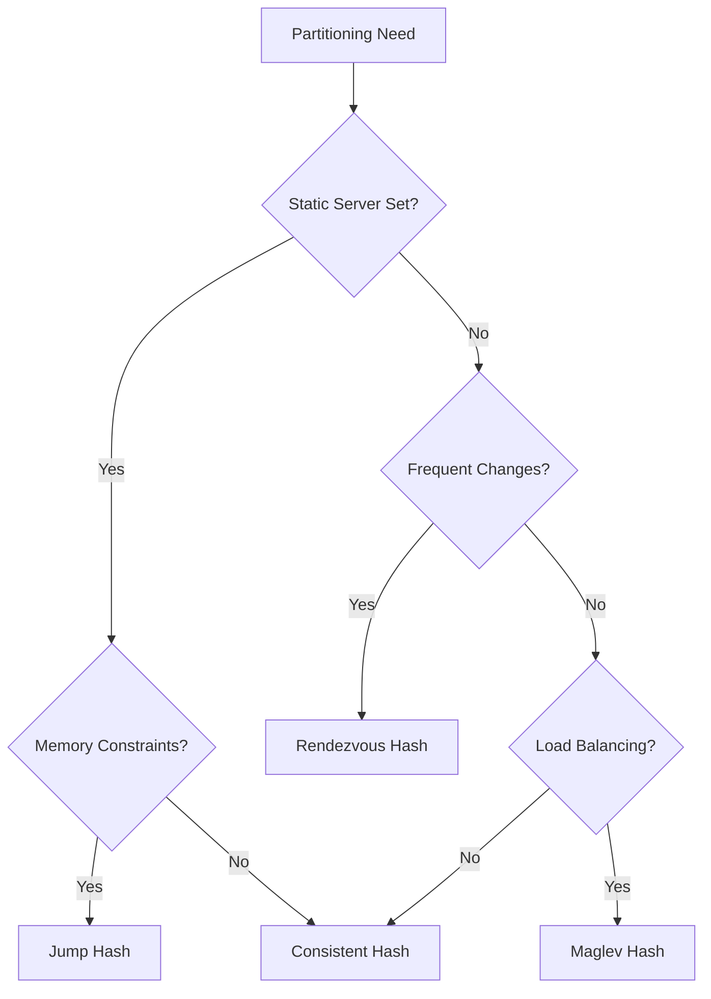

# Consistent Hashing & Partitioning 🔄

Master consistent hashing algorithms, data partitioning strategies, and distributed system load distribution.

## 📋 Core Topics

### Hashing Fundamentals

- **[Hash Functions](hash-functions.md)** - Properties of good hash functions
- **[Distribution Problems](distribution.md)** - Issues with simple hashing
- **[Ring-Based Hashing](ring-hashing.md)** - Circular hash space concept
- **[Virtual Nodes](virtual-nodes.md)** - Improving load distribution

### Consistent Hashing Algorithms

- **[Basic Consistent Hashing](basic.md)** - Original algorithm implementation
- **[Jump Consistent Hash](jump-hash.md)** - Google's optimized algorithm
- **[Rendezvous Hashing](rendezvous.md)** - Highest Random Weight hashing
- **[Maglev Hashing](maglev.md)** - Google's load balancer hashing

### Partitioning Strategies

- **[Range Partitioning](range.md)** - Dividing data by key ranges
- **[Hash Partitioning](hash-partition.md)** - Using hash functions for distribution
- **[Directory Partitioning](directory.md)** - Lookup service for data location
- **[Hybrid Approaches](hybrid.md)** - Combining multiple strategies

### Applications & Use Cases

- **[Database Sharding](sharding.md)** - Distributing database data
- **[Cache Distribution](cache-distribution.md)** - Consistent cache placement
- **[Load Balancer Backends](load-balancer.md)** - Server selection algorithms
- **[Distributed Storage](storage.md)** - Data placement in distributed systems

## 🔍 Quick Reference

### Hashing Algorithm Comparison

| Algorithm | Time Complexity | Space Complexity | Load Distribution | Use Case |
|-----------|----------------|------------------|-------------------|----------|
| **Simple Hash** | O(1) | O(1) | Poor | Single server |
| **Consistent Hash** | O(log N) | O(N) | Good | Distributed caching |
| **Jump Hash** | O(ln N) | O(1) | Excellent | Static server sets |
| **Rendezvous** | O(N) | O(1) | Excellent | Dynamic membership |
| **Maglev** | O(1) | O(N) | Excellent | Load balancing |

### Algorithm Selection Decision Tree



## 🛠️ Implementation Examples

### Basic Consistent Hashing

```python
import hashlib
import bisect
from typing import List, Dict, Any, Optional, Tuple
import json

class ConsistentHash:
    def __init__(self, nodes: List[str] = None, replicas: int = 150):
        """
        Initialize consistent hash ring
        
        Args:
            nodes: List of node identifiers
            replicas: Number of virtual nodes per physical node
        """
        self.replicas = replicas
        self.ring: Dict[int, str] = {}
        self.sorted_keys: List[int] = []
        self.nodes: set = set()
        
        if nodes:
            for node in nodes:
                self.add_node(node)
    
    def _hash(self, key: str) -> int:
        """Generate hash value for a key"""
        return int(hashlib.md5(key.encode('utf-8')).hexdigest(), 16)
    
    def add_node(self, node: str) -> None:
        """Add a new node to the hash ring"""
        if node in self.nodes:
            return
        
        self.nodes.add(node)
        
        # Add virtual nodes
        for i in range(self.replicas):
            virtual_key = f"{node}:{i}"
            hash_value = self._hash(virtual_key)
            
            self.ring[hash_value] = node
            bisect.insort(self.sorted_keys, hash_value)
    
    def remove_node(self, node: str) -> None:
        """Remove a node from the hash ring"""
        if node not in self.nodes:
            return
        
        self.nodes.remove(node)
        
        # Remove virtual nodes
        keys_to_remove = []
        for hash_value, ring_node in self.ring.items():
            if ring_node == node:
                keys_to_remove.append(hash_value)
        
        for key in keys_to_remove:
            del self.ring[key]
            self.sorted_keys.remove(key)
    
    def get_node(self, key: str) -> Optional[str]:
        """Get the node responsible for a key"""
        if not self.ring:
            return None
        
        hash_value = self._hash(key)
        
        # Find the first node >= hash_value
        idx = bisect.bisect_right(self.sorted_keys, hash_value)
        
        # Wrap around if we're at the end
        if idx == len(self.sorted_keys):
            idx = 0
        
        return self.ring[self.sorted_keys[idx]]
    
    def get_nodes(self, key: str, num_nodes: int) -> List[str]:
        """Get multiple nodes for a key (for replication)"""
        if not self.ring or num_nodes <= 0:
            return []
        
        hash_value = self._hash(key)
        nodes = []
        seen_nodes = set()
        
        # Start from the position of the key
        idx = bisect.bisect_right(self.sorted_keys, hash_value)
        
        # Collect unique nodes
        while len(nodes) < num_nodes and len(seen_nodes) < len(self.nodes):
            if idx >= len(self.sorted_keys):
                idx = 0
            
            node = self.ring[self.sorted_keys[idx]]
            if node not in seen_nodes:
                nodes.append(node)
                seen_nodes.add(node)
            
            idx += 1
        
        return nodes
    
    def get_node_distribution(self) -> Dict[str, int]:
        """Get distribution of virtual nodes per physical node"""
        distribution = {}
        for node in self.ring.values():
            distribution[node] = distribution.get(node, 0) + 1
        return distribution
    
    def get_load_distribution(self, keys: List[str]) -> Dict[str, int]:
        """Analyze load distribution for a set of keys"""
        distribution = {}
        for key in keys:
            node = self.get_node(key)
            if node:
                distribution[node] = distribution.get(node, 0) + 1
        return distribution
    
    def visualize_ring(self, max_keys: int = 10) -> str:
        """Create a text visualization of the ring"""
        if not self.ring:
            return "Empty ring"
        
        visualization = ["Consistent Hash Ring Visualization:"]
        visualization.append("=" * 40)
        
        shown_keys = 0
        for hash_value in self.sorted_keys:
            if shown_keys >= max_keys:
                visualization.append("... (truncated)")
                break
            
            node = self.ring[hash_value]
            visualization.append(f"Hash: {hash_value:>10} -> Node: {node}")
            shown_keys += 1
        
        return "\n".join(visualization)

# Advanced consistent hashing with weighted nodes
class WeightedConsistentHash(ConsistentHash):
    def __init__(self, nodes: List[Tuple[str, int]] = None, base_replicas: int = 150):
        """
        Weighted consistent hash where nodes can have different capacities
        
        Args:
            nodes: List of (node_id, weight) tuples
            base_replicas: Base number of replicas (multiplied by weight)
        """
        self.base_replicas = base_replicas
        self.weights: Dict[str, int] = {}
        super().__init__()
        
        if nodes:
            for node_id, weight in nodes:
                self.add_weighted_node(node_id, weight)
    
    def add_weighted_node(self, node: str, weight: int) -> None:
        """Add a weighted node to the ring"""
        if node in self.nodes:
            return
        
        self.weights[node] = weight
        self.nodes.add(node)
        
        # Calculate replicas based on weight
        replicas = self.base_replicas * weight
        
        # Add virtual nodes
        for i in range(replicas):
            virtual_key = f"{node}:{i}"
            hash_value = self._hash(virtual_key)
            
            self.ring[hash_value] = node
            bisect.insort(self.sorted_keys, hash_value)
    
    def remove_node(self, node: str) -> None:
        """Remove a weighted node from the ring"""
        super().remove_node(node)
        if node in self.weights:
            del self.weights[node]
    
    def get_weight_distribution(self) -> Dict[str, float]:
        """Get the percentage of ring space each node occupies"""
        total_replicas = sum(self.get_node_distribution().values())
        if total_replicas == 0:
            return {}
        
        distribution = {}
        for node, count in self.get_node_distribution().items():
            distribution[node] = (count / total_replicas) * 100
        
        return distribution

# Jump Consistent Hash implementation
class JumpConsistentHash:
    def __init__(self, num_buckets: int):
        """
        Initialize Jump Consistent Hash
        
        Args:
            num_buckets: Number of buckets (servers)
        """
        self.num_buckets = num_buckets
    
    def get_bucket(self, key: str) -> int:
        """
        Get bucket for a key using Jump Consistent Hash algorithm
        
        This is Google's jump consistent hash algorithm that provides
        excellent load distribution with minimal memory usage.
        """
        key_hash = self._hash(key)
        bucket = 0
        j = 1
        
        while j <= self.num_buckets:
            bucket = j - 1
            key_hash = ((key_hash * 2862933555777941757) + 1) & 0xFFFFFFFFFFFFFFFF
            j = int((bucket + 1) * (1 << 31) / ((key_hash >> 33) + 1)) + 1
        
        return bucket
    
    def _hash(self, key: str) -> int:
        """Generate 64-bit hash for key"""
        hash_bytes = hashlib.md5(key.encode()).digest()
        # Convert first 8 bytes to integer
        return int.from_bytes(hash_bytes[:8], byteorder='big', signed=False)
    
    def resize(self, new_num_buckets: int) -> Dict[int, List[str]]:
        """
        Simulate resizing and return which keys move between buckets
        
        Returns:
            Dictionary mapping new bucket -> list of keys that moved to it
        """
        if new_num_buckets == self.num_buckets:
            return {}
        
        # This is a simulation - in practice you'd need the actual key set
        moves = {}
        old_num_buckets = self.num_buckets
        self.num_buckets = new_num_buckets
        
        # Sample some keys to show movement pattern
        sample_keys = [f"key_{i}" for i in range(1000)]
        
        for key in sample_keys:
            # Calculate old and new buckets
            self.num_buckets = old_num_buckets
            old_bucket = self.get_bucket(key)
            
            self.num_buckets = new_num_buckets
            new_bucket = self.get_bucket(key)
            
            if old_bucket != new_bucket:
                if new_bucket not in moves:
                    moves[new_bucket] = []
                moves[new_bucket].append(key)
        
        return moves

# Rendezvous (Highest Random Weight) Hashing
class RendezvousHash:
    def __init__(self, nodes: List[str] = None):
        """
        Initialize Rendezvous Hash
        
        Args:
            nodes: List of node identifiers
        """
        self.nodes: List[str] = nodes or []
    
    def add_node(self, node: str) -> None:
        """Add a node"""
        if node not in self.nodes:
            self.nodes.append(node)
    
    def remove_node(self, node: str) -> None:
        """Remove a node"""
        if node in self.nodes:
            self.nodes.remove(node)
    
    def get_node(self, key: str) -> Optional[str]:
        """Get the node with highest weight for the key"""
        if not self.nodes:
            return None
        
        max_weight = -1
        selected_node = None
        
        for node in self.nodes:
            weight = self._weight(key, node)
            if weight > max_weight:
                max_weight = weight
                selected_node = node
        
        return selected_node
    
    def get_nodes(self, key: str, num_nodes: int) -> List[str]:
        """Get multiple nodes ordered by weight"""
        if not self.nodes or num_nodes <= 0:
            return []
        
        # Calculate weights for all nodes
        node_weights = []
        for node in self.nodes:
            weight = self._weight(key, node)
            node_weights.append((weight, node))
        
        # Sort by weight (descending) and return top N
        node_weights.sort(reverse=True)
        return [node for _, node in node_weights[:num_nodes]]
    
    def _weight(self, key: str, node: str) -> float:
        """Calculate weight for key-node pair"""
        combined = f"{key}:{node}"
        hash_value = hashlib.md5(combined.encode()).hexdigest()
        # Convert to float between 0 and 1
        return int(hash_value, 16) / (16 ** 32)

# Usage examples and performance testing
def performance_comparison():
    """Compare different hashing algorithms"""
    import time
    import random
    
    # Setup
    nodes = [f"server_{i}" for i in range(10)]
    keys = [f"key_{i}" for i in range(10000)]
    
    print("Performance Comparison of Hashing Algorithms")
    print("=" * 50)
    
    # Consistent Hash
    start_time = time.time()
    ch = ConsistentHash(nodes)
    
    for key in keys:
        ch.get_node(key)
    
    ch_time = time.time() - start_time
    print(f"Consistent Hash: {ch_time:.4f} seconds")
    
    # Jump Hash
    start_time = time.time()
    jh = JumpConsistentHash(len(nodes))
    
    for key in keys:
        jh.get_bucket(key)
    
    jh_time = time.time() - start_time
    print(f"Jump Hash: {jh_time:.4f} seconds")
    
    # Rendezvous Hash
    start_time = time.time()
    rh = RendezvousHash(nodes)
    
    for key in keys:
        rh.get_node(key)
    
    rh_time = time.time() - start_time
    print(f"Rendezvous Hash: {rh_time:.4f} seconds")
    
    # Load distribution analysis
    print("\nLoad Distribution Analysis:")
    print("-" * 30)
    
    ch_dist = ch.get_load_distribution(keys)
    print("Consistent Hash distribution:")
    for node, count in sorted(ch_dist.items()):
        print(f"  {node}: {count} keys ({count/len(keys)*100:.1f}%)")

def hash_ring_demo():
    """Demonstrate consistent hash ring behavior"""
    print("Consistent Hash Ring Demo")
    print("=" * 30)
    
    # Create ring with initial nodes
    ch = ConsistentHash(['server_A', 'server_B', 'server_C'])
    
    # Test key placement
    test_keys = ['user_123', 'user_456', 'user_789', 'user_abc']
    
    print("Initial key placement:")
    for key in test_keys:
        node = ch.get_node(key)
        print(f"  {key} -> {node}")
    
    print("\nAdding server_D...")
    ch.add_node('server_D')
    
    print("Key placement after adding server_D:")
    for key in test_keys:
        node = ch.get_node(key)
        print(f"  {key} -> {node}")
    
    print("\nRemoving server_B...")
    ch.remove_node('server_B')
    
    print("Key placement after removing server_B:")
    for key in test_keys:
        node = ch.get_node(key)
        print(f"  {key} -> {node}")
    
    # Show distribution
    print(f"\nVirtual node distribution: {ch.get_node_distribution()}")

if __name__ == "__main__":
    hash_ring_demo()
    print("\n" + "="*60 + "\n")
    performance_comparison()
```

### Distributed Cache with Consistent Hashing

```python
import asyncio
import aioredis
from typing import List, Dict, Any, Optional
import json
import time

class DistributedCache:
    def __init__(self, redis_nodes: List[str], replicas: int = 150):
        """
        Distributed cache using consistent hashing
        
        Args:
            redis_nodes: List of Redis connection strings
            replicas: Number of virtual nodes per Redis instance
        """
        self.redis_nodes = redis_nodes
        self.hash_ring = ConsistentHash(redis_nodes, replicas)
        self.connections: Dict[str, aioredis.Redis] = {}
        self.replication_factor = 2  # Store data on 2 nodes
    
    async def initialize(self):
        """Initialize Redis connections"""
        for node in self.redis_nodes:
            self.connections[node] = await aioredis.from_url(f"redis://{node}")
    
    async def get(self, key: str) -> Optional[Any]:
        """Get value from cache"""
        nodes = self.hash_ring.get_nodes(key, self.replication_factor)
        
        # Try each node until we find the data
        for node in nodes:
            try:
                redis_conn = self.connections[node]
                value = await redis_conn.get(key)
                
                if value:
                    return json.loads(value)
            except Exception as e:
                print(f"Error reading from {node}: {e}")
                continue
        
        return None
    
    async def set(self, key: str, value: Any, ttl: int = 3600) -> bool:
        """Set value in cache with replication"""
        nodes = self.hash_ring.get_nodes(key, self.replication_factor)
        serialized_value = json.dumps(value)
        
        success_count = 0
        
        # Write to all replica nodes
        for node in nodes:
            try:
                redis_conn = self.connections[node]
                await redis_conn.setex(key, ttl, serialized_value)
                success_count += 1
            except Exception as e:
                print(f"Error writing to {node}: {e}")
        
        # Consider successful if written to at least one node
        return success_count > 0
    
    async def delete(self, key: str) -> bool:
        """Delete key from all replica nodes"""
        nodes = self.hash_ring.get_nodes(key, self.replication_factor)
        success_count = 0
        
        for node in nodes:
            try:
                redis_conn = self.connections[node]
                deleted = await redis_conn.delete(key)
                if deleted:
                    success_count += 1
            except Exception as e:
                print(f"Error deleting from {node}: {e}")
        
        return success_count > 0
    
    async def add_node(self, node: str):
        """Add a new cache node"""
        if node not in self.redis_nodes:
            self.redis_nodes.append(node)
            self.hash_ring.add_node(node)
            self.connections[node] = await aioredis.from_url(f"redis://{node}")
            
            # In a real implementation, you'd need to redistribute data
            print(f"Added cache node: {node}")
    
    async def remove_node(self, node: str):
        """Remove a cache node"""
        if node in self.redis_nodes:
            self.redis_nodes.remove(node)
            self.hash_ring.remove_node(node)
            
            # Close connection
            if node in self.connections:
                await self.connections[node].close()
                del self.connections[node]
            
            print(f"Removed cache node: {node}")
    
    async def get_stats(self) -> Dict[str, Any]:
        """Get cache statistics"""
        stats = {
            'nodes': len(self.redis_nodes),
            'node_distribution': self.hash_ring.get_node_distribution(),
            'node_stats': {}
        }
        
        for node in self.redis_nodes:
            try:
                redis_conn = self.connections[node]
                info = await redis_conn.info('memory')
                stats['node_stats'][node] = {
                    'used_memory': info.get('used_memory', 0),
                    'used_memory_human': info.get('used_memory_human', '0B'),
                    'connected_clients': info.get('connected_clients', 0)
                }
            except Exception as e:
                stats['node_stats'][node] = {'error': str(e)}
        
        return stats
    
    async def close(self):
        """Close all connections"""
        for connection in self.connections.values():
            await connection.close()

# Database sharding with consistent hashing
class ShardedDatabase:
    def __init__(self, shard_configs: List[Dict[str, str]]):
        """
        Database sharding using consistent hashing
        
        Args:
            shard_configs: List of database configuration dictionaries
        """
        self.shard_configs = shard_configs
        self.shard_names = [config['name'] for config in shard_configs]
        self.hash_ring = ConsistentHash(self.shard_names)
        self.connections: Dict[str, Any] = {}  # DB connections
    
    def get_shard_for_key(self, key: str) -> str:
        """Get shard name for a given key"""
        return self.hash_ring.get_node(key)
    
    def get_shards_for_key(self, key: str, num_shards: int = 1) -> List[str]:
        """Get multiple shards for a key (for replication)"""
        return self.hash_ring.get_nodes(key, num_shards)
    
    async def execute_query(self, key: str, query: str, params: tuple = None):
        """Execute query on the appropriate shard"""
        shard = self.get_shard_for_key(key)
        connection = self.connections.get(shard)
        
        if not connection:
            raise Exception(f"No connection to shard {shard}")
        
        # Execute query (pseudo-code - adapt for your DB driver)
        # return await connection.execute(query, params)
        return f"Executed on shard {shard}: {query}"
    
    def add_shard(self, shard_config: Dict[str, str]):
        """Add a new shard"""
        shard_name = shard_config['name']
        
        if shard_name not in self.shard_names:
            self.shard_configs.append(shard_config)
            self.shard_names.append(shard_name)
            self.hash_ring.add_node(shard_name)
            
            # Initialize connection for new shard
            # self.connections[shard_name] = create_connection(shard_config)
            
            print(f"Added shard: {shard_name}")
            return self._calculate_data_migration(shard_name)
    
    def remove_shard(self, shard_name: str):
        """Remove a shard"""
        if shard_name in self.shard_names:
            # Calculate which data needs to be migrated
            migration_plan = self._calculate_data_migration_for_removal(shard_name)
            
            self.shard_names.remove(shard_name)
            self.hash_ring.remove_node(shard_name)
            
            # Close connection
            if shard_name in self.connections:
                # await self.connections[shard_name].close()
                del self.connections[shard_name]
            
            print(f"Removed shard: {shard_name}")
            return migration_plan
    
    def _calculate_data_migration(self, new_shard: str) -> Dict[str, Any]:
        """Calculate which data needs to be migrated to new shard"""
        # In practice, you'd analyze the current data distribution
        # and determine which keys should move to the new shard
        return {
            'new_shard': new_shard,
            'estimated_keys_to_migrate': 'TBD',
            'migration_strategy': 'gradual'
        }
    
    def _calculate_data_migration_for_removal(self, removed_shard: str) -> Dict[str, Any]:
        """Calculate data migration plan for shard removal"""
        return {
            'removed_shard': removed_shard,
            'data_redistribution': 'TBD',
            'backup_required': True
        }
    
    def get_shard_distribution(self, sample_keys: List[str]) -> Dict[str, int]:
        """Analyze data distribution across shards"""
        return self.hash_ring.get_load_distribution(sample_keys)

# Usage example
async def distributed_cache_demo():
    """Demonstrate distributed cache with consistent hashing"""
    # Setup distributed cache
    redis_nodes = ['localhost:6379', 'localhost:6380', 'localhost:6381']
    cache = DistributedCache(redis_nodes)
    
    try:
        await cache.initialize()
        
        # Store some data
        await cache.set('user:123', {'name': 'Alice', 'age': 30})
        await cache.set('user:456', {'name': 'Bob', 'age': 25})
        await cache.set('user:789', {'name': 'Charlie', 'age': 35})
        
        # Retrieve data
        user = await cache.get('user:123')
        print(f"Retrieved user: {user}")
        
        # Show which nodes store which keys
        for key in ['user:123', 'user:456', 'user:789']:
            nodes = cache.hash_ring.get_nodes(key, cache.replication_factor)
            print(f"Key {key} stored on nodes: {nodes}")
        
        # Add a new node
        await cache.add_node('localhost:6382')
        
        # Show new distribution
        print("\nAfter adding new node:")
        for key in ['user:123', 'user:456', 'user:789']:
            nodes = cache.hash_ring.get_nodes(key, cache.replication_factor)
            print(f"Key {key} now stored on nodes: {nodes}")
        
        # Get cache statistics
        stats = await cache.get_stats()
        print(f"\nCache stats: {stats}")
        
    finally:
        await cache.close()

if __name__ == "__main__":
    asyncio.run(distributed_cache_demo())
```

## 📊 Performance Analysis

### Load Distribution Metrics

```python
import matplotlib.pyplot as plt
import numpy as np
from collections import defaultdict

class HashingAnalyzer:
    def __init__(self):
        self.results = {}
    
    def analyze_distribution(self, hash_impl, keys: List[str], num_nodes: int) -> Dict[str, Any]:
        """Analyze load distribution for a hashing implementation"""
        distribution = defaultdict(int)
        
        # Count keys per node
        for key in keys:
            if hasattr(hash_impl, 'get_node'):
                node = hash_impl.get_node(key)
            else:  # Jump hash returns bucket number
                node = f"bucket_{hash_impl.get_bucket(key)}"
            
            if node:
                distribution[node] += 1
        
        # Calculate statistics
        counts = list(distribution.values())
        if not counts:
            return {}
        
        mean_load = np.mean(counts)
        std_load = np.std(counts)
        min_load = min(counts)
        max_load = max(counts)
        
        # Calculate load balance ratio (ideal is 1.0)
        expected_load = len(keys) / num_nodes
        load_balance = mean_load / expected_load if expected_load > 0 else 0
        
        return {
            'distribution': dict(distribution),
            'mean_load': mean_load,
            'std_deviation': std_load,
            'min_load': min_load,
            'max_load': max_load,
            'load_balance_ratio': load_balance,
            'coefficient_of_variation': std_load / mean_load if mean_load > 0 else 0
        }
    
    def simulate_node_failure(self, hash_impl, keys: List[str], failed_node: str) -> Dict[str, Any]:
        """Simulate node failure and measure key redistribution"""
        # Get original distribution
        original_mapping = {}
        for key in keys:
            original_mapping[key] = hash_impl.get_node(key)
        
        # Remove failed node
        hash_impl.remove_node(failed_node)
        
        # Get new distribution
        moved_keys = 0
        new_mapping = {}
        
        for key in keys:
            new_node = hash_impl.get_node(key)
            new_mapping[key] = new_node
            
            if original_mapping[key] != new_node:
                moved_keys += 1
        
        # Add node back for clean state
        hash_impl.add_node(failed_node)
        
        return {
            'total_keys': len(keys),
            'moved_keys': moved_keys,
            'movement_percentage': (moved_keys / len(keys)) * 100,
            'failed_node': failed_node
        }
    
    def compare_algorithms(self, keys: List[str], nodes: List[str]) -> Dict[str, Dict[str, Any]]:
        """Compare different hashing algorithms"""
        results = {}
        
        # Consistent Hash
        ch = ConsistentHash(nodes.copy())
        results['consistent_hash'] = self.analyze_distribution(ch, keys, len(nodes))
        
        # Jump Hash
        jh = JumpConsistentHash(len(nodes))
        results['jump_hash'] = self.analyze_distribution(jh, keys, len(nodes))
        
        # Rendezvous Hash
        rh = RendezvousHash(nodes.copy())
        results['rendezvous_hash'] = self.analyze_distribution(rh, keys, len(nodes))
        
        return results
    
    def plot_distribution(self, distribution: Dict[str, int], title: str):
        """Plot load distribution"""
        nodes = list(distribution.keys())
        loads = list(distribution.values())
        
        plt.figure(figsize=(10, 6))
        plt.bar(nodes, loads)
        plt.title(title)
        plt.xlabel('Nodes')
        plt.ylabel('Number of Keys')
        plt.xticks(rotation=45)
        plt.tight_layout()
        plt.show()

# Performance testing
def run_performance_tests():
    """Run comprehensive performance tests"""
    analyzer = HashingAnalyzer()
    
    # Generate test data
    nodes = [f"server_{i:02d}" for i in range(10)]
    keys = [f"key_{i:06d}" for i in range(100000)]
    
    print("Hashing Algorithm Comparison")
    print("=" * 50)
    
    # Compare algorithms
    results = analyzer.compare_algorithms(keys, nodes)
    
    for algo_name, stats in results.items():
        print(f"\n{algo_name.upper()}:")
        print(f"  Mean load: {stats['mean_load']:.1f}")
        print(f"  Std deviation: {stats['std_deviation']:.1f}")
        print(f"  Load balance ratio: {stats['load_balance_ratio']:.3f}")
        print(f"  Coefficient of variation: {stats['coefficient_of_variation']:.3f}")
    
    # Test node failure impact
    print("\nNode Failure Impact Analysis:")
    print("-" * 30)
    
    ch = ConsistentHash(nodes.copy())
    failure_impact = analyzer.simulate_node_failure(ch, keys[:10000], "server_05")
    
    print(f"Failed node: {failure_impact['failed_node']}")
    print(f"Keys moved: {failure_impact['moved_keys']}/{failure_impact['total_keys']}")
    print(f"Movement percentage: {failure_impact['movement_percentage']:.2f}%")

if __name__ == "__main__":
    run_performance_tests()
```

## 🎯 Best Practices

### Implementation Guidelines

- [ ] **Choose algorithm based on use case** - static vs dynamic node sets
- [ ] **Use appropriate number of virtual nodes** (100-300 per physical node)
- [ ] **Implement proper error handling** for node failures
- [ ] **Monitor load distribution** and rebalance if needed
- [ ] **Plan for data migration** when adding/removing nodes
- [ ] **Use consistent hash functions** (MD5, SHA-1) across all nodes
- [ ] **Implement health checks** for node availability
- [ ] **Consider data locality** for performance optimization

### Common Pitfalls to Avoid

❌ **Too few virtual nodes** - Poor load distribution
✅ **Use 100+ virtual nodes per physical node**

❌ **Ignoring hot keys** - Some keys get more traffic
✅ **Monitor key access patterns and implement load balancing**

❌ **No migration strategy** - Data inconsistency during topology changes
✅ **Plan and implement gradual data migration**

❌ **Poor hash function choice** - Clustering and poor distribution
✅ **Use cryptographic hash functions like MD5 or SHA-1**

## 🔗 Related Topics

- [Database Sharding](../databases/sharding.md) - Data partitioning strategies
- [Load Balancing](../load-balancing/index.md) - Server selection algorithms
- [Caching](../caching/index.md) - Distributed cache placement
- [Distributed Systems](../distributed-systems/index.md) - System architecture patterns
- [Scalability](../scalability/index.md) - Horizontal scaling strategies

## 📚 Additional Resources

- [Consistent Hashing Paper](https://www.cs.princeton.edu/courses/archive/fall09/cos518/papers/chash.pdf) - Original Karger et al. paper
- [Jump Consistent Hash](https://arxiv.org/abs/1406.2294) - Google's algorithm paper
- [Maglev Hashing](https://static.googleusercontent.com/media/research.google.com/en//pubs/archive/44824.pdf) - Google's load balancer paper
- [Rendezvous Hashing](https://en.wikipedia.org/wiki/Rendezvous_hashing) - HRW algorithm overview
