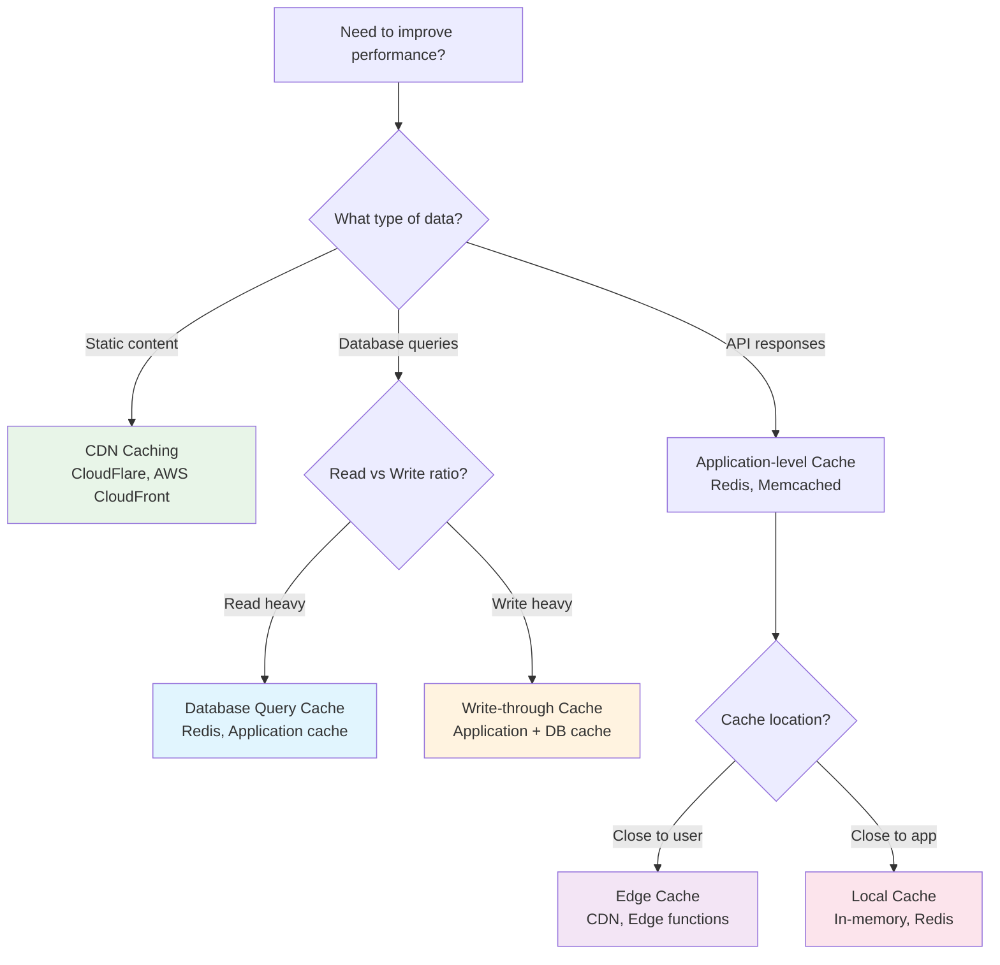
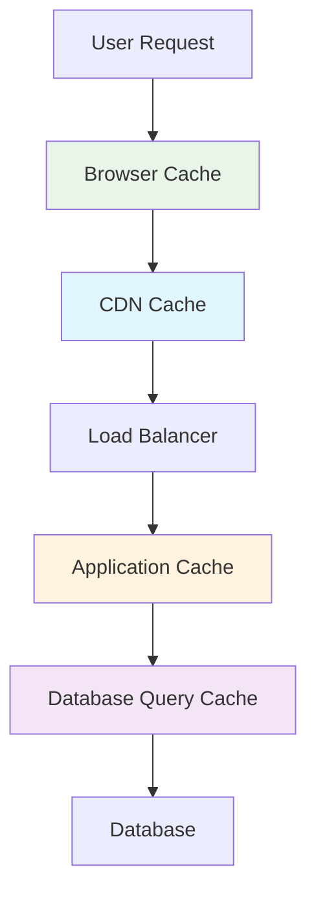

# Caching Strategies & Patterns ⚡

Accelerate your applications with effective caching strategies. Learn when, where, and how to implement caching for maximum performance gains.

## 🚀 Why Caching Matters

Caching is one of the most effective ways to improve application performance. A well-implemented cache can:

- **Reduce response times** from seconds to milliseconds
- **Decrease database load** by 80-90%
- **Improve user experience** with faster page loads
- **Lower infrastructure costs** by reducing resource usage

## 🎯 Caching Strategy Decision Tree



## 📊 Caching Patterns Comparison

### Cache-Aside (Lazy Loading)

!!! info "Most Common Pattern"
    Application manages both cache and database. Data is loaded into cache only when needed.

```python
def get_user(user_id):
    # Check cache first
    user = cache.get(f"user:{user_id}")
    if user is None:
        # Cache miss - load from database
        user = database.get_user(user_id)
        if user:
            # Store in cache for next time
            cache.set(f"user:{user_id}", user, ttl=3600)
    return user
```

**Pros**: Simple, only caches what's needed  
**Cons**: Cache miss penalty, complex cache management  
**Best for**: General-purpose caching, unpredictable access patterns

### Write-Through

!!! tip "Consistency First"
    Data is written to both cache and database simultaneously, ensuring consistency.

```python
def update_user(user_id, user_data):
    # Update database first
    database.update_user(user_id, user_data)
    # Update cache immediately
    cache.set(f"user:{user_id}", user_data, ttl=3600)
    return user_data
```

**Pros**: Strong consistency, cache always warm  
**Cons**: Write latency, unnecessary cache storage  
**Best for**: Read-heavy workloads, critical data consistency

### Write-Behind (Write-Back)

!!! warning "Performance Over Consistency"
    Data is written to cache immediately, database is updated asynchronously.

```python
async def update_user_async(user_id, user_data):
    # Update cache immediately
    cache.set(f"user:{user_id}", user_data, ttl=3600)
    
    # Queue database update for later
    await write_queue.put({
        'operation': 'update_user',
        'user_id': user_id,
        'data': user_data
    })
    
    return user_data
```

**Pros**: Low write latency, high throughput  
**Cons**: Risk of data loss, complex failure handling  
**Best for**: Write-heavy workloads, eventual consistency acceptable

### Refresh-Ahead

!!! success "Proactive Caching"
    Cache is refreshed before expiration based on access patterns and predictions.

```python
class RefreshAheadCache:
    def __init__(self, refresh_threshold=0.8):
        self.refresh_threshold = refresh_threshold
    
    def get_user(self, user_id):
        cache_data = cache.get_with_ttl(f"user:{user_id}")
        
        if cache_data is None:
            # Cache miss - load from database
            return self._load_and_cache(user_id)
        
        data, remaining_ttl, original_ttl = cache_data
        
        # Check if we should refresh proactively
        if remaining_ttl < (original_ttl * self.refresh_threshold):
            # Trigger background refresh
            self._schedule_refresh(user_id)
        
        return data
```

**Pros**: Minimal cache misses, predictable performance  
**Cons**: Complex implementation, resource overhead  
**Best for**: Predictable access patterns, high-traffic applications

## 🏗️ Cache Architecture Patterns

### Multi-Level Caching



**Layer Benefits:**
1. **Browser Cache** - Instant loading for repeat visits
2. **CDN Cache** - Fast global content delivery
3. **Application Cache** - Reduced database queries
4. **Database Cache** - Optimized query execution

### Cache Hierarchies

=== "Hot/Warm/Cold"

    **Hot Cache** (L1) - In-memory, ultra-fast access
    ```python
    # Local in-memory cache
    local_cache = {}
    
    def get_hot_data(key):
        if key in local_cache:
            return local_cache[key]
        return None
    ```

    **Warm Cache** (L2) - Redis/Memcached, fast network access
    ```python
    # Distributed cache
    import redis
    redis_client = redis.Redis()
    
    def get_warm_data(key):
        return redis_client.get(key)
    ```

    **Cold Storage** (L3) - Database, slower but persistent
    ```python
    # Database fallback
    def get_cold_data(key):
        return database.query(key)
    ```

=== "Geographic Distribution"

    **Edge Caches** - Close to users globally
    **Regional Caches** - Centralized per region  
    **Origin Cache** - Single source of truth

## 🛠️ Implementation Examples

### Redis Implementation

```python
import redis
import json
import time
from typing import Optional, Any

class RedisCache:
    def __init__(self, host='localhost', port=6379, db=0):
        self.client = redis.Redis(host=host, port=port, db=db)
        self.default_ttl = 3600  # 1 hour
    
    def get(self, key: str) -> Optional[Any]:
        """Get value from cache"""
        try:
            value = self.client.get(key)
            return json.loads(value) if value else None
        except (redis.RedisError, json.JSONDecodeError):
            return None
    
    def set(self, key: str, value: Any, ttl: int = None) -> bool:
        """Set value in cache with TTL"""
        try:
            ttl = ttl or self.default_ttl
            serialized = json.dumps(value)
            return self.client.setex(key, ttl, serialized)
        except (redis.RedisError, TypeError):
            return False
    
    def delete(self, key: str) -> bool:
        """Delete key from cache"""
        try:
            return bool(self.client.delete(key))
        except redis.RedisError:
            return False
    
    def get_or_set(self, key: str, fetch_func: callable, ttl: int = None) -> Any:
        """Get from cache or execute function and cache result"""
        value = self.get(key)
        if value is None:
            value = fetch_func()
            if value is not None:
                self.set(key, value, ttl)
        return value
```

### Cache Decorator

```python
from functools import wraps
import hashlib

def cached(ttl=3600, key_prefix=""):
    """Decorator to cache function results"""
    def decorator(func):
        @wraps(func)
        def wrapper(*args, **kwargs):
            # Generate cache key from function name and arguments
            key_data = f"{func.__name__}:{args}:{sorted(kwargs.items())}"
            cache_key = f"{key_prefix}:{hashlib.md5(key_data.encode()).hexdigest()}"
            
            # Try to get from cache
            result = cache.get(cache_key)
            if result is None:
                # Execute function and cache result
                result = func(*args, **kwargs)
                cache.set(cache_key, result, ttl)
            
            return result
        return wrapper
    return decorator

# Usage
@cached(ttl=1800, key_prefix="user_profile")
def get_user_profile(user_id):
    return database.get_user(user_id)
```

## 🎯 Cache Invalidation Strategies

### Time-Based Expiration (TTL)

```python
# Simple TTL
cache.set("user:123", user_data, ttl=3600)  # Expires in 1 hour

# Variable TTL based on data type
ttl_config = {
    'user_profile': 3600,      # 1 hour
    'product_info': 1800,      # 30 minutes
    'hot_data': 300,           # 5 minutes
    'static_content': 86400    # 24 hours
}
```

### Event-Based Invalidation

```python
class CacheInvalidator:
    def __init__(self, cache):
        self.cache = cache
        self.dependencies = {}
    
    def register_dependency(self, cache_key, dependency_key):
        """Register cache dependencies"""
        if dependency_key not in self.dependencies:
            self.dependencies[dependency_key] = set()
        self.dependencies[dependency_key].add(cache_key)
    
    def invalidate_dependent_caches(self, dependency_key):
        """Invalidate all caches dependent on a key"""
        if dependency_key in self.dependencies:
            for cache_key in self.dependencies[dependency_key]:
                self.cache.delete(cache_key)
            del self.dependencies[dependency_key]

# Usage
invalidator = CacheInvalidator(cache)

# When caching user profile, register dependencies
cache.set("user:123:profile", profile_data)
invalidator.register_dependency("user:123:profile", "user:123")

# When user data changes, invalidate all related caches
invalidator.invalidate_dependent_caches("user:123")
```

## 🔍 Monitoring & Optimization

### Cache Metrics to Track

```python
class CacheMetrics:
    def __init__(self):
        self.hits = 0
        self.misses = 0
        self.sets = 0
        self.deletes = 0
    
    @property
    def hit_rate(self):
        total = self.hits + self.misses
        return (self.hits / total) if total > 0 else 0
    
    @property
    def miss_rate(self):
        return 1 - self.hit_rate
    
    def record_hit(self):
        self.hits += 1
    
    def record_miss(self):
        self.misses += 1
```

### Performance Optimization Tips

1. **Monitor Hit Rates**
   - Target: 80%+ hit rate for most applications
   - Low hit rates indicate poor cache strategy

2. **Optimize Cache Keys**
   - Use consistent, predictable key patterns
   - Implement key namespacing for organization

3. **Right-Size Your Cache**
   - Monitor memory usage and eviction rates
   - Implement appropriate eviction policies (LRU, LFU)

4. **Batch Operations**
   - Use pipeline operations for multiple cache requests
   - Implement connection pooling for distributed caches

---

*Next: Explore [Data Modeling](../data-modeling.md) techniques to design efficient schemas, or learn about [Database Scaling](../scaling-data.md) patterns.*
