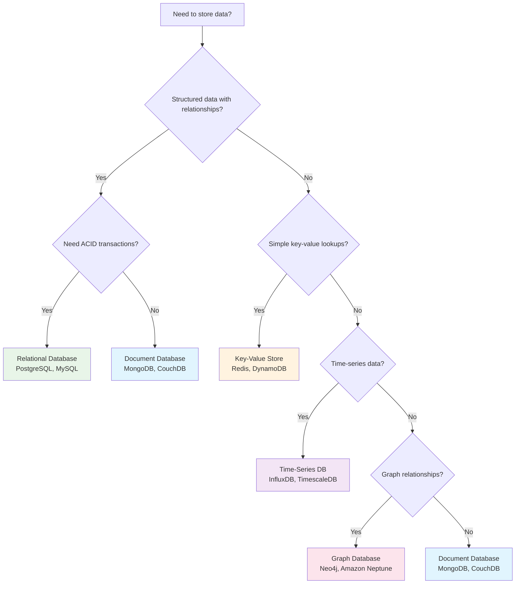
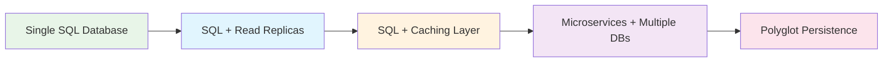

# Database Types & Selection 🗂️

Choose the right database for your use case by understanding the strengths and weaknesses of different database types.

## 🎯 The Database Decision Tree



## 📊 Database Types Comparison

### Relational Databases (SQL)

!!! success "When to Choose SQL Databases"
    - Complex queries with joins
    - ACID transaction requirements
    - Mature ecosystem and tooling
    - Well-defined schema

**Popular Options:**
- **PostgreSQL** - Feature-rich, extensible, great for complex queries
- **MySQL** - Fast, reliable, widely supported
- **SQLite** - Embedded, serverless, perfect for local storage

**Example Use Cases:**
- E-commerce platforms (inventory, orders)
- Financial systems (transactions, accounting)
- User management systems
- Any application requiring strong consistency

### Document Databases (NoSQL)

!!! info "When to Choose Document Databases"
    - Flexible, evolving schemas
    - Rapid prototyping and development
    - Hierarchical data structures
    - Horizontal scaling needs

**Popular Options:**
- **MongoDB** - Rich query language, mature ecosystem
- **CouchDB** - Multi-master replication, offline-first
- **Amazon DocumentDB** - MongoDB-compatible, fully managed

**Example Use Cases:**
- Content management systems
- User profiles and preferences
- Product catalogs
- Real-time analytics

### Key-Value Stores

!!! tip "When to Choose Key-Value Stores"
    - Simple data access patterns
    - High performance requirements
    - Caching and session storage
    - Massive scale scenarios

**Popular Options:**
- **Redis** - In-memory, rich data types, pub/sub
- **Amazon DynamoDB** - Fully managed, serverless
- **Memcached** - Simple, distributed caching

**Example Use Cases:**
- Session storage
- Caching layers
- Real-time recommendations
- Leaderboards and counters

### Graph Databases

!!! warning "When to Choose Graph Databases"
    - Complex relationships between entities
    - Social network analysis
    - Recommendation engines
    - Fraud detection

**Popular Options:**
- **Neo4j** - ACID compliant, Cypher query language
- **Amazon Neptune** - Fully managed, supports multiple graph models
- **ArangoDB** - Multi-model (document, graph, key-value)

**Example Use Cases:**
- Social networks
- Recommendation systems
- Fraud detection
- Knowledge graphs

## 🔄 Migration Strategies

### Database Evolution Path



### When to Consider Migration

1. **Performance Issues**
   - Slow queries despite optimization
   - High read/write load
   - Storage limitations

2. **Scalability Constraints**
   - Vertical scaling limits reached
   - Need horizontal scaling
   - Geographic distribution requirements

3. **Schema Flexibility**
   - Frequent schema changes
   - Complex data structures
   - Rapid development cycles

## 🛠️ Implementation Examples

### PostgreSQL Setup

```sql
-- Create a scalable user profile table
CREATE TABLE user_profiles (
    id SERIAL PRIMARY KEY,
    username VARCHAR(50) UNIQUE NOT NULL,
    email VARCHAR(100) UNIQUE NOT NULL,
    profile_data JSONB,
    created_at TIMESTAMP DEFAULT CURRENT_TIMESTAMP,
    updated_at TIMESTAMP DEFAULT CURRENT_TIMESTAMP
);

-- Add indexes for performance
CREATE INDEX idx_user_profiles_username ON user_profiles(username);
CREATE INDEX idx_user_profiles_email ON user_profiles(email);
CREATE INDEX idx_user_profiles_profile_data ON user_profiles USING GIN(profile_data);
```

### MongoDB Document Structure

```javascript
// Flexible user profile document
{
  "_id": ObjectId("..."),
  "username": "johndoe",
  "email": "john@example.com",
  "profile": {
    "firstName": "John",
    "lastName": "Doe",
    "preferences": {
      "theme": "dark",
      "notifications": true,
      "language": "en"
    },
    "social": {
      "twitter": "@johndoe",
      "linkedin": "john-doe"
    }
  },
  "tags": ["developer", "javascript", "mongodb"],
  "createdAt": ISODate("2023-01-01T00:00:00Z"),
  "updatedAt": ISODate("2023-01-01T00:00:00Z")
}
```

### Redis Caching Pattern

```python
import redis
import json
from datetime import timedelta

class UserProfileCache:
    def __init__(self):
        self.redis_client = redis.Redis(host='localhost', port=6379, db=0)
        self.cache_ttl = timedelta(hours=1)
    
    def get_user_profile(self, user_id):
        # Try cache first
        cached_profile = self.redis_client.get(f"user:{user_id}")
        if cached_profile:
            return json.loads(cached_profile)
        
        # Cache miss - get from database
        profile = self.fetch_from_database(user_id)
        if profile:
            # Cache the result
            self.redis_client.setex(
                f"user:{user_id}",
                self.cache_ttl,
                json.dumps(profile)
            )
        return profile
    
    def invalidate_user_profile(self, user_id):
        self.redis_client.delete(f"user:{user_id}")
```

## 🎯 Best Practices

### Database Selection Checklist

- [ ] **Data Structure**: Understand your data model requirements
- [ ] **Access Patterns**: Identify read/write patterns and query types
- [ ] **Scalability**: Consider current and future scale requirements
- [ ] **Consistency**: Determine consistency requirements (ACID vs eventual)
- [ ] **Performance**: Evaluate latency and throughput needs
- [ ] **Operational**: Consider backup, monitoring, and maintenance needs
- [ ] **Cost**: Factor in licensing, hosting, and operational costs
- [ ] **Team Expertise**: Assess team familiarity with the technology

### Common Pitfalls to Avoid

1. **Over-engineering Early** - Start simple, evolve as needed
2. **Ignoring Access Patterns** - Design for how you'll query the data
3. **Neglecting Indexing** - Plan indexes for performance from day one
4. **Forgetting Backups** - Implement backup strategy before you need it
5. **Ignoring Monitoring** - Set up observability from the beginning

---

*Next: Learn about [Caching Strategies](../caching/index.md) to optimize your database performance, or explore [Data Modeling](data-modeling.md) for schema design best practices.*
