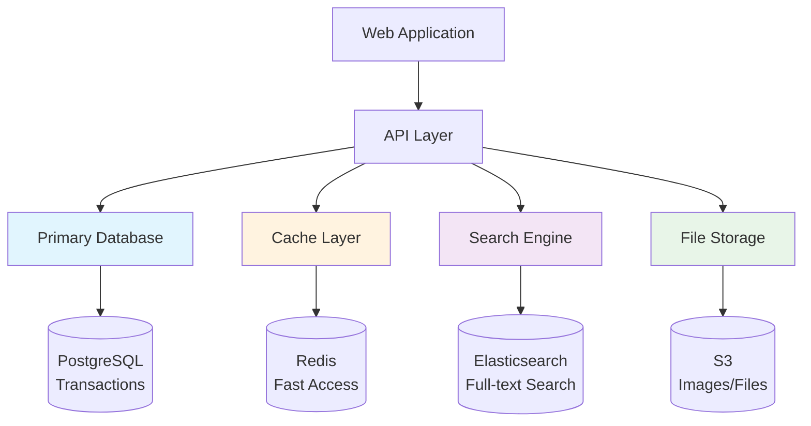
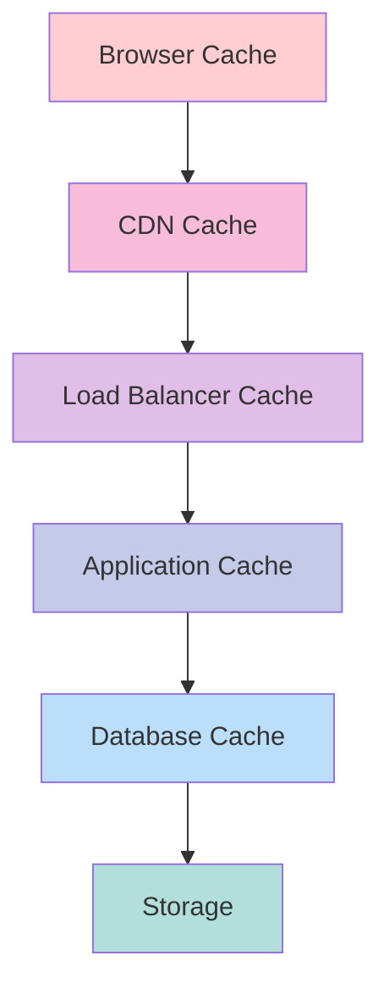

# Data Storage & Management 💾

Understanding how to store, retrieve, and manage data effectively is crucial for building scalable systems. This section introduces you to databases, caching strategies, and data modeling patterns.

## 🎯 What You'll Learn

Data is the heart of every application. Choosing the right storage solution and designing effective data access patterns can make the difference between a system that scales gracefully and one that collapses under load.

<div class="grid cards" markdown>

- :material-database: **Database Types**

    ---

    SQL vs NoSQL, when to use each, and understanding their trade-offs

    [Choose the right DB →](databases.md)

- :material-lightning-bolt: **Caching Strategies**

    ---

    Redis, Memcached, CDNs, and cache invalidation patterns

    [Speed up access →](caching.md)

- :material-sitemap: **Data Modeling**

    ---

    Schema design, normalization, denormalization, and data relationships

    [Structure your data →](modeling.md)

- :material-backup-restore: **Data Patterns**

    ---

    Replication, sharding, partitioning, and backup strategies

    [Scale data layer →](patterns.md)

</div>

## 🚀 Introduction to Data Storage

### Why Data Storage Design Matters

Your choice of data storage technology and architecture patterns directly impacts:

- **Performance**: How fast users can access and modify data
- **Scalability**: How many users and how much data you can handle
- **Consistency**: Whether all users see the same data at the same time
- **Availability**: How often your system is accessible to users
- **Cost**: Infrastructure and operational expenses

!!! tip "Data Storage Golden Rules"
    
    1. **Know your access patterns** - Read-heavy vs write-heavy workloads need different solutions
    2. **Start simple** - Begin with proven technologies before exploring exotic options
    3. **Plan for growth** - Design with 10x current scale in mind
    4. **Cache intelligently** - Use caching to reduce database load and improve performance
    5. **Backup everything** - Data loss is often unrecoverable and business-critical

### The Data Storage Landscape

Modern applications typically use multiple storage technologies, each optimized for specific use cases:



## 📊 Database Types Overview

### SQL Databases (RDBMS)

**Best for**: Structured data, complex queries, transactions, data integrity

| Database | Strengths | Use Cases | Scale Limit |
|----------|-----------|-----------|-------------|
| **PostgreSQL** | Full SQL, JSON support, extensible | Web apps, analytics | ~10TB single node |
| **MySQL** | Mature, wide adoption, good performance | Web apps, content management | ~5TB single node |
| **SQLite** | Embedded, zero-config, file-based | Mobile apps, prototypes | ~1TB single file |

**Characteristics**:

- ✅ ACID transactions guarantee data consistency
- ✅ Complex joins and aggregations
- ✅ Mature tooling and expertise
- ❌ Vertical scaling limitations
- ❌ Schema changes can be expensive

### NoSQL Databases

**Best for**: Flexible schema, horizontal scaling, specific data patterns

=== "Document Stores"

    **Examples**: MongoDB, CouchDB
    
    **Best for**: JSON-like data, content management, user profiles
    
    ```json
    {
      "userId": "123",
      "name": "John Doe",
      "preferences": {
        "theme": "dark",
        "notifications": true
      },
      "tags": ["premium", "early-adopter"]
    }
    ```
    
    ✅ **Pros**: Flexible schema, natural JSON mapping, easy to start
    ❌ **Cons**: Limited joins, eventual consistency

=== "Key-Value Stores"

    **Examples**: Redis, DynamoDB, Riak
    
    **Best for**: Caching, session storage, simple lookups
    
    ```
    Key: user:123:session
    Value: {"sessionId": "abc", "expires": 1640995200}
    ```
    
    ✅ **Pros**: Extremely fast, simple API, horizontal scaling
    ❌ **Cons**: No complex queries, basic data relationships

=== "Column Family"

    **Examples**: Cassandra, HBase
    
    **Best for**: Time-series data, analytics, heavy write workloads
    
    ```
    Row Key: user:123
    Columns: name, email, created_at, last_login
    ```
    
    ✅ **Pros**: Excellent write performance, handles big data
    ❌ **Cons**: Complex data modeling, eventual consistency

=== "Graph Databases"

    **Examples**: Neo4j, Amazon Neptune
    
    **Best for**: Social networks, recommendation engines, fraud detection
    
    ```
    (User)-[FOLLOWS]->(User)
    (User)-[LIKES]->(Post)
    ```
    
    ✅ **Pros**: Natural relationship modeling, powerful traversals
    ❌ **Cons**: Learning curve, specialized use cases

## 🏎️ Caching Fundamentals

Caching is one of the most effective ways to improve system performance. Here's when and how to use different caching patterns:

### Cache Levels



### Common Caching Patterns

| Pattern | When to Use | Example |
|---------|-------------|---------|
| **Cache-Aside** | Application controls cache | User profiles, product catalogs |
| **Write-Through** | Write to cache and DB simultaneously | Financial transactions |
| **Write-Behind** | Write to cache first, DB later | Social media posts, logs |
| **Refresh-Ahead** | Proactively refresh before expiry | Popular content, trending data |

### Cache Selection Guide

| Technology | Best For | TTL | Persistence |
|------------|----------|-----|-------------|
| **Redis** | Complex data structures, pub/sub | Configurable | Optional |
| **Memcached** | Simple key-value, high throughput | Fixed | In-memory only |
| **CDN** | Static content, global distribution | Long | Edge servers |
| **Application Cache** | In-process data, fastest access | Short | Process memory |

## 🎓 Learning Path

### Week 1: Database Fundamentals

**Goals**: Understand different database types and their trade-offs

- [ ] Learn SQL basics and relational concepts
- [ ] Explore NoSQL database types and use cases
- [ ] Practice choosing the right database for different scenarios

**Hands-on Exercise**:
Design data storage for a blog platform:
- User accounts and profiles
- Blog posts and comments
- Tags and categories
- View counts and analytics

### Week 2: Caching Strategies

**Goals**: Master caching patterns and implementation

- [ ] Set up Redis locally and experiment with data types
- [ ] Implement cache-aside pattern in a simple application
- [ ] Learn about cache invalidation strategies

**Hands-on Exercise**:
Add caching to your blog platform:
- Cache popular posts for 1 hour
- Cache user sessions for 30 minutes
- Implement cache invalidation when posts are updated

### Week 3: Data Modeling & Patterns

**Goals**: Design schemas that scale and perform well

- [ ] Learn normalization and denormalization trade-offs
- [ ] Understand data partitioning and sharding
- [ ] Explore read replicas and master-slave patterns

**Hands-on Exercise**:
Scale your blog platform data layer:
- Design for 1 million users
- Plan for read-heavy workload (10:1 read/write ratio)
- Consider geographic distribution

## 🔍 Real-World Scenarios

### Scenario 1: E-commerce Product Catalog

**Requirements**:
- 10 million products
- Complex search and filtering
- High read traffic during sales
- Product updates several times per day

**Storage Strategy**:
- **Primary DB**: PostgreSQL for transactions and inventory
- **Search**: Elasticsearch for product discovery
- **Cache**: Redis for product details and search results
- **CDN**: Static product images and descriptions

### Scenario 2: Social Media Feed

**Requirements**:
- 100 million users
- Real-time post updates
- Complex friend relationships
- Analytics on user behavior

**Storage Strategy**:
- **Primary DB**: PostgreSQL for user accounts and relationships
- **Posts**: MongoDB for flexible post content
- **Cache**: Redis for feeds and trending content
- **Analytics**: Column store for time-series data

### Scenario 3: IoT Data Collection

**Requirements**:
- 1 million devices sending data every minute
- Time-series analysis and reporting
- Data retention for 2 years
- Real-time alerting

**Storage Strategy**:
- **Stream Processing**: Kafka for real-time ingestion
- **Time-series DB**: InfluxDB for sensor data
- **Cache**: Redis for real-time alerts
- **Analytics**: Data warehouse for historical analysis

## 🔗 What's Next?

After mastering data storage fundamentals, explore these related areas:

- **[Scalability Patterns](../scalability/index.md)** - Learn advanced techniques for scaling data layer
- **[Distributed Systems](../distributed-systems/index.md)** - Understand data consistency in distributed environments
- **[Performance Optimization](../performance/index.md)** - Master query optimization and indexing strategies

---

*Remember: Data is your application's most valuable asset. Choose storage technologies based on your specific access patterns, consistency requirements, and scale needs.*
