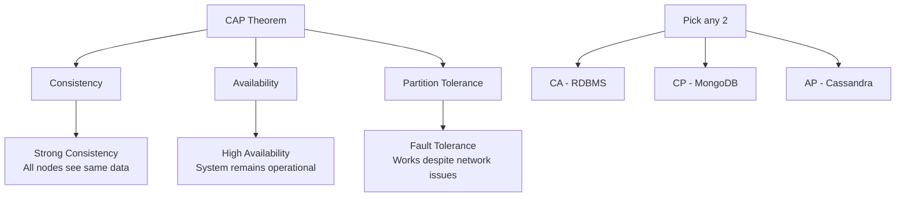

# System Design

Master the art of designing scalable, reliable, and maintainable distributed systems.

## Overview

System design is crucial for building applications that can handle growth, remain available, and perform well under various conditions.

<div class="grid cards" markdown>

-   :material-foundation: **Fundamentals**
    
    ---
    
    Core principles, scalability, and reliability concepts
    
    [Learn basics →](fundamentals.md)

-   :material-chart-line-stacked: **Scalability**
    
    ---
    
    Horizontal vs vertical scaling, load balancing
    
    [Scale up →](scalability.md)

-   :material-database: **Databases**
    
    ---
    
    SQL vs NoSQL, sharding, replication, consistency
    
    [Data storage →](databases.md)

-   :material-hexagon-multiple: **Microservices**
    
    ---
    
    Service-oriented architecture and distributed systems
    
    [Go distributed →](microservices.md)

</div>

## Key Concepts

### System Design Principles

!!! info "Core Principles"
    
    - **Scalability**: Handle increased load gracefully
    - **Reliability**: Continue working despite failures
    - **Availability**: Remain operational and accessible
    - **Consistency**: Data remains accurate across the system
    - **Partition Tolerance**: Function despite network failures

### CAP Theorem



## Architecture Patterns

### Microservices Architecture

```python
# Example: API Gateway pattern with Flask
from flask import Flask, jsonify, request
import requests

app = Flask(__name__)

# Service discovery
SERVICES = {
    'user': 'http://user-service:5000',
    'order': 'http://order-service:5001',
    'payment': 'http://payment-service:5002'
}

@app.route('/api/<service>/<path:endpoint>')
def gateway(service, endpoint):
    if service not in SERVICES:
        return jsonify({'error': 'Service not found'}), 404
    
    service_url = f"{SERVICES[service]}/{endpoint}"
    
    # Forward request to appropriate service
    if request.method == 'GET':
        response = requests.get(service_url, params=request.args)
    elif request.method == 'POST':
        response = requests.post(service_url, json=request.json)
    
    return jsonify(response.json()), response.status_code

if __name__ == '__main__':
    app.run(host='0.0.0.0', port=8080)
```

### Load Balancing Strategies

| Strategy | Description | Use Case |
|----------|-------------|----------|
| Round Robin | Requests distributed evenly | Uniform server capacity |
| Weighted Round Robin | Based on server capacity | Heterogeneous servers |
| Least Connections | Route to server with fewest active connections | Varying request duration |
| IP Hash | Based on client IP | Session affinity needed |

## System Design Process

### 1. Requirements Gathering

!!! question "Questions to Ask"
    
    - What is the scale? (users, requests, data)
    - What are the performance requirements?
    - What are the availability requirements?
    - What are the consistency requirements?
    - What is the budget/timeline?

### 2. Capacity Estimation

```python
# Example: Twitter-like system capacity estimation

# Assumptions
daily_active_users = 150_000_000
tweets_per_user_per_day = 2
read_write_ratio = 100  # 100 reads per write

# Write operations
writes_per_day = daily_active_users * tweets_per_user_per_day
writes_per_second = writes_per_day / (24 * 60 * 60)

# Read operations  
reads_per_second = writes_per_second * read_write_ratio

# Storage estimation
avg_tweet_size = 280  # characters
storage_per_day = writes_per_day * avg_tweet_size
storage_per_year = storage_per_day * 365

print(f"Writes per second: {writes_per_second:,.0f}")
print(f"Reads per second: {reads_per_second:,.0f}")
print(f"Storage per year: {storage_per_year / (1024**3):,.1f} GB")
```

### 3. High-Level Design

Basic components and their interactions:

- **Load Balancer**: Distribute incoming requests
- **Application Servers**: Business logic processing
- **Database**: Data persistence and retrieval
- **Cache**: Fast data access
- **CDN**: Static content delivery
- **Message Queue**: Asynchronous processing

### 4. Detailed Design

Deep dive into specific components:

- Database schema design
- API design
- Caching strategy
- Security considerations
- Monitoring and logging

## Common Patterns

### Database Patterns

- **Master-Slave Replication**: Read scaling
- **Master-Master Replication**: Write scaling  
- **Sharding**: Horizontal partitioning
- **Federation**: Split databases by function
- **Denormalization**: Optimize for reads

### Caching Patterns

- **Cache-Aside**: Application manages cache
- **Write-Through**: Write to cache and database
- **Write-Behind**: Write to cache, async to database
- **Refresh-Ahead**: Proactively refresh cache

## Tools and Technologies

### Infrastructure
- **Cloud Providers**: AWS, GCP, Azure
- **Containers**: Docker, Kubernetes
- **Service Mesh**: Istio, Linkerd
- **Monitoring**: Prometheus, Grafana, ELK Stack

### Databases
- **SQL**: PostgreSQL, MySQL
- **NoSQL**: MongoDB, Cassandra, DynamoDB
- **Cache**: Redis, Memcached
- **Search**: Elasticsearch, Solr

### Message Queues
- **Apache Kafka**: High-throughput streaming
- **RabbitMQ**: Traditional message broker
- **Amazon SQS**: Managed queue service
- **Apache Pulsar**: Next-gen messaging

## Case Studies

### Design a URL Shortener (like bit.ly)

**Requirements**: 
- Shorten long URLs
- Redirect to original URL
- Handle 100M URLs/day
- 100:1 read/write ratio

**Solution**:
- Base62 encoding for short URLs
- NoSQL database for storage
- Redis cache for popular URLs  
- CDN for global distribution

---

*Design for scale, plan for failure! 🏗️*
