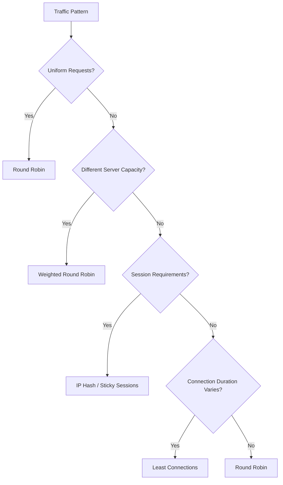

# Load Balancing & Traffic Distribution ⚖️

Master load balancing strategies, algorithms, and implementations for distributed systems.

## 📋 Core Topics

### Load Balancing Types

- **[Layer 4 Load Balancing](layer4.md)** - Transport layer load balancing (TCP/UDP)
- **[Layer 7 Load Balancing](layer7.md)** - Application layer load balancing (HTTP/HTTPS)
- **[DNS Load Balancing](dns.md)** - Geographic and round-robin DNS routing
- **[Client-Side Load Balancing](client-side.md)** - Service discovery and client routing

### Load Balancing Algorithms

- **[Round Robin](round-robin.md)** - Simple sequential distribution
- **[Weighted Round Robin](weighted-round-robin.md)** - Capacity-based distribution
- **[Least Connections](least-connections.md)** - Connection-based routing
- **[IP Hash](ip-hash.md)** - Session affinity through hashing

### Advanced Strategies

- **[Health Checks](health-checks.md)** - Monitoring backend health
- **[Session Affinity](session-affinity.md)** - Sticky sessions implementation
- **[Geographic Routing](geographic.md)** - Location-based traffic routing
- **[Auto Scaling](auto-scaling.md)** - Dynamic capacity management

## 🔍 Quick Reference

### Load Balancer Comparison

| Type | Layer | Protocols | Performance | Features | Use Case |
|------|-------|-----------|-------------|----------|----------|
| **HAProxy** | L4/L7 | HTTP, TCP, UDP | Very High | Advanced routing | High-traffic web apps |
| **Nginx** | L7 | HTTP, HTTPS | High | Reverse proxy + LB | Web applications |
| **AWS ALB** | L7 | HTTP, HTTPS | High | Auto-scaling, WAF | Cloud-native apps |
| **AWS NLB** | L4 | TCP, UDP, TLS | Ultra High | Static IPs | Low-latency apps |
| **F5 BigIP** | L4/L7 | All | Very High | Enterprise features | Large enterprises |

### Algorithm Selection Guide



## 🛠️ Implementation Examples

### Simple Load Balancer Implementation

```python
import asyncio
import aiohttp
import random
from typing import List, Dict, Any
from enum import Enum
import time

class LoadBalancingAlgorithm(Enum):
    ROUND_ROBIN = "round_robin"
    WEIGHTED_ROUND_ROBIN = "weighted_round_robin"
    LEAST_CONNECTIONS = "least_connections"
    IP_HASH = "ip_hash"
    RANDOM = "random"

class Backend:
    def __init__(self, host: str, port: int, weight: int = 1):
        self.host = host
        self.port = port
        self.weight = weight
        self.url = f"http://{host}:{port}"
        self.active_connections = 0
        self.total_requests = 0
        self.healthy = True
        self.last_health_check = time.time()
    
    async def handle_request(self):
        """Simulate handling a request"""
        self.active_connections += 1
        self.total_requests += 1
        try:
            # Simulate request processing
            await asyncio.sleep(random.uniform(0.1, 0.5))
        finally:
            self.active_connections -= 1

class LoadBalancer:
    def __init__(self, algorithm: LoadBalancingAlgorithm = LoadBalancingAlgorithm.ROUND_ROBIN):
        self.backends: List[Backend] = []
        self.algorithm = algorithm
        self.current_index = 0
        self.weighted_list = []
        
    def add_backend(self, backend: Backend):
        """Add a backend server"""
        self.backends.append(backend)
        self._update_weighted_list()
    
    def remove_backend(self, backend: Backend):
        """Remove a backend server"""
        if backend in self.backends:
            self.backends.remove(backend)
            self._update_weighted_list()
    
    def _update_weighted_list(self):
        """Update weighted list for weighted round robin"""
        self.weighted_list = []
        for backend in self.backends:
            if backend.healthy:
                self.weighted_list.extend([backend] * backend.weight)
    
    def get_backend(self, client_ip: str = None) -> Backend:
        """Get next backend based on algorithm"""
        healthy_backends = [b for b in self.backends if b.healthy]
        
        if not healthy_backends:
            raise Exception("No healthy backends available")
        
        if self.algorithm == LoadBalancingAlgorithm.ROUND_ROBIN:
            return self._round_robin(healthy_backends)
        elif self.algorithm == LoadBalancingAlgorithm.WEIGHTED_ROUND_ROBIN:
            return self._weighted_round_robin()
        elif self.algorithm == LoadBalancingAlgorithm.LEAST_CONNECTIONS:
            return self._least_connections(healthy_backends)
        elif self.algorithm == LoadBalancingAlgorithm.IP_HASH:
            return self._ip_hash(healthy_backends, client_ip)
        elif self.algorithm == LoadBalancingAlgorithm.RANDOM:
            return random.choice(healthy_backends)
    
    def _round_robin(self, backends: List[Backend]) -> Backend:
        """Round robin algorithm"""
        backend = backends[self.current_index % len(backends)]
        self.current_index += 1
        return backend
    
    def _weighted_round_robin(self) -> Backend:
        """Weighted round robin algorithm"""
        if not self.weighted_list:
            self._update_weighted_list()
        
        if not self.weighted_list:
            raise Exception("No healthy backends available")
        
        backend = self.weighted_list[self.current_index % len(self.weighted_list)]
        self.current_index += 1
        return backend
    
    def _least_connections(self, backends: List[Backend]) -> Backend:
        """Least connections algorithm"""
        return min(backends, key=lambda b: b.active_connections)
    
    def _ip_hash(self, backends: List[Backend], client_ip: str) -> Backend:
        """IP hash algorithm for session affinity"""
        if not client_ip:
            return self._round_robin(backends)
        
        hash_value = hash(client_ip)
        return backends[hash_value % len(backends)]

# Usage example
async def main():
    # Create load balancer
    lb = LoadBalancer(LoadBalancingAlgorithm.WEIGHTED_ROUND_ROBIN)
    
    # Add backend servers
    lb.add_backend(Backend("192.168.1.10", 8080, weight=3))
    lb.add_backend(Backend("192.168.1.11", 8080, weight=2))
    lb.add_backend(Backend("192.168.1.12", 8080, weight=1))
    
    # Simulate requests
    for i in range(10):
        backend = lb.get_backend(f"192.168.1.{100 + i % 5}")
        print(f"Request {i+1} -> {backend.url}")
        await backend.handle_request()
```

### Health Check Implementation

```python
import aiohttp
import asyncio
from typing import Dict, Any
import logging

class HealthChecker:
    def __init__(self, check_interval: int = 30, timeout: int = 5):
        self.check_interval = check_interval
        self.timeout = timeout
        self.running = False
        
    async def start_health_checks(self, backends: List[Backend]):
        """Start periodic health checks"""
        self.running = True
        while self.running:
            await self._check_all_backends(backends)
            await asyncio.sleep(self.check_interval)
    
    async def _check_all_backends(self, backends: List[Backend]):
        """Check health of all backends"""
        tasks = [self._check_backend_health(backend) for backend in backends]
        await asyncio.gather(*tasks, return_exceptions=True)
    
    async def _check_backend_health(self, backend: Backend):
        """Check individual backend health"""
        try:
            timeout = aiohttp.ClientTimeout(total=self.timeout)
            async with aiohttp.ClientSession(timeout=timeout) as session:
                async with session.get(f"{backend.url}/health") as response:
                    if response.status == 200:
                        if not backend.healthy:
                            logging.info(f"Backend {backend.url} is now healthy")
                        backend.healthy = True
                    else:
                        backend.healthy = False
                        logging.warning(f"Backend {backend.url} health check failed: {response.status}")
        except Exception as e:
            if backend.healthy:
                logging.error(f"Backend {backend.url} health check failed: {e}")
            backend.healthy = False
        
        backend.last_health_check = time.time()
    
    def stop(self):
        """Stop health checks"""
        self.running = False
```

### Advanced Load Balancer with Circuit Breaker

```python
from enum import Enum
import time

class CircuitState(Enum):
    CLOSED = "closed"
    OPEN = "open"
    HALF_OPEN = "half_open"

class CircuitBreaker:
    def __init__(self, failure_threshold: int = 5, timeout: int = 60):
        self.failure_threshold = failure_threshold
        self.timeout = timeout
        self.failure_count = 0
        self.last_failure_time = None
        self.state = CircuitState.CLOSED
    
    def can_execute(self) -> bool:
        """Check if request can be executed"""
        if self.state == CircuitState.CLOSED:
            return True
        elif self.state == CircuitState.OPEN:
            if time.time() - self.last_failure_time >= self.timeout:
                self.state = CircuitState.HALF_OPEN
                return True
            return False
        else:  # HALF_OPEN
            return True
    
    def record_success(self):
        """Record successful execution"""
        self.failure_count = 0
        self.state = CircuitState.CLOSED
    
    def record_failure(self):
        """Record failed execution"""
        self.failure_count += 1
        self.last_failure_time = time.time()
        
        if self.failure_count >= self.failure_threshold:
            self.state = CircuitState.OPEN

class EnhancedBackend(Backend):
    def __init__(self, *args, **kwargs):
        super().__init__(*args, **kwargs)
        self.circuit_breaker = CircuitBreaker()
        self.response_times = []
        self.error_rate = 0.0
    
    def record_response_time(self, response_time: float):
        """Record response time for monitoring"""
        self.response_times.append(response_time)
        # Keep only last 100 measurements
        if len(self.response_times) > 100:
            self.response_times.pop(0)
    
    @property
    def average_response_time(self) -> float:
        """Calculate average response time"""
        if not self.response_times:
            return 0.0
        return sum(self.response_times) / len(self.response_times)

class SmartLoadBalancer(LoadBalancer):
    def __init__(self, *args, **kwargs):
        super().__init__(*args, **kwargs)
        self.health_checker = HealthChecker()
    
    def get_backend(self, client_ip: str = None) -> Backend:
        """Enhanced backend selection with circuit breaker"""
        available_backends = [
            b for b in self.backends 
            if b.healthy and b.circuit_breaker.can_execute()
        ]
        
        if not available_backends:
            # Fallback to any healthy backend
            available_backends = [b for b in self.backends if b.healthy]
            
        if not available_backends:
            raise Exception("No available backends")
        
        # Use original algorithm for selection
        return super().get_backend(client_ip)
    
    async def proxy_request(self, request_data: Dict[str, Any], client_ip: str = None):
        """Proxy request with monitoring and circuit breaking"""
        backend = self.get_backend(client_ip)
        start_time = time.time()
        
        try:
            # Simulate request forwarding
            await backend.handle_request()
            
            # Record success
            response_time = time.time() - start_time
            backend.record_response_time(response_time)
            backend.circuit_breaker.record_success()
            
            return {"status": "success", "backend": backend.url}
            
        except Exception as e:
            # Record failure
            backend.circuit_breaker.record_failure()
            raise e
```

## 📊 Monitoring and Metrics

### Load Balancer Metrics

```python
class LoadBalancerMetrics:
    def __init__(self):
        self.total_requests = 0
        self.successful_requests = 0
        self.failed_requests = 0
        self.backend_stats = {}
        
    def record_request(self, backend: Backend, success: bool, response_time: float):
        """Record request metrics"""
        self.total_requests += 1
        
        if success:
            self.successful_requests += 1
        else:
            self.failed_requests += 1
        
        # Backend-specific metrics
        if backend.url not in self.backend_stats:
            self.backend_stats[backend.url] = {
                'requests': 0,
                'successes': 0,
                'failures': 0,
                'response_times': []
            }
        
        stats = self.backend_stats[backend.url]
        stats['requests'] += 1
        if success:
            stats['successes'] += 1
        else:
            stats['failures'] += 1
        stats['response_times'].append(response_time)
    
    @property
    def success_rate(self) -> float:
        """Calculate overall success rate"""
        if self.total_requests == 0:
            return 1.0
        return self.successful_requests / self.total_requests
    
    def get_backend_metrics(self) -> Dict[str, Any]:
        """Get detailed backend metrics"""
        metrics = {}
        for backend_url, stats in self.backend_stats.items():
            avg_response_time = (
                sum(stats['response_times']) / len(stats['response_times'])
                if stats['response_times'] else 0
            )
            metrics[backend_url] = {
                'total_requests': stats['requests'],
                'success_rate': stats['successes'] / stats['requests'] if stats['requests'] > 0 else 0,
                'average_response_time': avg_response_time,
                'current_connections': 0  # Would be tracked separately
            }
        return metrics
```

## 🎯 Best Practices

### Configuration Guidelines

- [ ] **Choose appropriate algorithm** based on traffic patterns
- [ ] **Implement comprehensive health checks** with multiple endpoints
- [ ] **Set proper timeouts** for backend connections
- [ ] **Enable session affinity** only when necessary
- [ ] **Monitor backend performance** continuously
- [ ] **Implement graceful degradation** for backend failures
- [ ] **Use SSL termination** at load balancer level
- [ ] **Configure rate limiting** to prevent abuse

### High Availability Setup

```yaml
# HAProxy Configuration Example
global
    log stdout local0
    chroot /var/lib/haproxy
    stats socket /run/haproxy/admin.sock mode 660 level admin
    
defaults
    mode http
    timeout connect 5000ms
    timeout client 50000ms
    timeout server 50000ms
    option httplog
    
frontend web_frontend
    bind *:80
    bind *:443 ssl crt /path/to/certificate.pem
    redirect scheme https if !{ ssl_fc }
    default_backend web_servers
    
backend web_servers
    balance roundrobin
    option httpchk GET /health
    server web1 192.168.1.10:8080 check weight 3
    server web2 192.168.1.11:8080 check weight 2
    server web3 192.168.1.12:8080 check weight 1 backup
    
listen stats
    bind *:8404
    stats enable
    stats uri /stats
    stats refresh 5s
```

## 🔗 Related Topics

- [Scalability Patterns](../scalability/index.md) - Horizontal scaling strategies
- [Service Discovery](../networking/service-discovery.md) - Dynamic backend registration
- [API Gateway](../networking/api-gateway.md) - Advanced routing and policies
- [CDN](../networking/cdn.md) - Global content distribution
- [Auto Scaling](../scalability/auto-scaling.md) - Dynamic capacity management

## 📚 Additional Resources

- [HAProxy Documentation](http://docs.haproxy.org/) - Comprehensive load balancer guide
- [Nginx Load Balancing](https://docs.nginx.com/nginx/admin-guide/load-balancer/) - Nginx LB configuration
- [AWS Load Balancing](https://aws.amazon.com/elasticloadbalancing/) - Cloud load balancing options
- [Load Balancing Algorithms](https://kemptechnologies.com/load-balancer/load-balancing-algorithms-techniques/) - Algorithm deep dive
