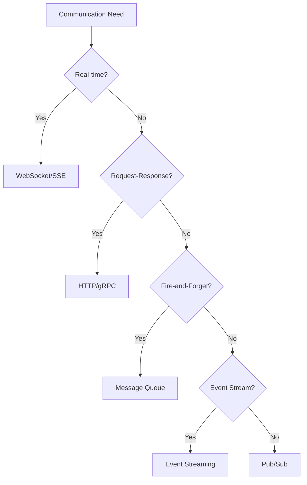

# Message Queues & Async Communication 📮

Master asynchronous communication patterns, message queues, and event-driven architectures.

## 📋 Core Topics

### Message Queue Fundamentals

- **[Queue Types](queue-types.md)** - Point-to-point vs publish-subscribe patterns
- **[Message Patterns](patterns.md)** - Producer-consumer, request-reply, scatter-gather
- **[Delivery Guarantees](delivery.md)** - At-most-once, at-least-once, exactly-once
- **[Queue Management](management.md)** - Queue sizing, overflow handling, TTL

### Popular Message Brokers

- **[Apache Kafka](kafka.md)** - Distributed streaming platform
- **[RabbitMQ](rabbitmq.md)** - Feature-rich AMQP broker
- **[Apache Pulsar](pulsar.md)** - Cloud-native messaging system
- **[Amazon SQS](sqs.md)** - Managed queue service
- **[Redis Pub/Sub](redis-pubsub.md)** - Lightweight messaging with Redis

### Advanced Patterns

- **[Event Sourcing](event-sourcing.md)** - State as sequence of events
- **[CQRS](cqrs.md)** - Command Query Responsibility Segregation
- **[Saga Pattern](saga.md)** - Distributed transaction management
- **[Event-Driven Architecture](event-driven.md)** - Reactive system design

### Integration Patterns

- **[Dead Letter Queues](dlq.md)** - Error handling and retry mechanisms
- **[Fan-out/Fan-in](fan-patterns.md)** - Message distribution patterns
- **[Message Routing](routing.md)** - Content-based and header-based routing
- **[Batch Processing](batch.md)** - Bulk message processing strategies

## 🔍 Quick Reference

### Message Broker Comparison

| Broker | Throughput | Latency | Durability | Ordering | Use Case |
|--------|------------|---------|------------|----------|----------|
| **Kafka** | Very High | Medium | High | Partition-level | Event streaming, logs |
| **RabbitMQ** | High | Low | High | Per queue | Complex routing |
| **Pulsar** | Very High | Low | High | Per partition | Multi-tenant streaming |
| **Redis** | Very High | Very Low | Medium | No guarantee | Real-time notifications |
| **SQS** | High | Medium | High | FIFO queues | AWS ecosystem |

### Message Pattern Decision Tree



## 🛠️ Implementation Examples

### Kafka Producer and Consumer

```python
from kafka import KafkaProducer, KafkaConsumer
from kafka.errors import KafkaError
import json
import logging
from typing import Dict, Any, Callable, List
import asyncio
from datetime import datetime

class KafkaMessageProducer:
    def __init__(self, bootstrap_servers: List[str], **config):
        self.config = {
            'bootstrap_servers': bootstrap_servers,
            'value_serializer': lambda v: json.dumps(v).encode('utf-8'),
            'key_serializer': lambda k: k.encode('utf-8') if k else None,
            'acks': 'all',  # Wait for all replicas
            'retries': 3,
            'retry_backoff_ms': 1000,
            'request_timeout_ms': 30000,
            **config
        }
        self.producer = KafkaProducer(**self.config)
        
    def send_message(self, topic: str, message: Dict[str, Any], key: str = None) -> bool:
        """Send message to Kafka topic"""
        try:
            # Add metadata
            enhanced_message = {
                **message,
                'timestamp': datetime.utcnow().isoformat(),
                'producer_id': 'python-producer'
            }
            
            future = self.producer.send(topic, value=enhanced_message, key=key)
            record_metadata = future.get(timeout=10)
            
            logging.info(f"Message sent to {record_metadata.topic} "
                        f"partition {record_metadata.partition} "
                        f"offset {record_metadata.offset}")
            return True
            
        except KafkaError as e:
            logging.error(f"Failed to send message: {e}")
            return False
    
    def send_batch(self, topic: str, messages: List[Dict[str, Any]]) -> int:
        """Send multiple messages in batch"""
        successful_sends = 0
        
        for message in messages:
            if self.send_message(topic, message):
                successful_sends += 1
        
        # Flush to ensure all messages are sent
        self.producer.flush()
        return successful_sends
    
    def close(self):
        """Close producer and flush remaining messages"""
        self.producer.flush()
        self.producer.close()

class KafkaMessageConsumer:
    def __init__(self, topics: List[str], group_id: str, bootstrap_servers: List[str], **config):
        self.topics = topics
        self.config = {
            'bootstrap_servers': bootstrap_servers,
            'group_id': group_id,
            'value_deserializer': lambda m: json.loads(m.decode('utf-8')),
            'key_deserializer': lambda k: k.decode('utf-8') if k else None,
            'auto_offset_reset': 'latest',
            'enable_auto_commit': True,
            'auto_commit_interval_ms': 1000,
            **config
        }
        self.consumer = KafkaConsumer(*topics, **self.config)
        self.message_handlers: Dict[str, Callable] = {}
        self.running = False
        
    def register_handler(self, message_type: str, handler: Callable):
        """Register message handler for specific message type"""
        self.message_handlers[message_type] = handler
    
    async def start_consuming(self):
        """Start consuming messages"""
        self.running = True
        logging.info(f"Starting consumer for topics: {self.topics}")
        
        try:
            while self.running:
                message_batch = self.consumer.poll(timeout_ms=1000, max_records=100)
                
                for topic_partition, messages in message_batch.items():
                    for message in messages:
                        await self._process_message(message)
                        
        except Exception as e:
            logging.error(f"Consumer error: {e}")
        finally:
            self.consumer.close()
    
    async def _process_message(self, message):
        """Process individual message"""
        try:
            message_data = message.value
            message_type = message_data.get('type')
            
            # Route to appropriate handler
            if message_type and message_type in self.message_handlers:
                handler = self.message_handlers[message_type]
                await self._safe_execute_handler(handler, message_data, message)
            else:
                logging.warning(f"No handler for message type: {message_type}")
                
        except Exception as e:
            logging.error(f"Failed to process message: {e}")
            # Could implement dead letter queue here
    
    async def _safe_execute_handler(self, handler: Callable, message_data: Dict, raw_message):
        """Safely execute message handler with error handling"""
        try:
            if asyncio.iscoroutinefunction(handler):
                await handler(message_data, raw_message)
            else:
                handler(message_data, raw_message)
        except Exception as e:
            logging.error(f"Handler error for message {raw_message.offset}: {e}")
            # Implement retry logic or dead letter queue
    
    def stop(self):
        """Stop consuming messages"""
        self.running = False

# Usage example
async def main():
    # Producer example
    producer = KafkaMessageProducer(['localhost:9092'])
    
    # Send user events
    user_event = {
        'type': 'user_signup',
        'user_id': 12345,
        'email': 'user@example.com',
        'source': 'web'
    }
    producer.send_message('user-events', user_event, key='user_12345')
    
    # Consumer example
    consumer = KafkaMessageConsumer(
        topics=['user-events', 'order-events'],
        group_id='event-processor',
        bootstrap_servers=['localhost:9092']
    )
    
    # Register message handlers
    async def handle_user_signup(message_data, raw_message):
        user_id = message_data['user_id']
        email = message_data['email']
        print(f"Processing signup for user {user_id}: {email}")
        
        # Simulate processing
        await asyncio.sleep(0.1)
        
        # Send welcome email, create user profile, etc.
    
    async def handle_order_created(message_data, raw_message):
        order_id = message_data['order_id']
        print(f"Processing order {order_id}")
        
        # Process order, update inventory, send notifications
    
    consumer.register_handler('user_signup', handle_user_signup)
    consumer.register_handler('order_created', handle_order_created)
    
    # Start consuming
    await consumer.start_consuming()
```

### RabbitMQ Implementation with Routing

```python
import pika
import json
import logging
from typing import Dict, Any, Callable
import asyncio
from datetime import datetime

class RabbitMQProducer:
    def __init__(self, connection_url: str = 'amqp://localhost'):
        self.connection_url = connection_url
        self.connection = None
        self.channel = None
        
    def connect(self):
        """Establish connection to RabbitMQ"""
        try:
            self.connection = pika.BlockingConnection(
                pika.URLParameters(self.connection_url)
            )
            self.channel = self.connection.channel()
            
            # Declare exchanges
            self.channel.exchange_declare(
                exchange='events',
                exchange_type='topic',
                durable=True
            )
            
            logging.info("Connected to RabbitMQ")
            
        except Exception as e:
            logging.error(f"Failed to connect to RabbitMQ: {e}")
            raise
    
    def publish_message(self, 
                       routing_key: str, 
                       message: Dict[str, Any],
                       exchange: str = 'events',
                       persistent: bool = True):
        """Publish message to exchange"""
        if not self.channel:
            self.connect()
        
        try:
            # Enhance message with metadata
            enhanced_message = {
                **message,
                'timestamp': datetime.utcnow().isoformat(),
                'routing_key': routing_key
            }
            
            properties = pika.BasicProperties(
                delivery_mode=2 if persistent else 1,  # Persistent or transient
                content_type='application/json',
                timestamp=int(datetime.utcnow().timestamp())
            )
            
            self.channel.basic_publish(
                exchange=exchange,
                routing_key=routing_key,
                body=json.dumps(enhanced_message),
                properties=properties
            )
            
            logging.info(f"Message published to {exchange} with routing key {routing_key}")
            
        except Exception as e:
            logging.error(f"Failed to publish message: {e}")
            raise
    
    def close(self):
        """Close connection"""
        if self.connection and not self.connection.is_closed:
            self.connection.close()

class RabbitMQConsumer:
    def __init__(self, connection_url: str = 'amqp://localhost'):
        self.connection_url = connection_url
        self.connection = None
        self.channel = None
        self.message_handlers: Dict[str, Callable] = {}
        
    def connect(self):
        """Establish connection to RabbitMQ"""
        try:
            self.connection = pika.BlockingConnection(
                pika.URLParameters(self.connection_url)
            )
            self.channel = self.connection.channel()
            
            # Declare exchanges
            self.channel.exchange_declare(
                exchange='events',
                exchange_type='topic',
                durable=True
            )
            
            logging.info("Consumer connected to RabbitMQ")
            
        except Exception as e:
            logging.error(f"Failed to connect to RabbitMQ: {e}")
            raise
    
    def setup_queue(self, queue_name: str, routing_keys: list, exchange: str = 'events'):
        """Setup queue and bind to routing keys"""
        if not self.channel:
            self.connect()
        
        # Declare queue
        self.channel.queue_declare(queue=queue_name, durable=True)
        
        # Bind queue to routing keys
        for routing_key in routing_keys:
            self.channel.queue_bind(
                exchange=exchange,
                queue=queue_name,
                routing_key=routing_key
            )
        
        logging.info(f"Queue {queue_name} bound to routing keys: {routing_keys}")
    
    def register_handler(self, message_type: str, handler: Callable):
        """Register message handler"""
        self.message_handlers[message_type] = handler
    
    def start_consuming(self, queue_name: str, auto_ack: bool = False):
        """Start consuming messages from queue"""
        if not self.channel:
            self.connect()
        
        # Set QoS to process one message at a time
        self.channel.basic_qos(prefetch_count=1)
        
        def callback(ch, method, properties, body):
            try:
                message_data = json.loads(body.decode('utf-8'))
                message_type = message_data.get('type')
                
                # Route to appropriate handler
                if message_type and message_type in self.message_handlers:
                    handler = self.message_handlers[message_type]
                    
                    try:
                        handler(message_data, method, properties)
                        
                        # Acknowledge message if not auto-ack
                        if not auto_ack:
                            ch.basic_ack(delivery_tag=method.delivery_tag)
                            
                    except Exception as e:
                        logging.error(f"Handler error: {e}")
                        
                        # Reject and requeue message
                        if not auto_ack:
                            ch.basic_nack(
                                delivery_tag=method.delivery_tag,
                                requeue=True
                            )
                else:
                    logging.warning(f"No handler for message type: {message_type}")
                    if not auto_ack:
                        ch.basic_ack(delivery_tag=method.delivery_tag)
                        
            except Exception as e:
                logging.error(f"Failed to process message: {e}")
                if not auto_ack:
                    ch.basic_nack(delivery_tag=method.delivery_tag, requeue=False)
        
        self.channel.basic_consume(
            queue=queue_name,
            on_message_callback=callback,
            auto_ack=auto_ack
        )
        
        logging.info(f"Starting to consume from queue: {queue_name}")
        self.channel.start_consuming()
    
    def stop_consuming(self):
        """Stop consuming messages"""
        if self.channel:
            self.channel.stop_consuming()
    
    def close(self):
        """Close connection"""
        if self.connection and not self.connection.is_closed:
            self.connection.close()

# Dead Letter Queue implementation
class DeadLetterQueueManager:
    def __init__(self, connection_url: str = 'amqp://localhost'):
        self.connection_url = connection_url
        self.connection = None
        self.channel = None
    
    def connect(self):
        if not self.connection:
            self.connection = pika.BlockingConnection(
                pika.URLParameters(self.connection_url)
            )
            self.channel = self.connection.channel()
    
    def setup_dlq(self, main_queue: str, max_retries: int = 3):
        """Setup dead letter queue for main queue"""
        self.connect()
        
        dlq_name = f"{main_queue}.dlq"
        retry_queue = f"{main_queue}.retry"
        
        # Declare DLQ
        self.channel.queue_declare(queue=dlq_name, durable=True)
        
        # Declare retry queue with TTL
        self.channel.queue_declare(
            queue=retry_queue,
            durable=True,
            arguments={
                'x-message-ttl': 30000,  # 30 seconds TTL
                'x-dead-letter-exchange': '',
                'x-dead-letter-routing-key': main_queue
            }
        )
        
        # Declare main queue with DLQ
        self.channel.queue_declare(
            queue=main_queue,
            durable=True,
            arguments={
                'x-dead-letter-exchange': '',
                'x-dead-letter-routing-key': dlq_name
            }
        )
        
        logging.info(f"DLQ setup complete for {main_queue}")

# Usage example
def usage_example():
    # Producer
    producer = RabbitMQProducer()
    producer.connect()
    
    # Publish different types of events
    producer.publish_message(
        'user.signup',
        {
            'type': 'user_signup',
            'user_id': 12345,
            'email': 'user@example.com'
        }
    )
    
    producer.publish_message(
        'order.created',
        {
            'type': 'order_created',
            'order_id': 'ORD-001',
            'user_id': 12345,
            'total': 99.99
        }
    )
    
    # Consumer
    consumer = RabbitMQConsumer()
    consumer.connect()
    
    # Setup queues
    consumer.setup_queue('user-service', ['user.*'])
    consumer.setup_queue('order-service', ['order.*'])
    consumer.setup_queue('notification-service', ['user.signup', 'order.created'])
    
    # Register handlers
    def handle_user_signup(message_data, method, properties):
        print(f"Processing user signup: {message_data['user_id']}")
        # Process signup logic
    
    def handle_order_created(message_data, method, properties):
        print(f"Processing order: {message_data['order_id']}")
        # Process order logic
    
    consumer.register_handler('user_signup', handle_user_signup)
    consumer.register_handler('order_created', handle_order_created)
    
    # Start consuming
    consumer.start_consuming('notification-service')
```

### Event Sourcing Implementation

```python
import uuid
from typing import List, Dict, Any, Optional
from datetime import datetime
from dataclasses import dataclass, asdict
import json

@dataclass
class Event:
    """Base event class"""
    event_id: str
    event_type: str
    aggregate_id: str
    aggregate_version: int
    timestamp: datetime
    data: Dict[str, Any]
    
    def to_dict(self) -> Dict[str, Any]:
        return {
            **asdict(self),
            'timestamp': self.timestamp.isoformat()
        }
    
    @classmethod
    def from_dict(cls, data: Dict[str, Any]) -> 'Event':
        return cls(
            event_id=data['event_id'],
            event_type=data['event_type'],
            aggregate_id=data['aggregate_id'],
            aggregate_version=data['aggregate_version'],
            timestamp=datetime.fromisoformat(data['timestamp']),
            data=data['data']
        )

class EventStore:
    """Simple in-memory event store"""
    
    def __init__(self):
        self.events: List[Event] = []
        self.snapshots: Dict[str, Dict[str, Any]] = {}
    
    def append_events(self, aggregate_id: str, events: List[Event], expected_version: int):
        """Append events to the store"""
        current_version = self.get_current_version(aggregate_id)
        
        if current_version != expected_version:
            raise Exception(f"Concurrency conflict: expected {expected_version}, got {current_version}")
        
        for i, event in enumerate(events):
            event.aggregate_version = current_version + i + 1
            self.events.append(event)
    
    def get_events(self, aggregate_id: str, from_version: int = 0) -> List[Event]:
        """Get events for an aggregate"""
        return [
            event for event in self.events
            if event.aggregate_id == aggregate_id and event.aggregate_version > from_version
        ]
    
    def get_current_version(self, aggregate_id: str) -> int:
        """Get current version of aggregate"""
        events = [e for e in self.events if e.aggregate_id == aggregate_id]
        return max([e.aggregate_version for e in events], default=0)
    
    def save_snapshot(self, aggregate_id: str, version: int, state: Dict[str, Any]):
        """Save aggregate snapshot"""
        self.snapshots[aggregate_id] = {
            'version': version,
            'state': state,
            'timestamp': datetime.utcnow().isoformat()
        }
    
    def get_snapshot(self, aggregate_id: str) -> Optional[Dict[str, Any]]:
        """Get latest snapshot for aggregate"""
        return self.snapshots.get(aggregate_id)

class AggregateRoot:
    """Base aggregate root class"""
    
    def __init__(self, aggregate_id: str):
        self.aggregate_id = aggregate_id
        self.version = 0
        self.uncommitted_events: List[Event] = []
    
    def apply_event(self, event: Event):
        """Apply event to aggregate"""
        self.version = event.aggregate_version
        self._handle_event(event)
    
    def _handle_event(self, event: Event):
        """Override in subclasses to handle specific events"""
        pass
    
    def raise_event(self, event_type: str, data: Dict[str, Any]):
        """Raise a new event"""
        event = Event(
            event_id=str(uuid.uuid4()),
            event_type=event_type,
            aggregate_id=self.aggregate_id,
            aggregate_version=0,  # Will be set when appending to store
            timestamp=datetime.utcnow(),
            data=data
        )
        
        self.uncommitted_events.append(event)
        self._handle_event(event)
    
    def get_uncommitted_events(self) -> List[Event]:
        """Get events that haven't been persisted"""
        return self.uncommitted_events.copy()
    
    def mark_events_as_committed(self):
        """Mark events as committed"""
        self.uncommitted_events.clear()

# Example aggregate implementation
class UserAccount(AggregateRoot):
    def __init__(self, aggregate_id: str):
        super().__init__(aggregate_id)
        self.email = None
        self.is_active = False
        self.balance = 0.0
        self.created_at = None
    
    def create_account(self, email: str):
        """Create new user account"""
        if self.created_at:
            raise Exception("Account already exists")
        
        self.raise_event('account_created', {
            'email': email,
            'created_at': datetime.utcnow().isoformat()
        })
    
    def activate_account(self):
        """Activate user account"""
        if not self.created_at:
            raise Exception("Account does not exist")
        
        if self.is_active:
            raise Exception("Account is already active")
        
        self.raise_event('account_activated', {})
    
    def deposit_funds(self, amount: float):
        """Deposit funds to account"""
        if amount <= 0:
            raise Exception("Amount must be positive")
        
        self.raise_event('funds_deposited', {
            'amount': amount,
            'new_balance': self.balance + amount
        })
    
    def withdraw_funds(self, amount: float):
        """Withdraw funds from account"""
        if amount <= 0:
            raise Exception("Amount must be positive")
        
        if amount > self.balance:
            raise Exception("Insufficient funds")
        
        self.raise_event('funds_withdrawn', {
            'amount': amount,
            'new_balance': self.balance - amount
        })
    
    def _handle_event(self, event: Event):
        """Handle events to update aggregate state"""
        if event.event_type == 'account_created':
            self.email = event.data['email']
            self.created_at = datetime.fromisoformat(event.data['created_at'])
        
        elif event.event_type == 'account_activated':
            self.is_active = True
        
        elif event.event_type == 'funds_deposited':
            self.balance = event.data['new_balance']
        
        elif event.event_type == 'funds_withdrawn':
            self.balance = event.data['new_balance']

class Repository:
    """Repository for loading and saving aggregates"""
    
    def __init__(self, event_store: EventStore):
        self.event_store = event_store
    
    def load(self, aggregate_type: type, aggregate_id: str) -> AggregateRoot:
        """Load aggregate from event store"""
        aggregate = aggregate_type(aggregate_id)
        
        # Try to load from snapshot first
        snapshot = self.event_store.get_snapshot(aggregate_id)
        from_version = 0
        
        if snapshot:
            # Restore from snapshot
            from_version = snapshot['version']
            self._restore_from_snapshot(aggregate, snapshot['state'])
        
        # Load events since snapshot
        events = self.event_store.get_events(aggregate_id, from_version)
        
        for event in events:
            aggregate.apply_event(event)
        
        return aggregate
    
    def save(self, aggregate: AggregateRoot):
        """Save aggregate to event store"""
        uncommitted_events = aggregate.get_uncommitted_events()
        
        if uncommitted_events:
            self.event_store.append_events(
                aggregate.aggregate_id,
                uncommitted_events,
                aggregate.version - len(uncommitted_events)
            )
            
            aggregate.mark_events_as_committed()
    
    def _restore_from_snapshot(self, aggregate: AggregateRoot, state: Dict[str, Any]):
        """Restore aggregate state from snapshot"""
        for key, value in state.items():
            if hasattr(aggregate, key):
                setattr(aggregate, key, value)

# Usage example
def event_sourcing_example():
    # Setup
    event_store = EventStore()
    repository = Repository(event_store)
    
    # Create new user account
    user_id = str(uuid.uuid4())
    user_account = UserAccount(user_id)
    
    # Perform operations
    user_account.create_account("user@example.com")
    user_account.activate_account()
    user_account.deposit_funds(100.0)
    user_account.withdraw_funds(25.0)
    
    # Save to event store
    repository.save(user_account)
    
    # Load from event store
    loaded_account = repository.load(UserAccount, user_id)
    
    print(f"Account balance: {loaded_account.balance}")
    print(f"Account email: {loaded_account.email}")
    print(f"Account active: {loaded_account.is_active}")
    
    # Get event history
    events = event_store.get_events(user_id)
    for event in events:
        print(f"Event: {event.event_type} at {event.timestamp}")
```

## 📊 Message Queue Monitoring

### Performance Metrics and Monitoring

```python
import time
from typing import Dict, Any
from dataclasses import dataclass, field
from collections import defaultdict

@dataclass
class QueueMetrics:
    total_messages: int = 0
    processed_messages: int = 0
    failed_messages: int = 0
    average_processing_time: float = 0.0
    queue_depth: int = 0
    processing_times: list = field(default_factory=list)
    
    def record_processing_time(self, processing_time: float):
        """Record message processing time"""
        self.processing_times.append(processing_time)
        
        # Keep only last 1000 measurements
        if len(self.processing_times) > 1000:
            self.processing_times.pop(0)
        
        # Update average
        self.average_processing_time = sum(self.processing_times) / len(self.processing_times)
    
    @property
    def success_rate(self) -> float:
        """Calculate message processing success rate"""
        total = self.processed_messages + self.failed_messages
        return self.processed_messages / total if total > 0 else 0.0

class MessageQueueMonitor:
    def __init__(self):
        self.metrics_by_topic: Dict[str, QueueMetrics] = defaultdict(QueueMetrics)
        self.start_time = time.time()
    
    def record_message_sent(self, topic: str):
        """Record message sent to topic"""
        self.metrics_by_topic[topic].total_messages += 1
    
    def record_message_processed(self, topic: str, processing_time: float, success: bool):
        """Record message processing result"""
        metrics = self.metrics_by_topic[topic]
        
        if success:
            metrics.processed_messages += 1
        else:
            metrics.failed_messages += 1
        
        metrics.record_processing_time(processing_time)
    
    def get_topic_metrics(self, topic: str) -> QueueMetrics:
        """Get metrics for specific topic"""
        return self.metrics_by_topic[topic]
    
    def get_overall_metrics(self) -> Dict[str, Any]:
        """Get overall system metrics"""
        total_messages = sum(m.total_messages for m in self.metrics_by_topic.values())
        total_processed = sum(m.processed_messages for m in self.metrics_by_topic.values())
        total_failed = sum(m.failed_messages for m in self.metrics_by_topic.values())
        
        uptime = time.time() - self.start_time
        throughput = total_processed / uptime if uptime > 0 else 0
        
        return {
            'uptime_seconds': uptime,
            'total_messages': total_messages,
            'total_processed': total_processed,
            'total_failed': total_failed,
            'overall_success_rate': total_processed / (total_processed + total_failed) if (total_processed + total_failed) > 0 else 0,
            'throughput_per_second': throughput,
            'active_topics': len(self.metrics_by_topic)
        }
```

## 🎯 Best Practices

### Message Queue Design Guidelines

- [ ] **Choose appropriate delivery guarantees** for your use case
- [ ] **Implement idempotent message processing** to handle duplicates
- [ ] **Use dead letter queues** for error handling
- [ ] **Monitor queue depth** and processing lag
- [ ] **Implement circuit breakers** for downstream dependencies
- [ ] **Use message versioning** for schema evolution
- [ ] **Batch messages** where possible for efficiency
- [ ] **Set appropriate TTL** for messages

### Error Handling Strategies

- [ ] **Implement retry logic** with exponential backoff
- [ ] **Use dead letter queues** for failed messages
- [ ] **Log all message processing errors** for debugging
- [ ] **Implement alerting** for high error rates
- [ ] **Have rollback procedures** for data consistency
- [ ] **Monitor downstream service health**
- [ ] **Implement graceful degradation**

## 🔗 Related Topics

- [Event-Driven Architecture](../distributed-systems/event-driven.md) - System design patterns
- [Database Systems](../databases/index.md) - Data persistence strategies
- [Scalability](../scalability/index.md) - Scaling message systems
- [Monitoring](../performance/monitoring.md) - System observability
- [Microservices](../distributed-systems/microservices.md) - Service communication

## 📚 Additional Resources

- [Apache Kafka Documentation](https://kafka.apache.org/documentation/) - Comprehensive Kafka guide
- [RabbitMQ Tutorials](https://www.rabbitmq.com/getstarted.html) - RabbitMQ getting started
- [Enterprise Integration Patterns](https://www.enterpriseintegrationpatterns.com/) - Message patterns reference
- [Event Sourcing](https://martinfowler.com/eaaDev/EventSourcing.html) - Martin Fowler's guide
