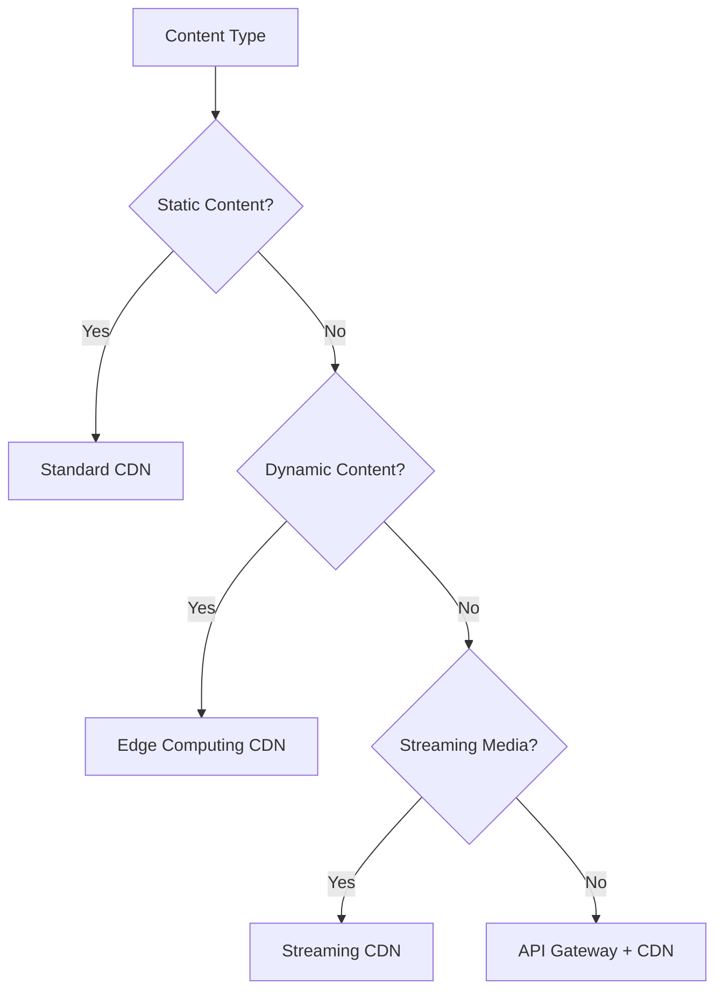

# CDN & Content Delivery 🌍

Master Content Delivery Networks, edge computing, and global content distribution strategies.

## 📋 Core Topics

### CDN Fundamentals

- **[CDN Architecture](architecture.md)** - Edge servers, origin servers, and distribution
- **[Content Types](content-types.md)** - Static vs dynamic content delivery
- **[Geographic Distribution](geographic.md)** - Global edge location strategies
- **[Cache Hierarchies](cache-hierarchies.md)** - Multi-tier caching systems

### CDN Strategies

- **[Cache Invalidation](invalidation.md)** - Content freshness and purging strategies
- **[Origin Shield](origin-shield.md)** - Protecting origin servers from load
- **[Edge Side Includes](esi.md)** - Dynamic content assembly at edge
- **[Streaming Delivery](streaming.md)** - Video and live content delivery

### Performance Optimization

- **[Compression](compression.md)** - Gzip, Brotli, and image optimization
- **[HTTP/2 & HTTP/3](http-versions.md)** - Modern protocol optimizations
- **[Edge Computing](edge-computing.md)** - Computation at the edge
- **[Mobile Optimization](mobile.md)** - Mobile-specific delivery strategies

### CDN Providers

- **[CloudFlare](cloudflare.md)** - Global CDN with security features
- **[AWS CloudFront](cloudfront.md)** - Amazon's CDN service
- **[Fastly](fastly.md)** - Real-time CDN for dynamic content
- **[Azure CDN](azure-cdn.md)** - Microsoft's content delivery network

## 🔍 Quick Reference

### CDN Provider Comparison

| Provider | Edge Locations | Bandwidth | Special Features | Best For |
|----------|----------------|-----------|------------------|----------|
| **CloudFlare** | 275+ | Unlimited | DDoS protection, WAF | Security-focused sites |
| **AWS CloudFront** | 400+ | Pay-as-you-go | AWS integration | AWS ecosystem |
| **Fastly** | 60+ | Real-time purge | Edge computing | Dynamic content |
| **KeyCDN** | 35+ | Cost-effective | Simple setup | Small to medium sites |
| **MaxCDN** | 90+ | Good performance | Easy integration | WordPress sites |

### Content Delivery Decision Matrix



## 🛠️ Implementation Examples

### CDN Configuration with CloudFlare

```python
import requests
import json
from typing import Dict, Any, List
import time

class CloudFlareAPI:
    def __init__(self, api_token: str, zone_id: str):
        self.api_token = api_token
        self.zone_id = zone_id
        self.base_url = "https://api.cloudflare.com/client/v4"
        self.headers = {
            "Authorization": f"Bearer {api_token}",
            "Content-Type": "application/json"
        }
    
    def create_page_rule(self, url_pattern: str, actions: Dict[str, Any]) -> Dict[str, Any]:
        """Create a page rule for CDN behavior"""
        endpoint = f"{self.base_url}/zones/{self.zone_id}/pagerules"
        
        data = {
            "targets": [
                {
                    "target": "url",
                    "constraint": {
                        "operator": "matches",
                        "value": url_pattern
                    }
                }
            ],
            "actions": [
                {"id": action_type, "value": value}
                for action_type, value in actions.items()
            ],
            "status": "active"
        }
        
        response = requests.post(endpoint, headers=self.headers, json=data)
        return response.json()
    
    def purge_cache(self, files: List[str] = None, purge_everything: bool = False) -> Dict[str, Any]:
        """Purge CDN cache"""
        endpoint = f"{self.base_url}/zones/{self.zone_id}/purge_cache"
        
        if purge_everything:
            data = {"purge_everything": True}
        else:
            data = {"files": files or []}
        
        response = requests.post(endpoint, headers=self.headers, json=data)
        return response.json()
    
    def get_analytics(self, since: str, until: str) -> Dict[str, Any]:
        """Get CDN analytics data"""
        endpoint = f"{self.base_url}/zones/{self.zone_id}/analytics/dashboard"
        
        params = {
            "since": since,
            "until": until,
            "continuous": "true"
        }
        
        response = requests.get(endpoint, headers=self.headers, params=params)
        return response.json()
    
    def set_cache_settings(self, cache_level: str = "aggressive") -> Dict[str, Any]:
        """Configure cache settings"""
        endpoint = f"{self.base_url}/zones/{self.zone_id}/settings/cache_level"
        
        data = {"value": cache_level}
        response = requests.patch(endpoint, headers=self.headers, json=data)
        return response.json()

# Usage example
def setup_cdn_optimization():
    cf = CloudFlareAPI("your-api-token", "your-zone-id")
    
    # Set aggressive caching for static assets
    cf.create_page_rule(
        "*.example.com/static/*",
        {
            "cache_level": "cache_everything",
            "edge_cache_ttl": 31536000,  # 1 year
            "browser_cache_ttl": 31536000
        }
    )
    
    # Set different rules for API endpoints
    cf.create_page_rule(
        "api.example.com/*",
        {
            "cache_level": "bypass",
            "disable_performance": True
        }
    )
    
    # Configure compression
    cf.create_page_rule(
        "*.example.com/*",
        {
            "brotli": "on",
            "minify": {
                "html": "on",
                "css": "on",
                "js": "on"
            }
        }
    )
```

### Custom CDN Implementation

```python
import asyncio
import aiohttp
import hashlib
import time
from typing import Dict, Any, Optional
from dataclasses import dataclass
import pickle

@dataclass
class CacheEntry:
    content: bytes
    content_type: str
    created_at: float
    ttl: int
    etag: str
    
    @property
    def is_expired(self) -> bool:
        return time.time() > self.created_at + self.ttl

class EdgeServer:
    def __init__(self, server_id: str, origin_url: str):
        self.server_id = server_id
        self.origin_url = origin_url
        self.cache: Dict[str, CacheEntry] = {}
        self.hit_count = 0
        self.miss_count = 0
        
    async def serve_request(self, path: str, headers: Dict[str, str]) -> Dict[str, Any]:
        """Serve request from cache or origin"""
        cache_key = self._generate_cache_key(path, headers)
        
        # Check cache first
        if cache_key in self.cache:
            entry = self.cache[cache_key]
            
            # Check if cache entry is still valid
            if not entry.is_expired:
                # Check ETag for conditional requests
                if headers.get('If-None-Match') == entry.etag:
                    self.hit_count += 1
                    return {
                        'status': 304,
                        'headers': {'ETag': entry.etag},
                        'content': b''
                    }
                
                self.hit_count += 1
                return {
                    'status': 200,
                    'headers': {
                        'Content-Type': entry.content_type,
                        'ETag': entry.etag,
                        'X-Cache': 'HIT',
                        'X-Edge-Server': self.server_id
                    },
                    'content': entry.content
                }
            else:
                # Remove expired entry
                del self.cache[cache_key]
        
        # Cache miss - fetch from origin
        self.miss_count += 1
        return await self._fetch_from_origin(path, headers, cache_key)
    
    async def _fetch_from_origin(self, path: str, headers: Dict[str, str], cache_key: str) -> Dict[str, Any]:
        """Fetch content from origin server"""
        origin_url = f"{self.origin_url}{path}"
        
        try:
            async with aiohttp.ClientSession() as session:
                async with session.get(origin_url, headers=headers) as response:
                    content = await response.read()
                    content_type = response.headers.get('Content-Type', 'application/octet-stream')
                    
                    # Generate ETag
                    etag = hashlib.md5(content).hexdigest()
                    
                    # Determine TTL based on content type and headers
                    ttl = self._calculate_ttl(content_type, response.headers)
                    
                    # Cache the response if cacheable
                    if self._is_cacheable(response.status, content_type, response.headers):
                        cache_entry = CacheEntry(
                            content=content,
                            content_type=content_type,
                            created_at=time.time(),
                            ttl=ttl,
                            etag=etag
                        )
                        self.cache[cache_key] = cache_entry
                    
                    return {
                        'status': response.status,
                        'headers': {
                            'Content-Type': content_type,
                            'ETag': etag,
                            'X-Cache': 'MISS',
                            'X-Edge-Server': self.server_id,
                            'Cache-Control': f'max-age={ttl}'
                        },
                        'content': content
                    }
                    
        except Exception as e:
            return {
                'status': 502,
                'headers': {'Content-Type': 'text/plain'},
                'content': f'Bad Gateway: {str(e)}'.encode()
            }
    
    def _generate_cache_key(self, path: str, headers: Dict[str, str]) -> str:
        """Generate cache key for request"""
        # Include relevant headers in cache key
        vary_headers = ['Accept-Encoding', 'User-Agent']
        key_parts = [path]
        
        for header in vary_headers:
            if header in headers:
                key_parts.append(f"{header}:{headers[header]}")
        
        return hashlib.md5(':'.join(key_parts).encode()).hexdigest()
    
    def _calculate_ttl(self, content_type: str, headers: Dict[str, str]) -> int:
        """Calculate TTL based on content type and headers"""
        # Check for explicit cache control
        cache_control = headers.get('Cache-Control', '')
        if 'max-age=' in cache_control:
            try:
                max_age = int(cache_control.split('max-age=')[1].split(',')[0])
                return max_age
            except (ValueError, IndexError):
                pass
        
        # Default TTL based on content type
        if content_type.startswith('image/'):
            return 86400  # 1 day for images
        elif content_type.startswith('text/css') or content_type.startswith('application/javascript'):
            return 3600   # 1 hour for CSS/JS
        elif content_type.startswith('text/html'):
            return 300    # 5 minutes for HTML
        else:
            return 1800   # 30 minutes default
    
    def _is_cacheable(self, status_code: int, content_type: str, headers: Dict[str, str]) -> bool:
        """Determine if response is cacheable"""
        # Don't cache error responses
        if status_code >= 400:
            return False
        
        # Check cache control headers
        cache_control = headers.get('Cache-Control', '').lower()
        if 'no-cache' in cache_control or 'no-store' in cache_control:
            return False
        
        # Don't cache dynamic content by default
        if content_type.startswith('application/json'):
            return False
        
        return True
    
    def get_stats(self) -> Dict[str, Any]:
        """Get cache statistics"""
        total_requests = self.hit_count + self.miss_count
        hit_rate = self.hit_count / total_requests if total_requests > 0 else 0
        
        return {
            'server_id': self.server_id,
            'total_requests': total_requests,
            'cache_hits': self.hit_count,
            'cache_misses': self.miss_count,
            'hit_rate': hit_rate,
            'cached_objects': len(self.cache)
        }
    
    def purge_cache(self, pattern: str = None):
        """Purge cache entries"""
        if pattern is None:
            # Purge all
            self.cache.clear()
        else:
            # Purge matching pattern
            keys_to_remove = [
                key for key in self.cache.keys()
                if pattern in key
            ]
            for key in keys_to_remove:
                del self.cache[key]

class CDNNetwork:
    def __init__(self):
        self.edge_servers: Dict[str, EdgeServer] = {}
        self.request_count = 0
    
    def add_edge_server(self, location: str, origin_url: str):
        """Add edge server to network"""
        server_id = f"edge-{location}-{len(self.edge_servers)}"
        self.edge_servers[location] = EdgeServer(server_id, origin_url)
    
    def get_nearest_edge_server(self, client_location: str) -> EdgeServer:
        """Get nearest edge server (simplified)"""
        # In real implementation, use geolocation and latency data
        if client_location in self.edge_servers:
            return self.edge_servers[client_location]
        
        # Fallback to first available server
        return next(iter(self.edge_servers.values()))
    
    async def serve_request(self, path: str, headers: Dict[str, str], client_location: str = "default") -> Dict[str, Any]:
        """Route request to appropriate edge server"""
        self.request_count += 1
        edge_server = self.get_nearest_edge_server(client_location)
        return await edge_server.serve_request(path, headers)
    
    def get_network_stats(self) -> Dict[str, Any]:
        """Get network-wide statistics"""
        total_hits = sum(server.hit_count for server in self.edge_servers.values())
        total_misses = sum(server.miss_count for server in self.edge_servers.values())
        total_requests = total_hits + total_misses
        
        return {
            'total_requests': total_requests,
            'total_hits': total_hits,
            'total_misses': total_misses,
            'overall_hit_rate': total_hits / total_requests if total_requests > 0 else 0,
            'edge_servers': {
                location: server.get_stats()
                for location, server in self.edge_servers.items()
            }
        }

# Usage example
async def cdn_example():
    # Create CDN network
    cdn = CDNNetwork()
    
    # Add edge servers in different locations
    cdn.add_edge_server("us-east", "https://origin.example.com")
    cdn.add_edge_server("eu-west", "https://origin.example.com")
    cdn.add_edge_server("asia-pacific", "https://origin.example.com")
    
    # Simulate requests
    headers = {"Accept-Encoding": "gzip", "User-Agent": "Mozilla/5.0"}
    
    # Request from different locations
    response1 = await cdn.serve_request("/static/logo.png", headers, "us-east")
    response2 = await cdn.serve_request("/static/logo.png", headers, "us-east")  # Should be cache hit
    
    # Print statistics
    stats = cdn.get_network_stats()
    print(f"CDN Statistics: {stats}")
```

### Image Optimization and Delivery

```python
from PIL import Image
import io
import base64
from typing import Tuple, Dict, Any

class ImageOptimizer:
    def __init__(self):
        self.supported_formats = {'JPEG', 'PNG', 'WEBP', 'AVIF'}
        self.quality_settings = {
            'high': 90,
            'medium': 75,
            'low': 50
        }
    
    def optimize_image(self, 
                      image_data: bytes, 
                      target_width: int = None,
                      target_height: int = None,
                      format: str = 'WEBP',
                      quality: str = 'medium') -> bytes:
        """Optimize image for web delivery"""
        
        # Open image
        image = Image.open(io.BytesIO(image_data))
        
        # Convert to RGB if necessary
        if image.mode in ('RGBA', 'LA', 'P'):
            background = Image.new('RGB', image.size, (255, 255, 255))
            if image.mode == 'P':
                image = image.convert('RGBA')
            background.paste(image, mask=image.split()[-1] if image.mode == 'RGBA' else None)
            image = background
        
        # Resize if dimensions specified
        if target_width or target_height:
            image = self._smart_resize(image, target_width, target_height)
        
        # Save optimized image
        output = io.BytesIO()
        save_kwargs = {
            'format': format,
            'optimize': True
        }
        
        if format in ('JPEG', 'WEBP'):
            save_kwargs['quality'] = self.quality_settings[quality]
        
        image.save(output, **save_kwargs)
        return output.getvalue()
    
    def _smart_resize(self, image: Image.Image, target_width: int, target_height: int) -> Image.Image:
        """Smart resize maintaining aspect ratio"""
        original_width, original_height = image.size
        
        if target_width and target_height:
            # Calculate scaling to fit within bounds
            scale_w = target_width / original_width
            scale_h = target_height / original_height
            scale = min(scale_w, scale_h)
        elif target_width:
            scale = target_width / original_width
        elif target_height:
            scale = target_height / original_height
        else:
            return image
        
        new_width = int(original_width * scale)
        new_height = int(original_height * scale)
        
        return image.resize((new_width, new_height), Image.Resampling.LANCZOS)
    
    def generate_responsive_images(self, image_data: bytes) -> Dict[str, bytes]:
        """Generate multiple sizes for responsive design"""
        sizes = {
            'thumbnail': (150, 150),
            'small': (300, 300),
            'medium': (600, 600),
            'large': (1200, 1200),
            'xlarge': (1920, 1920)
        }
        
        responsive_images = {}
        for size_name, (width, height) in sizes.items():
            optimized = self.optimize_image(
                image_data,
                target_width=width,
                target_height=height,
                format='WEBP',
                quality='medium'
            )
            responsive_images[size_name] = optimized
        
        return responsive_images

# Advanced CDN with image optimization
class ImageCDN(EdgeServer):
    def __init__(self, *args, **kwargs):
        super().__init__(*args, **kwargs)
        self.optimizer = ImageOptimizer()
    
    async def serve_request(self, path: str, headers: Dict[str, str]) -> Dict[str, Any]:
        """Serve optimized images based on request parameters"""
        # Check if this is an image request with optimization parameters
        if self._is_image_request(path):
            return await self._serve_optimized_image(path, headers)
        
        # Regular request handling
        return await super().serve_request(path, headers)
    
    def _is_image_request(self, path: str) -> bool:
        """Check if request is for an image"""
        image_extensions = {'.jpg', '.jpeg', '.png', '.gif', '.webp', '.bmp'}
        return any(path.lower().endswith(ext) for ext in image_extensions)
    
    async def _serve_optimized_image(self, path: str, headers: Dict[str, str]) -> Dict[str, Any]:
        """Serve optimized image based on client capabilities"""
        # Parse query parameters for optimization
        width = headers.get('X-Image-Width')
        height = headers.get('X-Image-Height')
        quality = headers.get('X-Image-Quality', 'medium')
        
        # Determine best format based on Accept header
        accept_header = headers.get('Accept', '')
        if 'image/avif' in accept_header:
            target_format = 'AVIF'
        elif 'image/webp' in accept_header:
            target_format = 'WEBP'
        else:
            target_format = 'JPEG'
        
        # Generate cache key including optimization parameters
        cache_key = f"{path}:{width}:{height}:{quality}:{target_format}"
        
        # Check cache
        if cache_key in self.cache:
            entry = self.cache[cache_key]
            if not entry.is_expired:
                self.hit_count += 1
                return {
                    'status': 200,
                    'headers': {
                        'Content-Type': f'image/{target_format.lower()}',
                        'X-Cache': 'HIT',
                        'X-Optimized': 'true'
                    },
                    'content': entry.content
                }
        
        # Fetch original image and optimize
        original_response = await super().serve_request(path, headers)
        
        if original_response['status'] == 200:
            try:
                # Optimize image
                optimized_content = self.optimizer.optimize_image(
                    original_response['content'],
                    target_width=int(width) if width else None,
                    target_height=int(height) if height else None,
                    format=target_format,
                    quality=quality
                )
                
                # Cache optimized version
                cache_entry = CacheEntry(
                    content=optimized_content,
                    content_type=f'image/{target_format.lower()}',
                    created_at=time.time(),
                    ttl=86400,  # Cache images for 1 day
                    etag=hashlib.md5(optimized_content).hexdigest()
                )
                self.cache[cache_key] = cache_entry
                
                return {
                    'status': 200,
                    'headers': {
                        'Content-Type': f'image/{target_format.lower()}',
                        'X-Cache': 'MISS',
                        'X-Optimized': 'true',
                        'X-Original-Size': str(len(original_response['content'])),
                        'X-Optimized-Size': str(len(optimized_content))
                    },
                    'content': optimized_content
                }
                
            except Exception as e:
                # Return original image if optimization fails
                return original_response
        
        return original_response
```

## 📊 CDN Performance Metrics

### Monitoring and Analytics

```python
class CDNAnalytics:
    def __init__(self):
        self.metrics = {
            'requests': 0,
            'cache_hits': 0,
            'cache_misses': 0,
            'bandwidth_saved': 0,
            'origin_requests': 0,
            'error_rate': 0,
            'average_response_time': 0
        }
        self.geographic_data = {}
        self.time_series_data = []
    
    def record_request(self, 
                      cache_hit: bool, 
                      bytes_served: int, 
                      response_time: float,
                      origin_request: bool = False,
                      client_country: str = 'unknown'):
        """Record request metrics"""
        self.metrics['requests'] += 1
        
        if cache_hit:
            self.metrics['cache_hits'] += 1
            self.metrics['bandwidth_saved'] += bytes_served
        else:
            self.metrics['cache_misses'] += 1
        
        if origin_request:
            self.metrics['origin_requests'] += 1
        
        # Update geographic data
        if client_country not in self.geographic_data:
            self.geographic_data[client_country] = {
                'requests': 0,
                'cache_hits': 0,
                'bandwidth': 0
            }
        
        geo_data = self.geographic_data[client_country]
        geo_data['requests'] += 1
        geo_data['bandwidth'] += bytes_served
        if cache_hit:
            geo_data['cache_hits'] += 1
        
        # Update response time
        total_time = self.metrics['average_response_time'] * (self.metrics['requests'] - 1)
        self.metrics['average_response_time'] = (total_time + response_time) / self.metrics['requests']
    
    def get_cache_hit_rate(self) -> float:
        """Calculate cache hit rate"""
        total = self.metrics['cache_hits'] + self.metrics['cache_misses']
        return self.metrics['cache_hits'] / total if total > 0 else 0
    
    def get_bandwidth_savings(self) -> float:
        """Calculate bandwidth savings percentage"""
        total_bandwidth = self.metrics['bandwidth_saved'] + (
            self.metrics['cache_misses'] * 1024  # Assume 1KB average
        )
        return self.metrics['bandwidth_saved'] / total_bandwidth if total_bandwidth > 0 else 0
    
    def get_top_countries(self, limit: int = 10) -> list:
        """Get top countries by request volume"""
        return sorted(
            self.geographic_data.items(),
            key=lambda x: x[1]['requests'],
            reverse=True
        )[:limit]
```

## 🎯 Best Practices

### CDN Configuration Guidelines

- [ ] **Choose appropriate TTL** values for different content types
- [ ] **Configure proper cache headers** (Cache-Control, ETag)
- [ ] **Implement cache invalidation** strategy for content updates
- [ ] **Use origin shield** to reduce origin server load
- [ ] **Enable compression** (Gzip, Brotli) for text content
- [ ] **Optimize images** with modern formats (WebP, AVIF)
- [ ] **Monitor cache hit rates** and optimize cache rules
- [ ] **Set up proper error pages** for CDN failures

### Content Optimization Strategies

- [ ] **Minimize HTTP requests** by combining files
- [ ] **Use HTTP/2 server push** for critical resources
- [ ] **Implement lazy loading** for images and videos
- [ ] **Use responsive images** with srcset attribute
- [ ] **Minify CSS, JavaScript** and HTML
- [ ] **Optimize critical rendering path**
- [ ] **Implement service workers** for offline caching
- [ ] **Use modern image formats** when supported

## 🔗 Related Topics

- [Caching Strategies](../caching/index.md) - Cache implementation patterns
- [Load Balancing](../load-balancing/index.md) - Traffic distribution
- [Performance Optimization](../performance/index.md) - Overall performance strategies
- [Networking](../networking/index.md) - Network protocols and optimization
- [Scalability](../scalability/index.md) - Global scaling strategies

## 📚 Additional Resources

- [CloudFlare Learning Center](https://www.cloudflare.com/learning/) - CDN concepts and implementation
- [AWS CloudFront Documentation](https://docs.aws.amazon.com/cloudfront/) - AWS CDN service guide
- [Web Performance Best Practices](https://developers.google.com/web/fundamentals/performance) - Google's performance guide
- [HTTP Caching](https://tools.ietf.org/html/rfc7234) - HTTP caching specification
