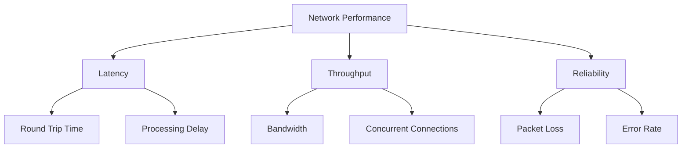

# Networking & Communication 🌐

Master the patterns and protocols that enable systems to communicate effectively. This section covers APIs, load balancing, message queues, and networking fundamentals.

## 🎯 What You'll Learn

Effective communication between system components is crucial for building scalable and reliable distributed systems. Learn how to design robust APIs, implement messaging patterns, and handle network challenges.

<div class="grid cards" markdown>

- :material-api: **API Design**

    ---

    REST, GraphQL, gRPC design patterns and best practices

    [Design robust APIs →](apis.md)

- :material-scale-balance: **Load Balancing**

    ---

    Distribute traffic effectively across multiple servers

    [Balance loads →](load-balancing.md)

- :material-message: **Messaging Systems**

    ---

    Queues, pub/sub, event streaming, and async communication

    [Connect asynchronously →](messaging.md)

- :material-network: **Network Protocols**

    ---

    HTTP/HTTPS, TCP/UDP, WebSockets, and protocol selection

    [Choose protocols →](protocols.md)

</div>
- **[WebSocket](websocket.md)** - Full-duplex communication protocol
- **[gRPC](grpc.md)** - High-performance RPC framework

### Communication Patterns

- **[REST APIs](rest.md)** - Representational State Transfer architecture
- **[GraphQL](graphql.md)** - Query language for APIs
- **[Message Queues](message-queues.md)** - Asynchronous communication
- **[Event Streaming](event-streaming.md)** - Real-time data processing

### Network Infrastructure

- **[CDN](cdn.md)** - Content Delivery Networks
- **[DNS](dns.md)** - Domain Name System design
- **[Proxy Servers](proxy.md)** - Forward and reverse proxies
- **[API Gateway](api-gateway.md)** - API management and routing

### Advanced Concepts

- **[Network Security](security.md)** - TLS, certificates, VPN
- **[Service Discovery](service-discovery.md)** - Dynamic service location
- **[Circuit Breakers](circuit-breakers.md)** - Fault tolerance patterns
- **[Rate Limiting](rate-limiting.md)** - Traffic control mechanisms

## 🔍 Quick Reference

### Protocol Comparison

| Protocol | Layer | Connection | Overhead | Use Case |
|----------|-------|------------|----------|----------|
| **TCP** | Transport | Connection-based | Medium | Reliable data transfer |
| **UDP** | Transport | Connectionless | Low | Real-time communication |
| **HTTP/1.1** | Application | Request-Response | High | Web applications |
| **HTTP/2** | Application | Multiplexed | Medium | Modern web apps |
| **WebSocket** | Application | Full-duplex | Low | Real-time features |
| **gRPC** | Application | Streaming | Low | Microservices |

### Network Performance Metrics



## 🛠️ Implementation Examples

### HTTP Client with Connection Pooling

```python
import asyncio
import aiohttp
from typing import Dict, Any, Optional
import time
import logging

class HTTPClient:
    def __init__(self, 
                 max_connections: int = 100,
                 timeout: int = 30,
                 retry_attempts: int = 3):
        self.max_connections = max_connections
        self.timeout = timeout
        self.retry_attempts = retry_attempts
        self.session: Optional[aiohttp.ClientSession] = None
        self.metrics = {
            'total_requests': 0,
            'successful_requests': 0,
            'failed_requests': 0,
            'total_response_time': 0
        }
    
    async def __aenter__(self):
        """Async context manager entry"""
        connector = aiohttp.TCPConnector(
            limit=self.max_connections,
            limit_per_host=20,
            ttl_dns_cache=300,
            use_dns_cache=True,
            keepalive_timeout=30,
            enable_cleanup_closed=True
        )
        
        timeout = aiohttp.ClientTimeout(total=self.timeout)
        
        self.session = aiohttp.ClientSession(
            connector=connector,
            timeout=timeout,
            headers={'User-Agent': 'CustomHTTPClient/1.0'}
        )
        return self
    
    async def __aexit__(self, exc_type, exc_val, exc_tb):
        """Async context manager exit"""
        if self.session:
            await self.session.close()
    
    async def request(self, 
                     method: str, 
                     url: str, 
                     **kwargs) -> Dict[str, Any]:
        """Make HTTP request with retry logic"""
        for attempt in range(self.retry_attempts):
            try:
                start_time = time.time()
                
                async with self.session.request(method, url, **kwargs) as response:
                    response_time = time.time() - start_time
                    
                    # Update metrics
                    self.metrics['total_requests'] += 1
                    self.metrics['total_response_time'] += response_time
                    
                    if response.status < 400:
                        self.metrics['successful_requests'] += 1
                    else:
                        self.metrics['failed_requests'] += 1
                    
                    # Handle different content types
                    content_type = response.headers.get('content-type', '')
                    
                    if 'application/json' in content_type:
                        data = await response.json()
                    elif 'text/' in content_type:
                        data = await response.text()
                    else:
                        data = await response.read()
                    
                    return {
                        'status': response.status,
                        'headers': dict(response.headers),
                        'data': data,
                        'response_time': response_time
                    }
                    
            except asyncio.TimeoutError:
                logging.warning(f"Request timeout for {url} (attempt {attempt + 1})")
                if attempt == self.retry_attempts - 1:
                    self.metrics['failed_requests'] += 1
                    raise
                await asyncio.sleep(2 ** attempt)  # Exponential backoff
                
            except Exception as e:
                logging.error(f"Request failed for {url}: {e}")
                if attempt == self.retry_attempts - 1:
                    self.metrics['failed_requests'] += 1
                    raise
                await asyncio.sleep(2 ** attempt)
    
    async def get(self, url: str, **kwargs):
        """GET request"""
        return await self.request('GET', url, **kwargs)
    
    async def post(self, url: str, **kwargs):
        """POST request"""
        return await self.request('POST', url, **kwargs)
    
    def get_metrics(self) -> Dict[str, Any]:
        """Get client metrics"""
        total_requests = self.metrics['total_requests']
        if total_requests == 0:
            return self.metrics
        
        return {
            **self.metrics,
            'success_rate': self.metrics['successful_requests'] / total_requests,
            'average_response_time': self.metrics['total_response_time'] / total_requests
        }

# Usage example
async def main():
    async with HTTPClient(max_connections=50) as client:
        # Make concurrent requests
        tasks = [
            client.get('https://api.example.com/users'),
            client.get('https://api.example.com/posts'),
            client.post('https://api.example.com/events', 
                       json={'event': 'user_login'})
        ]
        
        results = await asyncio.gather(*tasks, return_exceptions=True)
        
        # Print metrics
        print("Client Metrics:", client.get_metrics())
```

### WebSocket Server Implementation

```python
import asyncio
import websockets
import json
from typing import Set, Dict, Any
import logging

class WebSocketServer:
    def __init__(self, host: str = 'localhost', port: int = 8765):
        self.host = host
        self.port = port
        self.clients: Set[websockets.WebSocketServerProtocol] = set()
        self.channels: Dict[str, Set[websockets.WebSocketServerProtocol]] = {}
        
    async def register_client(self, websocket: websockets.WebSocketServerProtocol):
        """Register a new client connection"""
        self.clients.add(websocket)
        logging.info(f"Client connected: {websocket.remote_address}")
        
    async def unregister_client(self, websocket: websockets.WebSocketServerProtocol):
        """Unregister a client connection"""
        self.clients.discard(websocket)
        
        # Remove from all channels
        for channel_clients in self.channels.values():
            channel_clients.discard(websocket)
            
        logging.info(f"Client disconnected: {websocket.remote_address}")
    
    async def join_channel(self, websocket: websockets.WebSocketServerProtocol, channel: str):
        """Add client to a channel"""
        if channel not in self.channels:
            self.channels[channel] = set()
        self.channels[channel].add(websocket)
        
        await self.send_to_client(websocket, {
            'type': 'channel_joined',
            'channel': channel
        })
    
    async def leave_channel(self, websocket: websockets.WebSocketServerProtocol, channel: str):
        """Remove client from a channel"""
        if channel in self.channels:
            self.channels[channel].discard(websocket)
            
        await self.send_to_client(websocket, {
            'type': 'channel_left',
            'channel': channel
        })
    
    async def send_to_client(self, websocket: websockets.WebSocketServerProtocol, message: Dict[str, Any]):
        """Send message to a specific client"""
        try:
            await websocket.send(json.dumps(message))
        except websockets.exceptions.ConnectionClosed:
            await self.unregister_client(websocket)
    
    async def broadcast_to_channel(self, channel: str, message: Dict[str, Any]):
        """Broadcast message to all clients in a channel"""
        if channel not in self.channels:
            return
            
        # Send message to all clients in the channel
        disconnected_clients = set()
        
        for websocket in self.channels[channel].copy():
            try:
                await websocket.send(json.dumps(message))
            except websockets.exceptions.ConnectionClosed:
                disconnected_clients.add(websocket)
        
        # Clean up disconnected clients
        for websocket in disconnected_clients:
            await self.unregister_client(websocket)
    
    async def broadcast_to_all(self, message: Dict[str, Any]):
        """Broadcast message to all connected clients"""
        disconnected_clients = set()
        
        for websocket in self.clients.copy():
            try:
                await websocket.send(json.dumps(message))
            except websockets.exceptions.ConnectionClosed:
                disconnected_clients.add(websocket)
        
        # Clean up disconnected clients
        for websocket in disconnected_clients:
            await self.unregister_client(websocket)
    
    async def handle_message(self, websocket: websockets.WebSocketServerProtocol, message: str):
        """Handle incoming message from client"""
        try:
            data = json.loads(message)
            message_type = data.get('type')
            
            if message_type == 'join_channel':
                await self.join_channel(websocket, data['channel'])
            elif message_type == 'leave_channel':
                await self.leave_channel(websocket, data['channel'])
            elif message_type == 'channel_message':
                # Broadcast message to channel
                await self.broadcast_to_channel(data['channel'], {
                    'type': 'channel_message',
                    'channel': data['channel'],
                    'message': data['message'],
                    'sender': str(websocket.remote_address)
                })
            elif message_type == 'global_message':
                # Broadcast to all clients
                await self.broadcast_to_all({
                    'type': 'global_message',
                    'message': data['message'],
                    'sender': str(websocket.remote_address)
                })
            else:
                await self.send_to_client(websocket, {
                    'type': 'error',
                    'message': f'Unknown message type: {message_type}'
                })
                
        except json.JSONDecodeError:
            await self.send_to_client(websocket, {
                'type': 'error',
                'message': 'Invalid JSON format'
            })
        except Exception as e:
            logging.error(f"Error handling message: {e}")
            await self.send_to_client(websocket, {
                'type': 'error',
                'message': 'Internal server error'
            })
    
    async def client_handler(self, websocket: websockets.WebSocketServerProtocol, path: str):
        """Handle individual client connection"""
        await self.register_client(websocket)
        
        try:
            async for message in websocket:
                await self.handle_message(websocket, message)
        except websockets.exceptions.ConnectionClosed:
            pass
        finally:
            await self.unregister_client(websocket)
    
    async def start_server(self):
        """Start the WebSocket server"""
        logging.info(f"Starting WebSocket server on {self.host}:{self.port}")
        
        async with websockets.serve(self.client_handler, self.host, self.port):
            # Keep the server running
            await asyncio.Future()  # Run forever

# Usage example
async def main():
    server = WebSocketServer(host='0.0.0.0', port=8765)
    await server.start_server()

if __name__ == "__main__":
    logging.basicConfig(level=logging.INFO)
    asyncio.run(main())
```

### gRPC Service Implementation

```python
# proto/user_service.proto (Protocol Buffer definition)
"""
syntax = "proto3";

package user_service;

service UserService {
    rpc GetUser(GetUserRequest) returns (User);
    rpc CreateUser(CreateUserRequest) returns (User);
    rpc ListUsers(ListUsersRequest) returns (stream User);
}

message User {
    int32 id = 1;
    string name = 2;
    string email = 3;
    int64 created_at = 4;
}

message GetUserRequest {
    int32 id = 1;
}

message CreateUserRequest {
    string name = 1;
    string email = 2;
}

message ListUsersRequest {
    int32 page_size = 1;
    string page_token = 2;
}
"""

# gRPC Server Implementation
import grpc
from concurrent import futures
import time
import logging
from typing import Dict, List

# Generated from proto file
# import user_service_pb2
# import user_service_pb2_grpc

class UserServiceImpl:
    def __init__(self):
        self.users: Dict[int, dict] = {}
        self.next_id = 1
    
    def GetUser(self, request, context):
        """Get user by ID"""
        user_id = request.id
        
        if user_id not in self.users:
            context.set_code(grpc.StatusCode.NOT_FOUND)
            context.set_details(f'User with ID {user_id} not found')
            return user_service_pb2.User()
        
        user_data = self.users[user_id]
        return user_service_pb2.User(
            id=user_data['id'],
            name=user_data['name'],
            email=user_data['email'],
            created_at=user_data['created_at']
        )
    
    def CreateUser(self, request, context):
        """Create a new user"""
        user_id = self.next_id
        self.next_id += 1
        
        user_data = {
            'id': user_id,
            'name': request.name,
            'email': request.email,
            'created_at': int(time.time())
        }
        
        self.users[user_id] = user_data
        
        return user_service_pb2.User(
            id=user_data['id'],
            name=user_data['name'],
            email=user_data['email'],
            created_at=user_data['created_at']
        )
    
    def ListUsers(self, request, context):
        """Stream all users"""
        for user_data in self.users.values():
            yield user_service_pb2.User(
                id=user_data['id'],
                name=user_data['name'],
                email=user_data['email'],
                created_at=user_data['created_at']
            )

def serve():
    """Start gRPC server"""
    server = grpc.server(futures.ThreadPoolExecutor(max_workers=10))
    
    # Add service to server
    user_service_pb2_grpc.add_UserServiceServicer_to_server(
        UserServiceImpl(), server
    )
    
    # Listen on port
    listen_addr = '[::]:50051'
    server.add_insecure_port(listen_addr)
    
    logging.info(f"Starting gRPC server on {listen_addr}")
    server.start()
    
    try:
        server.wait_for_termination()
    except KeyboardInterrupt:
        server.stop(0)

# gRPC Client Implementation
class UserServiceClient:
    def __init__(self, server_address: str = 'localhost:50051'):
        self.channel = grpc.insecure_channel(server_address)
        self.stub = user_service_pb2_grpc.UserServiceStub(self.channel)
    
    def get_user(self, user_id: int):
        """Get user by ID"""
        request = user_service_pb2.GetUserRequest(id=user_id)
        try:
            response = self.stub.GetUser(request)
            return response
        except grpc.RpcError as e:
            logging.error(f"gRPC error: {e}")
            return None
    
    def create_user(self, name: str, email: str):
        """Create a new user"""
        request = user_service_pb2.CreateUserRequest(name=name, email=email)
        try:
            response = self.stub.CreateUser(request)
            return response
        except grpc.RpcError as e:
            logging.error(f"gRPC error: {e}")
            return None
    
    def list_users(self):
        """List all users"""
        request = user_service_pb2.ListUsersRequest()
        try:
            for user in self.stub.ListUsers(request):
                yield user
        except grpc.RpcError as e:
            logging.error(f"gRPC error: {e}")
    
    def close(self):
        """Close the gRPC channel"""
        self.channel.close()

# Usage example
if __name__ == "__main__":
    logging.basicConfig(level=logging.INFO)
    serve()
```

## 📊 Network Performance Optimization

### Connection Pooling and Keep-Alive

```python
import asyncio
import aiohttp
from typing import Dict, Any

class OptimizedHTTPClient:
    def __init__(self):
        # Connection pooling configuration
        self.connector = aiohttp.TCPConnector(
            limit=100,              # Total connection pool size
            limit_per_host=30,      # Per-host connection limit
            ttl_dns_cache=300,      # DNS cache TTL
            use_dns_cache=True,     # Enable DNS caching
            keepalive_timeout=30,   # Keep connections alive
            enable_cleanup_closed=True,
            # TCP socket options
            socket_options=[
                (socket.SOL_SOCKET, socket.SO_KEEPALIVE, 1),
                (socket.IPPROTO_TCP, socket.TCP_KEEPIDLE, 600),
                (socket.IPPROTO_TCP, socket.TCP_KEEPINTVL, 60),
                (socket.IPPROTO_TCP, socket.TCP_KEEPCNT, 3),
            ]
        )
        
        # Request timeout configuration
        self.timeout = aiohttp.ClientTimeout(
            total=30,      # Total timeout
            connect=5,     # Connection timeout
            sock_read=10   # Socket read timeout
        )
    
    async def __aenter__(self):
        self.session = aiohttp.ClientSession(
            connector=self.connector,
            timeout=self.timeout
        )
        return self
    
    async def __aexit__(self, exc_type, exc_val, exc_tb):
        await self.session.close()
```

### Rate Limiting Implementation

```python
import asyncio
import time
from typing import Dict, Any
from collections import defaultdict, deque

class RateLimiter:
    def __init__(self, max_requests: int, time_window: int):
        self.max_requests = max_requests
        self.time_window = time_window
        self.requests: Dict[str, deque] = defaultdict(deque)
    
    async def is_allowed(self, identifier: str) -> bool:
        """Check if request is allowed for given identifier"""
        now = time.time()
        user_requests = self.requests[identifier]
        
        # Remove old requests outside time window
        while user_requests and user_requests[0] < now - self.time_window:
            user_requests.popleft()
        
        # Check if under limit
        if len(user_requests) < self.max_requests:
            user_requests.append(now)
            return True
        
        return False
    
    def get_reset_time(self, identifier: str) -> float:
        """Get time when rate limit resets"""
        user_requests = self.requests[identifier]
        if not user_requests:
            return 0
        
        return user_requests[0] + self.time_window

# Token bucket rate limiter
class TokenBucketRateLimiter:
    def __init__(self, capacity: int, refill_rate: float):
        self.capacity = capacity
        self.tokens = capacity
        self.refill_rate = refill_rate
        self.last_refill = time.time()
        self.lock = asyncio.Lock()
    
    async def consume(self, tokens: int = 1) -> bool:
        """Attempt to consume tokens from bucket"""
        async with self.lock:
            now = time.time()
            # Refill tokens based on time passed
            time_passed = now - self.last_refill
            self.tokens = min(
                self.capacity,
                self.tokens + time_passed * self.refill_rate
            )
            self.last_refill = now
            
            if self.tokens >= tokens:
                self.tokens -= tokens
                return True
            
            return False
```

## 🎯 Best Practices

### Network Optimization Checklist

- [ ] **Use HTTP/2** for multiplexing and header compression
- [ ] **Implement connection pooling** to reduce connection overhead
- [ ] **Enable keep-alive** for persistent connections
- [ ] **Use appropriate timeouts** for different operation types
- [ ] **Implement retry logic** with exponential backoff
- [ ] **Cache DNS lookups** to reduce resolution time
- [ ] **Use CDN** for static content delivery
- [ ] **Compress data** for network transmission
- [ ] **Monitor network metrics** continuously

### Security Considerations

- [ ] **Use TLS 1.3** for encrypted communication
- [ ] **Validate certificates** properly
- [ ] **Implement rate limiting** to prevent abuse
- [ ] **Use API keys** for authentication
- [ ] **Sanitize input data** to prevent injection attacks
- [ ] **Log security events** for monitoring
- [ ] **Implement CORS** policies correctly
- [ ] **Use secure headers** (HSTS, CSP, etc.)

## 🔗 Related Topics

- [Load Balancing](../load-balancing/index.md) - Traffic distribution strategies
- [Caching](../caching/index.md) - Network caching patterns
- [Security](../reliability-security/index.md) - Network security practices
- [Monitoring](../performance/monitoring.md) - Network performance monitoring
- [Scalability](../scalability/index.md) - Network scaling considerations

## 📚 Additional Resources

- [HTTP/2 Specification](https://tools.ietf.org/html/rfc7540) - Official HTTP/2 RFC
- [gRPC Documentation](https://grpc.io/docs/) - gRPC implementation guides
- [WebSocket RFC](https://tools.ietf.org/html/rfc6455) - WebSocket protocol specification
- [Network Programming](https://beej.us/guide/bgnet/) - Network programming guide
