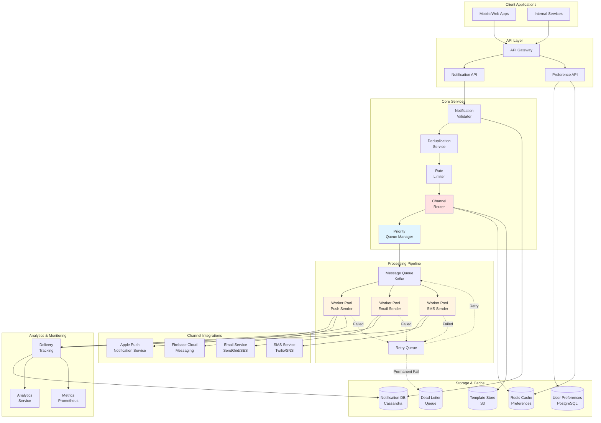

# Design Notification System

## Problem Statement

Design a scalable notification system that can send notifications to millions of users across multiple channels (push notifications, SMS, email, in-app) with high reliability, low latency, and respect for user preferences. Support both transactional and marketing notifications with priority handling and delivery guarantees.

**Difficulty:** Medium-Hard

**Prerequisites:** Message Queues, Distributed Systems, Rate Limiting, Event-Driven Architecture

---

## Step 1: Requirements & Scope

### Functional Requirements

**Core Features:**

1. **Multi-Channel Delivery**
   - Push notifications (iOS, Android, Web)
   - SMS (text messages)
   - Email
   - In-app notifications
   - Webhooks (for integrations)

2. **Notification Types**
   - Transactional (order confirmation, password reset)
   - Marketing (promotions, newsletters)
   - Social (likes, comments, follows)
   - System alerts (security, account activity)

3. **User Preferences**
   - Per-channel opt-in/opt-out
   - Notification frequency limits
   - Quiet hours (do not disturb)
   - Category-based preferences

4. **Delivery Management**
   - Priority levels (urgent, high, medium, low)
   - Retry logic with exponential backoff
   - Delivery status tracking
   - Read receipts

5. **Templating & Personalization**
   - Template engine for messages
   - Variable substitution
   - Localization (multiple languages)
   - A/B testing

### Non-Functional Requirements

1. **Scalability**
   - Send 10 million+ notifications per hour
   - Support 100 million+ users
   - Handle traffic spikes (flash sales, viral events)

2. **Reliability**
   - At-least-once delivery guarantee
   - 99.9% delivery success rate
   - Retry failed notifications
   - Dead letter queue for permanent failures

3. **Performance**
   - Send notification within seconds (p99 < 10s)
   - High throughput (100K+ notifications/second)
   - Low latency for urgent notifications (<1s)

4. **Availability**
   - 99.99% uptime
   - No single point of failure
   - Graceful degradation

### Capacity Estimation

**Users & Notifications:**

```
Total users: 100 million
Daily active users: 50 million
Average notifications per user per day: 5
Daily notifications: 50M × 5 = 250 million
Peak QPS: 250M / 86400 × 3 (3x average) = 8,700 QPS
```

**By Channel:**

```
Push notifications: 60% = 150M/day
Email: 25% = 62.5M/day
SMS: 10% = 25M/day
In-app: 5% = 12.5M/day
```

**Storage:**

```
Notification metadata: 250M/day × 1 KB = 250 GB/day
Retention: 90 days
Total: 250 GB × 90 = 22.5 TB

Templates: 1000 templates × 10 KB = 10 MB
User preferences: 100M users × 500 bytes = 50 GB
Delivery logs: 250M/day × 200 bytes = 50 GB/day (keep 30 days) = 1.5 TB
```

**Third-Party API Calls:**

```
Push: 150M/day (APNs, FCM)
Email: 62.5M/day (SendGrid, SES)
SMS: 25M/day (Twilio, SNS)

Peak API QPS:
- Push: 150M / 86400 × 3 = 5,200 QPS
- Email: 62.5M / 86400 × 3 = 2,200 QPS
- SMS: 25M / 86400 × 3 = 900 QPS
```

---

## Step 2: High-Level Design

### System Architecture



### Core Components

=== "Notification API"

    **Purpose:** Accept notification requests and validate

    **API Endpoints:**

    ```python
    from fastapi import FastAPI, HTTPException
    from pydantic import BaseModel
    from typing import List, Optional

    app = FastAPI()

    class NotificationRequest(BaseModel):
        user_ids: List[int]  # Recipients
        notification_type: str  # transactional, marketing, social
        priority: str  # urgent, high, medium, low
        channels: List[str]  # push, email, sms, in_app
        template_id: str
        variables: dict  # Template variables
        scheduled_time: Optional[int] = None  # Unix timestamp
        ttl: Optional[int] = 86400  # Time to live (seconds)

    class NotificationAPIService:
        def __init__(self, validator, queue_producer, db):
            self.validator = validator
            self.queue = queue_producer
            self.db = db

        @app.post("/notifications/send")
        async def send_notification(self, request: NotificationRequest):
            """
            Send notification to users

            Flow:
            1. Validate request
            2. Check user preferences
            3. Deduplicate
            4. Rate limit check
            5. Queue for processing
            """
            # 1. Validate request
            validation_result = self.validator.validate(request)
            if not validation_result['valid']:
                raise HTTPException(status_code=400, detail=validation_result['errors'])

            # 2. Fan-out: Create individual notification per user
            notifications = []

            for user_id in request.user_ids:
                # Check user preferences
                user_prefs = await self._get_user_preferences(user_id)

                # Filter channels based on preferences
                allowed_channels = self._filter_channels(
                    request.channels,
                    user_prefs,
                    request.notification_type
                )

                if not allowed_channels:
                    # User opted out of all channels
                    continue

                # Create notification record
                notification_id = self._generate_notification_id()

                notification = {
                    'notification_id': notification_id,
                    'user_id': user_id,
                    'type': request.notification_type,
                    'priority': request.priority,
                    'channels': allowed_channels,
                    'template_id': request.template_id,
                    'variables': request.variables,
                    'scheduled_time': request.scheduled_time or int(time.time()),
                    'ttl': request.ttl,
                    'created_at': time.time()
                }

                notifications.append(notification)

            # 3. Store in database
            await self.db.batch_insert('notifications', notifications)

            # 4. Queue for processing
            for notification in notifications:
                await self.queue.send('notifications', notification)

            return {
                'status': 'queued',
                'count': len(notifications),
                'notification_ids': [n['notification_id'] for n in notifications]
            }

        async def _get_user_preferences(self, user_id: int) -> dict:
            """Get user notification preferences (with caching)"""

            cache_key = f"user_prefs:{user_id}"

            # Try cache first
            cached = await self.cache.get(cache_key)
            if cached:
                return json.loads(cached)

            # Cache miss - query DB
            prefs = await self.db.query(
                "SELECT * FROM user_preferences WHERE user_id = %s",
                [user_id]
            )

            if prefs:
                # Cache for 1 hour
                await self.cache.setex(cache_key, 3600, json.dumps(prefs))
                return prefs
            else:
                # Default preferences
                return {
                    'push_enabled': True,
                    'email_enabled': True,
                    'sms_enabled': False,
                    'quiet_hours': None,
                    'frequency_limit': {'marketing': 5}  # Max 5 marketing per day
                }

        def _filter_channels(self, requested_channels: list,
                           user_prefs: dict, notif_type: str) -> list:
            """
            Filter channels based on user preferences

            Rules:
            - Respect channel opt-outs
            - Check quiet hours
            - Enforce frequency limits
            - Transactional notifications bypass some restrictions
            """
            allowed = []

            for channel in requested_channels:
                # Check if user enabled this channel
                if not user_prefs.get(f'{channel}_enabled', False):
                    continue

                # Check quiet hours (doesn't apply to urgent notifications)
                if self._is_quiet_hours(user_prefs) and notif_type != 'transactional':
                    continue

                # Check frequency limits
                if not self._check_frequency_limit(user_prefs, notif_type):
                    continue

                allowed.append(channel)

            return allowed

        def _is_quiet_hours(self, user_prefs: dict) -> bool:
            """Check if current time is in user's quiet hours"""
            quiet_hours = user_prefs.get('quiet_hours')

            if not quiet_hours:
                return False

            current_hour = datetime.now().hour
            start_hour = quiet_hours['start']
            end_hour = quiet_hours['end']

            if start_hour < end_hour:
                return start_hour <= current_hour < end_hour
            else:
                # Quiet hours span midnight
                return current_hour >= start_hour or current_hour < end_hour

        def _check_frequency_limit(self, user_prefs: dict, notif_type: str) -> bool:
            """Check if user has reached frequency limit for notification type"""

            # Transactional notifications have no limit
            if notif_type == 'transactional':
                return True

            # Check daily limit for notification type
            limit = user_prefs.get('frequency_limit', {}).get(notif_type)

            if not limit:
                return True

            # Count notifications sent today
            today_count = self._count_notifications_today(user_id, notif_type)

            return today_count < limit
    ```

=== "Channel Router & Workers"

    **Purpose:** Route notifications to appropriate channel workers

    **Implementation:**

    ```python
    class ChannelRouter:
        """
        Route notifications to appropriate channel workers

        Supports:
        - Priority-based routing
        - Load balancing across workers
        - Retry logic
        """

        def __init__(self, kafka_producer):
            self.kafka = kafka_producer

            # Topic per channel
            self.channel_topics = {
                'push': 'notifications-push',
                'email': 'notifications-email',
                'sms': 'notifications-sms',
                'in_app': 'notifications-inapp'
            }

        def route_notification(self, notification: dict):
            """Route notification to channel-specific queues"""

            channels = notification['channels']
            priority = notification['priority']

            for channel in channels:
                # Create channel-specific payload
                payload = {
                    'notification_id': notification['notification_id'],
                    'user_id': notification['user_id'],
                    'channel': channel,
                    'priority': priority,
                    'template_id': notification['template_id'],
                    'variables': notification['variables'],
                    'scheduled_time': notification['scheduled_time'],
                    'ttl': notification['ttl'],
                    'attempt': 0
                }

                # Send to channel topic
                topic = self.channel_topics[channel]

                # Use priority as partition key for ordering
                partition_key = f"{priority}:{notification['user_id']}"

                self.kafka.send(
                    topic,
                    value=payload,
                    key=partition_key
                )

    class PushNotificationWorker:
        """
        Worker for sending push notifications

        Integrates with:
        - APNs (Apple Push Notification Service)
        - FCM (Firebase Cloud Messaging)
        """

        def __init__(self, apns_client, fcm_client, db, retry_queue):
            self.apns = apns_client
            self.fcm = fcm_client
            self.db = db
            self.retry_queue = retry_queue
            self.max_retries = 3

        def process_notification(self, message: dict):
            """
            Process push notification

            Steps:
            1. Get user device tokens
            2. Render notification from template
            3. Send to APNs/FCM
            4. Track delivery status
            5. Retry on failure
            """
            notification_id = message['notification_id']
            user_id = message['user_id']

            try:
                # 1. Get user's device tokens
                devices = self._get_user_devices(user_id)

                if not devices:
                    logger.warning(f"No devices found for user {user_id}")
                    self._mark_no_devices(notification_id)
                    return

                # 2. Render notification content
                content = self._render_notification(
                    message['template_id'],
                    message['variables']
                )

                # 3. Send to each device
                results = []

                for device in devices:
                    if device['platform'] == 'ios':
                        result = self._send_apns(device['token'], content)
                    elif device['platform'] == 'android':
                        result = self._send_fcm(device['token'], content)

                    results.append({
                        'device_id': device['device_id'],
                        'status': result['status'],
                        'error': result.get('error')
                    })

                # 4. Track delivery status
                self._track_delivery(notification_id, 'push', results)

                # Check if any succeeded
                if any(r['status'] == 'sent' for r in results):
                    logger.info(f"Push notification sent: {notification_id}")
                else:
                    # All failed - retry
                    raise Exception("All devices failed")

            except Exception as e:
                logger.error(f"Failed to send push notification: {e}")

                # Retry logic
                attempt = message.get('attempt', 0)

                if attempt < self.max_retries:
                    # Exponential backoff
                    delay = 2 ** attempt  # 1s, 2s, 4s

                    message['attempt'] = attempt + 1

                    self.retry_queue.send_delayed(message, delay)
                else:
                    # Max retries exceeded - move to dead letter queue
                    self._move_to_dlq(notification_id, message, str(e))

        def _send_apns(self, device_token: str, content: dict) -> dict:
            """Send notification via Apple Push Notification Service"""

            try:
                # Build APNs payload
                payload = {
                    'aps': {
                        'alert': {
                            'title': content['title'],
                            'body': content['body']
                        },
                        'badge': content.get('badge', 1),
                        'sound': content.get('sound', 'default'),
                        'content-available': 1
                    },
                    'data': content.get('data', {})
                }

                # Send to APNs
                response = self.apns.send_notification(
                    device_token,
                    payload,
                    priority=10 if content.get('priority') == 'urgent' else 5
                )

                if response.is_successful:
                    return {'status': 'sent'}
                else:
                    return {'status': 'failed', 'error': response.description}

            except Exception as e:
                return {'status': 'failed', 'error': str(e)}

        def _send_fcm(self, device_token: str, content: dict) -> dict:
            """Send notification via Firebase Cloud Messaging"""

            try:
                # Build FCM payload
                message = {
                    'token': device_token,
                    'notification': {
                        'title': content['title'],
                        'body': content['body'],
                        'image': content.get('image')
                    },
                    'data': content.get('data', {}),
                    'android': {
                        'priority': 'high' if content.get('priority') == 'urgent' else 'normal',
                        'notification': {
                            'sound': content.get('sound', 'default'),
                            'click_action': content.get('click_action')
                        }
                    }
                }

                # Send to FCM
                response = self.fcm.send(message)

                return {'status': 'sent', 'message_id': response}

            except Exception as e:
                return {'status': 'failed', 'error': str(e)}

        def _render_notification(self, template_id: str, variables: dict) -> dict:
            """Render notification content from template"""

            # Get template
            template = self._get_template(template_id)

            # Render title and body with variables
            title = self._render_template_string(template['title'], variables)
            body = self._render_template_string(template['body'], variables)

            return {
                'title': title,
                'body': body,
                'badge': template.get('badge'),
                'sound': template.get('sound'),
                'data': template.get('data', {})
            }

        def _render_template_string(self, template_str: str, variables: dict) -> str:
            """Render template string with variables using Jinja2"""
            from jinja2 import Template

            template = Template(template_str)
            return template.render(**variables)
    ```

=== "Deduplication"

    **Purpose:** Prevent sending duplicate notifications

    **Implementation:**

    ```python
    class NotificationDeduplicator:
        """
        Deduplicate notifications to prevent spam

        Strategies:
        1. Exact duplicate: Same user + template + variables
        2. Time window: Don't send same notification within 1 hour
        3. Content hash: Similar content (fuzzy matching)
        """

        def __init__(self, redis_client):
            self.redis = redis_client
            self.dedup_window = 3600  # 1 hour

        def is_duplicate(self, user_id: int, template_id: str,
                        variables: dict, notif_type: str) -> bool:
            """
            Check if notification is duplicate

            Returns: True if duplicate, False if unique
            """
            # Generate deduplication key
            dedup_key = self._generate_dedup_key(
                user_id,
                template_id,
                variables,
                notif_type
            )

            # Check if key exists in Redis
            exists = self.redis.exists(dedup_key)

            if exists:
                # Duplicate found
                logger.info(f"Duplicate notification detected: {dedup_key}")
                return True

            # Not duplicate - mark as sent
            self.redis.setex(dedup_key, self.dedup_window, '1')

            return False

        def _generate_dedup_key(self, user_id: int, template_id: str,
                               variables: dict, notif_type: str) -> str:
            """
            Generate deduplication key

            Format: dedup:{user_id}:{template_id}:{content_hash}
            """
            # Sort variables for consistent hash
            sorted_vars = json.dumps(variables, sort_keys=True)

            # Hash content
            content_hash = hashlib.md5(sorted_vars.encode()).hexdigest()

            return f"dedup:{user_id}:{template_id}:{content_hash}:{notif_type}"

        def mark_sent(self, notification_id: str, user_id: int,
                     template_id: str, variables: dict):
            """Mark notification as sent (for deduplication)"""

            dedup_key = self._generate_dedup_key(
                user_id,
                template_id,
                variables
            )

            # Store with TTL
            self.redis.setex(dedup_key, self.dedup_window, notification_id)
    ```

=== "Priority Queue Management"

    **Purpose:** Process urgent notifications first

    **Implementation:**

    ```python
    class PriorityQueueManager:
        """
        Manage priority-based notification processing

        Priority levels:
        - urgent: Process immediately (OTP, security alerts)
        - high: Process within 1 minute (transactional)
        - medium: Process within 5 minutes (social)
        - low: Process within 30 minutes (marketing)
        """

        def __init__(self, kafka_producer):
            self.kafka = kafka_producer

            # Separate topics per priority
            self.priority_topics = {
                'urgent': 'notifications-urgent',
                'high': 'notifications-high',
                'medium': 'notifications-medium',
                'low': 'notifications-low'
            }

        def queue_notification(self, notification: dict):
            """Queue notification based on priority"""

            priority = notification.get('priority', 'medium')
            topic = self.priority_topics[priority]

            # Send to appropriate topic
            self.kafka.send(topic, value=notification)

        def get_worker_allocation(self) -> dict:
            """
            Allocate workers to priority queues

            Workers distribution:
            - urgent: 40% of workers (handle immediately)
            - high: 30% of workers
            - medium: 20% of workers
            - low: 10% of workers
            """
            total_workers = 100  # Example: 100 worker instances

            allocation = {
                'urgent': int(total_workers * 0.4),
                'high': int(total_workers * 0.3),
                'medium': int(total_workers * 0.2),
                'low': int(total_workers * 0.1)
            }

            return allocation
    ```

---

## Step 3: Deep Dive

### 3.1 Rate Limiting & Throttling

=== "User-Level Rate Limiting"

    **Purpose:** Prevent spamming users with too many notifications

    ```python
    class NotificationRateLimiter:
        """
        Rate limit notifications per user

        Rules:
        - Transactional: No limit (critical)
        - Social: Max 50/day
        - Marketing: Max 5/day
        - System: Max 10/day

        Time windows:
        - Per day
        - Per hour
        - Per notification type
        """

        def __init__(self, redis_client):
            self.redis = redis_client

            self.limits = {
                'transactional': None,  # No limit
                'social': {'day': 50, 'hour': 10},
                'marketing': {'day': 5, 'hour': 2},
                'system': {'day': 10, 'hour': 3}
            }

        def is_allowed(self, user_id: int, notif_type: str) -> bool:
            """
            Check if notification is allowed based on rate limits

            Returns: True if allowed, False if rate limited
            """
            # Transactional always allowed
            if notif_type == 'transactional':
                return True

            # Get limits for notification type
            limits = self.limits.get(notif_type)

            if not limits:
                return True

            # Check daily limit
            if not self._check_limit(user_id, notif_type, 'day', limits['day']):
                logger.info(f"Daily rate limit exceeded for user {user_id}, type {notif_type}")
                return False

            # Check hourly limit
            if not self._check_limit(user_id, notif_type, 'hour', limits['hour']):
                logger.info(f"Hourly rate limit exceeded for user {user_id}, type {notif_type}")
                return False

            return True

        def _check_limit(self, user_id: int, notif_type: str,
                        window: str, limit: int) -> bool:
            """Check if user is within limit for time window"""

            # Generate key
            if window == 'day':
                window_key = datetime.now().strftime('%Y%m%d')
                ttl = 86400
            elif window == 'hour':
                window_key = datetime.now().strftime('%Y%m%d%H')
                ttl = 3600
            else:
                raise ValueError(f"Invalid window: {window}")

            key = f"rate_limit:{user_id}:{notif_type}:{window_key}"

            # Increment counter
            count = self.redis.incr(key)

            # Set TTL on first increment
            if count == 1:
                self.redis.expire(key, ttl)

            # Check if within limit
            return count <= limit

        def increment(self, user_id: int, notif_type: str):
            """Increment rate limit counters after successful send"""

            for window in ['day', 'hour']:
                self._check_limit(user_id, notif_type, window, float('inf'))
    ```

=== "Provider-Level Rate Limiting"

    **Purpose:** Respect third-party API rate limits (Twilio, SendGrid, etc.)

    ```python
    class ProviderRateLimiter:
        """
        Rate limit API calls to third-party providers

        Provider limits:
        - Twilio SMS: 100 requests/second
        - SendGrid Email: 3000 requests/second
        - APNs: Connection-based (multiple connections)
        - FCM: 600,000 requests/minute
        """

        def __init__(self, redis_client):
            self.redis = redis_client

            self.provider_limits = {
                'twilio': {'requests_per_second': 100},
                'sendgrid': {'requests_per_second': 3000},
                'fcm': {'requests_per_minute': 600000}
            }

        async def acquire_permit(self, provider: str) -> bool:
            """
            Acquire permit to call provider API (token bucket algorithm)

            Returns: True if permit acquired, False if rate limited
            """
            limit_config = self.provider_limits.get(provider)

            if not limit_config:
                return True  # No limit configured

            # Use token bucket with sliding window
            key = f"provider_rate:{provider}:{int(time.time())}"

            # Increment counter
            count = await self.redis.incr(key)

            # Set TTL
            if count == 1:
                await self.redis.expire(key, 1)

            # Check limit
            if 'requests_per_second' in limit_config:
                return count <= limit_config['requests_per_second']
            elif 'requests_per_minute' in limit_config:
                return count <= limit_config['requests_per_minute'] / 60

            return True
    ```

### 3.2 Delivery Tracking & Analytics

=== "Delivery Status Tracking"

    ```python
    class DeliveryTracker:
        """
        Track notification delivery status

        States:
        - queued: In processing queue
        - sent: Sent to provider
        - delivered: Confirmed delivered
        - failed: Delivery failed
        - bounced: Permanent failure (invalid address)
        - opened: User opened notification (if tracking enabled)
        - clicked: User clicked notification
        """

        def __init__(self, db, analytics_db):
            self.db = db
            self.analytics = analytics_db

        def track_status(self, notification_id: str, channel: str,
                        status: str, metadata: dict = None):
            """Track notification delivery status"""

            # Update in database
            self.db.update('notifications', {
                'notification_id': notification_id,
                'channel': channel,
                'status': status,
                'updated_at': time.time(),
                'metadata': json.dumps(metadata or {})
            })

            # Stream to analytics
            self.analytics.insert('delivery_events', {
                'notification_id': notification_id,
                'channel': channel,
                'status': status,
                'timestamp': time.time(),
                'metadata': metadata
            })

            # Update metrics
            self._update_metrics(channel, status)

        def _update_metrics(self, channel: str, status: str):
            """Update delivery metrics (Prometheus)"""

            # Increment counters
            metrics.increment(f'notifications.{channel}.{status}')

            # Track delivery rate
            if status == 'delivered':
                metrics.increment(f'notifications.{channel}.success')
            elif status in ['failed', 'bounced']:
                metrics.increment(f'notifications.{channel}.failure')
    ```

### 3.3 Template Management

=== "Template Engine"

    ```python
    class TemplateManager:
        """
        Manage notification templates with versioning

        Features:
        - Template versioning (A/B testing)
        - Variable substitution
        - Localization
        - Template caching
        """

        def __init__(self, template_store, cache):
            self.store = template_store  # S3 or database
            self.cache = cache

        def render_template(self, template_id: str, variables: dict,
                          language: str = 'en') -> dict:
            """
            Render template with variables

            Returns: Rendered notification content
            """
            # Get template
            template = self._get_template(template_id, language)

            if not template:
                raise ValueError(f"Template not found: {template_id}")

            # Render title and body
            title = self._render_string(template['title'], variables)
            body = self._render_string(template['body'], variables)

            return {
                'title': title,
                'body': body,
                'metadata': template.get('metadata', {})
            }

        def _get_template(self, template_id: str, language: str) -> dict:
            """Get template with caching"""

            cache_key = f"template:{template_id}:{language}"

            # Try cache
            cached = self.cache.get(cache_key)
            if cached:
                return json.loads(cached)

            # Load from store
            template = self.store.get(template_id, language)

            # Cache for 1 hour
            if template:
                self.cache.setex(cache_key, 3600, json.dumps(template))

            return template

        def _render_string(self, template_str: str, variables: dict) -> str:
            """Render template string with Jinja2"""
            from jinja2 import Template

            template = Template(template_str)
            return template.render(**variables)

        def create_template(self, template_data: dict) -> str:
            """Create new template"""

            template_id = self._generate_template_id()

            template = {
                'template_id': template_id,
                'name': template_data['name'],
                'title': template_data['title'],
                'body': template_data['body'],
                'metadata': template_data.get('metadata', {}),
                'version': 1,
                'created_at': time.time()
            }

            # Store template
            self.store.put(template_id, template)

            return template_id
    ```

---

## Step 4: Scale & Optimize

### Performance at Scale

=== "Throughput"

    **Target:** 100K notifications/second

    ```
    Architecture:
    - 200 worker instances
    - Each processes 500 notifications/second
    - Total: 100K/second

    Scaling strategy:
    - Horizontal scaling (add workers)
    - Partition by priority
    - Batch processing where possible
    ```

=== "Latency"

    **Targets:**
    - Urgent notifications: <1 second
    - High priority: <5 seconds
    - Medium priority: <30 seconds

    ```
    Optimizations:
    - Priority-based routing
    - Connection pooling to providers
    - Async processing
    - Caching (preferences, templates)
    ```

=== "Cost"

    **Monthly Cost (250M notifications/day):**

    ```
    1. Third-party APIs: $300K/month
       - SMS (25M/day): $200K (Twilio)
       - Email (62.5M/day): $50K (SendGrid)
       - Push (150M/day): $50K (infrastructure)

    2. Compute: $50K/month
       - Workers: 200 × c5.large = $30K
       - API servers: 50 × c5.large = $15K
       - Kafka cluster: $5K

    3. Storage & Database: $20K/month

    4. Monitoring & Analytics: $10K/month

    Total: ~$380K/month ≈ $4.5M/year
    ```

### Trade-offs

| Aspect | Option A | Option B | Recommendation |
|--------|----------|----------|----------------|
| **Delivery Guarantee** | At-most-once | At-least-once | **At-least-once** (deduplication handles duplicates) |
| **Processing** | Synchronous | Asynchronous (queued) | **Asynchronous** (better scalability) |
| **Priority** | Single queue | Multiple queues by priority | **Multiple queues** (urgent processed first) |
| **Retry** | Fixed delay | Exponential backoff | **Exponential backoff** (avoid thundering herd) |
| **Templates** | Database | File storage (S3) | **S3 + cache** (scalable + fast) |

### Interview Tips

**Common Follow-up Questions:**

1. **"How do you prevent duplicate notifications?"**
   - Deduplication based on (user_id + template + variables + time window)
   - Use Redis with TTL (1 hour window)
   - Generate hash of notification content
   - Check before queuing

2. **"How do you handle priority notifications?"**
   - Separate Kafka topics per priority level
   - Allocate more workers to urgent queue (40%)
   - Urgent notifications bypass some checks (frequency limits)
   - Process immediately (<1 second)

3. **"How do you respect user preferences?"**
   - Store preferences in database (PostgreSQL)
   - Cache in Redis (1 hour TTL)
   - Check before sending: channel opt-outs, quiet hours, frequency limits
   - Transactional notifications may bypass some preferences

4. **"How do you handle third-party API failures?"**
   - Retry with exponential backoff (1s, 2s, 4s)
   - Max 3 retries
   - Dead letter queue for permanent failures
   - Circuit breaker to prevent cascading failures
   - Provider rate limiting

5. **"How do you track delivery status?"**
   - Store in Cassandra (high write throughput)
   - Track states: queued → sent → delivered → opened
   - Webhooks from providers (delivery confirmations)
   - Analytics pipeline (ClickHouse) for reporting

6. **"How do you handle millions of users?"**
   - Fan-out: Create individual notification per user
   - Process asynchronously (Kafka queue)
   - Horizontal scaling (add workers)
   - Batch processing where possible
   - Rate limiting to protect system

---

## Summary

**System Characteristics:**
- **Scale:** 250M notifications/day, 100K/second peak
- **Channels:** Push, Email, SMS, In-app
- **Latency:** <1s urgent, <5s high priority
- **Reliability:** At-least-once delivery, 99.9% success rate

**Core Components:**
1. **Notification API:** Validation, fan-out, preference filtering
2. **Priority Queue:** Separate queues per priority level
3. **Channel Workers:** Dedicated workers for push/email/SMS
4. **Deduplication:** Prevent duplicates (1-hour window)
5. **Rate Limiting:** User-level + provider-level limits
6. **Delivery Tracking:** Status tracking + analytics

**Key Design Decisions:**
- Asynchronous processing (Kafka queues)
- Priority-based routing (urgent first)
- At-least-once delivery (with deduplication)
- Multi-channel support (push, email, SMS, in-app)
- User preference respect (opt-outs, quiet hours)
- Retry with exponential backoff
- Template engine with caching

This design delivers reliable, scalable notifications to millions of users across multiple channels with respect for user preferences and delivery guarantees.
